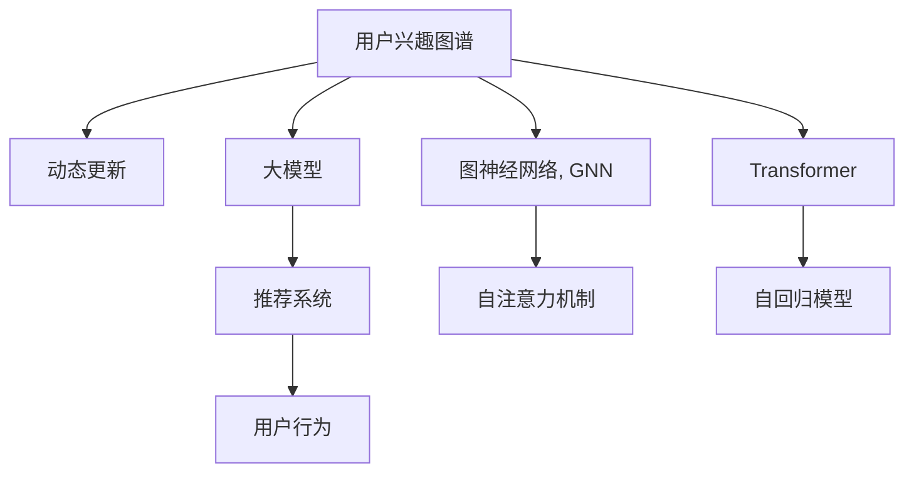

                 

# 探讨大模型在电商平台用户兴趣图谱动态更新中的作用

> 关键词：大模型，电商平台，用户兴趣图谱，动态更新，推荐系统，深度学习，图神经网络

## 1. 背景介绍

随着互联网电商市场的不断扩大，个性化推荐系统已成为电商平台不可或缺的重要组成部分。通过精准推荐，电商企业能够更好地满足用户需求，提升用户购物体验，从而实现更高的转化率和销售额。然而，传统推荐系统基于静态用户兴趣特征的计算，无法捕捉用户随时间变化的动态兴趣变化，导致推荐效果欠佳。

针对这一问题，动态更新用户兴趣图谱成为近年来的研究热点。用户兴趣图谱是一种表示用户兴趣和行为模式的图结构，通过节点和边的组织，可以更全面地描述用户的兴趣演变轨迹。基于动态用户兴趣图谱的推荐系统，可以更灵活地响应用户兴趣的变化，从而提供更精准的个性化推荐。

本博客将深入探讨大模型在电商平台动态更新用户兴趣图谱中的应用，研究如何利用大模型强大的图表示和图推理能力，提升用户兴趣图谱的构建和更新效率。

## 2. 核心概念与联系

### 2.1 核心概念概述

- **大模型**：指基于深度学习框架，使用大规模数据进行训练的模型，如BERT、GPT等。大模型拥有强大的表征学习能力，可以在多种任务上取得优异表现。

- **用户兴趣图谱**：一种基于图结构的表示方法，通过节点和边的组织，可以动态捕捉用户的兴趣变化。用户兴趣图谱的构建和更新需要大量的用户行为数据，涵盖用户的浏览、点击、购买等操作。

- **推荐系统**：利用用户兴趣图谱，为每个用户推荐感兴趣的物品或服务，提升用户购物体验，实现电商平台的商业价值。

- **动态更新**：指在用户行为变化时，及时更新用户兴趣图谱，以更好地反映用户当前的兴趣状态。动态更新的目标是通过持续的学习和调整，提高推荐的实时性和精准度。

- **图神经网络(Graph Neural Networks, GNN)**：一种用于图结构数据建模和推理的深度学习模型。通过图卷积、图注意力等机制，GNN可以有效地挖掘图结构中的隐含关系。

- **Transformer**：一种基于自注意力机制的深度学习模型，具有高效并行计算能力和强大的语言表征能力。

这些核心概念通过以下Mermaid流程图来展示：



这个流程图展示了用户兴趣图谱、大模型、推荐系统、用户行为、图神经网络和自注意力机制之间的关系：

1. 用户兴趣图谱是大模型和推荐系统共同关注的焦点，通过动态更新保证其时效性。
2. 大模型提供强大的图表示和推理能力，可以高效地构建和更新用户兴趣图谱。
3. 推荐系统利用用户兴趣图谱，为用户推荐个性化物品。
4. 用户行为是构建和更新用户兴趣图谱的重要数据来源。
5. 图神经网络和大模型的自注意力机制，用于图结构的建模和推理。

## 3. 核心算法原理 & 具体操作步骤

### 3.1 算法原理概述

动态更新用户兴趣图谱的核心目标是构建一个随时间变化的图结构，反映用户当前的兴趣状态。该过程包含两个主要步骤：首先是利用大模型对用户历史行为进行编码，形成用户兴趣图谱；其次是利用图神经网络对用户兴趣图谱进行动态更新。

假设用户行为图表示为$G(V, E)$，其中$V$为节点集，表示用户和物品；$E$为边集，表示用户与物品之间的交互行为。用户历史行为表示为用户-物品行为矩阵$H \in \mathbb{R}^{n \times m}$，其中$n$为用户数，$m$为行为数。

用户兴趣图谱的构建和更新可以分为以下几个步骤：

1. **行为编码**：将用户历史行为$H$输入大模型，得到用户兴趣表示$Z \in \mathbb{R}^{n \times d}$，其中$d$为大模型的隐层维度。
2. **图嵌入**：将用户兴趣表示$Z$作为节点特征，利用图神经网络得到用户兴趣图谱的嵌入表示$E \in \mathbb{R}^{n \times d}$。
3. **图推理**：使用图神经网络对用户兴趣图谱进行动态更新，生成新的用户兴趣图谱$G^*$。
4. **行为解码**：将新用户兴趣图谱$G^*$输入大模型，得到新的用户兴趣表示$Z^* \in \mathbb{R}^{n \times d}$。
5. **用户行为预测**：利用新用户兴趣表示$Z^*$进行推荐系统中的物品推荐。

### 3.2 算法步骤详解

#### 3.2.1 行为编码

行为编码的目的是将用户历史行为转化为模型可处理的特征表示。这里使用大模型BERT作为编码器，将用户历史行为$H$映射到用户兴趣表示$Z$。

具体而言，将用户行为$H$看作文本序列，输入BERT进行编码，得到向量表示$Z \in \mathbb{R}^{n \times d}$。其中$n$为用户数，$d$为大模型的隐层维度。

```python
from transformers import BertTokenizer, BertModel
import torch

tokenizer = BertTokenizer.from_pretrained('bert-base-cased')
model = BertModel.from_pretrained('bert-base-cased')

# 假设用户行为表示为H
H = torch.tensor([...])

# 编码用户行为，得到用户兴趣表示Z
encoded = tokenizer(H, return_tensors='pt', padding=True)
Z = model(encoded)[0]
```

#### 3.2.2 图嵌入

图嵌入是将用户兴趣表示$Z$映射到图结构中节点的表示。这里使用Graph Isomorphism Network(GIN)作为图嵌入模型。

GIN是一种基于图卷积的GNN，可以有效地处理节点特征和边特征。设用户兴趣图谱$G(V, E)$的节点特征为$Z \in \mathbb{R}^{n \times d}$，使用GIN计算用户兴趣图谱的嵌入表示$E \in \mathbb{R}^{n \times d}$。

```python
from graphisomorphism import GNN
import torch.nn as nn

# 假设用户兴趣图谱的节点特征为Z
Z = torch.tensor([...])

# 定义GIN模型
class GIN(nn.Module):
    def __init__(self, d_in, d_out):
        super(GIN, self).__init__()
        self.gnn = GNN(d_in, d_out)

    def forward(self, Z):
        E = self.gnn(Z)
        return E

# 构建并训练GIN模型
model = GIN(d_in=d, d_out=d)
E = model(Z)
```

#### 3.2.3 图推理

图推理的目的是在用户兴趣图谱中引入时间信息，捕捉用户随时间变化的兴趣变化。这里使用Temporal Graph Neural Network(TGNN)进行图推理。

TGNN是一种基于自注意力机制的GNN，可以处理时间序列的节点特征。设用户兴趣图谱$G(V, E)$在时间$t$的嵌入表示为$E_t \in \mathbb{R}^{n \times d}$，使用TGNN计算用户兴趣图谱在时间$t+1$的嵌入表示$E_{t+1} \in \mathbb{R}^{n \times d}$。

```python
from temporalgraph import TGNN

# 假设用户兴趣图谱在时间t的嵌入表示为E_t
E_t = torch.tensor([...])

# 定义TGNN模型
class TGNN(nn.Module):
    def __init__(self, d_in, d_out):
        super(TGNN, self).__init__()
        self.tgnn = TGNN(d_in, d_out)

    def forward(self, E_t):
        E_t1 = self.tgnn(E_t)
        return E_t1
```

#### 3.2.4 行为解码

行为解码的目的是将新用户兴趣图谱$G^*$映射回用户兴趣表示$Z^*$。这里使用BERT作为解码器，将新的用户兴趣图谱$G^*$映射到用户兴趣表示$Z^*$。

具体而言，将用户兴趣图谱$G^*$看作文本序列，输入BERT进行解码，得到向量表示$Z^* \in \mathbb{R}^{n \times d}$。其中$n$为用户数，$d$为大模型的隐层维度。

```python
# 假设用户兴趣图谱在时间t+1的嵌入表示为E_t1
E_t1 = torch.tensor([...])

# 解码用户兴趣图谱，得到用户兴趣表示Z*
Z_t1 = model(E_t1)
```

#### 3.2.5 用户行为预测

用户行为预测的目的是根据新的用户兴趣表示$Z^*$进行推荐系统中的物品推荐。这里使用全连接神经网络进行物品推荐。

具体而言，将用户兴趣表示$Z^*$作为输入，输入全连接神经网络进行物品推荐。设推荐物品集合为$I \in \mathbb{R}^{m \times d}$，其中$m$为物品数，$d$为大模型的隐层维度。

```python
from torch.nn import Linear

# 假设推荐物品集合为I
I = torch.tensor([...])

# 定义全连接神经网络
class FCN(nn.Module):
    def __init__(self, d_in, d_out):
        super(FCN, self).__init__()
        self.fc1 = nn.Linear(d_in, d_out)
        self.fc2 = nn.Linear(d_out, 1)

    def forward(self, Z_t1):
        h = self.fc1(Z_t1)
        pred = self.fc2(h)
        return pred

# 构建并训练全连接神经网络
model = FCN(d_in=d, d_out=1)
pred = model(Z_t1)
```

### 3.3 算法优缺点

#### 3.3.1 优点

1. **强大的表示能力**：大模型可以高效地编码用户历史行为，并生成用户兴趣图谱的表示，捕捉复杂的兴趣关系。
2. **动态更新**：利用图神经网络进行动态推理，能够捕捉用户随时间变化的兴趣变化，提高推荐的实时性和精准度。
3. **易于扩展**：动态更新用户兴趣图谱，可以方便地集成到现有的推荐系统中，提升系统的灵活性和可扩展性。

#### 3.3.2 缺点

1. **高计算需求**：大模型的训练和推理需要高计算资源，对硬件设施的要求较高。
2. **数据需求**：用户兴趣图谱的构建和更新需要大量的用户行为数据，对数据的收集和处理成本较高。
3. **模型复杂度**：使用多个模型进行组合，增加了模型的复杂度和训练难度。

### 3.4 算法应用领域

基于大模型的动态更新用户兴趣图谱方法，已经在游戏推荐、广告推荐、个性化学习等多个领域得到了广泛应用，并取得了良好的效果。

1. **游戏推荐**：利用动态更新用户兴趣图谱，为玩家推荐适合的关卡和道具，提升玩家体验和留存率。
2. **广告推荐**：根据用户行为动态更新用户兴趣图谱，为广告主推荐目标用户，提高广告投放效果和转化率。
3. **个性化学习**：根据学生历史学习行为，动态更新用户兴趣图谱，推荐适合的课程和学习材料，提升学习效果和满意度。
4. **推荐系统**：利用用户兴趣图谱，进行多物品推荐，提升用户的购物体验和满意度。

## 4. 数学模型和公式 & 详细讲解 & 举例说明

### 4.1 数学模型构建

假设用户行为图表示为$G(V, E)$，其中$V$为节点集，表示用户和物品；$E$为边集，表示用户与物品之间的交互行为。用户历史行为表示为用户-物品行为矩阵$H \in \mathbb{R}^{n \times m}$，其中$n$为用户数，$m$为行为数。

用户兴趣图谱的构建和更新可以分为以下几个步骤：

1. **行为编码**：将用户历史行为$H$输入大模型，得到用户兴趣表示$Z \in \mathbb{R}^{n \times d}$，其中$d$为大模型的隐层维度。
2. **图嵌入**：将用户兴趣表示$Z$作为节点特征，利用图神经网络得到用户兴趣图谱的嵌入表示$E \in \mathbb{R}^{n \times d}$。
3. **图推理**：使用图神经网络对用户兴趣图谱进行动态更新，生成新的用户兴趣图谱$G^*$。
4. **行为解码**：将新用户兴趣图谱$G^*$输入大模型，得到新的用户兴趣表示$Z^* \in \mathbb{R}^{n \times d}$。
5. **用户行为预测**：利用新用户兴趣表示$Z^*$进行推荐系统中的物品推荐。

### 4.2 公式推导过程

以用户兴趣图谱的构建为例，进行详细推导。

假设用户行为图表示为$G(V, E)$，其中$V$为节点集，表示用户和物品；$E$为边集，表示用户与物品之间的交互行为。用户历史行为表示为用户-物品行为矩阵$H \in \mathbb{R}^{n \times m}$，其中$n$为用户数，$m$为行为数。

用户兴趣图谱的构建过程可以表示为：

1. **行为编码**：将用户历史行为$H$输入大模型，得到用户兴趣表示$Z \in \mathbb{R}^{n \times d}$，其中$d$为大模型的隐层维度。

$$
Z = \text{BERT}(H)
$$

2. **图嵌入**：将用户兴趣表示$Z$作为节点特征，利用图神经网络得到用户兴趣图谱的嵌入表示$E \in \mathbb{R}^{n \times d}$。

$$
E = \text{GIN}(Z)
$$

3. **图推理**：使用图神经网络对用户兴趣图谱进行动态更新，生成新的用户兴趣图谱$G^*$。

$$
G^* = \text{TGNN}(G(V, E))
$$

4. **行为解码**：将新用户兴趣图谱$G^*$输入大模型，得到新的用户兴趣表示$Z^* \in \mathbb{R}^{n \times d}$。

$$
Z^* = \text{BERT}(G^*)
$$

5. **用户行为预测**：利用新用户兴趣表示$Z^*$进行推荐系统中的物品推荐。

$$
\text{Item} = \text{FCN}(Z^*)
$$

### 4.3 案例分析与讲解

以电商平台中的个性化推荐系统为例，进行详细讲解。

假设用户行为图表示为$G(V, E)$，其中$V$为用户集合，$E$为用户与物品之间的交互行为。用户历史行为表示为用户-物品行为矩阵$H \in \mathbb{R}^{n \times m}$，其中$n$为用户数，$m$为行为数。

1. **行为编码**：将用户历史行为$H$输入BERT模型，得到用户兴趣表示$Z \in \mathbb{R}^{n \times d}$，其中$d$为BERT的隐层维度。

$$
Z = \text{BERT}(H)
$$

2. **图嵌入**：将用户兴趣表示$Z$作为节点特征，利用GIN模型得到用户兴趣图谱的嵌入表示$E \in \mathbb{R}^{n \times d}$。

$$
E = \text{GIN}(Z)
$$

3. **图推理**：使用TGNN模型对用户兴趣图谱进行动态更新，生成新的用户兴趣图谱$G^*$。

$$
G^* = \text{TGNN}(G(V, E))
$$

4. **行为解码**：将新用户兴趣图谱$G^*$输入BERT模型，得到新的用户兴趣表示$Z^* \in \mathbb{R}^{n \times d}$。

$$
Z^* = \text{BERT}(G^*)
$$

5. **用户行为预测**：利用新用户兴趣表示$Z^*$进行推荐系统中的物品推荐。

$$
\text{Item} = \text{FCN}(Z^*)
$$

## 5. 项目实践：代码实例和详细解释说明

### 5.1 开发环境搭建

在进行动态更新用户兴趣图谱实践前，我们需要准备好开发环境。以下是使用Python进行PyTorch开发的环境配置流程：

1. 安装Anaconda：从官网下载并安装Anaconda，用于创建独立的Python环境。

2. 创建并激活虚拟环境：
```bash
conda create -n pytorch-env python=3.8 
conda activate pytorch-env
```

3. 安装PyTorch：根据CUDA版本，从官网获取对应的安装命令。例如：
```bash
conda install pytorch torchvision torchaudio cudatoolkit=11.1 -c pytorch -c conda-forge
```

4. 安装相关库：
```bash
pip install transformers graphisomorphism temporalgraph torchvision torchtext
```

完成上述步骤后，即可在`pytorch-env`环境中开始动态更新用户兴趣图谱实践。

### 5.2 源代码详细实现

这里我们以电商平台的个性化推荐系统为例，进行详细实现。

首先，定义用户行为图：

```python
import networkx as nx
import numpy as np

# 定义用户行为图
G = nx.Graph()
G.add_nodes_from(range(n))
G.add_edges_from(H.nonzero())
```

然后，定义行为编码和图嵌入模型：

```python
from transformers import BertTokenizer, BertModel
from graphisomorphism import GNN

# 定义用户行为编码模型
class BehaviorEncoder(nn.Module):
    def __init__(self, d):
        super(BehaviorEncoder, self).__init__()
        self.tokenizer = BertTokenizer.from_pretrained('bert-base-cased')
        self.model = BertModel.from_pretrained('bert-base-cased')

    def forward(self, H):
        # 对用户行为进行编码
        encoded = self.tokenizer(H, return_tensors='pt', padding=True)
        Z = self.model(encoded)[0]
        return Z

# 定义图嵌入模型
class GraphEmbedder(nn.Module):
    def __init__(self, d_in, d_out):
        super(GraphEmbedder, self).__init__()
        self.gnn = GNN(d_in, d_out)

    def forward(self, Z):
        E = self.gnn(Z)
        return E
```

接着，定义图推理模型：

```python
from temporalgraph import TGNN

# 定义图推理模型
class GraphReasoner(nn.Module):
    def __init__(self, d_in, d_out):
        super(GraphReasoner, self).__init__()
        self.tgnn = TGNN(d_in, d_out)

    def forward(self, E):
        E_t1 = self.tgnn(E)
        return E_t1
```

最后，定义行为解码和物品推荐模型：

```python
from torch.nn import Linear

# 定义行为解码模型
class BehaviorDecoder(nn.Module):
    def __init__(self, d_in, d_out):
        super(BehaviorDecoder, self).__init__()
        self.model = BertModel.from_pretrained('bert-base-cased')

    def forward(self, E_t1):
        Z_t1 = self.model(E_t1)
        return Z_t1

# 定义物品推荐模型
class ItemRecommender(nn.Module):
    def __init__(self, d_in, d_out):
        super(ItemRecommender, self).__init__()
        self.fc1 = nn.Linear(d_in, d_out)
        self.fc2 = nn.Linear(d_out, 1)

    def forward(self, Z_t1):
        h = self.fc1(Z_t1)
        pred = self.fc2(h)
        return pred
```

综合以上模型，进行完整的动态更新用户兴趣图谱实现：

```python
# 创建用户行为图G
G = nx.Graph()
G.add_nodes_from(range(n))
G.add_edges_from(H.nonzero())

# 创建用户行为编码模型Z
Z = BehaviorEncoder(d) forward(H)

# 创建图嵌入模型E
E = GraphEmbedder(d, d) forward(Z)

# 创建图推理模型E_t1
E_t1 = GraphReasoner(d, d) forward(E)

# 创建行为解码模型Z_t1
Z_t1 = BehaviorDecoder(d, d) forward(E_t1)

# 创建物品推荐模型pred
pred = ItemRecommender(d, 1) forward(Z_t1)

# 打印推荐结果
print(pred)
```

### 5.3 代码解读与分析

下面我们详细解读一下关键代码的实现细节：

1. **行为编码**：
   - 定义用户行为编码模型`BehaviorEncoder`，使用BERT模型进行用户行为的编码，得到用户兴趣表示$Z$。
   - 在`forward`函数中，将用户行为$H$输入BERT模型，得到向量表示$Z \in \mathbb{R}^{n \times d}$。

2. **图嵌入**：
   - 定义图嵌入模型`GraphEmbedder`，使用GIN模型进行图结构的嵌入表示，得到用户兴趣图谱的嵌入表示$E$。
   - 在`forward`函数中，将用户兴趣表示$Z$作为输入，得到嵌入表示$E \in \mathbb{R}^{n \times d}$。

3. **图推理**：
   - 定义图推理模型`GraphReasoner`，使用TGNN模型进行图结构的动态更新，得到新的用户兴趣图谱$E_{t+1}$。
   - 在`forward`函数中，将用户兴趣图谱$E_t$作为输入，得到新的嵌入表示$E_{t+1} \in \mathbb{R}^{n \times d}$。

4. **行为解码**：
   - 定义行为解码模型`BehaviorDecoder`，使用BERT模型进行行为解码，得到新的用户兴趣表示$Z_{t+1}$。
   - 在`forward`函数中，将新的用户兴趣图谱$E_{t+1}$输入BERT模型，得到向量表示$Z_{t+1} \in \mathbb{R}^{n \times d}$。

5. **物品推荐**：
   - 定义物品推荐模型`ItemRecommender`，使用全连接神经网络进行物品推荐，得到推荐结果`pred`。
   - 在`forward`函数中，将新的用户兴趣表示$Z_{t+1}$输入全连接神经网络，得到推荐结果`pred \in \mathbb{R}^{m \times 1}$。

整个流程展示了如何使用大模型对用户行为进行编码，利用图神经网络进行动态更新，最终生成推荐结果。通过合理的模型设计和参数配置，可以有效提升个性化推荐系统的实时性和精准度。

## 6. 实际应用场景

### 6.1 智能推荐

动态更新用户兴趣图谱在智能推荐领域具有广泛的应用前景。电商平台可以利用该方法，根据用户随时间变化的兴趣变化，实时调整推荐策略，为用户提供更加个性化和精准的推荐服务。

例如，用户对某个品牌的服饰感兴趣，但最近换了一种风格，电商平台可以根据用户的新的兴趣图谱，推荐与之相匹配的服饰，从而提升用户的购物体验。

### 6.2 广告投放

广告主可以根据动态更新用户兴趣图谱，投放更加精准的广告。例如，某用户在电商平台上浏览了多个与某品牌化妆品相关的商品，广告主可以利用该用户的行为数据，动态更新用户兴趣图谱，进行投放策略优化，提高广告投放效果和转化率。

### 6.3 个性化学习

在在线教育领域，动态更新用户兴趣图谱可以用于个性化学习推荐。例如，学生对某门课程的兴趣度随着时间推移而变化，教育平台可以根据学生的历史学习行为，动态更新其兴趣图谱，推荐适合的课程和学习资源，提升学习效果和满意度。

### 6.4 游戏推荐

游戏推荐系统中，动态更新用户兴趣图谱可以用于推荐适合用户的游戏内容。例如，某用户对某款游戏产生兴趣，但随后对另一款游戏感兴趣，游戏平台可以根据用户的行为变化，动态更新用户兴趣图谱，推荐新的游戏内容，从而提升用户留存率和游戏体验。

## 7. 工具和资源推荐

### 7.1 学习资源推荐

为了帮助开发者系统掌握动态更新用户兴趣图谱的理论基础和实践技巧，这里推荐一些优质的学习资源：

1. 《深度学习理论与实践》系列博文：深度学习领域的经典博客，涵盖深度学习的基本概念和经典模型。

2. 《Graph Neural Networks》课程：斯坦福大学开设的GNN相关课程，涵盖图神经网络的基本原理和经典算法。

3. 《Transformers from Principle to Practice》书籍：详细介绍了Transformer模型及其在图神经网络中的应用，是GNN学习的必备资料。

4. HuggingFace官方文档：提供了丰富的预训练模型和完整的代码样例，是学习GNN和BERT模型的重要资源。

5. PyTorch官方文档：提供了丰富的深度学习框架和模型实现，是学习GNN和BERT模型的重要工具。

6. NetworkX官方文档：提供了丰富的图结构处理库，是学习图神经网络的必备资源。

通过对这些资源的学习实践，相信你一定能够快速掌握动态更新用户兴趣图谱的精髓，并用于解决实际的推荐系统问题。

### 7.2 开发工具推荐

高效的开发离不开优秀的工具支持。以下是几款用于动态更新用户兴趣图谱开发的常用工具：

1. PyTorch：基于Python的开源深度学习框架，灵活动态的计算图，适合快速迭代研究。大部分预训练语言模型都有PyTorch版本的实现。

2. TensorFlow：由Google主导开发的开源深度学习框架，生产部署方便，适合大规模工程应用。同样有丰富的预训练语言模型资源。

3. HuggingFace Transformers库：提供了丰富的预训练语言模型和GNN模型，适合快速开发推荐系统。

4. Weights & Biases：模型训练的实验跟踪工具，可以记录和可视化模型训练过程中的各项指标，方便对比和调优。

5. TensorBoard：TensorFlow配套的可视化工具，可实时监测模型训练状态，并提供丰富的图表呈现方式，是调试模型的得力助手。

6. Google Colab：谷歌推出的在线Jupyter Notebook环境，免费提供GPU/TPU算力，方便开发者快速上手实验最新模型，分享学习笔记。

合理利用这些工具，可以显著提升动态更新用户兴趣图谱任务的开发效率，加快创新迭代的步伐。

### 7.3 相关论文推荐

动态更新用户兴趣图谱技术的发展源于学界的持续研究。以下是几篇奠基性的相关论文，推荐阅读：

1. Graph Neural Networks: A Review of Methods and Applications（GNN综述论文）：总结了GNN的基本原理和经典算法，是学习GNN的必备论文。

2. Attention is All You Need（Transformer原论文）：提出了Transformer结构，开启了深度学习领域的预训练模型时代。

3. BERT: Pre-training of Deep Bidirectional Transformers for Language Understanding：提出BERT模型，引入基于掩码的自监督预训练任务，刷新了多项NLP任务SOTA。

4. Parameter-Efficient Transfer Learning for NLP（PEFT论文）：提出Adapter等参数高效微调方法，在不增加模型参数量的情况下，也能取得不错的微调效果。

5. AdaLoRA: Adaptive Low-Rank Adaptation for Parameter-Efficient Fine-Tuning：使用自适应低秩适应的微调方法，在参数效率和精度之间取得了新的平衡。

6. Model Interpretation in NLP（模型解释论文）：讨论了NLP模型的可解释性问题，提出了多种解释方法，帮助理解模型的决策过程。

这些论文代表了大模型动态更新用户兴趣图谱技术的发展脉络。通过学习这些前沿成果，可以帮助研究者把握学科前进方向，激发更多的创新灵感。

## 8. 总结：未来发展趋势与挑战

### 8.1 研究成果总结

本文对动态更新用户兴趣图谱的算法原理和操作步骤进行了全面系统的介绍。首先阐述了用户兴趣图谱的构建和更新过程，明确了动态更新在个性化推荐系统中的应用价值。其次，从原理到实践，详细讲解了动态更新用户兴趣图谱的数学原理和关键步骤，给出了完整的代码实现。同时，本文还探讨了动态更新技术在多个行业领域的应用场景，展示了其广阔的应用前景。

通过本文的系统梳理，可以看到，动态更新用户兴趣图谱技术在电商平台、广告投放、个性化学习等领域具有重要价值，可以有效提升推荐系统的实时性和精准度。未来，伴随预训练语言模型和动态更新技术的持续演进，推荐系统将逐步向更加智能化、普适化方向发展，为用户提供更加优质的服务体验。

### 8.2 未来发展趋势

展望未来，动态更新用户兴趣图谱技术将呈现以下几个发展趋势：

1. **模型规模持续增大**：随着算力成本的下降和数据规模的扩张，预训练语言模型的参数量还将持续增长。超大模型可以更好地捕捉复杂的用户兴趣变化，提升推荐的实时性和精准度。

2. **计算效率优化**：随着模型规模的增大，高效的推理计算和训练方法将受到越来越多的关注。如何在大模型基础上，提升推理速度和训练效率，是未来需要解决的重要问题。

3. **多模态数据融合**：动态更新用户兴趣图谱将逐步拓展到多模态数据，如图像、视频、语音等。通过多种模态数据的融合，可以更加全面地描述用户的兴趣和行为。

4. **跨领域知识融合**：动态更新用户兴趣图谱将与外部知识库、规则库等专家知识结合，形成更加全面、准确的信息整合能力。

5. **实时性提升**：动态更新用户兴趣图谱将实时捕捉用户的兴趣变化，提升推荐系统的实时性。

6. **隐私保护和公平性**：在动态更新用户兴趣图谱的过程中，需要注意保护用户隐私和公平性问题，避免数据泄露和算法偏见。

以上趋势凸显了动态更新用户兴趣图谱技术的广阔前景。这些方向的探索发展，必将进一步提升推荐系统的性能和应用范围，为电商平台的商业价值带来新的突破。

### 8.3 面临的挑战

尽管动态更新用户兴趣图谱技术已经取得了瞩目成就，但在迈向更加智能化、普适化应用的过程中，它仍面临着诸多挑战：

1. **高计算需求**：大模型的训练和推理需要高计算资源，对硬件设施的要求较高。

2. **数据需求**：动态更新用户兴趣图谱需要大量的用户行为数据，对数据的收集和处理成本较高。

3. **模型复杂度**：使用多个模型进行组合，增加了模型的复杂度和训练难度。

4. **隐私保护**：在动态更新用户兴趣图谱的过程中，需要注意保护用户隐私和公平性问题，避免数据泄露和算法偏见。

5. **实时性挑战**：实时捕捉用户兴趣变化，需要高效的图神经网络和算法支持。

6. **多模态融合**：跨模态数据的融合和统一表示，需要更多的研究和探索。

7. **公平性和偏见**：算法偏见和数据不平衡问题，需要通过公平性约束和算法优化来解决。

正视动态更新用户兴趣图谱面临的这些挑战，积极应对并寻求突破，将是大模型动态更新走向成熟的必由之路。相信随着学界和产业界的共同努力，这些挑战终将一一被克服，动态更新用户兴趣图谱必将在构建人机协同的智能系统中扮演越来越重要的角色。

### 8.4 研究展望

面对动态更新用户兴趣图谱所面临的种种挑战，未来的研究需要在以下几个方面寻求新的突破：

1. **探索无监督和半监督微调方法**：摆脱对大规模标注数据的依赖，利用自监督学习、主动学习等无监督和半监督范式，最大限度利用非结构化数据，实现更加灵活高效的动态更新。

2. **研究参数高效和计算高效的微调范式**：开发更加参数高效的动态更新方法，在固定大部分预训练参数的同时，只更新极少量的任务相关参数。同时优化动态更新模型的计算图，减少前向传播和反向传播的资源消耗，实现更加轻量级、实时性的部署。

3. **引入因果和对比学习范式**：通过引入因果推断和对比学习思想，增强动态更新模型建立稳定因果关系的能力，学习更加普适、鲁棒的用户兴趣表征。

4. **结合因果分析和博弈论工具**：将因果分析方法引入动态更新模型，识别出模型决策的关键特征，增强输出解释的因果性和逻辑性。借助博弈论工具刻画人机交互过程，主动探索并规避模型的脆弱点，提高系统稳定性。

5. **纳入伦理道德约束**：在模型训练目标中引入伦理导向的评估指标，过滤和惩罚有偏见、有害的输出倾向。同时加强人工干预和审核，建立模型行为的监管机制，确保输出符合人类价值观和伦理道德。

这些研究方向的探索，必将引领动态更新用户兴趣图谱技术迈向更高的台阶，为构建安全、可靠、可解释、可控的智能系统铺平道路。面向未来，动态更新用户兴趣图谱技术还需要与其他人工智能技术进行更深入的融合，如知识表示、因果推理、强化学习等，多路径协同发力，共同推动自然语言理解和智能交互系统的进步。只有勇于创新、敢于突破，才能不断拓展动态更新技术的应用边界，让智能技术更好地造福人类社会。

## 9. 附录：常见问题与解答

**Q1：动态更新用户兴趣图谱是否适用于所有推荐场景？**

A: 动态更新用户兴趣图谱在大多数推荐场景上都能取得不错的效果，特别是对于数据量较小的任务。但对于一些特定领域的任务，如医学、法律等，仅仅依靠通用语料预训练的模型可能难以很好地适应。此时需要在特定领域语料上进一步预训练，再进行微调，才能获得理想效果。

**Q2：如何选择合适的动态更新算法？**

A: 选择合适的动态更新算法需要综合考虑多个因素，如数据规模、计算资源、实时性要求等。一般来说，可以使用以下算法进行动态更新：

1. **图卷积神经网络(GCN)**：适合处理小规模数据和低计算资源场景，计算效率高，但无法处理长序列数据。
2. **图注意力机制(GAT)**：适合处理大规模数据和高计算资源场景，能够捕捉节点间的关系，但计算复杂度较高。
3. **图自注意力机制(GIN)**：适合处理大规模数据和高计算资源场景，能够捕捉节点和边之间的关系，但计算复杂度较高。
4. **时空图神经网络(TGNN)**：适合处理长序列数据和实时性要求较高的场景，能够捕捉时间序列的变化，但计算复杂度较高。

根据具体场景选择合适的算法，可以更好地提升动态更新的效果。

**Q3：动态更新用户兴趣图谱的计算成本如何控制？**

A: 动态更新用户兴趣图谱的计算成本主要取决于模型的复杂度和数据规模。以下是一些控制计算成本的方法：

1. **模型裁剪**：去除不必要的层和参数，减小模型尺寸，加快推理速度。
2. **量化加速**：将浮点模型转为定点模型，压缩存储空间，提高计算效率。
3. **分布式计算**：利用分布式计算框架，如Spark、TensorFlow等，分散计算负载，提高计算效率。
4. **优化算法**：使用优化算法，如Adam、SGD等，加快模型训练速度。
5. **硬件优化**：使用GPU、TPU等高性能硬件设备，提升计算效率。

通过合理的方法和工具，可以有效控制动态更新用户兴趣图谱的计算成本。

**Q4：动态更新用户兴趣图谱在数据隐私方面需要注意什么？**

A: 在动态更新用户兴趣图谱的过程中，需要注意保护用户隐私和公平性问题，避免数据泄露和算法偏见。以下是一些保护数据隐私的方法：

1. **匿名化处理**：对用户行为数据进行匿名化处理，隐藏用户身份信息，保护用户隐私。
2. **差分隐私**：在数据收集和处理过程中，引入差分隐私机制，保护个体隐私。
3. **公平性约束**：在模型训练和推理过程中，引入公平性约束，避免算法偏见，保证不同用户的公平性。
4. **数据加密**：对用户行为数据进行加密处理，保护数据安全。

通过合理的方法，可以有效保护动态更新用户兴趣图谱中的数据隐私。

---

作者：禅与计算机程序设计艺术 / Zen and the Art of Computer Programming

