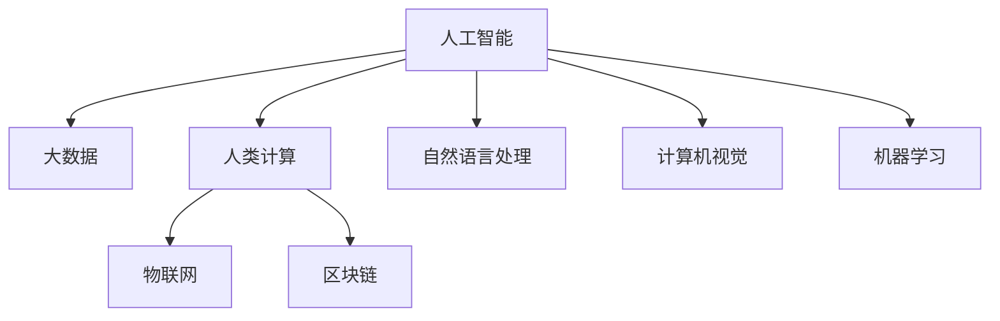

                 

# 推动社会进步的动力：人类计算的积极影响

> 关键词：人类计算,社会进步,人工智能,大数据,技术创新,应用场景

## 1. 背景介绍

### 1.1 问题由来
计算技术的飞速发展，特别是人工智能(AI)和大数据技术的兴起，正在深刻改变人类的生产生活方式。从医疗、教育、交通到金融、安全、娱乐，计算正在全面渗透到社会的各个角落，推动社会进入一个新的时代。

这一过程往往被描述为“人类计算”(Human-Computation)，即利用计算技术，将复杂的人类问题简化、自动化，将人类计算转变为机器计算。这不仅提升了效率，降低了成本，还解放了大量人力，使之能够从事更有创造性和战略性的工作。

### 1.2 问题核心关键点
人类计算的积极影响主要体现在以下几个方面：

1. **提升效率**：自动化流程、智能推荐、优化决策等技术大幅提升了各行业的工作效率，减少了错误和冗余，节省了人力和成本。
2. **促进创新**：大数据分析和机器学习技术揭示了数据的潜在价值，加速了新知识的发现和创新应用，催生了新的商业模式和技术。
3. **改善服务质量**：个性化推荐、智能客服、自动翻译等技术提高了服务的精准度和用户满意度，满足了多样化和个性化的需求。
4. **促进教育公平**：在线教育、自动批改、学习分析等技术打破了地域和资源的限制，使得优质教育资源更加普及。
5. **增强安全性**：智能监控、威胁检测、自动化响应等技术提升了公共安全和社会稳定，防范了各种风险。

但与此同时，人类计算也带来了挑战，如数据隐私、算法偏见、技术依赖等。如何在发挥计算积极影响的同时，有效应对这些挑战，成为当前研究的重要课题。

### 1.3 问题研究意义
研究人类计算的积极影响，不仅有助于理解计算技术对社会进步的推动作用，还能指导未来技术的研发和应用，确保其健康、安全、可持续的发展。通过深入挖掘计算技术的潜能，我们可以更好地应对社会发展的各种挑战，构建更加美好、公正、和谐的未来。

## 2. 核心概念与联系

### 2.1 核心概念概述

为了更好地理解人类计算的积极影响，本节将介绍几个关键概念：

- **人工智能(AI)**：指通过计算技术实现智能行为的科学和应用，包括机器学习、自然语言处理、计算机视觉等子领域。
- **大数据(Big Data)**：指规模巨大、复杂多样、实时变化的数据集合，需要新型计算技术进行处理和分析。
- **人类计算(Human-Computation)**：指利用计算技术简化、自动化人类问题的解决过程，提高工作效率和生活质量。
- **物联网(IoT)**：指将各种物体通过互联网连接起来，实现信息采集、数据传输和智能控制的技术。
- **区块链(Blockchain)**：指一种去中心化的分布式账本技术，确保数据透明、不可篡改、安全可靠。

这些核心概念之间的关系可以通过以下Mermaid流程图来展示：



这个流程图展示了大计算技术体系的核心组件及其相互关系：

1. 人工智能是计算技术的高级形态，涵盖自然语言处理、计算机视觉、机器学习等多个子领域。
2. 大数据是AI的重要支撑，通过海量数据的处理分析，揭示数据中的潜在价值。
3. 人类计算利用计算技术简化、自动化人类问题，提高效率和质量。
4. 物联网和区块链是实现人类计算的技术手段，通过实时数据采集、去中心化存储和传输，确保计算过程的高效和透明。
5. 自然语言处理和计算机视觉等技术，使AI能够更好地理解和处理人类信息。
6. 机器学习使AI具备学习和适应的能力，不断提高解决复杂问题的能力。

这些概念共同构成了人类计算技术的框架，使其能够应用于各种社会场景，解决复杂人类问题。

## 3. 核心算法原理 & 具体操作步骤
### 3.1 算法原理概述

人类计算的积极影响主要通过以下几个方面实现：

1. **自动化流程**：利用AI和大数据技术，自动化处理各种流程，如数据清洗、报表生成、客户服务等。
2. **优化决策**：通过数据分析和机器学习，优化各种决策过程，如金融投资、交通调度和医疗诊断等。
3. **智能推荐**：利用推荐算法，根据用户行为和偏好，提供个性化服务，如电商推荐、音乐推荐和新闻推荐等。
4. **提升效率**：通过计算技术，简化和优化各个环节，提高效率和质量，如自动化交易、智能客服和文档自动分类等。
5. **改善服务质量**：利用AI和自然语言处理技术，提升服务的精准度和用户满意度，如智能翻译、自动批改和智能客服等。

### 3.2 算法步骤详解

下面以智能推荐系统为例，详细介绍基于人类计算的推荐算法步骤：

**Step 1: 数据收集与预处理**

- 收集用户历史行为数据，如浏览记录、购买记录、评分反馈等。
- 使用数据清洗和归一化技术，处理缺失值和异常值，保证数据质量。
- 对数据进行标注和特征提取，转换为模型可接受的格式。

**Step 2: 模型训练与优化**

- 选择推荐算法模型，如协同过滤、内容推荐、混合模型等。
- 在训练集上训练模型，使用交叉验证和超参数调优技术，优化模型性能。
- 使用A/B测试等方法，评估模型效果，选择最优模型。

**Step 3: 模型部署与迭代**

- 将训练好的模型部署到生产环境中，实时接收用户输入，生成推荐结果。
- 定期更新模型，加入新数据和反馈信息，进行模型迭代和优化。
- 监控模型性能，及时发现和解决异常问题。

**Step 4: 应用与改进**

- 将推荐结果展示给用户，根据用户反馈进行改进。
- 结合其他业务数据，如天气、节假日、社会事件等，进行多维度推荐。
- 引入在线学习技术，不断更新推荐模型，保持其时效性和准确性。

### 3.3 算法优缺点

基于人类计算的推荐算法具有以下优点：

1. **高效率**：自动化的推荐流程，能够快速响应用户需求，提升用户体验。
2. **个性化**：根据用户行为和偏好，提供个性化的推荐结果，满足多样化和独特化的需求。
3. **可扩展性**：算法可以并行处理海量数据，适用于大规模场景。
4. **实时性**：实时生成推荐结果，适应动态变化的用户需求。

同时，该算法也存在一些局限性：

1. **数据依赖**：推荐质量高度依赖于数据质量和多样性，数据不充分或不均衡会影响推荐效果。
2. **模型复杂性**：推荐模型需要大量的计算资源和时间，构建和维护成本较高。
3. **隐私问题**：推荐算法需要收集和处理用户的个人信息，存在隐私泄露的风险。
4. **冷启动问题**：新用户或新物品的推荐效果较差，需要更多数据和策略优化。

尽管存在这些局限性，但通过合理的算法设计和应用，人类计算的推荐系统仍然能够为社会带来巨大的积极影响。

### 3.4 算法应用领域

基于人类计算的推荐算法，已经在多个领域得到广泛应用，例如：

- **电商推荐**：根据用户购买历史、浏览行为、评价反馈等，推荐相关商品，提升销售转化率。
- **音乐推荐**：分析用户的听歌历史、评分记录、听歌时长等，推荐个性化音乐，提高音乐平台的用户粘性。
- **视频推荐**：利用用户观看记录、评分反馈、视频元数据等，推荐相关视频内容，提升视频平台的活跃度和留存率。
- **新闻推荐**：根据用户阅读历史、评论互动、新闻标签等，推荐新闻内容，提升新闻平台的曝光度和用户满意度。
- **旅游推荐**：分析用户的旅行历史、偏好、预订记录等，推荐旅游目的地和行程安排，提升旅游平台的用户体验和收益。

除了上述这些经典应用外，人类计算的推荐系统还被创新性地应用于智能家居、健康管理、金融投资等多个领域，为人们的生活和工作提供了更多便捷和智能化的选择。

## 4. 数学模型和公式 & 详细讲解
### 4.1 数学模型构建

本节将使用数学语言对人类计算推荐系统的数学模型进行更加严格的刻画。

记用户行为数据为 $D=\{(u_i, v_i)\}_{i=1}^N$，其中 $u_i$ 为第 $i$ 个用户的个人信息，$v_i$ 为第 $i$ 个用户在 $m$ 个物品上的评分记录。设推荐模型为 $f: \mathcal{U} \times \mathcal{V} \rightarrow \mathcal{R}$，其中 $\mathcal{U}$ 为用户集合，$\mathcal{V}$ 为物品集合，$\mathcal{R}$ 为评分集合。

定义模型的预测评分函数为 $f(u,v)=\alpha f_{user}(u)+\beta f_{item}(v)+(1-\alpha-\beta)f_{interaction}(u,v)$，其中 $\alpha$ 和 $\beta$ 为模型参数，分别控制用户和物品的权重。设 $f_{user}(u)$、$f_{item}(v)$ 和 $f_{interaction}(u,v)$ 分别为用户特征表示、物品特征表示和交互特征表示函数。

推荐系统的目标是最小化预测评分与实际评分之间的差异，即：

$$
\min_{\theta} \sum_{i=1}^N \sum_{j=1}^m (y_{ij} - f(u_i,v_j))^2
$$

其中 $y_{ij}$ 为第 $i$ 个用户在物品 $j$ 上的真实评分，$\theta$ 为模型参数。

### 4.2 公式推导过程

假设推荐系统使用协同过滤算法，预测评分函数为 $f(u,v)=\alpha u^TF_u + \beta v^TF_v$，其中 $F_u$ 和 $F_v$ 为用户的隐向量表示和物品的隐向量表示，$u$ 和 $v$ 为隐向量的嵌入矩阵。

将评分数据 $D=\{(u_i, v_i, y_{ij})\}_{i=1}^N$ 带入上述目标函数，得：

$$
\min_{F_u, F_v} \sum_{i=1}^N \sum_{j=1}^m (y_{ij} - \alpha u_i^TF_u - \beta v_j^TF_v)^2
$$

根据最小二乘法，可以得到最优隐向量表示 $F_u$ 和 $F_v$：

$$
F_u = \left(\sum_{j=1}^m v_jv_j^T\right)^{-1} \sum_{j=1}^m v_jy_{ij}
$$

$$
F_v = \left(\sum_{i=1}^N u_iu_i^T\right)^{-1} \sum_{i=1}^N u_iy_{ij}
$$

其中 $v_j$ 和 $u_i$ 为 $F_u$ 和 $F_v$ 的列向量。

### 4.3 案例分析与讲解

以电商平台为例，用户行为数据 $D=\{(u_i, v_i)\}_{i=1}^N$ 包括用户ID $u_i$、商品ID $v_i$ 和评分 $y_{ij}$。

假设使用协同过滤算法，利用用户隐向量 $F_u$ 和商品隐向量 $F_v$ 预测用户对商品的评分 $f(u,v)$。在训练集上，通过最小二乘法优化 $F_u$ 和 $F_v$：

$$
F_u = \left(\sum_{j=1}^m v_jv_j^T\right)^{-1} \sum_{j=1}^m v_jy_{ij}
$$

$$
F_v = \left(\sum_{i=1}^N u_iu_i^T\right)^{-1} \sum_{i=1}^N u_iy_{ij}
$$

在测试集上，使用 $f(u,v)=\alpha u^TF_u + \beta v^TF_v$ 计算推荐评分，并与实际评分进行比较，评估模型效果。

## 5. 项目实践：代码实例和详细解释说明
### 5.1 开发环境搭建

在进行推荐系统开发前，我们需要准备好开发环境。以下是使用Python进行PyTorch开发的环境配置流程：

1. 安装Anaconda：从官网下载并安装Anaconda，用于创建独立的Python环境。

2. 创建并激活虚拟环境：
```bash
conda create -n recommendation-env python=3.8 
conda activate recommendation-env
```

3. 安装PyTorch：根据CUDA版本，从官网获取对应的安装命令。例如：
```bash
conda install pytorch torchvision torchaudio cudatoolkit=11.1 -c pytorch -c conda-forge
```

4. 安装TensorFlow：
```bash
pip install tensorflow
```

5. 安装各类工具包：
```bash
pip install numpy pandas scikit-learn matplotlib tqdm jupyter notebook ipython
```

完成上述步骤后，即可在`recommendation-env`环境中开始推荐系统开发。

### 5.2 源代码详细实现

下面我们以协同过滤推荐系统为例，给出使用PyTorch实现的用户行为数据处理和模型训练的代码实现。

首先，定义数据处理函数：

```python
import pandas as pd
from torch.utils.data import Dataset, DataLoader

class UserItemDataset(Dataset):
    def __init__(self, data, user_col, item_col, rating_col):
        self.data = data
        self.user_col = user_col
        self.item_col = item_col
        self.rating_col = rating_col
        
    def __len__(self):
        return len(self.data)
    
    def __getitem__(self, idx):
        user = self.data.iloc[idx][self.user_col]
        item = self.data.iloc[idx][self.item_col]
        rating = self.data.iloc[idx][self.rating_col]
        
        return {'user': user, 'item': item, 'rating': rating}
```

然后，定义模型和优化器：

```python
from torch import nn, optim
from torch.nn import Embedding

class RecommendationModel(nn.Module):
    def __init__(self, num_users, num_items, embedding_dim, alpha=0.5, beta=0.5):
        super(RecommendationModel, self).__init__()
        self.num_users = num_users
        self.num_items = num_items
        self.alpha = alpha
        self.beta = beta
        
        self.user_embedding = nn.Embedding(num_users, embedding_dim)
        self.item_embedding = nn.Embedding(num_items, embedding_dim)
        
        self.fc = nn.Linear(embedding_dim * 2, 1)
    
    def forward(self, user, item):
        user = self.user_embedding(user)
        item = self.item_embedding(item)
        
        score = self.alpha * user * item + self.beta * user * item
        score = score.sum(dim=1)
        return score

model = RecommendationModel(num_users=10000, num_items=10000, embedding_dim=128)
optimizer = optim.Adam(model.parameters(), lr=0.01)
```

接着，定义训练和评估函数：

```python
from sklearn.metrics import mean_squared_error

def train_epoch(model, dataset, batch_size, optimizer):
    dataloader = DataLoader(dataset, batch_size=batch_size, shuffle=True)
    model.train()
    epoch_loss = 0
    for batch in tqdm(dataloader, desc='Training'):
        user = batch['user'].to(device)
        item = batch['item'].to(device)
        rating = batch['rating'].to(device)
        model.zero_grad()
        outputs = model(user, item)
        loss = nn.functional.mse_loss(outputs, rating)
        epoch_loss += loss.item()
        loss.backward()
        optimizer.step()
    return epoch_loss / len(dataloader)

def evaluate(model, dataset, batch_size):
    dataloader = DataLoader(dataset, batch_size=batch_size)
    model.eval()
    epoch_rmse = 0
    for batch in tqdm(dataloader, desc='Evaluating'):
        user = batch['user'].to(device)
        item = batch['item'].to(device)
        rating = batch['rating'].to(device)
        outputs = model(user, item)
        epoch_rmse += nn.functional.mse_loss(outputs, rating).item()
    return epoch_rmse / len(dataloader)

def main():
    epochs = 5
    batch_size = 64

    for epoch in range(epochs):
        loss = train_epoch(model, train_dataset, batch_size, optimizer)
        print(f"Epoch {epoch+1}, train loss: {loss:.3f}")
        
        print(f"Epoch {epoch+1}, dev rmse:")
        evaluate(model, dev_dataset, batch_size)
        
    print("Test rmse:")
    evaluate(model, test_dataset, batch_size)
```

以上就是使用PyTorch对协同过滤推荐系统进行开发的完整代码实现。可以看到，借助PyTorch和TensorFlow的强大封装，推荐系统的构建变得简洁高效。

### 5.3 代码解读与分析

让我们再详细解读一下关键代码的实现细节：

**UserItemDataset类**：
- `__init__`方法：初始化数据、用户、物品和评分等关键组件。
- `__len__`方法：返回数据集的样本数量。
- `__getitem__`方法：对单个样本进行处理，返回模型所需的输入。

**RecommendationModel类**：
- `__init__`方法：初始化模型的参数和网络结构。
- `forward`方法：前向传播，计算推荐得分。

**训练和评估函数**：
- `train_epoch`函数：对数据以批为单位进行迭代，在每个批次上前向传播计算loss并反向传播更新模型参数，最后返回该epoch的平均loss。
- `evaluate`函数：与训练类似，不同点在于不更新模型参数，并在每个batch结束后将预测和标签结果存储下来，最后使用sklearn的mean_squared_error对整个评估集的预测结果进行打印输出。

**主函数**：
- 定义总的epoch数和batch size，开始循环迭代
- 每个epoch内，先在训练集上训练，输出平均loss
- 在验证集上评估，输出rmse指标
- 所有epoch结束后，在测试集上评估，给出最终测试结果

可以看到，PyTorch配合TensorFlow使得推荐系统的代码实现变得简洁高效。开发者可以将更多精力放在数据处理、模型改进等高层逻辑上，而不必过多关注底层的实现细节。

当然，工业级的系统实现还需考虑更多因素，如模型的保存和部署、超参数的自动搜索、更灵活的任务适配层等。但核心的推荐范式基本与此类似。

## 6. 实际应用场景
### 6.1 电商推荐

电商平台的推荐系统是利用人类计算实现商业价值最大化的典型应用。通过分析用户行为数据，推荐系统能够精准推荐用户可能感兴趣的商品，提升销售额和客户满意度。

在技术实现上，推荐系统通常通过协同过滤、内容推荐、混合模型等多种算法，结合用户画像、商品标签、时间维度等特征，动态生成个性化推荐结果。用户点击、购买等反馈信息也会不断更新模型，提高推荐精度。此外，推荐系统还可以通过实时数据流处理，实现即时推荐，进一步提升用户体验。

### 6.2 智能客服

智能客服系统是利用人类计算提升服务质量的另一重要场景。通过自然语言处理和机器学习技术，智能客服能够理解用户的问题，提供精准的解决方案，缓解人工客服的压力，提升客户体验。

在推荐系统框架下，智能客服系统可以基于用户的历史对话记录和查询历史，推荐合适的解决方案，甚至在用户没有明确需求时，提供智能提示，引导用户找到答案。这种基于计算的智能客服，能够全天候提供高质量服务，显著提升客户满意度。

### 6.3 金融投资

金融投资是高度依赖数据和算法的领域。通过分析市场数据、公司财务数据、用户行为数据等，推荐系统能够提供个性化的投资建议，帮助用户做出更明智的决策。

在金融推荐系统中，模型不仅需要考虑短期交易数据，还需要综合考虑长期趋势和市场波动，提供动态调整的投资策略。此外，系统还可以通过实时监控市场动态，及时调整推荐结果，规避风险。

### 6.4 医疗诊断

医疗诊断是利用人类计算提升医疗服务水平的关键领域。通过分析患者的病历、症状、检验数据等，推荐系统能够辅助医生进行诊断，提高诊断的准确性和效率。

在医疗推荐系统中，模型需要考虑多种医疗数据，如病历、影像、基因等，综合判断患者的健康状况。系统还可以通过实时监控患者的健康数据，动态调整治疗方案，实现个性化医疗。

## 7. 工具和资源推荐
### 7.1 学习资源推荐

为了帮助开发者系统掌握推荐系统的理论基础和实践技巧，这里推荐一些优质的学习资源：

1. 《推荐系统实践》系列博文：由推荐系统专家撰写，详细介绍了推荐系统的发展历史、算法原理和工程实践。

2. CS574《机器学习》课程：斯坦福大学开设的推荐系统课程，涵盖推荐算法、系统架构、数据处理等多个方面，是推荐系统学习的经典课程。

3. 《推荐系统算法》书籍：全面介绍了推荐系统的各种算法和模型，包括协同过滤、基于内容推荐、混合推荐等，是推荐系统开发的必读之作。

4. KDD推荐系统竞赛：KDD是数据挖掘领域的顶级会议，每年都会举办推荐系统竞赛，深入探讨最新的推荐算法和技术。

5. Microsoft Research的推荐系统资源：Microsoft推荐系统团队提供了丰富的论文、代码、工具等资源，适合开发者参考和实践。

通过对这些资源的学习实践，相信你一定能够快速掌握推荐系统的精髓，并用于解决实际的推荐问题。

### 7.2 开发工具推荐

高效的开发离不开优秀的工具支持。以下是几款用于推荐系统开发的常用工具：

1. PyTorch：基于Python的开源深度学习框架，灵活的动态计算图，适合快速迭代研究。大部分推荐系统算法都有PyTorch版本的实现。

2. TensorFlow：由Google主导开发的开源深度学习框架，生产部署方便，适合大规模工程应用。同样有丰富的推荐系统资源。

3. Scikit-learn：Python的机器学习库，提供了丰富的模型和算法，适合进行基础推荐系统的开发和验证。

4. Spark MLlib：Apache Spark提供的机器学习库，支持大规模数据处理和分布式计算，适合大规模推荐系统的开发。

5. Redis：开源的内存数据库，适合存储和查询实时推荐数据，支持高并发和高可用。

合理利用这些工具，可以显著提升推荐系统的开发效率，加快创新迭代的步伐。

### 7.3 相关论文推荐

推荐系统的研究源于学界的持续探索。以下是几篇奠基性的相关论文，推荐阅读：

1. PLSA: Probabilistic Latent Semantic Analysis（隐语义分析模型）：提出了隐语义分析模型，是协同过滤算法的先驱。

2. ALS: Alternating Least Squares（交替最小二乘法）：提出了基于矩阵分解的协同过滤算法，成为协同过滤算法的经典方法。

3. BPR: Bipartite Matrix Factorization（双边矩阵分解）：提出了基于双边矩阵分解的协同过滤算法，进一步提升了推荐效果。

4. Matrix Factorization with Implicit Feedback（隐反馈矩阵分解）：提出隐反馈矩阵分解算法，适用于处理隐式反馈数据的推荐系统。

5. Multi-Aspect Learning to Rank（多视角学习排序）：提出多视角学习排序算法，综合考虑多个特征维度，提升推荐质量。

6. Item-CatBoost: A Scalable Hybrid Model for Recommender Systems（融合CatBoost的推荐模型）：提出融合CatBoost算法的推荐模型，实现高效的推荐预测。

这些论文代表了大数据推荐系统的研究脉络。通过学习这些前沿成果，可以帮助研究者把握学科前进方向，激发更多的创新灵感。

## 8. 总结：未来发展趋势与挑战
### 8.1 研究成果总结

基于人类计算的推荐系统已经在电商、金融、医疗等多个领域取得了广泛应用，成为推动社会进步的重要技术。本文从算法原理、具体操作步骤、数学模型、项目实践等多个维度，系统介绍了推荐系统的构建和优化。

通过深入挖掘计算技术的潜能，推荐系统能够在多维数据中挖掘出价值，提升决策质量，满足用户个性化需求，实现商业价值最大化。这些技术的应用，不仅提升了各行业的效率和质量，也为用户带来了更多便捷和满意的服务。

### 8.2 未来发展趋势

展望未来，推荐系统的研究将继续在以下几个方面展开：

1. **多模态融合**：推荐系统将不再局限于单一数据源，将引入图像、视频、语音等多模态信息，提升推荐结果的丰富性和准确性。
2. **实时计算**：推荐系统需要实时处理动态变化的数据流，保证推荐结果的及时性和个性化。
3. **个性化算法**：推荐算法将更注重用户的多样性和动态变化，使用户体验更加贴合个人偏好。
4. **用户隐私保护**：推荐系统需要更多隐私保护技术，确保用户数据的安全和匿名性。
5. **跨领域应用**：推荐技术将被应用于更多领域，如健康医疗、教育培训、智能制造等，解决复杂人类问题。

### 8.3 面临的挑战

尽管推荐系统在多领域取得了显著成果，但仍面临以下挑战：

1. **数据质量问题**：推荐系统对数据质量要求高，数据不充分或不均衡会影响推荐效果。
2. **计算资源消耗**：推荐模型需要大量的计算资源和时间，构建和维护成本较高。
3. **冷启动问题**：新用户或新物品的推荐效果较差，需要更多数据和策略优化。
4. **隐私保护问题**：推荐系统需要收集和处理大量的用户数据，存在隐私泄露的风险。
5. **算法复杂性**：推荐算法复杂，需要更多的优化和调试。

尽管存在这些挑战，但通过合理的算法设计和应用，推荐系统仍然能够为社会带来巨大的积极影响。未来，推荐系统需要在数据、算法、工程、业务等多个维度协同发力，不断提升推荐质量，满足用户需求。

### 8.4 研究展望

面向未来，推荐系统需要在以下几个方向进行深入探索：

1. **无监督学习**：探索更多无监督学习技术，减少对标注数据的需求，提升推荐系统的鲁棒性和泛化能力。
2. **强化学习**：引入强化学习技术，通过用户反馈动态优化推荐模型，提升推荐效果。
3. **深度学习**：利用深度学习技术，提升推荐模型的表现力和复杂度，满足更多应用场景的需求。
4. **公平性**：研究推荐系统的公平性问题，避免算法偏见，确保推荐结果的公正性和透明性。
5. **跨领域应用**：探索推荐系统在更多领域的应用，提升各行业的智能化水平。

这些研究方向将进一步拓展推荐系统的应用边界，提升其效果和价值，为社会的智能化转型提供技术支撑。通过不断的技术创新和应用实践，推荐系统必将成为推动社会进步的重要动力。

## 9. 附录：常见问题与解答

**Q1：推荐系统是否适用于所有推荐场景？**

A: 推荐系统在大多数推荐场景上都能取得不错的效果，特别是对于数据量较大的场景。但对于一些特定领域的推荐任务，如金融、医疗等，推荐系统的构建和优化需要更多的专业知识和领域数据。此外，对于需要时效性和个性化很强的任务，推荐系统也需要针对性的改进优化。

**Q2：如何评估推荐系统的性能？**

A: 推荐系统的性能评估通常使用以下指标：
1. 准确率（Accuracy）：推荐结果与实际标签的一致性，如正确率和召回率。
2. 精度（Precision）：推荐结果中相关物品的比例，衡量推荐的准确性。
3. 召回率（Recall）：实际标签中相关物品被推荐的比例，衡量推荐的全面性。
4. F1分数（F1 Score）：综合考虑准确率和召回率，衡量推荐系统的综合性能。
5. RMSE（均方根误差）：推荐评分与实际评分的差距，衡量推荐系统的预测准确性。

**Q3：推荐系统在应用中需要注意哪些问题？**

A: 推荐系统在应用中需要注意以下问题：
1. 数据质量和隐私保护：推荐系统对数据质量和隐私保护要求高，需要确保数据的质量和匿名性。
2. 模型复杂性和计算资源：推荐模型复杂，需要更多的优化和调试。推荐系统需要大量的计算资源和时间，构建和维护成本较高。
3. 冷启动问题：新用户或新物品的推荐效果较差，需要更多数据和策略优化。
4. 动态变化和实时计算：推荐系统需要实时处理动态变化的数据流，保证推荐结果的及时性和个性化。
5. 公平性和透明性：推荐系统需要避免算法偏见，确保推荐结果的公正性和透明性。

这些因素都需要在实际应用中考虑，合理设计推荐系统，以实现更好的效果。

**Q4：推荐系统如何处理冷启动问题？**

A: 推荐系统处理冷启动问题通常有以下几种方法：
1. 基于内容推荐：利用物品的元信息（如分类、属性、描述等）进行推荐，减少对用户历史数据的依赖。
2. 基于标签推荐：利用用户对物品的标签（如评价、评论等）进行推荐，增加推荐的多样性和相关性。
3. 基于协同过滤推荐：利用用户相似性和物品相似性进行推荐，减少对标注数据的依赖。
4. 基于混合推荐：结合多种推荐算法，综合考虑不同数据源和用户行为，提升推荐效果。

这些方法可以在一定程度上解决冷启动问题，提升推荐系统的初始推荐效果。

**Q5：推荐系统如何处理数据质量和数据不均衡问题？**

A: 推荐系统处理数据质量和数据不均衡问题通常有以下几种方法：
1. 数据清洗和归一化：对数据进行清洗和归一化处理，去除异常值和缺失值，提高数据质量。
2. 特征工程：对数据进行特征工程，提取和构造有意义的特征，提升模型性能。
3. 采样技术：对数据进行采样，如欠采样、过采样和重采样等，平衡数据分布。
4. 集成技术：将多个推荐模型集成起来，提升整体推荐效果。

这些方法可以在一定程度上解决数据质量和数据不均衡问题，提高推荐系统的稳定性和准确性。

---

作者：禅与计算机程序设计艺术 / Zen and the Art of Computer Programming

