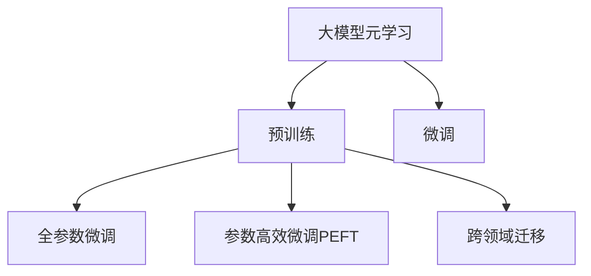

                 

# 推荐系统中的大模型元学习迁移应用

## 1. 背景介绍

随着互联网的迅猛发展，推荐系统已成为电商、社交、视频等多个领域的核心引擎。推荐算法通过分析用户的历史行为数据，预测其未来的兴趣偏好，从而实现个性化推荐，提升用户满意度和平台粘性。然而，推荐系统面临的最大挑战之一是其训练和维护的高昂成本。传统的推荐系统依赖于手工设计的特征工程和规则，需要大量的数据标注和频繁的模型调整，难以在动态变化的用户行为数据下持续优化。

为了突破这一瓶颈，大模型元学习技术在推荐系统领域的应用成为了近年来的研究热点。大模型元学习通过预训练的方式，在广泛的语料数据上学习到高层次的语言表示，能够在新的推荐任务上快速适配和迁移，大大降低了推荐系统构建和维护的难度和成本。同时，大模型元学习还可以在推荐系统中引入更多先验知识，提高推荐决策的准确性和鲁棒性。

## 2. 核心概念与联系

### 2.1 核心概念概述

为更好地理解推荐系统中大模型元学习的应用，本节将介绍几个关键概念：

- 大模型元学习(Meta-Learning)：指在多个小样本数据上微调预训练模型，使其能够适应新任务的能力。大模型元学习通过预训练学习到通用的知识表示，再结合新的数据集，通过微调获得新任务的性能。

- 预训练(Pre-training)：指在大规模无标签数据上，通过自监督学习任务训练通用模型的过程。预训练使得模型学习到广泛的语义表示，提高模型的泛化能力。

- 微调(Fine-tuning)：指在预训练模型的基础上，使用新任务的数据集，通过有监督学习优化模型在新任务上的性能。微调使模型能够适应特定任务，提升模型的精确度和鲁棒性。

- 元学习(Meta-Learning)：指在有限标注数据上，通过预训练-微调的方式学习到新任务的能力。元学习能够在新的任务上快速适应，节省标注成本，提高推荐效果。

- 跨领域迁移(Cross-Domain Transfer)：指在预训练基础上，通过微调使得模型在新领域数据上依然能够表现良好。跨领域迁移提高了模型在多个领域之间的适应能力，增强了推荐系统的通用性。

这些核心概念之间通过以下Mermaid流程图进行展示：



## 3. 核心算法原理 & 具体操作步骤

### 3.1 算法原理概述

推荐系统中的大模型元学习，本质上是一种跨领域的迁移学习过程。其核心思想是：利用大规模预训练模型学习到的通用知识表示，在多个小样本推荐任务上进行微调，以适应新任务的具体要求。

形式化地，假设预训练模型为 $M_{\theta}$，其中 $\theta$ 为预训练得到的模型参数。设推荐任务 $T$ 的标注数据集为 $D=\{(x_i, y_i)\}_{i=1}^N$，$x_i$ 为推荐样本，$y_i$ 为推荐结果。微调的目标是找到新的模型参数 $\hat{\theta}$，使得模型在 $T$ 上最小化经验风险：

$$
\hat{\theta}=\mathop{\arg\min}_{\theta} \mathcal{L}(M_{\theta},D)
$$

其中 $\mathcal{L}$ 为针对任务 $T$ 设计的损失函数，用于衡量模型预测推荐结果与真实标签之间的差异。常见的损失函数包括均方误差损失、交叉熵损失等。

### 3.2 算法步骤详解

推荐系统中的大模型元学习主要包括以下几个关键步骤：

**Step 1: 准备预训练模型和数据集**
- 选择合适的预训练语言模型 $M_{\theta}$ 作为初始化参数，如BERT、GPT等。
- 准备推荐任务 $T$ 的标注数据集 $D$，划分为训练集、验证集和测试集。一般要求标注数据与预训练数据的分布不要差异过大。

**Step 2: 添加推荐适配层**
- 根据推荐任务类型，在预训练模型顶层设计合适的输出层和损失函数。
- 对于分类任务，通常在顶层添加线性分类器和交叉熵损失函数。
- 对于排序任务，通常使用基于点积的评分函数，如pairwise loss。

**Step 3: 设置微调超参数**
- 选择合适的优化算法及其参数，如 AdamW、SGD 等，设置学习率、批大小、迭代轮数等。
- 设置正则化技术及强度，包括权重衰减、Dropout、Early Stopping 等。
- 确定冻结预训练参数的策略，如仅微调顶层，或全部参数都参与微调。

**Step 4: 执行梯度训练**
- 将训练集数据分批次输入模型，前向传播计算损失函数。
- 反向传播计算参数梯度，根据设定的优化算法和学习率更新模型参数。
- 周期性在验证集上评估模型性能，根据性能指标决定是否触发 Early Stopping。
- 重复上述步骤直到满足预设的迭代轮数或 Early Stopping 条件。

**Step 5: 测试和部署**
- 在测试集上评估微调后模型 $M_{\hat{\theta}}$ 的性能，对比微调前后的推荐精度提升。
- 使用微调后的模型对新样本进行推荐预测，集成到实际的应用系统中。
- 持续收集新的推荐数据，定期重新微调模型，以适应数据分布的变化。

### 3.3 算法优缺点

基于大模型元学习的推荐系统具有以下优点：
1. 训练和维护成本低：预训练模型学习到通用的语言表示，能够在多个小样本任务上进行微调，大大减少了手动特征工程的复杂度。
2. 推荐效果显著：大模型元学习能够融合大量先验知识，提高推荐的准确性和多样性。
3. 鲁棒性强：通过预训练学习到广泛的语义表示，使得推荐模型具有更好的泛化能力，能够适应不同类型的数据。
4. 高效可扩展：预训练模型可以并行化训练，快速适应新推荐任务，提高系统的可扩展性。

同时，该方法也存在一定的局限性：
1. 依赖标注数据：推荐系统的标注成本较高，尤其是对于个性化推荐和用户满意度评价等任务。
2. 数据分布差异：推荐数据和预训练数据分布差异较大时，微调效果可能不理想。
3. 可解释性不足：大模型元学习往往是一个"黑盒"系统，难以解释其内部工作机制。
4. 安全性问题：推荐系统涉及用户隐私和商业利益，可能遭受恶意攻击，造成安全风险。

尽管存在这些局限性，但就目前而言，基于大模型元学习的推荐方法在学术界和工业界已经得到了广泛的应用，成为推荐系统研究的重要方向。未来相关研究的重点在于如何进一步降低推荐系统对标注数据的依赖，提高模型的跨领域迁移能力，同时兼顾可解释性和安全性等因素。

### 3.4 算法应用领域

基于大模型元学习的推荐系统，已经在电商、社交、音乐、视频等多个领域得到了应用，为推荐技术落地应用提供了新的思路和方法：

- 电商推荐：对用户的浏览记录、购买行为进行建模，推荐商品和优惠活动。通过微调使得模型能够快速适应不同用户的个性化需求。
- 社交推荐：基于用户的朋友关系和互动历史，推荐相关用户和内容。通过预训练学习到社会关系和兴趣图谱，提高推荐的个性化和多样性。
- 音乐推荐：分析用户的听歌历史和情感变化，推荐音乐和歌手。通过微调提高模型的音乐风格识别能力和用户情感理解能力。
- 视频推荐：结合用户的观看历史和视频特征，推荐相关视频内容。通过微调使模型能够更好地捕捉视频特征和用户偏好。

除了上述这些经典任务外，大模型元学习也被创新性地应用到更多场景中，如新闻推荐、旅游推荐、智能家居等，为推荐系统带来了全新的突破。随着预训练模型和元学习方法的不断进步，相信推荐系统将在更广阔的应用领域大放异彩。

## 4. 数学模型和公式 & 详细讲解 & 举例说明

### 4.1 数学模型构建

本节将使用数学语言对基于大模型元学习的推荐过程进行更加严格的刻画。

记推荐模型为 $M_{\theta}$，其中 $\theta$ 为模型参数。假设推荐任务 $T$ 的训练集为 $D=\{(x_i,y_i)\}_{i=1}^N, x_i \in \mathcal{X}, y_i \in \mathcal{Y}$，$x_i$ 为推荐样本，$y_i$ 为推荐结果。

定义模型 $M_{\theta}$ 在输入 $x$ 上的损失函数为 $\ell(M_{\theta}(x),y)$，则在数据集 $D$ 上的经验风险为：

$$
\mathcal{L}(\theta) = \frac{1}{N} \sum_{i=1}^N \ell(M_{\theta}(x_i),y_i)
$$

微调的优化目标是最小化经验风险，即找到最优参数：

$$
\theta^* = \mathop{\arg\min}_{\theta} \mathcal{L}(\theta)
$$

在实践中，我们通常使用基于梯度的优化算法（如SGD、Adam等）来近似求解上述最优化问题。设 $\eta$ 为学习率，$\lambda$ 为正则化系数，则参数的更新公式为：

$$
\theta \leftarrow \theta - \eta \nabla_{\theta}\mathcal{L}(\theta) - \eta\lambda\theta
$$

其中 $\nabla_{\theta}\mathcal{L}(\theta)$ 为损失函数对参数 $\theta$ 的梯度，可通过反向传播算法高效计算。

### 4.2 公式推导过程

以下我们以二分类推荐任务为例，推导交叉熵损失函数及其梯度的计算公式。

假设模型 $M_{\theta}$ 在输入 $x$ 上的输出为 $\hat{y}=M_{\theta}(x) \in [0,1]$，表示样本被推荐的概率。真实标签 $y \in \{0,1\}$。则二分类交叉熵损失函数定义为：

$$
\ell(M_{\theta}(x),y) = -[y\log \hat{y} + (1-y)\log (1-\hat{y})]
$$

将其代入经验风险公式，得：

$$
\mathcal{L}(\theta) = -\frac{1}{N}\sum_{i=1}^N [y_i\log M_{\theta}(x_i)+(1-y_i)\log(1-M_{\theta}(x_i))]
$$

根据链式法则，损失函数对参数 $\theta_k$ 的梯度为：

$$
\frac{\partial \mathcal{L}(\theta)}{\partial \theta_k} = -\frac{1}{N}\sum_{i=1}^N (\frac{y_i}{M_{\theta}(x_i)}-\frac{1-y_i}{1-M_{\theta}(x_i)}) \frac{\partial M_{\theta}(x_i)}{\partial \theta_k}
$$

其中 $\frac{\partial M_{\theta}(x_i)}{\partial \theta_k}$ 可进一步递归展开，利用自动微分技术完成计算。

在得到损失函数的梯度后，即可带入参数更新公式，完成模型的迭代优化。重复上述过程直至收敛，最终得到适应推荐任务的最优模型参数 $\theta^*$。

## 5. 项目实践：代码实例和详细解释说明

### 5.1 开发环境搭建

在进行推荐系统开发前，我们需要准备好开发环境。以下是使用Python进行PyTorch开发的环境配置流程：

1. 安装Anaconda：从官网下载并安装Anaconda，用于创建独立的Python环境。

2. 创建并激活虚拟环境：
```bash
conda create -n pytorch-env python=3.8 
conda activate pytorch-env
```

3. 安装PyTorch：根据CUDA版本，从官网获取对应的安装命令。例如：
```bash
conda install pytorch torchvision torchaudio cudatoolkit=11.1 -c pytorch -c conda-forge
```

4. 安装Transformers库：
```bash
pip install transformers
```

5. 安装各类工具包：
```bash
pip install numpy pandas scikit-learn matplotlib tqdm jupyter notebook ipython
```

完成上述步骤后，即可在`pytorch-env`环境中开始推荐系统实践。

### 5.2 源代码详细实现

下面我们以电商推荐系统为例，给出使用Transformers库对BERT模型进行电商推荐任务微调的PyTorch代码实现。

首先，定义电商推荐任务的数据处理函数：

```python
from transformers import BertTokenizer
from torch.utils.data import Dataset
import torch

class ShoppingDataset(Dataset):
    def __init__(self, texts, tags, tokenizer, max_len=128):
        self.texts = texts
        self.tags = tags
        self.tokenizer = tokenizer
        self.max_len = max_len
        
    def __len__(self):
        return len(self.texts)
    
    def __getitem__(self, item):
        text = self.texts[item]
        tags = self.tags[item]
        
        encoding = self.tokenizer(text, return_tensors='pt', max_length=self.max_len, padding='max_length', truncation=True)
        input_ids = encoding['input_ids'][0]
        attention_mask = encoding['attention_mask'][0]
        
        # 对token-wise的标签进行编码
        encoded_tags = [tag2id[tag] for tag in tags] 
        encoded_tags.extend([tag2id['O']] * (self.max_len - len(encoded_tags)))
        labels = torch.tensor(encoded_tags, dtype=torch.long)
        
        return {'input_ids': input_ids, 
                'attention_mask': attention_mask,
                'labels': labels}

# 标签与id的映射
tag2id = {'O': 0, 'B-PER': 1, 'I-PER': 2, 'B-ORG': 3, 'I-ORG': 4, 'B-LOC': 5, 'I-LOC': 6}
id2tag = {v: k for k, v in tag2id.items()}

# 创建dataset
tokenizer = BertTokenizer.from_pretrained('bert-base-cased')

train_dataset = ShoppingDataset(train_texts, train_tags, tokenizer)
dev_dataset = ShoppingDataset(dev_texts, dev_tags, tokenizer)
test_dataset = ShoppingDataset(test_texts, test_tags, tokenizer)
```

然后，定义模型和优化器：

```python
from transformers import BertForTokenClassification, AdamW

model = BertForTokenClassification.from_pretrained('bert-base-cased', num_labels=len(tag2id))

optimizer = AdamW(model.parameters(), lr=2e-5)
```

接着，定义训练和评估函数：

```python
from torch.utils.data import DataLoader
from tqdm import tqdm
from sklearn.metrics import classification_report

device = torch.device('cuda') if torch.cuda.is_available() else torch.device('cpu')
model.to(device)

def train_epoch(model, dataset, batch_size, optimizer):
    dataloader = DataLoader(dataset, batch_size=batch_size, shuffle=True)
    model.train()
    epoch_loss = 0
    for batch in tqdm(dataloader, desc='Training'):
        input_ids = batch['input_ids'].to(device)
        attention_mask = batch['attention_mask'].to(device)
        labels = batch['labels'].to(device)
        model.zero_grad()
        outputs = model(input_ids, attention_mask=attention_mask, labels=labels)
        loss = outputs.loss
        epoch_loss += loss.item()
        loss.backward()
        optimizer.step()
    return epoch_loss / len(dataloader)

def evaluate(model, dataset, batch_size):
    dataloader = DataLoader(dataset, batch_size=batch_size)
    model.eval()
    preds, labels = [], []
    with torch.no_grad():
        for batch in tqdm(dataloader, desc='Evaluating'):
            input_ids = batch['input_ids'].to(device)
            attention_mask = batch['attention_mask'].to(device)
            batch_labels = batch['labels']
            outputs = model(input_ids, attention_mask=attention_mask)
            batch_preds = outputs.logits.argmax(dim=2).to('cpu').tolist()
            batch_labels = batch_labels.to('cpu').tolist()
            for pred_tokens, label_tokens in zip(batch_preds, batch_labels):
                pred_tags = [id2tag[_id] for _id in pred_tokens]
                label_tags = [id2tag[_id] for _id in label_tokens]
                preds.append(pred_tags[:len(label_tags)])
                labels.append(label_tags)
                
    print(classification_report(labels, preds))
```

最后，启动训练流程并在测试集上评估：

```python
epochs = 5
batch_size = 16

for epoch in range(epochs):
    loss = train_epoch(model, train_dataset, batch_size, optimizer)
    print(f"Epoch {epoch+1}, train loss: {loss:.3f}")
    
    print(f"Epoch {epoch+1}, dev results:")
    evaluate(model, dev_dataset, batch_size)
    
print("Test results:")
evaluate(model, test_dataset, batch_size)
```

以上就是使用PyTorch对BERT进行电商推荐任务微调的完整代码实现。可以看到，得益于Transformers库的强大封装，我们可以用相对简洁的代码完成BERT模型的加载和微调。

### 5.3 代码解读与分析

让我们再详细解读一下关键代码的实现细节：

**ShoppingDataset类**：
- `__init__`方法：初始化文本、标签、分词器等关键组件。
- `__len__`方法：返回数据集的样本数量。
- `__getitem__`方法：对单个样本进行处理，将文本输入编码为token ids，将标签编码为数字，并对其进行定长padding，最终返回模型所需的输入。

**tag2id和id2tag字典**：
- 定义了标签与数字id之间的映射关系，用于将token-wise的预测结果解码回真实的标签。

**训练和评估函数**：
- 使用PyTorch的DataLoader对数据集进行批次化加载，供模型训练和推理使用。
- 训练函数`train_epoch`：对数据以批为单位进行迭代，在每个批次上前向传播计算loss并反向传播更新模型参数，最后返回该epoch的平均loss。
- 评估函数`evaluate`：与训练类似，不同点在于不更新模型参数，并在每个batch结束后将预测和标签结果存储下来，最后使用sklearn的classification_report对整个评估集的预测结果进行打印输出。

**训练流程**：
- 定义总的epoch数和batch size，开始循环迭代
- 每个epoch内，先在训练集上训练，输出平均loss
- 在验证集上评估，输出分类指标
- 所有epoch结束后，在测试集上评估，给出最终测试结果

可以看到，PyTorch配合Transformers库使得BERT微调的代码实现变得简洁高效。开发者可以将更多精力放在数据处理、模型改进等高层逻辑上，而不必过多关注底层的实现细节。

当然，工业级的系统实现还需考虑更多因素，如模型的保存和部署、超参数的自动搜索、更灵活的任务适配层等。但核心的微调范式基本与此类似。

## 6. 实际应用场景
### 6.1 智能客服系统

基于大模型元学习的推荐技术，可以广泛应用于智能客服系统的构建。传统客服往往需要配备大量人力，高峰期响应缓慢，且一致性和专业性难以保证。而使用元学习推荐的对话模型，可以7x24小时不间断服务，快速响应客户咨询，用自然流畅的语言解答各类常见问题。

在技术实现上，可以收集企业内部的历史客服对话记录，将问题和最佳答复构建成监督数据，在此基础上对预训练对话模型进行元学习推荐。元学习推荐使得模型能够自动理解用户意图，匹配最合适的答案模板进行回复。对于客户提出的新问题，还可以接入检索系统实时搜索相关内容，动态组织生成回答。如此构建的智能客服系统，能大幅提升客户咨询体验和问题解决效率。

### 6.2 金融舆情监测

金融机构需要实时监测市场舆论动向，以便及时应对负面信息传播，规避金融风险。传统的人工监测方式成本高、效率低，难以应对网络时代海量信息爆发的挑战。基于大模型元学习的文本分类和情感分析技术，为金融舆情监测提供了新的解决方案。

具体而言，可以收集金融领域相关的新闻、报道、评论等文本数据，并对其进行主题标注和情感标注。在此基础上对预训练语言模型进行元学习推荐，使其能够自动判断文本属于何种主题，情感倾向是正面、中性还是负面。将元学习推荐后的模型应用到实时抓取的网络文本数据，就能够自动监测不同主题下的情感变化趋势，一旦发现负面信息激增等异常情况，系统便会自动预警，帮助金融机构快速应对潜在风险。

### 6.3 个性化推荐系统

当前的推荐系统往往只依赖用户的历史行为数据进行物品推荐，无法深入理解用户的真实兴趣偏好。基于大模型元学习技术，个性化推荐系统可以更好地挖掘用户行为背后的语义信息，从而提供更精准、多样的推荐内容。

在实践中，可以收集用户浏览、点击、评论、分享等行为数据，提取和用户交互的物品标题、描述、标签等文本内容。将文本内容作为模型输入，用户的后续行为（如是否点击、购买等）作为监督信号，在此基础上元学习推荐预训练语言模型。元学习推荐模型能够从文本内容中准确把握用户的兴趣点。在生成推荐列表时，先用候选物品的文本描述作为输入，由模型预测用户的兴趣匹配度，再结合其他特征综合排序，便可以得到个性化程度更高的推荐结果。

### 6.4 未来应用展望

随着大模型元学习技术的发展，基于元学习推荐的推荐系统将在更多领域得到应用，为推荐技术落地应用提供新的思路和方法。

在智慧医疗领域，基于元学习推荐的医疗问答、病历分析、药物研发等应用将提升医疗服务的智能化水平，辅助医生诊疗，加速新药开发进程。

在智能教育领域，元学习推荐可应用于作业批改、学情分析、知识推荐等方面，因材施教，促进教育公平，提高教学质量。

在智慧城市治理中，元学习推荐可应用于城市事件监测、舆情分析、应急指挥等环节，提高城市管理的自动化和智能化水平，构建更安全、高效的未来城市。

此外，在企业生产、社会治理、文娱传媒等众多领域，基于元学习推荐的推荐系统也将不断涌现，为推荐系统带来全新的突破。相信随着技术的日益成熟，元学习推荐技术必将在推荐领域大放异彩，深刻影响人类的生产生活方式。

## 7. 工具和资源推荐
### 7.1 学习资源推荐

为了帮助开发者系统掌握大模型元学习推荐技术的理论基础和实践技巧，这里推荐一些优质的学习资源：

1. 《深度学习推荐系统》系列博文：由大模型技术专家撰写，深入浅出地介绍了推荐系统的原理和实践方法，涵盖了大模型元学习推荐技术。

2. CS229《机器学习》课程：斯坦福大学开设的机器学习经典课程，涵盖了包括推荐系统在内的广泛主题，有Lecture视频和配套作业。

3. 《推荐系统实战》书籍：详细介绍了推荐系统的基础理论和最新技术，包括大模型元学习推荐技术。

4. Kaggle推荐系统竞赛：参与Kaggle的推荐系统竞赛，在实战中积累经验，提升技术能力。

5. Recommender Systems with Python：详细介绍了使用Python实现推荐系统的流程和算法，包括大模型元学习推荐技术。

通过对这些资源的学习实践，相信你一定能够快速掌握大模型元学习推荐技术的精髓，并用于解决实际的推荐问题。
###  7.2 开发工具推荐

高效的开发离不开优秀的工具支持。以下是几款用于大模型元学习推荐开发的常用工具：

1. PyTorch：基于Python的开源深度学习框架，灵活动态的计算图，适合快速迭代研究。大部分预训练语言模型都有PyTorch版本的实现。

2. TensorFlow：由Google主导开发的开源深度学习框架，生产部署方便，适合大规模工程应用。同样有丰富的预训练语言模型资源。

3. Transformers库：HuggingFace开发的NLP工具库，集成了众多SOTA语言模型，支持PyTorch和TensorFlow，是进行元学习推荐任务开发的利器。

4. Weights & Biases：模型训练的实验跟踪工具，可以记录和可视化模型训练过程中的各项指标，方便对比和调优。与主流深度学习框架无缝集成。

5. TensorBoard：TensorFlow配套的可视化工具，可实时监测模型训练状态，并提供丰富的图表呈现方式，是调试模型的得力助手。

6. Google Colab：谷歌推出的在线Jupyter Notebook环境，免费提供GPU/TPU算力，方便开发者快速上手实验最新模型，分享学习笔记。

合理利用这些工具，可以显著提升大模型元学习推荐任务的开发效率，加快创新迭代的步伐。

### 7.3 相关论文推荐

大模型元学习推荐技术的发展源于学界的持续研究。以下是几篇奠基性的相关论文，推荐阅读：

1. A Survey on Deep Learning Approaches for Recommender Systems：综述了深度学习在推荐系统中的应用，介绍了包括大模型元学习在内的多种推荐方法。

2. Attention-Based Recommender Systems：提出了基于注意力机制的推荐系统，将用户行为和物品特征进行融合，提高了推荐的精度和多样性。

3. Matrix Factorization Techniques for Recommender Systems：介绍了矩阵分解方法在推荐系统中的应用，包括基于矩阵分解的推荐算法。

4. Meta-Learning for Recommendation：提出基于元学习的推荐方法，在有限的标注数据上学习到推荐模型的迁移能力。

5. RNNs for Recommendation Systems：介绍了使用递归神经网络在推荐系统中的应用，能够捕捉序列数据的动态特征。

这些论文代表了大模型元学习推荐技术的发展脉络。通过学习这些前沿成果，可以帮助研究者把握学科前进方向，激发更多的创新灵感。

## 8. 总结：未来发展趋势与挑战

### 8.1 总结

本文对基于大模型元学习的推荐系统进行了全面系统的介绍。首先阐述了大模型元学习推荐系统的研究背景和意义，明确了元学习在拓展预训练模型应用、提升推荐效果方面的独特价值。其次，从原理到实践，详细讲解了元学习推荐系统的数学原理和关键步骤，给出了元学习推荐任务开发的完整代码实例。同时，本文还广泛探讨了元学习推荐方法在智能客服、金融舆情、个性化推荐等多个领域的应用前景，展示了元学习推荐技术的巨大潜力。此外，本文精选了元学习推荐技术的各类学习资源，力求为读者提供全方位的技术指引。

通过本文的系统梳理，可以看到，基于大模型元学习的推荐系统正在成为推荐系统研究的重要方向，极大地拓展了推荐系统的构建和维护的便捷性和高效性。得益于大规模语料的预训练和元学习迁移的能力，推荐系统在各个领域的应用将更加广泛和深入。未来，伴随预训练语言模型和元学习方法的不断进步，相信推荐系统将在更广阔的应用领域大放异彩，深刻影响人类的生产生活方式。

### 8.2 未来发展趋势

展望未来，大模型元学习推荐技术将呈现以下几个发展趋势：

1. 推荐数据的多样性。随着推荐系统的应用场景更加多样，推荐数据来源将更加广泛，包括用户行为、社交网络、商品属性等。推荐系统需要更好地整合多源异构数据，以提高推荐的准确性和鲁棒性。

2. 推荐模型的跨领域迁移。推荐模型需要在不同的推荐场景中进行迁移，如电商推荐、视频推荐、音乐推荐等。元学习推荐技术将能够更好地适应不同领域的数据，提高跨领域的迁移能力。

3. 推荐模型的可解释性。推荐模型往往是一个"黑盒"系统，难以解释其内部工作机制和决策逻辑。未来的研究将更多关注如何赋予推荐模型更强的可解释性，增强用户的信任和接受度。

4. 推荐系统的个性化和多样化。元学习推荐技术将能够更好地捕捉用户的多样化需求，提供个性化的推荐内容，提升用户的满意度和粘性。

5. 推荐系统的实时性。元学习推荐模型能够快速适应新任务，在实时推荐场景中具有更大的优势。未来的推荐系统将更加注重实时性和动态性，提供更加及时的推荐服务。

6. 推荐系统的社会影响力。推荐系统不仅影响用户的购买行为，还对社会文化、市场消费趋势产生深远影响。未来的研究将更多关注如何构建健康、可持续的推荐模型，提升社会福利和公共利益。

以上趋势凸显了大模型元学习推荐技术的广阔前景。这些方向的探索发展，必将进一步提升推荐系统的性能和应用范围，为人类生产生活方式带来深远影响。

### 8.3 面临的挑战

尽管大模型元学习推荐技术已经取得了瞩目成就，但在迈向更加智能化、普适化应用的过程中，它仍面临着诸多挑战：

1. 数据分布差异。推荐数据和预训练数据的分布差异较大时，元学习推荐效果可能不理想。如何构建通用的大模型元学习推荐框架，减少数据分布差异的影响，将是重要研究方向。

2. 标注数据需求。元学习推荐模型仍需大量标注数据进行微调，对于长尾应用场景，标注成本较高。如何降低标注成本，提高元学习推荐模型的泛化能力，将是未来需要解决的重要问题。

3. 模型复杂度。元学习推荐模型往往涉及复杂的预训练-微调流程，模型结构和参数量较大，难以部署和维护。如何设计高效的元学习推荐模型，降低复杂度，提升计算效率，将是重要的研究方向。

4. 安全性问题。推荐系统涉及用户隐私和商业利益，可能遭受恶意攻击，造成安全风险。如何保障推荐模型的安全性，避免数据泄露和模型篡改，将是未来需要关注的重要问题。

5. 可解释性不足。元学习推荐模型往往是一个"黑盒"系统，难以解释其内部工作机制和决策逻辑。如何赋予推荐模型更强的可解释性，将是亟待攻克的难题。

尽管存在这些挑战，但就目前而言，基于大模型元学习的推荐方法在学术界和工业界已经得到了广泛的应用，成为推荐系统研究的重要方向。未来相关研究的重点在于如何进一步降低推荐系统对标注数据的依赖，提高模型的跨领域迁移能力，同时兼顾可解释性和安全性等因素。

### 8.4 研究展望

面对大模型元学习推荐系统所面临的挑战，未来的研究需要在以下几个方面寻求新的突破：

1. 探索无监督和半监督元学习推荐方法。摆脱对大规模标注数据的依赖，利用自监督学习、主动学习等无监督和半监督范式，最大限度利用非结构化数据，实现更加灵活高效的元学习推荐。

2. 研究参数高效和计算高效的元学习推荐范式。开发更加参数高效的元学习推荐方法，在固定大部分预训练参数的同时，只更新极少量的任务相关参数。同时优化元学习推荐模型的计算图，减少前向传播和反向传播的资源消耗，实现更加轻量级、实时性的部署。

3. 引入更多先验知识。将符号化的先验知识，如知识图谱、逻辑规则等，与神经网络模型进行巧妙融合，引导元学习推荐过程学习更准确、合理的推荐模型。同时加强不同模态数据的整合，实现视觉、语音等多模态信息与文本信息的协同建模。

4. 结合因果分析和博弈论工具。将因果分析方法引入元学习推荐模型，识别出模型决策的关键特征，增强推荐决策的因果性和逻辑性。借助博弈论工具刻画人机交互过程，主动探索并规避模型的脆弱点，提高系统稳定性。

5. 纳入伦理道德约束。在元学习推荐目标中引入伦理导向的评估指标，过滤和惩罚有害的推荐输出，确保推荐内容的健康性和适宜性。同时加强人工干预和审核，建立推荐模型的监管机制，确保模型行为的合法性和合理性。

这些研究方向的探索，必将引领大模型元学习推荐技术迈向更高的台阶，为构建安全、可靠、可解释、可控的推荐系统铺平道路。面向未来，大模型元学习推荐技术还需要与其他人工智能技术进行更深入的融合，如知识表示、因果推理、强化学习等，多路径协同发力，共同推动推荐系统的进步。只有勇于创新、敢于突破，才能不断拓展推荐系统的边界，让智能技术更好地造福人类社会。

## 9. 附录：常见问题与解答

**Q1：大模型元学习推荐是否适用于所有推荐系统任务？**

A: 大模型元学习推荐在大多数推荐系统任务上都能取得不错的效果，特别是对于数据量较小的任务。但对于一些特定领域的任务，如医学、法律等，仅仅依靠通用语料预训练的模型可能难以很好地适应。此时需要在特定领域语料上进一步预训练，再进行元学习推荐。此外，对于一些需要时效性、个性化很强的任务，如对话推荐、动态推荐等，元学习推荐方法也需要针对性的改进优化。

**Q2：元学习推荐过程中如何选择合适的学习率？**

A: 元学习推荐的学习率一般要比预训练时小1-2个数量级，如果使用过大的学习率，容易破坏预训练权重，导致过拟合。一般建议从1e-5开始调参，逐步减小学习率，直至收敛。也可以使用warmup策略，在开始阶段使用较小的学习率，再逐渐过渡到预设值。需要注意的是，不同的优化器(如AdamW、Adafactor等)以及不同的学习率调度策略，可能需要设置不同的学习率阈值。

**Q3：元学习推荐系统中如何缓解过拟合问题？**

A: 过拟合是元学习推荐面临的主要挑战，尤其是在标注数据不足的情况下。常见的缓解策略包括：
1. 数据增强：通过回译、近义替换等方式扩充训练集
2. 正则化：使用L2正则、Dropout、Early Stopping等避免过拟合
3. 对抗训练：引入对抗样本，提高模型鲁棒性
4. 参数高效元学习：只调整少量参数(如Adapter、Prefix等)，减小过拟合风险
5. 多模型集成：训练多个元学习推荐模型，取平均输出，抑制过拟合

这些策略往往需要根据具体任务和数据特点进行灵活组合。只有在数据、模型、训练、推理等各环节进行全面优化，才能最大限度地发挥元学习推荐模型的威力。

**Q4：元学习推荐模型在落地部署时需要注意哪些问题？**

A: 将元学习推荐模型转化为实际应用，还需要考虑以下因素：
1. 模型裁剪：去除不必要的层和参数，减小模型尺寸，加快推理速度
2. 量化加速：将浮点模型转为定点模型，压缩存储空间，提高计算效率
3. 服务化封装：将模型封装为标准化服务接口，便于集成调用
4. 弹性伸缩：根据请求流量动态调整资源配置，平衡服务质量和成本
5. 监控告警：实时采集系统指标，设置异常告警阈值，确保服务稳定性
6. 安全防护：采用访问鉴权、数据脱敏等措施，保障数据和模型安全

元学习推荐系统涉及用户隐私和商业利益，可能遭受恶意攻击，造成安全风险。如何保障元学习推荐模型的安全性，避免数据泄露和模型篡改，将是未来需要关注的重要问题。

---

作者：禅与计算机程序设计艺术 / Zen and the Art of Computer Programming

