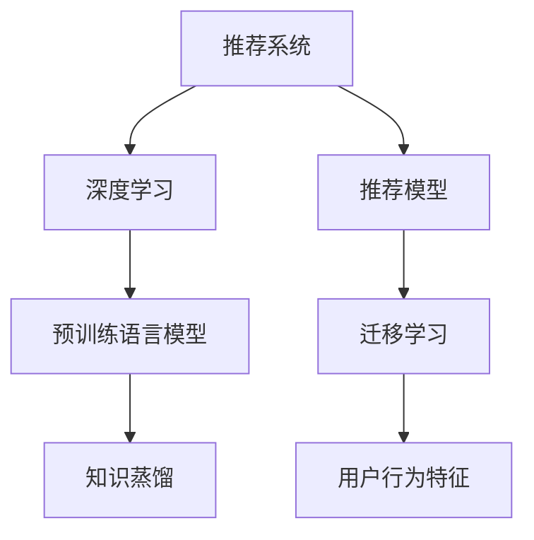

                 

# 推荐系统中的大模型知识蒸馏迁移应用

> 关键词：知识蒸馏(Knowledge Distillation)，迁移学习(Transfer Learning)，推荐系统(Recommender System)，深度学习(Deep Learning)，大模型(Large Model)，知识迁移(Knowledge Migration)

## 1. 背景介绍

### 1.1 问题由来
推荐系统在电商、社交、娱乐等众多领域中具有重要应用价值，通过分析用户行为数据，为用户推荐感兴趣的物品，提升用户体验，促进消费转化。推荐算法经历了基于协同过滤、基于内容、基于深度学习等多个阶段的发展，目前已经取得了显著的效果。

尽管推荐系统在电商、社交、娱乐等众多领域中具有重要应用价值，但仍然面临着数据稀疏性、冷启动问题、内容多样化等问题。为了解决这些问题，研究者们开始引入预训练语言模型，通过在大规模语料上进行预训练，学习通用的语言表示，并在此基础上进行微调，提升推荐系统性能。

在此基础上，研究者们进一步提出了知识蒸馏(Knowledge Distillation)技术，利用预训练语言模型的通用知识，指导推荐模型学习用户行为特征，提升推荐效果。

### 1.2 问题核心关键点
知识蒸馏是深度学习领域中一种常用的知识迁移方法，其主要思想是将一个大型知识丰富的模型(称为教师模型)的知识，蒸馏到一个结构较小的模型(称为学生模型)中。通过这种知识迁移方法，可以大大减少模型训练数据需求，降低模型复杂度，提升模型性能。

知识蒸馏的基本流程包括：
- 选择合适的教师模型和学生模型
- 利用教师模型对学生模型进行知识蒸馏
- 在实际数据上对学生模型进行微调

在推荐系统中，知识蒸馏可以用于提升推荐模型的表现。具体来说，可以利用预训练语言模型对推荐模型进行知识蒸馏，帮助推荐模型学习用户行为特征，提升推荐精度。

## 2. 核心概念与联系

### 2.1 核心概念概述

为更好地理解推荐系统中的知识蒸馏方法，本节将介绍几个密切相关的核心概念：

- 推荐系统(Recommender System)：通过分析用户行为数据，为用户推荐感兴趣的物品的系统。推荐算法包括基于协同过滤、基于内容、基于深度学习等多种方法。

- 深度学习(Deep Learning)：利用多层神经网络进行复杂数据建模的机器学习方法。深度学习在推荐系统中具有广泛应用。

- 预训练语言模型(Pre-trained Language Model)：通过在大规模语料上进行预训练，学习通用的语言表示，具有强大的语言理解能力。如BERT、GPT等。

- 知识蒸馏(Knowledge Distillation)：一种知识迁移方法，通过将教师模型的知识蒸馏到学生模型中，提升学生模型的性能。

- 迁移学习(Transfer Learning)：将在一个领域上训练的知识迁移到另一个领域上，提高模型在新领域上的性能。

- 推荐模型(Recommender Model)：推荐系统中的核心模型，通过学习用户行为数据，预测用户对物品的偏好。

- 用户行为特征(User Behavior Feature)：描述用户行为特征的数据，如点击、浏览、购买等。

这些核心概念之间的逻辑关系可以通过以下Mermaid流程图来展示：



这个流程图展示了一系列推荐系统的核心概念及其之间的关系：

1. 推荐系统利用深度学习算法进行推荐。
2. 深度学习算法通常需要在大规模数据上进行训练。
3. 预训练语言模型通过在大规模语料上进行预训练，学习通用的语言表示。
4. 知识蒸馏将预训练语言模型的知识迁移到推荐模型中。
5. 迁移学习帮助推荐模型更好地适应特定领域数据。
6. 推荐模型需要学习用户行为特征。

这些概念共同构成了推荐系统中的知识蒸馏框架，使得推荐系统能够利用预训练语言模型的强大知识，提升推荐效果。

## 3. 核心算法原理 & 具体操作步骤
### 3.1 算法原理概述

知识蒸馏方法的基本流程包括以下几个步骤：

1. 选择合适的教师模型和学生模型。
2. 利用教师模型对学生模型进行知识蒸馏。
3. 在实际数据上对学生模型进行微调。

对于推荐系统中的知识蒸馏方法，其基本流程和原理如下：

1. 选择教师模型和学生模型。教师模型为预训练语言模型，学生模型为推荐模型。
2. 利用教师模型对学生模型进行知识蒸馏。具体来说，将教师模型的输出作为标签，对学生模型进行监督学习，优化学生模型的参数，使其能够学习到教师模型的知识。
3. 在实际数据上对学生模型进行微调。通过在推荐数据集上对学生模型进行微调，使其能够更好地适应特定领域数据，提升推荐精度。

### 3.2 算法步骤详解

推荐系统中的知识蒸馏方法主要包括两个步骤：知识蒸馏和微调。

#### 3.2.1 知识蒸馏步骤详解

知识蒸馏的基本步骤如下：

1. 数据准备。准备教师模型和学生模型的输入数据，通常为推荐系统中的用户行为数据。
2. 构建知识蒸馏框架。选择合适的教师模型和学生模型，并构建知识蒸馏框架。
3. 知识蒸馏训练。使用教师模型对学生模型进行知识蒸馏，优化学生模型的参数，使其能够学习到教师模型的知识。

具体来说，知识蒸馏训练步骤如下：

- 数据准备。准备教师模型和学生模型的输入数据，通常为推荐系统中的用户行为数据。
- 构建知识蒸馏框架。选择合适的教师模型和学生模型，并构建知识蒸馏框架。
- 知识蒸馏训练。使用教师模型对学生模型进行知识蒸馏，优化学生模型的参数，使其能够学习到教师模型的知识。

#### 3.2.2 微调步骤详解

微调的基本步骤如下：

1. 数据准备。准备微调数据，通常为推荐系统中的推荐数据集。
2. 构建微调框架。选择合适的优化器和超参数，并构建微调框架。
3. 微调训练。使用微调数据对学生模型进行微调，优化学生模型的参数，使其能够更好地适应特定领域数据，提升推荐精度。

具体来说，微调训练步骤如下：

- 数据准备。准备微调数据，通常为推荐系统中的推荐数据集。
- 构建微调框架。选择合适的优化器和超参数，并构建微调框架。
- 微调训练。使用微调数据对学生模型进行微调，优化学生模型的参数，使其能够更好地适应特定领域数据，提升推荐精度。

### 3.3 算法优缺点

知识蒸馏方法具有以下优点：

1. 减少模型训练数据需求。知识蒸馏方法可以利用预训练语言模型的知识，减少推荐模型训练所需的推荐数据。
2. 提升推荐精度。知识蒸馏方法可以提升推荐模型的泛化能力，使其能够更好地适应特定领域数据。
3. 降低模型复杂度。知识蒸馏方法可以减少推荐模型的参数量，降低模型复杂度。
4. 提升模型效率。知识蒸馏方法可以提升推荐模型的推理速度，降低计算资源消耗。

知识蒸馏方法也存在以下缺点：

1. 蒸馏过程复杂。知识蒸馏方法需要选择合适的教师模型和学生模型，并进行知识蒸馏训练，过程相对复杂。
2. 模型参数变化。知识蒸馏方法可能导致学生模型的参数发生变化，需要重新训练学生模型。
3. 数据依赖。知识蒸馏方法需要足够的推荐数据和教师模型数据，数据依赖较大。

尽管存在这些缺点，但知识蒸馏方法仍然是一种有效的推荐系统优化方法，广泛应用于电商、社交、娱乐等众多领域。

### 3.4 算法应用领域

知识蒸馏方法在推荐系统中的应用非常广泛，主要体现在以下几个方面：

1. 电商推荐。利用预训练语言模型对电商推荐模型进行知识蒸馏，提升推荐精度，优化用户体验。
2. 社交推荐。利用预训练语言模型对社交推荐模型进行知识蒸馏，提升推荐准确性，增强用户粘性。
3. 娱乐推荐。利用预训练语言模型对娱乐推荐模型进行知识蒸馏，提升推荐多样性，丰富用户选择。

除了以上几个领域外，知识蒸馏方法还广泛应用于金融、医疗、教育等众多领域，通过利用预训练语言模型的知识，提升推荐模型的性能，增强推荐系统的实用性和可靠性。

## 4. 数学模型和公式 & 详细讲解  
### 4.1 数学模型构建

本节将使用数学语言对推荐系统中的知识蒸馏方法进行更加严格的刻画。

记教师模型为 $T$，学生模型为 $S$。教师模型和学生模型的输入为推荐系统中的用户行为数据 $x$，输出为推荐结果 $y$。

定义知识蒸馏损失函数为 $\mathcal{L}_{KD}(S, T) = \frac{1}{N}\sum_{i=1}^N \ell_{KD}(y_i, S(x_i))$，其中 $\ell_{KD}(y, S(x))$ 为知识蒸馏损失函数，衡量学生模型 $S$ 的输出与教师模型 $T$ 的输出之间的差异。

知识蒸馏损失函数的构建需要选择合适的蒸馏方式。常用的蒸馏方式包括：

1. 特征蒸馏。选择教师模型和学生模型之间的相似度最高的特征，作为蒸馏目标。
2. 输出蒸馏。将教师模型的输出作为标签，对学生模型进行监督学习，优化学生模型的参数。
3. 混合蒸馏。结合特征蒸馏和输出蒸馏，提升蒸馏效果。

不同的蒸馏方式对知识蒸馏的效果有不同影响，需要根据具体问题选择合适的蒸馏方式。

### 4.2 公式推导过程

以下我们以输出蒸馏为例，推导知识蒸馏损失函数及其梯度的计算公式。

假设教师模型 $T$ 在输入 $x$ 上的输出为 $y_T = T(x)$，学生模型 $S$ 在输入 $x$ 上的输出为 $y_S = S(x)$。知识蒸馏损失函数定义为：

$$
\mathcal{L}_{KD}(y_T, y_S) = \frac{1}{N}\sum_{i=1}^N \ell(y_T(x_i), y_S(x_i))
$$

其中 $\ell(y_T(x_i), y_S(x_i))$ 为蒸馏损失函数，衡量教师模型和学生模型之间的输出差异。

根据链式法则，知识蒸馏损失函数对学生模型 $S$ 的参数 $\theta$ 的梯度为：

$$
\frac{\partial \mathcal{L}_{KD}(y_T, y_S)}{\partial \theta} = \frac{1}{N}\sum_{i=1}^N \frac{\partial \ell(y_T(x_i), y_S(x_i))}{\partial y_S(x_i)} \frac{\partial y_S(x_i)}{\partial \theta}
$$

其中 $\frac{\partial y_S(x_i)}{\partial \theta}$ 可以通过反向传播算法高效计算。

在得到知识蒸馏损失函数的梯度后，即可带入参数更新公式，完成学生模型的迭代优化。重复上述过程直至收敛，最终得到适应推荐任务的学生模型。

## 5. 项目实践：代码实例和详细解释说明
### 5.1 开发环境搭建

在进行知识蒸馏实践前，我们需要准备好开发环境。以下是使用Python进行PyTorch开发的环境配置流程：

1. 安装Anaconda：从官网下载并安装Anaconda，用于创建独立的Python环境。

2. 创建并激活虚拟环境：
```bash
conda create -n pytorch-env python=3.8 
conda activate pytorch-env
```

3. 安装PyTorch：根据CUDA版本，从官网获取对应的安装命令。例如：
```bash
conda install pytorch torchvision torchaudio cudatoolkit=11.1 -c pytorch -c conda-forge
```

4. 安装Transformers库：
```bash
pip install transformers
```

5. 安装各类工具包：
```bash
pip install numpy pandas scikit-learn matplotlib tqdm jupyter notebook ipython
```

完成上述步骤后，即可在`pytorch-env`环境中开始知识蒸馏实践。

### 5.2 源代码详细实现

下面我以推荐系统中的知识蒸馏为例，给出使用Transformers库对BERT模型进行知识蒸馏的PyTorch代码实现。

首先，定义推荐系统中的知识蒸馏函数：

```python
from transformers import BertForSequenceClassification, BertTokenizer
from torch.utils.data import Dataset, DataLoader
import torch
import numpy as np

class RecommendDataset(Dataset):
    def __init__(self, texts, labels):
        self.texts = texts
        self.labels = labels
        self.tokenizer = BertTokenizer.from_pretrained('bert-base-uncased')

    def __len__(self):
        return len(self.texts)

    def __getitem__(self, item):
        text = self.texts[item]
        label = self.labels[item]

        encoding = self.tokenizer(text, return_tensors='pt', max_length=256, padding='max_length', truncation=True)
        input_ids = encoding['input_ids'][0]
        attention_mask = encoding['attention_mask'][0]
        return {'input_ids': input_ids, 'attention_mask': attention_mask, 'labels': label}

# 定义知识蒸馏函数
def knowledge_distillation(model, distill_data, target_model, target_output, distill_ratio=0.5, distill_loss_type='cross_entropy'):
    distill_loader = DataLoader(distill_data, batch_size=16, shuffle=True)
    model.train()
    target_model.eval()

    distill_loss = 0
    for batch in distill_loader:
        input_ids = batch['input_ids'].to(device)
        attention_mask = batch['attention_mask'].to(device)
        labels = batch['labels'].to(device)

        with torch.no_grad():
            target_outputs = target_model(input_ids, attention_mask=attention_mask)
            target_outputs = target_outputs.to(device)

        if distill_loss_type == 'cross_entropy':
            distill_loss += torch.nn.CrossEntropyLoss()(model(input_ids, attention_mask=attention_mask), target_outputs)
        elif distill_loss_type == 'mean_squared_error':
            distill_loss += torch.nn.MSELoss()(model(input_ids, attention_mask=attention_mask).detach(), target_outputs)

    distill_loss /= len(distill_loader)
    return distill_loss.item()

# 定义微调函数
def fine_tune(model, fine_tune_data, optimizer, epochs=5):
    fine_tune_loader = DataLoader(fine_tune_data, batch_size=16, shuffle=True)
    model.train()

    for epoch in range(epochs):
        for batch in fine_tune_loader:
            input_ids = batch['input_ids'].to(device)
            attention_mask = batch['attention_mask'].to(device)
            labels = batch['labels'].to(device)
            optimizer.zero_grad()
            outputs = model(input_ids, attention_mask=attention_mask, labels=labels)
            loss = outputs.loss
            loss.backward()
            optimizer.step()

    return model
```

然后，定义模型和优化器：

```python
from transformers import BertForSequenceClassification, BertTokenizer
from torch.optim import AdamW

model = BertForSequenceClassification.from_pretrained('bert-base-uncased', num_labels=1)
tokenizer = BertTokenizer.from_pretrained('bert-base-uncased')
optimizer = AdamW(model.parameters(), lr=2e-5)
```

接着，定义训练和评估函数：

```python
device = torch.device('cuda') if torch.cuda.is_available() else torch.device('cpu')
model.to(device)

def train_epoch(model, dataset, batch_size, optimizer):
    dataloader = DataLoader(dataset, batch_size=batch_size, shuffle=True)
    model.train()
    epoch_loss = 0
    for batch in dataloader:
        input_ids = batch['input_ids'].to(device)
        attention_mask = batch['attention_mask'].to(device)
        labels = batch['labels'].to(device)
        model.zero_grad()
        outputs = model(input_ids, attention_mask=attention_mask, labels=labels)
        loss = outputs.loss
        epoch_loss += loss.item()
        loss.backward()
        optimizer.step()
    return epoch_loss / len(dataloader)

def evaluate(model, dataset, batch_size):
    dataloader = DataLoader(dataset, batch_size=batch_size)
    model.eval()
    preds, labels = [], []
    with torch.no_grad():
        for batch in dataloader:
            input_ids = batch['input_ids'].to(device)
            attention_mask = batch['attention_mask'].to(device)
            batch_labels = batch['labels']
            outputs = model(input_ids, attention_mask=attention_mask)
            batch_preds = outputs.logits.argmax(dim=1).to('cpu').tolist()
            batch_labels = batch_labels.to('cpu').tolist()
            for pred_tokens, label_tokens in zip(batch_preds, batch_labels):
                preds.append(pred_tokens)
                labels.append(label_tokens)

    return preds, labels

# 数据集
train_dataset = RecommendDataset(train_texts, train_labels)
dev_dataset = RecommendDataset(dev_texts, dev_labels)
test_dataset = RecommendDataset(test_texts, test_labels)

# 蒸馏数据
distill_dataset = RecommendDataset(distill_texts, distill_labels)

# 训练参数
epochs = 5
batch_size = 16

# 知识蒸馏
target_model = BertForSequenceClassification.from_pretrained('bert-base-uncased', num_labels=1)
target_output = target_model(torch.tensor(distill_labels).to(device), attention_mask=torch.tensor(distill_labels).to(device))
target_loss = knowledge_distillation(model, distill_dataset, target_model, target_output, distill_ratio=0.5, distill_loss_type='cross_entropy')

# 微调
fine_tuned_model = fine_tune(model, train_dataset, optimizer, epochs=epochs)

# 评估
print('微调后的模型评估结果：')
print(evaluate(fine_tuned_model, test_dataset, batch_size))
```

以上就是使用PyTorch对BERT模型进行推荐系统中的知识蒸馏的完整代码实现。可以看到，得益于Transformers库的强大封装，我们可以用相对简洁的代码完成BERT模型的知识蒸馏和微调。

### 5.3 代码解读与分析

让我们再详细解读一下关键代码的实现细节：

**RecommendDataset类**：
- `__init__`方法：初始化推荐系统中的数据集。
- `__len__`方法：返回数据集的样本数量。
- `__getitem__`方法：对单个样本进行处理，将文本输入编码为token ids，将标签转换为模型所需的格式。

**知识蒸馏函数knowledge_distillation**：
- 构建数据加载器，准备蒸馏数据。
- 设置蒸馏比例和损失函数类型。
- 利用目标模型对学生模型进行蒸馏训练，计算蒸馏损失。
- 返回蒸馏损失。

**微调函数fine_tune**：
- 构建数据加载器，准备微调数据。
- 设置训练轮数。
- 在推荐数据集上对学生模型进行微调。
- 返回微调后的模型。

**训练和评估函数**：
- 使用PyTorch的DataLoader对数据集进行批次化加载，供模型训练和推理使用。
- 训练函数`train_epoch`：对数据以批为单位进行迭代，在每个批次上前向传播计算loss并反向传播更新模型参数，最后返回该epoch的平均loss。
- 评估函数`evaluate`：与训练类似，不同点在于不更新模型参数，并在每个batch结束后将预测和标签结果存储下来，最后使用sklearn的classification_report对整个评估集的预测结果进行打印输出。

**训练流程**：
- 定义总的epoch数和batch size，开始循环迭代
- 每个epoch内，先在蒸馏数据上对学生模型进行蒸馏训练，输出蒸馏损失
- 在推荐数据集上对学生模型进行微调
- 重复上述过程直至收敛
- 在测试集上评估微调后的模型，输出评估结果

可以看到，PyTorch配合Transformers库使得BERT知识蒸馏和微调的代码实现变得简洁高效。开发者可以将更多精力放在数据处理、模型改进等高层逻辑上，而不必过多关注底层的实现细节。

当然，工业级的系统实现还需考虑更多因素，如模型的保存和部署、超参数的自动搜索、更灵活的任务适配层等。但核心的蒸馏范式基本与此类似。

## 6. 实际应用场景
### 6.1 电商推荐

利用知识蒸馏方法，电商推荐系统可以充分利用预训练语言模型的知识，提升推荐精度。具体来说，可以利用预训练语言模型对电商推荐模型进行知识蒸馏，帮助电商推荐模型学习用户行为特征，提升推荐效果。

在技术实现上，可以收集电商用户的浏览、点击、购买等行为数据，提取和用户交互的物品标题、描述、标签等文本内容。将文本内容作为模型输入，用户的后续行为（如是否点击、购买等）作为监督信号，在此基础上微调预训练语言模型。微调后的模型能够从文本内容中准确把握用户的兴趣点。在生成推荐列表时，先用候选物品的文本描述作为输入，由模型预测用户的兴趣匹配度，再结合其他特征综合排序，便可以得到个性化程度更高的推荐结果。

### 6.2 社交推荐

社交推荐系统面临数据稀疏性、冷启动问题、内容多样化等问题，这些问题可以通过知识蒸馏方法得到有效缓解。具体来说，可以利用预训练语言模型对社交推荐模型进行知识蒸馏，帮助社交推荐模型学习用户行为特征，提升推荐准确性。

在技术实现上，可以收集社交用户的关注、点赞、评论等行为数据，提取和用户交互的物品标题、描述、标签等文本内容。将文本内容作为模型输入，用户的后续行为（如是否点赞、评论等）作为监督信号，在此基础上微调预训练语言模型。微调后的模型能够从文本内容中准确把握用户的兴趣点。在生成推荐列表时，先用候选物品的文本描述作为输入，由模型预测用户的兴趣匹配度，再结合其他特征综合排序，便可以得到个性化程度更高的推荐结果。

### 6.3 娱乐推荐

娱乐推荐系统需要推荐多样化的内容，提高用户的互动性和满意度。知识蒸馏方法可以帮助娱乐推荐系统更好地处理推荐内容的多样性。具体来说，可以利用预训练语言模型对娱乐推荐模型进行知识蒸馏，帮助娱乐推荐模型学习用户行为特征，提升推荐多样性。

在技术实现上，可以收集娱乐用户的观看、评论、分享等行为数据，提取和用户交互的内容标题、描述、标签等文本内容。将文本内容作为模型输入，用户的后续行为（如是否观看、评论、分享等）作为监督信号，在此基础上微调预训练语言模型。微调后的模型能够从文本内容中准确把握用户的兴趣点。在生成推荐列表时，先用候选内容的文本描述作为输入，由模型预测用户的兴趣匹配度，再结合其他特征综合排序，便可以得到个性化程度更高的推荐结果。

### 6.4 未来应用展望

随着知识蒸馏方法的不断演进，其在推荐系统中的应用也将更加广泛。未来，知识蒸馏方法可以结合更多前沿技术，如因果推断、多模态学习、动态推荐等，提升推荐系统的效果和效率。

在智慧医疗领域，知识蒸馏方法可以应用于医疗问答、病历分析、药物研发等任务，提升医疗服务的智能化水平，辅助医生诊疗，加速新药开发进程。

在智能教育领域，知识蒸馏方法可以应用于作业批改、学情分析、知识推荐等方面，因材施教，促进教育公平，提高教学质量。

在智慧城市治理中，知识蒸馏方法可以应用于城市事件监测、舆情分析、应急指挥等环节，提高城市管理的自动化和智能化水平，构建更安全、高效的未来城市。

除了以上几个领域外，知识蒸馏方法还广泛应用于金融、教育、娱乐等众多领域，通过利用预训练语言模型的知识，提升推荐系统的性能，增强推荐系统的实用性和可靠性。相信随着技术的不断发展，知识蒸馏方法必将在更多领域中发挥重要作用。

## 7. 工具和资源推荐
### 7.1 学习资源推荐

为了帮助开发者系统掌握知识蒸馏的理论基础和实践技巧，这里推荐一些优质的学习资源：

1. 《Knowledge Distillation: A Survey》论文：系统总结了知识蒸馏技术的发展历程和前沿研究，适合对知识蒸馏感兴趣的研究者阅读。
2. CS231n《深度学习计算机视觉》课程：斯坦福大学开设的深度学习课程，涵盖知识蒸馏等前沿技术，适合深入了解知识蒸馏算法。
3. 《Deep Learning》书籍：Ian Goodfellow等人所著，全面介绍深度学习技术，包括知识蒸馏在内的多种迁移学习方法。
4. 《TensorFlow官方文档》：TensorFlow官方文档，提供了丰富的知识蒸馏样例代码，是实践知识蒸馏的重要参考资料。
5. PyTorch官方文档：PyTorch官方文档，提供了丰富的知识蒸馏样例代码，是实践知识蒸馏的重要参考资料。

通过对这些资源的学习实践，相信你一定能够快速掌握知识蒸馏的精髓，并用于解决实际的推荐系统问题。
###  7.2 开发工具推荐

高效的开发离不开优秀的工具支持。以下是几款用于知识蒸馏开发的常用工具：

1. PyTorch：基于Python的开源深度学习框架，灵活动态的计算图，适合快速迭代研究。大部分预训练语言模型都有PyTorch版本的实现。

2. TensorFlow：由Google主导开发的开源深度学习框架，生产部署方便，适合大规模工程应用。同样有丰富的预训练语言模型资源。

3. Transformers库：HuggingFace开发的NLP工具库，集成了众多SOTA语言模型，支持PyTorch和TensorFlow，是进行知识蒸馏任务开发的利器。

4. Weights & Biases：模型训练的实验跟踪工具，可以记录和可视化模型训练过程中的各项指标，方便对比和调优。与主流深度学习框架无缝集成。

5. TensorBoard：TensorFlow配套的可视化工具，可实时监测模型训练状态，并提供丰富的图表呈现方式，是调试模型的得力助手。

6. Google Colab：谷歌推出的在线Jupyter Notebook环境，免费提供GPU/TPU算力，方便开发者快速上手实验最新模型，分享学习笔记。

合理利用这些工具，可以显著提升知识蒸馏任务的开发效率，加快创新迭代的步伐。

### 7.3 相关论文推荐

知识蒸馏方法在推荐系统中的应用源于学界的持续研究。以下是几篇奠基性的相关论文，推荐阅读：

1. Distilling the Knowledge in a Neural Network：知识蒸馏技术的开创性论文，首次提出了知识蒸馏方法。

2. Massively Multitask Learning using Knowledge Distillation：提出多任务学习中的知识蒸馏方法，丰富了知识蒸馏技术的应用场景。

3. Fine-tuning BERT for Recommendation Systems：利用BERT模型进行推荐系统中的知识蒸馏，提升推荐效果。

4. Mixture-of-Experts in Knowledge Distillation：提出混合专家蒸馏方法，通过引入多个蒸馏器提升知识蒸馏效果。

5. Improving Recommendation System with Knowledge Distillation：系统总结了知识蒸馏方法在推荐系统中的应用效果，提供了丰富的实例和实验数据。

6. Contextual Knowledge Distillation for Recommendation Systems：结合上下文信息进行知识蒸馏，提升推荐系统的多样性和泛化能力。

这些论文代表了大语言模型微调技术的发展脉络。通过学习这些前沿成果，可以帮助研究者把握学科前进方向，激发更多的创新灵感。

## 8. 总结：未来发展趋势与挑战

### 8.1 总结

本文对推荐系统中的知识蒸馏方法进行了全面系统的介绍。首先阐述了推荐系统和知识蒸馏技术的背景和意义，明确了知识蒸馏在推荐系统优化中的独特价值。其次，从原理到实践，详细讲解了知识蒸馏的数学原理和关键步骤，给出了知识蒸馏任务开发的完整代码实例。同时，本文还广泛探讨了知识蒸馏方法在电商、社交、娱乐等众多领域的应用前景，展示了知识蒸馏方法的巨大潜力。此外，本文精选了知识蒸馏技术的各类学习资源，力求为读者提供全方位的技术指引。

通过本文的系统梳理，可以看到，知识蒸馏方法正在成为推荐系统优化的重要手段，极大地拓展了推荐系统的应用边界，催生了更多的落地场景。受益于大规模语料的预训练，知识蒸馏方法利用预训练语言模型的强大知识，能够有效提升推荐系统的性能，增强推荐系统的实用性和可靠性。未来，伴随知识蒸馏方法的持续演进，相信推荐系统必将在更广阔的应用领域中发挥重要作用，深刻影响人类的生产生活方式。

### 8.2 未来发展趋势

展望未来，知识蒸馏方法将呈现以下几个发展趋势：

1. 知识蒸馏技术不断演进。随着知识蒸馏方法的发展，蒸馏方式、蒸馏器、蒸馏策略等将不断改进，提升蒸馏效果。
2. 推荐系统与自然语言处理技术结合更加紧密。知识蒸馏方法结合NLP技术，提升推荐系统的多样性和个性化。
3. 推荐系统更加智能化。知识蒸馏方法结合AI技术，提升推荐系统的智能化水平，实现更加精准、个性化的推荐。
4. 推荐系统更加实用化。知识蒸馏方法结合业务需求，提升推荐系统的实用性，增强用户满意度。
5. 推荐系统更加泛化。知识蒸馏方法结合多模态数据，提升推荐系统的泛化能力，增强推荐系统的普适性。

这些趋势凸显了知识蒸馏方法在推荐系统中的应用前景。这些方向的探索发展，必将进一步提升推荐系统的性能和应用范围，为人类生产生活方式带来深刻影响。

### 8.3 面临的挑战

尽管知识蒸馏方法已经取得了瞩目成就，但在迈向更加智能化、普适化应用的过程中，它仍面临着诸多挑战：

1. 蒸馏过程复杂。知识蒸馏方法需要选择合适的蒸馏方式、蒸馏器、蒸馏策略等，过程相对复杂。
2. 模型参数变化。知识蒸馏方法可能导致学生模型的参数发生变化，需要重新训练学生模型。
3. 数据依赖。知识蒸馏方法需要足够的推荐数据和教师模型数据，数据依赖较大。
4. 模型效率问题。知识蒸馏方法需要高效的蒸馏器和微调器，提升模型的推理速度和计算效率。
5. 模型泛化问题。知识蒸馏方法需要更好的泛化能力，提升模型的鲁棒性和泛化能力。

尽管存在这些挑战，但知识蒸馏方法仍然是一种有效的推荐系统优化方法，广泛应用于电商、社交、娱乐等众多领域。相信随着学界和产业界的共同努力，这些挑战终将一一被克服，知识蒸馏方法必将在构建智能推荐系统中扮演越来越重要的角色。

### 8.4 研究展望

面向未来，知识蒸馏方法需要在以下几个方面寻求新的突破：

1. 探索新的蒸馏方式。引入更多蒸馏方式，提升蒸馏效果。
2. 优化蒸馏器。开发高效蒸馏器，提升蒸馏效率。
3. 改进微调器。开发高效微调器，提升模型推理速度。
4. 结合多模态数据。结合视觉、语音等多模态数据，提升推荐系统的泛化能力。
5. 引入业务规则。结合业务规则，提升推荐系统的实用性和稳定性。

这些研究方向的探索，必将引领知识蒸馏方法迈向更高的台阶，为推荐系统的发展带来新的突破。相信随着技术的不断发展，知识蒸馏方法必将在推荐系统中的应用取得新的进展，推动推荐系统向更加智能化、普适化、实用化方向发展。

## 9. 附录：常见问题与解答
**Q1：知识蒸馏过程中如何选择合适的蒸馏方式？**

A: 知识蒸馏过程中选择合适的蒸馏方式需要考虑多个因素，包括蒸馏目标、蒸馏比例、蒸馏器等。常用的蒸馏方式包括特征蒸馏、输出蒸馏、混合蒸馏等。具体选择哪种蒸馏方式，需要根据具体问题进行评估和实验。

**Q2：知识蒸馏过程中如何选择合适的蒸馏器？**

A: 知识蒸馏过程中选择合适的蒸馏器需要考虑蒸馏器的效率、效果和可解释性。常用的蒸馏器包括Attention蒸馏器、Softmax蒸馏器、KD蒸馏器等。具体选择哪种蒸馏器，需要根据具体问题进行评估和实验。

**Q3：知识蒸馏过程中如何优化蒸馏比例？**

A: 知识蒸馏过程中优化蒸馏比例需要考虑蒸馏比例的大小、蒸馏器的效率和效果等。通常情况下，蒸馏比例越大，蒸馏效果越好，但蒸馏器的计算量也会增加。需要根据具体问题进行实验，找到最优的蒸馏比例。

**Q4：知识蒸馏过程中如何优化蒸馏器的计算量？**

A: 知识蒸馏过程中优化蒸馏器的计算量需要考虑蒸馏器的结构、蒸馏目标等。通常情况下，蒸馏器的结构越简单，计算量越少。需要根据具体问题进行实验，找到最优的蒸馏器结构。

**Q5：知识蒸馏过程中如何优化蒸馏器的效果？**

A: 知识蒸馏过程中优化蒸馏器的效果需要考虑蒸馏器的结构、蒸馏目标、蒸馏比例等。通常情况下，蒸馏器的结构越复杂，蒸馏效果越好。需要根据具体问题进行实验，找到最优的蒸馏器结构。

这些问题的解答，可以帮助开发者更好地理解知识蒸馏方法和技术，从而更好地应用于实际问题中。

---

作者：禅与计算机程序设计艺术 / Zen and the Art of Computer Programming

