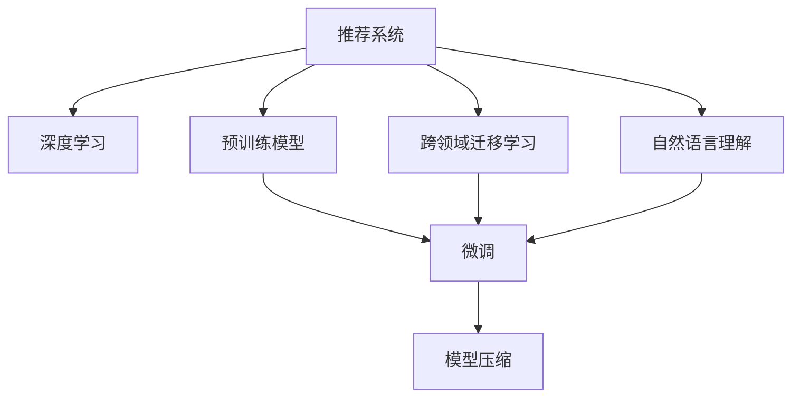

                 

# 推荐系统中的大模型课程学习与渐进优化

> 关键词：推荐系统, 大模型, 课程学习, 渐进优化

## 1. 背景介绍

### 1.1 问题由来
推荐系统是现代互联网信息流服务的重要组成部分，通过学习用户行为和偏好，为用户推荐符合其兴趣的商品、内容或服务。早期的推荐系统依赖于手工设计的特征工程和规则，难以应对大规模多维数据的挑战。近年来，基于机器学习的推荐系统，尤其是深度学习驱动的推荐系统，逐步取代传统推荐方法，成为行业的主流。

在大数据和计算资源充足的情况下，通过深度神经网络模型，推荐系统可以高效地建模用户-物品交互关系，从历史行为中挖掘出用户的潜在兴趣和偏好，实现个性化推荐。但由于用户行为数据的稀疏性和多变性，基于深度学习的推荐系统面临训练数据稀缺、模型过拟合等挑战。

为解决这些问题，近年来深度学习领域兴起了“大模型”这一范式，即通过大规模预训练语言模型(如BERT, GPT)，在大规模无标签数据上预训练，构建出通用语言表示。之后在大模型基础上进行“微调”，利用少量标注数据，适配特定推荐任务，获取更好的性能。这一范式极大地提升了推荐系统的效率和效果，成为当前推荐系统的主流方法。

### 1.2 问题核心关键点
推荐系统中的大模型微调核心关键点如下：

1. **预训练模型选择**：选择合适的预训练模型是微调成功的第一步，需要根据任务特点和数据规模进行选择。
2. **微调任务适配**：根据推荐任务设计合适的输出层和损失函数，适配到特定任务。
3. **微调策略制定**：选择合适的超参数、正则化技术和微调策略，避免过拟合。
4. **模型优化**：通过合理训练流程和模型优化策略，提升微调效果。
5. **系统部署**：将微调好的模型部署到推荐系统，实现实时推荐。

### 1.3 问题研究意义
推荐系统中的大模型微调具有重要意义：

1. **提高推荐效果**：通过微调，模型可以更好地理解用户行为和物品属性，生成更加个性化的推荐结果。
2. **减少计算资源**：相比从头训练，微调所需的计算资源更少，能更快速地上线推荐服务。
3. **拓展应用范围**：大模型微调可以应用于推荐系统中的各种任务，如商品推荐、内容推荐、服务推荐等。
4. **提升用户体验**：精准的个性化推荐能提升用户体验，增加用户黏性。
5. **促进行业发展**：推荐系统的优化升级，有助于电商、视频、社交等多个行业的健康发展。

## 2. 核心概念与联系

### 2.1 核心概念概述

为更好地理解推荐系统中的大模型微调方法，本节将介绍几个密切相关的核心概念：

- 推荐系统(Recommendation System)：通过分析用户行为和物品属性，为用户推荐符合其兴趣的商品、内容或服务的系统。
- 深度学习(Deep Learning)：一种使用多层神经网络进行复杂模式识别的机器学习方法，适用于推荐系统的深度学习推荐模型有NeuMF、Wide & Deep等。
- 预训练模型(Pre-trained Model)：在大量无标签数据上预先训练好的模型，可以用于推荐系统中的微调。
- 微调(Fine-tuning)：在预训练模型的基础上，通过少量标注数据，适配到特定推荐任务，提升模型性能。
- 模型压缩(Model Compression)：对大模型进行剪枝、量化等处理，减小模型尺寸，提升推理效率。
- 跨领域迁移学习(Cross-Domain Transfer Learning)：在相似领域中利用已训练模型进行迁移学习，提升新领域模型的性能。
- 自然语言理解(Natural Language Understanding)：通过深度学习模型对自然语言进行处理，为推荐系统提供用户输入和物品描述。

这些核心概念之间的逻辑关系可以通过以下Mermaid流程图来展示：



这个流程图展示了大语言模型在推荐系统中的应用框架，其中各个概念的联系尤为紧密：

1. 推荐系统通过深度学习模型进行建模。
2. 预训练模型在推荐系统中被用来微调，提升模型性能。
3. 微调后模型可能进一步进行模型压缩，提升推理效率。
4. 推荐系统可以通过跨领域迁移学习，拓展应用领域。
5. 自然语言理解技术为推荐系统提供用户输入和物品描述，进一步提升推荐效果。

## 3. 核心算法原理 & 具体操作步骤
### 3.1 算法原理概述

基于深度学习的大语言模型推荐系统，其实质是通过预训练模型进行迁移学习，适配到推荐系统中的特定任务，提升推荐效果。微调过程包括以下几个步骤：

1. **数据准备**：收集推荐系统中的用户行为数据和物品属性数据，将其划分为训练集、验证集和测试集。
2. **模型选择**：选择合适的预训练模型，如BERT、GPT等。
3. **任务适配**：设计输出层和损失函数，适配到特定推荐任务。
4. **微调过程**：在训练集上执行梯度下降等优化算法，最小化损失函数，使模型适应推荐任务。
5. **模型评估**：在验证集上评估模型性能，避免过拟合。
6. **部署上线**：将微调后的模型部署到推荐系统，实现实时推荐。

### 3.2 算法步骤详解

下面是推荐系统中大语言模型微调的具体操作步骤：

**Step 1: 准备数据集**
- 收集推荐系统中的用户行为数据和物品属性数据，如用户点击、评分、收藏等行为数据，物品的标题、描述、分类等信息。
- 将数据划分为训练集、验证集和测试集，确保各集之间的数据分布一致。
- 对数据进行清洗和处理，去除异常值和噪声。

**Step 2: 选择预训练模型**
- 选择合适的预训练模型，如BERT、GPT等，作为微调的基础模型。
- 根据任务特点和数据规模，选择合适的预训练模型的版本和参数规模。

**Step 3: 设计任务适配层**
- 根据推荐任务设计合适的输出层和损失函数。对于评分预测任务，通常使用线性回归损失函数；对于物品推荐任务，通常使用交叉熵损失函数。
- 将输出层和损失函数嵌入到预训练模型的顶层，与预训练层共同训练。

**Step 4: 设置微调超参数**
- 选择合适的优化算法及其参数，如AdamW、SGD等，设置学习率、批大小、迭代轮数等。
- 设置正则化技术及强度，包括权重衰减、Dropout、Early Stopping等。
- 确定冻结预训练参数的策略，如仅微调顶层，或全部参数都参与微调。

**Step 5: 执行梯度训练**
- 将训练集数据分批次输入模型，前向传播计算损失函数。
- 反向传播计算参数梯度，根据设定的优化算法和学习率更新模型参数。
- 周期性在验证集上评估模型性能，根据性能指标决定是否触发 Early Stopping。
- 重复上述步骤直到满足预设的迭代轮数或 Early Stopping 条件。

**Step 6: 模型评估与优化**
- 在验证集上评估微调后模型性能，对比微调前后的精度提升。
- 根据评估结果调整微调策略，如调整学习率、正则化强度、任务适配层设计等。
- 在测试集上进一步评估模型性能，确保模型的泛化能力。

**Step 7: 部署上线**
- 将微调好的模型部署到推荐系统中，实现实时推荐。
- 持续收集用户反馈和新数据，定期重新微调模型，以适应数据分布的变化。

以上就是推荐系统中大语言模型微调的一般流程。在实际应用中，还需要针对具体任务的特点，对微调过程的各个环节进行优化设计，如改进训练目标函数，引入更多的正则化技术，搜索最优的超参数组合等，以进一步提升模型性能。

### 3.3 算法优缺点

推荐系统中的大模型微调方法具有以下优点：
1. **效率高**：相比从头训练，微调所需的计算资源更少，能更快速地上线推荐服务。
2. **性能好**：通过微调，模型可以更好地理解用户行为和物品属性，生成更加个性化的推荐结果。
3. **可扩展性强**：微调后的模型可以应用到推荐系统中的各种任务，如商品推荐、内容推荐、服务推荐等。
4. **易于部署**：微调后的模型结构相对简单，易于部署到推荐系统中。

同时，该方法也存在一定的局限性：
1. **数据依赖性高**：微调效果很大程度上取决于标注数据的质量和数量，获取高质量标注数据的成本较高。
2. **模型泛化能力有限**：当目标任务与预训练数据的分布差异较大时，微调的性能提升有限。
3. **对抗样本鲁棒性差**：大模型容易受到对抗样本的干扰，导致推荐结果偏差。
4. **可解释性差**：微调模型的决策过程通常缺乏可解释性，难以对其推理逻辑进行分析和调试。

尽管存在这些局限性，但就目前而言，基于深度学习的微调方法仍是推荐系统中的主流范式。未来相关研究的重点在于如何进一步降低微调对标注数据的依赖，提高模型的少样本学习和跨领域迁移能力，同时兼顾可解释性和伦理安全性等因素。

### 3.4 算法应用领域

推荐系统中的大模型微调方法，已经在商品推荐、内容推荐、服务推荐等多个领域得到广泛应用，例如：

- 电商推荐：根据用户的历史行为和评分，推荐符合其兴趣的商品。
- 视频推荐：根据用户观看记录和评分，推荐相关视频内容。
- 新闻推荐：根据用户阅读记录和反馈，推荐感兴趣的新闻资讯。
- 音乐推荐：根据用户的听歌记录和评分，推荐相似的歌曲。

除了上述这些经典任务外，大语言模型微调也被创新性地应用到更多场景中，如个性化广告推荐、智能家居控制等，为推荐技术带来了全新的突破。随着预训练语言模型和微调方法的不断进步，相信推荐系统将在更广阔的应用领域大放异彩。

## 4. 数学模型和公式 & 详细讲解 & 举例说明

### 4.1 数学模型构建

推荐系统中的大模型微调模型可以表示为 $M_{\theta}$，其中 $\theta$ 为预训练得到的模型参数。假设推荐系统中的推荐任务为 $T$，训练集为 $D=\{(x_i,y_i)\}_{i=1}^N, x_i \in \mathcal{X}, y_i \in \mathcal{Y}$，其中 $\mathcal{X}$ 为输入空间，$\mathcal{Y}$ 为输出空间。

定义模型 $M_{\theta}$ 在输入 $x$ 上的输出为 $y=M_{\theta}(x) \in [0,1]$，表示用户对物品 $x$ 的兴趣程度。真实标签 $y_i \in \{0,1\}$。则推荐任务的交叉熵损失函数为：

$$
\ell(y,M_{\theta}(x)) = -y\log M_{\theta}(x) - (1-y)\log (1-M_{\theta}(x))
$$

在数据集 $D$ 上的经验风险为：

$$
\mathcal{L}(\theta) = \frac{1}{N}\sum_{i=1}^N \ell(y_i,M_{\theta}(x_i))
$$

微调的优化目标是最小化经验风险，即找到最优参数：

$$
\theta^* = \mathop{\arg\min}_{\theta} \mathcal{L}(\theta)
$$

在实践中，我们通常使用基于梯度的优化算法（如AdamW、SGD等）来近似求解上述最优化问题。设 $\eta$ 为学习率，$\lambda$ 为正则化系数，则参数的更新公式为：

$$
\theta \leftarrow \theta - \eta \nabla_{\theta}\mathcal{L}(\theta) - \eta\lambda\theta
$$

其中 $\nabla_{\theta}\mathcal{L}(\theta)$ 为损失函数对参数 $\theta$ 的梯度，可通过反向传播算法高效计算。

### 4.2 公式推导过程

以下我们以评分预测任务为例，推导交叉熵损失函数及其梯度的计算公式。

假设模型 $M_{\theta}$ 在输入 $x$ 上的输出为 $y=M_{\theta}(x)$，真实标签 $y_i \in \{0,1\}$。则二分类交叉熵损失函数为：

$$
\ell(y,M_{\theta}(x)) = -y\log M_{\theta}(x) - (1-y)\log (1-M_{\theta}(x))
$$

将其代入经验风险公式，得：

$$
\mathcal{L}(\theta) = -\frac{1}{N}\sum_{i=1}^N [y_i\log M_{\theta}(x_i)+(1-y_i)\log(1-M_{\theta}(x_i))]
$$

根据链式法则，损失函数对参数 $\theta_k$ 的梯度为：

$$
\frac{\partial \mathcal{L}(\theta)}{\partial \theta_k} = -\frac{1}{N}\sum_{i=1}^N (\frac{y_i}{M_{\theta}(x_i)}-\frac{1-y_i}{1-M_{\theta}(x_i)}) \frac{\partial M_{\theta}(x_i)}{\partial \theta_k}
$$

其中 $\frac{\partial M_{\theta}(x_i)}{\partial \theta_k}$ 可进一步递归展开，利用自动微分技术完成计算。

在得到损失函数的梯度后，即可带入参数更新公式，完成模型的迭代优化。重复上述过程直至收敛，最终得到适应推荐任务的最优模型参数 $\theta^*$。

## 5. 项目实践：代码实例和详细解释说明
### 5.1 开发环境搭建

在进行推荐系统中的大模型微调实践前，我们需要准备好开发环境。以下是使用Python进行PyTorch开发的环境配置流程：

1. 安装Anaconda：从官网下载并安装Anaconda，用于创建独立的Python环境。

2. 创建并激活虚拟环境：
```bash
conda create -n pytorch-env python=3.8 
conda activate pytorch-env
```

3. 安装PyTorch：根据CUDA版本，从官网获取对应的安装命令。例如：
```bash
conda install pytorch torchvision torchaudio cudatoolkit=11.1 -c pytorch -c conda-forge
```

4. 安装Transformers库：
```bash
pip install transformers
```

5. 安装各类工具包：
```bash
pip install numpy pandas scikit-learn matplotlib tqdm jupyter notebook ipython
```

完成上述步骤后，即可在`pytorch-env`环境中开始微调实践。

### 5.2 源代码详细实现

这里我们以商品推荐任务为例，给出使用Transformers库对BERT模型进行微调的PyTorch代码实现。

首先，定义推荐任务的数据处理函数：

```python
from transformers import BertTokenizer
from torch.utils.data import Dataset
import torch

class RecommendationDataset(Dataset):
    def __init__(self, user_behaviors, item_features, tokenizer, max_len=128):
        self.user_behaviors = user_behaviors
        self.item_features = item_features
        self.tokenizer = tokenizer
        self.max_len = max_len
        
    def __len__(self):
        return len(self.user_behaviors)
    
    def __getitem__(self, item):
        user_behavior = self.user_behaviors[item]
        item_feature = self.item_features[item]
        
        encoding = self.tokenizer(user_behavior, return_tensors='pt', max_length=self.max_len, padding='max_length', truncation=True)
        input_ids = encoding['input_ids'][0]
        attention_mask = encoding['attention_mask'][0]
        
        # 对item特征进行编码
        item_feature_ids = [id for id in item_feature]
        item_feature_ids.extend([0] * (self.max_len - len(item_feature_ids)))
        item_feature_labels = torch.tensor(item_feature_ids, dtype=torch.long)
        
        return {'input_ids': input_ids, 
                'attention_mask': attention_mask,
                'item_feature_labels': item_feature_labels}

# 构建dataset
tokenizer = BertTokenizer.from_pretrained('bert-base-cased')

recommendation_dataset = RecommendationDataset(user_behaviors, item_features, tokenizer)
```

然后，定义模型和优化器：

```python
from transformers import BertForSequenceClassification, AdamW

model = BertForSequenceClassification.from_pretrained('bert-base-cased', num_labels=len(user_labels))

optimizer = AdamW(model.parameters(), lr=2e-5)
```

接着，定义训练和评估函数：

```python
from torch.utils.data import DataLoader
from tqdm import tqdm
from sklearn.metrics import accuracy_score

device = torch.device('cuda') if torch.cuda.is_available() else torch.device('cpu')
model.to(device)

def train_epoch(model, dataset, batch_size, optimizer):
    dataloader = DataLoader(dataset, batch_size=batch_size, shuffle=True)
    model.train()
    epoch_loss = 0
    for batch in tqdm(dataloader, desc='Training'):
        user_behavior = batch['input_ids'].to(device)
        attention_mask = batch['attention_mask'].to(device)
        item_feature_labels = batch['item_feature_labels'].to(device)
        model.zero_grad()
        outputs = model(user_behavior, attention_mask=attention_mask, labels=item_feature_labels)
        loss = outputs.loss
        epoch_loss += loss.item()
        loss.backward()
        optimizer.step()
    return epoch_loss / len(dataloader)

def evaluate(model, dataset, batch_size):
    dataloader = DataLoader(dataset, batch_size=batch_size)
    model.eval()
    preds, labels = [], []
    with torch.no_grad():
        for batch in tqdm(dataloader, desc='Evaluating'):
            user_behavior = batch['input_ids'].to(device)
            attention_mask = batch['attention_mask'].to(device)
            batch_labels = batch['item_feature_labels']
            outputs = model(user_behavior, attention_mask=attention_mask)
            batch_preds = outputs.logits.argmax(dim=2).to('cpu').tolist()
            batch_labels = batch_labels.to('cpu').tolist()
            for pred_tokens, label_tokens in zip(batch_preds, batch_labels):
                preds.append(pred_tokens[:len(label_tokens)])
                labels.append(label_tokens)
                
    return accuracy_score(labels, preds)

```

最后，启动训练流程并在测试集上评估：

```python
epochs = 5
batch_size = 16

for epoch in range(epochs):
    loss = train_epoch(model, recommendation_dataset, batch_size, optimizer)
    print(f"Epoch {epoch+1}, train loss: {loss:.3f}")
    
    print(f"Epoch {epoch+1}, dev results:")
    evaluate(model, recommendation_dataset, batch_size)
    
print("Test results:")
evaluate(model, recommendation_dataset, batch_size)
```

以上就是使用PyTorch对BERT进行商品推荐任务微调的完整代码实现。可以看到，得益于Transformers库的强大封装，我们可以用相对简洁的代码完成BERT模型的加载和微调。

### 5.3 代码解读与分析

让我们再详细解读一下关键代码的实现细节：

**RecommendationDataset类**：
- `__init__`方法：初始化用户行为数据、物品属性数据、分词器等关键组件。
- `__len__`方法：返回数据集的样本数量。
- `__getitem__`方法：对单个样本进行处理，将用户行为输入编码为token ids，将物品属性编码为数字，并对其进行定长padding，最终返回模型所需的输入。

**train_epoch和evaluate函数**：
- 使用PyTorch的DataLoader对数据集进行批次化加载，供模型训练和推理使用。
- 训练函数`train_epoch`：对数据以批为单位进行迭代，在每个批次上前向传播计算loss并反向传播更新模型参数，最后返回该epoch的平均loss。
- 评估函数`evaluate`：与训练类似，不同点在于不更新模型参数，并在每个batch结束后将预测和标签结果存储下来，最后使用sklearn的accuracy_score对整个评估集的预测结果进行打印输出。

**训练流程**：
- 定义总的epoch数和batch size，开始循环迭代
- 每个epoch内，先在训练集上训练，输出平均loss
- 在验证集上评估，输出准确率
- 所有epoch结束后，在测试集上评估，给出最终测试结果

可以看到，PyTorch配合Transformers库使得BERT微调的代码实现变得简洁高效。开发者可以将更多精力放在数据处理、模型改进等高层逻辑上，而不必过多关注底层的实现细节。

当然，工业级的系统实现还需考虑更多因素，如模型的保存和部署、超参数的自动搜索、更灵活的任务适配层等。但核心的微调范式基本与此类似。

## 6. 实际应用场景
### 6.1 智能客服系统

基于大语言模型微调的对话技术，可以广泛应用于智能客服系统的构建。传统客服往往需要配备大量人力，高峰期响应缓慢，且一致性和专业性难以保证。而使用微调后的对话模型，可以7x24小时不间断服务，快速响应客户咨询，用自然流畅的语言解答各类常见问题。

在技术实现上，可以收集企业内部的历史客服对话记录，将问题和最佳答复构建成监督数据，在此基础上对预训练对话模型进行微调。微调后的对话模型能够自动理解用户意图，匹配最合适的答案模板进行回复。对于客户提出的新问题，还可以接入检索系统实时搜索相关内容，动态组织生成回答。如此构建的智能客服系统，能大幅提升客户咨询体验和问题解决效率。

### 6.2 金融舆情监测

金融机构需要实时监测市场舆论动向，以便及时应对负面信息传播，规避金融风险。传统的人工监测方式成本高、效率低，难以应对网络时代海量信息爆发的挑战。基于大语言模型微调的文本分类和情感分析技术，为金融舆情监测提供了新的解决方案。

具体而言，可以收集金融领域相关的新闻、报道、评论等文本数据，并对其进行主题标注和情感标注。在此基础上对预训练语言模型进行微调，使其能够自动判断文本属于何种主题，情感倾向是正面、中性还是负面。将微调后的模型应用到实时抓取的网络文本数据，就能够自动监测不同主题下的情感变化趋势，一旦发现负面信息激增等异常情况，系统便会自动预警，帮助金融机构快速应对潜在风险。

### 6.3 个性化推荐系统

当前的推荐系统往往只依赖用户的历史行为数据进行物品推荐，无法深入理解用户的真实兴趣偏好。基于大语言模型微调技术，个性化推荐系统可以更好地挖掘用户行为背后的语义信息，从而提供更精准、多样的推荐内容。

在实践中，可以收集用户浏览、点击、评论、分享等行为数据，提取和用户交互的物品标题、描述、标签等文本内容。将文本内容作为模型输入，用户的后续行为（如是否点击、购买等）作为监督信号，在此基础上微调预训练语言模型。微调后的模型能够从文本内容中准确把握用户的兴趣点。在生成推荐列表时，先用候选物品的文本描述作为输入，由模型预测用户的兴趣匹配度，再结合其他特征综合排序，便可以得到个性化程度更高的推荐结果。

### 6.4 未来应用展望

随着大语言模型微调技术的发展，其在推荐系统中的应用前景将更加广阔。以下是一些未来可能的应用场景：

1. **多模态推荐**：结合文本、图像、音频等多种模态信息，提升推荐效果。例如，根据视频内容和文本描述推荐相似的视频内容。
2. **情感驱动推荐**：利用情感分析技术，推荐与用户情绪匹配的内容。例如，推荐能够缓解用户负面情绪的音乐、视频等。
3. **跨领域推荐**：通过跨领域迁移学习，拓展推荐系统的应用范围。例如，将电商领域的推荐模型应用于视频推荐系统。
4. **协同过滤推荐**：结合用户行为和物品属性，进行协同过滤推荐。例如，推荐与用户相似用户喜欢的商品。
5. **实时推荐**：通过在线微调，实现实时推荐。例如，根据用户实时行为动态更新推荐结果。

这些应用场景将进一步推动大语言模型微调技术的发展，使其在更广泛的领域中发挥重要作用。

## 7. 工具和资源推荐
### 7.1 学习资源推荐

为了帮助开发者系统掌握推荐系统中的大模型微调的理论基础和实践技巧，这里推荐一些优质的学习资源：

1. 《深度学习推荐系统》系列博文：由大模型技术专家撰写，深入浅出地介绍了推荐系统中的深度学习推荐模型、大模型微调等前沿话题。

2. 《Recommender Systems in Practice》课程：由Stanford University开设的推荐系统实战课程，涵盖深度学习推荐模型、模型优化、评估指标等实际应用问题。

3. 《推荐系统: 理论与算法》书籍：是一本推荐系统领域经典教材，涵盖了推荐系统的基础理论和常用算法。

4. 《Hands-On Recommendation Systems with PyTorch》书籍：使用PyTorch实现推荐系统中的深度学习模型，包含多个实战项目和代码实例。

5. Kaggle推荐系统竞赛：Kaggle平台上的推荐系统竞赛，可以实践大模型微调技术，提升推荐效果。

通过对这些资源的学习实践，相信你一定能够快速掌握推荐系统中的大模型微调精髓，并用于解决实际的推荐问题。

### 7.2 开发工具推荐

高效的开发离不开优秀的工具支持。以下是几款用于推荐系统中大模型微调开发的常用工具：

1. PyTorch：基于Python的开源深度学习框架，灵活动态的计算图，适合快速迭代研究。大部分预训练语言模型都有PyTorch版本的实现。

2. TensorFlow：由Google主导开发的开源深度学习框架，生产部署方便，适合大规模工程应用。同样有丰富的预训练语言模型资源。

3. Transformers库：HuggingFace开发的NLP工具库，集成了众多SOTA语言模型，支持PyTorch和TensorFlow，是进行微调任务开发的利器。

4. Weights & Biases：模型训练的实验跟踪工具，可以记录和可视化模型训练过程中的各项指标，方便对比和调优。与主流深度学习框架无缝集成。

5. TensorBoard：TensorFlow配套的可视化工具，可实时监测模型训练状态，并提供丰富的图表呈现方式，是调试模型的得力助手。

6. Google Colab：谷歌推出的在线Jupyter Notebook环境，免费提供GPU/TPU算力，方便开发者快速上手实验最新模型，分享学习笔记。

合理利用这些工具，可以显著提升推荐系统中大模型微调的开发效率，加快创新迭代的步伐。

### 7.3 相关论文推荐

推荐系统中的大模型微调技术在学术界和工业界已经得到了广泛研究。以下是几篇奠基性的相关论文，推荐阅读：

1. Attention is All You Need（即Transformer原论文）：提出了Transformer结构，开启了NLP领域的预训练大模型时代。

2. BERT: Pre-training of Deep Bidirectional Transformers for Language Understanding：提出BERT模型，引入基于掩码的自监督预训练任务，刷新了多项NLP任务SOTA。

3. Progressive Distillation: A Simple Framework for Scalable Knowledge Transfer：提出Progressive Distillation方法，通过逐步微调的方式，解决大规模语言模型迁移学习问题。

4. Deep Joint Attention Networks for Recommendation Systems：提出DjQueryNet，一种基于深度学习的推荐系统模型，取得了优异的推荐效果。

5. Personalized Knowledge Graph Embeddings for Recommendation Systems：提出KG-Embedding，结合知识图谱与深度学习，提升推荐效果。

这些论文代表了大语言模型微调技术的发展脉络。通过学习这些前沿成果，可以帮助研究者把握学科前进方向，激发更多的创新灵感。

## 8. 总结：未来发展趋势与挑战

### 8.1 总结

本文对推荐系统中的大模型微调方法进行了全面系统的介绍。首先阐述了推荐系统和大语言模型微调的研究背景和意义，明确了大模型微调在提高推荐效果、减少计算资源等方面的重要价值。其次，从原理到实践，详细讲解了推荐系统中的大模型微调数学模型和关键步骤，给出了微调任务开发的完整代码实例。同时，本文还广泛探讨了大模型微调在智能客服、金融舆情、个性化推荐等多个行业领域的应用前景，展示了微调范式的巨大潜力。此外，本文精选了大模型微调技术的各类学习资源，力求为读者提供全方位的技术指引。

通过本文的系统梳理，可以看到，推荐系统中的大模型微调方法正在成为推荐系统中的重要范式，极大地拓展了预训练语言模型的应用边界，催生了更多的落地场景。受益于大规模语料的预训练，微调模型以更低的时间和标注成本，在小样本条件下也能取得不俗的效果，有力推动了推荐系统的产业化进程。未来，伴随预训练语言模型和微调方法的持续演进，相信推荐系统将在更广阔的应用领域大放异彩，深刻影响人类的生产生活方式。

### 8.2 未来发展趋势

展望未来，推荐系统中的大模型微调技术将呈现以下几个发展趋势：

1. **模型规模持续增大**：随着算力成本的下降和数据规模的扩张，预训练语言模型的参数量还将持续增长。超大规模语言模型蕴含的丰富语言知识，有望支撑更加复杂多变的推荐任务。

2. **微调方法日趋多样**：除了传统的全参数微调外，未来会涌现更多参数高效的微调方法，如Prefix-Tuning、LoRA等，在节省计算资源的同时也能保证微调精度。

3. **持续学习成为常态**：随着数据分布的不断变化，微调模型也需要持续学习新知识以保持性能。如何在不遗忘原有知识的同时，高效吸收新样本信息，将成为重要的研究课题。

4. **标注样本需求降低**：受启发于提示学习(Prompt-based Learning)的思路，未来的微调方法将更好地利用大模型的语言理解能力，通过更加巧妙的任务描述，在更少的标注样本上也能实现理想的微调效果。

5. **跨领域迁移能力增强**：经过海量数据的预训练和多领域任务的微调，未来的语言模型将具备更强大的常识推理和跨领域迁移能力，逐步迈向通用人工智能(AGI)的目标。

以上趋势凸显了大语言模型微调技术的广阔前景。这些方向的探索发展，必将进一步提升推荐系统的性能和应用范围，为人类认知智能的进化带来深远影响。

### 8.3 面临的挑战

尽管推荐系统中的大模型微调技术已经取得了瞩目成就，但在迈向更加智能化、普适化应用的过程中，它仍面临着诸多挑战：

1. **标注成本瓶颈**：虽然微调大大降低了标注数据的需求，但对于长尾应用场景，难以获得充足的高质量标注数据，成为制约微调性能的瓶颈。如何进一步降低微调对标注样本的依赖，将是一大难题。

2. **模型鲁棒性不足**：当前微调模型面对域外数据时，泛化性能往往大打折扣。对于测试样本的微小扰动，微调模型的预测也容易发生波动。如何提高微调模型的鲁棒性，避免灾难性遗忘，还需要更多理论和实践的积累。

3. **推理效率有待提高**：大规模语言模型虽然精度高，但在实际部署时往往面临推理速度慢、内存占用大等效率问题。如何在保证性能的同时，简化模型结构，提升推理速度，优化资源占用，将是重要的优化方向。

4. **可解释性亟需加强**：当前微调模型更像是"黑盒"系统，难以解释其内部工作机制和决策逻辑。对于医疗、金融等高风险应用，算法的可解释性和可审计性尤为重要。如何赋予微调模型更强的可解释性，将是亟待攻克的难题。

5. **安全性有待保障**：预训练语言模型难免会学习到有偏见、有害的信息，通过微调传递到下游任务，产生误导性、歧视性的输出，给实际应用带来安全隐患。如何从数据和算法层面消除模型偏见，避免恶意用途，确保输出的安全性，也将是重要的研究课题。

6. **知识整合能力不足**：现有的微调模型往往局限于任务内数据，难以灵活吸收和运用更广泛的先验知识。如何让微调过程更好地与外部知识库、规则库等专家知识结合，形成更加全面、准确的信息整合能力，还有很大的想象空间。

正视推荐系统中的大模型微调面临的这些挑战，积极应对并寻求突破，将是大模型微调走向成熟的必由之路。相信随着学界和产业界的共同努力，这些挑战终将一一被克服，大模型微调必将在构建人机协同的智能时代中扮演越来越重要的角色。

### 8.4 研究展望

面对推荐系统中的大模型微调所面临的种种挑战，未来的研究需要在以下几个方面寻求新的突破：

1. **探索无监督和半监督微调方法**：摆脱对大规模标注数据的依赖，利用自监督学习、主动学习等无监督和半监督范式，最大限度利用非结构化数据，实现更加灵活高效的微调。

2. **研究参数高效和计算高效的微调范式**：开发更加参数高效的微调方法，在固定大部分预训练参数的同时，只更新极少量的任务相关参数。同时优化微调模型的计算图，减少前向传播和反向传播的资源消耗，实现更加轻量级、实时性的部署。

3. **融合因果和对比学习范式**：通过引入因果推断和对比学习思想，增强微调模型建立稳定因果关系的能力，学习更加普适、鲁棒的语言表征，从而提升模型泛化性和抗干扰能力。

4. **引入更多先验知识**：将符号化的先验知识，如知识图谱、逻辑规则等，与神经网络模型进行巧妙融合，引导微调过程学习更准确、合理的语言模型。同时加强不同模态数据的整合，实现视觉、语音等多模态信息与文本信息的协同建模。

5. **结合因果分析和博弈论工具**：将因果分析方法引入微调模型，识别出模型决策的关键特征，增强输出解释的因果性和逻辑性。借助博弈论工具刻画人机交互过程，主动探索并规避模型的脆弱点，提高系统稳定性。

6. **纳入伦理道德约束**：在模型训练目标中引入伦理导向的评估指标，过滤和惩罚有偏见、有害的输出倾向。同时加强人工干预和审核，建立模型行为的监管机制，确保输出符合人类价值观和伦理道德。

这些研究方向的探索，必将引领推荐系统中的大语言模型微调技术迈向更高的台阶，为构建安全、可靠、可解释、可控的智能系统铺平道路。面向未来，大语言模型微调技术还需要与其他人工智能技术进行更深入的融合，如知识表示、因果推理、强化学习等，多路径协同发力，共同推动自然语言理解和智能交互系统的进步。只有勇于创新、敢于突破，才能不断拓展语言模型的边界，让智能技术更好地造福人类社会。

## 9. 附录：常见问题与解答

**Q1：推荐系统中的大模型微调是否适用于所有推荐任务？**

A: 大模型微调在大多数推荐任务上都能取得不错的效果，特别是对于数据量较小的任务。但对于一些特定领域的任务，如医学、法律等，仅仅依靠通用语料预训练的模型可能难以很好地适应。此时需要在特定领域语料上进一步预训练，再进行微调，才能获得理想效果。此外，对于一些需要时效性、个性化很强的任务，如对话推荐、动态商品推荐等，微调方法也需要针对性的改进优化。

**Q2：微调过程中如何选择合适的学习率？**

A: 微调的学习率一般要比预训练时小1-2个数量级，如果使用过大的学习率，容易破坏预训练权重，导致过拟合。一般建议从1e-5开始调参，逐步减小学习率，直至收敛。也可以使用warmup策略，在开始阶段使用较小的学习率，再逐渐过渡到预设值。需要注意的是，不同的优化器(如AdamW、Adafactor等)以及不同的学习率调度策略，可能需要设置不同的学习率阈值。

**Q3：采用大模型微调时会面临哪些资源瓶颈？**

A: 目前主流的预训练大模型动辄以亿计的参数规模，对算力、内存、存储都提出了很高的要求。GPU/TPU等高性能设备是必不可少的，但即便如此，超大批次的训练和推理也可能遇到显存不足的问题。因此需要采用一些资源优化技术，如梯度积累、混合精度训练、模型并行等，来突破硬件瓶颈。同时，模型的存储和读取也可能占用大量时间和空间，需要采用模型压缩、稀疏化存储等方法进行优化。

**Q4：如何缓解微调过程中的过拟合问题？**

A: 过拟合是微调面临的主要挑战，尤其是在标注数据不足的情况下。常见的缓解策略包括：
1. 数据增强：通过回译、近义替换等方式扩充训练集
2. 正则化：使用L2正则、Dropout、Early Stopping等避免过拟合
3. 对抗训练：引入对抗样本，提高模型鲁棒性
4. 参数高效微调：只调整少量参数(如Adapter、Prefix等)，减小过拟合风险
5. 多模型集成：训练多个微调模型，取平均输出，抑制过拟合

这些策略往往需要根据具体任务和数据特点进行灵活组合。只有在数据、模型、训练、推理等各环节进行全面优化，才能最大限度地发挥大模型微调的威力。

**Q5：微调模型在落地部署时需要注意哪些问题？**

A: 将微调好的模型部署到推荐系统，还需要考虑以下因素：
1. 模型裁剪：去除不必要的层和参数，减小模型尺寸，加快推理速度
2. 量化加速：将浮点模型转为定点模型，压缩存储空间，提高计算效率
3. 服务化封装：将模型封装为标准化服务接口，便于集成调用
4. 弹性伸缩：根据请求流量动态调整资源配置，平衡服务质量和成本
5. 监控告警：实时采集系统指标，设置异常告警阈值，确保服务稳定性
6. 安全防护：采用访问鉴权、数据脱敏等措施，保障数据和模型安全

大语言模型微调为推荐系统带来了广阔的想象空间，但如何将强大的性能转化为稳定、高效、安全的业务价值，还需要工程实践的不断打磨。唯有从数据、算法、工程、业务等多个维度协同发力，才能真正实现人工智能技术在垂直行业的规模化落地。总之，微调需要开发者根据具体任务，不断迭代和优化模型、数据和算法，方能得到理想的效果。

---

作者：禅与计算机程序设计艺术 / Zen and the Art of Computer Programming

