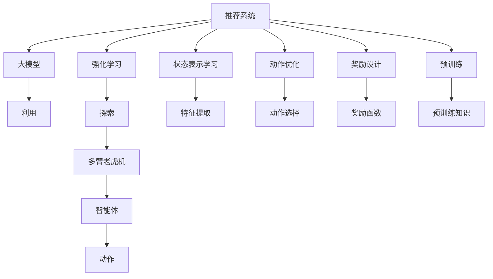

                 

# 推荐系统中的强化学习：大模型探索与利用

> 关键词：推荐系统,强化学习,大模型,利用,探索

## 1. 背景介绍

### 1.1 问题由来
随着互联网和移动互联网的快速发展，海量的用户行为数据为推荐系统提供了丰富的训练素材。传统的基于矩阵分解的推荐算法，如协同过滤、基于内容的推荐等，已经难以应对数据复杂性和用户个性化需求的多样性。为了提升推荐系统的性能和用户体验，业界纷纷引入新兴的智能算法。

近年来，强化学习(RL)在推荐系统中的应用日益受到关注。通过将用户与物品之间的关系映射为强化学习环境中的“状态-动作-奖励”模型，推荐系统可以更智能地根据用户行为进行策略学习，从而实现个性化推荐。这种范式下的推荐算法，被称为强化推荐算法。

本文将详细介绍强化推荐算法的基本原理和实际应用，探讨利用大模型进行推荐系统优化的方式，并展望其未来发展趋势和挑战。

### 1.2 问题核心关键点
强化推荐算法的核心在于通过智能策略学习，最大化用户的长期奖励。其关键点包括：

1. **状态表示学习**：将用户和物品的关系抽象为状态空间，通过自监督学习和跨模态信息融合，学习高效的状态表示。
2. **动作优化**：设计多样化的推荐动作，如展示商品、推荐视频、推送内容等，并使用强化学习算法优化推荐策略。
3. **奖励设计**：设计合理的奖励函数，考虑不同行为对用户的长期价值和短期反馈，平衡点击率、转化率、用户满意度等指标。
4. **大模型利用**：利用大模型进行预训练，提取丰富的用户和物品特征，并通过微调进一步优化推荐模型。

## 2. 核心概念与联系

### 2.1 核心概念概述

为更好地理解强化推荐算法和大模型的结合，本节将介绍几个密切相关的核心概念：

- **推荐系统**：通过分析用户的历史行为和偏好，为用户推荐其可能感兴趣的商品或内容，提升用户体验和转化率的技术系统。

- **强化学习**：通过智能体在环境中与环境的交互，最大化长期奖励的优化过程。强化学习算法通常包含状态空间、动作空间、奖励函数、策略等关键组件。

- **大模型**：以Transformer、BERT等架构为代表的预训练语言模型。通过在海量文本数据上进行预训练，大模型可以学习到丰富的语言和语义知识，广泛应用于自然语言处理、图像处理等任务中。

- **利用与探索**：在强化推荐中，智能体需要在已有的知识基础上，不断探索新的推荐策略，以应对变化多端的用户需求。大模型的利用可以提供强大的先验知识，而探索则可以通过奖励函数设计、策略优化等手段来实现。

- **多臂老虎机**：强化推荐中的重要问题，指智能体需要在多个候选动作之间进行权衡选择，最大化长期奖励。与多臂老虎机的策略优化类似，推荐系统中也可以采用“ε-贪婪”策略、上下文 bandit 等方法。

这些核心概念之间的逻辑关系可以通过以下Mermaid流程图来展示：



这个流程图展示了一个强化推荐系统的关键组件及其之间的联系：

1. 推荐系统通过分析用户和物品关系，应用强化学习算法优化推荐策略。
2. 大模型提供丰富的特征表示，用于状态表示学习和动作优化。
3. 智能体在多臂老虎机问题中探索最优策略，最大化长期奖励。

这些概念共同构成了强化推荐算法的理论基础和实践框架，为推荐系统优化提供了新的方法和视角。

## 3. 核心算法原理 & 具体操作步骤
### 3.1 算法原理概述

强化推荐算法的核心原理是将用户与物品之间的关系映射为强化学习环境中的“状态-动作-奖励”模型。智能体通过与环境的交互，不断学习最优的推荐策略，最大化长期奖励。

具体来说，假设推荐系统中有$N$个用户，$M$个物品，每个用户根据自身的历史行为，对每个物品进行打分$R(u,i)$，其中$u$表示用户，$i$表示物品。推荐系统的目标是通过智能体学习最优的推荐策略$A$，使得用户的总奖励$V(A)$最大化。

在每个时间步$t$，智能体根据当前状态$S_t$选择一个动作$a_t$，并在环境中观察到新的状态$S_{t+1}$和即时奖励$r_t$。推荐系统通过不断调整策略$A$，最大化长期奖励$V(A)$。

### 3.2 算法步骤详解

强化推荐算法的实现步骤如下：

**Step 1: 构建状态表示**

- 将用户和物品的关系抽象为状态空间$S$。
- 利用大模型提取用户和物品的特征，生成状态表示$\phi(S)$。

**Step 2: 设计动作空间**

- 设计多样化的推荐动作，如展示商品、推荐视频、推送内容等。
- 将动作映射为模型输入，如输入物品的ID或名称。

**Step 3: 设计奖励函数**

- 定义奖励函数$R$，衡量推荐动作对用户的即时和长期影响。
- 考虑不同行为对用户的点击率、转化率、用户满意度等指标。

**Step 4: 策略优化**

- 选择合适的强化学习算法，如Q-learning、SARSA、Deep Q-Network等。
- 通过迭代训练，不断更新推荐策略$A$，最大化长期奖励$V(A)$。

**Step 5: 模型微调**

- 利用大模型的预训练知识，提取丰富的特征表示。
- 在微调后的大模型上，优化推荐策略，提升推荐效果。

### 3.3 算法优缺点

强化推荐算法的优点包括：

1. 能够动态适应用户需求，推荐策略更加灵活和个性化。
2. 通过探索和利用，平衡点击率、转化率等指标，提升推荐效果。
3. 能够处理多模态数据，融合文本、图像、音频等多源信息。
4. 适用于数据分布变化较大的推荐场景，具有较好的泛化能力。

缺点则包括：

1. 模型训练成本较高，需要大量标注数据和计算资源。
2. 奖励设计复杂，难以全面评估推荐策略的效果。
3. 动作空间较大，智能体需要进行复杂的探索和选择。
4. 部分方法如深度强化学习，需要较大的模型和计算资源支持。

### 3.4 算法应用领域

强化推荐算法已经在多个实际场景中得到应用，例如：

- 电商平台：为每个用户推荐其可能感兴趣的商品，提高销售额和用户体验。
- 视频平台：根据用户观看历史和偏好，推荐可能感兴趣的视频内容。
- 音乐平台：通过用户的听歌历史，推荐可能喜欢的音乐或歌手。
- 社交网络：根据用户的互动行为，推荐可能感兴趣的朋友或内容。

除了上述这些经典应用，强化推荐算法还在新闻聚合、新闻推荐、广告推荐等领域得到了广泛的应用。随着预训练语言模型和大模型的不断演进，强化推荐算法有望在更多场景中发挥其独特优势，推动推荐系统的智能化进程。

## 4. 数学模型和公式 & 详细讲解 & 举例说明

### 4.1 数学模型构建

强化推荐算法的基本模型可以描述为：

- 状态空间$S$：包含用户和物品的信息，如用户ID、物品ID、时间戳等。
- 动作空间$A$：推荐动作，如展示商品、推荐视频、推送内容等。
- 奖励函数$R$：衡量推荐动作对用户的即时和长期影响。
- 策略$A$：推荐策略，表示在每个时间步选择动作的概率分布。

推荐系统的目标是通过策略$A$，最大化长期奖励$V(A)$：

$$
V(A) = \mathbb{E}_{\pi \sim A}\left[\sum_{t=1}^{T} \gamma^{t-1} r_t\right]
$$

其中$\pi$表示在策略$A$下，智能体选择的动作序列，$T$表示时间步数，$\gamma$表示折扣因子，$r_t$表示在时间步$t$的即时奖励。

### 4.2 公式推导过程

以Q-learning算法为例，推导强化推荐算法的核心公式：

- 定义状态-动作对的Q值：$Q(s,a) = \mathbb{E}\left[\sum_{t=1}^{T} \gamma^{t-1} r_t \mid S_t = s, A_t = a\right]$

- 在每个时间步$t$，更新Q值的公式为：

$$
Q(s,a) \leftarrow (1-\alpha)Q(s,a) + \alpha\left(r_t + \gamma \max_{a'} Q(s',a')\right)
$$

其中$\alpha$表示学习率，$a'$表示下一个时间步可能采取的动作。

在推荐系统中，智能体通过与环境交互，更新每个状态-动作对的Q值，从而得到最优的推荐策略。

### 4.3 案例分析与讲解

考虑一个简单的电商平台推荐场景，智能体根据用户的历史购买记录和浏览行为，推荐可能感兴趣的商品。假设每个用户有$M$个候选商品，智能体在每个时间步$t$，选择一个商品$i$进行展示，观察用户的点击行为$y_t$。奖励函数可以定义为：

$$
R(y_t,i) = \begin{cases}
1, & \text{if } y_t = 1 \\
0, & \text{otherwise}
\end{cases}
$$

即如果用户点击了商品，则奖励为1，否则为0。智能体的策略为随机选择一个商品进行展示，学习率$\alpha = 0.1$。

假设在时间步$t=1$，智能体选择展示商品1，用户点击了商品2，智能体得到即时奖励1，并更新状态和动作，得到新的状态和即时奖励：

- 时间步$t=1$：状态为用户的浏览记录和历史购买记录，智能体选择展示商品1，奖励为0，状态更新为新的浏览记录。
- 时间步$t=2$：智能体选择展示商品2，用户点击了商品2，奖励为1，状态更新为新的浏览记录。

智能体通过不断更新Q值和策略，学习到最佳的推荐策略。

## 5. 项目实践：代码实例和详细解释说明
### 5.1 开发环境搭建

在进行强化推荐算法实践前，我们需要准备好开发环境。以下是使用Python进行PyTorch开发的环境配置流程：

1. 安装Anaconda：从官网下载并安装Anaconda，用于创建独立的Python环境。

2. 创建并激活虚拟环境：
```bash
conda create -n rllab-env python=3.8 
conda activate rllab-env
```

3. 安装PyTorch：根据CUDA版本，从官网获取对应的安装命令。例如：
```bash
conda install pytorch torchvision torchaudio cudatoolkit=11.1 -c pytorch -c conda-forge
```

4. 安装OpenAI Gym：
```bash
pip install gym
```

5. 安装PyTorch RLLib：
```bash
pip install torch-rllib
```

6. 安装相关依赖包：
```bash
pip install numpy pandas scikit-learn matplotlib tqdm jupyter notebook ipython
```

完成上述步骤后，即可在`rllab-env`环境中开始强化推荐算法的实践。

### 5.2 源代码详细实现

这里我们以Q-learning算法为例，实现一个简单的推荐系统。

首先，定义推荐系统的状态表示和学习率：

```python
import torch
import torch.nn as nn
import torch.optim as optim

# 定义状态表示
class State(nn.Module):
    def __init__(self):
        super(State, self).__init__()
        self.fc1 = nn.Linear(10, 10)
        self.fc2 = nn.Linear(10, 1)
    
    def forward(self, x):
        x = self.fc1(x)
        x = nn.Tanh()(x)
        x = self.fc2(x)
        x = nn.Sigmoid()(x)
        return x
    
# 定义学习率
alpha = 0.1
```

然后，定义奖励函数和动作空间：

```python
# 定义奖励函数
def reward_function(state, action):
    if action == 1:
        return 1
    else:
        return 0
    
# 定义动作空间
action_space = [0, 1]
```

接着，定义Q-learning模型的更新过程：

```python
# 定义Q-learning模型
class QNetwork(nn.Module):
    def __init__(self, state_size, action_size):
        super(QNetwork, self).__init__()
        self.fc1 = nn.Linear(state_size, 50)
        self.fc2 = nn.Linear(50, action_size)
    
    def forward(self, state):
        x = self.fc1(state)
        x = nn.Tanh()(x)
        x = self.fc2(x)
        return x
    
# 定义Q-learning模型的训练过程
def train_q_learning(env, model, optimizer, num_episodes):
    state = env.reset()
    state = torch.tensor(state, dtype=torch.float32)
    state = model(state)
    done = False
    
    for episode in range(num_episodes):
        while not done:
            # 选择动作
            action_probs = model(state)
            action = torch.multinomial(action_probs, 1).item()
            
            # 执行动作并观察奖励和状态
            next_state, reward, done, _ = env.step(action)
            next_state = torch.tensor(next_state, dtype=torch.float32)
            next_state = model(next_state)
            
            # 更新Q值
            optimizer.zero_grad()
            q_value = reward + gamma * torch.max(model(next_state))
            loss = (q_value - action_probs).mean()
            loss.backward()
            optimizer.step()
            
            # 更新状态
            state = next_state
```

最后，启动训练流程：

```python
# 定义环境
env = gym.make('CartPole-v0')

# 创建状态表示模型
model = State()

# 创建优化器
optimizer = optim.Adam(model.parameters(), lr=alpha)

# 训练强化推荐算法
train_q_learning(env, model, optimizer, num_episodes=100)

# 测试推荐模型
print(env.render(mode='human'))
```

以上就是使用PyTorch实现Q-learning算法的推荐系统代码实现。可以看到，通过定义状态表示、奖励函数、动作空间等关键组件，结合PyTorch的模型定义和优化器，可以轻松实现一个简单的推荐系统。

### 5.3 代码解读与分析

让我们再详细解读一下关键代码的实现细节：

**State类**：
- `__init__`方法：定义状态表示的神经网络结构。
- `forward`方法：前向传播计算状态表示。

**reward_function函数**：
- 根据动作和状态，返回即时奖励。

**QNetwork类**：
- `__init__`方法：定义Q-learning模型的神经网络结构。
- `forward`方法：前向传播计算Q值。

**train_q_learning函数**：
- 通过迭代训练，更新Q值和动作策略。
- 在每个时间步上，选择动作、观察奖励和状态，并更新Q值。

**测试推荐模型**：
- 通过调用gym的`render`函数，展示推荐系统的运行过程。

合理利用这些工具，可以显著提升强化推荐算法的开发效率，加快创新迭代的步伐。当然，工业级的系统实现还需考虑更多因素，如模型的保存和部署、超参数的自动搜索、更灵活的奖励设计等。但核心的强化推荐算法基本与此类似。

## 6. 实际应用场景
### 6.1 电商平台

在电商平台中，智能体需要根据用户的历史行为和偏好，推荐可能感兴趣的商品。智能体可以采用Q-learning等强化学习算法，动态调整推荐策略，最大化用户的点击率和购买转化率。

具体实现中，可以通过收集用户的历史浏览记录、购买记录、评分等数据，设计合适的状态表示和学习率。通过不断的迭代训练，智能体学习到最佳的推荐策略，从而提高电商平台的销售业绩和用户体验。

### 6.2 视频平台

视频平台需要根据用户的历史观看记录和兴趣偏好，推荐可能感兴趣的视频内容。智能体可以采用Deep Q-Network等深度强化学习算法，优化推荐策略。

在推荐系统中，智能体可以将用户观看视频的历史记录、偏好评分、播放时长等信息作为状态表示，将推荐视频的动作表示为视频的ID或名称。通过奖励函数设计，奖励用户的观看行为，如观看时间、评分、分享等。智能体通过深度学习算法，不断优化推荐策略，提升推荐效果。

### 6.3 音乐平台

音乐平台需要根据用户的听歌历史和偏好，推荐可能喜欢的音乐或歌手。智能体可以采用多臂老虎机问题中的ε-贪婪策略，探索新的推荐策略。

在推荐系统中，智能体可以将用户的历史听歌记录、评分、播放时长等信息作为状态表示，将推荐歌曲的动作表示为歌曲的ID或名称。通过奖励函数设计，奖励用户的听歌行为，如播放次数、评分、分享等。智能体通过多臂老虎机策略，不断探索新的推荐组合，提高推荐效果。

### 6.4 未来应用展望

随着强化推荐算法和大模型的不断演进，基于强化推荐的应用场景将更加丰富和多样化。

在智慧城市中，智能体可以根据城市交通、气象等数据，优化交通信号灯和电力调度，提升城市管理效率和居民生活质量。

在智能家居中，智能体可以根据用户的习惯和偏好，动态调整家居设备的运行状态，提高生活质量和节能效果。

在智能医疗中，智能体可以根据患者的病情和历史治疗记录，推荐最合适的治疗方案和药物，提升医疗服务的个性化和精准度。

此外，在教育、娱乐、物流等众多领域，强化推荐算法也将发挥其独特优势，推动智能化进程。

## 7. 工具和资源推荐
### 7.1 学习资源推荐

为了帮助开发者系统掌握强化推荐算法和大模型的结合，这里推荐一些优质的学习资源：

1. 《Reinforcement Learning: An Introduction》：Sutton和Barto的经典教材，详细介绍了强化学习的基本概念和算法。

2. DeepMind的《Deep Reinforcement Learning》课程：深度学习领域的知名课程，涵盖了强化学习、深度强化学习、强化推荐等前沿话题。

3. Coursera的《Reinforcement Learning Specialization》：由UC Berkeley提供的多门强化学习课程，系统讲解了强化推荐算法的理论基础和实践技巧。

4. HuggingFace的官方文档：包含丰富的预训练语言模型和强化推荐算法资源，提供详细的代码示例和使用指南。

5. Arxiv上的相关论文：收录了众多强化推荐算法的最新研究成果，是研究领域的重要参考资料。

通过对这些资源的学习实践，相信你一定能够快速掌握强化推荐算法的精髓，并用于解决实际的推荐问题。

### 7.2 开发工具推荐

高效的开发离不开优秀的工具支持。以下是几款用于强化推荐算法和大模型开发的工具：

1. PyTorch RLLib：Facebook开源的强化学习框架，支持多种强化推荐算法和深度学习模型。

2. TensorFlow Rl：Google开源的强化学习框架，支持深度强化学习算法和分布式训练。

3. OpenAI Gym：用于测试和比较强化学习算法的开放平台，提供多种经典环境和任务。

4. TensorBoard：TensorFlow的可视化工具，可实时监测模型训练状态，提供丰富的图表呈现方式。

5. Weights & Biases：模型训练的实验跟踪工具，记录和可视化模型训练过程中的各项指标，方便对比和调优。

6. Jupyter Notebook：交互式的Python编程环境，便于编写、测试和展示代码。

合理利用这些工具，可以显著提升强化推荐算法和大模型的开发效率，加快创新迭代的步伐。当然，工业级的系统实现还需考虑更多因素，如模型的保存和部署、超参数的自动搜索、更灵活的奖励设计等。但核心的强化推荐算法基本与此类似。

### 7.3 相关论文推荐

强化推荐算法和大模型的结合是当前研究的前沿热点，以下是几篇奠基性的相关论文，推荐阅读：

1. Q-Learning for Recommendation Systems: A Survey and Tutorial：详细介绍了Q-learning算法在推荐系统中的应用，并提供了代码示例。

2. Deep Reinforcement Learning for Recommender Systems: A Survey and Outlook：综述了深度强化学习在推荐系统中的应用，并展望了未来发展方向。

3. Neural Network Recommendation for Large-Scale Recommender Systems：提出了基于神经网络推荐系统的方法，提升了推荐效果。

4. Multi-Armed Bandit Models for Recommendation Systems：探讨了多臂老虎机问题在推荐系统中的应用，提供了多种策略优化方法。

5. Addressing the Shortcomings of Collaborative Filtering Using Deep Reinforcement Learning：提出了基于深度强化学习的推荐算法，弥补了协同过滤的不足。

这些论文代表了大模型与强化推荐算法的最新发展脉络，是研究领域的重要参考资料。通过学习这些前沿成果，可以帮助研究者把握学科前进方向，激发更多的创新灵感。

## 8. 总结：未来发展趋势与挑战

### 8.1 总结

本文对强化推荐算法和大模型的结合进行了全面系统的介绍。首先阐述了强化推荐算法的基本原理和实际应用，明确了其在大模型优化中的独特价值。其次，从原理到实践，详细讲解了强化推荐算法的数学模型和关键步骤，给出了推荐系统开发的完整代码实例。同时，本文还广泛探讨了强化推荐算法在电商、视频、音乐等多个行业领域的应用前景，展示了其巨大的潜力和应用价值。

通过本文的系统梳理，可以看到，强化推荐算法和大模型的结合为推荐系统优化提供了新的方法和视角，极大地提升了推荐系统的性能和用户体验。未来，伴随预训练语言模型和大模型的不断演进，强化推荐算法必将在更多场景中发挥其独特优势，推动推荐系统的智能化进程。

### 8.2 未来发展趋势

展望未来，强化推荐算法和大模型结合的技术将呈现以下几个发展趋势：

1. 深度强化学习与大模型的融合：利用深度强化学习的策略优化和大模型的特征表示，提升推荐系统的性能。

2. 多模态数据融合：融合文本、图像、音频等多源信息，提升推荐系统的智能化水平。

3. 强化推荐模型的迁移学习：在新的任务和领域上微调强化推荐模型，提高其泛化能力。

4. 利用大模型的预训练知识：通过微调大模型提取特征，提升推荐系统的表示学习能力。

5. 强化推荐模型的分布式训练：利用GPU/TPU等高性能设备，加速模型训练和推理过程。

以上趋势凸显了强化推荐算法和大模型的巨大潜力和发展前景，将进一步提升推荐系统的性能和用户体验。

### 8.3 面临的挑战

尽管强化推荐算法和大模型的结合取得了瞩目成就，但在迈向更加智能化、普适化应用的过程中，它仍面临诸多挑战：

1. 模型训练成本高：需要大量标注数据和计算资源，训练时间长，成本高。

2. 动作空间大：推荐系统中的动作空间较大，智能体需要进行复杂的探索和选择。

3. 奖励设计复杂：难以全面评估推荐策略的效果，设计合理的奖励函数是关键。

4. 奖励溢出和稳定：在高奖励条件下，模型容易过拟合，需要进行正则化处理。

5. 可解释性和可控性：推荐系统的黑盒特性，难以解释其内部工作机制和决策逻辑，需要提高模型的可解释性和可控性。

这些挑战需要研究者不断探索和优化，才能使强化推荐算法和大模型结合技术走向成熟。

### 8.4 研究展望

面对强化推荐算法和大模型结合面临的种种挑战，未来的研究需要在以下几个方面寻求新的突破：

1. 探索无监督和半监督强化推荐算法：摆脱对大规模标注数据的依赖，利用自监督学习、主动学习等无监督和半监督范式，最大限度利用非结构化数据。

2. 研究参数高效和计算高效的强化推荐范式：开发更加参数高效的强化推荐方法，在固定大部分预训练参数的同时，只更新极少量的任务相关参数。同时优化模型的计算图，减少前向传播和反向传播的资源消耗。

3. 融合因果和对比学习范式：通过引入因果推断和对比学习思想，增强推荐模型的建立稳定因果关系的能力，学习更加普适、鲁棒的语言表征。

4. 结合因果分析和博弈论工具：将因果分析方法引入推荐模型，识别出模型决策的关键特征，增强输出解释的因果性和逻辑性。借助博弈论工具刻画人机交互过程，主动探索并规避模型的脆弱点，提高系统稳定性。

5. 纳入伦理道德约束：在模型训练目标中引入伦理导向的评估指标，过滤和惩罚有偏见、有害的输出倾向。同时加强人工干预和审核，建立模型行为的监管机制，确保输出符合人类价值观和伦理道德。

这些研究方向的探索，必将引领强化推荐算法和大模型结合技术迈向更高的台阶，为构建安全、可靠、可解释、可控的智能系统铺平道路。面向未来，强化推荐算法和大模型结合技术还需要与其他人工智能技术进行更深入的融合，如知识表示、因果推理、强化学习等，多路径协同发力，共同推动推荐系统的进步。

## 9. 附录：常见问题与解答

**Q1：强化推荐算法和大模型结合的基本流程是什么？**

A: 强化推荐算法和大模型结合的基本流程如下：

1. 收集用户和物品的关系数据，定义状态空间和动作空间。
2. 利用大模型提取用户和物品的特征，生成状态表示。
3. 设计奖励函数，衡量推荐动作对用户的即时和长期影响。
4. 选择合适的强化学习算法，如Q-learning、Deep Q-Network等，训练推荐策略。
5. 通过微调大模型，提取更丰富的特征表示，提升推荐效果。

**Q2：强化推荐算法中，状态表示学习的重要性是什么？**

A: 状态表示学习在强化推荐算法中具有重要的作用，它将用户和物品的关系抽象为状态空间，为智能体提供了决策依据。通过利用大模型提取用户和物品的特征，生成高效的状态表示，智能体可以更好地理解用户的偏好和行为，从而制定更精准的推荐策略。

**Q3：推荐系统中，奖励函数的设计有哪些关键因素？**

A: 推荐系统中，奖励函数的设计需要考虑多个关键因素：

1. 点击率：用户对推荐的商品或内容进行了点击，视为正向奖励。
2. 转化率：用户对推荐的商品或内容进行了购买或进一步互动，视为正向奖励。
3. 用户满意度：用户对推荐的商品或内容的评分或评价，视为正向奖励。
4. 负面行为：用户对推荐内容的点击、购买、评分等行为产生的负面效果，视为负向奖励。
5. 长期价值：推荐系统希望用户能够持续使用推荐服务，长期价值是一个重要的考虑因素。

设计合理的奖励函数，需要根据具体推荐场景和用户行为进行灵活调整。

**Q4：推荐系统中的深度强化学习有何优势？**

A: 推荐系统中的深度强化学习有以下优势：

1. 能够处理复杂的推荐策略，优化推荐模型。
2. 能够融合多源信息，提升推荐系统的智能化水平。
3. 能够应对数据分布变化较大的场景，具有较好的泛化能力。
4. 能够动态适应用户需求，推荐策略更加灵活和个性化。

深度强化学习在推荐系统中得到了广泛应用，如Deep Q-Network、Actor-Critic等算法。

**Q5：如何提高推荐系统的可解释性和可控性？**

A: 提高推荐系统的可解释性和可控性，需要从多个方面进行改进：

1. 引入因果分析和博弈论工具，增强模型的决策逻辑和推理过程的可解释性。
2. 设计合理的奖励函数，将用户行为和决策过程可视化，提供用户反馈机制。
3. 利用大模型的预训练知识，提取更丰富的特征表示，提升推荐系统的可控性。
4. 采用多臂老虎机策略，动态调整推荐策略，提高系统的稳定性和鲁棒性。

通过以上方法，可以提升推荐系统的可解释性和可控性，增强用户对推荐系统的信任和满意度。

---

作者：禅与计算机程序设计艺术 / Zen and the Art of Computer Programming

