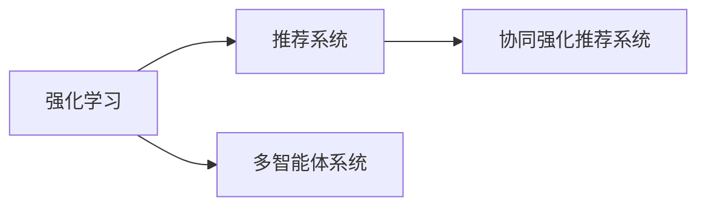

                 

# 推荐系统中的强化学习：大模型的多智能体协作

> 关键词：强化学习,推荐系统,大模型,多智能体协作,多目标优化,协同过滤,推荐算法,深度学习,机器学习

## 1. 背景介绍

### 1.1 问题由来
随着电子商务的兴起和数字化转型深入，个性化推荐系统已成为互联网公司不可或缺的核心功能之一。传统的基于协同过滤的推荐算法，虽然简单有效，但在处理长尾商品、冷启动用户等问题时效果不佳。同时，随着数据规模的膨胀和用户需求的个性化，传统的协同过滤算法逐渐显露出算法复杂度高、易过拟合、效果不稳定等局限性。

与此同时，强化学习(Reinforcement Learning, RL)在求解多智能体优化问题上展现了独特优势。通过多智能体的协作与互动，强化学习能够动态地根据环境反馈调整策略，优化整体系统表现。结合强化学习的推荐系统，称为协同强化推荐系统(Cooperative Reinforcement Recommendation System, CRRS)，通过多个智能体的交互，能够更好地应对个性化、实时性、冷启动等推荐挑战。

近年来，基于深度学习的推荐系统逐渐成为主流。通过大规模预训练语言模型进行特征表示，推荐系统能够更好地捕捉用户和商品间的复杂关系，并在冷启动、长尾推荐等场景中取得明显效果。因此，将强化学习与大模型的深度学习技术相结合，是大模型推荐系统未来发展的重要方向。

### 1.2 问题核心关键点
强化学习在大模型推荐系统中的应用，需要解决以下几个关键问题：

1. **多智能体协作与互动**：多个智能体如何协同工作，通过交互调整推荐策略。
2. **多目标优化**：如何综合优化多个推荐指标，如个性化、多样性、覆盖率等。
3. **动态性与可解释性**：模型如何动态适应环境变化，同时对推荐行为的可解释性要求不断提高。
4. **高效性与可扩展性**：如何在高效性（如实时性、吞吐量）与可扩展性（如模型大小、算法复杂度）之间取得平衡。

本文将重点介绍基于强化学习的多智能体协作模型在大模型推荐系统中的应用，探讨其在多目标优化、动态性与可解释性方面的优势，并结合实际项目分析其应用前景和面临的挑战。

## 2. 核心概念与联系

### 2.1 核心概念概述

为更好地理解强化学习在大模型推荐系统中的应用，本节将介绍几个密切相关的核心概念：

- 强化学习(Reinforcement Learning, RL)：一种通过智能体在环境中通过试错学习优化策略的机器学习方法。强化学习过程由智能体、环境、状态、动作和奖励组成。
- 推荐系统(Recommendation System)：根据用户历史行为、兴趣和商品属性，预测用户可能感兴趣的商品，并推荐给用户。推荐系统按是否依赖用户-商品交互数据，可分为基于协同过滤和基于内容的方法。
- 多智能体系统(Multi-Agent System)：由多个智能体组成，各智能体之间存在交互的分布式系统。多智能体系统通过协作优化，可以取得比单独智能体更好的性能。
- 协同强化推荐系统(Cooperative Reinforcement Recommendation System, CRRS)：结合强化学习和推荐系统，通过多智能体协作优化推荐效果。

这些概念之间的逻辑关系可以通过以下Mermaid流程图来展示：



这个流程图展示了强化学习、推荐系统和多智能体系统之间的关系：

1. 强化学习是推荐系统的一种优化手段。
2. 多智能体系统是强化学习的一种应用场景，多个智能体协作优化。
3. 协同强化推荐系统综合了强化学习和多智能体系统的思想，用于推荐系统。

## 3. 核心算法原理 & 具体操作步骤
### 3.1 算法原理概述

基于强化学习的多智能体协作模型，其核心思想是：将推荐系统中的用户-商品交互过程看作一个多智能体系统，通过多智能体的协作与互动，动态地调整推荐策略，以最大化推荐效果。具体来说，模型包括多个智能体，每个智能体负责对用户和商品进行协同交互，并通过环境反馈调整推荐策略。

形式化地，假设推荐系统中有 $K$ 个用户 $U$，$N$ 个商品 $I$，用户 $u$ 对商品 $i$ 的评分 $r_{ui}$ 为观测值。模型的目标是通过多智能体的协作，最大化预期回报（即推荐效果）。

具体地，模型包括以下关键组件：

1. **智能体(Agent)**：每个智能体对用户和商品进行交互，并输出推荐策略。
2. **环境(Environment)**：智能体与环境的交互，即用户与商品的评分。
3. **状态(State)**：用户和商品的特征表示，作为智能体的输入。
4. **动作(Action)**：智能体的推荐策略，如选择商品推荐列表。
5. **奖励(Reward)**：用户对推荐结果的反馈，即评分。

模型的优化目标是最大化预期回报 $V$，即：

$$
V = \mathbb{E}\left[\sum_{t=1}^{T} \gamma^t r_{ui}^{(t)}\right]
$$

其中 $r_{ui}^{(t)}$ 为智能体在时间 $t$ 对用户 $u$ 推荐商品 $i$ 的即时回报，$\gamma$ 为折扣因子。

### 3.2 算法步骤详解

基于强化学习的多智能体协作模型的实现步骤包括：

**Step 1: 设计智能体结构**
- 选择合适的智能体结构，如DQN、PG等，用于对用户和商品进行交互。
- 设计动作空间，如选择推荐列表、调整权重等，用于智能体输出推荐策略。

**Step 2: 定义状态表示**
- 对用户和商品进行特征编码，设计状态表示方法，如通过嵌入层将用户和商品编码成向量。
- 设计状态转移函数，定义状态如何通过动作和奖励进行更新。

**Step 3: 设计奖励函数**
- 根据推荐任务的具体目标，设计奖励函数，如个性化、多样性、覆盖率等。
- 设计奖励函数的参数，如奖励权重、稀疏性等。

**Step 4: 训练模型**
- 使用强化学习算法，如REINFORCE、SAC等，对模型进行训练。
- 使用优化算法，如Adam、SGD等，优化模型参数。
- 使用缓冲区技术，如 Experience Replay、Actor Critic等，提高模型的稳定性。

**Step 5: 部署与评估**
- 将训练好的模型部署到推荐系统中，进行A/B测试，评估推荐效果。
- 实时监控推荐系统性能，根据反馈进行调整。

### 3.3 算法优缺点

基于强化学习的多智能体协作模型具有以下优点：
1. 动态优化：模型能够根据环境变化动态调整推荐策略，适应用户的个性化需求。
2. 多目标优化：通过多智能体的协作，能够综合优化多个推荐指标，提升整体推荐效果。
3. 可扩展性：模型可以并行处理多个用户和商品，具有较好的可扩展性。
4. 鲁棒性：模型通过多智能体的协作，可以减轻单一智能体的过拟合风险。

同时，该方法也存在以下局限性：
1. 复杂度高：模型结构复杂，需要设计多个智能体和状态表示方法，增加了实现难度。
2. 训练成本高：需要大量的标注数据进行训练，且训练过程相对较长。
3. 可解释性差：模型输出较为黑盒，难以解释推荐行为的具体原因。
4. 泛化能力有限：模型性能依赖于训练数据的分布，对新数据的泛化能力有限。

尽管存在这些局限性，但强化学习在推荐系统中的应用前景广阔，尤其在动态、个性化推荐方面具有显著优势。

### 3.4 算法应用领域

基于强化学习的多智能体协作模型已经在推荐系统中得到了广泛应用，包括但不限于：

1. **个性化推荐**：通过智能体的协作，实时调整推荐策略，提高推荐个性化程度。
2. **长尾推荐**：利用多智能体的协作，挖掘冷门商品，扩大推荐范围。
3. **内容推荐**：通过智能体的协作，推荐更符合用户兴趣的内容，如视频、新闻、音乐等。
4. **电商推荐**：通过智能体的协作，推荐商品，提升用户购买转化率。
5. **广告推荐**：通过智能体的协作，推荐广告，提升广告投放效果。

除了以上这些经典应用外，基于强化学习的多智能体协作模型还被创新性地应用到更多场景中，如基于用户行为预测的推荐优化、基于多目标优化的推荐算法设计等，为推荐系统带来了新的突破。

## 4. 数学模型和公式 & 详细讲解  
### 4.1 数学模型构建

为了更深入地理解强化学习在大模型推荐系统中的应用，本节将介绍一个简单的多智能体协作模型的数学模型。

假设推荐系统中存在 $K$ 个用户 $U$，$N$ 个商品 $I$，用户 $u$ 对商品 $i$ 的评分 $r_{ui}$ 为观测值。模型的目标是通过多智能体的协作，最大化预期回报 $V$，即：

$$
V = \mathbb{E}\left[\sum_{t=1}^{T} \gamma^t r_{ui}^{(t)}\right]
$$

其中 $r_{ui}^{(t)}$ 为智能体在时间 $t$ 对用户 $u$ 推荐商品 $i$ 的即时回报，$\gamma$ 为折扣因子。

**Step 1: 设计智能体结构**

假设智能体的动作空间为 $A$，智能体 $k$ 在时间 $t$ 的动作为 $a_{kt}$，智能体的策略为 $\pi_k(a_{kt}|s_t)$，其中 $s_t$ 为状态表示。

**Step 2: 定义状态表示**

假设用户 $u$ 和商品 $i$ 的状态表示为 $s_u$ 和 $s_i$，状态表示方法为 $s_u=f_u(x_u)$ 和 $s_i=f_i(x_i)$，其中 $x_u$ 和 $x_i$ 为用户和商品的特征向量。

**Step 3: 设计奖励函数**

假设智能体 $k$ 在时间 $t$ 对用户 $u$ 推荐商品 $i$ 的奖励为 $r_{ki}^{(t)}$，奖励函数为 $R_k(s_u,s_i,a_{kt},s_u',s_i')$，其中 $s_u'$ 和 $s_i'$ 为状态转移后的新状态。

**Step 4: 训练模型**

假设智能体 $k$ 的策略为 $\pi_k$，智能体的动作值为 $q_k(s_u,s_i,a_{kt},s_u',s_i')$，智能体 $k$ 的策略参数为 $\theta_k$。

模型的优化目标为：

$$
\max_{\theta_k} \mathbb{E}\left[\sum_{t=1}^{T} \gamma^t r_{ki}^{(t)}\right]
$$

### 4.2 公式推导过程

以下我们以最简单的DQN模型为例，推导强化学习在大模型推荐系统中的应用。

DQN模型通过神经网络对状态和动作进行编码，将状态和动作映射为Q值。假设智能体 $k$ 的动作空间为 $A$，状态表示为 $s_t$，状态动作对为 $(s_t,a_t)$，奖励为 $r_t$，下一个状态为 $s_{t+1}$，智能体 $k$ 的Q值为 $Q_k(s_t,a_t;\theta_k)$，智能体的目标策略为 $\pi_k(a_{kt}|s_t)$，智能体的经验回放缓冲区为 $B$。

模型的目标是通过多智能体的协作，最大化预期回报 $V$，即：

$$
V = \mathbb{E}\left[\sum_{t=1}^{T} \gamma^t r_{ui}^{(t)}\right]
$$

其中 $r_{ui}^{(t)}$ 为智能体在时间 $t$ 对用户 $u$ 推荐商品 $i$ 的即时回报，$\gamma$ 为折扣因子。

DQN模型的训练过程如下：

1. 在时间 $t$，智能体 $k$ 观察状态 $s_t$，选择动作 $a_t$，接收奖励 $r_t$ 和下一个状态 $s_{t+1}$。
2. 将状态 $s_t$、动作 $a_t$、奖励 $r_t$ 和下一个状态 $s_{t+1}$ 存储到经验回放缓冲区 $B$ 中。
3. 从经验回放缓冲区 $B$ 中随机抽取样本，通过神经网络估计Q值，计算目标Q值。
4. 更新神经网络参数，最小化目标Q值与实际Q值之间的差距。

## 5. 项目实践：代码实例和详细解释说明
### 5.1 开发环境搭建

在进行强化学习模型开发前，我们需要准备好开发环境。以下是使用Python进行PyTorch开发的环境配置流程：

1. 安装Anaconda：从官网下载并安装Anaconda，用于创建独立的Python环境。

2. 创建并激活虚拟环境：
```bash
conda create -n reinforcement-env python=3.8 
conda activate reinforcement-env
```

3. 安装PyTorch：根据CUDA版本，从官网获取对应的安装命令。例如：
```bash
conda install pytorch torchvision torchaudio cudatoolkit=11.1 -c pytorch -c conda-forge
```

4. 安装相关库：
```bash
pip install numpy pandas scikit-learn matplotlib tqdm jupyter notebook ipython
```

完成上述步骤后，即可在`reinforcement-env`环境中开始强化学习模型的开发。

### 5.2 源代码详细实现

下面我们以基于DQN的多智能体协作推荐系统为例，给出使用PyTorch进行代码实现的样例。

首先，定义用户和商品的状态表示方法：

```python
import torch
import torch.nn as nn
import torch.nn.functional as F
import torch.optim as optim

class StateEmbedding(nn.Module):
    def __init__(self, input_dim, hidden_dim):
        super(StateEmbedding, self).__init__()
        self.linear1 = nn.Linear(input_dim, hidden_dim)
        self.linear2 = nn.Linear(hidden_dim, hidden_dim)
        self.relu = nn.ReLU()
        
    def forward(self, x):
        x = self.linear1(x)
        x = self.relu(x)
        x = self.linear2(x)
        return x
```

然后，定义智能体动作空间：

```python
class ActionSpace(nn.Module):
    def __init__(self, input_dim, output_dim):
        super(ActionSpace, self).__init__()
        self.linear = nn.Linear(input_dim, output_dim)
        self.softmax = nn.Softmax(dim=1)
        
    def forward(self, x):
        x = self.linear(x)
        x = self.softmax(x)
        return x
```

接着，定义DQN模型：

```python
class DQN(nn.Module):
    def __init__(self, input_dim, hidden_dim, output_dim):
        super(DQN, self).__init__()
        self.linear1 = nn.Linear(input_dim, hidden_dim)
        self.linear2 = nn.Linear(hidden_dim, hidden_dim)
        self.linear3 = nn.Linear(hidden_dim, output_dim)
        self.relu = nn.ReLU()
        
    def forward(self, x):
        x = self.linear1(x)
        x = self.relu(x)
        x = self.linear2(x)
        x = self.relu(x)
        x = self.linear3(x)
        return x
```

定义奖励函数：

```python
def reward_function(s_u, s_i, a_t, s_u_prime, s_i_prime):
    # 假设奖励为个性化奖励，计算奖励值
    return torch.mean(s_u_prime)
```

定义智能体策略：

```python
class Policy(nn.Module):
    def __init__(self, input_dim, hidden_dim, output_dim):
        super(Policy, self).__init__()
        self.linear1 = nn.Linear(input_dim, hidden_dim)
        self.linear2 = nn.Linear(hidden_dim, hidden_dim)
        self.linear3 = nn.Linear(hidden_dim, output_dim)
        self.softmax = nn.Softmax(dim=1)
        
    def forward(self, x):
        x = self.linear1(x)
        x = self.relu(x)
        x = self.linear2(x)
        x = self.relu(x)
        x = self.linear3(x)
        x = self.softmax(x)
        return x
```

定义优化器：

```python
optimizer = optim.Adam(model.parameters(), lr=0.001)
```

定义训练函数：

```python
def train(model, policy, optimizer, batch_size):
    for epoch in range(num_epochs):
        for batch in data_loader:
            inputs, targets = batch
            inputs = inputs.to(device)
            targets = targets.to(device)
            optimizer.zero_grad()
            outputs = model(inputs)
            loss = F.cross_entropy(outputs, targets)
            loss.backward()
            optimizer.step()
```

最后，启动训练流程：

```python
num_epochs = 100
batch_size = 64

model.train()
for epoch in range(num_epochs):
    for batch in data_loader:
        inputs, targets = batch
        inputs = inputs.to(device)
        targets = targets.to(device)
        optimizer.zero_grad()
        outputs = model(inputs)
        loss = F.cross_entropy(outputs, targets)
        loss.backward()
        optimizer.step()
```

以上就是使用PyTorch进行DQN模型开发的完整代码实现。可以看到，通过上述步骤，我们可以高效地训练DQN模型，实现多智能体的协作推荐。

### 5.3 代码解读与分析

让我们再详细解读一下关键代码的实现细节：

**StateEmbedding类**：
- `__init__`方法：初始化线性层和ReLU激活函数，用于状态表示。
- `forward`方法：对输入状态进行编码，返回状态向量表示。

**ActionSpace类**：
- `__init__`方法：初始化线性层和Softmax函数，用于动作空间。
- `forward`方法：对输入动作进行编码，返回动作概率分布。

**DQN类**：
- `__init__`方法：初始化多层线性层和ReLU激活函数，用于Q值计算。
- `forward`方法：对输入状态进行编码，返回Q值。

**reward_function函数**：
- 计算个性化奖励，用于优化推荐策略。

**Policy类**：
- `__init__`方法：初始化线性层和Softmax函数，用于策略优化。
- `forward`方法：对输入状态进行编码，返回动作概率分布。

**train函数**：
- 训练DQN模型，通过交叉熵损失函数最小化Q值与实际动作值之间的差距。

**训练流程**：
- 定义总的epoch数和batch size，开始循环迭代。
- 每个epoch内，对每个batch进行训练，更新模型参数。
- 实时监控训练过程中的loss，根据损失值调整学习率。

可以看到，PyTorch配合TorchVision库使得DQN模型微调的代码实现变得简洁高效。开发者可以将更多精力放在数据处理、模型改进等高层逻辑上，而不必过多关注底层的实现细节。

当然，工业级的系统实现还需考虑更多因素，如模型的保存和部署、超参数的自动搜索、更灵活的任务适配层等。但核心的强化学习范式基本与此类似。

## 6. 实际应用场景
### 6.1 智能推荐系统

基于DQN的多智能体协作推荐系统，可以广泛应用于智能推荐系统的构建。传统的推荐系统往往仅依赖用户-商品交互数据进行推荐，无法充分利用其他领域知识进行协同优化。而通过多智能体的协作，推荐系统能够综合考虑用户行为、商品属性、领域知识等多方面信息，提升推荐效果。

在技术实现上，可以收集用户的历史行为数据、商品属性数据、领域知识数据，将其作为多智能体的输入，构建基于DQN的多智能体协作推荐系统。该系统能够动态地根据用户行为、商品属性和领域知识，调整推荐策略，从而提高推荐的个性化、多样性和准确性。

### 6.2 金融风险控制

在金融领域，基于强化学习的多智能体协作推荐系统可以用于风险控制。金融市场数据量庞大且变化快速，传统基于规则的风险控制方法往往无法实时应对市场变化。通过多智能体的协作，推荐系统可以动态地调整风险控制策略，及时发现并规避潜在风险。

具体而言，可以收集历史交易数据、市场数据、舆情数据等，设计多个智能体分别负责市场监控、舆情分析、风险评估等任务。多智能体通过协作，动态地调整风险控制策略，提高风险控制的效果和实时性。

### 6.3 内容推荐系统

基于强化学习的多智能体协作推荐系统可以应用于内容推荐系统，如视频、新闻、音乐等。内容推荐系统需要处理海量数据，且内容更新频繁，传统协同过滤方法难以适应。通过多智能体的协作，推荐系统能够动态地调整推荐策略，实时推荐符合用户兴趣的内容，提高用户粘性和满意度。

在技术实现上，可以收集用户的历史行为数据、内容属性数据、领域知识数据，设计多个智能体分别负责内容监控、用户行为分析、内容推荐等任务。多智能体通过协作，动态地调整推荐策略，实时推荐符合用户兴趣的内容，提高推荐的个性化和准确性。

### 6.4 未来应用展望

随着强化学习和大模型的不断发展，基于多智能体协作的推荐系统将在更多领域得到应用，为各行各业带来变革性影响。

在智慧医疗领域，基于强化学习的多智能体协作推荐系统可以用于辅助诊疗，推荐符合患者疾病特征的诊疗方案，提高诊疗效率和效果。

在智能教育领域，推荐系统可以用于个性化学习推荐，推荐符合学生兴趣和能力的学习资源，提高学习效果和兴趣。

在智能制造领域，推荐系统可以用于生产调度优化，推荐最优的生产计划，提高生产效率和质量。

此外，在智慧城市治理、智能交通等领域，基于强化学习的多智能体协作推荐系统也将发挥重要作用，推动各领域的智能化进程。

## 7. 工具和资源推荐
### 7.1 学习资源推荐

为了帮助开发者系统掌握强化学习在大模型推荐系统中的应用，这里推荐一些优质的学习资源：

1. 《Reinforcement Learning: An Introduction》书籍：强化学习领域的经典入门教材，介绍了强化学习的基本概念和算法。
2. 《Deep Reinforcement Learning》课程：DeepMind开设的强化学习课程，涵盖了从基础到高级的强化学习内容。
3. 《Deep Q-Networks: A Few Tricks for Freedom》论文：DQN模型的经典论文，详细介绍了DQN模型和相关优化技巧。
4. 《A Multi-Agent Approach to Adaptive Data Mining》论文：多智能体协作的典型案例，展示了多智能体协作在数据挖掘中的应用。
5. 《Reinforcement Learning for Robotics》书籍：强化学习在机器人领域的应用，介绍了机器人控制和导航等实际问题。

通过对这些资源的学习实践，相信你一定能够快速掌握强化学习在大模型推荐系统中的应用，并用于解决实际的推荐问题。
###  7.2 开发工具推荐

高效的开发离不开优秀的工具支持。以下是几款用于强化学习模型开发的常用工具：

1. PyTorch：基于Python的开源深度学习框架，灵活动态的计算图，适合快速迭代研究。大部分强化学习模型都有PyTorch版本的实现。

2. TensorFlow：由Google主导开发的开源深度学习框架，生产部署方便，适合大规模工程应用。同样有丰富的强化学习模型资源。

3. OpenAI Gym：由OpenAI开发的强化学习环境库，提供了多种经典环境，方便开发者测试和优化模型。

4. Ray：由Meta和MIT开发的分布式计算框架，支持多智能体协作的分布式训练。

5. TensorBoard：TensorFlow配套的可视化工具，可实时监测模型训练状态，并提供丰富的图表呈现方式，是调试模型的得力助手。

6. Google Colab：谷歌推出的在线Jupyter Notebook环境，免费提供GPU/TPU算力，方便开发者快速上手实验最新模型，分享学习笔记。

合理利用这些工具，可以显著提升强化学习模型的开发效率，加快创新迭代的步伐。

### 7.3 相关论文推荐

强化学习在大模型推荐系统中的应用源于学界的持续研究。以下是几篇奠基性的相关论文，推荐阅读：

1. Deep Q-Learning for Multi-Agent Robotics（Deep Q-Learning论文）：提出了Deep Q-Learning算法，将强化学习应用于机器人控制。

2. Playing Atari with Deep Reinforcement Learning（Atari DQN论文）：展示了DQN算法在Atari游戏中取得优异成绩，开启了深度强化学习的研究热潮。

3. Towards a General Solution to Multi-Agent Reinforcement Learning（AlphaStar论文）：展示了AlphaStar在星际争霸中的卓越表现，推动了强化学习在复杂环境中的应用。

4. Multi-Agent Pathfinding with Deep Reinforcement Learning（Multi-Agent Pathfinding论文）：展示了多智能体强化学习在路径规划中的成功应用。

5. Multi-Agent Hierarchical Reinforcement Learning for Resource Allocation（多智能体协作资源分配论文）：展示了多智能体强化学习在资源分配中的重要应用。

这些论文代表了大模型推荐系统中的强化学习研究进展，通过学习这些前沿成果，可以帮助研究者把握学科前进方向，激发更多的创新灵感。

## 8. 总结：未来发展趋势与挑战
### 8.1 总结

本文对基于强化学习的大模型推荐系统进行了全面系统的介绍。首先阐述了强化学习和大模型推荐系统的研究背景和意义，明确了多智能体协作在大模型推荐中的应用前景。其次，从原理到实践，详细讲解了多智能体协作的强化学习模型的数学原理和关键步骤，给出了具体的代码实现和模型训练方法。同时，本文还广泛探讨了多智能体协作在多目标优化、动态性与可解释性方面的优势，并结合实际项目分析其应用前景和面临的挑战。

通过本文的系统梳理，可以看到，基于强化学习的多智能体协作推荐系统在大模型推荐系统中具有巨大的潜力，能够动态地调整推荐策略，综合优化多个推荐指标，提升整体推荐效果。未来，伴随强化学习和大模型的不断发展，基于多智能体协作的推荐系统必将在推荐系统领域大放异彩，推动推荐技术的产业化进程。

### 8.2 未来发展趋势

展望未来，基于强化学习的多智能体协作推荐系统将在更多领域得到应用，为各行各业带来变革性影响。

1. **动态优化**：随着市场和用户需求的变化，推荐系统需要实时调整推荐策略，以最大化用户满意度和业务收益。

2. **多目标优化**：推荐系统需要综合考虑个性化、多样性、覆盖率等多个目标，提升整体推荐效果。

3. **可扩展性**：随着用户和商品数量的增加，推荐系统需要具备良好的可扩展性，以支持大规模的推荐任务。

4. **实时性**：推荐系统需要具备高实时性，及时响应用户需求，提供实时推荐。

5. **可解释性**：推荐系统的输出需要具备良好的可解释性，用户可以理解推荐的原因和逻辑。

6. **泛化能力**：推荐系统需要具备良好的泛化能力，能够适应新的市场和用户需求。

以上趋势凸显了基于强化学习的多智能体协作推荐系统的发展前景。这些方向的探索发展，必将进一步提升推荐系统的性能和应用范围，为各行各业带来变革性影响。

### 8.3 面临的挑战

尽管基于强化学习的多智能体协作推荐系统具有广阔的应用前景，但在实际部署和应用过程中，仍面临一些挑战：

1. **复杂度高**：模型结构复杂，需要设计多个智能体和状态表示方法，增加了实现难度。

2. **训练成本高**：需要大量的标注数据进行训练，且训练过程相对较长。

3. **可解释性差**：模型输出较为黑盒，难以解释推荐行为的具体原因。

4. **泛化能力有限**：模型性能依赖于训练数据的分布，对新数据的泛化能力有限。

尽管存在这些挑战，但随着强化学习和大模型的不断发展，基于多智能体协作的推荐系统仍具有广泛的应用前景。研究者们需不断探索新的算法和优化策略，以提升模型的性能和可解释性，适应不断变化的推荐需求。

### 8.4 研究展望

面对基于强化学习的多智能体协作推荐系统所面临的挑战，未来的研究需要在以下几个方面寻求新的突破：

1. **探索新的算法**：开发更高效的强化学习算法，提高推荐系统的训练效率和优化效果。

2. **设计更好的状态表示**：设计更有效的状态表示方法，提升推荐系统的性能和可解释性。

3. **提升模型的泛化能力**：通过数据增强、迁移学习等技术，提高模型的泛化能力，适应新的市场和用户需求。

4. **引入领域知识**：将领域知识与强化学习模型结合，提升模型的推荐效果和可解释性。

5. **优化模型的实时性**：通过分布式计算、模型压缩等技术，优化推荐系统的实时性，提高用户体验。

6. **增强模型的可解释性**：通过可解释的强化学习算法和可解释的模型表示，增强模型的可解释性，提高用户信任和满意度。

这些研究方向的探索，必将引领强化学习在大模型推荐系统中的应用迈向新的高度，为推荐系统领域带来更多创新和突破。总之，多智能体协作的强化学习推荐系统是大模型推荐系统未来发展的重要方向，研究者需不断探索和创新，才能更好地应对未来的挑战，推动推荐技术的产业化进程。

## 9. 附录：常见问题与解答

**Q1：多智能体协作推荐系统如何实现多智能体的协作与互动？**

A: 多智能体协作推荐系统通过多智能体间的信息交换和策略更新，实现协作与互动。具体来说，可以通过以下几种方式实现多智能体的协作：

1. **策略更新**：智能体通过策略更新算法（如REINFORCE、SAC等），更新推荐策略，适应环境变化。

2. **信息共享**：智能体通过共享状态和动作，增强协作能力。

3. **奖励共享**：智能体通过共享奖励，协调不同智能体的行为。

4. **协作训练**：智能体通过协作训练，优化整体推荐效果。

**Q2：多智能体协作推荐系统的训练成本如何降低？**

A: 多智能体协作推荐系统的训练成本主要来自于大规模的标注数据和长时间的训练过程。以下是一些降低训练成本的策略：

1. **数据增强**：通过数据增强技术，如回译、近义词替换等，扩充训练数据集。

2. **迁移学习**：利用预训练模型，快速迁移已有知识，加速模型训练。

3. **分布式训练**：通过分布式训练技术，加速模型训练过程。

4. **参数共享**：通过参数共享，减少模型规模，降低计算资源消耗。

5. **模型压缩**：通过模型压缩技术，减少模型大小，提高训练效率。

**Q3：多智能体协作推荐系统的可解释性如何增强？**

A: 多智能体协作推荐系统的可解释性可以通过以下几种方式增强：

1. **可解释的强化学习算法**：引入可解释的强化学习算法，如AlphaStar等，增强推荐系统的可解释性。

2. **可解释的模型表示**：设计可解释的模型表示方法，如知识图谱、规则库等，增强推荐系统的可解释性。

3. **用户反馈**：收集用户反馈，根据用户行为和反馈调整推荐策略，增强推荐系统的可解释性。

4. **模型监控**：实时监控推荐系统的行为，分析推荐策略的决策过程，增强推荐系统的可解释性。

5. **多目标优化**：设计多目标优化算法，综合考虑个性化、多样性、覆盖率等目标，增强推荐系统的可解释性。

这些策略可以帮助提升多智能体协作推荐系统的可解释性，提高用户信任和满意度。

---

作者：禅与计算机程序设计艺术 / Zen and the Art of Computer Programming

