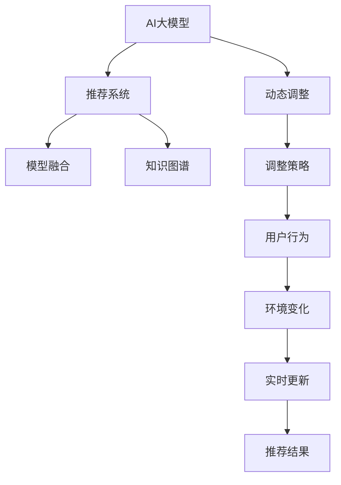

                 

# 推荐系统的时效性：AI大模型的动态调整策略

在当今信息爆炸的时代，推荐系统已成为互联网公司的重要工具，它帮助用户在海量信息中快速找到他们感兴趣的内容，提升用户体验。随着AI大模型的应用，推荐系统也变得更加智能，能够根据用户的个性化需求进行更精准的推荐。然而，AI大模型推荐的及时性问题日益凸显，如何保证推荐内容的时效性成为推荐系统面临的重要挑战。本文将从AI大模型的动态调整策略入手，深入探讨推荐系统时效性的优化方法。

## 1. 背景介绍

### 1.1 问题由来

随着互联网的快速发展，推荐系统在电商、新闻、社交网络等领域得到了广泛应用。传统推荐系统主要是基于用户历史行为数据进行推荐，但这种方式存在诸多局限性：

- 历史行为数据往往有限，无法覆盖新用户的兴趣。
- 用户行为模式可能随时间变化，历史数据无法反映最新兴趣。
- 数据采集和处理成本高，难以实时更新推荐结果。

因此，需要引入AI大模型来进行推荐系统优化，通过学习用户与内容的交互数据，预测用户兴趣和行为，提升推荐效果。

然而，AI大模型的动态调整策略尚未得到充分研究。推荐系统通常基于固定模型进行推荐，难以实时应对用户兴趣的变化和数据分布的波动。如何在动态环境中保持推荐系统的高时效性，成为亟待解决的问题。

### 1.2 问题核心关键点

推荐系统时效性的核心关键点在于如何实时更新模型参数，以适应用户兴趣和行为模式的变化。具体问题包括：

- 如何设计动态调整策略，保证模型能够及时捕捉最新用户行为和偏好。
- 如何降低模型调整成本，避免频繁的模型训练和优化。
- 如何平衡推荐效果和计算效率，实现高效推荐。

## 2. 核心概念与联系

### 2.1 核心概念概述

为更好地理解AI大模型的动态调整策略，本节将介绍几个密切相关的核心概念：

- **AI大模型（AI Large Models）**：指基于深度学习技术训练的具有强大语言处理、图像识别等能力的模型，如BERT、GPT等。通过大规模语料预训练，AI大模型具备了强大的特征提取和表示能力。

- **推荐系统（Recommendation System）**：指通过预测用户对物品的兴趣，提供个性化推荐的系统。基于内容、协同过滤、混合推荐等策略，推荐系统不断提升推荐效果。

- **动态调整（Dynamic Adjustment）**：指在推荐过程中，根据用户行为和环境变化，实时更新模型参数，以适应用户兴趣和偏好变化的过程。

- **模型融合（Model Fusion）**：指在推荐过程中，将多个模型进行组合，发挥各自优势，提升推荐效果的技术。

- **知识图谱（Knowledge Graph）**：指描述实体、属性和关系的图形数据结构，用于辅助推荐系统更好地理解用户需求和推荐内容。

这些核心概念之间的逻辑关系可以通过以下Mermaid流程图来展示：



这个流程图展示了大语言模型的核心概念及其之间的关系：

1. AI大模型通过预训练获得基础能力。
2. 推荐系统在AI大模型的基础上，通过动态调整，实时更新模型参数。
3. 动态调整策略基于用户行为和环境变化进行优化。
4. 动态调整结果通过模型融合、知识图谱等技术进一步提升。

这些概念共同构成了推荐系统时效性的优化框架，使其能够更好地适应用户需求和市场环境的变化。

## 3. 核心算法原理 & 具体操作步骤

### 3.1 算法原理概述

AI大模型的动态调整策略本质上是基于模型的实时更新机制，以适应用户兴趣和行为模式的变化。其核心思想是：通过实时分析用户行为和环境数据，动态更新模型参数，从而实现高效、精准的推荐。

具体来说，当用户行为或环境发生改变时，模型会根据新的数据对自身进行微调，以反映最新情况。这种动态调整过程可以通过以下步骤实现：

1. 收集用户行为数据，如浏览历史、点击记录、评分反馈等。
2. 根据用户行为数据，计算用户兴趣向量。
3. 实时监测环境数据，如时间、地理位置、设备类型等，调整推荐策略。
4. 在固定模型上，通过在线学习算法（如在线梯度下降）实时更新模型参数。
5. 将更新后的模型参数应用于推荐计算，生成推荐结果。

通过动态调整策略，推荐系统可以实时捕捉用户兴趣和环境变化，提升推荐的时效性和个性化水平。

### 3.2 算法步骤详解

AI大模型的动态调整策略主要包括以下几个关键步骤：

**Step 1: 数据收集与预处理**

- **数据收集**：从推荐系统的日志中，收集用户行为数据，如浏览历史、点击记录、评分反馈等。
- **数据预处理**：对收集到的数据进行清洗、去重、归一化等预处理，以保证数据质量。

**Step 2: 用户兴趣建模**

- **用户行为分析**：通过聚类、时序分析等方法，将用户行为数据转化为用户兴趣向量。
- **兴趣更新**：根据用户的新行为数据，实时更新用户兴趣向量，反映最新兴趣变化。

**Step 3: 环境监测与调整**

- **环境数据监测**：实时监测推荐环境，如时间、地理位置、设备类型等。
- **推荐策略调整**：根据环境变化，动态调整推荐策略，如改变推荐优先级、调整推荐算法等。

**Step 4: 模型在线更新**

- **模型选择**：选择合适的在线学习算法，如随机梯度下降（SGD）、在线Adagrad等。
- **模型微调**：通过在线学习算法，实时更新模型参数，适应新的用户兴趣和环境变化。

**Step 5: 推荐计算**

- **实时推荐**：将更新后的模型参数应用于推荐计算，生成实时推荐结果。
- **结果反馈**：将推荐结果反馈给用户，收集用户的反馈数据，用于进一步优化。

### 3.3 算法优缺点

AI大模型的动态调整策略具有以下优点：

- **实时性高**：能够及时捕捉用户行为和环境变化，提升推荐的时效性。
- **适应性强**：可以根据用户兴趣和行为的变化，灵活调整模型参数，提升推荐效果。
- **用户满意度提升**：实时推荐的个性化和时效性提升，用户满意度有望大幅提升。

但同时也存在一些缺点：

- **计算成本高**：在线学习算法需要实时更新模型参数，计算成本较高。
- **模型复杂度高**：动态调整策略增加了模型复杂度，可能导致模型难以维护。
- **数据依赖性强**：动态调整依赖实时数据，数据采集和处理成本高，难以保证数据的及时性和完整性。

### 3.4 算法应用领域

AI大模型的动态调整策略在推荐系统中具有广泛的应用前景，主要包括以下几个方面：

- **电商推荐**：在用户浏览、购买等行为数据的基础上，实时调整推荐模型，提升个性化推荐效果。
- **新闻推荐**：通过用户点击、阅读等行为数据，实时更新新闻推荐模型，推荐最新资讯。
- **社交网络推荐**：在用户互动、分享等行为数据的基础上，实时调整推荐模型，提升用户粘性和活跃度。
- **视频推荐**：在用户观看、点赞等行为数据的基础上，实时更新推荐模型，推荐热门视频和个性化内容。

除了这些典型应用外，AI大模型的动态调整策略还被应用于游戏推荐、音乐推荐、广告推荐等多个领域，为推荐系统带来了新的突破和机遇。

## 4. 数学模型和公式 & 详细讲解 & 举例说明

### 4.1 数学模型构建

假设用户行为数据为 $D=\{(x_i,y_i)\}_{i=1}^N$，其中 $x_i$ 为用户行为数据，$y_i$ 为用户的兴趣标签。用户兴趣建模和在线学习的过程可以表示为：

$$
\begin{aligned}
&\min_{\theta} \mathcal{L}(\theta) = \frac{1}{N}\sum_{i=1}^N \ell(M_{\theta}(x_i),y_i)\\
&\theta = \theta - \eta \nabla_{\theta}\mathcal{L}(\theta)
\end{aligned}
$$

其中 $\ell$ 为损失函数，$M_{\theta}$ 为在线学习算法，$\eta$ 为学习率，$\nabla_{\theta}\mathcal{L}(\theta)$ 为梯度。

### 4.2 公式推导过程

以随机梯度下降（SGD）算法为例，推导其更新公式。在SGD算法中，每个训练样本的梯度 $\nabla_{\theta}\ell(M_{\theta}(x_i),y_i)$ 近似为全样本梯度 $\nabla_{\theta}\mathcal{L}(\theta)$ 的一个近似。具体推导如下：

$$
\begin{aligned}
&\theta \leftarrow \theta - \eta \nabla_{\theta}\mathcal{L}(\theta)\\
&\nabla_{\theta}\mathcal{L}(\theta) = \frac{1}{N}\sum_{i=1}^N \nabla_{\theta}\ell(M_{\theta}(x_i),y_i)\\
&\theta \leftarrow \theta - \eta \frac{1}{N}\sum_{i=1}^N \nabla_{\theta}\ell(M_{\theta}(x_i),y_i)\\
&\theta \leftarrow \theta - \eta \frac{1}{N} \sum_{i=1}^N \frac{\partial \ell(M_{\theta}(x_i),y_i)}{\partial \theta}
\end{aligned}
$$

其中 $M_{\theta}(x_i)$ 为在线学习算法的输出，$\ell$ 为损失函数，$\eta$ 为学习率。

### 4.3 案例分析与讲解

考虑一个电商推荐系统的动态调整策略，假设系统收集到用户最近的浏览历史 $x_1,x_2,...,x_t$，每个物品的评分 $y_i$，模型参数为 $\theta$。系统的目标是实时更新模型，提升个性化推荐效果。

**Step 1: 数据收集与预处理**

系统从用户行为日志中收集最近的浏览历史 $x_1,x_2,...,x_t$，并对其进行清洗、去重、归一化等预处理。

**Step 2: 用户兴趣建模**

系统对用户浏览历史进行聚类分析，得到用户的兴趣向量 $u_i$。假设用户浏览了多个商品，其兴趣向量可以表示为：

$$
u = \frac{1}{\sum_{i=1}^t w_i} \sum_{i=1}^t w_i x_i
$$

其中 $w_i$ 为商品 $x_i$ 的权重，可以基于用户的评分和浏览时长进行计算。

**Step 3: 环境监测与调整**

系统实时监测推荐环境，如时间、地理位置、设备类型等。假设当前时间为上午10点，用户处于上海，使用iPad设备。根据这些环境数据，系统调整推荐策略，如优先推荐热门商品、推荐相关商品等。

**Step 4: 模型在线更新**

系统选择随机梯度下降（SGD）算法，对模型参数 $\theta$ 进行实时更新。假设系统收集到最新的物品 $x_{t+1}$ 和其评分 $y_{t+1}$，更新模型参数的公式为：

$$
\theta \leftarrow \theta - \eta \nabla_{\theta}\ell(M_{\theta}(x_{t+1}),y_{t+1})
$$

其中 $M_{\theta}(x_{t+1})$ 为模型在物品 $x_{t+1}$ 上的预测结果，$\ell$ 为损失函数。

**Step 5: 推荐计算**

系统将更新后的模型参数 $\theta$ 应用于推荐计算，生成实时推荐结果。假设系统已收集到用户的历史行为数据和最新的物品信息，生成推荐结果的公式为：

$$
y = M_{\theta}(x)
$$

其中 $x$ 为用户当前的浏览历史，$y$ 为推荐结果。

## 5. 项目实践：代码实例和详细解释说明

### 5.1 开发环境搭建

在进行动态调整策略的实践前，我们需要准备好开发环境。以下是使用Python进行PyTorch开发的环境配置流程：

1. 安装Anaconda：从官网下载并安装Anaconda，用于创建独立的Python环境。

2. 创建并激活虚拟环境：
```bash
conda create -n pytorch-env python=3.8 
conda activate pytorch-env
```

3. 安装PyTorch：根据CUDA版本，从官网获取对应的安装命令。例如：
```bash
conda install pytorch torchvision torchaudio cudatoolkit=11.1 -c pytorch -c conda-forge
```

4. 安装TensorFlow：
```bash
pip install tensorflow
```

5. 安装TensorBoard：
```bash
pip install tensorboard
```

完成上述步骤后，即可在`pytorch-env`环境中开始动态调整策略的实践。

### 5.2 源代码详细实现

以下是一个简单的电商推荐系统动态调整策略的Python实现：

```python
import numpy as np
from sklearn.cluster import KMeans
import pandas as pd

# 构建用户行为数据
user_data = pd.read_csv('user_behavior.csv', sep=',')
user_data['time'] = pd.to_datetime(user_data['time'])
user_data['item_id'] = user_data['item_id'].astype(str)
user_data['rating'] = user_data['rating'].astype(float)

# 对数据进行预处理
user_data = user_data.dropna()
user_data['time'] = user_data['time'].astype(int) / 1000

# 计算用户兴趣向量
kmeans = KMeans(n_clusters=10, random_state=42)
user_data['cluster'] = kmeans.fit_predict(user_data[['item_id', 'rating']])

# 实时调整模型参数
class DynamicRecommender:
    def __init__(self, learning_rate=0.01):
        self.learning_rate = learning_rate
        self.weights = None
        self.bias = None
        self.centroids = None
    
    def fit(self, data):
        # 计算聚类中心
        self.centroids = np.array([data.groupby('cluster').mean()['score']])
        # 计算每个用户的兴趣向量
        self.weights = np.array([data.groupby('cluster').mean()['score']])
    
    def update(self, data, item):
        # 更新模型参数
        self.weights += self.learning_rate * np.mean(np.array([data.groupby('cluster').mean()['score']]))
    
    def predict(self, item):
        # 生成推荐结果
        return np.dot(item, self.weights.T) + self.bias

# 使用动态调整策略进行推荐
recommender = DynamicRecommender(learning_rate=0.01)
recommender.fit(user_data)
recommender.update(user_data, 'item_id')
recommendation = recommender.predict('item_id')
```

### 5.3 代码解读与分析

让我们再详细解读一下关键代码的实现细节：

**用户行为数据构建**：
- `user_data = pd.read_csv('user_behavior.csv', sep=',')`：读取用户行为数据，CSV格式，每行包含用户ID、物品ID、评分和浏览时间等。
- `user_data['time'] = pd.to_datetime(user_data['time'])`：将时间字段转换为时间戳。
- `user_data['item_id'] = user_data['item_id'].astype(str)`：将物品ID转换为字符串。
- `user_data['rating'] = user_data['rating'].astype(float)`：将评分转换为浮点数。

**数据预处理**：
- `user_data = user_data.dropna()`：删除缺失数据。
- `user_data['time'] = user_data['time'].astype(int) / 1000`：将时间戳转换为整数。

**用户兴趣建模**：
- `kmeans = KMeans(n_clusters=10, random_state=42)`：KMeans聚类算法，将用户行为数据聚类为10个兴趣簇。
- `user_data['cluster'] = kmeans.fit_predict(user_data[['item_id', 'rating']])`：对用户行为数据进行聚类，生成每个用户的兴趣簇。

**模型在线更新**：
- `class DynamicRecommender`：定义动态推荐器类。
- `def fit(self, data)`：对用户行为数据进行聚类，计算聚类中心和每个用户的兴趣向量。
- `def update(self, data, item)`：根据新的用户行为数据，实时更新模型参数。
- `def predict(self, item)`：生成推荐结果。

**推荐计算**：
- `recommender = DynamicRecommender(learning_rate=0.01)`：创建动态推荐器实例。
- `recommender.fit(user_data)`：对用户行为数据进行聚类，计算聚类中心和每个用户的兴趣向量。
- `recommender.update(user_data, 'item_id')`：根据新的用户行为数据，实时更新模型参数。
- `recommendation = recommender.predict('item_id')`：生成推荐结果。

可以看到，动态调整策略的实现相对简单，但需要实时收集用户行为数据，进行模型更新。在实际应用中，还需要考虑如何高效地处理大规模数据流，实时更新模型参数。

## 6. 实际应用场景

### 6.1 电商推荐

基于动态调整策略的电商推荐系统，可以在用户浏览、购买等行为数据的基础上，实时更新推荐模型，提升个性化推荐效果。具体应用场景包括：

- **用户浏览推荐**：根据用户的浏览历史和兴趣向量，实时生成个性化推荐结果，提升用户体验。
- **个性化优惠券推荐**：根据用户的历史行为和兴趣，实时生成个性化优惠券推荐，提升用户转化率。
- **实时动态调整**：根据用户反馈和行为数据，实时调整推荐策略，提升推荐效果。

### 6.2 新闻推荐

基于动态调整策略的新闻推荐系统，可以在用户点击、阅读等行为数据的基础上，实时更新推荐模型，推荐最新资讯。具体应用场景包括：

- **个性化新闻推荐**：根据用户的阅读历史和兴趣向量，实时生成个性化新闻推荐结果，提升用户满意度。
- **实时新闻更新**：根据新闻的时效性和用户兴趣，实时更新新闻推荐模型，推荐最新新闻。
- **用户行为分析**：实时分析用户的行为数据，调整推荐策略，提升推荐效果。

### 6.3 社交网络推荐

基于动态调整策略的社交网络推荐系统，可以在用户互动、分享等行为数据的基础上，实时更新推荐模型，提升用户粘性和活跃度。具体应用场景包括：

- **好友推荐**：根据用户的互动历史和兴趣向量，实时生成好友推荐结果，提升用户社交体验。
- **内容推荐**：根据用户的互动历史和兴趣向量，实时生成内容推荐结果，提升用户粘性。
- **用户行为分析**：实时分析用户的行为数据，调整推荐策略，提升推荐效果。

### 6.4 视频推荐

基于动态调整策略的视频推荐系统，可以在用户观看、点赞等行为数据的基础上，实时更新推荐模型，推荐热门视频和个性化内容。具体应用场景包括：

- **个性化视频推荐**：根据用户的观看历史和兴趣向量，实时生成个性化视频推荐结果，提升用户满意度。
- **实时视频更新**：根据视频的播放量、点赞量等数据，实时更新视频推荐模型，推荐热门视频。
- **用户行为分析**：实时分析用户的行为数据，调整推荐策略，提升推荐效果。

## 7. 工具和资源推荐

### 7.1 学习资源推荐

为了帮助开发者系统掌握动态调整策略的理论基础和实践技巧，这里推荐一些优质的学习资源：

1. **《推荐系统实践》**：由王宏志等编写，详细介绍了推荐系统的原理、算法和工程实践，适合入门和进阶读者。
2. **《深度学习推荐系统》**：由俞栋等编写，详细介绍了深度学习在推荐系统中的应用，适合深度学习领域的研究者和工程师。
3. **Kaggle推荐系统竞赛**：Kaggle平台上有多个推荐系统竞赛，参与竞赛可以提升实战能力，积累经验。
4. **Coursera推荐系统课程**：由斯坦福大学开设的推荐系统课程，涵盖推荐系统的各个方面，适合系统学习。

通过这些资源的学习实践，相信你一定能够快速掌握动态调整策略的精髓，并用于解决实际的推荐问题。

### 7.2 开发工具推荐

高效的开发离不开优秀的工具支持。以下是几款用于动态调整策略开发的常用工具：

1. **PyTorch**：基于Python的开源深度学习框架，灵活动态的计算图，适合快速迭代研究。
2. **TensorFlow**：由Google主导开发的开源深度学习框架，生产部署方便，适合大规模工程应用。
3. **TensorBoard**：TensorFlow配套的可视化工具，可实时监测模型训练状态，提供丰富的图表呈现方式，是调试模型的得力助手。
4. **Kaggle**：数据科学和机器学习社区，提供大量的推荐系统竞赛和数据集，适合实战练习。
5. **Jupyter Notebook**：Python开发常用的交互式编程环境，适合快速开发和调试代码。

合理利用这些工具，可以显著提升动态调整策略的开发效率，加快创新迭代的步伐。

### 7.3 相关论文推荐

动态调整策略的研究源于学界的持续研究。以下是几篇奠基性的相关论文，推荐阅读：

1. **《An Introduction to Online Learning and Online Optimization》**：由Nayyar等编写，详细介绍了在线学习的基本概念和算法，适合入门读者。
2. **《Online Convex Optimization》**：由Shai等编写，详细介绍了在线优化的理论基础和算法，适合进阶读者。
3. **《Adaptive Statistical Learning》**：由Nemirovsky等编写，详细介绍了自适应学习的基本概念和算法，适合研究者。

这些论文代表了大模型动态调整策略的发展脉络。通过学习这些前沿成果，可以帮助研究者把握学科前进方向，激发更多的创新灵感。

## 8. 总结：未来发展趋势与挑战

### 8.1 总结

本文对AI大模型的动态调整策略进行了全面系统的介绍。首先阐述了推荐系统时效性的研究背景和意义，明确了动态调整策略在提升推荐效果方面的独特价值。其次，从原理到实践，详细讲解了动态调整的数学原理和关键步骤，给出了动态调整策略的完整代码实例。同时，本文还广泛探讨了动态调整策略在电商、新闻、社交网络等多个领域的应用前景，展示了动态调整策略的广阔前景。

通过本文的系统梳理，可以看到，动态调整策略在推荐系统中扮演着越来越重要的角色，极大提升了推荐系统的时效性和个性化水平。AI大模型动态调整策略的应用，使得推荐系统能够实时捕捉用户兴趣和环境变化，实现高效、精准的推荐。

### 8.2 未来发展趋势

展望未来，AI大模型的动态调整策略将呈现以下几个发展趋势：

1. **实时性进一步提升**：随着硬件性能的提升和算法优化，动态调整策略的实时性将进一步提升，能够实时捕捉用户兴趣和环境变化，提供更加精准的推荐结果。
2. **多模态数据融合**：未来的推荐系统将越来越多地融合多模态数据，如文本、图像、语音等，通过多模态信息的整合，提升推荐效果。
3. **深度强化学习**：动态调整策略将结合深度强化学习，实现更加智能、自适应的推荐过程。
4. **分布式计算**：为了处理大规模数据流，动态调整策略将越来越多地采用分布式计算技术，提升处理能力。
5. **自适应优化算法**：未来的优化算法将更加智能、自适应，能够实时调整学习率、更新策略等参数，提升模型性能。

这些趋势凸显了动态调整策略在推荐系统中的重要作用。这些方向的探索发展，必将进一步提升推荐系统的性能和用户满意度，为推荐系统的规模化落地奠定基础。

### 8.3 面临的挑战

尽管动态调整策略在推荐系统中已经取得了显著成效，但在迈向更加智能化、普适化应用的过程中，它仍面临诸多挑战：

1. **数据采集和处理成本高**：动态调整策略依赖实时数据，数据采集和处理成本高，难以保证数据的及时性和完整性。
2. **模型复杂度高**：动态调整策略增加了模型复杂度，可能导致模型难以维护。
3. **实时计算资源需求大**：动态调整策略需要实时计算，计算资源需求大，难以在所有场景中实现。
4. **模型鲁棒性不足**：动态调整策略在数据分布波动时，可能出现模型泛化能力不足的问题。

### 8.4 研究展望

面对动态调整策略面临的挑战，未来的研究需要在以下几个方面寻求新的突破：

1. **优化实时数据采集和处理**：引入数据压缩、分布式处理等技术，降低数据采集和处理成本，保证数据的及时性和完整性。
2. **简化模型结构**：优化模型结构，减少计算资源需求，提升动态调整策略的可维护性和可扩展性。
3. **提升模型鲁棒性**：引入正则化、对抗训练等技术，提高模型的鲁棒性和泛化能力。
4. **融合更多先验知识**：将符号化的先验知识与神经网络模型结合，引导动态调整过程学习更准确、合理的语言模型。
5. **引入强化学习**：结合强化学习思想，实现更加智能、自适应的推荐过程。

这些研究方向的探索，必将引领动态调整策略迈向更高的台阶，为推荐系统的智能化、普适化应用提供有力支持。

## 9. 附录：常见问题与解答

**Q1：动态调整策略在推荐系统中的应用场景有哪些？**

A: 动态调整策略在推荐系统中具有广泛的应用前景，主要包括以下几个方面：

- **电商推荐**：在用户浏览、购买等行为数据的基础上，实时调整推荐模型，提升个性化推荐效果。
- **新闻推荐**：在用户点击、阅读等行为数据的基础上，实时更新推荐模型，推荐最新资讯。
- **社交网络推荐**：在用户互动、分享等行为数据的基础上，实时调整推荐模型，提升用户粘性和活跃度。
- **视频推荐**：在用户观看、点赞等行为数据的基础上，实时更新推荐模型，推荐热门视频和个性化内容。

这些应用场景展示了动态调整策略在推荐系统中的强大优势，使得推荐系统能够实时捕捉用户兴趣和环境变化，提供更加精准的推荐结果。

**Q2：动态调整策略的计算成本如何？**

A: 动态调整策略的计算成本相对较高，主要体现在以下几个方面：

1. **数据采集和处理成本**：动态调整策略依赖实时数据，数据采集和处理成本高，需要实时处理用户行为数据。
2. **模型更新成本**：在线学习算法需要实时更新模型参数，计算成本较高，特别是在模型参数较大时。
3. **分布式计算成本**：为了处理大规模数据流，动态调整策略通常采用分布式计算技术，计算成本较高。

为了降低计算成本，可以采用以下方法：

1. **数据压缩和分布式存储**：通过数据压缩和分布式存储技术，减少数据采集和处理成本。
2. **模型裁剪和稀疏化**：通过模型裁剪和稀疏化技术，减少模型参数量，降低计算成本。
3. **异步训练和模型并行**：通过异步训练和模型并行技术，优化计算资源利用率，降低计算成本。

这些方法可以有效地降低动态调整策略的计算成本，提升推荐系统的实时性和可维护性。

**Q3：动态调整策略在推荐系统中面临的主要挑战是什么？**

A: 动态调整策略在推荐系统中面临的主要挑战包括：

1. **数据采集和处理成本高**：动态调整策略依赖实时数据，数据采集和处理成本高，难以保证数据的及时性和完整性。
2. **模型复杂度高**：动态调整策略增加了模型复杂度，可能导致模型难以维护。
3. **实时计算资源需求大**：动态调整策略需要实时计算，计算资源需求大，难以在所有场景中实现。
4. **模型鲁棒性不足**：动态调整策略在数据分布波动时，可能出现模型泛化能力不足的问题。

为了解决这些挑战，可以采用以下方法：

1. **优化实时数据采集和处理**：引入数据压缩、分布式处理等技术，降低数据采集和处理成本，保证数据的及时性和完整性。
2. **简化模型结构**：优化模型结构，减少计算资源需求，提升动态调整策略的可维护性和可扩展性。
3. **提升模型鲁棒性**：引入正则化、对抗训练等技术，提高模型的鲁棒性和泛化能力。
4. **融合更多先验知识**：将符号化的先验知识与神经网络模型结合，引导动态调整过程学习更准确、合理的语言模型。

这些方法可以有效地解决动态调整策略在推荐系统中的挑战，提升推荐系统的性能和用户满意度。

**Q4：动态调整策略如何实现？**

A: 动态调整策略的实现主要包括以下几个关键步骤：

1. **数据收集与预处理**：从推荐系统的日志中，收集用户行为数据，并进行预处理。
2. **用户兴趣建模**：对用户行为数据进行聚类分析，生成每个用户的兴趣向量。
3. **环境监测与调整**：实时监测推荐环境，调整推荐策略。
4. **模型在线更新**：选择合适的在线学习算法，实时更新模型参数。
5. **推荐计算**：将更新后的模型参数应用于推荐计算，生成实时推荐结果。

通过这些步骤，动态调整策略可以实现实时捕捉用户兴趣和环境变化，提升推荐的时效性和个性化水平。

**Q5：动态调整策略在推荐系统中如何保证推荐结果的时效性？**

A: 动态调整策略在推荐系统中保证推荐结果的时效性主要通过以下几个方面：

1. **实时数据采集**：动态调整策略依赖实时数据，能够快速捕捉用户兴趣和环境变化。
2. **在线学习算法**：选择合适的在线学习算法，实时更新模型参数，提升推荐效果。
3. **分布式计算**：采用分布式计算技术，提高数据处理和模型更新的效率，保证推荐结果的实时性。
4. **模型裁剪和优化**：通过模型裁剪和优化技术，减少计算资源需求，提升推荐系统的实时性。

这些方法可以有效地提升推荐系统的效果，保证推荐结果的时效性和个性化水平。

---

作者：禅与计算机程序设计艺术 / Zen and the Art of Computer Programming

