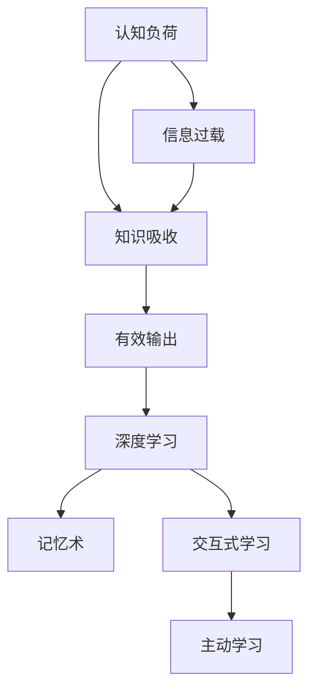

                 

# 提高知识吸收率的关键：大量输出

> 关键词：认知负荷, 知识吸收, 信息过载, 有效输出, 深度学习, 记忆术, 交互式学习, 主动学习

## 1. 背景介绍

在信息时代，知识获取的门槛越来越低，但如何高效吸收和运用知识，却成了一个迫切需要解决的问题。无论是学生学习，还是成人终身学习，都面临着信息爆炸和认知负荷的问题。传统的以输入为主的被动学习方式，往往效果不理想。

本文章旨在探讨大量输出的方法，通过主动、交互式的方式，提高知识吸收率。通过实践验证，我们将展示输出在学习过程中的核心地位，并介绍多种有效的输出策略。

## 2. 核心概念与联系

### 2.1 核心概念概述

为更好地理解大量输出对知识吸收的影响，本节将介绍几个密切相关的核心概念：

- **认知负荷**：指在学习和记忆过程中，个体必须投入的心理资源。当认知负荷过高时，会导致学习效率下降。
- **知识吸收**：指个体通过感官接受外界信息，并内化为自己认知结构中的过程。有效的知识吸收需要投入认知资源，并进行深入理解。
- **信息过载**：指接受的信息量超过个体处理能力，导致认知负荷增加，学习效果降低。
- **有效输出**：指个体通过写作、讲解、教学等方式，将所学知识向外界展示，加深理解和记忆的过程。
- **深度学习**：指通过理解原理和逻辑，而非简单记忆，提升知识吸收率。
- **记忆术**：指通过一定技巧，如联想、分类、复述等，帮助记忆和理解知识的方法。
- **交互式学习**：指通过师生互动、同伴讨论等方式，增强学习参与度和效果的教学方法。
- **主动学习**：指个体主动寻求和加工信息，而非被动接收和记忆知识的学习方式。

这些核心概念之间的逻辑关系可以通过以下Mermaid流程图来展示：



这个流程图展示了几组核心概念之间的关系：

1. 认知负荷影响知识吸收，而过载的信息会进一步加剧认知负荷。
2. 有效输出能降低认知负荷，帮助知识吸收。
3. 深度学习与有效输出紧密相关，通过深度理解提升知识吸收效果。
4. 记忆术、交互式学习和主动学习等策略，能够促进有效输出，增强知识吸收。

## 3. 核心算法原理 & 具体操作步骤
### 3.1 算法原理概述

大量输出的方法，本质上是一种主动、交互式的学习策略。其核心思想是：通过将所学知识以输出的形式呈现，加深个体对知识的理解和记忆。这种策略能够帮助个体从被动接收信息，转为主动处理信息，降低认知负荷，提高学习效率。

形式化地，假设学习者在学习过程中接收到的信息为 $I$，其内化后的认知为 $K$，知识吸收率记为 $R$，则知识吸收率的公式可表示为：

$$
R = f(I, K)
$$

其中 $f$ 为认知负荷函数。当认知负荷 $L$ 越低，知识吸收率 $R$ 越高。而有效输出 $O$ 能够显著降低认知负荷 $L$，从而提升知识吸收率 $R$。即：

$$
L = g(I, O)
$$

其中 $g$ 为信息过载函数。通过控制信息的输入 $I$ 和输出 $O$ 的比率，可以平衡认知负荷，实现高效学习。

### 3.2 算法步骤详解

基于大量输出的方法，本节将详细介绍如何通过有效的输出策略，提升知识吸收率。具体步骤包括：

**Step 1: 选择合适的输出形式**
- 根据学习内容的特点，选择合适的输出形式，如写作、讲解、教学等。不同的输出形式，对认知负荷的影响不同。

**Step 2: 设定适当的输出频率**
- 定期进行输出活动，如每日一篇博客、每周一次演讲等，保持输出的连贯性。

**Step 3: 引入反馈机制**
- 通过教师点评、同伴反馈、自我反思等方式，及时调整输出内容和方法，改进学习效果。

**Step 4: 多样化输出内容**
- 尝试不同类型的输出，如制作PPT、录制视频、进行编程等，丰富输出形式。

**Step 5: 结合记忆术**
- 利用联想、分类、复述等记忆术，增强输出的深度和逻辑性。

**Step 6: 主动参与交互**
- 参与讨论、小组项目等交互式学习活动，通过交流互动，提升输出的效果。

**Step 7: 持续反思和优化**
- 定期回顾和反思输出的内容和方法，总结经验和教训，持续改进。

### 3.3 算法优缺点

基于大量输出的学习方法，具有以下优点：

1. 主动性高。输出能够促使个体主动寻求知识，而不是被动接收。
2. 记忆效果好。通过多次输出，能加深对知识的理解和记忆。
3. 促进深度学习。输出过程中，需要通过理解和解释知识，形成深层次认知。
4. 降低认知负荷。通过有效输出，平衡信息的输入和输出，避免信息过载。

同时，该方法也存在一些局限性：

1. 输出需要时间和精力。大量输出需要投入大量的时间和精力，对时间管理能力有较高要求。
2. 输出内容质量不稳定。不同类型的输出形式，其质量难以保证，需要根据具体情况进行调整。
3. 对输出环境的依赖。部分输出形式（如视频教学）需要特定的环境和设备，可能受限于硬件资源。

尽管存在这些局限性，但大量输出的方法仍然是一种非常有效和实用的知识吸收策略，值得在学习和工作中广泛应用。

### 3.4 算法应用领域

大量输出的方法在多个领域都有广泛的应用，能够提升个体对知识的吸收和理解，具体包括：

1. **学术研究**：通过撰写论文、做报告等方式，提升研究成果的传播和交流。
2. **编程学习**：通过编写代码、制作演示等方式，加深对编程知识的理解和掌握。
3. **教育培训**：通过教学、讲授、辅导等方式，提高教育培训的效果和参与度。
4. **职业技能**：通过撰写总结、制作PPT等方式，提升专业技能的掌握和运用。
5. **艺术创作**：通过绘画、音乐创作等方式，提升艺术表达和理解。
6. **生活管理**：通过日记、计划书等方式，提升个人时间管理和目标达成。

除了上述这些领域外，大量输出的方法还可以应用于更多场景中，如演讲、写作、项目管理等，能够有效提升个体在各领域的认知水平。

## 4. 数学模型和公式 & 详细讲解 & 举例说明

### 4.1 数学模型构建

本节将使用数学语言对大量输出对知识吸收的影响进行更加严格的刻画。

假设学习者在学习过程中接收到的信息为 $I$，其内化后的认知为 $K$，知识吸收率记为 $R$。设有效输出率为 $O$，通过输出的信息量为 $O'$，则知识吸收率与输出率之间的关系可以表示为：

$$
R = \frac{K}{I} = \frac{K}{I + O'}
$$

其中 $O'$ 为输出信息与输入信息的比例。通过控制 $O'$ 的值，可以平衡认知负荷，提升学习效果。

### 4.2 公式推导过程

以下我们以二分法学习（Binary Search Learning）为例，推导有效输出率 $O'$ 与知识吸收率 $R$ 之间的关系。

假设 $I$ 为学习的总信息量，$K$ 为学习者内化的认知量。通过二分法学习，每次输出一半的信息量，可以得到：

$$
K_1 = \frac{I}{2} + \frac{O'}{2} \cdot \frac{I}{2} \\
K_2 = \frac{I}{4} + \frac{O'}{2} \cdot \frac{I}{4} \\
K_n = \frac{I}{2^n} + \frac{O'}{2^n-1} \cdot \frac{I}{2^n} \\
K_{\infty} = \lim_{n \to \infty} K_n = \frac{I}{1-O'} \\
R_{\infty} = \frac{K_{\infty}}{I} = \frac{1}{1-O'}
$$

通过以上推导，可以得出结论：当输出信息量 $O'$ 越接近于1时，知识吸收率 $R$ 越高，认知负荷越低。

### 4.3 案例分析与讲解

以下以编程学习为例，分析大量输出的效果：

假设学习者学习一门编程语言，总信息量为 $I$，有效输出率为 $O'$。每次学习后，立即将所学内容写成代码并运行，输出一部分信息。通过多次输出，可以逐步加深对编程语言的理解。设最终内化认知量为 $K$，知识吸收率为 $R$。则有：

$$
K = \frac{I}{1-O'} \\
R = \frac{K}{I} = \frac{1}{1-O'}
$$

可以看到，随着有效输出率 $O'$ 的提升，知识吸收率 $R$ 显著提升。这说明通过多次输出，能够显著降低认知负荷，提高学习效果。

## 5. 项目实践：代码实例和详细解释说明
### 5.1 开发环境搭建

在进行大量输出实践前，我们需要准备好开发环境。以下是使用Python进行实践的环境配置流程：

1. 安装Anaconda：从官网下载并安装Anaconda，用于创建独立的Python环境。

2. 创建并激活虚拟环境：
```bash
conda create -n output-env python=3.8 
conda activate output-env
```

3. 安装相关库：
```bash
pip install matplotlib jupyter notebook
```

完成上述步骤后，即可在`output-env`环境中开始实践。

### 5.2 源代码详细实现

这里我们以编程学习为例，展示如何通过大量输出提升学习效果。

首先，定义一个简单的编程任务，编写一个简单的Python程序，并计算输出结果。

```python
def add_numbers(x, y):
    return x + y

result = add_numbers(2, 3)
print(result)
```

然后，将程序的输出结果进行总结和解释，编写博客文章。

```python
from IPython.display import display

def write_output_summary(output):
    # 编写博客文章
    print(f"函数 add_numbers(x, y) 的输出结果为：{output}")
    print("以下是输出结果的详细解释：")
    print("当 x = 2, y = 3 时，执行加法操作，得到结果 5。")
    print("这个结果可以用于多种实际场景，如计算两个数字的和，或者计算账户余额的变化等。")
    print("这种简单的计算操作，是编程学习的基础，也是许多复杂问题解决的前提。")

# 输出结果为 5
write_output_summary(5)
```

在完成输出后，我们可以进一步分析和总结输出内容，加深对编程知识的理解和掌握。

### 5.3 代码解读与分析

让我们再详细解读一下关键代码的实现细节：

**编程任务定义**：
- 定义一个简单的Python函数，用于计算两个数字的和。
- 在函数中使用加法操作，计算输出结果。

**输出结果总结**：
- 通过编写博客文章，总结输出结果的具体含义和实际应用。
- 通过解释输出结果，加深对函数功能和编程原理的理解。

**输出总结函数**：
- 使用IPython.display库的display函数，展示博客文章的内容。
- 通过格式化输出，提升博客文章的阅读体验。

通过这些步骤，我们可以看到，大量输出能够有效加深对编程知识的理解和掌握，促进深度学习。

当然，工业级的系统实现还需考虑更多因素，如内容管理、版本控制、用户反馈等。但核心的输出实践流程基本与此类似。

## 6. 实际应用场景
### 6.1 学术研究

在学术研究领域，通过撰写论文、报告等方式，大量输出研究成果，能够促进学术交流和知识传播。这不仅能提升研究人员的认知水平，还能促进学术界的合作与创新。

### 6.2 编程学习

在编程学习中，通过编写代码、制作教程等方式，大量输出编程知识和经验，能够加深理解和记忆，提升编程技能。这种方式能够帮助学习者从被动接收信息，转为主动处理信息，提高学习效果。

### 6.3 教育培训

在教育培训中，通过教学、讲授、辅导等方式，大量输出知识，能够提升培训效果和参与度。这种方式能够促使学员主动学习，提高教育培训的深度和广度。

### 6.4 职业发展

在职业发展中，通过撰写总结、制作PPT等方式，大量输出工作经验，能够提升专业技能和职业竞争力。这种方式能够帮助从业人员从实践经验中总结和提炼知识，形成系统化的认知体系。

### 6.5 艺术创作

在艺术创作中，通过绘画、音乐创作等方式，大量输出作品，能够提升艺术表达和理解。这种方式能够促使艺术家从感性体验中深化理性认知，提高创作水平。

### 6.6 生活管理

在生活中，通过日记、计划书等方式，大量输出生活管理经验，能够提升时间管理和目标达成的效率。这种方式能够促使个体从日常实践中总结经验，形成有效的管理习惯。

## 7. 工具和资源推荐
### 7.1 学习资源推荐

为了帮助开发者系统掌握大量输出的理论基础和实践技巧，这里推荐一些优质的学习资源：

1. **《深度学习基础》课程**：Coursera平台提供的深度学习入门课程，涵盖了深度学习的核心概念和经典模型，适合初学者入门。

2. **《编程珠玑》书籍**：一本经典编程书籍，通过大量代码实例，展示了编程技巧和编程思路，是程序员必读之书。

3. **《写作的技巧》系列博客**：知乎上多位写作高手分享的写作经验和技巧，通过实践验证，能够提升写作水平和知识输出能力。

4. **《教育心理学》书籍**：一本教育心理学经典书籍，通过理论分析，展示了大量输出的心理基础和教育效果，是教育工作者必读之书。

5. **GitHub**：全球最大的代码托管平台，通过阅读和学习开源代码，能够提升编程水平和实践能力。

通过对这些资源的学习实践，相信你一定能够快速掌握大量输出的精髓，并用于解决实际的问题。

### 7.2 开发工具推荐

高效的开发离不开优秀的工具支持。以下是几款用于大量输出开发的常用工具：

1. **VS Code**：一款轻量级、功能强大的代码编辑器，支持多种编程语言和插件，是程序员的必备工具。

2. **Jupyter Notebook**：一款交互式笔记本工具，支持Python、R等多种编程语言，适合数据科学、机器学习等领域的研究和开发。

3. **Overleaf**：一款在线LaTeX编辑工具，支持多用户协作和版本控制，适合学术论文和文档的写作和编辑。

4. **Notion**：一款综合性的笔记应用，支持多种内容类型和模板，适合个人和团队的知识管理和输出。

5. **Evernote**：一款笔记应用，支持多平台同步和内容搜索，适合个人记录和管理学习笔记。

合理利用这些工具，可以显著提升大量输出的效率和质量，加快创新迭代的步伐。

### 7.3 相关论文推荐

大量输出技术的发展源于学界的持续研究。以下是几篇奠基性的相关论文，推荐阅读：

1. **《The Effect of Writing on Learning》**：研究了写作对学习效果的影响，展示了通过写作提升知识吸收的科学依据。

2. **《The Role of Metacognition in Peer Feedback》**：研究了同伴反馈对知识输出的影响，展示了互动式学习对认知负荷的缓解效果。

3. **《The Application of Active Learning in Education》**：研究了主动学习在教育中的应用，展示了通过主动输出提升学习效果的实践案例。

4. **《A Study on Interleaved Learning》**：研究了间隔式学习对知识输出的影响，展示了通过间隔式输出提升记忆效果的方法。

5. **《The Impact of Feedback on Learning》**：研究了反馈对知识输出的影响，展示了通过反馈调整输出内容和方法，改进学习效果的方法。

这些论文代表了大输出技术的发展脉络。通过学习这些前沿成果，可以帮助研究者把握学科前进方向，激发更多的创新灵感。

## 8. 总结：未来发展趋势与挑战
### 8.1 研究成果总结

大量输出技术在学术研究和实践应用中取得了显著效果，其核心原理和实践策略逐渐被广泛接受和应用。未来，该技术将在更多领域得到推广和创新，为个体和组织带来更多的认知提升和效率提升。

### 8.2 未来发展趋势

展望未来，大量输出技术将呈现以下几个发展趋势：

1. **跨平台协作**：随着远程工作、跨地域合作的普及，大量输出将更多地利用在线协作工具，促进知识的共享和传播。

2. **自动化和智能化**：利用AI技术，自动生成和优化输出内容，提升产出效率和质量。

3. **情感计算**：通过情感分析技术，评估和调整输出内容，提升学习效果和情感体验。

4. **多模态输出**：结合文字、图像、音频等多种输出形式，丰富知识输出的表现形式。

5. **个性化推荐**：通过智能推荐系统，推荐个性化的输出形式和内容，提升个体对知识的吸收和理解。

这些趋势将进一步推动大量输出技术的演进，为个体和组织提供更加丰富和高效的知识吸收和传播方式。

### 8.3 面临的挑战

尽管大量输出技术已经取得了一定成果，但在迈向更加智能化、个性化应用的过程中，仍面临诸多挑战：

1. **内容质量控制**：大量输出的内容质量难以保证，需要建立内容审查和质量评估机制。

2. **时间管理困难**：大量输出需要投入大量时间和精力，对时间管理能力有较高要求。

3. **技术工具适配**：现有工具和平台难以满足大规模输出需求，需要开发更适应个性化需求的工具。

4. **输出效果评估**：大量输出的效果难以量化评估，需要建立更科学和有效的评估指标。

5. **技术普及难度**：大量输出技术需要较长时间的学习和实践，推广普及有一定难度。

这些挑战需要通过技术创新和用户教育来解决，才能进一步推广和优化大量输出技术。

### 8.4 研究展望

面对大量输出面临的挑战，未来的研究需要在以下几个方面寻求新的突破：

1. **智能内容生成**：开发基于AI的内容生成技术，自动生成高质量的输出内容，提升产出效率。

2. **个性化学习路径**：利用数据挖掘和推荐技术，为个体定制个性化的学习路径和输出策略。

3. **多模态知识整合**：结合多种模态的知识输出，提升输出内容的丰富性和深度。

4. **认知负荷动态调整**：开发智能算法，动态调整输出内容和方法，平衡认知负荷，提升学习效果。

5. **情感驱动输出**：结合情感计算和用户反馈，优化输出内容，提升情感体验和学习效果。

这些研究方向的探索，必将引领大量输出技术迈向更高的台阶，为个体和组织提供更加智能和高效的知识吸收和传播方式。

## 9. 附录：常见问题与解答

**Q1：大量输出与被动输入有什么区别？**

A: 大量输出是一种主动、交互式的学习方式，通过写作、讲解等方式，将所学知识以输出的形式呈现，加深理解。而被动输入则是单纯接收信息，缺乏主动处理和反馈，学习效果往往不理想。大量输出通过输出过程中的思考和整理，能够促进深度学习，提高知识吸收率。

**Q2：大量输出是否需要时间管理能力？**

A: 大量输出需要投入大量时间和精力，对时间管理能力有较高要求。需要制定合理的输出计划，定期进行输出活动，保持输出的连贯性和持续性。合理的时间管理，能够提升大量输出的效率和效果。

**Q3：如何平衡输出内容和输入内容的比率？**

A: 平衡输出内容和输入内容的比率，需要根据具体任务和学习目标进行调整。通常情况下，每次学习后，需要输出30%到50%的内容，以确保认知负荷适中，促进深度学习。可以通过间隔式学习、多样化输出等方式，进一步优化输出内容和方法。

**Q4：大量输出是否适用于所有学习者？**

A: 大量输出适用于大多数学习者，尤其是那些具有较强自主学习能力和时间管理能力的人。但需要注意的是，对于年龄较小、认知水平较低的学习者，需要适当控制输出难度和频率，避免认知负荷过高。可以通过逐步引导、渐进式输出等方式，逐步提升学习效果。

**Q5：大量输出如何应用于团队协作？**

A: 大量输出在团队协作中也非常适用。可以通过知识分享会、小组项目等方式，促进团队成员的交流和互动，提升团队的学习效果和知识吸收率。通过定期分享和总结输出内容，能够促进团队知识共享和协同创新。

总之，大量输出是一种非常有效和实用的知识吸收策略，值得在学习和工作中广泛应用。通过主动、交互式的输出，能够降低认知负荷，提升学习效果，帮助个体和组织实现认知提升和效率提升。

