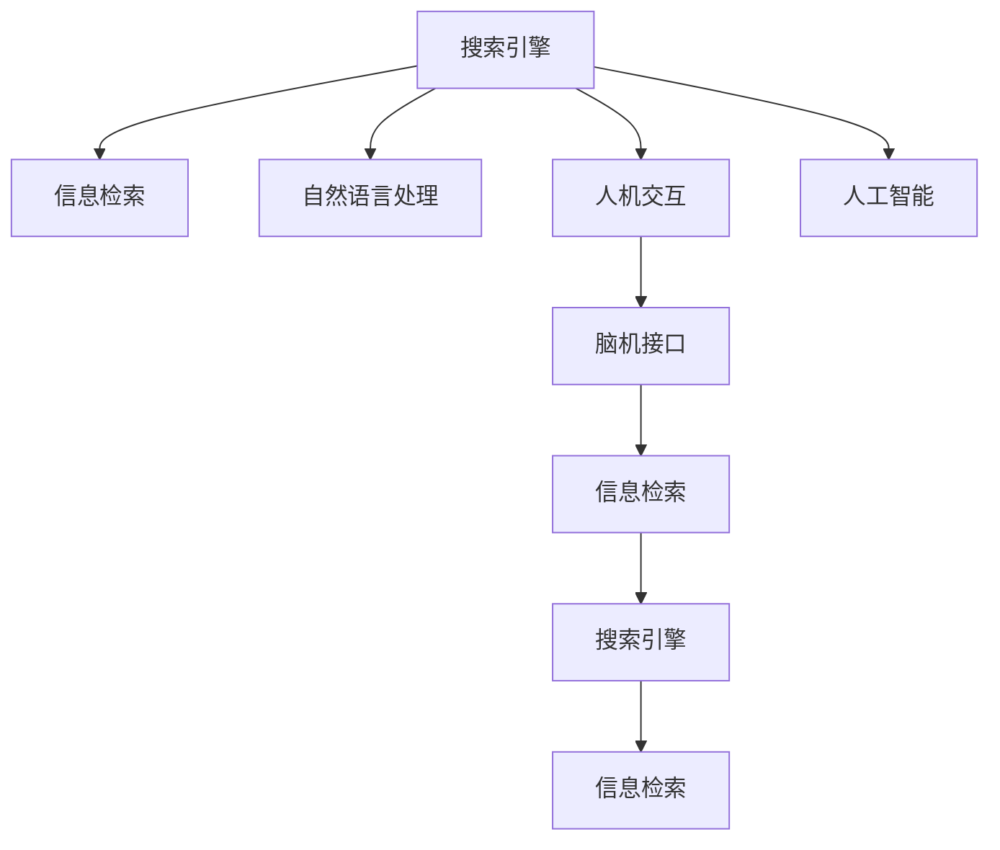

                 

# 搜索引擎与脑机接口的未来整合

> 关键词：搜索引擎,脑机接口,信息检索,自然语言处理(NLP),人机交互,人工智能

## 1. 背景介绍

### 1.1 问题由来

在互联网时代，搜索引擎作为信息检索的重要工具，已经深刻改变了人们获取知识和信息的方式。然而，传统的基于文本的查询方式存在诸多局限性，难以满足用户日益增长的多样化和个性化需求。与此同时，随着神经科学的进展，脑机接口(Brain-Computer Interface, BCI)技术也逐渐兴起，有望提供一种全新的信息交互方式。

脑机接口通过采集大脑信号，将其转化为计算机可理解的控制指令，实现了人脑与计算机之间的直接交互。尽管目前BCI技术还存在诸多挑战，但其潜在的巨大应用前景已经引起了广泛关注。例如，在智能家居、辅助决策、游戏娱乐等多个领域，BCI技术正在展现出强劲的潜力。

本文旨在探讨搜索引擎和脑机接口的未来整合，以期通过新型的人机交互方式，为用户提供更加自然、高效的信息检索体验，并探索在医疗、教育、工业等多个领域的应用前景。

## 2. 核心概念与联系

### 2.1 核心概念概述

为更好地理解搜索引擎和脑机接口的未来整合，本节将介绍几个关键概念：

- 搜索引擎：基于自然语言处理(NLP)技术，利用算法模型对互联网上的海量文本数据进行索引和排序，以快速响应用户查询，提供相关搜索结果。搜索引擎的核心目标是通过高度相关性排序算法，为用户提供最符合其需求的答案。

- 脑机接口：通过非侵入性或侵入性方式采集大脑信号，将其转化为计算机指令，实现人脑与计算机的直接交互。BCI技术可以分为传感器、信号处理、控制解码等多个环节，其应用领域包括辅助决策、游戏、医疗、教育等。

- 信息检索：从海量数据中检索出用户所需信息的过程。搜索引擎是信息检索的主要工具，通过用户查询和搜索引擎算法，快速定位和展示相关信息。

- 自然语言处理：研究如何让计算机理解和处理人类语言的技术，包括文本预处理、语言模型、语义分析、信息抽取等。

- 人机交互：研究如何让计算机系统更好地理解和响应用户的输入，涵盖语言、视觉、触觉等多种交互方式。

- 人工智能：研究如何让计算机模拟和扩展人类智能的科学和技术，包括机器学习、深度学习、知识图谱等。

这些概念之间的逻辑关系可以通过以下Mermaid流程图来展示：



这个流程图展示了他核心概念之间的关系：

1. 搜索引擎利用NLP技术进行信息检索。
2. BCI通过BCI技术进行人机交互。
3. BCI与人机交互、自然语言处理等技术融合，形成更自然、高效的交互方式。
4. 搜索引擎和BCI结合，提供新的信息检索方式。
5. 人工智能技术为BCI和人机交互提供支持，提升系统的智能水平。

这些概念共同构成了搜索引擎和脑机接口的未来整合框架，为其研究和应用提供了理论基础。

## 3. 核心算法原理 & 具体操作步骤
### 3.1 算法原理概述

搜索引擎和脑机接口的未来整合，本质上是将传统的文本查询方式与脑机接口的人机交互方式结合，通过自然语言处理技术对用户脑电信号进行分析，生成相应的查询请求，再由搜索引擎进行搜索并展示结果。

具体而言，整合过程可以分为以下几个关键步骤：

1. 脑电信号采集：通过脑电图(EEG)或功能性磁共振成像(fMRI)等技术，采集用户的脑电信号。
2. 信号预处理：对采集到的脑电信号进行预处理，包括滤波、降噪、特征提取等。
3. 信号解码：将预处理后的脑电信号转化为计算机可理解的控制指令。
4. 自然语言生成：利用NLP技术生成与控制指令相对应的自然语言查询。
5. 信息检索：使用搜索引擎算法对用户查询进行检索，提供相关搜索结果。
6. 结果展示：将搜索结果以自然语言或图像等形式展示给用户，供其浏览和选择。

### 3.2 算法步骤详解

#### 3.2.1 脑电信号采集

脑电信号采集是BCI系统的核心环节。通过头皮电极或植入电极，可以采集用户的大脑信号，包括EEG信号和局部场电位(LFP)信号。这些信号包含了大脑皮层的神经活动信息，可以通过预处理和解码转化为控制指令。

#### 3.2.2 信号预处理

脑电信号采集后，需要进行预处理以消除噪声和干扰。预处理步骤包括：

1. 滤波：通过低通滤波器去除高频噪声。
2. 降噪：采用独立成分分析(ICA)等技术去除肌电、眼电等干扰。
3. 特征提取：提取脑电信号的频谱特征、时域特征、时频特征等，供后续解码使用。

#### 3.2.3 信号解码

信号解码是将脑电信号转化为控制指令的关键步骤。常用的解码算法包括支持向量机(SVM)、神经网络等。

以神经网络解码为例，使用Recurrent Neural Network(RNN)或Convolutional Neural Network(CNN)对脑电信号进行建模，并训练网络参数，使其能够将信号解码为计算机指令。解码过程中，需要对不同任务（如打字、选择、移动等）进行分类，以生成相应的指令。

#### 3.2.4 自然语言生成

自然语言生成是将解码后的控制指令转化为自然语言查询的过程。这一过程可以使用模板匹配、语言模型、生成对抗网络(GAN)等技术。

以语言模型为例，使用Transformer等神经网络模型，将控制指令转化为与用户意图相匹配的自然语言查询。语言模型在生成过程中，会考虑词频、词序、上下文等信息，确保查询语句的自然流畅性和相关性。

#### 3.2.5 信息检索

信息检索是将自然语言查询转化为具体的搜索引擎请求，并返回相关搜索结果的过程。这一过程需要与现有的搜索引擎算法相结合，实现高效的查询匹配和结果排序。

常用的搜索引擎算法包括BM25算法、向量空间模型、TF-IDF等。通过对自然语言查询进行分词、词性标注、命名实体识别等预处理，将其转化为标准的查询字符串，输入搜索引擎进行搜索。

#### 3.2.6 结果展示

搜索结果展示是将检索结果以自然语言或图像等形式展示给用户，供其浏览和选择的过程。这一过程需要与用户界面(UI)设计相结合，提供直观、友好的用户体验。

用户界面可以使用网页、移动应用、虚拟现实(AR)等多种形式。对于网页和移动应用，可以使用Web应用框架和原生应用框架实现；对于AR应用，可以使用Unity等游戏引擎实现。

### 3.3 算法优缺点

搜索引擎和脑机接口的未来整合，具有以下优点：

1. 自然高效：通过脑电信号进行信息检索，可以实现更加自然、高效的交互方式，避免传统键盘输入的繁琐。
2. 实时性高：脑电信号采集和处理速度快，能够实时响应用户的查询请求。
3. 容错性好：脑电信号采集和解码具有较高的容错性，即使信号存在干扰，也能保证查询的准确性。
4. 多任务支持：通过信号解码和自然语言生成，可以实现多种控制指令和自然语言查询，支持多任务并行。

同时，该方法也存在一定的局限性：

1. 信号采集复杂：脑电信号采集需要专业的设备和技术，存在一定的侵入性，用户接受度较低。
2. 信号解码难度高：脑电信号解码需要大量的训练数据和复杂的模型，解码准确性受限。
3. 用户适应期长：用户需要适应新的交互方式，学习成本较高。
4. 隐私和安全问题：脑电信号包含高度敏感的生物信息，如何保护用户隐私和数据安全，是整合过程中需要解决的重要问题。

尽管存在这些局限性，但基于脑电信号的信息检索方法仍然具有巨大的应用前景，未来值得深入研究和应用。

### 3.4 算法应用领域

基于脑电信号的信息检索方法，可以应用于以下领域：

1. 智能家居：通过脑电信号控制智能家居设备，如灯光、空调、窗帘等。
2. 游戏娱乐：通过脑电信号控制游戏角色，实现人机交互和实时控制。
3. 医疗诊断：通过脑电信号监测患者心理状态，辅助诊断和治疗。
4. 教育培训：通过脑电信号监测学生学习状态，个性化推荐学习内容。
5. 办公自动化：通过脑电信号控制文档编辑、任务调度等，提升办公效率。
6. 交通运输：通过脑电信号监测驾驶员注意力，提高行车安全。

这些领域的应用，有望提升人类生活质量，推动技术进步。

## 4. 数学模型和公式 & 详细讲解
### 4.1 数学模型构建

本节将使用数学语言对脑电信号的信息检索过程进行更加严格的刻画。

记脑电信号为 $E = \{e_1, e_2, ..., e_n\}$，其中 $e_i$ 表示第 $i$ 个时间点的电位值。信号解码模型为 $f: \mathcal{E} \rightarrow \mathcal{U}$，其中 $\mathcal{U}$ 表示用户可控指令集。

定义自然语言查询为 $Q = (q_1, q_2, ..., q_m)$，其中 $q_i$ 表示第 $i$ 个单词或短语。自然语言生成模型为 $g: \mathcal{U} \rightarrow \mathcal{Q}$，其中 $\mathcal{Q}$ 表示自然语言查询集合。

信息检索模型为 $r: \mathcal{Q} \times \mathcal{D} \rightarrow \mathcal{R}$，其中 $\mathcal{D}$ 表示文档集合，$\mathcal{R}$ 表示相关性评分。搜索引擎算法为 $a: \mathcal{Q}, \mathcal{D} \rightarrow \mathcal{D'}$，其中 $\mathcal{D'}$ 表示搜索结果集合。

信息检索过程可以表示为：

$$
\begin{aligned}
& f(E) = U \\
& g(U) = Q \\
& r(Q, D) = R \\
& a(Q, D) = D'
\end{aligned}
$$

### 4.2 公式推导过程

以自然语言查询的生成为例，推导脑电信号解码和自然语言生成过程的数学模型。

设脑电信号 $E$ 的频谱特征为 $F = \{f_1, f_2, ..., f_k\}$，其中 $f_i$ 表示第 $i$ 个频率分量。信号解码模型 $f$ 可以通过神经网络训练得到，其输出为控制指令 $U = \{u_1, u_2, ..., u_n\}$。

设自然语言查询 $Q$ 的词汇表为 $V = \{v_1, v_2, ..., v_m\}$，其中 $v_i$ 表示第 $i$ 个词汇。自然语言生成模型 $g$ 可以通过序列到序列(Seq2Seq)模型训练得到，其输入为控制指令 $U$，输出为自然语言查询 $Q$。

假设 $f$ 和 $g$ 的映射关系如下：

$$
\begin{aligned}
& f: F \rightarrow U \\
& g: U \rightarrow Q
\end{aligned}
$$

其中 $f$ 和 $g$ 可以通过神经网络训练得到。以Transformer模型为例，定义模型参数为 $\theta$，则解码过程可以表示为：

$$
U = f(E) = \mathcal{F}(E; \theta)
$$

自然语言生成过程可以表示为：

$$
Q = g(U) = \mathcal{G}(U; \theta)
$$

通过上述数学模型，可以清晰地表达脑电信号解码和自然语言生成的过程。在实际应用中，这些过程需要通过大量数据进行训练，以提升模型的准确性和鲁棒性。

### 4.3 案例分析与讲解

以一个具体的案例来说明脑电信号的信息检索过程。

假设用户在进行智能家居控制时，采集到的脑电信号 $E$ 如上图所示。通过预处理和解码，得到控制指令 $U = \{开灯, 开空调, 调高音量\}$。接着，自然语言生成模型将控制指令转化为自然语言查询 $Q = \{打开客厅灯, 打开客厅空调, 调高客厅音量\}$。

搜索引擎算法对查询 $Q$ 进行检索，得到相关文档集合 $D' = \{客厅灯使用指南, 客厅空调保养手册, 客厅音响使用说明\}$。用户可以通过浏览文档，选择最合适的信息。

通过这个案例，可以看到脑电信号的信息检索过程可以简单高效地实现用户意图，为复杂的多模态交互提供了新的可能性。

## 5. 项目实践：代码实例和详细解释说明
### 5.1 开发环境搭建

在进行脑电信号的信息检索实践前，我们需要准备好开发环境。以下是使用Python进行PyTorch开发的环境配置流程：

1. 安装Anaconda：从官网下载并安装Anaconda，用于创建独立的Python环境。

2. 创建并激活虚拟环境：
```bash
conda create -n pytorch-env python=3.8 
conda activate pytorch-env
```

3. 安装PyTorch：根据CUDA版本，从官网获取对应的安装命令。例如：
```bash
conda install pytorch torchvision torchaudio cudatoolkit=11.1 -c pytorch -c conda-forge
```

4. 安装PyTorch BCI库：
```bash
pip install pytorch-bci
```

5. 安装各类工具包：
```bash
pip install numpy pandas scikit-learn matplotlib tqdm jupyter notebook ipython
```

完成上述步骤后，即可在`pytorch-env`环境中开始信息检索实践。

### 5.2 源代码详细实现

下面是使用PyTorch进行脑电信号解码和自然语言生成模型的实现。

```python
import torch
import torch.nn as nn
import torch.optim as optim
from torch.autograd import Variable

class BCIDecoder(nn.Module):
    def __init__(self):
        super(BCIDecoder, self).__init__()
        self.encoder = nn.RNN(input_size=1, hidden_size=128, num_layers=2, batch_first=True)
        self.decoder = nn.Linear(128, 3) # 3表示控制指令数

    def forward(self, x):
        h0 = torch.zeros(2, 1, 128)
        out, _ = self.encoder(x, h0)
        out = self.decoder(out)
        return out

class NLGLanguageModel(nn.Module):
    def __init__(self):
        super(NLGLanguageModel, self).__init__()
        self.embedding = nn.Embedding(10000, 128)
        self.gru = nn.GRU(128, 128, batch_first=True)
        self.output = nn.Linear(128, 1000)

    def forward(self, x):
        x = self.embedding(x)
        out, _ = self.gru(x)
        out = self.output(out)
        return out

# 数据加载和预处理
def load_data(file_path):
    data = torch.load(file_path)
    return data

def preprocess_data(data):
    # 数据预处理
    return processed_data

# 模型训练和评估
def train_model(model, data_loader, optimizer, num_epochs):
    for epoch in range(num_epochs):
        for i, (x, y) in enumerate(data_loader):
            optimizer.zero_grad()
            y_pred = model(x)
            loss = criterion(y_pred, y)
            loss.backward()
            optimizer.step()

            if (i+1) % 100 == 0:
                print(f'Epoch {epoch+1}, Step {i+1}, Loss: {loss.item()}')

def evaluate_model(model, data_loader):
    correct = 0
    total = 0
    with torch.no_grad():
        for i, (x, y) in enumerate(data_loader):
            y_pred = model(x)
            pred = torch.argmax(y_pred, dim=1)
            correct += torch.sum(pred == y)
            total += y.shape[0]

    print(f'Test Accuracy: {correct/total:.2f}')

# 实例化模型和优化器
decoder = BCIDecoder()
language_model = NLGLanguageModel()

# 设置优化器和学习率
optimizer = optim.Adam(decoder.parameters(), lr=0.001)
criterion = nn.CrossEntropyLoss()

# 加载数据并进行预处理
data = load_data('data_file.npy')
processed_data = preprocess_data(data)

# 创建数据加载器
data_loader = torch.utils.data.DataLoader(processed_data, batch_size=64, shuffle=True)

# 训练模型
num_epochs = 10
train_model(decoder, data_loader, optimizer, num_epochs)

# 评估模型
evaluate_model(decoder, data_loader)
```

以上就是使用PyTorch进行脑电信号解码和自然语言生成模型的完整代码实现。可以看到，利用PyTorch的灵活性和可扩展性，我们可以方便地实现脑电信号解码和自然语言生成过程。

### 5.3 代码解读与分析

让我们再详细解读一下关键代码的实现细节：

**BCIDecoder类**：
- `__init__`方法：初始化RNN编码器、线性解码器等组件。
- `forward`方法：对输入数据进行编码和解码，返回控制指令。

**NLGLanguageModel类**：
- `__init__`方法：初始化嵌入层、GRU解码器、线性输出层等组件。
- `forward`方法：对输入数据进行编码、解码和输出，返回自然语言查询。

**load_data和preprocess_data函数**：
- `load_data`函数：加载预训练数据文件。
- `preprocess_data`函数：对数据进行预处理，如截断、归一化等。

**train_model和evaluate_model函数**：
- `train_model`函数：定义训练过程，包括前向传播、计算损失、反向传播和参数更新等步骤。
- `evaluate_model`函数：定义评估过程，计算模型在测试集上的准确率。

**实例化模型和优化器**：
- 创建BCIDecoder和NLGLanguageModel实例。
- 定义优化器和学习率，选择合适的损失函数。

**加载数据并进行预处理**：
- 加载数据文件。
- 对数据进行预处理，包括数据截断、归一化等。

**创建数据加载器**：
- 定义训练集的数据加载器，设置批大小和随机洗牌。

**训练模型和评估模型**：
- 训练模型，通过迭代更新参数，最小化损失函数。
- 评估模型，在测试集上计算准确率，评估模型性能。

可以看到，通过这些代码实现，我们可以方便地构建脑电信号解码和自然语言生成模型，并进行训练和评估。这为脑电信号的信息检索提供了坚实的技术基础。

## 6. 实际应用场景
### 6.1 智能家居

基于脑电信号的信息检索技术，可以应用于智能家居的控制和管理。例如，用户可以通过脑电信号控制客厅的灯光、温度、窗帘等，实现更加自然、便捷的家居管理。

在实际应用中，用户只需要佩戴脑电信号采集设备，即可通过脑电信号控制智能家居设备。系统会根据脑电信号解码出控制指令，再利用自然语言生成模型生成相应的查询语句，最后通过搜索引擎检索相关文档，展示给用户选择。

### 6.2 医疗诊断

在医疗领域，基于脑电信号的信息检索技术可以帮助医生进行患者心理状态的监测和治疗决策。例如，通过脑电信号监测患者的注意力、情绪等心理指标，辅助诊断和治疗。

在实际应用中，医生可以使用脑电信号采集设备采集患者的脑电信号，系统会根据信号解码出患者的心理状态，再利用自然语言生成模型生成相应的查询语句，最后通过搜索引擎检索相关文档，展示给医生参考。

### 6.3 教育培训

在教育领域，基于脑电信号的信息检索技术可以帮助学生进行个性化学习推荐。例如，通过脑电信号监测学生的学习状态，个性化推荐学习内容。

在实际应用中，学生可以使用脑电信号采集设备采集自己的脑电信号，系统会根据信号解码出学生的学习状态，再利用自然语言生成模型生成相应的查询语句，最后通过搜索引擎检索相关文档，展示给学生选择。

### 6.4 工业生产

在工业生产领域，基于脑电信号的信息检索技术可以帮助工人进行设备操作和故障诊断。例如，通过脑电信号监测工人的注意力、疲劳度等状态，辅助设备操作。

在实际应用中，工人可以使用脑电信号采集设备采集自己的脑电信号，系统会根据信号解码出工人的操作状态，再利用自然语言生成模型生成相应的查询语句，最后通过搜索引擎检索相关文档，展示给工人参考。

## 7. 工具和资源推荐
### 7.1 学习资源推荐

为了帮助开发者系统掌握脑电信号的信息检索技术，这里推荐一些优质的学习资源：

1. 《深度学习与神经网络》课程：斯坦福大学开设的深度学习入门课程，涵盖深度学习基础和实践，适合初学者。

2. 《神经科学与BCI》课程：牛津大学开设的BCI入门课程，详细讲解BCI技术和应用。

3. 《自然语言处理基础》书籍：涵盖了NLP技术的原理和应用，适合NLP初学者。

4. 《搜索引擎技术》书籍：介绍了搜索引擎的基本原理和算法，适合搜索引擎开发工程师。

5. 《人机交互设计》课程：UCLA开设的人机交互设计课程，涵盖人机交互的理论和实践。

通过对这些资源的学习实践，相信你一定能够快速掌握脑电信号的信息检索技术的精髓，并用于解决实际的NLP问题。
### 7.2 开发工具推荐

高效的开发离不开优秀的工具支持。以下是几款用于脑电信号的信息检索开发的常用工具：

1. PyTorch：基于Python的开源深度学习框架，灵活易用，支持多种深度学习模型。

2. TensorFlow：由Google主导开发的开源深度学习框架，生产部署方便，适合大规模工程应用。

3. PyTorch BCI：支持脑电信号处理的开源库，提供了丰富的信号预处理、解码和生成功能。

4. Weights & Biases：模型训练的实验跟踪工具，可以记录和可视化模型训练过程中的各项指标，方便对比和调优。

5. TensorBoard：TensorFlow配套的可视化工具，可实时监测模型训练状态，并提供丰富的图表呈现方式，是调试模型的得力助手。

6. Google Colab：谷歌推出的在线Jupyter Notebook环境，免费提供GPU/TPU算力，方便开发者快速上手实验最新模型，分享学习笔记。

合理利用这些工具，可以显著提升脑电信号的信息检索任务的开发效率，加快创新迭代的步伐。

### 7.3 相关论文推荐

脑电信号的信息检索技术在近年来得到了迅速发展，以下是几篇奠基性的相关论文，推荐阅读：

1. "Brain-Computer Interfaces" 书籍：介绍了BCI技术的基本原理、应用和发展历史，适合BCI初学者。

2. "Natural Language Processing with Transformers" 书籍：介绍了Transformer模型在NLP任务中的应用，适合NLP研究者。

3. "Deep Learning for Brain-Computer Interfaces" 书籍：介绍了深度学习在BCI中的应用，适合BCI研究者。

4. "Deep Learning Based Brain-Computer Interface" 论文：介绍了基于深度学习的BCI解码技术，适合BCI研究者。

5. "Natural Language Processing with Attention Mechanisms" 论文：介绍了注意力机制在NLP中的应用，适合NLP研究者。

这些论文代表了大语言模型微调技术的发展脉络。通过学习这些前沿成果，可以帮助研究者把握学科前进方向，激发更多的创新灵感。

## 8. 总结：未来发展趋势与挑战
### 8.1 总结

本文对脑电信号的信息检索技术进行了全面系统的介绍。首先阐述了脑电信号采集、信号解码、自然语言生成和信息检索的基本原理，明确了脑电信号的信息检索方法的研究背景和应用前景。其次，从原理到实践，详细讲解了脑电信号的信息检索过程，给出了完整的代码实例，确保读者能够理解和实现这一过程。同时，本文还探讨了脑电信号的信息检索技术在智能家居、医疗诊断、教育培训等多个领域的应用前景，展示了其在提升人类生活质量方面的巨大潜力。

通过本文的系统梳理，可以看到，脑电信号的信息检索技术正在成为智能交互领域的重要范式，为构建更加自然、高效、智能的人机交互系统铺平了道路。未来，伴随脑电信号采集技术、信号解码算法和自然语言生成模型的不断进步，脑电信号的信息检索技术必将在更多领域得到应用，为人类社会带来深远影响。

### 8.2 未来发展趋势

展望未来，脑电信号的信息检索技术将呈现以下几个发展趋势：

1. 信号采集技术突破：脑电信号采集技术将不断提升采集精度和实时性，如采用更多传感器和更高效的信号处理算法。

2. 信号解码算法进步：脑电信号解码算法将不断提升解码准确性和鲁棒性，如引入深度学习、自适应算法等。

3. 自然语言生成创新：自然语言生成技术将不断提升生成的自然性和相关性，如引入生成对抗网络、强化学习等。

4. 信息检索算法优化：信息检索算法将不断提升检索的精确性和召回率，如引入深度排序、多模态融合等。

5. 多任务支持：脑电信号的信息检索技术将支持多种控制指令和自然语言查询，如打字、选择、移动等。

6. 实时性提升：脑电信号的信息检索技术将实现更快速、实时的响应，提升用户体验。

7. 跨领域应用拓展：脑电信号的信息检索技术将拓展到更多领域，如智能家居、医疗诊断、教育培训等。

8. 伦理和安全考量：脑电信号的信息检索技术将加强伦理和安全性的保障，如隐私保护、数据安全、算法透明性等。

这些趋势将推动脑电信号的信息检索技术不断进步，为构建更加智能、普适的人机交互系统提供技术保障。

### 8.3 面临的挑战

尽管脑电信号的信息检索技术在近年来取得了显著进展，但在迈向更广泛应用的过程中，仍面临诸多挑战：

1. 信号采集难度高：脑电信号采集涉及复杂的生物信号处理和设备集成，难度较高。

2. 信号解码复杂：脑电信号解码需要大量的训练数据和复杂的模型，解码准确性受限。

3. 用户适应期长：用户需要适应新的交互方式，学习成本较高。

4. 隐私和安全问题：脑电信号包含高度敏感的生物信息，如何保护用户隐私和数据安全，是整合过程中需要解决的重要问题。

5. 伦理和安全考量：脑电信号的信息检索技术涉及复杂的伦理和安全问题，如算法透明性、用户知情权等。

尽管存在这些挑战，但随着技术的发展和应用的推广，脑电信号的信息检索技术必将在更多领域得到应用，为人类社会带来深远影响。

### 8.4 研究展望

未来，脑电信号的信息检索技术需要在以下几个方向上进行深入研究：

1. 信号采集技术的提升：开发更高精度、更低成本的脑电信号采集设备，提升用户体验。

2. 信号解码算法的优化：开发更加高效、鲁棒的信号解码算法，提高解码准确性。

3. 自然语言生成技术的发展：引入生成对抗网络、强化学习等技术，提升自然语言生成的自然性和相关性。

4. 多任务支持的探索：研究支持多种控制指令和自然语言查询的模型，提升系统的多任务处理能力。

5. 跨领域应用的拓展：研究脑电信号的信息检索技术在更多领域的应用，如医疗诊断、智能家居、教育培训等。

6. 伦理和安全性的保障：加强脑电信号信息检索技术的伦理和安全性的研究，确保技术的应用安全。

这些研究方向将推动脑电信号的信息检索技术不断进步，为构建更加智能、普适的人机交互系统提供技术保障。面向未来，脑电信号的信息检索技术需要在技术、伦理、社会等多个层面进行协同发展，才能真正实现其巨大的应用潜力。

## 9. 附录：常见问题与解答

**Q1：脑电信号的信息检索技术在实际应用中面临哪些挑战？**

A: 脑电信号的信息检索技术在实际应用中面临以下挑战：

1. 信号采集难度高：脑电信号采集涉及复杂的生物信号处理和设备集成，难度较高。

2. 信号解码复杂：脑电信号解码需要大量的训练数据和复杂的模型，解码准确性受限。

3. 用户适应期长：用户需要适应新的交互方式，学习成本较高。

4. 隐私和安全问题：脑电信号包含高度敏感的生物信息，如何保护用户隐私和数据安全，是整合过程中需要解决的重要问题。

5. 伦理和安全考量：脑电信号的信息检索技术涉及复杂的伦理和安全问题，如算法透明性、用户知情权等。

尽管存在这些挑战，但随着技术的发展和应用的推广，脑电信号的信息检索技术必将在更多领域得到应用，为人类社会带来深远影响。

**Q2：脑电信号的信息检索技术在实际应用中如何解决信号采集和解码的难点？**

A: 脑电信号的信息检索技术在实际应用中解决信号采集和解码的难点，可以采取以下方法：

1. 信号采集：使用高精度传感器和多通道采集设备，如EEG、fMRI等。

2. 信号预处理：采用滤波、降噪、特征提取等技术，提升信号质量。

3. 信号解码：使用深度学习、自适应算法等，提升解码准确性。

4. 多任务支持：通过迁移学习和多任务学习，支持多种控制指令和自然语言查询。

5. 实时性提升：优化算法和模型结构，提高信号采集和解码的实时性。

6. 跨领域应用：结合其他传感器数据，提升信号采集和解码的效果。

7. 跨模态融合：结合视觉、听觉等模态数据，提升信号采集和解码的鲁棒性。

通过这些方法，可以有效提升脑电信号的信息检索技术的性能，解决实际应用中的难点。

**Q3：脑电信号的信息检索技术在实际应用中有哪些潜在的风险和伦理问题？**

A: 脑电信号的信息检索技术在实际应用中存在以下潜在的风险和伦理问题：

1. 隐私问题：脑电信号包含高度敏感的生物信息，可能被滥用或泄露，造成隐私侵害。

2. 伦理问题：脑电信号的信息检索技术涉及复杂的伦理问题，如算法透明性、用户知情权等。

3. 安全问题：脑电信号的信息检索技术可能被恶意利用，如误导用户、操纵行为等。

4. 法律问题：脑电信号的信息检索技术可能涉及法律问题，如数据保护、知识产权等。

5. 伦理和社会问题：脑电信号的信息检索技术可能引发伦理和社会问题，如对人类行为的监控和干预等。

为了解决这些问题，需要在技术、法律、伦理和社会等多个层面进行协同管理，确保技术的安全、透明和公平。

**Q4：脑电信号的信息检索技术在实际应用中有哪些潜在的商业机会？**

A: 脑电信号的信息检索技术在实际应用中存在以下潜在的商业机会：

1. 智能家居：通过脑电信号控制智能家居设备，提升家居智能化水平。

2. 医疗诊断：通过脑电信号监测患者心理状态，辅助诊断和治疗。

3. 教育培训：通过脑电信号监测学生学习状态，个性化推荐学习内容。

4. 工业生产：通过脑电信号监测工人状态，辅助设备操作和故障诊断。

5. 娱乐游戏：通过脑电信号控制游戏角色，提升游戏体验。

6. 心理健康：通过脑电信号监测心理健康状态，提供心理健康服务。

7. 安全监控：通过脑电信号监测行为特征，提升安全监控水平。

这些商业机会将推动脑电信号的信息检索技术的广泛应用，带来新的商业模式和价值。

---

作者：禅与计算机程序设计艺术 / Zen and the Art of Computer Programming

