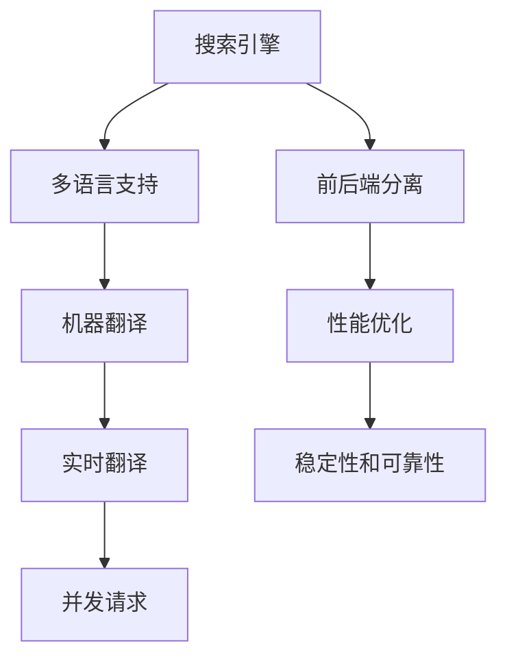

                 

# 搜索引擎的多语言实时翻译功能

## 1. 背景介绍

在互联网全球化的今天，跨语言交流变得愈发频繁。搜索引擎作为全球最大的信息入口，承担着满足用户多语言信息需求的重任。为了提升用户体验，搜索引擎需要实现多语言实时翻译功能，即当用户用一种语言进行搜索时，能够迅速将其翻译成目标语言，提供更加自然和精准的搜索结果。

然而，多语言实时翻译并非易事。一方面，由于语言之间的语法、词汇差异较大，传统的机器翻译算法很难直接适用于多语言文本的实时翻译。另一方面，实时翻译需要处理大量的并发请求，对系统的性能和稳定性提出了高要求。

## 2. 核心概念与联系

### 2.1 核心概念概述

为更好地理解搜索引擎的多语言实时翻译功能，本节将介绍几个密切相关的核心概念：

- 搜索引擎：搜索引擎指通过爬虫技术抓取网页内容，并为用户提供查询匹配的自动化系统。常见搜索引擎包括Google、Bing、Baidu等。
- 机器翻译：机器翻译指通过计算机自动将一种语言翻译成另一种语言的技术。常用的机器翻译算法包括基于规则、统计、神经网络等。
- 实时翻译：实时翻译指在用户输入或搜索结果页上，即时将文本翻译成目标语言的过程。常见的实时翻译技术包括客户端浏览器渲染、服务器端API接口等。
- 并发请求：由于搜索引擎需要处理海量的用户请求，多语言实时翻译需要能够处理高并发请求，以确保系统的稳定性和响应速度。
- 前后端分离：前后端分离是一种系统架构设计模式，即将前端和后端分离开来，分别独立部署和维护。前后端分离可以提高系统的可扩展性、灵活性和稳定性。
- 多语言支持：多语言支持指搜索引擎需要同时支持多种语言，即用户可以选择任意语言进行搜索和翻译。

这些核心概念之间的逻辑关系可以通过以下Mermaid流程图来展示：



这个流程图展示了一体化多语言实时翻译系统中的关键组件及其相互关系：

1. 搜索引擎作为数据来源，多语言支持作为功能扩展，提供多种语言选择。
2. 机器翻译作为中间件，将用户查询从源语言翻译成目标语言。
3. 实时翻译作为接口层，实现文本翻译的即时显示。
4. 并发请求作为系统挑战，需要优化处理高并发请求，保证系统稳定性。
5. 前后端分离作为架构设计，提高系统的可扩展性和灵活性。
6. 性能优化和稳定性作为技术保障，提升用户体验和系统可靠性。

## 3. 核心算法原理 & 具体操作步骤
### 3.1 算法原理概述

搜索引擎的多语言实时翻译功能主要依赖于以下三个关键算法：

1. **机器翻译算法**：将用户输入的源语言文本翻译为目标语言文本。目前，主流的机器翻译算法包括基于规则的统计机器翻译、基于神经网络的端到端机器翻译等。其中，端到端机器翻译的Transformer模型在现代机器翻译任务中表现最为优异。
2. **实时翻译算法**：将翻译后的目标语言文本实时展示在搜索结果页上，方便用户即时理解搜索结果。常见的实时翻译算法包括浏览器渲染API、WebSockets等。
3. **并发请求处理算法**：处理高并发请求，保证系统的稳定性和响应速度。常用的并发请求处理算法包括负载均衡、缓存、分布式系统等。

### 3.2 算法步骤详解

搜索引擎的多语言实时翻译功能实现大致可分为以下几步：

**Step 1: 准备多语言数据**
- 收集海量的多语言语料数据，如维基百科、新闻、博客等，用于训练机器翻译模型。
- 将语料数据划分为训练集、验证集和测试集，用于模型的训练和评估。

**Step 2: 训练机器翻译模型**
- 选择合适的机器翻译模型架构，如Transformer。
- 在多语言语料数据上训练模型，获取模型参数。
- 使用验证集评估模型性能，调整超参数和模型架构，直至达到最佳效果。

**Step 3: 实现实时翻译API**
- 设计并实现目标语言API接口，如浏览器渲染API、WebSockets等。
- 将训练好的机器翻译模型集成到API接口中，进行目标语言的实时翻译。

**Step 4: 部署多语言实时翻译系统**
- 部署前后端分离的系统架构，前端负责用户界面展示，后端负责处理请求和调用API。
- 采用负载均衡和缓存策略，提高系统的并发处理能力。
- 监控系统性能和稳定性，及时调整系统参数和架构。

**Step 5: 用户测试与优化**
- 邀请用户进行测试，收集反馈意见。
- 根据用户反馈和系统监控数据，持续优化和改进系统。

以上是实现多语言实时翻译功能的完整步骤。在实际应用中，还需结合具体需求，对各个环节进行细致设计。

### 3.3 算法优缺点

搜索引擎的多语言实时翻译功能具有以下优点：
1. **用户友好**：能够即时提供多语言搜索结果，提升用户体验。
2. **跨语言支持**：支持多种语言的搜索和翻译，满足全球用户的需求。
3. **技术先进**：采用Transformer等先进的机器翻译算法，提升翻译质量。
4. **高并发处理**：通过前后端分离和负载均衡技术，提升系统的并发处理能力。

同时，该功能也存在一些局限性：
1. **数据依赖**：多语言实时翻译的效果很大程度上取决于数据的质量和数量，高质量的多语言语料库的获取成本较高。
2. **算法复杂**：端到端的神经网络模型虽然性能优异，但训练和推理过程复杂，需要较强的计算资源和硬件支持。
3. **系统复杂度**：实现高并发、前后端分离的多语言实时翻译系统，系统架构复杂，开发和维护成本较高。
4. **实时性要求**：实时翻译需要在短时间内完成翻译，对系统响应速度和稳定性要求较高。

尽管存在这些局限性，但就目前而言，多语言实时翻译功能已成为搜索引擎不可或缺的一部分，成为提升用户体验的重要手段。未来相关研究的重点在于如何进一步降低系统对数据和算力的依赖，提高翻译质量，同时兼顾系统的稳定性和效率。

### 3.4 算法应用领域

搜索引擎的多语言实时翻译功能已经在多个领域得到应用，例如：

- 电商搜索：支持全球各地用户搜索商品，自动翻译搜索结果页面。
- 新闻资讯：将多语言新闻资讯展示给全球用户，方便阅读和理解。
- 旅游出行：支持多语言搜索旅游目的地和路线，提供多语言导航指引。
- 社交媒体：将全球用户的社交内容即时翻译成目标语言，消除语言障碍。
- 在线教育：支持多语言学习内容搜索和翻译，提供语言文化的学习材料。

除了这些应用场景外，多语言实时翻译功能还在智能家居、智慧医疗、商务沟通等多个领域得到广泛应用，为全球用户提供更加便捷、高效的信息获取和交流手段。

## 4. 数学模型和公式 & 详细讲解 & 举例说明

### 4.1 数学模型构建

本节将使用数学语言对多语言实时翻译的数学模型进行更加严格的刻画。

记用户输入的源语言文本为 $x$，目标语言文本为 $y$。假设机器翻译模型为 $f_{\theta}$，其中 $\theta$ 为模型参数。在训练阶段，目标为最小化交叉熵损失函数：

$$
\mathcal{L}(\theta) = -\frac{1}{N} \sum_{i=1}^N \log f_{\theta}(x_i) y_i
$$

在推理阶段，目标为最大化目标语言的似然概率 $p(y|x)$，即：

$$
y^* = \mathop{\arg\max}_{y} p(y|x) = \mathop{\arg\max}_{y} f_{\theta}(x) y
$$

其中，$f_{\theta}(x)$ 表示模型 $f_{\theta}$ 在输入 $x$ 下的输出，$p(y|x)$ 表示给定 $x$ 下，输出 $y$ 的概率分布。

### 4.2 公式推导过程

以下我们以神经网络机器翻译模型为例，推导交叉熵损失函数及其梯度的计算公式。

假设模型 $f_{\theta}$ 为神经网络，包含编码器和解码器两部分，输入 $x$ 经过编码器得到隐状态 $h$，解码器以 $h$ 为初始状态，逐步生成输出序列 $y$。模型结构如图：

```
  x---->Encoder---->h---->Decoder---->y
```

假设模型输出为 $y$ 的概率分布，即：

$$
p(y|x) = \frac{\exp \sum_{i=1}^T \log f_{\theta}(x, y_i)}{\sum_{y' \in \mathcal{V}} \exp \sum_{i=1}^T \log f_{\theta}(x, y_i')}
$$

其中 $\mathcal{V}$ 表示所有可能的输出序列，$T$ 表示序列长度。则交叉熵损失函数为：

$$
\mathcal{L}(\theta) = -\frac{1}{N} \sum_{i=1}^N \log p(y_i|x_i)
$$

将上述公式带入，得：

$$
\mathcal{L}(\theta) = -\frac{1}{N} \sum_{i=1}^N \log \frac{\exp \sum_{i=1}^T \log f_{\theta}(x_i, y_i)}{\sum_{y' \in \mathcal{V}} \exp \sum_{i=1}^T \log f_{\theta}(x_i, y_i')}
$$

对模型参数 $\theta$ 的梯度为：

$$
\frac{\partial \mathcal{L}(\theta)}{\partial \theta} = -\frac{1}{N} \sum_{i=1}^N \frac{\partial}{\partial \theta} \log \frac{\exp \sum_{i=1}^T \log f_{\theta}(x_i, y_i)}{\sum_{y' \in \mathcal{V}} \exp \sum_{i=1}^T \log f_{\theta}(x_i, y_i')}
$$

通过反向传播算法，可以高效计算上述梯度，并更新模型参数。

### 4.3 案例分析与讲解

**案例一：基于Transformer的机器翻译模型**

Transformer模型是目前最先进的神经网络机器翻译模型之一，其结构如图：

```
  x---->Encoder---->h---->Decoder---->y
```

其中，编码器由多个自注意力层和前馈神经网络组成，解码器由多个自注意力层和多头注意力机制组成。Transformer模型中的注意力机制可以捕捉输入序列和输出序列之间的依赖关系，从而实现更好的翻译效果。

在训练时，我们通常使用反向传播算法更新模型参数，过程如下：

1. 前向传播：将输入 $x$ 输入编码器，得到隐状态 $h$。
2. 解码器前向传播：以 $h$ 为初始状态，逐步生成输出序列 $y$。
3. 损失计算：计算交叉熵损失函数 $\mathcal{L}(\theta)$。
4. 反向传播：计算梯度 $\frac{\partial \mathcal{L}(\theta)}{\partial \theta}$。
5. 更新参数：根据梯度更新模型参数 $\theta$。

**案例二：实时翻译API**

实时翻译API的实现可以分为两个部分：前端和后端。

前端使用JavaScript代码实现，主要负责用户界面展示和API调用。用户输入源语言文本后，前端将文本数据传递给后端API，进行实时翻译。

后端API使用Python代码实现，主要负责模型调用和API接口的实现。后端API调用训练好的Transformer模型，将源语言文本翻译为目标语言文本，并将结果返回给前端。

前端和后端通过HTTP协议进行通信，前端发送请求，后端返回翻译结果。前端将翻译结果展示给用户，完成实时翻译功能。

## 5. 项目实践：代码实例和详细解释说明
### 5.1 开发环境搭建

在进行多语言实时翻译功能的项目实践前，我们需要准备好开发环境。以下是使用Python进行Flask开发的环境配置流程：

1. 安装Anaconda：从官网下载并安装Anaconda，用于创建独立的Python环境。

2. 创建并激活虚拟环境：
```bash
conda create -n flask-env python=3.8 
conda activate flask-env
```

3. 安装Flask：
```bash
pip install flask
```

4. 安装其他依赖库：
```bash
pip install numpy pandas scikit-learn nltk flask-cors
```

5. 安装Transformer模型库：
```bash
pip install transformers
```

6. 安装API调用库：
```bash
pip install requests
```

完成上述步骤后，即可在`flask-env`环境中开始多语言实时翻译功能的开发。

### 5.2 源代码详细实现

下面以一个简单的多语言实时翻译API为例，给出使用Flask和Transformer模型进行开发的PyTorch代码实现。

首先，定义Transformer模型类：

```python
from transformers import EncoderModel, EncoderTokenizer

class TransformerModel:
    def __init__(self, model_name, device='cpu'):
        self.model_name = model_name
        self.device = device
        self.encoder_model = EncoderModel.from_pretrained(model_name).to(device)
        self.encoder_tokenizer = EncoderTokenizer.from_pretrained(model_name)
    
    def translate(self, source, target):
        source_tokens = self.encoder_tokenizer.encode(source, return_tensors='pt').to(self.device)
        target_tokens = self.encoder_tokenizer.encode(target, return_tensors='pt').to(self.device)
        outputs = self.encoder_model.generate(source_tokens, max_length=50, num_return_sequences=1, no_repeat_ngram_size=2)
        return self.encoder_tokenizer.decode(outputs[0], skip_special_tokens=True)
```

然后，定义Flask应用：

```python
from flask import Flask, request, jsonify
import torch
import numpy as np

app = Flask(__name__)

@app.route('/translate', methods=['POST'])
def translate():
    data = request.get_json()
    source = data['source']
    target = data['target']
    device = torch.device('cuda' if torch.cuda.is_available() else 'cpu')
    
    model = TransformerModel('bert-base-multilingual-uncased', device)
    translated = model.translate(source, target)
    
    return jsonify({'translation': translated})
```

最后，启动Flask应用：

```python
if __name__ == '__main__':
    app.run(host='0.0.0.0', port=5000)
```

以上就是使用Flask和Transformer模型进行多语言实时翻译的完整代码实现。可以看到，借助Python的Flask框架，我们能够方便地实现API接口，调用预训练的Transformer模型进行实时翻译。

### 5.3 代码解读与分析

让我们再详细解读一下关键代码的实现细节：

**TransformerModel类**：
- `__init__`方法：初始化Transformer模型，包括模型名称和设备。
- `translate`方法：输入源语言文本和目标语言文本，调用Transformer模型进行翻译。

**Flask应用**：
- `__name__`：确保Flask应用在主函数中运行。
- `run`方法：启动Flask应用，指定监听地址和端口。

**代码实现流程**：
1. 用户通过HTTP请求将源语言文本和目标语言文本发送到API。
2. Flask应用接收到请求后，调用`translate`方法进行翻译。
3. Transformer模型将源语言文本进行编码，解码目标语言文本，生成翻译结果。
4. Flask应用将翻译结果返回给客户端，完成API接口的响应。

可以看到，Flask框架提供了便捷的API接口开发功能，使得多语言实时翻译功能的实现更加简单高效。

## 6. 实际应用场景
### 6.1 搜索电商
电商搜索是搜索引擎多语言实时翻译功能的重要应用场景之一。例如，Amazon和Alibaba等电商平台已经在其网站上集成了多语言实时翻译功能，方便全球用户搜索和购买商品。

在技术实现上，电商平台通过在前端和后端分别部署多语言实时翻译API，实时获取用户的搜索结果，并将其翻译成目标语言。同时，电商平台还提供了多语言搜索建议、多语言商品详情等丰富功能，满足全球用户的需求。

### 6.2 新闻资讯
全球的新闻资讯通常需要以多种语言呈现，以吸引不同语言的用户。例如，BBC和新华网等新闻网站已经在其网站上集成了多语言实时翻译功能，方便用户阅读和理解不同语言的新闻资讯。

在技术实现上，新闻网站通过在前端和后端分别部署多语言实时翻译API，实时获取用户的新闻资讯，并将其翻译成目标语言。同时，新闻网站还提供了多种语言的新闻分类、搜索和订阅功能，使用户能够方便地获取所需信息。

### 6.3 在线教育
在线教育平台需要支持多语言教学和学习，以吸引全球用户。例如，Coursera和Udemy等在线教育平台已经在其网站上集成了多语言实时翻译功能，方便用户进行课程搜索和学习。

在技术实现上，在线教育平台通过在前端和后端分别部署多语言实时翻译API，实时获取用户的课程信息，并将其翻译成目标语言。同时，在线教育平台还提供了多语言课程推荐、学习进度跟踪等功能，提升用户的在线学习体验。

### 6.4 未来应用展望
随着人工智能技术的不断进步，搜索引擎的多语言实时翻译功能将在更多领域得到应用，为全球用户提供更加便捷、高效的信息获取和交流手段。

在智慧医疗领域，多语言实时翻译功能可以帮助医生和患者跨越语言障碍，进行远程诊疗和咨询，提升医疗服务的普惠性。

在智能家居领域，多语言实时翻译功能可以为全球用户提供智能家居设备的语言支持，使用户能够更方便地控制和管理智能设备。

在智慧旅游领域，多语言实时翻译功能可以帮助游客进行跨语言沟通和导航，提升旅游体验。

此外，在社交媒体、在线游戏、商务沟通等多个领域，多语言实时翻译功能也将得到广泛应用，为全球用户提供更加便捷、高效的信息获取和交流手段。

## 7. 工具和资源推荐
### 7.1 学习资源推荐

为了帮助开发者系统掌握多语言实时翻译的理论基础和实践技巧，这里推荐一些优质的学习资源：

1. 《自然语言处理综论》书籍：全面介绍自然语言处理的基本概念和经典模型，适合初学者和进阶读者。
2. CS224N《深度学习自然语言处理》课程：斯坦福大学开设的NLP明星课程，涵盖自然语言处理的基本概念、经典模型和应用。
3. 《Transformers: A Tutorial》博客：Google AI博客系列，详细介绍Transformer模型及其在机器翻译中的应用。
4. 《NLP实战》书籍：提供丰富的NLP实战案例和代码，帮助读者掌握NLP技术的实际应用。
5. Kaggle多语言翻译竞赛：Kaggle平台上的多语言翻译竞赛，提供大量多语言数据集和评估指标，帮助读者提升多语言翻译能力。

通过对这些资源的学习实践，相信你一定能够快速掌握多语言实时翻译的精髓，并用于解决实际的NLP问题。

### 7.2 开发工具推荐

高效的开发离不开优秀的工具支持。以下是几款用于多语言实时翻译开发的常用工具：

1. Python：Python是目前最流行的编程语言之一，拥有丰富的第三方库和工具，适合多语言翻译系统的开发。
2. Flask：Flask是一个轻量级的Web框架，适合开发简单高效的API接口。
3. TensorFlow和PyTorch：TensorFlow和PyTorch是目前最流行的深度学习框架，提供了丰富的模型和工具，适合机器翻译模型的开发。
4. NLTK和SpaCy：NLTK和SpaCy是常用的NLP工具库，提供了丰富的文本处理功能，适合自然语言处理任务的开发。
5. Transformers库：HuggingFace开发的NLP工具库，集成了多种预训练语言模型，支持多语言翻译任务的开发。

合理利用这些工具，可以显著提升多语言实时翻译任务的开发效率，加快创新迭代的步伐。

### 7.3 相关论文推荐

多语言实时翻译技术的发展源于学界的持续研究。以下是几篇奠基性的相关论文，推荐阅读：

1. "Google's Neural Machine Translation System"：Google发布的高效神经机器翻译系统，奠定了端到端机器翻译算法的基础。
2. "Attention is All You Need"：Transformer模型原论文，提出自注意力机制，使得神经网络模型能够处理长序列，提升机器翻译效果。
3. "Improving Neural Machine Translation Using Byte Pair Encoding"：提出子词编码技术，解决大规模机器翻译中的问题。
4. "A Neural Network for Machine Translation"：统计机器翻译的经典算法，介绍神经网络模型在机器翻译中的应用。
5. "Convolutional Sequence to Sequence Learning"：提出卷积神经网络在机器翻译中的应用，提升翻译质量。

这些论文代表了大语言模型微调技术的发展脉络。通过学习这些前沿成果，可以帮助研究者把握学科前进方向，激发更多的创新灵感。

## 8. 总结：未来发展趋势与挑战
### 8.1 总结

本文对搜索引擎的多语言实时翻译功能进行了全面系统的介绍。首先阐述了多语言实时翻译的功能背景和重要意义，明确了其在提升用户体验、支持多语言交流方面的价值。其次，从原理到实践，详细讲解了多语言实时翻译的算法原理和操作步骤，给出了多语言实时翻译的完整代码实例。同时，本文还广泛探讨了多语言实时翻译功能在电商搜索、新闻资讯、在线教育等多个领域的应用前景，展示了其在推动全球信息交流方面的巨大潜力。此外，本文精选了多语言实时翻译的相关学习资源，力求为读者提供全方位的技术指引。

通过本文的系统梳理，可以看到，搜索引擎的多语言实时翻译功能已经成为了提升用户体验的重要手段，正在推动全球信息交流的深入发展。未来，伴随人工智能技术的不断进步，多语言实时翻译功能将更加高效、便捷，为全球用户提供更加智能、便捷的信息获取和交流手段。

### 8.2 未来发展趋势

展望未来，多语言实时翻译功能将呈现以下几个发展趋势：

1. **模型性能提升**：随着预训练语言模型的不断发展，多语言翻译模型的性能将持续提升，翻译质量将更加准确、自然。
2. **数据依赖降低**：通过更好的数据采样和预处理方法，多语言翻译模型将更加依赖于数据，而不再过度依赖大规模标注数据。
3. **技术融合**：多语言翻译将与语音识别、文本生成等技术深度融合，形成更加综合的多模态信息处理系统。
4. **端到端翻译**：随着端到端机器翻译技术的不断进步，多语言翻译将更加高效、便捷，减少用户等待时间。
5. **实时性增强**：通过优化系统架构和算法，多语言实时翻译的响应速度将进一步提升，满足用户即时翻译的需求。
6. **服务化优化**：通过微服务和容器化技术，多语言翻译系统将更加灵活、可扩展，提升系统稳定性。

这些趋势凸显了多语言实时翻译技术的广阔前景。这些方向的探索发展，必将进一步提升多语言翻译的性能和用户体验，为全球信息交流带来更加智能、便捷的服务。

### 8.3 面临的挑战

尽管多语言实时翻译功能已经取得了显著成效，但在迈向更加智能化、普适化应用的过程中，它仍面临着诸多挑战：

1. **数据获取难度**：高质量多语言语料库的获取成本较高，大规模数据集的准备和标注工作复杂。
2. **模型复杂度**：端到端的神经网络模型虽然性能优异，但训练和推理过程复杂，需要较强的计算资源和硬件支持。
3. **实时性要求**：实时翻译需要在短时间内完成翻译，对系统响应速度和稳定性要求较高。
4. **系统复杂度**：实现高并发、前后端分离的多语言实时翻译系统，系统架构复杂，开发和维护成本较高。
5. **用户多样性**：全球用户的多样性使得翻译模型需要兼顾多种语言和文化，增加了翻译模型的复杂性。

尽管存在这些挑战，但就目前而言，多语言实时翻译功能已成为搜索引擎不可或缺的一部分，成为提升用户体验的重要手段。未来相关研究的重点在于如何进一步降低系统对数据和算力的依赖，提高翻译质量，同时兼顾系统的稳定性和效率。

### 8.4 研究展望

面对多语言实时翻译功能所面临的种种挑战，未来的研究需要在以下几个方面寻求新的突破：

1. **无监督和半监督翻译**：摆脱对大规模标注数据的依赖，利用自监督学习、主动学习等无监督和半监督范式，最大限度利用非结构化数据，实现更加灵活高效的翻译。
2. **端到端深度学习**：开发更加端到端的深度学习模型，减少人工干预，提升翻译质量和效率。
3. **多模态融合**：将视觉、语音等多模态信息与文本信息进行深度融合，提升翻译系统的综合处理能力。
4. **模型压缩和优化**：通过模型压缩、剪枝、量化等技术，减少计算资源消耗，提升翻译系统的实时性。
5. **分布式系统设计**：采用分布式系统设计，提高系统的可扩展性和稳定性，满足高并发需求。
6. **个性化翻译**：根据用户偏好和语境，提供个性化的翻译服务，提升用户体验。

这些研究方向的探索，必将引领多语言实时翻译技术迈向更高的台阶，为全球用户提供更加智能、便捷的多语言翻译服务。面向未来，多语言实时翻译技术还需要与其他人工智能技术进行更深入的融合，如知识表示、因果推理、强化学习等，多路径协同发力，共同推动多语言翻译系统的进步。只有勇于创新、敢于突破，才能不断拓展多语言翻译的边界，让智能技术更好地造福全球用户。

## 9. 附录：常见问题与解答

**Q1：多语言实时翻译的实现过程中，有哪些关键的技术难点？**

A: 多语言实时翻译的实现过程中，主要面临以下几个关键技术难点：

1. **数据获取和预处理**：高质量多语言语料库的获取成本较高，大规模数据集的准备和标注工作复杂。
2. **模型复杂度**：端到端的神经网络模型虽然性能优异，但训练和推理过程复杂，需要较强的计算资源和硬件支持。
3. **实时性要求**：实时翻译需要在短时间内完成翻译，对系统响应速度和稳定性要求较高。
4. **系统复杂度**：实现高并发、前后端分离的多语言实时翻译系统，系统架构复杂，开发和维护成本较高。
5. **用户多样性**：全球用户的多样性使得翻译模型需要兼顾多种语言和文化，增加了翻译模型的复杂性。

**Q2：多语言实时翻译的评价指标有哪些？**

A: 多语言实时翻译的评价指标主要包括以下几个方面：

1. **翻译质量**：包括翻译的准确性、流畅性和自然度，通常使用BLEU、ROUGE等自动评估指标。
2. **系统响应时间**：系统从接收到请求到返回结果的时间，通常使用RT（Response Time）指标。
3. **系统稳定性**：系统在高并发请求下的稳定性和可靠性，通常使用系统错误率、响应时间波动等指标。
4. **用户满意度**：用户对翻译结果的满意度，通常通过用户调查和反馈收集。
5. **覆盖范围**：翻译模型支持的语言和文化覆盖范围，通常使用语言多样性指标。

**Q3：多语言实时翻译的系统架构设计有哪些建议？**

A: 多语言实时翻译的系统架构设计可以从以下几个方面进行优化：

1. **前后端分离**：前端负责用户界面展示和API调用，后端负责模型调用和数据处理，提升系统的灵活性和可扩展性。
2. **负载均衡**：采用负载均衡技术，将请求分散到多台服务器上，提升系统的并发处理能力。
3. **缓存策略**：采用缓存技术，减少重复请求，提升系统响应速度。
4. **分布式系统**：采用分布式系统架构，提升系统的稳定性和可靠性。
5. **监控告警**：实时采集系统指标，设置异常告警阈值，确保系统稳定运行。

这些建议可以帮助开发者设计出更加高效、可靠的多语言实时翻译系统，提升用户体验和系统性能。

**Q4：多语言实时翻译的优化有哪些策略？**

A: 多语言实时翻译的优化策略可以从以下几个方面进行：

1. **数据优化**：优化数据采样和预处理方法，减少数据噪声，提升翻译质量。
2. **模型优化**：优化模型架构和超参数，提升模型性能和实时性。
3. **算法优化**：优化算法和模型参数更新策略，提升系统响应速度和稳定性。
4. **硬件优化**：优化硬件配置和资源利用率，减少计算资源消耗，提升系统性能。
5. **用户反馈**：收集用户反馈和行为数据，优化翻译模型和系统设计，提升用户体验。

这些优化策略可以帮助开发者不断提升多语言实时翻译系统的性能和用户体验，实现更高效、可靠的系统运行。

---

作者：禅与计算机程序设计艺术 / Zen and the Art of Computer Programming

