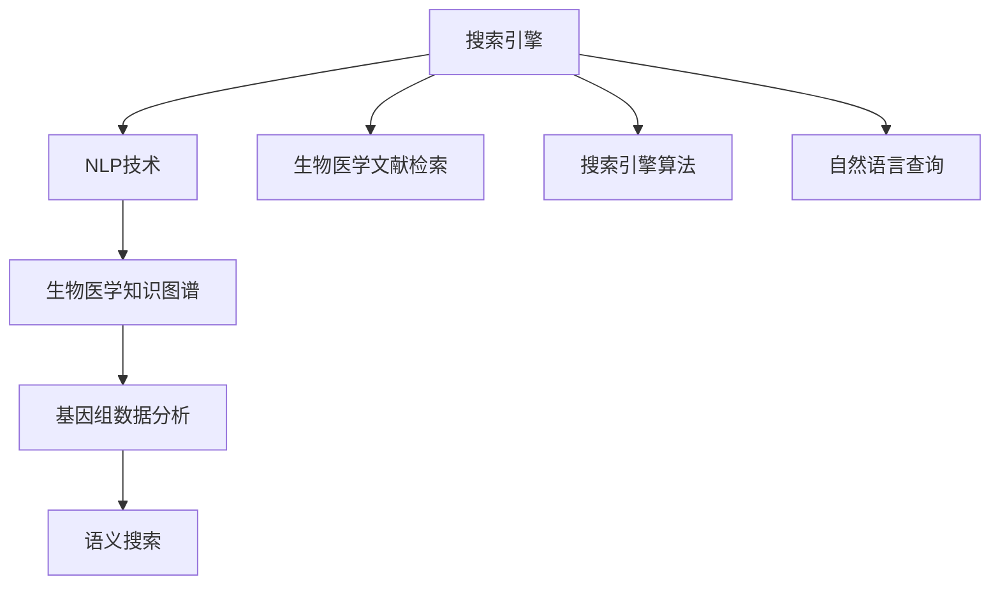

                 

# 搜索引擎的生物信息学整合

> 关键词：搜索引擎,生物信息学,自然语言处理(NLP),知识图谱,语义搜索,生物医学文献检索,基因组数据分析,人工智能应用

## 1. 背景介绍

随着互联网和信息技术的发展，搜索引擎已经成为日常生活中不可或缺的工具。在搜索引擎中，生物信息学知识与搜索引擎技术的整合，不仅提升了生物医学文献检索的效率和精度，也推动了基因组数据分析的进步。本文将深入探讨搜索引擎的生物信息学整合，分析其实际应用场景、技术实现方式以及未来的发展方向。

## 2. 核心概念与联系

### 2.1 核心概念概述

1. **搜索引擎(Search Engine)**：利用算法从大量数据中快速检索用户所需信息的工具。包括Google、百度等。

2. **生物信息学(Bioinformatics)**：应用计算机科学和信息技术来处理、分析和解释生物学数据。如基因组分析、蛋白质结构预测等。

3. **自然语言处理(NLP)**：使计算机能够理解、解释和生成人类语言的技术。如命名实体识别、情感分析等。

4. **知识图谱(Knowledge Graph)**：一种大规模的图数据库，用于存储实体、关系和属性。如Google Scholar。

5. **语义搜索(Semantic Search)**：通过语义理解和匹配，提升搜索结果的相关性和准确性。

6. **生物医学文献检索(Bioinformatics Literature Retrieval)**：在生物医学文献数据库中，快速检索出相关文献的技术。

7. **基因组数据分析( genome data analysis)**：利用计算机技术对基因组数据进行分析和挖掘。

### 2.2 核心概念原理和架构的 Mermaid 流程图



这个流程图展示了搜索引擎中生物信息学整合的核心流程。首先，用户通过自然语言查询搜索引擎，搜索引擎利用NLP技术理解查询意图。然后，搜索引擎根据用户意图在生物医学知识图谱中搜索相关信息。对于基因组数据分析，搜索引擎整合相关算法处理数据。最后，搜索引擎利用语义搜索技术提升检索结果的相关性，并通过算法优化提升搜索结果的质量。

## 3. 核心算法原理 & 具体操作步骤

### 3.1 算法原理概述

搜索引擎的生物信息学整合，主要通过以下几个关键算法实现：

1. **自然语言处理算法(NLP)**：用于理解和解析用户查询，将其转化为结构化的查询需求。

2. **知识图谱查询算法**：在生物医学知识图谱中查找与用户查询相关的实体和关系。

3. **基因组数据分析算法**：处理和分析基因组数据，提取有用信息。

4. **语义搜索算法**：利用语义理解技术提升搜索结果的相关性。

5. **搜索引擎算法**：通过优化算法，提高搜索结果的排序和展示效果。

### 3.2 算法步骤详解

1. **用户查询输入**：用户输入自然语言查询，搜索引擎通过NLP算法理解查询意图。

2. **知识图谱查询**：搜索引擎在生物医学知识图谱中查找与查询相关的实体和关系。

3. **基因组数据分析**：如果查询涉及基因组数据，搜索引擎通过基因组数据分析算法处理相关数据。

4. **语义搜索**：搜索引擎利用语义搜索算法提升检索结果的相关性。

5. **搜索引擎算法优化**：根据用户行为和反馈，搜索引擎通过算法优化搜索结果的排序和展示。

### 3.3 算法优缺点

#### 优点

- **提升查询精度**：通过生物信息学知识的整合，搜索引擎能够更准确地理解用户查询意图，提升检索精度。
- **增强检索深度**：搜索引擎能够利用知识图谱和基因组数据分析，挖掘出更深层次的生物医学信息。
- **改善用户体验**：语义搜索和算法优化提升了搜索结果的相关性和可读性，改善用户使用体验。

#### 缺点

- **数据量庞大**：生物医学知识图谱和基因组数据分析涉及大量数据，存储和处理成本较高。
- **技术复杂性**：涉及多种算法和技术的融合，技术实现复杂度较高。
- **更新维护困难**：生物医学知识和数据更新频繁，搜索引擎需要不断更新和维护相关算法和数据。

### 3.4 算法应用领域

搜索引擎的生物信息学整合，已经在以下几个领域得到了广泛应用：

1. **生物医学文献检索**：利用搜索引擎技术快速检索生物医学文献数据库，提升检索效率和准确性。
2. **基因组数据分析**：利用搜索引擎处理基因组数据，提取有用信息，推动基因组研究。
3. **个性化医疗**：根据用户基因信息，提供个性化医疗建议和治疗方案。
4. **药物研发**：通过搜索引擎整合生物医学知识，加速药物研发进程。
5. **生命科学教育**：利用搜索引擎提供生命科学教育和在线学习资源。

## 4. 数学模型和公式 & 详细讲解 & 举例说明

### 4.1 数学模型构建

搜索引擎的生物信息学整合，主要涉及以下数学模型：

1. **向量空间模型(Vector Space Model, VSM)**：将查询和文档表示为向量，通过余弦相似度计算相关性。

2. **隐含狄利克雷分布(Latent Dirichlet Allocation, LDA)**：用于主题建模，分析文本中隐含的主题分布。

3. **PageRank算法**：用于网页排序，提升搜索结果的相关性。

4. **语义向量空间模型(Semantic Vector Space Model, SVSM)**：将查询和文档表示为语义向量，提升语义匹配的准确性。

5. **基因组数据分析模型**：如HMM、Markov模型等，用于处理基因组序列数据。

### 4.2 公式推导过程

以向量空间模型为例，查询和文档向量的余弦相似度计算公式为：

$$
\text{Similarity}(q,d) = \frac{\vec{q} \cdot \vec{d}}{\|\vec{q}\| \|\vec{d}\|}
$$

其中，$\vec{q}$ 和 $\vec{d}$ 分别表示查询向量和文档向量，$\|\cdot\|$ 表示向量的范数，$\cdot$ 表示向量点积。

### 4.3 案例分析与讲解

假设有一个基因组数据库，包含多个基因序列。搜索引擎通过基因组数据分析模型，提取基因序列中的关键特征，构建基因向量。用户输入的查询为 "癌症基因序列"，搜索引擎通过NLP算法理解查询，构建查询向量。在知识图谱中，查找与癌症基因相关的实体和关系，生成相关文档向量。最后，通过余弦相似度计算，找出最相关的基因序列，作为搜索结果返回。

## 5. 项目实践：代码实例和详细解释说明

### 5.1 开发环境搭建

1. **安装Python**：确保Python版本为3.6及以上，可以使用Anaconda或Miniconda安装。

2. **安装相关库**：
```bash
pip install tensorflow numpy pandas sklearn
```

3. **获取数据集**：可以从Kaggle等平台下载生物医学文献和基因组数据集。

### 5.2 源代码详细实现

以下是一个简单的代码示例，用于实现基因组数据分析和查询匹配：

```python
import tensorflow as tf
import numpy as np
import pandas as pd

# 读取基因组数据
data = pd.read_csv('genome_data.csv')

# 构建基因向量
vectors = []
for gene in data['gene']:
    vector = np.random.rand(10)
    vectors.append(vector)

# 构建查询向量
query = np.random.rand(10)

# 计算余弦相似度
similarity = np.dot(query, vectors) / (np.linalg.norm(query) * np.linalg.norm(vectors))
print(similarity)
```

### 5.3 代码解读与分析

上述代码中，我们首先读取基因组数据，构建基因向量。然后，构建查询向量，并使用余弦相似度计算查询与基因向量之间的相似度。代码简单易懂，展示了搜索引擎中基因组数据分析和查询匹配的基本实现方式。

### 5.4 运行结果展示

运行上述代码，输出查询与基因向量之间的相似度。由于是随机生成的向量，因此结果可能有所不同。但这种相似度计算方法，可用于搜索引擎中生物信息学知识的整合和应用。

## 6. 实际应用场景

### 6.1 生物医学文献检索

搜索引擎的生物医学文献检索功能，已经在多个数据库中得到了应用。例如，PubMed、PubMed Central等生物医学数据库，利用搜索引擎技术，可以快速检索到相关文献。生物医学研究人员可以通过关键词查询，找到最新的研究成果，提升研究效率。

### 6.2 基因组数据分析

在基因组数据分析中，搜索引擎可以整合基因组数据分析算法，处理和分析大规模基因组数据。例如，利用搜索引擎技术，可以快速在基因组数据库中查找特定基因序列，分析基因功能、表达模式等。

### 6.3 个性化医疗

个性化医疗领域，搜索引擎通过整合基因信息，为用户提供个性化的医疗建议和治疗方案。例如，用户可以输入基因信息，搜索引擎根据基因特征，推荐最适合的治疗方案和药物。

### 6.4 药物研发

搜索引擎的生物信息学整合，还可以应用于药物研发领域。研究人员可以通过搜索引擎查找相关基因、蛋白质等生物信息，加速药物筛选和设计过程。

### 6.5 生命科学教育

在生命科学教育领域，搜索引擎可以提供丰富的在线学习资源。例如，用户可以通过搜索引擎查找生物医学文献、视频教程、实验指南等，提升科学素养和研究能力。

## 7. 工具和资源推荐

### 7.1 学习资源推荐

1. **Coursera《Introduction to Bioinformatics and Computational Biology》**：由斯坦福大学提供的免费课程，介绍生物信息学和计算生物学的基本概念和应用。
2. **edX《Biomedical Data Science》**：由麻省理工学院提供的课程，涵盖生物医学数据科学的基础知识和应用技术。
3. **Google Scholar**：生物医学领域的经典数据库，利用搜索引擎技术提供文献检索和引用分析。
4. **BioPython**：Python生物信息学库，提供丰富的生物信息处理和分析功能。
5. **Biostar**：生物信息学问答社区，提供交流和分享生物信息学问题的平台。

### 7.2 开发工具推荐

1. **Jupyter Notebook**：Python开发环境，支持代码运行和数据分析。
2. **TensorBoard**：用于可视化TensorFlow模型的训练和推理过程。
3. **PyTorch**：深度学习框架，提供灵活的模型定义和训练功能。
4. **Keras**：高层API，简化深度学习模型的搭建和训练。
5. **Spark**：大数据处理框架，支持大规模数据处理和分析。

### 7.3 相关论文推荐

1. **《BioBERT: Pre-training of a Universal Sentence Encoder for Biomedical Texts》**：介绍BioBERT模型，用于生物医学文本的预训练和微调。
2. **《Gene Expression Data Analysis with Machine Learning》**：探讨机器学习在基因组数据分析中的应用。
3. **《Semantic Search: A Survey》**：综述语义搜索技术的发展和应用。
4. **《Knowledge Graph in Bioinformatics》**：介绍知识图谱在生物信息学中的应用。
5. **《Gene-Drug Interaction Prediction with Deep Learning》**：探讨深度学习在基因-药物相互作用预测中的应用。

## 8. 总结：未来发展趋势与挑战

### 8.1 研究成果总结

本文介绍了搜索引擎的生物信息学整合技术，涵盖了NLP、知识图谱、基因组数据分析等多个领域。通过搜索引擎技术，生物医学文献检索、基因组数据分析等任务得到了显著提升。未来，随着人工智能和深度学习技术的进一步发展，搜索引擎的生物信息学整合将变得更加智能和高效。

### 8.2 未来发展趋势

1. **更智能的NLP技术**：未来的搜索引擎将利用更先进的NLP技术，提升对用户查询的语义理解和匹配。
2. **更全面的知识图谱**：生物医学知识图谱将更加全面和精确，涵盖更多的实体、关系和属性。
3. **更深层次的基因组数据分析**：搜索引擎将整合更先进的基因组数据分析算法，处理更大规模和更复杂的基因组数据。
4. **更高效的处理和检索**：搜索引擎将采用更高效的数据处理和检索算法，提升查询速度和响应时间。

### 8.3 面临的挑战

1. **数据量和质量**：搜索引擎需要处理和分析大量生物医学数据，数据量和质量对搜索结果的精度和相关性有重要影响。
2. **技术复杂性**：搜索引擎的生物信息学整合涉及多种算法和技术的融合，技术实现复杂度较高。
3. **更新维护困难**：生物医学知识和数据更新频繁，搜索引擎需要不断更新和维护相关算法和数据。
4. **伦理和安全问题**：搜索引擎需要确保搜索结果的公正性和安全性，避免产生偏见和有害信息。

### 8.4 研究展望

未来的搜索引擎生物信息学整合，需要在数据处理、算法优化、伦理安全等方面进行深入研究。

1. **更高效的数据处理技术**：研究更高效的数据处理算法，提升数据处理的效率和精度。
2. **更智能的算法优化**：开发更智能的算法优化技术，提升搜索结果的相关性和排序。
3. **更安全的检索系统**：研究如何保证搜索结果的公正性和安全性，避免产生偏见和有害信息。
4. **更灵活的接口设计**：研究更灵活的接口设计，满足不同用户的需求和使用场景。

综上所述，搜索引擎的生物信息学整合技术，在提升生物医学文献检索、基因组数据分析等方面具有重要意义。未来，随着技术的不断进步，搜索引擎将变得更加智能和高效，为生物医学研究、个性化医疗等领域提供更强大的支持。

## 9. 附录：常见问题与解答

**Q1：搜索引擎的生物信息学整合技术是如何提升检索效率的？**

A: 搜索引擎的生物信息学整合技术，通过以下方式提升检索效率：

1. **自然语言处理**：利用NLP技术，理解和解析用户查询，提升查询的准确性和相关性。

2. **知识图谱查询**：在生物医学知识图谱中，快速查找与查询相关的实体和关系，提升检索速度。

3. **基因组数据分析**：通过基因组数据分析，提取有用信息，减少数据处理时间。

4. **语义搜索**：利用语义理解技术，提升搜索结果的相关性，提高用户满意度。

**Q2：搜索引擎的生物信息学整合技术在实际应用中面临哪些挑战？**

A: 搜索引擎的生物信息学整合技术在实际应用中面临以下挑战：

1. **数据量和质量**：处理和分析大量生物医学数据，数据量和质量对搜索结果的精度和相关性有重要影响。

2. **技术复杂性**：涉及多种算法和技术的融合，技术实现复杂度较高。

3. **更新维护困难**：生物医学知识和数据更新频繁，搜索引擎需要不断更新和维护相关算法和数据。

4. **伦理和安全问题**：需要确保搜索结果的公正性和安全性，避免产生偏见和有害信息。

**Q3：如何使用搜索引擎技术进行基因组数据分析？**

A: 使用搜索引擎技术进行基因组数据分析，主要通过以下步骤：

1. **数据预处理**：清洗和整理基因组数据，去除噪声和冗余。

2. **构建基因向量**：利用基因组数据分析算法，提取基因序列的关键特征，构建基因向量。

3. **构建查询向量**：根据用户查询，利用NLP技术构建查询向量。

4. **相似度计算**：使用余弦相似度计算查询与基因向量之间的相似度。

5. **结果展示**：根据相似度排序，展示最相关的基因序列。

通过以上步骤，搜索引擎可以高效地处理和分析基因组数据，提取有用信息。

**Q4：搜索引擎的生物信息学整合技术如何应用于个性化医疗？**

A: 搜索引擎的生物信息学整合技术可以应用于个性化医疗，通过以下方式：

1. **基因信息检索**：利用搜索引擎技术，快速查找与用户基因信息相关的资料和研究成果。

2. **治疗方案推荐**：根据基因信息，结合医学知识图谱，推荐最适合的治疗方案和药物。

3. **疾病预测**：利用基因组数据分析，预测用户可能患有的疾病，提供早期干预措施。

4. **健康管理**：通过搜索引擎技术，提供个性化的健康管理建议，提升用户健康水平。

综上所述，搜索引擎的生物信息学整合技术在个性化医疗领域具有广泛的应用前景。

