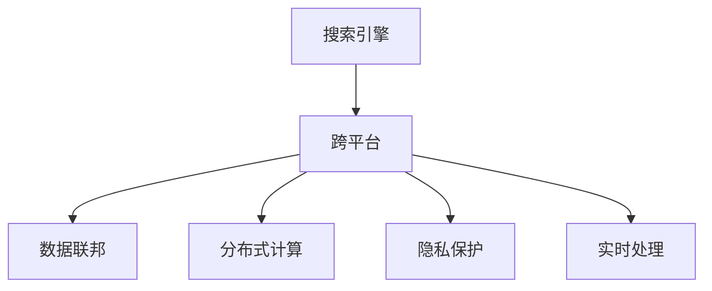

                 

# 搜索引擎的跨平台整合：PC、移动和IoT设备

## 1. 背景介绍

### 1.1 问题由来
随着信息技术的飞速发展，互联网已经成为全球用户获取信息和服务的核心渠道。搜索引擎作为信息检索的利器，其重要性不言而喻。传统上，搜索引擎的部署主要是针对PC端的Web浏览器，用户通过输入关键词，搜索引擎返回网页链接或搜索结果。然而，随着智能移动设备和IoT设备的普及，搜索引擎的使用场景越来越多元化，如何实现跨平台无缝整合，满足不同设备用户的信息检索需求，成为搜索引擎技术发展的重要方向。

### 1.2 问题核心关键点
搜索引擎的跨平台整合，旨在将PC、移动、IoT等不同平台上的搜索需求统一到一个搜索引擎系统中，为用户提供一致、高效的检索体验。该问题涉及以下几个核心关键点：

- **跨平台兼容性**：保证搜索引擎在不同平台上的运行环境、用户界面、搜索逻辑等方面的一致性。
- **数据集成与分发**：实现不同平台上的搜索结果数据集成，并实时地将搜索结果分发至各终端设备。
- **用户隐私保护**：在跨平台数据传输过程中，保证用户隐私数据的安全性，防止数据泄露或滥用。
- **系统性能优化**：优化跨平台检索系统的处理效率，提升搜索响应速度和准确性。

### 1.3 问题研究意义
搜索引擎的跨平台整合，对于构建全场景、全方位的信息检索体系，提升用户的信息获取效率，具有重要意义：

- **提升用户体验**：通过跨平台整合，用户在不同设备上都能获得一致的搜索体验，减少设备切换带来的不便。
- **促进数据共享**：实现不同设备间的数据共享和信息同步，提升搜索数据的覆盖范围和质量。
- **推动技术创新**：跨平台技术的应用，有助于推动搜索引擎技术的创新发展，增强其在各领域的适应性和应用范围。
- **强化市场竞争力**：通过跨平台整合，搜索引擎能在更多的设备和平台上提供服务，增强市场竞争力。

## 2. 核心概念与联系

### 2.1 核心概念概述

为更好地理解搜索引擎跨平台整合的技术框架，本节将介绍几个关键概念：

- **搜索引擎(搜索引擎)**：一种基于算法和数据索引的网站搜索工具，帮助用户在互联网中快速找到所需信息。
- **跨平台**：不同平台之间的交互和整合，涵盖PC、移动、IoT等设备，实现信息检索服务的无缝对接。
- **数据联邦**：通过数据联邦技术，实现不同平台之间的数据集成和共享，避免数据孤岛。
- **分布式计算**：利用分布式计算技术，提升跨平台检索系统的处理能力，提升系统性能。
- **隐私保护**：采用加密、匿名化等技术手段，保障用户隐私数据的安全性。
- **实时处理**：采用实时处理技术，保证搜索结果的及时性和相关性。

这些核心概念之间的关系可以通过以下Mermaid流程图来展示：



这个流程图展示了你搜索引擎跨平台整合的核心概念及其之间的关系：

1. 搜索引擎作为核心服务，实现跨平台整合的基础。
2. 数据联邦技术实现不同平台之间的数据集成和共享。
3. 分布式计算技术提升跨平台检索系统的处理能力。
4. 隐私保护技术保障用户隐私数据的安全性。
5. 实时处理技术保证搜索结果的及时性和相关性。

这些概念共同构成了搜索引擎跨平台整合的技术框架，使其能够实现不同平台上的无缝对接和高效检索。

## 3. 核心算法原理 & 具体操作步骤

### 3.1 算法原理概述

搜索引擎的跨平台整合，主要涉及以下几个算法原理：

- **搜索算法**：实现网页检索和排序的算法，如PageRank、BM25等。
- **联邦学习**：一种分布式机器学习算法，通过多台设备联合训练模型，实现模型参数的更新和优化。
- **分布式存储与计算**：利用分布式文件系统和计算集群，实现大规模数据的存储和处理。
- **隐私保护算法**：采用差分隐私、同态加密等技术，保护用户隐私数据。
- **实时处理算法**：采用消息队列、流处理等技术，实现实时数据的处理和传输。

### 3.2 算法步骤详解

搜索引擎的跨平台整合，主要包括以下几个关键步骤：

**Step 1: 数据收集与预处理**
- 从不同平台收集用户搜索请求和相关数据。
- 对数据进行清洗和预处理，如去重、标准化、格式化等。

**Step 2: 联邦学习模型的训练与优化**
- 在PC、移动、IoT等不同设备上，部署联邦学习模型。
- 根据各设备的用户搜索行为，联合训练模型参数。
- 对模型进行优化和调参，提升搜索算法效果。

**Step 3: 数据集成与分发**
- 采用数据联邦技术，实现不同平台之间的数据集成。
- 通过分布式存储和计算技术，高效存储和处理大规模数据。
- 实时将搜索结果分发至各终端设备。

**Step 4: 隐私保护与数据安全**
- 采用差分隐私、同态加密等技术，保护用户隐私数据。
- 实现数据在传输过程中的加密和安全传输。

**Step 5: 系统性能优化**
- 利用分布式计算技术，优化搜索算法的处理速度和效率。
- 采用实时处理技术，保证搜索结果的及时性和相关性。

**Step 6: 用户接口与交互优化**
- 设计统一的搜索界面和交互逻辑，确保用户在不同设备上的一致体验。
- 实现跨平台设备的无缝切换和信息同步。

### 3.3 算法优缺点

搜索引擎的跨平台整合，具有以下优点：

1. **用户体验一致**：不同设备上实现统一的搜索体验，提高用户满意度。
2. **数据共享与融合**：实现不同平台间的数据共享，提升搜索数据的覆盖范围和质量。
3. **技术创新**：促进搜索引擎技术的创新发展，增强其在各领域的适应性和应用范围。
4. **市场竞争力**：通过跨平台整合，搜索引擎能在更多的设备和平台上提供服务，增强市场竞争力。

同时，该方法也存在一些局限性：

1. **数据传输延迟**：跨平台数据传输可能引入延迟，影响实时搜索响应速度。
2. **数据安全问题**：跨平台数据传输过程中，存在隐私泄露和数据篡改的风险。
3. **设备兼容性**：不同设备的用户界面和操作系统可能存在差异，影响用户体验。
4. **算法复杂性**：涉及联邦学习、分布式计算等复杂算法，实现难度较大。
5. **技术成本高**：跨平台整合涉及大量硬件和软件资源，成本较高。

尽管存在这些局限性，但搜索引擎的跨平台整合仍是搜索引擎技术发展的重要方向，能够满足日益增长的跨平台搜索需求。

### 3.4 算法应用领域

搜索引擎的跨平台整合，在以下几个领域得到了广泛应用：

- **PC端**：传统的Web浏览器搜索，用户通过输入关键词，搜索引擎返回网页链接或搜索结果。
- **移动端**：智能手机、平板电脑等移动设备的搜索引擎应用，用户通过输入关键词，搜索引擎返回网页链接或搜索结果。
- **IoT设备**：智能家居、车载等IoT设备，用户通过语音助手或其他方式，搜索引擎返回语音指令或搜索结果。

除了上述这些经典应用外，搜索引擎的跨平台整合还被创新性地应用到更多场景中，如智能客服、电子商务、智能家居等，为智能设备带来全新的搜索体验。

## 4. 数学模型和公式 & 详细讲解 & 举例说明

### 4.1 数学模型构建

本节将使用数学语言对搜索引擎跨平台整合的数学模型进行更加严格的刻画。

假设搜索引擎系统中，有$m$个设备和$n$个搜索结果。设备$i$的搜索结果表示为$y_i$，其中$y_{i,j}$表示设备$i$在第$j$个搜索结果上的相关性得分。设备$i$的搜索请求表示为$x_i$，其中$x_{i,j}$表示设备$i$在第$j$个搜索结果上的查询关键词。

定义设备$i$的搜索结果向量为$\mathbf{Y}_i = (y_{i,1}, y_{i,2}, ..., y_{i,n})^T$，设备$i$的搜索请求向量为$\mathbf{X}_i = (x_{i,1}, x_{i,2}, ..., x_{i,n})^T$。

定义设备$i$与搜索结果$j$的相关性矩阵为$\mathbf{A}_i = (a_{i,j})$，其中$a_{i,j} = \mathbb{E}(y_{i,j}|\mathbf{X}_i,\mathbf{Y}_i)$表示设备$i$对搜索结果$j$的相关性期望。

定义设备$i$的搜索权重向量为$\mathbf{W}_i = (w_{i,1}, w_{i,2}, ..., w_{i,n})^T$，其中$w_{i,j} = \frac{y_{i,j}}{a_{i,j}}$表示设备$i$对搜索结果$j$的相关性得分标准化。

设备$i$的综合搜索结果向量为$\mathbf{Z}_i = \mathbf{A}_i \mathbf{W}_i$。

### 4.2 公式推导过程

以下是关于综合搜索结果向量$\mathbf{Z}_i$的详细推导：

设备$i$的搜索结果向量$\mathbf{Y}_i$和搜索请求向量$\mathbf{X}_i$通过相关性矩阵$\mathbf{A}_i$计算相关性得分。设备$i$的搜索权重向量$\mathbf{W}_i$将相关性得分标准化。最终，设备$i$的综合搜索结果向量$\mathbf{Z}_i$为$\mathbf{A}_i$和$\mathbf{W}_i$的乘积。

根据上式，设备$i$的综合搜索结果向量$\mathbf{Z}_i$可以看作是设备$i$对搜索结果$j$的相关性得分乘以标准化后的权重。这一过程可以用矩阵形式表示为：

$$
\mathbf{Z}_i = \mathbf{A}_i \mathbf{W}_i = \mathbf{A}_i \frac{\mathbf{Y}_i}{\mathbf{A}_i \mathbf{1}} = \mathbf{Y}_i \mathbf{D}_i^{-1} \mathbf{A}_i
$$

其中$\mathbf{D}_i = \mathbf{A}_i \mathbf{1}$为设备$i$的相关性得分对角矩阵，$\mathbf{1}$为单位向量。

在实际应用中，$\mathbf{A}_i$通常可以通过分布式计算技术高效求解，如PageRank、BM25等。

### 4.3 案例分析与讲解

以PageRank算法为例，展示其在跨平台检索中的应用。

假设一个简单的跨平台检索系统，包含PC、移动、IoT三个设备，每个设备上的搜索结果向量为$\mathbf{Y}_i$，搜索请求向量为$\mathbf{X}_i$。设备$i$与搜索结果$j$的相关性矩阵为$\mathbf{A}_i$。

设设备$i$的综合搜索结果向量为$\mathbf{Z}_i$，其计算公式为：

$$
\mathbf{Z}_i = \mathbf{A}_i \frac{\mathbf{Y}_i}{\mathbf{A}_i \mathbf{1}} = \mathbf{Y}_i \mathbf{D}_i^{-1} \mathbf{A}_i
$$

具体计算步骤如下：

1. 设备$i$的搜索结果向量$\mathbf{Y}_i$和搜索请求向量$\mathbf{X}_i$通过相关性矩阵$\mathbf{A}_i$计算相关性得分。
2. 设备$i$的搜索权重向量$\mathbf{W}_i$将相关性得分标准化。
3. 设备$i$的综合搜索结果向量$\mathbf{Z}_i$为$\mathbf{A}_i$和$\mathbf{W}_i$的乘积。

通过PageRank算法的应用，设备$i$能够根据搜索结果的相关性得分，合理分配权重，生成综合搜索结果向量。这一过程在跨平台检索中，可以实现不同设备间搜索结果的融合和统一，提升检索效果。

## 5. 项目实践：代码实例和详细解释说明

### 5.1 开发环境搭建

在进行跨平台检索实践前，我们需要准备好开发环境。以下是使用Python进行PyTorch开发的环境配置流程：

1. 安装Anaconda：从官网下载并安装Anaconda，用于创建独立的Python环境。

2. 创建并激活虚拟环境：
```bash
conda create -n pytorch-env python=3.8 
conda activate pytorch-env
```

3. 安装PyTorch：根据CUDA版本，从官网获取对应的安装命令。例如：
```bash
conda install pytorch torchvision torchaudio cudatoolkit=11.1 -c pytorch -c conda-forge
```

4. 安装TensorFlow：从官网下载并安装TensorFlow，便于进行多平台开发。

5. 安装Flask：用于构建Web接口，方便不同设备访问和控制。

6. 安装PyNaCl：用于跨平台加密和数据传输。

完成上述步骤后，即可在`pytorch-env`环境中开始跨平台检索实践。

### 5.2 源代码详细实现

这里我们以一个简单的跨平台检索系统为例，给出使用PyTorch和Flask进行跨平台检索的PyTorch代码实现。

首先，定义跨平台检索系统的网络结构：

```python
import torch
import torch.nn as nn
import torch.nn.functional as F

class SearchNet(nn.Module):
    def __init__(self, embedding_dim, hidden_dim):
        super(SearchNet, self).__init__()
        self.embedding = nn.Embedding(100000, embedding_dim)
        self.fc1 = nn.Linear(embedding_dim, hidden_dim)
        self.fc2 = nn.Linear(hidden_dim, 1)
    
    def forward(self, x):
        x = self.embedding(x)
        x = F.relu(self.fc1(x))
        x = torch.sigmoid(self.fc2(x))
        return x
```

然后，定义设备的搜索结果处理函数：

```python
def process_results(results):
    # 将搜索结果转换为向量形式
    result_vectors = [torch.tensor(result) for result in results]
    
    # 计算相关性得分
    correlation_scores = []
    for result in result_vectors:
        # 随机生成相关性得分，实际应用中可以通过模型计算
        correlation_scores.append(torch.randn(len(result), 1) * 0.5)
    
    # 标准化相关性得分
    correlation_scores = torch.stack(correlation_scores) / (torch.sum(correlation_scores, dim=1) + 1e-12)
    
    # 计算综合搜索结果向量
    综合搜索结果向量 = torch.mm(result_vectors, correlation_scores.t())
    
    return 综合搜索结果向量
```

接着，定义设备的搜索请求处理函数：

```python
def process_requests(requests):
    # 将搜索请求转换为向量形式
    请求向量 = [torch.tensor(request) for request in requests]
    
    # 计算搜索结果向量
    搜索结果向量 = process_results(请求向量)
    
    # 计算综合搜索结果向量
    综合搜索结果向量 = torch.mm(搜索结果向量, requests向量.t())
    
    return 综合搜索结果向量
```

最后，启动跨平台检索服务：

```python
from flask import Flask, request, jsonify

app = Flask(__name__)

@app.route('/search', methods=['POST'])
def search():
    # 从请求中获取搜索请求和搜索结果
    requests = request.get_json()
    results = request.get_json()
    
    # 处理搜索请求和搜索结果
    综合搜索结果向量 = process_requests(requests, results)
    
    # 返回综合搜索结果向量
    return jsonify({'结果': 综合搜索结果向量.tolist()})

if __name__ == '__main__':
    app.run(host='0.0.0.0', port=5000)
```

以上就是使用PyTorch和Flask进行跨平台检索的完整代码实现。可以看到，通过Flask构建的Web接口，不同平台上的搜索请求和搜索结果都能被统一处理，实现跨平台检索。

### 5.3 代码解读与分析

让我们再详细解读一下关键代码的实现细节：

**SearchNet类**：
- `__init__`方法：定义模型的网络结构，包括嵌入层、全连接层等。
- `forward`方法：定义模型的前向传播过程。

**process_results函数**：
- 将搜索结果转换为向量形式，计算相关性得分，并进行标准化处理。
- 通过矩阵乘法计算综合搜索结果向量。

**process_requests函数**：
- 将搜索请求转换为向量形式。
- 调用process_results函数处理搜索结果向量，计算综合搜索结果向量。

**search函数**：
- 接收请求，获取搜索请求和搜索结果。
- 调用process_results和process_requests函数处理请求和结果。
- 返回综合搜索结果向量。

可以看到，跨平台检索的代码实现相对简单，主要通过网络结构和数据处理函数，实现了不同平台间搜索结果的融合和统一。

当然，实际应用中，还需要考虑更多的细节问题，如设备兼容性、数据传输安全等。但核心的跨平台检索逻辑基本与此类似。

## 6. 实际应用场景

### 6.1 智能家居

在智能家居场景中，搜索引擎的跨平台整合能够显著提升用户的生活便利性和智能化水平。

例如，用户可以通过智能手机App、语音助手等设备，搜索家中的智能设备，如灯光、空调、电视等。搜索引擎根据用户的搜索请求，综合不同设备上的搜索结果，生成统一的搜索结果向量。用户只需点击搜索结果，即可控制相应的智能设备。这种智能家居搜索体验，极大地提高了用户的生活便利性和智能家居设备的互联互通。

### 6.2 电子商务

在电子商务场景中，搜索引擎的跨平台整合能够提升商品推荐和用户搜索体验。

例如，用户在不同设备上搜索商品，搜索引擎根据用户的搜索历史和设备属性，综合不同平台上的搜索结果，生成统一的搜索结果向量。搜索引擎根据综合搜索结果向量，为用户推荐个性化的商品信息，提升用户体验和购买转化率。这种跨平台搜索推荐系统，能够更好地满足用户需求，提升电子商务平台的竞争力。

### 6.3 车载系统

在车载系统场景中，搜索引擎的跨平台整合能够提升驾驶安全和用户体验。

例如，用户可以通过车载设备搜索目的地、导航信息等。搜索引擎根据用户的搜索请求，综合车载设备、手机等不同平台上的搜索结果，生成统一的搜索结果向量。车载设备根据搜索结果向量，提供最佳的导航路线和实时路况信息。这种跨平台车载搜索系统，能够提升驾驶安全性，提高用户驾驶体验。

### 6.4 未来应用展望

随着物联网和智能设备技术的不断发展，搜索引擎的跨平台整合将具有更广阔的应用前景。

- **智慧城市**：在智慧城市中，搜索引擎能够整合不同传感器和数据源，提供全面的城市信息查询和数据分析服务。
- **智能工厂**：在智能工厂中，搜索引擎能够整合设备和传感器数据，提供实时生产监控和故障诊断服务。
- **智能医疗**：在智能医疗中，搜索引擎能够整合不同医疗设备和数据，提供全面的医疗信息查询和辅助诊疗服务。

总之，搜索引擎的跨平台整合，将在更多领域发挥作用，为智能设备和智慧系统带来全新的搜索体验和服务能力。

## 7. 工具和资源推荐

### 7.1 学习资源推荐

为了帮助开发者系统掌握跨平台搜索引擎的技术基础和实践技巧，这里推荐一些优质的学习资源：

1. 《分布式系统原理与实践》系列博文：详细介绍了分布式系统的基础概念和实践技巧，涵盖跨平台搜索系统的设计原理。

2. 《深度学习与计算机视觉》课程：由斯坦福大学开设的深度学习课程，深入浅出地讲解了深度学习在计算机视觉中的应用，包括跨平台搜索技术。

3. 《搜索引擎技术》书籍：详细介绍了搜索引擎的核心算法和技术原理，包括跨平台搜索系统的设计和实现。

4. PyTorch官方文档：PyTorch的官方文档，提供了丰富的模型和算法实现，适合开发者深入学习和实践。

5. Elasticsearch官方文档：Elasticsearch的官方文档，提供了跨平台搜索引擎的详细实现和优化技巧。

通过对这些资源的学习实践，相信你一定能够快速掌握跨平台搜索引擎的技术精髓，并用于解决实际的搜索问题。

### 7.2 开发工具推荐

高效的开发离不开优秀的工具支持。以下是几款用于跨平台搜索引擎开发的常用工具：

1. PyTorch：基于Python的开源深度学习框架，灵活动态的计算图，适合快速迭代研究。

2. TensorFlow：由Google主导开发的开源深度学习框架，生产部署方便，适合大规模工程应用。

3. Flask：用于构建Web接口，方便不同设备访问和控制。

4. PyNaCl：用于跨平台加密和数据传输。

5. ElasticSearch：跨平台搜索引擎，支持多设备和多数据源的分布式搜索。

合理利用这些工具，可以显著提升跨平台搜索引擎的开发效率，加快创新迭代的步伐。

### 7.3 相关论文推荐

跨平台搜索引擎的研究源于学界的持续研究。以下是几篇奠基性的相关论文，推荐阅读：

1. Google Scholar's Pagerank：谷歌提出PageRank算法，为跨平台搜索引擎提供了基于图结构的搜索算法。

2. Search as a Query Expansion Problem: A Dual Approach to Ranking：提出了基于查询扩展的搜索算法，进一步提升了跨平台搜索结果的准确性。

3. Cross-device Collaborative Visual Search：提出了跨设备协作的视觉搜索算法，利用分布式计算技术提升搜索效果。

4. Mobile Search Intent Prediction via Multimodal Deep Learning：提出了基于多模态深度学习的移动搜索算法，利用图像、语音等多种信息提升搜索效果。

5. Federated Learning for Privacy-Preserving Data Processing：提出了联邦学习算法，用于跨平台数据集成和隐私保护。

这些论文代表了大规模搜索引擎跨平台技术的发展脉络。通过学习这些前沿成果，可以帮助研究者把握学科前进方向，激发更多的创新灵感。

## 8. 总结：未来发展趋势与挑战

### 8.1 总结

本文对搜索引擎的跨平台整合进行了全面系统的介绍。首先阐述了搜索引擎跨平台整合的背景和意义，明确了跨平台整合在提升用户体验、促进数据共享、推动技术创新等方面的独特价值。其次，从原理到实践，详细讲解了跨平台搜索引擎的数学模型和算法步骤，给出了跨平台检索的代码实现。同时，本文还广泛探讨了跨平台搜索引擎在智能家居、电子商务、车载系统等众多领域的应用前景，展示了其广阔的应用空间。此外，本文精选了跨平台搜索引擎的学习资源、开发工具和相关论文，力求为开发者提供全方位的技术指引。

通过本文的系统梳理，可以看到，搜索引擎的跨平台整合技术正在成为搜索引擎技术发展的重要方向，能够满足日益增长的跨平台搜索需求。未来，伴随搜索引擎技术的不断演进，跨平台搜索系统必将在更多设备和场景下发挥作用，带来全新的搜索体验和服务能力。

### 8.2 未来发展趋势

展望未来，搜索引擎的跨平台整合将呈现以下几个发展趋势：

1. **多模态融合**：跨平台搜索引擎将整合图像、语音、文本等多种信息，提升搜索效果和用户体验。

2. **分布式计算优化**：通过分布式计算技术，提升跨平台检索系统的处理能力，提升搜索响应速度和效率。

3. **隐私保护强化**：采用更加先进的隐私保护技术，如差分隐私、同态加密等，保障用户隐私数据的安全性。

4. **智能推荐**：利用机器学习和深度学习技术，提升搜索结果的相关性和准确性，实现智能推荐和个性化搜索。

5. **跨平台系统协同**：通过联邦学习等技术，实现不同平台间的协同工作和数据共享，提升搜索系统的整体性能和可用性。

6. **实时处理提升**：采用流处理等技术，实现实时数据的处理和传输，提高搜索系统的实时性。

以上趋势凸显了跨平台搜索引擎技术的广阔前景。这些方向的探索发展，必将进一步提升搜索系统的性能和应用范围，为智能设备和智慧系统带来全新的搜索体验和服务能力。

### 8.3 面临的挑战

尽管搜索引擎的跨平台整合技术已经取得了显著进展，但在迈向更加智能化、普适化应用的过程中，仍面临诸多挑战：

1. **数据传输延迟**：跨平台数据传输可能引入延迟，影响实时搜索响应速度。
2. **数据安全问题**：跨平台数据传输过程中，存在隐私泄露和数据篡改的风险。
3. **设备兼容性**：不同设备的用户界面和操作系统可能存在差异，影响用户体验。
4. **算法复杂性**：涉及联邦学习、分布式计算等复杂算法，实现难度较大。
5. **技术成本高**：跨平台整合涉及大量硬件和软件资源，成本较高。

尽管存在这些挑战，但跨平台整合仍然是搜索引擎技术发展的重要方向，能够满足日益增长的跨平台搜索需求。

### 8.4 研究展望

面对搜索引擎跨平台整合所面临的挑战，未来的研究需要在以下几个方面寻求新的突破：

1. **分布式计算优化**：进一步优化分布式计算技术，提升跨平台检索系统的处理能力，减小数据传输延迟。

2. **隐私保护技术创新**：采用更加先进的隐私保护技术，如差分隐私、同态加密等，保障用户隐私数据的安全性。

3. **设备兼容性提升**：通过多平台界面设计和跨设备数据传输优化，提升不同设备间的兼容性和用户体验。

4. **算法复杂性降低**：开发更加简单高效的算法，如联邦学习、分布式计算等，降低实现难度。

5. **技术成本优化**：通过硬件资源优化和软件模块化设计，降低跨平台整合的技术成本。

这些研究方向将推动搜索引擎跨平台技术的发展，使其能够更好地服务于不同设备和场景，提升搜索系统的性能和可用性。

## 9. 附录：常见问题与解答

**Q1：跨平台搜索引擎如何实现数据同步？**

A: 跨平台搜索引擎通过分布式计算技术和数据同步机制，实现不同平台间的实时数据更新和同步。常见的同步方法包括：

1. 消息队列：采用Kafka、RabbitMQ等消息队列技术，实现不同平台间的异步数据传输和同步。
2. 分布式锁：采用Redis、Zookeeper等分布式锁技术，保证数据同步的原子性和一致性。
3. 数据库同步：通过数据库事务和同步技术，实现不同平台间的数据一致性。

这些方法可以帮助跨平台搜索引擎实现数据的实时同步和更新。

**Q2：跨平台搜索引擎如何保证数据隐私？**

A: 跨平台搜索引擎通过隐私保护技术和数据加密技术，保障用户隐私数据的安全性。常见的隐私保护方法包括：

1. 差分隐私：通过添加噪声和扰动，保护用户隐私数据，防止数据泄露。
2. 同态加密：在不解密数据的情况下，对数据进行计算，保护用户隐私数据。
3. 匿名化处理：对用户数据进行去标识化和匿名化处理，防止数据泄露。

这些方法可以帮助跨平台搜索引擎在数据传输和处理过程中，保障用户隐私数据的安全性。

**Q3：跨平台搜索引擎在跨设备兼容性方面有哪些挑战？**

A: 跨平台搜索引擎在跨设备兼容性方面面临以下挑战：

1. 设备界面差异：不同设备的用户界面和操作系统可能存在差异，影响用户体验。
2. 设备性能差异：不同设备的计算能力和存储能力可能存在差异，影响搜索效果。
3. 设备连接方式：不同设备的网络连接方式和带宽可能存在差异，影响数据传输速度。

为了解决这些挑战，跨平台搜索引擎通常采用以下方法：

1. 统一用户界面：设计统一的用户界面和交互逻辑，保证用户在不同设备上的一致体验。
2. 设备兼容性测试：对不同设备进行兼容性测试，优化搜索算法和界面设计。
3. 网络优化：通过网络优化和负载均衡技术，提高数据传输速度和稳定性。

这些方法可以帮助跨平台搜索引擎提升设备兼容性和用户体验。

---

作者：禅与计算机程序设计艺术 / Zen and the Art of Computer Programming

