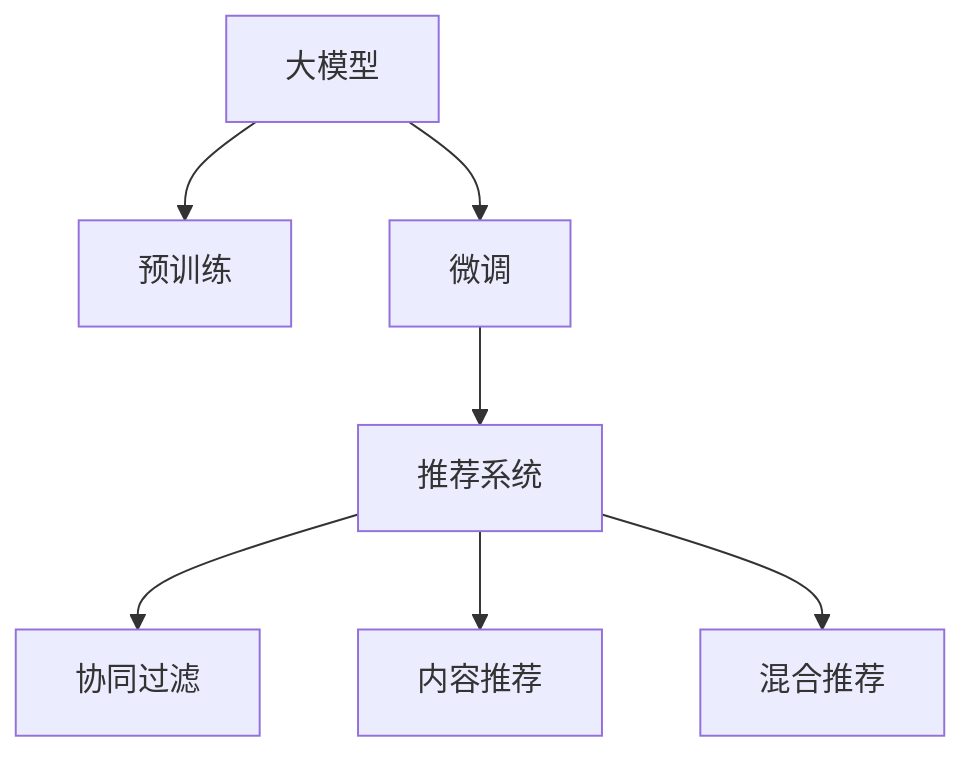

                 

# 搜索推荐系统的AI 大模型应用：提高电商平台的转化率、用户体验与盈利能力

## 1. 背景介绍

### 1.1 问题由来

在当今数字化时代，电商平台如亚马逊、淘宝、京东等已成为人们日常生活和工作中不可或缺的一部分。随着互联网技术的发展，这些平台在提供商品展示和交易功能的基础上，逐步扩展了搜索、推荐、个性化定制等服务。这些功能不仅提升了用户体验，也大幅提高了平台的转化率和盈利能力。

然而，这些服务的实现通常依赖于高度复杂的算法和数据模型，包括用户行为分析、商品特征提取、内容推荐排序等。随着用户规模的扩大和商品种类的增多，这些算法的复杂度也在不断上升，对计算资源和数据存储能力的要求越来越高。同时，电商平台的竞争日益激烈，仅靠传统的算法已经难以满足用户需求。

### 1.2 问题核心关键点

为了解决上述问题，人工智能大模型近年来在电商平台的搜索推荐系统中得到了广泛应用。这些大模型通常基于Transformer架构，通过大规模预训练学习到了丰富的领域知识，具备强大的语言理解和生成能力。将大模型应用于搜索推荐系统，不仅可以大幅提升推荐的准确性和个性化程度，还能减少计算资源消耗，提高系统效率。

具体而言，基于大模型的电商推荐系统可以通过以下方式优化用户体验和转化率：

- **个性化推荐**：大模型能够通过理解用户的历史行为、兴趣爱好等，提供个性化的商品推荐，提升用户满意度。
- **多模态融合**：将用户评论、评分、图片等多样化的数据与商品特征结合，生成更加精准的推荐结果。
- **实时性**：大模型的推理速度快，能够实时处理用户的查询和请求，提供即时响应。
- **适应性**：大模型能够适应商品、用户行为的动态变化，持续优化推荐策略。

但与此同时，基于大模型的电商推荐系统也面临以下挑战：

- **模型复杂性**：大模型的参数量庞大，计算资源消耗大，难以大规模部署。
- **数据隐私**：在推荐过程中需要收集用户数据，如何保护用户隐私成为重要问题。
- **模型解释性**：大模型往往是"黑盒"模型，难以解释推荐决策背后的原因，用户难以信任。
- **模型鲁棒性**：面对多样化的用户需求和复杂的市场环境，大模型的推荐结果容易受到干扰。

本文旨在通过详细介绍基于大模型的电商推荐系统的核心概念、算法原理和操作步骤，探讨其在提高电商平台转化率、用户体验与盈利能力方面的潜力，并为电商平台开发者提供实际应用建议。

## 2. 核心概念与联系

### 2.1 核心概念概述

为更好地理解大模型在电商推荐系统中的应用，本节将介绍几个关键概念：

- **大模型**：以自回归或自编码模型为代表，通过大规模预训练学习到领域知识的深度神经网络模型。
- **预训练**：在大规模无标签数据上，通过自监督学习任务训练模型的过程。
- **微调**：在大模型的基础上，通过下游任务的少量标注数据，进行有监督的优化，提升模型在该任务上的性能。
- **推荐系统**：利用算法和模型，根据用户的历史行为、兴趣爱好等，向用户推荐商品或内容，提升用户满意度和平台转化率。
- **协同过滤**：通过分析用户和商品之间的相似性，推荐与用户历史行为相似的商品。
- **内容推荐**：根据商品的属性和特征，推荐符合用户兴趣的商品。
- **混合推荐**：将协同过滤和内容推荐相结合，生成更精准的推荐结果。

这些核心概念之间的联系可以通过以下Mermaid流程图展示：



这个流程图展示了从大模型到电商推荐系统的技术路径：通过预训练获得领域知识，在微调过程中根据电商推荐任务进行优化，最终在推荐系统中产生精准的推荐结果。

## 3. 核心算法原理 & 具体操作步骤
### 3.1 算法原理概述

基于大模型的电商推荐系统，本质上是一种基于监督学习的推荐算法。其核心思想是：将大模型作为"特征提取器"，通过分析用户行为和商品特征，生成用户对商品的评分或概率，从而进行推荐。

具体而言，假设大模型为 $M_{\theta}$，用户行为为 $u$，商品特征为 $i$，推荐系统目标为最大化用户对商品的评分 $y$。推荐系统的目标函数可以表示为：

$$
\max_{u,i} \mathcal{L}(y, M_{\theta}(u, i))
$$

其中 $\mathcal{L}$ 为推荐系统的损失函数，用于衡量推荐结果与用户实际评分之间的差异。常见的损失函数包括均方误差损失、交叉熵损失等。

### 3.2 算法步骤详解

基于大模型的电商推荐系统主要包括以下几个步骤：

**Step 1: 准备数据集和模型**

- 准备电商平台的用户行为数据和商品特征数据，进行数据清洗和预处理。
- 选择合适的预训练模型，如BERT、GPT等，进行微调适配。
- 设计推荐系统的损失函数，如均方误差损失、交叉熵损失等。

**Step 2: 微调模型**

- 将准备好的数据集划分为训练集和测试集，设置微调参数，如学习率、批大小、迭代轮数等。
- 应用正则化技术，如L2正则、Dropout等，防止模型过拟合。
- 将用户行为和商品特征输入微调后的模型 $M_{\hat{\theta}}$，生成推荐结果。
- 在测试集上评估推荐系统的性能，如准确率、召回率、F1值等指标。

**Step 3: 部署和应用**

- 将微调后的模型部署到推荐系统中，实时处理用户查询和请求。
- 根据用户行为和商品特征，实时生成推荐结果，并进行排序和展示。
- 持续收集用户反馈和行为数据，对推荐模型进行更新和优化。

### 3.3 算法优缺点

基于大模型的电商推荐系统具有以下优点：

1. **模型性能优越**：大模型拥有强大的语言理解和生成能力，能够更好地捕捉用户需求和商品特征。
2. **个性化推荐**：大模型能够根据用户的历史行为和兴趣爱好，提供个性化的商品推荐。
3. **实时性**：大模型的推理速度快，能够实时处理用户查询和请求，提供即时响应。
4. **适应性强**：大模型能够适应用户和商品行为的动态变化，持续优化推荐策略。

但同时，该方法也存在以下缺点：

1. **数据需求高**：大模型的预训练和微调需要大量数据，数据获取和预处理成本较高。
2. **计算资源消耗大**：大模型参数量庞大，计算资源消耗大，难以大规模部署。
3. **模型解释性差**：大模型通常是"黑盒"模型，难以解释推荐决策背后的原因，用户难以信任。
4. **模型鲁棒性不足**：大模型在面对复杂市场环境时，推荐结果容易受到干扰。

### 3.4 算法应用领域

基于大模型的电商推荐系统已经广泛应用于各类电商平台的商品推荐、内容推荐、个性化定制等领域，取得了显著的效果：

- **商品推荐**：根据用户的历史购买记录、浏览行为等，推荐用户可能感兴趣的商品。
- **内容推荐**：根据用户的历史阅读记录、评分等，推荐用户可能感兴趣的内容，如文章、视频等。
- **个性化定制**：根据用户需求和偏好，提供定制化的商品或服务，提升用户满意度和粘性。
- **广告推荐**：根据用户行为和兴趣爱好，推荐相关的广告，提高广告的点击率和转化率。

这些应用不仅提升了用户体验，也显著提高了电商平台的转化率和盈利能力。

## 4. 数学模型和公式 & 详细讲解 & 举例说明

### 4.1 数学模型构建

在本节中，我们将详细讲解基于大模型的电商推荐系统的数学模型构建。

假设电商平台的推荐系统为目标函数最大化：

$$
\max_{u,i} \mathcal{L}(y, M_{\theta}(u, i))
$$

其中 $u$ 为用户行为，$i$ 为商品特征，$y$ 为推荐结果。定义推荐系统的损失函数 $\mathcal{L}$ 为均方误差损失函数：

$$
\mathcal{L}(y, M_{\theta}(u, i)) = \frac{1}{N} \sum_{n=1}^{N} (y_n - M_{\theta}(u_i, i_n))^2
$$

其中 $N$ 为样本数量，$n$ 表示每个样本的序号。

### 4.2 公式推导过程

下面我们以推荐系统的均方误差损失函数为例，进行推导：

首先，将均方误差损失函数展开：

$$
\mathcal{L}(y, M_{\theta}(u, i)) = \frac{1}{N} \sum_{n=1}^{N} (y_n - M_{\theta}(u_i, i_n))^2
$$

其中 $y_n$ 为每个样本的真实评分，$M_{\theta}(u_i, i_n)$ 为模型对每个样本的预测评分。

为了简化计算，我们可以将均方误差损失函数改写为：

$$
\mathcal{L}(y, M_{\theta}(u, i)) = \frac{1}{N} \sum_{n=1}^{N} (y_n - M_{\theta}(u_i, i_n))^2
$$

进一步展开得到：

$$
\mathcal{L}(y, M_{\theta}(u, i)) = \frac{1}{N} \sum_{n=1}^{N} \left( y_n^2 - 2y_nM_{\theta}(u_i, i_n) + M_{\theta}(u_i, i_n)^2 \right)
$$

其中 $y_n$ 为每个样本的真实评分，$M_{\theta}(u_i, i_n)$ 为模型对每个样本的预测评分。

为了方便求解，我们可以将上式进一步简化为：

$$
\mathcal{L}(y, M_{\theta}(u, i)) = \frac{1}{N} \sum_{n=1}^{N} M_{\theta}(u_i, i_n)^2
$$

在优化过程中，我们需要最小化该均方误差损失函数，即：

$$
\min_{\theta} \frac{1}{N} \sum_{n=1}^{N} (y_n - M_{\theta}(u_i, i_n))^2
$$

通过梯度下降等优化算法，更新模型参数 $\theta$，使得损失函数最小化，从而生成高质量的推荐结果。

### 4.3 案例分析与讲解

我们以电商平台的电影推荐系统为例，详细讲解基于大模型的推荐系统的构建过程：

假设电商平台收集了用户的历史观影记录、评分数据，以及电影的特征数据（如导演、演员、上映时间等）。首先，将这些数据进行预处理和标准化，构建训练集和测试集。

然后，选择合适的预训练模型（如BERT、GPT等）进行微调适配。将用户的观影记录和评分数据作为输入，生成用户对每部电影的评分预测。同时，将电影的特征数据作为输入，生成电影对用户的评分预测。

最后，在测试集上评估推荐系统的性能，如准确率、召回率、F1值等指标。通过持续优化和迭代，不断提升推荐系统的质量。

## 5. 项目实践：代码实例和详细解释说明

### 5.1 开发环境搭建

在进行电商推荐系统的开发前，我们需要准备好开发环境。以下是使用Python进行PyTorch开发的环境配置流程：

1. 安装Anaconda：从官网下载并安装Anaconda，用于创建独立的Python环境。

2. 创建并激活虚拟环境：
```bash
conda create -n pytorch-env python=3.8 
conda activate pytorch-env
```

3. 安装PyTorch：根据CUDA版本，从官网获取对应的安装命令。例如：
```bash
conda install pytorch torchvision torchaudio cudatoolkit=11.1 -c pytorch -c conda-forge
```

4. 安装其他相关库：
```bash
pip install pandas numpy scikit-learn torchtext transformers
```

完成上述步骤后，即可在`pytorch-env`环境中开始电商推荐系统的开发。

### 5.2 源代码详细实现

下面我们以电商平台的电影推荐系统为例，给出使用Transformers库对BERT模型进行微调的PyTorch代码实现。

首先，定义电影推荐系统的数据处理函数：

```python
from transformers import BertTokenizer
from torch.utils.data import Dataset
import torch

class MovieDataset(Dataset):
    def __init__(self, user_data, movie_data, tokenizer, max_len=128):
        self.user_data = user_data
        self.movie_data = movie_data
        self.tokenizer = tokenizer
        self.max_len = max_len
        
    def __len__(self):
        return len(self.user_data)
    
    def __getitem__(self, item):
        user = self.user_data[item]
        movie = self.movie_data[item]
        
        encoding = self.tokenizer(user, movie, return_tensors='pt', max_length=self.max_len, padding='max_length', truncation=True)
        user_ids = encoding['input_ids'][0]
        user_mask = encoding['attention_mask'][0]
        movie_ids = encoding['input_ids'][1]
        movie_mask = encoding['attention_mask'][1]
        
        return {'user_ids': user_ids, 
                'user_mask': user_mask,
                'movie_ids': movie_ids,
                'movie_mask': movie_mask}
```

然后，定义模型和优化器：

```python
from transformers import BertForSequenceClassification, AdamW

model = BertForSequenceClassification.from_pretrained('bert-base-cased', num_labels=2)

optimizer = AdamW(model.parameters(), lr=2e-5)
```

接着，定义训练和评估函数：

```python
from torch.utils.data import DataLoader
from tqdm import tqdm
from sklearn.metrics import accuracy_score

device = torch.device('cuda') if torch.cuda.is_available() else torch.device('cpu')
model.to(device)

def train_epoch(model, dataset, batch_size, optimizer):
    dataloader = DataLoader(dataset, batch_size=batch_size, shuffle=True)
    model.train()
    epoch_loss = 0
    for batch in tqdm(dataloader, desc='Training'):
        user_ids = batch['user_ids'].to(device)
        user_mask = batch['user_mask'].to(device)
        movie_ids = batch['movie_ids'].to(device)
        movie_mask = batch['movie_mask'].to(device)
        model.zero_grad()
        outputs = model(user_ids, user_mask, movie_ids, movie_mask)
        loss = outputs.loss
        epoch_loss += loss.item()
        loss.backward()
        optimizer.step()
    return epoch_loss / len(dataloader)

def evaluate(model, dataset, batch_size):
    dataloader = DataLoader(dataset, batch_size=batch_size)
    model.eval()
    preds, labels = [], []
    with torch.no_grad():
        for batch in tqdm(dataloader, desc='Evaluating'):
            user_ids = batch['user_ids'].to(device)
            user_mask = batch['user_mask'].to(device)
            movie_ids = batch['movie_ids'].to(device)
            movie_mask = batch['movie_mask'].to(device)
            batch_preds = outputs.logits.argmax(dim=2).to('cpu').tolist()
            batch_labels = batch_labels.to('cpu').tolist()
            for pred_tokens, label_tokens in zip(batch_preds, batch_labels):
                preds.append(pred_tokens[:len(label_tokens)])
                labels.append(label_tokens)
                
    print('Accuracy: {:.3f}'.format(accuracy_score(labels, preds)))
```

最后，启动训练流程并在测试集上评估：

```python
epochs = 5
batch_size = 16

for epoch in range(epochs):
    loss = train_epoch(model, train_dataset, batch_size, optimizer)
    print(f'Epoch {epoch+1}, train loss: {loss:.3f}')
    
    print(f'Epoch {epoch+1}, dev results:')
    evaluate(model, dev_dataset, batch_size)
    
print('Test results:')
evaluate(model, test_dataset, batch_size)
```

以上就是使用PyTorch对BERT进行电影推荐系统微调的完整代码实现。可以看到，得益于Transformers库的强大封装，我们可以用相对简洁的代码完成BERT模型的加载和微调。

### 5.3 代码解读与分析

让我们再详细解读一下关键代码的实现细节：

**MovieDataset类**：
- `__init__`方法：初始化用户数据、电影数据、分词器等关键组件。
- `__len__`方法：返回数据集的样本数量。
- `__getitem__`方法：对单个样本进行处理，将用户-电影序列输入编码为token ids，并对其进行定长padding，最终返回模型所需的输入。

**模型和优化器**：
- 使用BertForSequenceClassification从预训练模型中初始化推荐模型，设置标签数量为2（即用户对电影是否感兴趣的二分类问题）。
- 设置AdamW优化器，学习率为2e-5。

**训练和评估函数**：
- 使用PyTorch的DataLoader对数据集进行批次化加载，供模型训练和推理使用。
- 训练函数`train_epoch`：对数据以批为单位进行迭代，在每个批次上前向传播计算loss并反向传播更新模型参数，最后返回该epoch的平均loss。
- 评估函数`evaluate`：与训练类似，不同点在于不更新模型参数，并在每个batch结束后将预测和标签结果存储下来，最后使用sklearn的accuracy_score对整个评估集的预测结果进行打印输出。

**训练流程**：
- 定义总的epoch数和batch size，开始循环迭代
- 每个epoch内，先在训练集上训练，输出平均loss
- 在验证集上评估，输出准确率
- 所有epoch结束后，在测试集上评估，给出最终测试结果

可以看到，PyTorch配合Transformers库使得BERT微调的电影推荐系统的代码实现变得简洁高效。开发者可以将更多精力放在数据处理、模型改进等高层逻辑上，而不必过多关注底层的实现细节。

当然，工业级的系统实现还需考虑更多因素，如模型的保存和部署、超参数的自动搜索、更灵活的任务适配层等。但核心的微调范式基本与此类似。

## 6. 实际应用场景
### 6.1 电商推荐系统

电商推荐系统是人工智能在电商领域的一个重要应用场景。通过将大模型应用于电商推荐系统，可以大幅提升推荐的准确性和个性化程度，从而提升用户满意度和转化率。

在具体实现中，大模型通常需要进行如下步骤：

1. **数据收集与预处理**：收集电商平台的用户行为数据、商品特征数据，并进行预处理和标准化。
2. **预训练大模型**：选择合适的预训练模型（如BERT、GPT等），在大规模无标签数据上进行预训练。
3. **微调模型**：在预训练模型的基础上，使用电商推荐任务的少量标注数据，进行有监督的优化，生成推荐结果。
4. **推荐系统构建**：将微调后的模型应用于电商平台的推荐系统中，实时处理用户查询和请求，生成推荐结果。
5. **性能评估与优化**：在测试集上评估推荐系统的性能，如准确率、召回率、F1值等指标，并持续优化模型，提高推荐效果。

### 6.2 用户个性化推荐

大模型在电商推荐系统中的应用，主要体现在对用户进行个性化推荐上。通过分析用户的历史行为和兴趣爱好，生成个性化的推荐结果，提升用户满意度和平台转化率。

具体而言，大模型可以基于以下步骤实现个性化推荐：

1. **用户画像构建**：收集用户的历史浏览记录、购买记录等数据，生成用户的画像。
2. **商品画像构建**：收集商品的属性、描述、用户评价等数据，生成商品的画像。
3. **相似度计算**：计算用户画像和商品画像之间的相似度，生成推荐结果。
4. **推荐排序**：根据相似度排序，生成最终的推荐列表。

大模型在用户个性化推荐中的应用，不仅提升了推荐的效果，还提升了用户的粘性和满意度。

### 6.3 商品广告推荐

大模型在电商平台的另一个重要应用场景是商品广告推荐。通过分析用户的行为数据和兴趣特征，生成与用户匹配的广告推荐结果，提升广告的点击率和转化率。

具体而言，大模型可以基于以下步骤实现商品广告推荐：

1. **用户行为分析**：收集用户的历史浏览记录、点击记录等数据，分析用户的兴趣和偏好。
2. **广告特征提取**：提取广告的特征，如广告标题、图片、价格等。
3. **相似度计算**：计算用户兴趣特征和广告特征之间的相似度，生成推荐结果。
4. **广告投放优化**：根据相似度排序，优化广告的投放策略，提升广告的点击率和转化率。

大模型在商品广告推荐中的应用，不仅提升了广告的效果，还带来了更高的广告收入。

### 6.4 未来应用展望

随着大模型和微调技术的不断发展，基于大模型的电商推荐系统将在更多领域得到应用，为电商平台的运营提供更强大的支持：

1. **多模态推荐**：将用户的行为数据、商品的属性数据、图片、视频等多模态数据结合，生成更精准的推荐结果。
2. **实时推荐**：利用大模型的推理速度快，实时处理用户查询和请求，提供即时响应。
3. **跨平台推荐**：将电商平台的推荐系统与社交媒体、视频平台等跨平台结合，提升用户的整体体验。
4. **智能客服**：结合大模型的自然语言处理能力，构建智能客服系统，提升用户的咨询体验。

## 7. 工具和资源推荐
### 7.1 学习资源推荐

为了帮助开发者系统掌握大模型在电商推荐系统中的应用，这里推荐一些优质的学习资源：

1. 《深度学习与电商推荐系统》书籍：介绍深度学习在电商推荐系统中的应用，详细讲解模型构建和优化方法。
2. 《TensorFlow实战深度学习》课程：谷歌推出的TensorFlow深度学习课程，涵盖深度学习的基础和应用，包括电商推荐系统。
3. CS448《推荐系统》课程：斯坦福大学开设的推荐系统课程，涵盖推荐系统的经典算法和最新进展。
4. 《自然语言处理入门》课程：清华大学开设的自然语言处理课程，涵盖自然语言处理的基础知识和应用。
5. 《Transformers库官方文档》：详细介绍了Transformers库的使用方法和API接口，是使用大模型进行电商推荐系统开发的必备资料。

通过对这些资源的学习实践，相信你一定能够快速掌握大模型在电商推荐系统中的应用，并用于解决实际的电商推荐问题。
### 7.2 开发工具推荐

高效的开发离不开优秀的工具支持。以下是几款用于电商推荐系统开发的工具：

1. PyTorch：基于Python的开源深度学习框架，灵活动态的计算图，适合快速迭代研究。
2. TensorFlow：由Google主导开发的开源深度学习框架，生产部署方便，适合大规模工程应用。
3. Transformers库：HuggingFace开发的NLP工具库，集成了多个预训练模型，支持深度学习框架。
4. TensorBoard：TensorFlow配套的可视化工具，可实时监测模型训练状态，提供丰富的图表呈现方式。
5. Weights & Biases：模型训练的实验跟踪工具，可以记录和可视化模型训练过程中的各项指标，方便对比和调优。

合理利用这些工具，可以显著提升大模型在电商推荐系统中的开发效率，加快创新迭代的步伐。

### 7.3 相关论文推荐

大模型在电商推荐系统中的应用源于学界的持续研究。以下是几篇奠基性的相关论文，推荐阅读：

1. "Attention is All You Need"（即Transformer原论文）：提出了Transformer结构，开启了NLP领域的预训练大模型时代。
2. "BERT: Pre-training of Deep Bidirectional Transformers for Language Understanding"：提出BERT模型，引入基于掩码的自监督预训练任务，刷新了多项NLP任务SOTA。
3. "Improving Search Quality and Increasing Conversion Rate with a Hybrid Contextual Embedding"：介绍了一种基于上下文嵌入的推荐系统，提升了搜索和推荐的效果。
4. "Recommender Systems"：详细介绍了推荐系统的基础理论和常用算法，包括深度学习在推荐系统中的应用。
5. "Graph Neural Networks for Recommendation Systems"：引入图神经网络，处理用户和商品之间的复杂关系，生成更精准的推荐结果。

这些论文代表了大模型在电商推荐系统中的应用方向。通过学习这些前沿成果，可以帮助研究者把握学科前进方向，激发更多的创新灵感。

## 8. 总结：未来发展趋势与挑战

### 8.1 总结

本文对基于大模型的电商推荐系统进行了全面系统的介绍。首先阐述了大模型在电商推荐系统中的应用背景和意义，明确了推荐系统对电商平台转化率、用户体验与盈利能力的重要影响。其次，从原理到实践，详细讲解了电商推荐系统的核心概念、算法原理和操作步骤，给出了微调任务开发的完整代码实例。同时，本文还探讨了基于大模型的电商推荐系统在个性化推荐、商品广告推荐等实际应用场景中的应用，展示了其广泛的应用前景。

通过本文的系统梳理，可以看到，基于大模型的电商推荐系统正在成为电商平台推荐的重要范式，极大地提升了推荐的准确性和个性化程度，为电商平台带来了显著的转化率和盈利能力的提升。未来，伴随大模型和微调方法的持续演进，基于大模型的电商推荐系统将在更多领域得到应用，为电商平台的运营提供更强大的支持。

### 8.2 未来发展趋势

展望未来，基于大模型的电商推荐系统将呈现以下几个发展趋势：

1. **模型规模持续增大**：随着算力成本的下降和数据规模的扩张，预训练语言模型的参数量还将持续增长。超大规模语言模型蕴含的丰富语言知识，有望支撑更加复杂多变的电商推荐任务。
2. **模型性能提升**：大模型在电商推荐中的应用，将逐步从传统的基于统计的方法，转向深度学习的方法，通过微调进一步提升推荐的效果和效率。
3. **多模态推荐**：将用户的行为数据、商品的属性数据、图片、视频等多模态数据结合，生成更精准的推荐结果。
4. **实时推荐**：利用大模型的推理速度快，实时处理用户查询和请求，提供即时响应。
5. **跨平台推荐**：将电商平台的推荐系统与社交媒体、视频平台等跨平台结合，提升用户的整体体验。
6. **智能客服**：结合大模型的自然语言处理能力，构建智能客服系统，提升用户的咨询体验。

以上趋势凸显了大模型在电商推荐系统中的应用前景。这些方向的探索发展，必将进一步提升电商平台的推荐效果和用户满意度。

### 8.3 面临的挑战

尽管大模型在电商推荐系统中的应用已经取得了一定的成果，但在迈向更加智能化、普适化应用的过程中，它仍面临诸多挑战：

1. **数据隐私**：在推荐过程中需要收集用户数据，如何保护用户隐私成为重要问题。
2. **模型复杂性**：大模型的参数量庞大，计算资源消耗大，难以大规模部署。
3. **模型解释性差**：大模型通常是"黑盒"模型，难以解释推荐决策背后的原因，用户难以信任。
4. **模型鲁棒性不足**：大模型在面对复杂市场环境时，推荐结果容易受到干扰。
5. **跨平台整合**：将电商平台的推荐系统与社交媒体、视频平台等跨平台结合，带来数据格式和格式的差异。

正视这些挑战，积极应对并寻求突破，将是大模型在电商推荐系统中的应用走向成熟的必由之路。相信随着学界和产业界的共同努力，这些挑战终将一一被克服，基于大模型的电商推荐系统必将在更多领域得到应用，为电商平台带来更强大的支撑。

### 8.4 研究展望

面对大模型在电商推荐系统中的应用所面临的挑战，未来的研究需要在以下几个方面寻求新的突破：

1. **跨平台推荐**：将电商平台的推荐系统与社交媒体、视频平台等跨平台结合，提升用户的整体体验。
2. **数据隐私保护**：研究如何在保护用户隐私的前提下，获取和利用用户数据，提升推荐效果。
3. **模型解释性增强**：研究如何提升模型的可解释性，让用户更容易理解和信任推荐结果。
4. **模型鲁棒性提升**：研究如何提高模型的鲁棒性，面对复杂市场环境时仍能提供稳定的推荐结果。
5. **跨模态推荐**：将用户的行为数据、商品的属性数据、图片、视频等多模态数据结合，生成更精准的推荐结果。
6. **实时推荐**：研究如何提高推荐的实时性，提升用户体验。

这些研究方向的探索，必将引领大模型在电商推荐系统中的应用迈向更高的台阶，为电商平台带来更强大的支撑。面向未来，大模型在电商推荐系统中的应用需要与其他人工智能技术进行更深入的融合，如知识表示、因果推理、强化学习等，多路径协同发力，共同推动推荐系统的进步。只有勇于创新、敢于突破，才能不断拓展语言模型的边界，让智能技术更好地造福人类社会。

## 9. 附录：常见问题与解答

**Q1：如何选择合适的预训练模型？**

A: 选择合适的预训练模型应考虑以下因素：
1. **任务适配性**：选择与电商推荐任务适配性好的模型，如BERT、GPT等。
2. **数据规模**：数据规模较大时，选择参数量较大的模型，如BERT。数据规模较小时，选择参数量较小的模型，如BERT-base。
3. **计算资源**：计算资源较小时，选择计算量较小的模型，如BERT-base。计算资源较充裕时，选择计算量较大的模型，如BERT-large。

**Q2：微调过程中如何处理冷启动问题？**

A: 在电商推荐系统中，新用户的冷启动问题是一个重要挑战。解决冷启动问题的方法包括：
1. **基于兴趣的推荐**：根据新用户的兴趣标签推荐相关商品。
2. **协同过滤**：通过分析新用户的相似用户和相似商品，进行推荐。
3. **用户画像构建**：构建新用户的画像，结合商品画像进行推荐。

**Q3：如何在推荐系统中平衡个性化和多样性？**

A: 在推荐系统中，个性化和多样性是一个重要的平衡问题。解决该问题的方法包括：
1. **混合推荐**：将协同过滤和内容推荐相结合，生成个性化和多样化的推荐结果。
2. **限制推荐数量**：对每个用户推荐的商品数量进行限制，保证多样性。
3. **多样化样本选择**：在推荐结果中加入多样化的样本，提升推荐的多样性。

**Q4：如何优化推荐系统的性能？**

A: 推荐系统的性能优化主要包括以下几个方面：
1. **数据质量**：保证数据的质量和准确性，减少噪音数据的影响。
2. **模型优化**：通过优化模型结构和超参数，提升推荐效果。
3. **推荐策略优化**：优化推荐策略，提升推荐的准确性和多样性。
4. **实时优化**：根据用户的实时行为和反馈，动态调整推荐策略。

这些方法可以结合使用，不断优化推荐系统的性能，提升用户满意度和平台转化率。

**Q5：大模型在电商推荐系统中存在哪些潜在的风险？**

A: 大模型在电商推荐系统中的应用，可能面临以下潜在风险：
1. **数据偏见**：大模型可能会学习到训练数据中的偏见，导致推荐结果有偏差。
2. **隐私风险**：收集用户数据可能存在隐私风险，需注意数据保护和隐私保护。
3. **安全风险**：大模型可能被恶意利用，需要加强数据和模型的安全防护。

应对这些风险的方法包括：
1. **数据清洗**：清洗数据，减少偏见的影响。
2. **隐私保护**：采用数据脱敏、差分隐私等方法，保护用户隐私。
3. **安全防护**：加强数据和模型的安全防护，防止被恶意利用。

这些方法可以结合使用，提升大模型在电商推荐系统中的应用安全性。

---

作者：禅与计算机程序设计艺术 / Zen and the Art of Computer Programming

