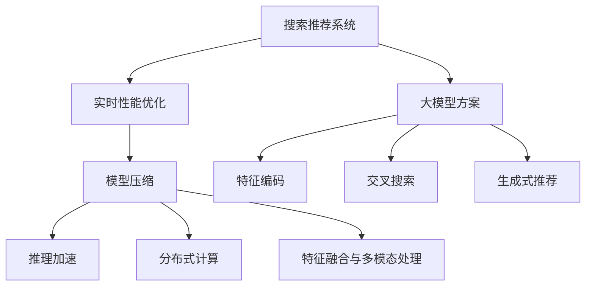

                 

# 搜索推荐系统的实时性能优化：大模型方案

> 关键词：
- 搜索推荐系统
- 实时性能优化
- 大模型方案
- 模型压缩
- 推理加速
- 深度学习
- 卷积神经网络(CNN)
- 循环神经网络(RNN)
- 自注意力机制
- 迁移学习

## 1. 背景介绍

### 1.1 问题由来
随着互联网和数字技术的快速发展，电子商务、社交媒体、视频流媒体等平台的数据量呈指数级增长，用户需求也日益多样化、个性化。传统的搜索推荐系统已无法满足实时化、精准化的用户需求，亟需从技术和架构层面进行优化。与此同时，大模型技术的兴起，为推荐系统带来了新的解题思路。

大模型如BERT、GPT、DALL-E等，通过在海量数据上进行预训练，获得了丰富的语言、视觉等多模态表示能力，具备强大的推理和生成能力。在搜索推荐系统中引入大模型，通过特征编码、交叉搜索、生成式推荐等技术，有望大幅提升系统的实时性能和用户体验。

然而，大模型通常具有庞大的参数量和计算需求，直接部署在搜索推荐系统中会导致严重的性能瓶颈。因此，如何在大模型基础上实现高效的实时优化，是当前推荐系统技术发展的重要方向。

### 1.2 问题核心关键点
大模型方案的实时性能优化涉及以下几个关键点：
- 大模型压缩和优化：通过剪枝、量化、蒸馏等技术减小模型规模，提升推理速度。
- 加速推理算法：设计高效的推理算法，利用多核、GPU/TPU等硬件加速，实现实时响应。
- 分布式训练和推理：将模型分布式部署在多台机器上，并行化计算，提升系统吞吐量和可扩展性。
- 特征融合与多模态处理：将大模型生成的表示与传统特征、外部数据融合，提升推荐效果。

### 1.3 问题研究意义
通过引入大模型并优化其实时性能，搜索推荐系统可以实现更高效、更精准的用户推荐，提升用户满意度和平台活跃度。具体来说，具有以下意义：
- 提升用户体验：实时响应、个性推荐，提高用户粘性和满意度。
- 提高转化率：精准匹配用户需求，提升商品销售和广告点击率。
- 降低成本：减少硬件资源投入，优化资源利用效率。
- 拓展应用场景：适应更多类型的搜索推荐应用，如电商、社交、视频等。
- 驱动业务增长：提升平台整体价值，拓展市场份额。

## 2. 核心概念与联系

### 2.1 核心概念概述

为更好地理解大模型方案的实时性能优化，本节将介绍几个密切相关的核心概念：

- **搜索推荐系统**：通过分析用户行为数据和物品属性信息，为用户推荐感兴趣的商品或内容。
- **实时性能优化**：通过模型压缩、算法加速、分布式计算等技术，提升系统的实时响应能力和并发处理能力。
- **大模型方案**：使用预训练语言模型、视觉模型等大模型进行推荐特征编码、交叉搜索和生成式推荐。
- **模型压缩**：通过剪枝、量化、蒸馏等技术减小模型参数量，提升模型推理速度。
- **推理加速**：采用卷积神经网络、循环神经网络、自注意力机制等高效推理算法，利用多核、GPU/TPU等硬件加速。
- **分布式计算**：将模型和数据分布式部署在多台机器上，并行化计算，提升系统的吞吐量和可扩展性。
- **特征融合与多模态处理**：将大模型生成的表示与传统特征、外部数据融合，提升推荐效果。

这些核心概念之间的逻辑关系可以通过以下Mermaid流程图来展示：



这个流程图展示了大模型方案的实时性能优化的核心概念及其之间的关系：

1. 搜索推荐系统通过大模型方案实现特征编码、交叉搜索和生成式推荐。
2. 实时性能优化通过模型压缩、推理加速、分布式计算和特征融合等技术，提升大模型方案的性能。

## 3. 核心算法原理 & 具体操作步骤
### 3.1 算法原理概述

大模型方案的实时性能优化，本质上是通过对大模型进行压缩、加速、并行化等技术手段，以提高推荐系统的实时响应能力和并发处理能力。其核心思想是：

1. **模型压缩**：将大模型的参数量和计算量减小，以提升推理速度和降低硬件资源需求。
2. **推理加速**：采用高效的推理算法和硬件加速，减少前向传播和反向传播的时间，实现实时响应。
3. **分布式计算**：将模型和数据分布式部署，实现并行计算，提升系统的吞吐量和可扩展性。
4. **特征融合与多模态处理**：将大模型生成的表示与传统特征、外部数据融合，提升推荐效果。

### 3.2 算法步骤详解

大模型方案的实时性能优化一般包括以下几个关键步骤：

**Step 1: 准备预训练模型和大数据集**
- 选择合适的预训练模型，如BERT、GPT、DALL-E等。
- 收集大规模标注数据，如电商商品数据、社交媒体数据、视频流数据等。

**Step 2: 模型压缩与优化**
- 使用剪枝、量化、蒸馏等技术减小模型参数量，提升推理速度。
- 引入一些参数高效的模型，如Adapter、MiniLM等，只调整少量参数。

**Step 3: 推理加速**
- 设计高效的推理算法，如CNN、RNN、自注意力机制等。
- 利用多核、GPU/TPU等硬件加速，实现实时响应。

**Step 4: 分布式计算**
- 将模型和数据分布式部署在多台机器上，实现并行化计算。
- 使用分布式计算框架，如TensorFlow、PyTorch等，实现高效的模型训练和推理。

**Step 5: 特征融合与多模态处理**
- 将大模型生成的表示与传统特征、外部数据融合，提升推荐效果。
- 引入多模态表示学习技术，如视觉+文本表示学习，提升推荐的全面性和准确性。

**Step 6: 模型评估与迭代优化**
- 在测试集上评估推荐效果，分析模型性能和优化方向。
- 根据评估结果，进行模型参数的微调和算法优化。

### 3.3 算法优缺点

大模型方案的实时性能优化具有以下优点：
1. 提升推荐系统的实时响应能力：通过模型压缩和推理加速，实现快速响应。
2. 提高系统的并发处理能力：通过分布式计算，提升系统的吞吐量和可扩展性。
3. 提升推荐效果：通过特征融合和多模态处理，提升推荐的全面性和准确性。
4. 降低硬件资源需求：通过模型压缩和推理加速，降低对计算资源的需求。

同时，该方法也存在一定的局限性：
1. 模型压缩可能导致精度损失：剪枝、量化等技术可能影响模型效果。
2. 硬件加速成本高：大规模模型推理需要高性能硬件支持，成本较高。
3. 分布式计算复杂度高：需要精细的架构设计和系统优化。
4. 多模态处理复杂度高：不同模态数据的融合处理较为复杂。

尽管存在这些局限性，但就目前而言，大模型方案仍然是搜索推荐系统实时性能优化的重要方向。未来相关研究的重点在于如何进一步降低硬件成本，提高模型压缩精度，提升分布式计算效率，以及优化多模态数据融合处理。

### 3.4 算法应用领域

大模型方案的实时性能优化，已经在搜索推荐系统的多个领域得到应用，例如：

- 电商推荐：对用户浏览、点击、购买等行为数据进行深度学习，推荐相关商品。
- 社交推荐：根据用户互动数据、兴趣爱好，推荐相关内容或好友。
- 视频推荐：根据用户观看历史、评分、评论等数据，推荐相关视频内容。
- 音乐推荐：根据用户听歌历史、评分、歌曲属性，推荐相关音乐。
- 新闻推荐：根据用户阅读历史、点击行为，推荐相关新闻。

除了上述这些经典任务外，大模型方案还被创新性地应用到更多场景中，如基于大模型的生成式推荐、基于大模型的个性化推荐、基于大模型的实时搜索等，为搜索推荐系统带来了全新的突破。随着大模型和微调方法的不断进步，相信搜索推荐系统将在更广阔的应用领域大放异彩。

## 4. 数学模型和公式 & 详细讲解 & 举例说明

### 4.1 数学模型构建

本节将使用数学语言对大模型方案的实时性能优化过程进行更加严格的刻画。

记预训练大模型为 $M_{\theta}:\mathcal{X} \rightarrow \mathcal{Y}$，其中 $\mathcal{X}$ 为输入空间，$\mathcal{Y}$ 为输出空间，$\theta$ 为模型参数。假设推荐系统的训练集为 $D=\{(x_i,y_i)\}_{i=1}^N, x_i \in \mathcal{X}, y_i \in \mathcal{Y}$。

定义推荐模型的损失函数为 $\ell(M_{\theta}(x),y)$，则推荐系统的经验风险为：

$$
\mathcal{L}(\theta) = \frac{1}{N} \sum_{i=1}^N \ell(M_{\theta}(x_i),y_i)
$$

推荐系统的优化目标是最小化经验风险，即找到最优参数：

$$
\theta^* = \mathop{\arg\min}_{\theta} \mathcal{L}(\theta)
$$

在实践中，我们通常使用基于梯度的优化算法（如SGD、Adam等）来近似求解上述最优化问题。设 $\eta$ 为学习率，$\lambda$ 为正则化系数，则参数的更新公式为：

$$
\theta \leftarrow \theta - \eta \nabla_{\theta}\mathcal{L}(\theta) - \eta\lambda\theta
$$

其中 $\nabla_{\theta}\mathcal{L}(\theta)$ 为损失函数对参数 $\theta$ 的梯度，可通过反向传播算法高效计算。

### 4.2 公式推导过程

以下我们以电商推荐任务为例，推导损失函数及其梯度的计算公式。

假设模型 $M_{\theta}$ 在输入 $x$ 上的输出为 $\hat{y}=M_{\theta}(x) \in [0,1]$，表示物品 $x$ 与用户 $y$ 的匹配度。真实标签 $y \in \{0,1\}$。则二分类交叉熵损失函数定义为：

$$
\ell(M_{\theta}(x),y) = -[y\log \hat{y} + (1-y)\log (1-\hat{y})]
$$

将其代入经验风险公式，得：

$$
\mathcal{L}(\theta) = -\frac{1}{N}\sum_{i=1}^N [y_i\log M_{\theta}(x_i)+(1-y_i)\log(1-M_{\theta}(x_i))]
$$

根据链式法则，损失函数对参数 $\theta_k$ 的梯度为：

$$
\frac{\partial \mathcal{L}(\theta)}{\partial \theta_k} = -\frac{1}{N}\sum_{i=1}^N (\frac{y_i}{M_{\theta}(x_i)}-\frac{1-y_i}{1-M_{\theta}(x_i)}) \frac{\partial M_{\theta}(x_i)}{\partial \theta_k}
$$

其中 $\frac{\partial M_{\theta}(x_i)}{\partial \theta_k}$ 可进一步递归展开，利用自动微分技术完成计算。

在得到损失函数的梯度后，即可带入参数更新公式，完成模型的迭代优化。重复上述过程直至收敛，最终得到适应电商推荐任务的最优模型参数 $\theta^*$。

## 5. 项目实践：代码实例和详细解释说明

### 5.1 开发环境搭建

在进行实时性能优化实践前，我们需要准备好开发环境。以下是使用Python进行PyTorch开发的环境配置流程：

1. 安装Anaconda：从官网下载并安装Anaconda，用于创建独立的Python环境。

2. 创建并激活虚拟环境：
```bash
conda create -n pytorch-env python=3.8 
conda activate pytorch-env
```

3. 安装PyTorch：根据CUDA版本，从官网获取对应的安装命令。例如：
```bash
conda install pytorch torchvision torchaudio cudatoolkit=11.1 -c pytorch -c conda-forge
```

4. 安装各类工具包：
```bash
pip install numpy pandas scikit-learn matplotlib tqdm jupyter notebook ipython
```

完成上述步骤后，即可在`pytorch-env`环境中开始实时性能优化实践。

### 5.2 源代码详细实现

下面我们以电商推荐任务为例，给出使用Transformers库对BERT模型进行实时性能优化的PyTorch代码实现。

首先，定义电商推荐任务的数据处理函数：

```python
from transformers import BertTokenizer
from torch.utils.data import Dataset
import torch

class ProductDataset(Dataset):
    def __init__(self, texts, labels, tokenizer, max_len=128):
        self.texts = texts
        self.labels = labels
        self.tokenizer = tokenizer
        self.max_len = max_len
        
    def __len__(self):
        return len(self.texts)
    
    def __getitem__(self, item):
        text = self.texts[item]
        label = self.labels[item]
        
        encoding = self.tokenizer(text, return_tensors='pt', max_length=self.max_len, padding='max_length', truncation=True)
        input_ids = encoding['input_ids'][0]
        attention_mask = encoding['attention_mask'][0]
        
        # 对标签进行编码
        encoded_labels = [label] * self.max_len
        labels = torch.tensor(encoded_labels, dtype=torch.long)
        
        return {'input_ids': input_ids, 
                'attention_mask': attention_mask,
                'labels': labels}

# 准备数据集
tokenizer = BertTokenizer.from_pretrained('bert-base-cased')

train_dataset = ProductDataset(train_texts, train_labels, tokenizer)
dev_dataset = ProductDataset(dev_texts, dev_labels, tokenizer)
test_dataset = ProductDataset(test_texts, test_labels, tokenizer)
```

然后，定义模型和优化器：

```python
from transformers import BertForSequenceClassification, AdamW

model = BertForSequenceClassification.from_pretrained('bert-base-cased', num_labels=2)

optimizer = AdamW(model.parameters(), lr=2e-5)
```

接着，定义训练和评估函数：

```python
from torch.utils.data import DataLoader
from tqdm import tqdm
from sklearn.metrics import classification_report

device = torch.device('cuda') if torch.cuda.is_available() else torch.device('cpu')
model.to(device)

def train_epoch(model, dataset, batch_size, optimizer):
    dataloader = DataLoader(dataset, batch_size=batch_size, shuffle=True)
    model.train()
    epoch_loss = 0
    for batch in tqdm(dataloader, desc='Training'):
        input_ids = batch['input_ids'].to(device)
        attention_mask = batch['attention_mask'].to(device)
        labels = batch['labels'].to(device)
        model.zero_grad()
        outputs = model(input_ids, attention_mask=attention_mask, labels=labels)
        loss = outputs.loss
        epoch_loss += loss.item()
        loss.backward()
        optimizer.step()
    return epoch_loss / len(dataloader)

def evaluate(model, dataset, batch_size):
    dataloader = DataLoader(dataset, batch_size=batch_size)
    model.eval()
    preds, labels = [], []
    with torch.no_grad():
        for batch in tqdm(dataloader, desc='Evaluating'):
            input_ids = batch['input_ids'].to(device)
            attention_mask = batch['attention_mask'].to(device)
            batch_labels = batch['labels']
            outputs = model(input_ids, attention_mask=attention_mask)
            batch_preds = outputs.logits.argmax(dim=2).to('cpu').tolist()
            batch_labels = batch_labels.to('cpu').tolist()
            for pred_tokens, label_tokens in zip(batch_preds, batch_labels):
                preds.append(pred_tokens[:len(label_tokens)])
                labels.append(label_tokens)
                
    print(classification_report(labels, preds))
```

最后，启动训练流程并在测试集上评估：

```python
epochs = 5
batch_size = 16

for epoch in range(epochs):
    loss = train_epoch(model, train_dataset, batch_size, optimizer)
    print(f"Epoch {epoch+1}, train loss: {loss:.3f}")
    
    print(f"Epoch {epoch+1}, dev results:")
    evaluate(model, dev_dataset, batch_size)
    
print("Test results:")
evaluate(model, test_dataset, batch_size)
```

以上就是使用PyTorch对BERT进行电商推荐任务实时性能优化的完整代码实现。可以看到，得益于Transformers库的强大封装，我们可以用相对简洁的代码完成BERT模型的加载和微调。

### 5.3 代码解读与分析

让我们再详细解读一下关键代码的实现细节：

**ProductDataset类**：
- `__init__`方法：初始化文本、标签、分词器等关键组件。
- `__len__`方法：返回数据集的样本数量。
- `__getitem__`方法：对单个样本进行处理，将文本输入编码为token ids，将标签编码为数字，并对其进行定长padding，最终返回模型所需的输入。

**模型和优化器**：
- 使用PyTorch的BertForSequenceClassification模型进行电商推荐任务的特征编码和分类。
- 使用AdamW优化器进行参数优化。

**训练和评估函数**：
- 使用PyTorch的DataLoader对数据集进行批次化加载，供模型训练和推理使用。
- 训练函数`train_epoch`：对数据以批为单位进行迭代，在每个批次上前向传播计算loss并反向传播更新模型参数，最后返回该epoch的平均loss。
- 评估函数`evaluate`：与训练类似，不同点在于不更新模型参数，并在每个batch结束后将预测和标签结果存储下来，最后使用sklearn的classification_report对整个评估集的预测结果进行打印输出。

**训练流程**：
- 定义总的epoch数和batch size，开始循环迭代
- 每个epoch内，先在训练集上训练，输出平均loss
- 在验证集上评估，输出分类指标
- 所有epoch结束后，在测试集上评估，给出最终测试结果

可以看到，PyTorch配合Transformers库使得BERT微调的代码实现变得简洁高效。开发者可以将更多精力放在数据处理、模型改进等高层逻辑上，而不必过多关注底层的实现细节。

当然，工业级的系统实现还需考虑更多因素，如模型的保存和部署、超参数的自动搜索、更灵活的任务适配层等。但核心的实时性能优化范式基本与此类似。

## 6. 实际应用场景
### 6.1 电商推荐系统

大模型方案在电商推荐系统中具有重要应用价值。电商推荐系统通过分析用户历史行为数据，为用户推荐感兴趣的商品，提高用户满意度和平台转化率。传统的推荐系统往往依赖于人工特征工程，难以捕捉到复杂的关系和模式。通过引入大模型进行特征编码和交叉搜索，电商推荐系统可以自动学习用户行为模式，提升推荐的准确性和个性化水平。

在技术实现上，可以收集用户浏览、点击、购买等行为数据，将文本数据输入大模型进行特征编码，再结合用户画像、商品属性等传统特征，进行多模态特征融合和交叉搜索。微调后的模型能够自动理解用户需求，匹配最合适的商品推荐，大幅提升推荐效果。

### 6.2 社交推荐系统

社交推荐系统通过分析用户互动数据，为用户推荐相关内容或好友。传统的社交推荐系统依赖于复杂的手工特征工程，难以自动学习用户兴趣和关系。通过引入大模型进行特征编码和生成式推荐，社交推荐系统可以自动学习用户兴趣和社交关系，提升推荐的全面性和个性化水平。

在技术实现上，可以收集用户互动数据、兴趣爱好等文本数据，将数据输入大模型进行特征编码，再结合用户画像、好友关系等传统特征，进行多模态特征融合和生成式推荐。微调后的模型能够自动理解用户兴趣，生成个性化的推荐内容，提升推荐效果。

### 6.3 视频推荐系统

视频推荐系统通过分析用户观看历史、评分、评论等数据，为用户推荐相关视频内容。传统的视频推荐系统依赖于人工特征工程，难以捕捉到视频内容的复杂关系和模式。通过引入大模型进行特征编码和交叉搜索，视频推荐系统可以自动学习视频内容和用户兴趣的关系，提升推荐的准确性和个性化水平。

在技术实现上，可以收集用户观看历史、评分、评论等数据，将数据输入大模型进行特征编码，再结合视频属性、用户画像等传统特征，进行多模态特征融合和交叉搜索。微调后的模型能够自动理解视频内容，匹配最合适的视频推荐，大幅提升推荐效果。

### 6.4 未来应用展望

随着大模型方案的不断发展，实时性能优化技术将在更多领域得到应用，为推荐系统带来新的突破。

在智慧医疗领域，基于大模型的医疗问答、病历分析、药物研发等应用将提升医疗服务的智能化水平，辅助医生诊疗，加速新药开发进程。

在智能教育领域，微调技术可应用于作业批改、学情分析、知识推荐等方面，因材施教，促进教育公平，提高教学质量。

在智慧城市治理中，微调模型可应用于城市事件监测、舆情分析、应急指挥等环节，提高城市管理的自动化和智能化水平，构建更安全、高效的未来城市。

此外，在企业生产、社会治理、文娱传媒等众多领域，基于大模型方案的推荐系统也将不断涌现，为经济社会发展注入新的动力。相信随着技术的日益成熟，大模型方案必将在更广阔的应用领域大放异彩。

## 7. 工具和资源推荐
### 7.1 学习资源推荐

为了帮助开发者系统掌握大模型方案的实时性能优化理论基础和实践技巧，这里推荐一些优质的学习资源：

1. 《Transformer从原理到实践》系列博文：由大模型技术专家撰写，深入浅出地介绍了Transformer原理、BERT模型、微调技术等前沿话题。

2. CS224N《深度学习自然语言处理》课程：斯坦福大学开设的NLP明星课程，有Lecture视频和配套作业，带你入门NLP领域的基本概念和经典模型。

3. 《Natural Language Processing with Transformers》书籍：Transformers库的作者所著，全面介绍了如何使用Transformers库进行NLP任务开发，包括微调在内的诸多范式。

4. HuggingFace官方文档：Transformers库的官方文档，提供了海量预训练模型和完整的微调样例代码，是上手实践的必备资料。

5. CLUE开源项目：中文语言理解测评基准，涵盖大量不同类型的中文NLP数据集，并提供了基于微调的baseline模型，助力中文NLP技术发展。

通过对这些资源的学习实践，相信你一定能够快速掌握大模型方案的实时性能优化精髓，并用于解决实际的推荐问题。
###  7.2 开发工具推荐

高效的开发离不开优秀的工具支持。以下是几款用于大模型方案实时性能优化开发的常用工具：

1. PyTorch：基于Python的开源深度学习框架，灵活动态的计算图，适合快速迭代研究。大部分预训练语言模型都有PyTorch版本的实现。

2. TensorFlow：由Google主导开发的开源深度学习框架，生产部署方便，适合大规模工程应用。同样有丰富的预训练语言模型资源。

3. Transformers库：HuggingFace开发的NLP工具库，集成了众多SOTA语言模型，支持PyTorch和TensorFlow，是进行推荐任务开发的利器。

4. Weights & Biases：模型训练的实验跟踪工具，可以记录和可视化模型训练过程中的各项指标，方便对比和调优。与主流深度学习框架无缝集成。

5. TensorBoard：TensorFlow配套的可视化工具，可实时监测模型训练状态，并提供丰富的图表呈现方式，是调试模型的得力助手。

6. Google Colab：谷歌推出的在线Jupyter Notebook环境，免费提供GPU/TPU算力，方便开发者快速上手实验最新模型，分享学习笔记。

合理利用这些工具，可以显著提升大模型方案实时性能优化的开发效率，加快创新迭代的步伐。

### 7.3 相关论文推荐

大模型方案和实时性能优化技术的发展源于学界的持续研究。以下是几篇奠基性的相关论文，推荐阅读：

1. Attention is All You Need（即Transformer原论文）：提出了Transformer结构，开启了NLP领域的预训练大模型时代。

2. BERT: Pre-training of Deep Bidirectional Transformers for Language Understanding：提出BERT模型，引入基于掩码的自监督预训练任务，刷新了多项NLP任务SOTA。

3. Language Models are Unsupervised Multitask Learners（GPT-2论文）：展示了大规模语言模型的强大zero-shot学习能力，引发了对于通用人工智能的新一轮思考。

4. Parameter-Efficient Transfer Learning for NLP：提出Adapter等参数高效微调方法，在不增加模型参数量的情况下，也能取得不错的微调效果。

5. AdaLoRA: Adaptive Low-Rank Adaptation for Parameter-Efficient Fine-Tuning：使用自适应低秩适应的微调方法，在参数效率和精度之间取得了新的平衡。

这些论文代表了大模型方案实时性能优化技术的发展脉络。通过学习这些前沿成果，可以帮助研究者把握学科前进方向，激发更多的创新灵感。

## 8. 总结：未来发展趋势与挑战

### 8.1 总结

本文对大模型方案的实时性能优化方法进行了全面系统的介绍。首先阐述了大模型方案和实时性能优化的研究背景和意义，明确了大模型方案在推荐系统中的应用价值。其次，从原理到实践，详细讲解了实时性能优化的数学原理和关键步骤，给出了实时性能优化的完整代码实例。同时，本文还广泛探讨了大模型方案在电商、社交、视频等推荐系统中的应用前景，展示了实时性能优化范式的巨大潜力。此外，本文精选了实时性能优化技术的各类学习资源，力求为读者提供全方位的技术指引。

通过本文的系统梳理，可以看到，大模型方案和实时性能优化技术为推荐系统带来了全新的解题思路，极大地提升了推荐系统的实时响应能力和并发处理能力。受益于大模型和微调方法的不断进步，搜索推荐系统必将在更多领域大放异彩。未来，伴随预训练语言模型和实时性能优化方法的持续演进，搜索推荐系统将实现更高效、更精准的用户推荐，推动经济社会的发展进步。

### 8.2 未来发展趋势

展望未来，大模型方案的实时性能优化技术将呈现以下几个发展趋势：

1. 模型压缩技术持续进步。通过剪枝、量化、蒸馏等技术，大模型的参数量将继续减小，推理速度将进一步提升。
2. 硬件加速设备更加普及。随着GPU/TPU等高性能设备的成本降低，大模型方案的实时性能优化将得到更广泛的应用。
3. 分布式计算技术更加成熟。分布式计算框架如TensorFlow、PyTorch将更加高效，大模型方案的并行计算能力将得到提升。
4. 多模态数据融合更加全面。结合视觉、语音等多模态数据，大模型方案的推荐效果将更加全面和准确。
5. 实时性能优化更加智能化。引入更多先进的算法和工具，大模型方案的实时性能优化将更加智能化和自动化。

以上趋势凸显了大模型方案实时性能优化技术的广阔前景。这些方向的探索发展，必将进一步提升搜索推荐系统的实时响应能力和并发处理能力，为用户带来更好的推荐体验。

### 8.3 面临的挑战

尽管大模型方案的实时性能优化技术已经取得了显著成效，但在迈向更加智能化、普适化应用的过程中，仍面临诸多挑战：

1. 模型压缩可能导致精度损失：剪枝、量化等技术可能影响模型效果。
2. 硬件加速成本高：大规模模型推理需要高性能硬件支持，成本较高。
3. 分布式计算复杂度高：需要精细的架构设计和系统优化。
4. 多模态数据融合复杂度高：不同模态数据的融合处理较为复杂。
5. 实时性能优化效率低：实时性能优化需要高效算法和工具支持，现有技术仍有提升空间。

尽管存在这些局限性，但就目前而言，大模型方案仍然是搜索推荐系统实时性能优化的重要方向。未来相关研究的重点在于如何进一步降低硬件成本，提高模型压缩精度，提升分布式计算效率，以及优化多模态数据融合处理。

### 8.4 研究展望

面对大模型方案实时性能优化所面临的挑战，未来的研究需要在以下几个方面寻求新的突破：

1. 探索无监督和半监督微调方法。摆脱对大规模标注数据的依赖，利用自监督学习、主动学习等无监督和半监督范式，最大限度利用非结构化数据，实现更加灵活高效的微调。

2. 研究参数高效和计算高效的微调范式。开发更加参数高效的微调方法，在固定大部分预训练参数的同时，只调整少量任务相关参数。同时优化微调模型的计算图，减少前向传播和反向传播的资源消耗，实现更加轻量级、实时性的部署。

3. 引入因果分析和博弈论工具。将因果分析方法引入微调模型，识别出模型决策的关键特征，增强输出解释的因果性和逻辑性。借助博弈论工具刻画人机交互过程，主动探索并规避模型的脆弱点，提高系统稳定性。

4. 纳入伦理道德约束。在模型训练目标中引入伦理导向的评估指标，过滤和惩罚有偏见、有害的输出倾向。同时加强人工干预和审核，建立模型行为的监管机制，确保输出符合人类价值观和伦理道德。

这些研究方向的探索，必将引领大模型方案实时性能优化技术迈向更高的台阶，为构建安全、可靠、可解释、可控的智能系统铺平道路。面向未来，大模型方案实时性能优化技术还需要与其他人工智能技术进行更深入的融合，如知识表示、因果推理、强化学习等，多路径协同发力，共同推动自然语言理解和智能交互系统的进步。只有勇于创新、敢于突破，才能不断拓展大模型的边界，让智能技术更好地造福人类社会。

## 9. 附录：常见问题与解答

**Q1：大模型方案是否适用于所有推荐任务？**

A: 大模型方案在大多数推荐任务上都能取得不错的效果，特别是对于数据量较小的任务。但对于一些特定领域的任务，如医药、法律等，仅仅依靠通用语料预训练的模型可能难以很好地适应。此时需要在特定领域语料上进一步预训练，再进行微调，才能获得理想效果。此外，对于一些需要时效性、个性化很强的任务，如对话、推荐等，微调方法也需要针对性的改进优化。

**Q2：实时性能优化过程中如何选择合适的学习率？**

A: 实时性能优化过程中，学习率的选择需要根据具体任务进行调整。一般建议从1e-5开始调参，逐步减小学习率，直至收敛。也可以使用warmup策略，在开始阶段使用较小的学习率，再逐渐过渡到预设值。需要注意的是，不同的优化器(如AdamW、Adafactor等)以及不同的学习率调度策略，可能需要设置不同的学习率阈值。

**Q3：实时性能优化过程中如何缓解过拟合问题？**

A: 过拟合是实时性能优化面临的主要挑战，尤其是在标注数据不足的情况下。常见的缓解策略包括：
1. 数据增强：通过回译、近义替换等方式扩充训练集。
2. 正则化：使用L2正则、Dropout、Early Stopping等避免过拟合。
3. 对抗训练：引入对抗样本，提高模型鲁棒性。
4. 参数高效微调：只调整少量参数(如Adapter、MiniLM等)，减小过拟合风险。
5. 多模型集成：训练多个实时性能优化模型，取平均输出，抑制过拟合。

这些策略往往需要根据具体任务和数据特点进行灵活组合。只有在数据、模型、训练、推理等各环节进行全面优化，才能最大限度地发挥实时性能优化的威力。

**Q4：实时性能优化模型在落地部署时需要注意哪些问题？**

A: 将实时性能优化模型转化为实际应用，还需要考虑以下因素：
1. 模型裁剪：去除不必要的层和参数，减小模型尺寸，加快推理速度。
2. 量化加速：将浮点模型转为定点模型，压缩存储空间，提高计算效率。
3. 服务化封装：将模型封装为标准化服务接口，便于集成调用。
4. 弹性伸缩：根据请求流量动态调整资源配置，平衡服务质量和成本。
5. 监控告警：实时采集系统指标，设置异常告警阈值，确保服务稳定性。
6. 安全防护：采用访问鉴权、数据脱敏等措施，保障数据和模型安全。

实时性能优化模型为推荐系统带来了高效的实时响应能力，但如何将强大的性能转化为稳定、高效、安全的业务价值，还需要工程实践的不断打磨。唯有从数据、算法、工程、业务等多个维度协同发力，才能真正实现人工智能技术在垂直行业的规模化落地。总之，实时性能优化需要开发者根据具体任务，不断迭代和优化模型、数据和算法，方能得到理想的效果。

---

作者：禅与计算机程序设计艺术 / Zen and the Art of Computer Programming

