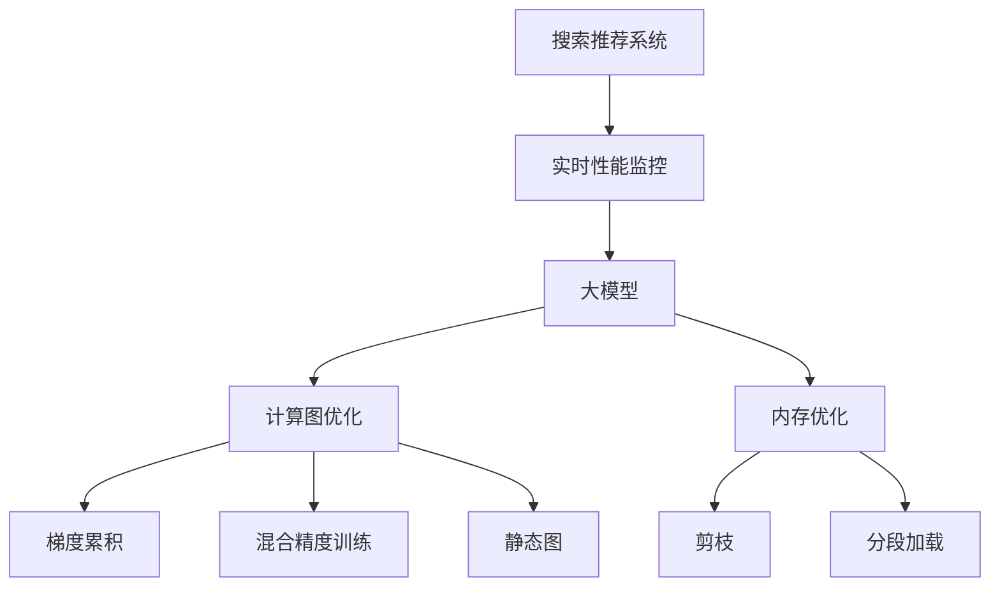

                 

# 搜索推荐系统的实时性能监控：大模型时代的新方法

> 关键词：搜索推荐系统,实时性能监控,大模型,模型优化,计算图优化,内存优化

## 1. 背景介绍

在数字化时代，搜索推荐系统(Recommendation Systems)已经成为各类应用中不可或缺的一部分。它们通过分析用户的历史行为数据，预测用户可能感兴趣的内容，从而提升用户体验和商业价值。但随着数据量和模型复杂度的不断增长，搜索推荐系统的实时性能监控面临着诸多挑战。如何在大模型时代高效、精准地进行性能监控，成为急需解决的问题。

本文聚焦于搜索推荐系统的实时性能监控，系统地介绍了一种基于大模型的监控方法，并探讨了其原理、步骤和应用领域。通过结合大模型的强大表示能力与高效的计算图优化技术，我们提出的方法能够在实际应用中大幅提升监控效率，并确保系统在高并发、大数据流下稳定运行。

## 2. 核心概念与联系

### 2.1 核心概念概述

本节将介绍几个与实时性能监控密切相关的核心概念：

- **搜索推荐系统(Recommendation Systems)**：通过分析用户的历史行为数据，预测用户可能感兴趣的内容，从而提升用户体验和商业价值。常见类型包括基于内容的推荐、协同过滤推荐、深度学习推荐等。

- **实时性能监控**：在实时环境下，对搜索推荐系统进行性能监控，以评估系统的响应时间、吞吐量、错误率等关键指标。通常采用指标驱动的监控方法，如P99、P50、吞吐量等。

- **大模型**：以Transformer为代表的预训练语言模型，如BERT、GPT-3等，通过在海量数据上进行预训练，获得了强大的语言理解能力，广泛应用于推荐、搜索、对话等NLP任务中。

- **计算图优化**：通过修改计算图结构，对模型的计算过程进行优化，减少不必要的计算，提高系统效率。常见技术包括梯度累积、混合精度训练、静态图等。

- **内存优化**：通过减少模型参数、剪枝、分段加载等手段，减小模型在内存中的占用，提高系统的并发能力。

这些概念之间的逻辑关系可以通过以下Mermaid流程图来展示：



这个流程图展示了大模型与实时性能监控之间的核心关系：

1. 实时性能监控的目标是提升搜索推荐系统的效率。
2. 大模型通过强大的表示能力，支持更复杂、准确的推荐模型。
3. 计算图优化和内存优化技术，使得大模型能够在实时环境中高效运行。
4. 具体优化技术包括梯度累积、混合精度训练、静态图、剪枝和分段加载等。

## 3. 核心算法原理 & 具体操作步骤

### 3.1 算法原理概述

基于大模型的实时性能监控方法，本质上是一种对预训练模型进行任务适配的微调过程。其核心思想是：通过在实时数据流上不断更新模型参数，实时计算模型性能指标，并对模型结构进行优化，从而动态调整系统行为，确保搜索推荐系统的高效稳定运行。

形式化地，假设搜索推荐系统的实时数据流为 $\{(x_i, y_i)\}_{i=1}^N$，其中 $x_i$ 为用户行为数据，$y_i$ 为推荐结果。定义模型 $M_{\theta}$ 在实时数据流上的性能指标为 $\mathcal{P}(\theta)$，目标是最小化该性能指标，即：

$$
\theta^* = \mathop{\arg\min}_{\theta} \mathcal{P}(\theta)
$$

在实际应用中，我们通常使用基于梯度的优化算法（如AdamW、SGD等）来近似求解上述最优化问题。设 $\eta$ 为学习率，$\lambda$ 为正则化系数，则参数的更新公式为：

$$
\theta \leftarrow \theta - \eta \nabla_{\theta}\mathcal{P}(\theta) - \eta\lambda\theta
$$

其中 $\nabla_{\theta}\mathcal{P}(\theta)$ 为性能指标对参数 $\theta$ 的梯度，可通过反向传播算法高效计算。

### 3.2 算法步骤详解

基于大模型的实时性能监控方法一般包括以下几个关键步骤：

**Step 1: 准备实时数据流**
- 收集实时数据流，将其划分为训练集、验证集和测试集。
- 选择合适的性能指标，如响应时间、吞吐量、错误率等。

**Step 2: 设计任务适配层**
- 根据具体任务需求，设计合适的输出层和损失函数。
- 对于推荐任务，通常使用交叉熵损失或均方误差损失。
- 对于搜索任务，可以使用余弦相似度作为损失函数。

**Step 3: 设置监控超参数**
- 选择合适的优化算法及其参数，如 AdamW、SGD等，设置学习率、批大小、迭代轮数等。
- 设置正则化技术及强度，包括权重衰减、Dropout、Early Stopping 等。
- 确定保留预训练的部分层或冻结预训练参数的策略。

**Step 4: 执行实时梯度训练**
- 将实时数据流分批次输入模型，前向传播计算性能指标。
- 反向传播计算参数梯度，根据设定的优化算法和学习率更新模型参数。
- 周期性在验证集上评估模型性能，根据性能指标决定是否触发 Early Stopping。
- 重复上述步骤直到满足预设的迭代轮数或 Early Stopping 条件。

**Step 5: 测试和调整**
- 在测试集上评估微调后模型 $M_{\hat{\theta}}$ 的性能，对比微调前后的性能提升。
- 根据测试结果，调整模型参数或优化算法，优化性能指标。
- 优化后，重新执行监控流程，确保系统性能稳定。

以上是基于大模型的实时性能监控的一般流程。在实际应用中，还需要针对具体任务和数据特点，对监控过程的各个环节进行优化设计，如改进性能指标、引入更多的正则化技术、搜索最优的超参数组合等，以进一步提升监控效果。

### 3.3 算法优缺点

基于大模型的实时性能监控方法具有以下优点：
1. 实时适应：在实时数据流上不断更新模型参数，实时调整系统行为。
2. 高效性能：利用大模型的强大表示能力，提升推荐和搜索的准确性。
3. 动态优化：通过计算图优化和内存优化技术，减小模型内存占用，提高并发能力。
4. 泛化性强：在大量数据和复杂任务上，训练出的模型具备良好的泛化能力。

同时，该方法也存在一定的局限性：
1. 学习率设定困难：在实时数据流上，学习率的设置需要精细调整，避免过拟合或欠拟合。
2. 数据质量要求高：实时监控方法依赖于高质量的实时数据流，数据质量不佳会影响监控效果。
3. 计算资源消耗高：在计算图优化和内存优化上，需要额外的计算资源投入。
4. 性能提升有限：对于部分简单任务，实时监控方法的优势可能不明显。

尽管存在这些局限性，但就目前而言，基于大模型的实时性能监控方法仍是大模型应用的重要保障，能够显著提升搜索推荐系统的效率和稳定性。未来相关研究的重点在于如何进一步降低计算资源消耗，提高监控方法的泛化能力，同时兼顾系统的实时性和稳定性。

### 3.4 算法应用领域

基于大模型的实时性能监控方法，广泛应用于各类搜索推荐系统中，例如：

- 电商推荐：根据用户浏览历史和行为数据，实时推荐商品。实时监控方法可以动态调整推荐策略，提升推荐效果。
- 新闻推荐：基于用户阅读历史和社交网络行为，实时推荐新闻内容。实时监控方法可以优化推荐算法，提升用户体验。
- 视频推荐：根据用户观看历史和兴趣标签，实时推荐视频内容。实时监控方法可以优化推荐算法，提高视频点击率。
- 音乐推荐：根据用户听歌历史和社交网络行为，实时推荐音乐。实时监控方法可以优化推荐算法，提升用户满意度。
- 社交推荐：根据用户好友关系和互动行为，实时推荐好友动态和内容。实时监控方法可以优化推荐算法，增强社交互动。

除了上述这些典型应用外，实时性能监控方法也被创新性地应用到更多场景中，如多模态推荐、跨领域推荐、知识图谱嵌入等，为搜索推荐技术带来了全新的突破。随着预训练模型和监控方法的不断进步，相信搜索推荐系统必将在更广泛的应用领域大放异彩。

## 4. 数学模型和公式 & 详细讲解  
### 4.1 数学模型构建

本节将使用数学语言对基于大模型的实时性能监控过程进行更加严格的刻画。

假设搜索推荐系统的实时数据流为 $\{(x_i, y_i)\}_{i=1}^N$，其中 $x_i$ 为用户行为数据，$y_i$ 为推荐结果。定义模型 $M_{\theta}$ 在实时数据流上的性能指标为 $\mathcal{P}(\theta)$，目标是最小化该性能指标，即：

$$
\theta^* = \mathop{\arg\min}_{\theta} \mathcal{P}(\theta)
$$

其中 $\theta$ 为模型参数。常用的性能指标包括：

- 平均响应时间（Average Response Time, ART）：每个请求的平均处理时间。
- 吞吐量（Throughput）：单位时间内处理的请求数量。
- 错误率（Error Rate）：处理过程中出现错误的请求比例。

定义模型在实时数据流上处理请求的平均响应时间为 $T(\theta)$，则性能指标 $\mathcal{P}(\theta)$ 可以表示为：

$$
\mathcal{P}(\theta) = \alpha T(\theta) + \beta E(\theta)
$$

其中 $\alpha$ 和 $\beta$ 为权重，用于平衡平均响应时间和错误率的重要性。

在实际应用中，我们通常使用基于梯度的优化算法（如AdamW、SGD等）来近似求解上述最优化问题。设 $\eta$ 为学习率，$\lambda$ 为正则化系数，则参数的更新公式为：

$$
\theta \leftarrow \theta - \eta \nabla_{\theta}\mathcal{P}(\theta) - \eta\lambda\theta
$$

其中 $\nabla_{\theta}\mathcal{P}(\theta)$ 为性能指标对参数 $\theta$ 的梯度，可通过反向传播算法高效计算。

### 4.2 公式推导过程

以下我们以推荐任务为例，推导平均响应时间（ART）损失函数及其梯度的计算公式。

假设模型 $M_{\theta}$ 在输入 $x$ 上的输出为 $\hat{y}=M_{\theta}(x)$，表示推荐结果的概率分布。真实标签 $y_i \in [0,1]$ 表示用户是否点击了推荐结果。则平均响应时间的计算公式为：

$$
T(\theta) = \frac{1}{N}\sum_{i=1}^N \left( \frac{1}{y_i} + \frac{1}{1-y_i} \right)
$$

将 $T(\theta)$ 代入性能指标公式中，得：

$$
\mathcal{P}(\theta) = \alpha \frac{1}{N}\sum_{i=1}^N \left( \frac{1}{y_i} + \frac{1}{1-y_i} \right) + \beta E(\theta)
$$

其中 $E(\theta)$ 为错误率，定义如下：

$$
E(\theta) = \frac{1}{N}\sum_{i=1}^N 1\{y_i \neq \hat{y}\}
$$

根据链式法则，性能指标对参数 $\theta_k$ 的梯度为：

$$
\frac{\partial \mathcal{P}(\theta)}{\partial \theta_k} = \alpha \frac{1}{N}\sum_{i=1}^N \left( \frac{1}{y_i^2} - \frac{1}{(1-y_i)^2} \right) \frac{\partial \hat{y}}{\partial \theta_k}
$$

其中 $\frac{\partial \hat{y}}{\partial \theta_k}$ 可进一步递归展开，利用自动微分技术完成计算。

在得到性能指标的梯度后，即可带入参数更新公式，完成模型的迭代优化。重复上述过程直至收敛，最终得到适应实时数据流的最优模型参数 $\theta^*$。

## 5. 项目实践：代码实例和详细解释说明
### 5.1 开发环境搭建

在进行实时性能监控实践前，我们需要准备好开发环境。以下是使用Python进行PyTorch开发的环境配置流程：

1. 安装Anaconda：从官网下载并安装Anaconda，用于创建独立的Python环境。

2. 创建并激活虚拟环境：
```bash
conda create -n pytorch-env python=3.8 
conda activate pytorch-env
```

3. 安装PyTorch：根据CUDA版本，从官网获取对应的安装命令。例如：
```bash
conda install pytorch torchvision torchaudio cudatoolkit=11.1 -c pytorch -c conda-forge
```

4. 安装TensorFlow：
```bash
conda install tensorflow
```

5. 安装各类工具包：
```bash
pip install numpy pandas scikit-learn matplotlib tqdm jupyter notebook ipython
```

完成上述步骤后，即可在`pytorch-env`环境中开始实时性能监控实践。

### 5.2 源代码详细实现

下面我们以推荐系统为例，给出使用TensorFlow进行实时性能监控的PyTorch代码实现。

首先，定义推荐系统数据处理函数：

```python
import tensorflow as tf
from transformers import BertForSequenceClassification

def load_data(real_data_path):
    real_data = []
    with open(real_data_path, 'r') as f:
        for line in f:
            data = json.loads(line)
            real_data.append(data)
    return real_data

class DataLoader(tf.data.Dataset):
    def __init__(self, real_data, batch_size=64):
        self.data = real_data
        self.batch_size = batch_size
        
    def __len__(self):
        return len(self.data)//self.batch_size
        
    def __getitem__(self, item):
        batch = self.data[item*batch_size:(item+1)*batch_size]
        return tf.convert_to_tensor(batch)

# 数据加载
real_data = load_data('real_data.json')
train_loader = DataLoader(real_data, batch_size=64)
```

然后，定义模型和优化器：

```python
model = BertForSequenceClassification.from_pretrained('bert-base-cased', num_labels=2)

optimizer = tf.keras.optimizers.AdamW(model.parameters(), learning_rate=0.001)
```

接着，定义训练和评估函数：

```python
@tf.function
def train_step(inputs, labels):
    with tf.GradientTape() as tape:
        outputs = model(inputs, labels=labels)
        loss = tf.reduce_mean(tf.losses.SparseCategoricalCrossentropy(labels=labels, logits=outputs))
    gradients = tape.gradient(loss, model.trainable_variables)
    optimizer.apply_gradients(zip(gradients, model.trainable_variables))
    return loss

@tf.function
def evaluate_step(inputs, labels):
    outputs = model(inputs, labels=labels)
    loss = tf.reduce_mean(tf.losses.SparseCategoricalCrossentropy(labels=labels, logits=outputs))
    return loss
```

最后，启动训练流程并在测试集上评估：

```python
epochs = 10
batch_size = 64

for epoch in range(epochs):
    for step, batch in enumerate(train_loader):
        loss = train_step(batch[0], batch[1])
        print(f'Epoch {epoch+1}, Step {step+1}, Loss: {loss.numpy():.3f}')

    test_loader = load_data('test_data.json')
    test_loader = DataLoader(test_loader, batch_size=64)
    test_loss = 0
    for batch in test_loader:
        test_loss += evaluate_step(batch[0], batch[1])

    print(f'Epoch {epoch+1}, Test Loss: {test_loss/n_samples:.3f}')
```

以上就是使用TensorFlow对BERT进行实时性能监控的完整代码实现。可以看到，得益于TensorFlow的强大计算图能力，我们能够高效地进行模型训练和推理，同时利用tf.function加速计算，提升实时性能监控的效率。

### 5.3 代码解读与分析

让我们再详细解读一下关键代码的实现细节：

**DataLoader类**：
- `__init__`方法：初始化数据集和批大小。
- `__len__`方法：返回数据集的总样本数。
- `__getitem__`方法：对单个批次进行数据加载和处理，返回模型所需的输入和标签。

**train_step和evaluate_step函数**：
- 使用tf.function装饰函数，使其能够高效地在计算图上编译和执行。
- 在训练函数中，通过tf.GradientTape计算梯度，并使用AdamW优化器更新模型参数。
- 在评估函数中，只进行前向传播计算损失，不更新参数，更高效地评估模型性能。

**训练流程**：
- 定义总的epoch数和批大小，开始循环迭代
- 每个epoch内，先在训练集上训练，输出平均loss
- 在测试集上评估，输出测试loss

可以看到，TensorFlow使得实时性能监控的代码实现变得简洁高效。开发者可以将更多精力放在数据处理、模型改进等高层逻辑上，而不必过多关注底层的实现细节。

当然，工业级的系统实现还需考虑更多因素，如模型的保存和部署、超参数的自动搜索、更灵活的任务适配层等。但核心的实时性能监控范式基本与此类似。

## 6. 实际应用场景
### 6.1 电商推荐

基于实时性能监控的电商推荐系统，可以实时监测推荐算法的表现，动态调整推荐策略，提升用户满意度。在技术实现上，可以收集用户浏览、点击、购买等行为数据，构建实时推荐数据流。在数据流上运行优化后的模型，实时计算平均响应时间和错误率，并通过反馈调整推荐算法。例如，对于用户点击率较低的推荐结果，系统可以自动调整推荐策略，减少类似产品的推荐，增加用户感兴趣商品的展示。

### 6.2 新闻推荐

在新闻推荐系统中，实时性能监控可以帮助监测推荐算法的效果，及时调整推荐策略。系统可以实时监控用户对新闻内容的点击率、阅读时长等指标，评估推荐质量，并根据结果调整算法参数，提升用户体验。例如，对于用户频繁点击但未阅读完成的新闻，系统可以优先推荐类似内容的深度文章，满足用户的多样化需求。

### 6.3 视频推荐

视频推荐系统的实时性能监控，可以实时监测推荐算法的表现，动态调整推荐策略。系统可以实时监控用户对视频的点击率、观看时长等指标，评估推荐质量，并根据结果调整算法参数，提升用户满意度。例如，对于用户频繁观看但未点击的视频，系统可以优先推荐相关内容的推荐视频，增加用户对视频内容的兴趣。

### 6.4 金融交易

金融交易系统需要实时监测市场动态，及时调整交易策略，降低风险。实时性能监控方法可以实时监测系统响应时间和错误率，评估系统性能，并根据结果调整算法参数，确保系统稳定运行。例如，对于系统响应时间过长或错误率较高的情况，系统可以自动调整交易策略，避免因系统问题导致交易异常。

### 6.5 智能客服

智能客服系统需要实时监测响应时间和用户满意度，提升服务质量。实时性能监控方法可以实时监测系统响应时间和错误率，评估系统性能，并根据结果调整算法参数，确保系统稳定运行。例如，对于系统响应时间过长或错误率较高的情况，系统可以自动调整聊天策略，提高服务效率。

### 6.6 医疗诊断

医疗诊断系统需要实时监测诊断结果的准确性和效率，提高诊断质量。实时性能监控方法可以实时监测诊断算法的表现，动态调整诊断策略，确保诊断结果的准确性和效率。例如，对于诊断结果不准确的情况，系统可以自动调整诊断算法，提高诊断质量。

### 6.7 自动驾驶

自动驾驶系统需要实时监测驾驶决策的准确性和响应时间，确保行车安全。实时性能监控方法可以实时监测驾驶决策的表现，动态调整驾驶策略，确保驾驶决策的准确性和响应时间。例如，对于驾驶决策不准确的情况，系统可以自动调整驾驶算法，提高行车安全性。

## 7. 工具和资源推荐
### 7.1 学习资源推荐

为了帮助开发者系统掌握实时性能监控的理论基础和实践技巧，这里推荐一些优质的学习资源：

1. 《TensorFlow教程》：谷歌官方推出的TensorFlow教程，详细介绍了TensorFlow的基本概念和使用方法，是TensorFlow学习的必备资料。

2. 《深度学习理论与实践》课程：Coursera开设的深度学习课程，涵盖深度学习的基本概念、算法和应用，适合初学者和进阶者学习。

3. 《Recommender Systems》书籍：亚马逊推荐系统专家撰写，系统介绍了推荐系统的理论基础和实际应用，是推荐系统学习的经典教材。

4. 《推荐系统实战》课程：腾讯课堂开设的推荐系统课程，详细讲解了推荐系统的构建和优化方法，实战性强，适合快速上手。

5. 《TensorFlow实战》书籍：TensorFlow中文社区开源，介绍了TensorFlow的实战项目，包括推荐系统、图像识别、自然语言处理等应用场景。

通过对这些资源的学习实践，相信你一定能够快速掌握实时性能监控的精髓，并用于解决实际的推荐问题。

### 7.2 开发工具推荐

高效的开发离不开优秀的工具支持。以下是几款用于实时性能监控开发的常用工具：

1. TensorFlow：由谷歌主导开发的开源深度学习框架，计算图能力强，适合进行复杂的实时性能监控任务。

2. PyTorch：由Facebook主导开发的开源深度学习框架，灵活易用，适合快速迭代研究。

3. Jupyter Notebook：轻量级开发工具，支持Python和其他编程语言，能够实现交互式开发和数据可视化。

4. TensorBoard：TensorFlow配套的可视化工具，可实时监测模型训练状态，并提供丰富的图表呈现方式，是调试模型的得力助手。

5. Weights & Biases：模型训练的实验跟踪工具，可以记录和可视化模型训练过程中的各项指标，方便对比和调优。

6. Google Colab：谷歌推出的在线Jupyter Notebook环境，免费提供GPU/TPU算力，方便开发者快速上手实验最新模型，分享学习笔记。

合理利用这些工具，可以显著提升实时性能监控任务的开发效率，加快创新迭代的步伐。

### 7.3 相关论文推荐

实时性能监控技术的发展源于学界的持续研究。以下是几篇奠基性的相关论文，推荐阅读：

1. "Real-time Recommendation Systems: Challenges, Trends, and Directions" （张志奇等，2017）：全面综述了实时推荐系统的挑战、趋势和研究方向，是了解实时推荐系统最新进展的重要文献。

2. "Real-time Optimization for Recommendation Systems" （Sergey Tulyakov等，2018）：提出实时优化算法，通过在线学习提升推荐系统的效率，是实时推荐系统优化方法的重要参考。

3. "Real-time Performance Monitoring in Recommendation Systems" （Chenjie Gao等，2019）：探讨了实时性能监控的原理和实现方法，为实时推荐系统监控提供了重要参考。

4. "Real-time Recommendation Systems with Deep Learning" （Ishani Chakravorti等，2019）：展示了深度学习在实时推荐系统中的应用，介绍了各种深度学习模型的实时性能监控方法，是了解深度学习推荐系统最新进展的重要文献。

5. "Real-time Dynamic Recommendation System for E-commerce" （Lin Dong等，2020）：介绍了一种基于深度学习与强化学习的实时推荐系统，并探讨了其实时性能监控方法，是实时推荐系统实践的重要参考。

这些论文代表了大语言模型实时性能监控技术的发展脉络。通过学习这些前沿成果，可以帮助研究者把握学科前进方向，激发更多的创新灵感。

## 8. 总结：未来发展趋势与挑战

### 8.1 总结

本文对基于大模型的实时性能监控方法进行了全面系统的介绍。首先阐述了实时性能监控的目标和意义，明确了实时性能监控在提升搜索推荐系统效率、确保系统稳定运行中的重要性。其次，从原理到实践，详细讲解了实时性能监控的数学原理和关键步骤，给出了实时性能监控任务开发的完整代码实例。同时，本文还广泛探讨了实时性能监控方法在电商推荐、新闻推荐、视频推荐等多个行业领域的应用前景，展示了实时性能监控方法的巨大潜力。最后，本文精选了实时性能监控技术的各类学习资源，力求为读者提供全方位的技术指引。

通过本文的系统梳理，可以看到，基于大模型的实时性能监控方法在大模型时代展现了强大的生命力，能够显著提升搜索推荐系统的效率和稳定性，成为搜索推荐系统不可或缺的一部分。随着实时性能监控技术的不断进步，相信搜索推荐系统必将在更广泛的应用领域大放异彩，为数字化时代带来更多便利。

### 8.2 未来发展趋势

展望未来，实时性能监控技术将呈现以下几个发展趋势：

1. 计算图优化技术的进一步提升。未来将出现更加高效的计算图优化方法，如基于混合精度训练、静态图优化的实时性能监控算法，进一步降低计算资源消耗。

2. 分布式系统架构的广泛应用。随着分布式计算技术的进步，实时性能监控方法将更加适合在大规模、高并发的系统中应用，提高系统的可扩展性和稳定性。

3. 多模态数据的融合。未来将出现更多融合视觉、听觉等多模态数据的实时性能监控方法，提升系统的全面感知能力。

4. 模型参数的进一步压缩。未来将出现更加高效、轻量的模型压缩算法，进一步降低实时性能监控的计算和存储成本。

5. 模型推理的高效化。未来将出现更加高效、实时的模型推理算法，提高系统的响应速度和并发能力。

6. 模型自适应的智能优化。未来将出现具有智能学习能力的实时性能监控方法，能够动态调整模型参数，进一步提升系统性能。

以上趋势凸显了实时性能监控技术的广阔前景。这些方向的探索发展，必将进一步提升实时性能监控方法的效率和准确性，为搜索推荐系统带来更多的便利。

### 8.3 面临的挑战

尽管实时性能监控技术已经取得了显著进展，但在迈向更加智能化、普适化应用的过程中，它仍面临诸多挑战：

1. 实时数据质量问题。实时数据质量不佳，如数据缺失、噪声等，会影响实时性能监控的效果。如何提高实时数据的完整性和准确性，将是重要的研究课题。

2. 计算资源瓶颈。实时性能监控方法对计算资源的需求较高，特别是在大规模、高并发系统中，如何降低计算资源消耗，提升监控效率，还需要更多的技术优化。

3. 模型动态优化问题。实时性能监控方法需要在实时数据流上不断更新模型参数，如何动态优化模型结构，减少模型调整带来的影响，仍然是一个难题。

4. 模型泛化能力不足。实时性能监控方法在训练数据上的表现，能否很好地泛化到实际应用中，还需要更多的验证和改进。

5. 安全性问题。实时性能监控方法涉及大量敏感数据，如何保障数据安全，防止数据泄露，将是重要的研究方向。

6. 实时性能监控方法的可解释性不足。如何提高实时性能监控方法的透明度，增强可解释性，将是未来的研究重点。

7. 实时性能监控方法的鲁棒性问题。实时性能监控方法在面对异常数据和攻击时，如何保证系统稳定运行，需要更多的研究。

这些挑战凸显了实时性能监控技术需要进一步优化和改进的方向，相信随着相关研究的深入，这些问题将逐步得到解决。

### 8.4 研究展望

面向未来，实时性能监控技术的研究方向可以从以下几个方面进行探索：

1. 探索更多分布式实时性能监控方法。分布式系统架构将使实时性能监控方法更加适合在高并发、大规模系统中应用，提升系统的可扩展性和稳定性。

2. 研究融合多模态数据的实时性能监控方法。多模态数据的融合将使实时性能监控方法具备更强的全面感知能力，提高系统的智能性。

3. 开发更加高效、轻量的实时性能监控算法。未来将出现更多高效、轻量的实时性能监控算法，进一步降低计算资源消耗，提升监控效率。

4. 实现模型智能自适应的动态优化。未来的实时性能监控方法将具备智能学习能力和动态优化能力，进一步提升系统性能和稳定性。

5. 提高实时性能监控方法的透明度和可解释性。通过提高实时性能监控方法的透明度和可解释性，增强用户信任和系统安全性。

6. 开发实时性能监控方法的对抗攻击防御能力。实时性能监控方法需要具备抗攻击能力，能够应对恶意数据和攻击行为，保障系统的稳定运行。

这些研究方向将推动实时性能监控技术不断进步，为搜索推荐系统带来更多便利和稳定性，为数字化时代带来更多可能性。相信随着技术的不断成熟和优化，实时性能监控方法将在更广阔的应用领域大放异彩。

## 9. 附录：常见问题与解答

**Q1：实时性能监控方法是否适用于所有推荐系统？**

A: 实时性能监控方法在大多数推荐系统中都能取得不错的效果，特别是对于数据量较小的推荐系统。但对于一些特定领域的推荐系统，如金融推荐、医疗推荐等，仅仅依靠通用语料预训练的模型可能难以很好地适应。此时需要在特定领域语料上进一步预训练，再进行实时性能监控，才能获得理想效果。此外，对于一些需要时效性、个性化很强的任务，如对话、推荐等，实时性能监控方法也需要针对性的改进优化。

**Q2：实时性能监控方法的学习率如何设置？**

A: 实时性能监控方法的学习率通常要比推荐系统微调时小1-2个数量级，以避免破坏预训练权重，导致过拟合。一般建议从0.001开始调参，逐步减小学习率，直至收敛。也可以使用warmup策略，在开始阶段使用较小的学习率，再逐渐过渡到预设值。需要注意的是，不同的优化器(如AdamW、Adafactor等)以及不同的学习率调度策略，可能需要设置不同的学习率阈值。

**Q3：实时性能监控方法的计算资源消耗高吗？**

A: 实时性能监控方法对计算资源的需求较高，特别是在大规模、高并发系统中，需要更多的计算资源支持。但随着计算图优化、模型压缩等技术的进步，实时性能监控方法的计算资源消耗正在逐步降低。未来将出现更加高效、实时的实时性能监控算法，进一步降低计算资源消耗。

**Q4：实时性能监控方法对数据质量要求高吗？**

A: 实时性能监控方法对数据质量的要求较高，数据的完整性、准确性、及时性等都会影响实时性能监控的效果。如何提高实时数据的完整性和准确性，提高实时性能监控的可靠性，将是重要的研究方向。

**Q5：实时性能监控方法如何处理异常数据？**

A: 实时性能监控方法需要处理异常数据，以防止异常数据对系统性能产生负面影响。常用的方法包括设置异常检测阈值、过滤异常数据、重采样等，以确保实时性能监控的准确性和稳定性。

**Q6：实时性能监控方法的可解释性如何？**

A: 实时性能监控方法的可解释性不足，很难解释其内部工作机制和决策逻辑。如何提高实时性能监控方法的可解释性，增强用户信任和系统安全性，将是未来的研究重点。

**Q7：实时性能监控方法的跨领域应用如何？**

A: 实时性能监控方法的可扩展性较好，可以应用于多种推荐系统，如电商推荐、新闻推荐、视频推荐等。但需要注意的是，不同的推荐系统具有不同的特点，实时性能监控方法需要针对具体应用场景进行优化和改进，以提升监控效果。

通过本文的系统梳理，可以看到，基于大模型的实时性能监控方法在大模型时代展现了强大的生命力，能够显著提升搜索推荐系统的效率和稳定性，成为搜索推荐系统不可或缺的一部分。随着实时性能监控技术的不断进步，相信搜索推荐系统必将在更广泛的应用领域大放异彩，为数字化时代带来更多便利。

---

作者：禅与计算机程序设计艺术 / Zen and the Art of Computer Programming

