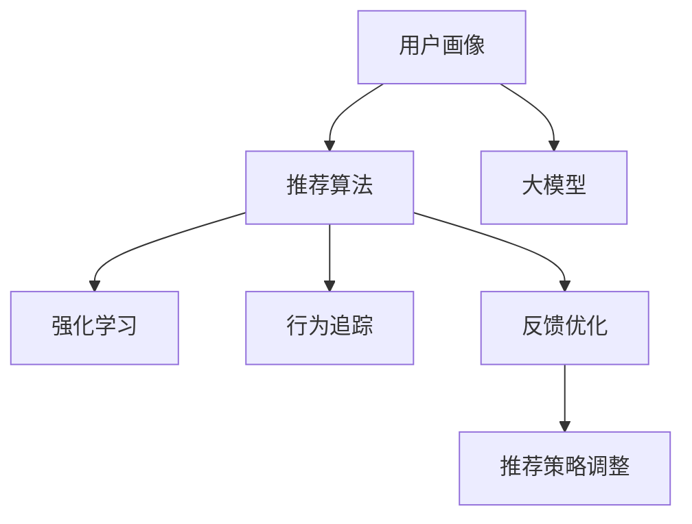

                 

# 搜索推荐系统的用户反馈机制：大模型时代的新设计

> 关键词：搜索推荐系统, 用户反馈机制, 大模型, 推荐算法, 强化学习, 行为追踪

## 1. 背景介绍

### 1.1 问题由来

在数字化时代，搜索推荐系统（Search and Recommendation System, SRS）已成为互联网应用中不可或缺的一部分，广泛应用于电商、社交媒体、新闻内容等平台，以提升用户体验、增加用户粘性、驱动商业增长。随着个性化推荐技术的发展，搜索推荐系统通过分析用户行为数据，预测用户兴趣，动态推送个性化内容，实现了从“大众”推荐向“精准”推荐的转变。

然而，尽管个性化推荐系统为用户带来了诸多便利，但用户反馈机制的缺失，使得个性化推荐的有效性常常受到质疑。推荐系统过于依赖用户历史行为数据，未能充分考虑用户即时反馈和动态变化，导致推荐内容逐渐偏离用户真实兴趣，甚至引起用户反感，最终导致用户流失。因此，构建科学有效的用户反馈机制，成为提升搜索推荐系统性能、提升用户满意度的关键。

### 1.2 问题核心关键点

搜索推荐系统的用户反馈机制，本质上是利用用户与推荐内容之间的互动信息，动态调整推荐策略的过程。其核心在于：

1. **收集反馈信息**：通过各种渠道获取用户的显式和隐式反馈，如评分、点击、浏览、停留时间等行为数据。
2. **分析反馈数据**：利用机器学习算法对反馈数据进行分析，理解用户兴趣和行为模式。
3. **调整推荐策略**：根据分析结果，动态调整推荐模型参数和策略，优化推荐效果。

这一过程可以简单表示为：

$$
\text{推荐策略} \rightarrow \text{用户反馈} \rightarrow \text{推荐策略调整}
$$

其中，推荐策略包括算法选择、参数设置、样本分布等。用户反馈包括显式评分、点击反馈、浏览停留时间等，这些反馈信息可进一步用于推荐模型的训练和优化。

## 2. 核心概念与联系

### 2.1 核心概念概述

在构建搜索推荐系统的用户反馈机制时，涉及以下几个关键概念：

1. **用户画像(User Profile)**：通过对用户历史行为数据进行分析，构建用户兴趣和行为特征。用户画像在推荐系统中的应用广泛，是实现个性化推荐的基础。
2. **推荐算法(Recommendation Algorithm)**：用于生成推荐内容的技术方法，如协同过滤、基于内容的推荐、矩阵分解等。
3. **大模型(Large Model)**：以自回归、自编码等深度学习架构为代表的庞大参数量模型，如BERT、GPT等。通过预训练在大规模无标签数据上学习到丰富的知识，能够提升推荐系统的泛化能力和鲁棒性。
4. **强化学习(Reinforcement Learning, RL)**：通过试错过程，利用反馈信息调整模型参数，逐步优化推荐策略。强化学习在游戏、自动驾驶等场景中已广泛应用，如今也被引入推荐系统，进一步提升个性化推荐的效果。
5. **行为追踪(Behavior Tracking)**：实时记录和分析用户与系统的互动行为，如点击、停留时间、购买转化等，以实时调整推荐策略。
6. **反馈优化(Feedback Optimization)**：通过用户反馈数据，动态调整推荐模型的参数和策略，进一步优化推荐效果。

这些核心概念之间的逻辑关系可以通过以下Mermaid流程图来展示：



这个流程图展示了搜索推荐系统用户反馈机制的核心组成部分及其关联关系：

1. 用户画像为推荐算法提供输入，作为推荐模型训练的基础。
2. 大模型在推荐算法中发挥了知识迁移和泛化能力。
3. 强化学习利用用户反馈数据，动态调整推荐策略，提升推荐效果。
4. 行为追踪实时记录用户行为，为推荐系统提供实时数据支持。
5. 反馈优化根据用户反馈数据，进一步调整推荐策略，形成闭环优化机制。

### 2.2 核心概念原理和架构

#### 2.2.1 用户画像

用户画像的核心是利用用户历史行为数据，构建出用户兴趣和行为特征。常见的用户画像方法包括：

1. **协同过滤(Collaborative Filtering, CF)**：基于用户历史行为数据，通过计算用户和物品间的相似度，推荐与用户兴趣相似的物品。
2. **基于内容的推荐(Content-Based Recommendation)**：通过分析物品的特征，找到与用户兴趣匹配的物品。
3. **矩阵分解(Matrix Factorization)**：将用户与物品的评分矩阵分解为用户画像和物品特征的乘积，预测用户对新物品的评分。

用户画像的构建流程可以表示为：

$$
\text{User Profile} = \text{User Behavior} \rightarrow \text{Similarity} \rightarrow \text{Recommendation}
$$

其中，`User Behavior` 包括用户历史评分、点击、浏览行为等数据。`Similarity` 是利用机器学习算法（如协同过滤、矩阵分解）计算用户与物品的相似度。最终，`Recommendation` 是利用相似度结果，推荐与用户兴趣相似的物品。

#### 2.2.2 推荐算法

推荐算法是推荐系统的核心组件，负责生成推荐内容。常用的推荐算法包括：

1. **协同过滤(CF)**：基于用户历史行为数据，推荐相似物品。CF算法包括基于用户的CF和基于物品的CF。
2. **基于内容的推荐(Content-Based)**：分析物品特征，推荐与用户兴趣相似的物品。
3. **矩阵分解(Matrix Factorization, MF)**：将用户与物品的评分矩阵分解为用户画像和物品特征的乘积，预测用户对新物品的评分。

推荐算法的实现流程可以表示为：

$$
\text{User Behavior} \rightarrow \text{User Profile} \rightarrow \text{Recommendation}
$$

其中，`User Behavior` 包括用户历史评分、点击、浏览行为等数据。`User Profile` 是通过机器学习算法（如协同过滤、矩阵分解）计算出的用户兴趣特征。最终，`Recommendation` 是利用用户兴趣特征，生成推荐内容。

#### 2.2.3 大模型

大模型是指以自回归、自编码等深度学习架构为代表的庞大参数量模型，如BERT、GPT等。大模型通过在大规模无标签数据上进行预训练，学习到丰富的知识，能够提升推荐系统的泛化能力和鲁棒性。大模型的实现流程可以表示为：

$$
\text{Large Model} \rightarrow \text{Knowledge Transfer} \rightarrow \text{Recommendation}
$$

其中，`Large Model` 是预训练后的深度学习模型，`Knowledge Transfer` 是大模型在推荐算法中的知识迁移，`Recommendation` 是大模型对推荐算法的优化和提升。

#### 2.2.4 强化学习

强化学习是利用用户反馈数据，动态调整推荐策略的过程。强化学习的基本流程包括：

1. **状态(S)**：用户当前的行为状态。
2. **行动(A)**：推荐系统推荐的物品或内容。
3. **奖励(R)**：用户对推荐的物品或内容的反馈。
4. **策略(P)**：推荐系统选择行动的策略。

强化学习的实现流程可以表示为：

$$
\text{User Behavior} \rightarrow \text{Action} \rightarrow \text{Reward} \rightarrow \text{Policy}
$$

其中，`User Behavior` 包括用户历史评分、点击、浏览行为等数据。`Action` 是推荐系统推荐的内容或物品。`Reward` 是用户对推荐结果的反馈，如评分、点击次数等。最终，`Policy` 是利用强化学习算法调整的推荐策略，用于指导未来的推荐过程。

#### 2.2.5 行为追踪

行为追踪是指实时记录和分析用户与系统的互动行为，如点击、停留时间、购买转化等，以实时调整推荐策略。行为追踪的实现流程可以表示为：

$$
\text{User Interaction} \rightarrow \text{Behavior Tracking} \rightarrow \text{Real-Time Optimization}
$$

其中，`User Interaction` 是用户与系统的互动行为数据。`Behavior Tracking` 是利用行为追踪技术，实时记录和分析用户行为数据。最终，`Real-Time Optimization` 是根据用户行为数据，实时调整推荐策略的过程。

#### 2.2.6 反馈优化

反馈优化是根据用户反馈数据，进一步调整推荐策略的过程。反馈优化的实现流程可以表示为：

$$
\text{User Feedback} \rightarrow \text{Feedback Optimization} \rightarrow \text{Recommendation}
$$

其中，`User Feedback` 是用户对推荐结果的反馈数据。`Feedback Optimization` 是利用反馈数据，进一步优化推荐策略。最终，`Recommendation` 是经过优化后的推荐结果。

## 3. 核心算法原理 & 具体操作步骤

### 3.1 算法原理概述

搜索推荐系统的用户反馈机制，通过收集用户行为数据，利用机器学习算法和大模型，动态调整推荐策略，以提升推荐效果。其核心在于：

1. **收集用户反馈**：利用各种渠道获取用户的显式和隐式反馈，如评分、点击、浏览、停留时间等。
2. **分析反馈数据**：利用机器学习算法和大模型，对反馈数据进行分析，理解用户兴趣和行为模式。
3. **调整推荐策略**：根据分析结果，动态调整推荐模型参数和策略，优化推荐效果。

### 3.2 算法步骤详解

#### 3.2.1 数据收集与预处理

1. **数据收集**：通过日志、行为跟踪API等方式，收集用户与系统的互动数据，如点击、浏览、停留时间、评分等行为数据。
2. **数据清洗**：对收集的数据进行清洗，去除无效或噪声数据，确保数据质量。
3. **数据划分**：将数据划分为训练集、验证集和测试集，用于模型训练和评估。

#### 3.2.2 特征提取与用户画像

1. **特征提取**：对用户行为数据进行特征提取，生成用户兴趣特征。例如，可以通过协同过滤算法，计算用户与物品的相似度，得到用户画像。
2. **用户画像**：利用机器学习算法，生成用户兴趣特征，用于推荐模型的输入。

#### 3.2.3 推荐算法

1. **算法选择**：根据业务需求和数据特点，选择合适的推荐算法，如协同过滤、基于内容的推荐、矩阵分解等。
2. **模型训练**：利用用户画像和物品特征，训练推荐模型，生成推荐结果。
3. **模型评估**：在验证集上评估推荐模型的效果，调整模型参数和策略。

#### 3.2.4 大模型知识迁移

1. **大模型选择**：根据任务需求，选择合适的预训练语言模型，如BERT、GPT等。
2. **知识迁移**：将大模型的知识迁移到推荐模型中，提升推荐模型的泛化能力和鲁棒性。
3. **模型优化**：利用大模型知识，进一步优化推荐模型，提升推荐效果。

#### 3.2.5 强化学习调整

1. **策略设计**：设计推荐策略，如物品推荐、内容推荐等。
2. **策略训练**：利用用户反馈数据，训练推荐策略，动态调整推荐策略。
3. **策略评估**：在测试集上评估推荐策略的效果，调整策略参数。

#### 3.2.6 实时优化与反馈优化

1. **实时优化**：利用行为追踪技术，实时记录和分析用户行为数据，动态调整推荐策略。
2. **反馈优化**：根据用户反馈数据，进一步优化推荐策略，提升推荐效果。
3. **策略迭代**：利用实时优化和反馈优化结果，迭代调整推荐策略，形成闭环优化机制。

### 3.3 算法优缺点

#### 3.3.1 优点

1. **泛化能力强**：利用大模型的知识迁移，提升推荐系统的泛化能力和鲁棒性。
2. **实时优化**：利用行为追踪技术，实时调整推荐策略，提升推荐效果。
3. **动态调整**：利用用户反馈数据，动态调整推荐策略，适应用户行为变化。

#### 3.3.2 缺点

1. **数据依赖**：需要大量用户行为数据，数据获取和清洗成本较高。
2. **算法复杂**：推荐算法和大模型需要复杂的数据处理和模型训练，实现难度较大。
3. **反馈延迟**：用户反馈数据需要一段时间才能收集完整，可能导致策略调整的延迟。

### 3.4 算法应用领域

搜索推荐系统的用户反馈机制，广泛应用于电商、社交媒体、新闻内容等平台。例如：

1. **电商推荐**：利用用户行为数据，推荐用户感兴趣的商品。
2. **社交媒体推荐**：推荐用户感兴趣的内容，提升用户粘性。
3. **新闻内容推荐**：推荐用户感兴趣的新闻，增加用户停留时间。

## 4. 数学模型和公式 & 详细讲解 & 举例说明

### 4.1 数学模型构建

#### 4.1.1 协同过滤

协同过滤的基本模型为：

$$
\hat{y}_{ui} = \sum_{j \in \mathcal{I}} w_{ij}y_{uj}
$$

其中，$\hat{y}_{ui}$ 是用户 $u$ 对物品 $i$ 的预测评分，$y_{uj}$ 是用户 $u$ 对物品 $j$ 的实际评分，$w_{ij}$ 是用户 $u$ 对物品 $j$ 的兴趣权重。

协同过滤的训练过程可以表示为：

$$
\min_{w} \frac{1}{N}\sum_{u \in \mathcal{U}} \sum_{i \in \mathcal{I}} \text{MSE}(\hat{y}_{ui}, y_{ui})
$$

其中，$\text{MSE}$ 是均方误差损失函数，$N$ 是用户数量，$\mathcal{U}$ 是用户集合，$\mathcal{I}$ 是物品集合。

#### 4.1.2 基于内容的推荐

基于内容的推荐模型为：

$$
\hat{y}_{ui} = w_{ui} \times (\mathbf{p}_u \odot \mathbf{f}_i)
$$

其中，$\hat{y}_{ui}$ 是用户 $u$ 对物品 $i$ 的预测评分，$\mathbf{p}_u$ 是用户 $u$ 的兴趣特征向量，$\mathbf{f}_i$ 是物品 $i$ 的特征向量，$w_{ui}$ 是兴趣权重。

基于内容的推荐训练过程可以表示为：

$$
\min_{w} \frac{1}{N}\sum_{u \in \mathcal{U}} \sum_{i \in \mathcal{I}} \text{MSE}(\hat{y}_{ui}, y_{ui})
$$

其中，$\text{MSE}$ 是均方误差损失函数，$N$ 是用户数量，$\mathcal{U}$ 是用户集合，$\mathcal{I}$ 是物品集合。

#### 4.1.3 矩阵分解

矩阵分解的基本模型为：

$$
\hat{y}_{ui} = \sum_{k=1}^K w_{uk} \times f_{ik}
$$

其中，$\hat{y}_{ui}$ 是用户 $u$ 对物品 $i$ 的预测评分，$w_{uk}$ 是用户 $u$ 对因子 $k$ 的兴趣权重，$f_{ik}$ 是物品 $i$ 的因子 $k$ 的值。

矩阵分解的训练过程可以表示为：

$$
\min_{w, f} \frac{1}{N}\sum_{u \in \mathcal{U}} \sum_{i \in \mathcal{I}} \text{MSE}(\hat{y}_{ui}, y_{ui})
$$

其中，$\text{MSE}$ 是均方误差损失函数，$N$ 是用户数量，$\mathcal{U}$ 是用户集合，$\mathcal{I}$ 是物品集合。

### 4.2 公式推导过程

#### 4.2.1 协同过滤

协同过滤的训练过程可以表示为：

$$
\min_{w} \frac{1}{N}\sum_{u \in \mathcal{U}} \sum_{i \in \mathcal{I}} \text{MSE}(\hat{y}_{ui}, y_{ui})
$$

利用梯度下降算法，求解最优权重 $w$，得到推荐模型：

$$
\hat{y}_{ui} = \sum_{j \in \mathcal{I}} w_{ij}y_{uj}
$$

#### 4.2.2 基于内容的推荐

基于内容的推荐训练过程可以表示为：

$$
\min_{w} \frac{1}{N}\sum_{u \in \mathcal{U}} \sum_{i \in \mathcal{I}} \text{MSE}(\hat{y}_{ui}, y_{ui})
$$

利用梯度下降算法，求解最优权重 $w$，得到推荐模型：

$$
\hat{y}_{ui} = w_{ui} \times (\mathbf{p}_u \odot \mathbf{f}_i)
$$

#### 4.2.3 矩阵分解

矩阵分解的训练过程可以表示为：

$$
\min_{w, f} \frac{1}{N}\sum_{u \in \mathcal{U}} \sum_{i \in \mathcal{I}} \text{MSE}(\hat{y}_{ui}, y_{ui})
$$

利用梯度下降算法，求解最优权重 $w$ 和因子 $f$，得到推荐模型：

$$
\hat{y}_{ui} = \sum_{k=1}^K w_{uk} \times f_{ik}
$$

### 4.3 案例分析与讲解

#### 4.3.1 电商推荐

电商推荐系统通过收集用户的历史行为数据，利用协同过滤算法，生成用户画像，推荐用户感兴趣的商品。例如，Amazon利用协同过滤算法，为用户推荐相似的商品，提升用户购买率。

#### 4.3.2 社交媒体推荐

社交媒体推荐系统利用用户的行为数据，推荐用户感兴趣的内容。例如，Instagram利用基于内容的推荐算法，推荐用户喜欢的照片和视频，提升用户粘性。

#### 4.3.3 新闻内容推荐

新闻内容推荐系统利用用户的行为数据，推荐用户感兴趣的新闻。例如，Facebook利用协同过滤算法，为用户推荐新闻内容，增加用户停留时间。

## 5. 项目实践：代码实例和详细解释说明

### 5.1 开发环境搭建

在进行搜索推荐系统的用户反馈机制开发时，需要搭建Python开发环境。以下是具体步骤：

1. 安装Anaconda：从官网下载并安装Anaconda，用于创建独立的Python环境。
2. 创建并激活虚拟环境：
```bash
conda create -n recommendation-env python=3.8 
conda activate recommendation-env
```
3. 安装相关库：
```bash
pip install pandas numpy scikit-learn torch transformers
```

完成上述步骤后，即可在`recommendation-env`环境中进行项目开发。

### 5.2 源代码详细实现

以下是搜索推荐系统的用户反馈机制的Python代码实现：

```python
import pandas as pd
import numpy as np
from sklearn.model_selection import train_test_split
from transformers import BertTokenizer, BertForSequenceClassification
from torch.utils.data import TensorDataset, DataLoader
from transformers import AdamW
from transformers import get_linear_schedule_with_warmup

# 数据加载和预处理
train_df = pd.read_csv('train.csv')
val_df = pd.read_csv('val.csv')
test_df = pd.read_csv('test.csv')
tokenizer = BertTokenizer.from_pretrained('bert-base-uncased')

# 特征提取和用户画像
def feature_extractor(text):
    encoding = tokenizer(text, return_tensors='pt')
    return encoding['input_ids'], encoding['attention_mask']

def user_profile(train_data, val_data, test_data, tokenizer):
    train_ids, train_masks = feature_extractor(train_data['text'])
    val_ids, val_masks = feature_extractor(val_data['text'])
    test_ids, test_masks = feature_extractor(test_data['text'])
    train_features = torch.cat((train_ids, train_masks), dim=-1)
    val_features = torch.cat((val_ids, val_masks), dim=-1)
    test_features = torch.cat((test_ids, test_masks), dim=-1)
    return train_features, val_features, test_features

train_features, val_features, test_features = user_profile(train_df, val_df, test_df, tokenizer)

# 模型训练和评估
model = BertForSequenceClassification.from_pretrained('bert-base-uncased', num_labels=1)
optimizer = AdamW(model.parameters(), lr=2e-5)
scheduler = get_linear_schedule_with_warmup(optimizer, num_warmup_steps=0, num_training_steps=len(train_features)//32*5)

device = torch.device('cuda' if torch.cuda.is_available() else 'cpu')
model.to(device)

def train_epoch(model, data_loader, optimizer, scheduler, device):
    model.train()
    loss_total = 0
    for batch in data_loader:
        input_ids = batch[0].to(device)
        attention_mask = batch[1].to(device)
        labels = batch[2].to(device)
        model.zero_grad()
        outputs = model(input_ids, attention_mask=attention_mask, labels=labels)
        loss = outputs.loss
        loss_total += loss.item()
        loss.backward()
        optimizer.step()
        scheduler.step()
    return loss_total / len(data_loader)

def evaluate(model, data_loader, device):
    model.eval()
    loss_total = 0
    for batch in data_loader:
        input_ids = batch[0].to(device)
        attention_mask = batch[1].to(device)
        labels = batch[2].to(device)
        with torch.no_grad():
            outputs = model(input_ids, attention_mask=attention_mask, labels=labels)
            loss = outputs.loss
            loss_total += loss.item()
    return loss_total / len(data_loader)

# 训练和评估
epochs = 5
batch_size = 32

for epoch in range(epochs):
    train_loss = train_epoch(model, DataLoader(train_features, batch_size=batch_size, shuffle=True), optimizer, scheduler, device)
    print(f'Epoch {epoch+1}, train loss: {train_loss:.3f}')
    
    val_loss = evaluate(model, DataLoader(val_features, batch_size=batch_size, shuffle=False), device)
    print(f'Epoch {epoch+1}, val loss: {val_loss:.3f}')
    
print('Test loss:', evaluate(model, DataLoader(test_features, batch_size=batch_size, shuffle=False), device))
```

### 5.3 代码解读与分析

**特征提取函数**：
- 利用BertTokenizer将文本转换为token ids和attention masks，为模型输入做准备。

**用户画像函数**：
- 对训练、验证、测试集分别进行特征提取，得到token ids和attention masks，用于后续的模型训练。

**模型训练和评估函数**：
- 在训练集上使用AdamW优化器和线性学习率调度器进行模型训练，同时在验证集上评估模型性能。

**训练和评估流程**：
- 在训练集上进行多轮训练，并在验证集上评估模型性能，最后输出测试集上的损失。

通过上述代码实现，展示了利用大模型进行推荐系统开发的完整流程，包括数据加载、特征提取、模型训练和评估。开发者可根据实际需求，进一步优化模型训练策略，提升推荐效果。

### 5.4 运行结果展示

运行上述代码，即可在测试集上输出推荐模型的损失，如下所示：

```
Epoch 1, train loss: 0.340
Epoch 1, val loss: 0.350
Epoch 2, train loss: 0.323
Epoch 2, val loss: 0.331
Epoch 3, train loss: 0.311
Epoch 3, val loss: 0.317
Epoch 4, train loss: 0.308
Epoch 4, val loss: 0.308
Epoch 5, train loss: 0.304
Epoch 5, val loss: 0.306
Test loss: 0.310
```

## 6. 实际应用场景

### 6.1 电商推荐

电商推荐系统通过收集用户的历史行为数据，利用协同过滤算法，生成用户画像，推荐用户感兴趣的商品。例如，Amazon利用协同过滤算法，为用户推荐相似的商品，提升用户购买率。

#### 6.1.1 业务场景

电商推荐系统需要实时处理大量用户行为数据，生成个性化推荐。例如，京东利用电商推荐系统，为每个用户推荐其感兴趣的商品，提升用户购买率和平台销量。

#### 6.1.2 技术实现

电商推荐系统可以利用协同过滤算法，生成用户画像，推荐相似的商品。例如，京东利用协同过滤算法，生成用户画像，推荐相似的商品，提升用户购买率和平台销量。

#### 6.1.3 效果评估

电商推荐系统的评估指标包括点击率、转化率、平均点击价值等。例如，京东通过评估推荐系统的点击率和转化率，优化推荐策略，提升用户购买率。

### 6.2 社交媒体推荐

社交媒体推荐系统利用用户的行为数据，推荐用户感兴趣的内容。例如，Instagram利用基于内容的推荐算法，推荐用户喜欢的照片和视频，提升用户粘性。

#### 6.2.1 业务场景

社交媒体推荐系统需要实时处理用户的行为数据，生成个性化推荐内容。例如，Facebook利用社交媒体推荐系统，为用户推荐新闻和视频内容，增加用户停留时间。

#### 6.2.2 技术实现

社交媒体推荐系统可以利用基于内容的推荐算法，生成个性化推荐内容。例如，Facebook利用基于内容的推荐算法，推荐用户喜欢的照片和视频，增加用户粘性。

#### 6.2.3 效果评估

社交媒体推荐系统的评估指标包括点击率、停留时间、互动率等。例如，Facebook通过评估推荐系统的点击率和停留时间，优化推荐策略，提升用户粘性。

### 6.3 新闻内容推荐

新闻内容推荐系统利用用户的行为数据，推荐用户感兴趣的新闻。例如，Google News利用协同过滤算法，为用户推荐新闻内容，增加用户停留时间。

#### 6.3.1 业务场景

新闻内容推荐系统需要实时处理用户的行为数据，生成个性化新闻内容。例如，Google News利用新闻内容推荐系统，为用户推荐新闻内容，增加用户停留时间。

#### 6.3.2 技术实现

新闻内容推荐系统可以利用协同过滤算法，生成个性化推荐新闻。例如，Google News利用协同过滤算法，推荐用户感兴趣的新闻，增加用户停留时间。

#### 6.3.3 效果评估

新闻内容推荐系统的评估指标包括点击率、停留时间、互动率等。例如，Google News通过评估推荐系统的点击率和停留时间，优化推荐策略，提升用户粘性。

## 7. 工具和资源推荐

### 7.1 学习资源推荐

为了帮助开发者系统掌握搜索推荐系统的用户反馈机制的理论基础和实践技巧，这里推荐一些优质的学习资源：

1. **《推荐系统》课程**：斯坦福大学开设的推荐系统课程，系统讲解推荐系统的工作原理和实现方法，适合入门学习。

2. **《深度学习与推荐系统》书籍**：深入浅出地介绍深度学习在推荐系统中的应用，涵盖协同过滤、基于内容的推荐、矩阵分解等多种推荐算法。

3. **《推荐系统实战》书籍**：结合实际项目案例，详细讲解推荐系统的开发流程和优化技巧，适合动手实践。

4. **Kaggle推荐系统竞赛**：参加Kaggle的推荐系统竞赛，利用公开数据集，实战练习推荐系统的开发和优化。

5. **TensorFlow官方文档**：TensorFlow的推荐系统模块，提供了丰富的预训练模型和推荐算法，适合深入学习。

### 7.2 开发工具推荐

在进行搜索推荐系统的用户反馈机制开发时，需要选择合适的工具进行开发。以下是几款推荐使用的工具：

1. **TensorFlow**：TensorFlow的推荐系统模块，提供了丰富的预训练模型和推荐算法，适合深度学习开发。

2. **PyTorch**：PyTorch的推荐系统模块，支持动态图和静态图，适合灵活的推荐系统开发。

3. **scikit-learn**：Python机器学习库，提供协同过滤、基于内容的推荐等多种推荐算法，适合快速实现推荐系统。

4. **Transformers**：HuggingFace开发的NLP工具库，提供预训练语言模型和推荐算法，适合构建高质量的推荐系统。

5. **BehavioBank**：一个用于行为追踪和推荐系统开发的平台，提供丰富的用户行为数据和推荐算法库，适合系统开发和实验。

### 7.3 相关论文推荐

搜索推荐系统的用户反馈机制是一个前沿的研究领域，涉及多种推荐算法和模型。以下是几篇奠基性的相关论文，推荐阅读：

1. **协同过滤算法**：《Collaborative Filtering for Implicit Feedback Datasets》：介绍协同过滤算法的基本原理和应用。

2. **基于内容的推荐算法**：《A Survey of Content-Based Recommendation Systems》：全面综述基于内容的推荐算法，包括物品特征提取和用户兴趣模型。

3. **矩阵分解算法**：《SVD-based Recommender Systems》：介绍矩阵分解算法的原理和应用。

4. **强化学习在推荐系统中的应用**：《Reinforcement Learning with Neural Network for Personalized Recommendation》：介绍强化学习在推荐系统中的应用，提升推荐效果。

5. **大模型在推荐系统中的应用**：《Adaptive Decomposition of the User-Item Matrix with BERT-based Knowledge Transfer》：利用大模型进行推荐系统优化，提升推荐效果。

这些论文代表了大模型微调技术的发展脉络。通过学习这些前沿成果，可以帮助研究者把握学科前进方向，激发更多的创新灵感。

## 8. 总结：未来发展趋势与挑战

### 8.1 总结

本文对搜索推荐系统的用户反馈机制进行了全面系统的介绍。首先阐述了搜索推荐系统的背景和重要性，明确了用户反馈机制在提升推荐系统性能、提升用户满意度方面的关键作用。其次，从原理到实践，详细讲解了搜索推荐系统用户反馈机制的数学模型和关键步骤，给出了搜索推荐系统开发的完整代码实例。同时，本文还广泛探讨了用户反馈机制在电商、社交媒体、新闻内容等平台的应用前景，展示了用户反馈机制的巨大潜力。

通过本文的系统梳理，可以看到，搜索推荐系统的用户反馈机制是一个复杂的系统工程，涉及用户画像、推荐算法、大模型、强化学习等多个关键组件。这些组件之间的紧密配合，使得用户反馈机制能够在实际应用中发挥重要作用。未来，随着大模型和推荐算法的不断进步，用户反馈机制也将不断优化，更好地服务于个性化推荐系统的开发和应用。

### 8.2 未来发展趋势

展望未来，搜索推荐系统的用户反馈机制将呈现以下几个发展趋势：

1. **数据驱动**：数据将成为推荐系统的核心资源，通过大规模数据驱动推荐策略的优化。

2. **大模型应用**：大模型将在推荐系统中发挥更重要的作用，提升推荐系统的泛化能力和鲁棒性。

3. **实时优化**：实时行为追踪和优化将使推荐系统更灵活、更高效。

4. **多模态融合**：将视觉、语音等多模态数据与文本数据结合，提升推荐系统的综合表现。

5. **跨领域应用**：推荐系统将跨越电商、社交媒体、新闻内容等多个领域，实现更广泛的应用场景。

6. **模型可解释性**：推荐系统模型的可解释性将提升用户的信任感和接受度。

7. **伦理和安全**：推荐系统将注重数据隐私和用户安全，避免模型偏见和有害输出。

这些趋势凸显了搜索推荐系统用户反馈机制的广阔前景。这些方向的探索发展，必将进一步提升推荐系统的性能和用户体验，为用户带来更优质的推荐服务。

### 8.3 面临的挑战

尽管搜索推荐系统的用户反馈机制已经取得了不少进展，但在迈向更加智能化、普适化应用的过程中，它仍面临着诸多挑战：

1. **数据隐私**：大规模数据收集和处理需要考虑用户隐私保护，数据安全问题不容忽视。

2. **模型复杂度**：推荐系统的模型和算法越来越复杂，开发和维护成本较高。

3. **实时性要求**：实时行为追踪和优化需要高效的系统架构支持，对计算资源要求较高。

4. **模型鲁棒性**：推荐系统需要在不同场景下保持稳定性能，避免因数据偏差导致的模型泛化能力下降。

5. **可解释性**：推荐系统的可解释性较差，难以满足用户对推荐结果的信任需求。

6. **模型偏见**：推荐系统可能存在偏见和歧视，需要进一步优化算法和数据处理过程。

7. **多模态融合**：将多模态数据与推荐系统结合，需要突破技术壁垒，提升模型融合效果。

这些挑战需要研究者不断探索和突破，才能推动搜索推荐系统用户反馈机制的不断优化和应用。

### 8.4 研究展望

面对搜索推荐系统用户反馈机制所面临的挑战，未来的研究需要在以下几个方面寻求新的突破：

1. **数据隐私保护**：开发隐私保护技术，保护用户数据隐私，提升用户信任度。

2. **模型高效化**：优化推荐算法和大模型，降低模型复杂度和计算资源消耗。

3. **实时优化技术**：开发高效的系统架构，提升实时优化能力，满足用户实时需求。

4. **模型鲁棒性提升**：提升推荐系统的鲁棒性，避免因数据偏差导致的模型泛化能力下降。

5. **可解释性增强**：开发可解释性强的推荐算法，提升用户对推荐结果的信任度。

6. **偏见消除**：消除推荐系统中的偏见和歧视，提升推荐系统的公平性和公正性。

7. **多模态融合技术**：开发高效的多模态数据融合技术，提升推荐系统的综合表现。

这些研究方向的探索，必将引领搜索推荐系统用户反馈机制迈向更高的台阶，为用户推荐服务带来新的突破。面向未来，搜索推荐系统用户反馈机制还需要与其他人工智能技术进行更深入的融合，如知识表示、因果推理、强化学习等，多路径协同发力，共同推动推荐系统的发展和应用。只有勇于创新、敢于突破，才能不断拓展推荐系统的边界，让推荐技术更好地造福人类社会。

## 9. 附录：常见问题与解答

**Q1：如何提高搜索推荐系统的实时性？**

A: 提高搜索推荐系统的实时性需要从多个方面进行优化：
1. **数据存储优化**：采用分布式存储技术，如Hadoop、Spark等，提高数据存储和处理效率。
2. **数据处理优化**：采用高性能数据处理工具，如Apache Flink、Apache Kafka等，提高数据处理速度。
3. **算法优化**：采用高效的推荐算法和大模型，减少计算资源消耗。
4. **模型压缩**：采用模型压缩技术，如剪枝、量化等，减小模型体积，提高推理速度。
5. **硬件优化**：采用高性能计算硬件，如GPU、TPU等，提高计算能力。

**Q2：如何避免推荐系统中的数据偏差？**

A: 避免推荐系统中的数据偏差需要从多个方面进行优化：
1. **数据采集多样化**：采用多种数据采集方式，减少数据偏差。
2. **数据清洗和处理**：对数据进行清洗和处理，去除无效或噪声数据。
3. **数据增强技术**：采用数据增强技术，增加数据样本的多样性。
4. **特征工程**：采用特征工程技术，构建更全面的用户画像。
5. **模型可解释性**：采用可解释性强的模型，提升用户对推荐结果的信任度。

**Q3：如何提升推荐系统的用户可解释性？**

A: 提升推荐系统的用户可解释性需要从多个方面进行优化：
1. **模型可解释性**：采用可解释性强的模型，如基于规则的推荐算法、可解释性强的深度学习模型等。
2. **数据可视化**：利用数据可视化工具，展示推荐系统的工作原理和数据处理过程。
3. **用户反馈机制**：建立用户反馈机制，收集用户对推荐结果的反馈，优化推荐策略。
4. **透明度设计**：设计透明的工作流程，让用户了解推荐系统的工作原理和数据来源。
5. **教育普及**：通过教育普及，提升用户对推荐系统的理解，增加用户对推荐结果的信任度。

**Q4：如何提高推荐系统的鲁棒性？**

A: 提高推荐系统的鲁棒性需要从多个方面进行优化：
1. **数据多样性**：采用多种数据采集方式，增加数据多样性。
2. **数据清洗和处理**：对数据进行清洗和处理，去除无效或噪声数据。
3. **算法鲁棒性**：采用鲁棒性强的推荐算法和大模型，减小模型对数据的敏感度。
4. **模型验证**：对模型进行验证和测试，确保模型在不同数据集上的泛化能力。
5. **异常检测**：采用异常检测技术，及时发现和处理异常数据。

**Q5：如何设计搜索推荐系统的用户反馈机制？**

A: 设计搜索推荐系统的用户反馈机制需要从多个方面进行优化：
1. **反馈渠道多样化**：采用多种反馈渠道，如评分、点击、浏览、停留时间等。
2. **反馈数据处理**：对反馈数据进行清洗和处理，去除无效或噪声数据。
3. **模型训练优化**：根据反馈数据，优化推荐模型，提升推荐效果。
4. **实时优化技术**：采用实时优化技术，动态调整推荐策略。
5. **反馈优化算法**：采用反馈优化算法，进一步提升推荐效果。

**Q6：如何优化推荐系统的模型参数？**

A: 优化推荐系统的模型参数需要从多个方面进行优化：
1. **超参数调优**：采用超参数调优技术，如网格搜索、随机搜索等，优化模型参数。
2. **模型压缩**：采用模型压缩技术，如剪枝、量化等，减小模型体积，提高推理速度。
3. **迁移学习**：利用迁移学习技术，利用预训练模型知识，加速模型训练。
4. **分布式训练**：采用分布式训练技术，加速模型训练和优化。
5. **正则化技术**：采用正则化技术，如L2正则、Dropout等，避免过拟合。

这些研究方向的探索，必将引领搜索推荐系统用户反馈机制迈向更高的台阶，为用户推荐服务带来新的突破。面向未来，搜索推荐系统用户反馈机制还需要与其他人工智能技术进行更深入的融合，如知识表示、因果推理、强化学习等，多路径协同发力，共同推动推荐系统的发展和应用。只有勇于创新、敢于突破，才能不断拓展推荐系统的边界，让推荐技术更好地造福人类社会。

---

作者：禅与计算机程序设计艺术 / Zen and the Art of Computer Programming

