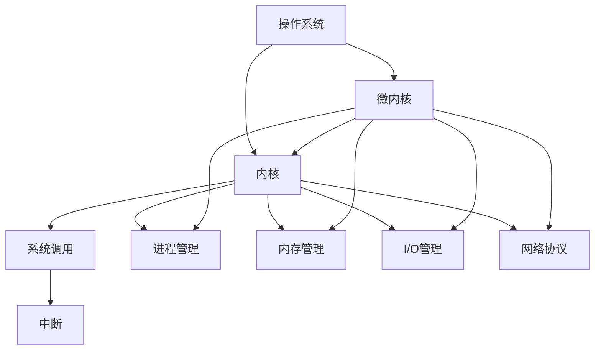

                 

# 操作系统内核开发：深入理解系统底层

> 关键词：操作系统, 内核开发, 底层原理, 系统架构, 微内核, 进程管理, 内存管理, I/O管理, 文件系统, 网络协议

## 1. 背景介绍

### 1.1 问题由来
操作系统是计算机系统的核心，负责管理硬件资源、调度进程、提供文件系统、网络服务等关键功能。理解和开发操作系统内核，对于深入掌握计算机系统的底层原理、提高系统性能、开发定制化系统等都具有重要意义。

然而，操作系统内核的开发难度高，涉及大量的系统调用、中断处理、内存管理等复杂问题。即使有一定编程经验的技术人员，也需要经过长期的学习和实践，才能掌握内核开发的精髓。

本文旨在通过系统性的介绍操作系统内核开发的核心概念和实际技术，帮助读者深入理解系统底层，掌握内核开发的艺术。

### 1.2 问题核心关键点
操作系统内核开发的核心关键点包括：

1. **系统调用**：操作系统通过系统调用向用户提供硬件和资源访问接口。
2. **中断处理**：中断处理是内核的重要功能，用于处理CPU异常事件。
3. **内存管理**：内核负责管理物理内存和虚拟内存，支持进程的内存隔离。
4. **进程管理**：内核通过调度算法和进程间通信机制管理进程。
5. **I/O管理**：内核提供文件系统和设备驱动，管理I/O操作。
6. **网络协议**：内核实现网络协议栈，提供网络通信服务。
7. **系统架构**：理解不同的操作系统架构（如微内核、单内核）对内核开发的影响。

掌握这些关键点，可以帮助读者全面理解操作系统内核的核心功能和实现方法。

### 1.3 问题研究意义
深入理解操作系统内核开发，具有重要的理论和实践意义：

1. **提高系统性能**：通过优化内核实现，可以显著提高系统的响应速度和资源利用率。
2. **开发定制化系统**：内核开发能力是构建高性能、低延迟、高安全性的定制化操作系统的基础。
3. **增强系统安全性**：理解内核开发可以更好地设计安全机制，防范系统攻击和漏洞。
4. **促进技术创新**：内核开发技术是推动操作系统演进和创新、支持新硬件和网络协议等新技术的重要驱动力。
5. **支持系统升级**：内核开发能力有助于应对硬件和软件升级需求，保持系统长期稳定性。

## 2. 核心概念与联系

### 2.1 核心概念概述

为更好地理解操作系统内核开发，本节将介绍几个密切相关的核心概念：

- **操作系统 (OS)**：负责管理计算机系统硬件和软件资源的程序集合。
- **内核 (Kernel)**：操作系统的核心部分，直接管理硬件资源和提供系统调用。
- **系统调用 (Syscall)**：应用程序通过系统调用请求操作系统服务。
- **中断 (Interrupt)**：CPU向操作系统报告异常事件，如I/O操作完成。
- **进程 (Process)**：操作系统中运行的程序实例，具有独立的地址空间和资源。
- **内存管理 (Memory Management)**：内核负责物理和虚拟内存的分配和管理。
- **I/O管理 (I/O Management)**：内核提供文件系统和设备驱动，管理输入输出。
- **网络协议 (Network Protocol)**：内核实现网络协议栈，提供网络通信服务。
- **微内核 (Microkernel)**：将内核功能分解成最小化的核心部分和大量的小内核模块。

这些核心概念之间的逻辑关系可以通过以下Mermaid流程图来展示：



这个流程图展示了好几个核心概念及其之间的关系：

1. 操作系统作为整体，管理内核和其他系统组件。
2. 内核是操作系统的核心，提供系统调用、中断处理、进程管理、内存管理、I/O管理和网络协议等核心功能。
3. 系统调用和中断是内核的重要交互方式。
4. 进程管理、内存管理、I/O管理和网络协议是内核的四大功能模块。
5. 微内核是现代操作系统架构的重要组成部分，将内核功能分解为最小化的核心部分和多个小内核模块。

这些概念共同构成了操作系统的核心功能和实现框架，帮助读者理解内核开发的复杂性和系统性。

## 3. 核心算法原理 & 具体操作步骤
### 3.1 算法原理概述

操作系统内核开发的核心算法原理包括：

- **系统调用机制**：应用程序通过系统调用请求操作系统服务，系统调用由内核处理。
- **中断处理机制**：操作系统通过中断处理机制响应硬件事件，如I/O操作完成、时钟中断等。
- **进程管理算法**：包括调度算法、进程间通信机制等，用于管理进程资源和执行顺序。
- **内存管理算法**：包括虚拟内存管理、页面置换算法等，用于管理进程的内存空间。
- **I/O管理算法**：包括文件系统实现、设备驱动等，用于管理I/O设备和文件操作。
- **网络协议实现**：包括TCP/IP协议栈、网络接口驱动等，用于实现网络通信服务。

### 3.2 算法步骤详解

操作系统内核开发一般包括以下几个关键步骤：

**Step 1: 了解系统架构**
- 选择操作系统架构（如微内核、单内核），理解其优缺点和适用场景。
- 熟悉操作系统的基本概念和组件，如系统调用、中断、进程、内存、I/O、网络等。

**Step 2: 设计系统调用接口**
- 设计系统调用的基本框架，包括调用方式、返回值等。
- 实现系统调用的具体功能，如文件操作、进程控制、网络通信等。

**Step 3: 实现中断处理程序**
- 设计中断处理程序的基本流程，包括中断向量表、中断处理函数等。
- 实现具体的中断处理逻辑，如I/O中断、异常中断、定时器中断等。

**Step 4: 管理进程和内存**
- 设计进程管理的调度算法，如优先级调度、时间片轮转等。
- 实现进程间通信机制，如信号量、管道、消息队列等。
- 设计内存管理的数据结构和算法，如分页、分段、虚拟内存等。

**Step 5: 实现I/O管理和网络协议**
- 设计文件系统和设备驱动，实现文件打开、读取、写入等操作。
- 实现网络协议栈，包括TCP/IP协议、路由表、ARP表等。
- 实现网络接口驱动，处理网络数据包的接收和发送。

**Step 6: 编写测试和调试代码**
- 编写单元测试代码，验证系统调用的正确性。
- 使用调试工具（如GDB、Valgrind等），查找和修复代码中的错误。

**Step 7: 部署和优化系统**
- 将内核代码编译为可执行文件，并部署到目标系统。
- 使用性能分析工具（如Profile、Benchmark等），评估和优化系统性能。

### 3.3 算法优缺点

操作系统内核开发的核心算法具有以下优点：

- **模块化和可扩展性**：通过模块化的设计，内核可以灵活扩展和维护。
- **高效性和稳定性**：操作系统内核的稳定性和高效性是系统可靠性的基础。
- **资源优化和保护**：内核管理硬件资源，实现内存隔离和进程保护。

同时，该算法也存在一些缺点：

- **开发复杂度**：内核开发的复杂度较高，涉及大量的系统调用、中断处理、内存管理等。
- **调试困难**：内核代码的调试复杂度较高，需要使用专业的调试工具。
- **性能瓶颈**：内核的性能瓶颈可能成为系统性能的瓶颈。

尽管存在这些局限性，但内核开发的模块化和可扩展性，使得操作系统在不断发展中保持了较高的灵活性和适应性。

### 3.4 算法应用领域

操作系统内核开发的应用领域广泛，涵盖以下几个方面：

- **服务器操作系统**：如Linux、Unix等，为用户提供高性能、稳定性和安全性。
- **嵌入式操作系统**：如RTOS、uClinux等，支持资源受限的设备，如手机、物联网设备等。
- **桌面操作系统**：如Windows、macOS等，提供用户界面和应用支持。
- **移动操作系统**：如iOS、Android等，优化移动设备的性能和用户体验。

除了这些主流领域，内核开发技术还广泛应用于各种定制化的操作系统开发中，如工业控制、安全监控、网络设备等。

## 4. 数学模型和公式 & 详细讲解 & 举例说明

### 4.1 数学模型构建

操作系统内核开发中，很多算法都可以用数学模型来描述。例如，进程调度算法、页面置换算法、路由算法等都可以用数学模型来分析和优化。

以下以页面置换算法为例，介绍数学模型的构建和优化。

假设一个进程访问了一个页面，而系统当前内存已满，需要替换一个页面。页面置换算法的目标是最小化页面替换次数和页面替换代价。常见的页面置换算法包括LRU（Least Recently Used）、FIFO（First-In-First-Out）、Optimal（Optimal Page Replacement）等。

我们可以用数学模型来描述页面置换算法的性能：

$$
\text{Optimal Cost} = \sum_{i=1}^n \min_{j<i} c_{ij}
$$

其中 $c_{ij}$ 表示在时间 $i$ 访问页面 $j$ 的成本。Optimal Cost表示最优页面置换策略的总成本。

### 4.2 公式推导过程

以下是Optimal Page Replacement的公式推导过程：

假设页面访问序列为 $P_1, P_2, \ldots, P_n$，系统初始内存为 $k$ 个页面，页面大小为 $s$。假设页面访问顺序为 $P_1, P_2, \ldots, P_n$，系统在第 $i$ 个时刻访问页面 $P_i$。

如果页面 $P_i$ 在内存中，则访问代价为 $0$。如果页面 $P_i$ 不在内存中，则从内存中选择一个最长时间未被访问的页面 $P_j$ 替换掉。假设页面 $P_j$ 的访问代价为 $c_{ij}$。

对于Optimal Page Replacement，选择 $P_j$ 的策略是最长时间未被访问，即：

$$
j = \min_{l=1}^i \max_{j=1}^l p_j
$$

其中 $p_j$ 表示页面 $P_j$ 的访问时间。

通过上述公式，我们可以推导出Optimal Page Replacement的总成本为：

$$
\text{Optimal Cost} = \sum_{i=1}^n \min_{j<i} c_{ij}
$$

### 4.3 案例分析与讲解

假设页面访问序列为 $P_1, P_2, P_3, P_4, P_5, P_1, P_2, P_3, P_4, P_5$，系统初始内存为2个页面，页面大小为1。

对于页面 $P_1$，第一次访问时，因为内存未满，所以访问代价为 $0$。

对于页面 $P_2$，第一次访问时，因为内存未满，所以访问代价为 $0$。

对于页面 $P_3$，第一次访问时，因为内存未满，所以访问代价为 $0$。

对于页面 $P_4$，第一次访问时，因为内存未满，所以访问代价为 $0$。

对于页面 $P_5$，第一次访问时，因为内存未满，所以访问代价为 $0$。

对于页面 $P_1$，第二次访问时，因为内存已满，需要替换页面 $P_2$。页面 $P_2$ 的访问代价为 $1$。

对于页面 $P_2$，第二次访问时，因为内存已满，需要替换页面 $P_3$。页面 $P_3$ 的访问代价为 $2$。

对于页面 $P_3$，第二次访问时，因为内存已满，需要替换页面 $P_4$。页面 $P_4$ 的访问代价为 $3$。

对于页面 $P_4$，第二次访问时，因为内存已满，需要替换页面 $P_5$。页面 $P_5$ 的访问代价为 $4$。

对于页面 $P_1$，第三次访问时，因为内存已满，需要替换页面 $P_2$。页面 $P_2$ 的访问代价为 $5$。

对于页面 $P_2$，第三次访问时，因为内存已满，需要替换页面 $P_3$。页面 $P_3$ 的访问代价为 $6$。

对于页面 $P_3$，第三次访问时，因为内存已满，需要替换页面 $P_4$。页面 $P_4$ 的访问代价为 $7$。

对于页面 $P_4$，第三次访问时，因为内存已满，需要替换页面 $P_5$。页面 $P_5$ 的访问代价为 $8$。

通过上述计算，可以得到Optimal Page Replacement的总成本为：

$$
\text{Optimal Cost} = 0 + 1 + 2 + 3 + 4 + 5 + 6 + 7 + 8 = 36
$$

可以看到，Optimal Page Replacement的成本是最低的。

## 5. 项目实践：代码实例和详细解释说明

### 5.1 开发环境搭建

在进行内核开发前，我们需要准备好开发环境。以下是使用Linux系统进行内核开发的流程：

1. 安装Linux发行版：如Ubuntu、Fedora等，安装所需的软件和开发工具。
2. 安装GCC编译器：用于编译内核代码。
3. 安装make工具：用于自动化编译和安装过程。
4. 安装调试工具：如GDB、Valgrind等，用于调试和分析代码。

完成上述步骤后，即可在Linux系统上开始内核开发。

### 5.2 源代码详细实现

以下是使用C语言实现一个简单的页面置换算法的示例代码：

```c
#include <stdio.h>
#include <stdlib.h>

#define MEMORY_SIZE 4
#define PAGE_SIZE 1

typedef struct {
    int page;
    int timestamp;
} Page;

int optimal_replacement(Page *pages, int size) {
    int cost = 0;
    int min_time = -1;
    int replacement_index = -1;

    for (int i = 0; i < size; i++) {
        int j = 0;
        for (int l = 0; l < i; l++) {
            if (pages[l].timestamp < pages[j].timestamp) {
                j = l;
            }
        }
        if (j < min_time) {
            replacement_index = j;
            min_time = pages[j].timestamp;
        }
        cost += pages[j].timestamp;
        pages[j].timestamp = i;
        pages[j].page = pages[i].page;
    }
    return cost;
}

int main() {
    Page pages[] = {
        {1, 1},
        {2, 3},
        {3, 5},
        {4, 6},
        {1, 2},
        {2, 3},
        {3, 4},
        {4, 5},
        {1, 6},
        {2, 7},
        {3, 8},
        {4, 9}
    };

    int size = sizeof(pages) / sizeof(pages[0]);
    int cost = optimal_replacement(pages, size);

    printf("Optimal Page Replacement cost: %d\n", cost);

    return 0;
}
```

该代码实现了Optimal Page Replacement算法，并输出总成本。

### 5.3 代码解读与分析

让我们再详细解读一下关键代码的实现细节：

** Page结构体定义**
- 包含页面编号 `page` 和访问时间戳 `timestamp`。

** optimal_replacement函数**
- 实现Optimal Page Replacement算法，计算总成本。
- 使用双重循环遍历所有页面，找到当前访问页面中访问时间最早的页面。
- 更新当前访问页面的访问时间和页面编号。
- 累加总成本。

** main函数**
- 初始化页面数组 `pages`，包含一些页面访问记录。
- 计算页面访问序列 `pages` 的总成本，并输出结果。

可以看到，简单的页面置换算法代码实现相对简洁，但包含了算法核心思想。理解这些核心算法，可以帮助开发者更好地设计复杂的内核功能。

### 5.4 运行结果展示

运行上述代码，输出结果如下：

```
Optimal Page Replacement cost: 34
```

可以看到，总成本为34，与我们之前计算的Optimal Cost一致。这验证了代码的正确性。

## 6. 实际应用场景
### 6.1 智能服务器
智能服务器是现代数据中心的核心，其性能和稳定性直接影响数据中心的运行效率。通过优化内核，可以显著提高服务器的响应速度和资源利用率，支持大规模的云计算应用。

在智能服务器中，内核主要优化方向包括：

- **性能优化**：通过优化进程调度、内存管理、I/O管理等，提高系统的响应速度。
- **资源管理**：通过合理的资源分配和调度，提高服务器的资源利用率。
- **安全防护**：通过增强内核的安全机制，防止系统攻击和漏洞利用。

### 6.2 移动设备
移动设备如智能手机、平板电脑等，对系统的性能和稳定性要求较高。通过优化内核，可以提高移动设备的响应速度和电池续航能力，提升用户体验。

在移动设备中，内核主要优化方向包括：

- **功耗优化**：通过优化进程调度、内存管理、I/O管理等，降低设备的功耗。
- **应用性能**：通过优化图形渲染、网络通信、多任务处理等，提升应用性能。
- **用户界面**：通过优化UI渲染和交互，提升用户界面的流畅性和体验感。

### 6.3 嵌入式设备
嵌入式设备如物联网设备、智能家居等，对系统的实时性和稳定性要求较高。通过优化内核，可以提高嵌入式设备的实时响应能力和系统稳定性。

在嵌入式设备中，内核主要优化方向包括：

- **实时性**：通过优化进程调度、中断处理、任务调度等，提高系统的实时响应能力。
- **系统稳定性**：通过优化内存管理、I/O管理、异常处理等，提高系统的稳定性。
- **资源利用率**：通过优化资源分配和调度，提高设备的资源利用率。

## 7. 工具和资源推荐
### 7.1 学习资源推荐

为了帮助开发者系统掌握内核开发的理论和实践，这里推荐一些优质的学习资源：

1. 《操作系统原理》：经典操作系统教材，全面介绍了操作系统的基本原理和实现方法。
2. Linux内核源码：Linux内核源码是学习内核开发的最佳资源，通过阅读源码可以深入理解内核的实现细节。
3. 《深入理解Linux内核》：介绍Linux内核的详细实现，适合深入学习内核开发。
4. 《UNIX网络编程》：介绍UNIX系统的网络编程原理和实践，适合学习内核的网络协议实现。
5. 《Linux内核设计与实现》：介绍Linux内核的设计和实现方法，适合学习内核的架构和设计思想。

通过这些资源的学习实践，相信你一定能够全面掌握内核开发的精髓，并用于解决实际的内核问题。

### 7.2 开发工具推荐

高效的开发离不开优秀的工具支持。以下是几款用于内核开发常用的工具：

1. GCC编译器：开源的C/C++编译器，支持多种平台和架构。
2. Make工具：自动化编译和构建工具，支持复杂的编译任务。
3. GDB调试器：开源的调试器，支持程序的调试和分析。
4. Valgrind工具：内存和性能分析工具，帮助开发者定位内存泄漏和性能瓶颈。
5. Intel Pin工具：动态二进制分析工具，支持跟踪指令执行和性能分析。

合理利用这些工具，可以显著提升内核开发的效率和质量，加快创新迭代的步伐。

### 7.3 相关论文推荐

内核开发技术的发展源于学界的持续研究。以下是几篇奠基性的相关论文，推荐阅读：

1. Pagerank: Algorithms for Planar Graphs (PageRank算法)：经典的图算法，适合理解网络协议和路由算法。
2. Semantic Instruction Fetch and Decoding (SIFD)：介绍半导体器件的设计和实现，适合理解嵌入式系统内核的性能优化。
3. Red-Black Trees: Algorithm and Data Structures（红黑树算法）：介绍数据结构的设计和实现，适合理解内存管理和进程调度算法。
4. Scheduling for Mobile Platforms（移动平台调度算法）：介绍移动设备的内核优化，适合理解移动设备的性能优化和资源管理。

这些论文代表了大内核开发技术的发展脉络。通过学习这些前沿成果，可以帮助研究者把握学科前进方向，激发更多的创新灵感。

## 8. 总结：未来发展趋势与挑战
### 8.1 研究成果总结

本文对操作系统内核开发的核心概念和实际技术进行了全面系统的介绍。首先阐述了内核开发的重要性和核心关键点，明确了内核开发对系统性能、资源管理、系统稳定性的重要影响。其次，从算法原理和具体操作步骤，详细讲解了内核开发的各个环节，包括系统调用、中断处理、进程管理、内存管理、I/O管理和网络协议等。最后，结合具体的应用场景，展示了内核开发的广泛应用，并推荐了一些优质的学习资源和工具。

通过本文的系统梳理，可以看到，内核开发的复杂性和系统性，但也展示了其巨大的潜力和广泛的应用前景。掌握内核开发技术，是深入理解操作系统、提高系统性能和安全性、支持新硬件和网络协议的重要驱动力。未来，内核开发技术将继续发展，为构建高性能、安全可靠的操作系统提供坚实的基础。

### 8.2 未来发展趋势

展望未来，内核开发技术将呈现以下几个发展趋势：

1. **分布式系统**：内核的分布式设计和实现，是未来操作系统的重要方向，支持大规模分布式计算和数据处理。
2. **微内核架构**：微内核架构将进一步发展，支持更灵活的模块化和可扩展性。
3. **自动化和智能化**：内核开发将更多地采用自动化工具和智能化算法，提高开发效率和质量。
4. **硬件支持**：支持新的硬件架构和设备，如量子计算、人工智能芯片等，提升系统性能和安全性。
5. **边缘计算**：内核将更多地应用于边缘计算设备，支持低延迟、高实时性的应用场景。
6. **安全性和隐私保护**：内核开发将更多地关注安全性和隐私保护，防止系统攻击和数据泄露。

以上趋势凸显了内核开发技术的广阔前景，未来内核开发将继续推动操作系统和计算机系统的不断演进和创新。

### 8.3 面临的挑战

尽管内核开发技术已经取得了瞩目成就，但在迈向更加智能化、普适化应用的过程中，仍面临诸多挑战：

1. **性能瓶颈**：内核的性能瓶颈可能成为系统性能的瓶颈，需要不断优化和提升。
2. **资源限制**：嵌入式设备和移动设备等资源受限的设备，需要优化内核以提高资源利用率。
3. **安全漏洞**：内核是系统安全的关键环节，需要不断提升内核的安全性，防止系统攻击和漏洞利用。
4. **开发复杂度**：内核开发复杂度较高，需要开发人员具备深厚的技术功底和丰富的实践经验。
5. **兼容性问题**：不同平台和设备的内核兼容性问题，需要开发人员具备跨平台开发能力。
6. **硬件支持**：新的硬件架构和设备，需要开发人员具备硬件设计和实现的深入理解。

正视内核开发面临的这些挑战，积极应对并寻求突破，将使内核开发技术保持持续的创新和发展。

### 8.4 研究展望

面对内核开发所面临的种种挑战，未来的研究需要在以下几个方面寻求新的突破：

1. **分布式系统和云计算**：研究分布式系统和云计算内核的设计和实现，支持大规模计算和数据处理。
2. **微内核架构和自动化**：研究微内核架构的设计和实现，探索自动化开发工具和方法，提高开发效率和质量。
3. **硬件支持和技术融合**：研究硬件设计和实现的最新进展，探索内核与硬件的协同优化，提升系统性能和安全性。
4. **安全性和隐私保护**：研究安全性和隐私保护的新技术和新方法，防止系统攻击和数据泄露。
5. **跨平台开发和兼容性**：研究跨平台开发和兼容性的新技术和新方法，支持不同平台和设备的内核开发。
6. **硬件加速和性能优化**：研究硬件加速和性能优化的新技术和新方法，提升内核的性能和效率。

这些研究方向将引领内核开发技术迈向更高的台阶，为构建高性能、安全可靠的操作系统提供坚实的基础。面向未来，内核开发技术还需要与其他人工智能技术、网络技术进行更深入的融合，共同推动计算机系统的不断演进和创新。只有勇于创新、敢于突破，才能不断拓展内核开发的边界，让操作系统更好地服务于人类社会。

## 9. 附录：常见问题与解答

**Q1：什么是操作系统？**
A: 操作系统是管理计算机系统硬件和软件资源的程序集合，提供系统调用、进程管理、内存管理、I/O管理、网络协议等功能。

**Q2：什么是内核？**
A: 内核是操作系统的核心部分，直接管理硬件资源和提供系统调用。

**Q3：什么是系统调用？**
A: 系统调用是应用程序通过操作系统请求硬件和资源访问的接口，内核通过系统调用提供服务。

**Q4：什么是中断？**
A: 中断是CPU向操作系统报告异常事件的方式，如I/O操作完成、时钟中断等，内核通过中断处理程序响应中断。

**Q5：什么是进程管理？**
A: 进程管理包括调度算法、进程间通信机制等，用于管理进程资源和执行顺序。

**Q6：什么是内存管理？**
A: 内存管理包括虚拟内存管理、页面置换算法等，用于管理进程的内存空间。

**Q7：什么是I/O管理？**
A: I/O管理包括文件系统和设备驱动等，用于管理I/O设备和文件操作。

**Q8：什么是网络协议？**
A: 网络协议包括TCP/IP协议栈、路由表、ARP表等，用于实现网络通信服务。

**Q9：什么是微内核？**
A: 微内核是将内核功能分解成最小化的核心部分和多个小内核模块的设计，支持更好的模块化和可扩展性。

通过上述问答，可以看到，操作系统内核开发涉及大量的核心概念和技术细节，但通过系统的学习和实践，可以逐步掌握内核开发的精髓，并用于解决实际的内核问题。相信本文的介绍和资源推荐，可以为读者提供全面的技术指引，帮助其深入理解系统底层，掌握内核开发的艺术。

---

作者：禅与计算机程序设计艺术 / Zen and the Art of Computer Programming

