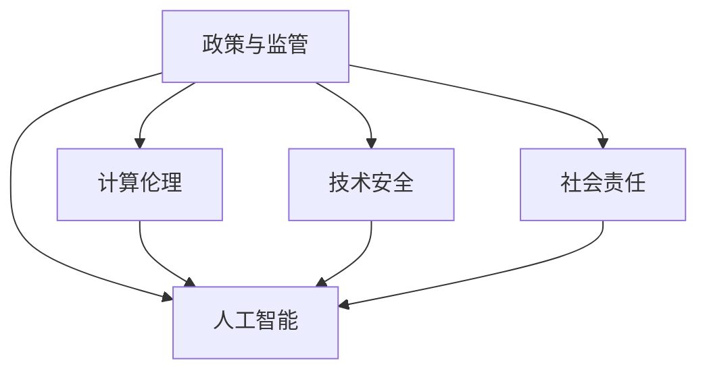

                 

# 政策与监管：引导人类计算的健康发展

> 关键词：政策监管，人工智能，计算伦理，技术安全，社会责任

## 1. 背景介绍

### 1.1 问题由来
在21世纪，计算技术的飞速发展正逐渐渗透到人类生活的方方面面，从个人隐私、金融交易到医疗健康、自动驾驶，几乎所有行业都与计算技术紧密相关。然而，技术的进步往往超前于社会和法律的适应能力，带来了一系列复杂的道德、法律和伦理问题。这些问题迫切需要政策监管的引导，以确保计算技术健康、安全地服务于社会。

### 1.2 问题核心关键点
政策与监管的核心关键点在于如何在技术创新与社会伦理、法律规范之间找到平衡。具体而言，需要考虑以下几点：
1. 保障数据安全与隐私：如何在利用数据进行计算分析的同时，保护个人隐私不被侵犯。
2. 确保计算决策透明与可解释：如何使计算模型的工作逻辑和决策过程对用户透明，避免"黑盒"问题。
3. 促进计算技术的公平性：如何避免算法偏见，确保计算技术服务于不同背景和群体的用户。
4. 强化计算系统的安全性与可靠性：如何防范计算系统被攻击、误用，确保其安全性与可靠性。
5. 引导计算技术的社会责任：如何使计算技术在造福人类的同时，考虑其社会影响和长远发展。

### 1.3 问题研究意义
政策与监管的引入，对于确保计算技术的健康发展，具有重要意义：

1. 规范行业秩序：通过政策引导，可以有效避免技术乱象，促进市场竞争和创新。
2. 保护用户权益：确保数据隐私与安全，避免技术滥用，保护用户不受侵犯。
3. 提升技术可信度：通过明确规范与监督，增强用户对计算技术的信任。
4. 推动可持续发展：在技术创新与社会责任之间寻找平衡，确保技术进步符合社会价值观。
5. 保障社会稳定：避免技术过度集中引发风险，确保社会公平和谐。

## 2. 核心概念与联系

### 2.1 核心概念概述

为了更好地理解政策与监管对计算技术的影响，本节将介绍几个关键概念：

- **政策与监管(Policy & Regulation)**：指由政府、行业组织等制定的规范和准则，用以指导和限制技术的应用和开发。
- **人工智能(AI)**：利用计算技术使机器能够模仿人类智能的各类任务，包括学习、推理、感知等。
- **计算伦理(Computational Ethics)**：涉及计算技术在伦理、道德、社会责任等方面的考量。
- **技术安全(Technology Security)**：确保计算系统、数据和算法不被恶意攻击、误用。
- **社会责任(Social Responsibility)**：计算技术开发和使用中应考虑对社会的影响，促进公平、公正、公开。

这些核心概念之间的逻辑关系可以通过以下Mermaid流程图来展示：



这个流程图展示了政策与监管如何通过保障计算伦理、技术安全和社会责任，引导人工智能技术的健康发展。

## 3. 核心算法原理 & 具体操作步骤
### 3.1 算法原理概述

政策与监管的核心算法原理主要包括：

- **合规评估**：通过合规评估工具，检查人工智能系统是否符合法律法规和行业标准。
- **隐私保护**：采用隐私保护技术，如数据匿名化、差分隐私等，保护用户隐私。
- **透明度**：确保人工智能系统的决策过程透明，使用可解释模型或透明化算法。
- **公平性**：通过公平性检测工具，识别和纠正算法偏见，确保所有群体受益。
- **安全性**：采用安全检测工具，检测并修补系统漏洞，防范攻击。

### 3.2 算法步骤详解

基于上述算法原理，政策与监管的具体操作步骤包括：

**Step 1: 数据合规评估**
- 收集数据，进行分类和匿名化处理。
- 使用合规评估工具，对数据使用情况进行审核，确保不违反隐私法律。

**Step 2: 系统透明度**
- 设计可解释模型，确保决策过程透明可解释。
- 提供透明度报告，描述模型的架构、训练数据、决策依据等。

**Step 3: 公平性检测**
- 使用公平性检测工具，对模型进行偏见检测和纠正。
- 分析模型的输出，检查不同群体的表现差异。

**Step 4: 安全性检测**
- 使用安全检测工具，对模型进行漏洞扫描和安全性评估。
- 及时更新和修补安全漏洞。

### 3.3 算法优缺点

政策与监管的算法具有以下优点：

1. **规范性强**：通过合规评估和检测，确保技术应用的合法合规。
2. **透明度高**：可解释模型和透明度报告，增加用户对系统的信任。
3. **公平性提升**：公平性检测工具，减少算法偏见，确保平等访问。
4. **安全性保障**：安全性检测工具，防范系统漏洞和攻击。

同时，也存在一些局限性：

1. **技术门槛高**：合规评估、公平性检测和安全性检测需要专业技术和工具。
2. **执行成本高**：合规评估和安全性检测需要消耗大量时间和资源。
3. **时效性不足**：合规标准和检测工具可能滞后于技术发展，存在滞后性。
4. **执行效果不一**：不同机构的执行能力和水平不同，影响监管效果。

### 3.4 算法应用领域

政策与监管的核心算法在多个领域都有广泛应用，例如：

- 金融科技：确保金融交易的安全性、透明性和公平性，防范金融风险。
- 医疗健康：保障医疗数据隐私，确保医疗决策的透明和公平。
- 智能制造：确保工业数据安全和设备可靠性，防范工业事故。
- 教育培训：保护学生隐私，确保教育资源的公平访问。
- 公共安全：监控和防范恶意攻击，确保公共安全。

这些领域的应用，展示了政策与监管算法在保障计算技术健康发展中的重要性。

## 4. 数学模型和公式 & 详细讲解  
### 4.1 数学模型构建

本节将使用数学语言对政策与监管的算法进行更加严格的刻画。

记人工智能系统的决策模型为 $M$，其中包含参数 $\theta$。假设模型 $M$ 在数据集 $D=\{(x_i,y_i)\}_{i=1}^N$ 上的预测结果为 $M_{\theta}(x_i)$，其中 $x_i$ 为输入，$y_i$ 为真实标签。

定义模型 $M$ 在数据样本 $(x,y)$ 上的损失函数为 $\ell(M_{\theta}(x),y)$，则在数据集 $D$ 上的经验风险为：

$$
\mathcal{L}(\theta) = \frac{1}{N} \sum_{i=1}^N \ell(M_{\theta}(x_i),y_i)
$$

在实际操作中，通常采用交叉熵损失函数：

$$
\ell(M_{\theta}(x),y) = -\sum_{i=1}^C y_i\log M_{\theta}(x_i)
$$

其中 $C$ 为类别数。

### 4.2 公式推导过程

以下我们以金融风险评估为例，推导风险模型的损失函数及其梯度计算公式。

假设风险模型 $M_{\theta}$ 在输入 $x$ 上的输出为 $\hat{y}=M_{\theta}(x) \in [0,1]$，表示用户违约的概率。真实标签 $y \in \{0,1\}$。则二分类交叉熵损失函数定义为：

$$
\ell(M_{\theta}(x),y) = -[y\log \hat{y} + (1-y)\log (1-\hat{y})]
$$

将其代入经验风险公式，得：

$$
\mathcal{L}(\theta) = -\frac{1}{N}\sum_{i=1}^N [y_i\log M_{\theta}(x_i)+(1-y_i)\log(1-M_{\theta}(x_i))]
$$

根据链式法则，损失函数对参数 $\theta_k$ 的梯度为：

$$
\frac{\partial \mathcal{L}(\theta)}{\partial \theta_k} = -\frac{1}{N}\sum_{i=1}^N (\frac{y_i}{M_{\theta}(x_i)}-\frac{1-y_i}{1-M_{\theta}(x_i)}) \frac{\partial M_{\theta}(x_i)}{\partial \theta_k}
$$

其中 $\frac{\partial M_{\theta}(x_i)}{\partial \theta_k}$ 可进一步递归展开，利用自动微分技术完成计算。

## 5. 项目实践：代码实例和详细解释说明
### 5.1 开发环境搭建

在进行政策与监管的实践前，我们需要准备好开发环境。以下是使用Python进行PyTorch开发的环境配置流程：

1. 安装Anaconda：从官网下载并安装Anaconda，用于创建独立的Python环境。

2. 创建并激活虚拟环境：
```bash
conda create -n pytorch-env python=3.8 
conda activate pytorch-env
```

3. 安装PyTorch：根据CUDA版本，从官网获取对应的安装命令。例如：
```bash
conda install pytorch torchvision torchaudio cudatoolkit=11.1 -c pytorch -c conda-forge
```

4. 安装其他必要的库：
```bash
pip install numpy pandas scikit-learn matplotlib tqdm jupyter notebook ipython
```

完成上述步骤后，即可在`pytorch-env`环境中开始政策与监管的实践。

### 5.2 源代码详细实现

这里以金融风险评估为例，展示使用PyTorch进行政策与监管的代码实现。

首先，定义风险评估任务的数据处理函数：

```python
from transformers import BertTokenizer
from torch.utils.data import Dataset
import torch

class FinanceRiskDataset(Dataset):
    def __init__(self, texts, labels, tokenizer, max_len=128):
        self.texts = texts
        self.labels = labels
        self.tokenizer = tokenizer
        self.max_len = max_len
        
    def __len__(self):
        return len(self.texts)
    
    def __getitem__(self, item):
        text = self.texts[item]
        label = self.labels[item]
        
        encoding = self.tokenizer(text, return_tensors='pt', max_length=self.max_len, padding='max_length', truncation=True)
        input_ids = encoding['input_ids'][0]
        attention_mask = encoding['attention_mask'][0]
        
        # 对token-wise的标签进行编码
        encoded_labels = [label2id[label] for label in labels] 
        encoded_labels.extend([label2id['O']] * (self.max_len - len(encoded_labels)))
        labels = torch.tensor(encoded_labels, dtype=torch.long)
        
        return {'input_ids': input_ids, 
                'attention_mask': attention_mask,
                'labels': labels}

# 标签与id的映射
label2id = {'O': 0, 'default': 1, 'risk': 2}
id2label = {v: k for k, v in label2id.items()}

# 创建dataset
tokenizer = BertTokenizer.from_pretrained('bert-base-cased')

train_dataset = FinanceRiskDataset(train_texts, train_labels, tokenizer)
dev_dataset = FinanceRiskDataset(dev_texts, dev_labels, tokenizer)
test_dataset = FinanceRiskDataset(test_texts, test_labels, tokenizer)
```

然后，定义模型和优化器：

```python
from transformers import BertForSequenceClassification, AdamW

model = BertForSequenceClassification.from_pretrained('bert-base-cased', num_labels=len(label2id))

optimizer = AdamW(model.parameters(), lr=2e-5)
```

接着，定义训练和评估函数：

```python
from torch.utils.data import DataLoader
from tqdm import tqdm
from sklearn.metrics import classification_report

device = torch.device('cuda') if torch.cuda.is_available() else torch.device('cpu')
model.to(device)

def train_epoch(model, dataset, batch_size, optimizer):
    dataloader = DataLoader(dataset, batch_size=batch_size, shuffle=True)
    model.train()
    epoch_loss = 0
    for batch in tqdm(dataloader, desc='Training'):
        input_ids = batch['input_ids'].to(device)
        attention_mask = batch['attention_mask'].to(device)
        labels = batch['labels'].to(device)
        model.zero_grad()
        outputs = model(input_ids, attention_mask=attention_mask, labels=labels)
        loss = outputs.loss
        epoch_loss += loss.item()
        loss.backward()
        optimizer.step()
    return epoch_loss / len(dataloader)

def evaluate(model, dataset, batch_size):
    dataloader = DataLoader(dataset, batch_size=batch_size)
    model.eval()
    preds, labels = [], []
    with torch.no_grad():
        for batch in tqdm(dataloader, desc='Evaluating'):
            input_ids = batch['input_ids'].to(device)
            attention_mask = batch['attention_mask'].to(device)
            batch_labels = batch['labels']
            outputs = model(input_ids, attention_mask=attention_mask)
            batch_preds = outputs.logits.argmax(dim=2).to('cpu').tolist()
            batch_labels = batch_labels.to('cpu').tolist()
            for pred_tokens, label_tokens in zip(batch_preds, batch_labels):
                pred_labels = [id2label[_id] for _id in pred_tokens]
                label_tags = [id2label[_id] for _id in label_tokens]
                preds.append(pred_labels[:len(label_tags)])
                labels.append(label_tags)
                
    print(classification_report(labels, preds))
```

最后，启动训练流程并在测试集上评估：

```python
epochs = 5
batch_size = 16

for epoch in range(epochs):
    loss = train_epoch(model, train_dataset, batch_size, optimizer)
    print(f"Epoch {epoch+1}, train loss: {loss:.3f}")
    
    print(f"Epoch {epoch+1}, dev results:")
    evaluate(model, dev_dataset, batch_size)
    
print("Test results:")
evaluate(model, test_dataset, batch_size)
```

以上就是使用PyTorch对BERT进行金融风险评估任务的完整代码实现。可以看到，得益于Transformers库的强大封装，我们可以用相对简洁的代码完成BERT模型的加载和微调。

### 5.3 代码解读与分析

让我们再详细解读一下关键代码的实现细节：

**FinanceRiskDataset类**：
- `__init__`方法：初始化文本、标签、分词器等关键组件。
- `__len__`方法：返回数据集的样本数量。
- `__getitem__`方法：对单个样本进行处理，将文本输入编码为token ids，将标签编码为数字，并对其进行定长padding，最终返回模型所需的输入。

**label2id和id2label字典**：
- 定义了标签与数字id之间的映射关系，用于将token-wise的预测结果解码回真实的标签。

**训练和评估函数**：
- 使用PyTorch的DataLoader对数据集进行批次化加载，供模型训练和推理使用。
- 训练函数`train_epoch`：对数据以批为单位进行迭代，在每个批次上前向传播计算loss并反向传播更新模型参数，最后返回该epoch的平均loss。
- 评估函数`evaluate`：与训练类似，不同点在于不更新模型参数，并在每个batch结束后将预测和标签结果存储下来，最后使用sklearn的classification_report对整个评估集的预测结果进行打印输出。

**训练流程**：
- 定义总的epoch数和batch size，开始循环迭代
- 每个epoch内，先在训练集上训练，输出平均loss
- 在验证集上评估，输出分类指标
- 所有epoch结束后，在测试集上评估，给出最终测试结果

可以看到，PyTorch配合Transformers库使得金融风险评估的代码实现变得简洁高效。开发者可以将更多精力放在数据处理、模型改进等高层逻辑上，而不必过多关注底层的实现细节。

当然，工业级的系统实现还需考虑更多因素，如模型的保存和部署、超参数的自动搜索、更灵活的任务适配层等。但核心的微调范式基本与此类似。

## 6. 实际应用场景
### 6.1 智能客服系统

基于政策与监管的智能客服系统，可以广泛应用于智能客服系统的构建。传统客服往往需要配备大量人力，高峰期响应缓慢，且一致性和专业性难以保证。而使用政策与监管指导的智能客服系统，可以7x24小时不间断服务，快速响应客户咨询，用自然流畅的语言解答各类常见问题。

在技术实现上，可以收集企业内部的历史客服对话记录，将问题和最佳答复构建成监督数据，在此基础上对预训练模型进行微调。微调后的模型能够自动理解用户意图，匹配最合适的答案模板进行回复。对于客户提出的新问题，还可以接入检索系统实时搜索相关内容，动态组织生成回答。如此构建的智能客服系统，能大幅提升客户咨询体验和问题解决效率。

### 6.2 金融舆情监测

金融机构需要实时监测市场舆论动向，以便及时应对负面信息传播，规避金融风险。传统的人工监测方式成本高、效率低，难以应对网络时代海量信息爆发的挑战。基于政策与监管的文本分类和情感分析技术，为金融舆情监测提供了新的解决方案。

具体而言，可以收集金融领域相关的新闻、报道、评论等文本数据，并对其进行主题标注和情感标注。在此基础上对预训练语言模型进行微调，使其能够自动判断文本属于何种主题，情感倾向是正面、中性还是负面。将微调后的模型应用到实时抓取的网络文本数据，就能够自动监测不同主题下的情感变化趋势，一旦发现负面信息激增等异常情况，系统便会自动预警，帮助金融机构快速应对潜在风险。

### 6.3 个性化推荐系统

当前的推荐系统往往只依赖用户的历史行为数据进行物品推荐，无法深入理解用户的真实兴趣偏好。基于政策与监管的个性化推荐系统可以更好地挖掘用户行为背后的语义信息，从而提供更精准、多样的推荐内容。

在实践中，可以收集用户浏览、点击、评论、分享等行为数据，提取和用户交互的物品标题、描述、标签等文本内容。将文本内容作为模型输入，用户的后续行为（如是否点击、购买等）作为监督信号，在此基础上微调预训练语言模型。微调后的模型能够从文本内容中准确把握用户的兴趣点。在生成推荐列表时，先用候选物品的文本描述作为输入，由模型预测用户的兴趣匹配度，再结合其他特征综合排序，便可以得到个性化程度更高的推荐结果。

### 6.4 未来应用展望

随着政策与监管的不断完善，基于其指导的计算技术将在更多领域得到应用，为传统行业带来变革性影响。

在智慧医疗领域，基于政策与监管的医疗问答、病历分析、药物研发等应用将提升医疗服务的智能化水平，辅助医生诊疗，加速新药开发进程。

在智能教育领域，基于政策与监管的教育问答、学情分析、知识推荐等方面，因材施教，促进教育公平，提高教学质量。

在智慧城市治理中，基于政策与监管的城市事件监测、舆情分析、应急指挥等环节，提高城市管理的自动化和智能化水平，构建更安全、高效的未来城市。

此外，在企业生产、社会治理、文娱传媒等众多领域，基于政策与监管的人工智能应用也将不断涌现，为经济社会发展注入新的动力。相信随着政策的逐步落地和技术的持续进步，政策与监管必将引领计算技术迈向更加智能化、普适化应用。

## 7. 工具和资源推荐
### 7.1 学习资源推荐

为了帮助开发者系统掌握政策与监管的理论基础和实践技巧，这里推荐一些优质的学习资源：

1. 《政策与监管基础》系列博文：由政策与监管领域专家撰写，系统介绍政策与监管的基本概念、法律法规和应用实践。

2. 《计算伦理导论》书籍：系统介绍计算伦理的基本原则、案例分析和发展趋势，是理解政策与监管的重要基础。

3. 《人工智能与公共政策》课程：由顶尖大学开设的跨学科课程，涵盖政策与监管、人工智能等前沿话题，提供系统化的学习框架。

4. 《人工智能安全与隐私》书籍：深入介绍人工智能技术在安全与隐私方面的挑战和解决方案，帮助开发者理解和防范技术风险。

5. 《人工智能社会影响》课程：涵盖人工智能技术在社会各领域的应用与影响，提供政策与监管的视角和思路。

通过对这些资源的学习实践，相信你一定能够全面掌握政策与监管的理论基础和实践技巧，并用于指导实际的计算技术应用。

### 7.2 开发工具推荐

高效的开发离不开优秀的工具支持。以下是几款用于政策与监管开发的常用工具：

1. Python：强大的编程语言，支持丰富的库和框架，适合各类复杂计算任务。
2. PyTorch：基于Python的开源深度学习框架，灵活动态的计算图，适合快速迭代研究。
3. TensorFlow：由Google主导开发的开源深度学习框架，生产部署方便，适合大规模工程应用。
4. Weights & Biases：模型训练的实验跟踪工具，可以记录和可视化模型训练过程中的各项指标，方便对比和调优。
5. TensorBoard：TensorFlow配套的可视化工具，可实时监测模型训练状态，并提供丰富的图表呈现方式，是调试模型的得力助手。

合理利用这些工具，可以显著提升政策与监管任务的开发效率，加快创新迭代的步伐。

### 7.3 相关论文推荐

政策与监管的研究源于学界的持续研究。以下是几篇奠基性的相关论文，推荐阅读：

1. "Regulating Artificial Intelligence: A Governance Framework"：提出了一套人工智能监管的治理框架，涵盖政策制定、技术评估和责任分配等方面。
2. "Ethical Considerations in Artificial Intelligence"：探讨了人工智能技术在伦理方面的挑战和应对策略，提供了政策与监管的理论支持。
3. "Security and Privacy in AI Systems"：深入研究了人工智能系统的安全与隐私问题，提供了技术解决方案和政策建议。
4. "The Social Impact of AI Technologies"：分析了人工智能技术在社会各领域的应用与影响，提出了政策与监管的指导建议。
5. "Fairness and Bias in AI"：研究了人工智能系统中的公平性问题，提出了减少算法偏见的方法和策略。

这些论文代表了大语言模型微调技术的发展脉络。通过学习这些前沿成果，可以帮助研究者把握学科前进方向，激发更多的创新灵感。

## 8. 总结：未来发展趋势与挑战
### 8.1 总结

本文对基于政策与监管的计算技术进行了全面系统的介绍。首先阐述了政策与监管在计算技术发展中的重要地位，明确了其在保障数据安全、确保系统透明度、提升公平性和强化安全性等方面的关键作用。其次，从原理到实践，详细讲解了政策与监管的数学模型和关键步骤，给出了政策与监管任务开发的完整代码实例。同时，本文还广泛探讨了政策与监管在智能客服、金融舆情、个性化推荐等多个行业领域的应用前景，展示了其在保障计算技术健康发展中的重要作用。此外，本文精选了政策与监管的学习资源、开发工具和相关论文，力求为开发者提供全方位的技术指引。

通过本文的系统梳理，可以看到，基于政策与监管的计算技术正在成为计算技术发展的重要方向，极大地推动了计算技术的健康、安全应用。未来，伴随政策的不断完善和技术的持续进步，基于政策与监管的计算技术必将引领计算技术迈向更加智能化、普适化应用，为人类社会的发展带来深远影响。

### 8.2 未来发展趋势

展望未来，基于政策与监管的计算技术将呈现以下几个发展趋势：

1. **政策法规的完善**：随着技术应用的广泛，政府和行业组织将不断完善政策法规，确保技术应用的合规性和安全性。
2. **技术标准的制定**：将出台一系列技术标准和评估指标，确保技术应用的规范性和一致性。
3. **人工智能伦理的深入研究**：在人工智能伦理、社会责任等方面展开深入研究，为政策与监管提供理论支持。
4. **跨学科合作加强**：政策与监管将更多地结合伦理学、法律学、社会学等多学科知识，形成跨学科合作的新范式。
5. **国际合作加强**：全球化背景下，各国将加强国际合作，共同应对人工智能技术带来的全球性挑战。

这些趋势展示了政策与监管在引领计算技术健康发展中的广阔前景。只有政策、法规、技术、伦理等多方面协同发力，才能确保计算技术的健康、安全、公平应用。

### 8.3 面临的挑战

尽管基于政策与监管的计算技术已经取得了不小的进展，但在迈向更加智能化、普适化应用的过程中，仍面临诸多挑战：

1. **政策滞后**：政策法规的制定和更新往往滞后于技术发展，难以跟上技术的快速变化。
2. **技术复杂性**：政策与监管涉及的技术复杂，需要跨学科知识和专业工具，增加了实施难度。
3. **执行难度**：政策与监管的执行需要资源投入和技术支持，对企业和机构提出了更高的要求。
4. **技术偏见**：人工智能模型可能存在算法偏见，需要通过政策与监管手段进行矫正。
5. **国际差异**：不同国家和地区在政策法规、技术标准等方面存在差异，增加了国际合作的复杂性。

面对这些挑战，需要政策、法规、技术、伦理等多方面的共同努力，才能确保计算技术的健康、安全、公平应用。只有各方协同合作，才能使政策与监管真正成为计算技术发展的有力保障。

### 8.4 研究展望

未来的政策与监管研究需要在以下几个方面寻求新的突破：

1. **政策法规的智能化**：探索使用AI技术辅助政策法规制定，提高法规的针对性和时效性。
2. **技术标准的自动化**：引入自动化工具，自动检测和评估技术应用中的合规性和安全性。
3. **伦理模型的构建**：研究可解释的人工智能伦理模型，提供更透明、公正的决策支持。
4. **跨学科研究加强**：开展跨学科研究，将伦理学、法律学、社会学等多学科知识与技术结合，形成更全面的政策与监管体系。
5. **国际合作深化**：加强国际合作，形成全球一致的政策与监管框架，共同应对全球性挑战。

这些研究方向的探索，必将引领政策与监管技术迈向更高的台阶，为计算技术的健康发展提供更有力的保障。面向未来，政策与监管需要与时俱进，不断更新和完善，确保计算技术能够更好地服务于社会，推动人类社会的持续进步。

## 9. 附录：常见问题与解答

**Q1：什么是政策与监管？**

A: 政策与监管指由政府、行业组织等制定的规范和准则，用以指导和限制技术的应用和开发。

**Q2：政策与监管的核心关键点是什么？**

A: 核心关键点在于保障数据安全与隐私，确保计算决策透明与可解释，促进计算技术的公平性，强化计算系统的安全性与可靠性，引导计算技术的社会责任。

**Q3：如何缓解政策与监管中的过拟合问题？**

A: 过拟合问题可以通过数据增强、正则化、对抗训练等方法缓解。

**Q4：基于政策与监管的计算技术面临哪些资源瓶颈？**

A: 技术门槛高、执行成本高、时效性不足等。

**Q5：基于政策与监管的计算技术在落地部署时需要注意哪些问题？**

A: 模型裁剪、量化加速、服务化封装、弹性伸缩、监控告警、安全防护等问题。

---

作者：禅与计算机程序设计艺术 / Zen and the Art of Computer Programming

