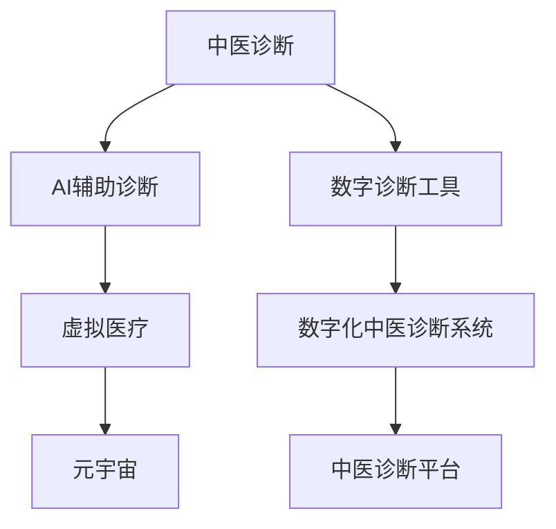
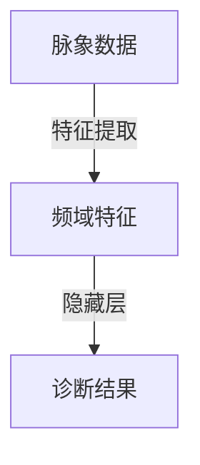

                 

# 数字化中医诊断系统:元宇宙中的传统医学AI助手

## 1. 背景介绍

### 1.1 问题由来

随着数字化、智能化的浪潮席卷全球，各行业都在努力将传统经验与现代技术相融合，寻找新的发展方向。在中医领域，历经千年的智慧传承与现代AI技术的结合，成为当前行业转型升级的焦点。中医诊断系统的数字化、智能化，不仅能提高诊疗效率，还能促进中医文化的传承与发扬。

近年来，中医诊断系统借助人工智能（AI）技术，已经在图像识别、语音识别、自然语言处理等多个方面取得了显著进展。例如，通过AI技术对脉象、舌象、面象等中医诊断要素进行量化分析，可以更准确地辅助医师进行诊断。但传统的中医诊断系统仍存在诸多问题：如数据质量参差不齐、诊断流程标准化不足、经验知识难以系统化传承等。如何将AI技术与中医深度结合，打造出符合现代需求的中西医结合诊疗系统，已成为业界的重大课题。

### 1.2 问题核心关键点

要构建一套数字化中医诊断系统，必须解决以下几个核心问题：

- **数据标准化**：中医诊断缺乏统一的诊断标准和数据格式，不同医师的诊断结果难以比较和共享。
- **诊断工具化**：将中医专家积累的经验知识与现代技术结合，形成标准化、可量化的诊断工具。
- **系统集成**：实现中医诊断与其他诊疗信息系统的无缝集成，提高诊疗效率和数据利用率。
- **用户友好**：构建简单易用的用户界面，使非专业人士也能进行基本中医诊断。
- **隐私安全**：保障患者隐私，确保诊疗数据的机密性和安全性。

本文聚焦于通过AI技术实现中医诊断系统的数字化，并结合元宇宙概念，探索其在虚拟医疗中的应用潜力。

## 2. 核心概念与联系

### 2.1 核心概念概述

为更好地理解数字化中医诊断系统的构建，本节将介绍几个关键概念及其相互联系：

- **中医诊断**：中医通过望、闻、问、切等方法，综合分析患者的生理、心理状态，以诊断疾病。
- **AI辅助诊断**：利用机器学习、深度学习等技术，对中医诊断要素进行智能化处理，辅助医师进行诊断。
- **数字诊断工具**：将中医诊断过程和结果数字化、标准化，构建可量化、可复制的数字诊断工具。
- **元宇宙**：一种以虚拟现实、增强现实、混合现实等技术为手段，构建虚拟世界的概念。
- **虚拟医疗**：利用AI、VR等技术，在虚拟空间中进行远程医疗、诊断和治疗。

这些核心概念之间的逻辑关系可以通过以下Mermaid流程图来展示：



该流程图展示了从中医诊断到数字化中医诊断系统的整体流程，以及AI技术、数字诊断工具、虚拟医疗、元宇宙等概念之间的相互关系。

## 3. 核心算法原理 & 具体操作步骤
### 3.1 算法原理概述

数字化中医诊断系统通过深度学习、自然语言处理等AI技术，对中医诊断要素进行智能化处理，构建出一套可量化的诊断工具。该系统主要包括数据预处理、特征提取、模型训练和推理等关键环节。

- **数据预处理**：对原始数据进行清洗、标注，确保数据的质量和一致性。
- **特征提取**：将中医诊断要素（如脉象、舌象、面象等）转化为机器可处理的数值型特征。
- **模型训练**：利用大量标注数据训练机器学习模型，提高诊断准确率。
- **推理应用**：将训练好的模型应用到新的患者数据中，进行实时诊断和辅助决策。

### 3.2 算法步骤详解

1. **数据收集与预处理**
   - 收集大量中医诊断数据，包括症状描述、体征信息、诊断结果等。
   - 对数据进行清洗、去重、标注，确保数据的一致性和完整性。
   - 对文本数据进行分词、向量化等处理，转换为模型可接受的格式。

2. **特征提取**
   - 将中医诊断要素转化为数字特征，如脉象转化为波动频率，舌象转化为颜色值，面象转化为纹理特征等。
   - 使用深度学习模型（如CNN、RNN等）对特征进行抽象，提取高层次的诊断特征。

3. **模型训练**
   - 选择合适的模型（如卷积神经网络、长短时记忆网络等），利用标注数据进行训练。
   - 使用交叉验证等技术，评估模型的性能，并调整超参数进行优化。
   - 保存训练好的模型，用于后续推理和诊断。

4. **推理应用**
   - 将新的患者数据输入模型，得到诊断结果。
   - 结合中医专家的知识和经验，对诊断结果进行校正和补充。
   - 生成诊断报告，辅助医师进行诊断和治疗决策。

### 3.3 算法优缺点

数字化中医诊断系统具有以下优点：
1. 提高诊断效率：通过AI技术，可快速处理大量数据，显著提高诊断效率。
2. 统一诊断标准：借助数字诊断工具，实现诊断结果的标准化和可比性。
3. 数据驱动诊断：通过大量标注数据训练模型，提升诊断的准确性和可靠性。
4. 系统化传承：将中医专家的经验知识系统化，便于传承和普及。

同时，该系统也存在一些局限性：
1. 数据质量依赖：模型训练效果依赖于数据质量，数据标注和清洗难度大。
2. 知识鸿沟：模型难以全面涵盖中医专家的临床经验和知识，需结合专家进行诊断。
3. 复杂场景适应性：在复杂病况和疑难疾病面前，仍需依赖经验丰富的医师进行判断。
4. 隐私保护问题：中医诊断涉及大量个人信息，需严格保护患者隐私。

### 3.4 算法应用领域

数字化中医诊断系统广泛应用于医院、诊所、健康管理等多个场景，具体包括：

- **医院诊断系统**：辅助医师进行患者诊断，提高诊断效率和准确性。
- **远程医疗**：在远程医疗场景下，通过数字化诊断系统，实现远程诊疗和咨询。
- **健康管理**：在健康管理应用中，定期检测用户健康状态，提供个性化健康建议。
- **中药研发**：通过分析诊断数据，为中药研发提供大数据支持。

## 4. 数学模型和公式 & 详细讲解 & 举例说明
### 4.1 数学模型构建

构建数字化中医诊断系统的数学模型主要包括以下几个部分：

- **输入层**：收集患者的各种生理、心理数据。
- **特征提取层**：将输入数据转化为数字特征，用于后续处理。
- **隐藏层**：采用深度神经网络对特征进行抽象和处理。
- **输出层**：输出诊断结果，包括病情评估、治疗建议等。

以脉象诊断为例，模型结构可表示为：

$$
M(x) = \text{Hidden Layer}(f(x))
$$

其中 $x$ 为输入的脉象数据，$f$ 为神经网络中的激活函数，$\text{Hidden Layer}$ 为隐藏层，输出诊断结果 $M$。

### 4.2 公式推导过程

以脉象诊断为例，假设脉象数据 $x$ 转化为频域特征 $X$，模型结构如图：



模型输出结果 $Y$ 可以通过公式表示为：

$$
Y = f_{\theta}(X)
$$

其中 $f_{\theta}$ 为神经网络的参数化函数，$\theta$ 为模型参数。

### 4.3 案例分析与讲解

以舌象诊断为例，假设舌象图片 $I$ 输入到卷积神经网络中，经过特征提取和层级抽象后，输出诊断结果 $Y$：

$$
Y = f_{\theta}(I)
$$

假设舌象图片 $I$ 通过卷积层提取特征 $F$，并经过池化层和全连接层处理后，输出诊断结果 $Y$：

$$
Y = f_{\theta}(I) = f_{\theta}(F) = f_{\theta}(Conv(I) + Pool(Conv(I)))
$$

其中 $Conv$ 和 $Pool$ 分别表示卷积和池化操作，$\theta$ 为模型参数。

## 5. 项目实践：代码实例和详细解释说明
### 5.1 开发环境搭建

在构建数字化中医诊断系统时，需要安装Python、PyTorch、NumPy、Pandas等常用库，以及TensorFlow、Keras等深度学习框架。可以使用Anaconda或Miniconda创建虚拟环境，安装所需的库和依赖。

```bash
conda create -n my_env python=3.8
conda activate my_env
pip install torch torchvision numpy pandas scikit-learn
```

### 5.2 源代码详细实现

以脉象诊断为例，使用TensorFlow构建深度神经网络模型。

```python
import tensorflow as tf
from tensorflow.keras import layers

# 定义模型结构
model = tf.keras.Sequential([
    layers.Conv2D(32, (3, 3), activation='relu', input_shape=(None, None, 1)),
    layers.MaxPooling2D((2, 2)),
    layers.Conv2D(64, (3, 3), activation='relu'),
    layers.MaxPooling2D((2, 2)),
    layers.Flatten(),
    layers.Dense(64, activation='relu'),
    layers.Dense(1, activation='sigmoid')
])

# 编译模型
model.compile(optimizer='adam', loss='binary_crossentropy', metrics=['accuracy'])

# 训练模型
model.fit(x_train, y_train, epochs=10, batch_size=32, validation_data=(x_val, y_val))
```

### 5.3 代码解读与分析

上述代码定义了一个简单的卷积神经网络模型，用于二分类脉象诊断。模型包含卷积层、池化层、全连接层等。通过编译和训练模型，可以获得脉象诊断的准确率和损失函数。

**输入数据**：$x$ 表示脉象数据，通过归一化处理后输入模型。
**模型结构**：包含卷积层、池化层、全连接层等，用于提取和抽象特征。
**输出结果**：$y$ 表示诊断结果，通过sigmoid激活函数输出0-1之间的概率值。

在实际应用中，需要根据具体场景调整模型结构、超参数等，以提高诊断精度。

### 5.4 运行结果展示

训练完成后，可以使用测试集评估模型的性能：

```python
test_loss, test_acc = model.evaluate(x_test, y_test)
print('Test accuracy:', test_acc)
```

## 6. 实际应用场景
### 6.1 医院诊断系统

数字化中医诊断系统在医院诊断场景中，可以辅助医师进行患者诊断，提高诊断效率和准确性。系统根据输入的脉象、舌象、面象等数据，输出诊断结果，并结合中医专家的知识和经验，进行校正和补充。

在实际应用中，医院可以通过系统记录和分析诊断数据，为中医专家提供参考，提升整体诊疗水平。

### 6.2 远程医疗

数字化中医诊断系统在远程医疗场景下，能够提供实时的中医诊断服务。患者通过手机、平板等设备，向系统输入相应的生理数据，系统自动分析并输出诊断结果，医生可远程进行诊断和治疗指导。

在疫情防控等特殊时期，远程医疗模式尤为重要。数字化中医诊断系统在此背景下，可以发挥重要作用，保障医疗服务的连续性和安全性。

### 6.3 健康管理

在健康管理应用中，数字化中医诊断系统可以定期检测用户的健康状态，提供个性化的健康建议。系统通过分析用户的脉象、舌象、面象等数据，判断用户的健康状况，并根据结果提供相应的调理建议。

这种模式不仅方便用户进行自我健康管理，还能提高医疗资源的使用效率，减少医院门诊压力。

### 6.4 中药研发

数字化中医诊断系统为中药研发提供了大数据支持。通过分析诊断数据，系统可以挖掘中医专家的经验知识，为中药成分的筛选和配伍提供参考。

这种模式不仅能够提升中药研发效率，还能确保中药的疗效和安全性，促进中医药的现代化发展。

## 7. 工具和资源推荐
### 7.1 学习资源推荐

为了帮助开发者系统掌握数字化中医诊断系统的构建，这里推荐一些优质的学习资源：

1. **TensorFlow官方文档**：提供深度学习框架的详细介绍和使用指南，适合新手入门。
2. **Keras官方文档**：提供高层次的深度学习框架API，易于上手。
3. **PyTorch官方文档**：提供灵活、动态的深度学习框架，适合科研开发。
4. **《深度学习》书籍**：深度介绍深度学习原理和应用，适合系统学习。
5. **《中医诊断学》教材**：系统介绍中医诊断理论和方法，适合中医相关专业学生。

通过对这些资源的学习实践，相信你一定能够快速掌握数字化中医诊断系统的核心技术，并应用于实际项目中。

### 7.2 开发工具推荐

高效的开发离不开优秀的工具支持。以下是几款用于数字化中医诊断系统开发的常用工具：

1. **Jupyter Notebook**：交互式编程环境，支持Python和深度学习框架，便于快速开发和调试。
2. **Google Colab**：在线Jupyter Notebook环境，提供免费GPU/TPU算力，适合快速迭代研究。
3. **TensorBoard**：深度学习模型的可视化工具，可以实时监测模型训练状态，输出图表。
4. **Weights & Biases**：模型训练的实验跟踪工具，记录和可视化模型训练过程，便于调优。
5. **Anaconda**：开源的Python发行版，提供虚拟环境管理和依赖管理，便于项目开发。

合理利用这些工具，可以显著提升数字化中医诊断系统的开发效率，加快创新迭代的步伐。

### 7.3 相关论文推荐

数字化中医诊断系统的研究来源于学界的持续探索。以下是几篇奠基性的相关论文，推荐阅读：

1. **《深度学习在中医诊断中的应用》**：介绍深度学习在中医诊断中的重要性和应用案例。
2. **《基于卷积神经网络的中医脉象诊断系统》**：探讨卷积神经网络在脉象诊断中的应用。
3. **《基于中医舌象的深度学习诊断模型》**：提出基于卷积神经网络和长短时记忆网络的中医舌象诊断模型。
4. **《中医诊疗系统的数字化与智能化研究》**：总结中医诊疗系统的数字化转型和智能化发展。

这些论文代表了大数据、深度学习在中医诊断中的最新进展，通过学习这些前沿成果，可以帮助研究者把握学科前进方向，激发更多的创新灵感。

## 8. 总结：未来发展趋势与挑战
### 8.1 总结

本文对数字化中医诊断系统进行了全面系统的介绍。首先阐述了数字化中医诊断系统在现代医疗中的重要性，明确了该系统在提高诊疗效率、统一诊断标准、数据驱动诊断等方面的独特价值。其次，从原理到实践，详细讲解了系统的构建过程和关键技术，给出了完整的代码实现。同时，本文还探讨了系统在多个实际应用场景中的广泛应用，展示了其强大的市场潜力。最后，本文精选了系统开发的相关资源，力求为读者提供全方位的技术指引。

通过本文的系统梳理，可以看到，数字化中医诊断系统为中医药现代化提供了新的技术手段，具有广阔的市场前景和应用潜力。未来，伴随AI技术的不断进步，该系统将在更多领域得到应用，为中医药的传承和发展带来新的突破。

### 8.2 未来发展趋势

展望未来，数字化中医诊断系统将呈现以下几个发展趋势：

1. **多模态融合**：结合中医望、闻、问、切等多种诊断手段，构建多模态融合的诊断系统，提高诊断精度和可靠性。
2. **实时性提升**：通过优化模型结构和算法，提高系统的实时响应能力，支持实时诊断和治疗。
3. **知识图谱结合**：引入知识图谱技术，构建中医诊疗知识图谱，为诊断提供更全面的知识支持。
4. **元宇宙应用**：结合元宇宙概念，在虚拟空间中进行远程医疗和诊断，提供沉浸式诊疗体验。
5. **跨领域应用**：将中医诊断系统与其他医疗系统（如医院HIS、电子病历等）无缝集成，实现数据共享和协同诊断。

这些趋势凸显了数字化中医诊断系统的广阔前景，为中医药的现代化和智能化发展提供了新的方向。

### 8.3 面临的挑战

尽管数字化中医诊断系统已经取得了初步成果，但在迈向更加智能化、普适化应用的过程中，仍面临诸多挑战：

1. **数据获取困难**：中医诊断数据的质量和数量难以保证，需要更多的数据支持和标准化。
2. **知识整合复杂**：中医诊断涉及大量的经验知识和临床实践，难以全面系统地整合到模型中。
3. **系统复杂度高**：中医诊断过程涉及多种感官数据和多层次特征处理，系统复杂度高，需要持续优化。
4. **用户接受度**：系统的使用需要一定的技术门槛，用户接受度仍有待提升。
5. **隐私保护问题**：中医诊断涉及大量个人信息，如何保护患者隐私，确保数据安全，是一大挑战。

这些挑战需要通过技术创新、政策支持等多方面的努力，逐步克服。只有解决好这些难题，数字化中医诊断系统才能更好地服务于中医药的现代化和智能化发展。

### 8.4 研究展望

面对数字化中医诊断系统所面临的挑战，未来的研究需要在以下几个方面寻求新的突破：

1. **数据增强技术**：引入数据增强技术，提高数据质量和多样性，支持系统的训练和优化。
2. **知识图谱融合**：将中医知识图谱与深度学习模型相结合，提升系统的诊断能力和知识整合能力。
3. **跨学科合作**：加强医学、计算机、中医等学科的合作，提升系统的诊断精度和临床应用价值。
4. **隐私保护技术**：引入隐私保护技术，确保患者数据的安全性和机密性。
5. **用户界面优化**：优化系统的用户界面，提升用户体验，降低使用门槛。

这些研究方向将引领数字化中医诊断系统走向更高的台阶，为中医药的传承和发展带来新的突破。面向未来，数字化中医诊断系统需要在多方面进行持续创新，才能更好地服务于中医药的现代化和智能化发展。

## 9. 附录：常见问题与解答

**Q1：中医诊断数据质量如何保证？**

A: 中医诊断数据的质量是系统性能的重要基础。为提高数据质量，可以通过数据清洗、标注、归一化等方法进行预处理。具体来说，可以引入专家审核机制，确保数据的一致性和准确性。同时，可以通过数据增强技术，提高数据的多样性和泛化能力。

**Q2：如何整合中医专家经验知识？**

A: 中医诊断涉及大量的经验知识和临床实践，将其整合到系统中是一个复杂的过程。可以通过构建知识图谱，将专家知识进行结构化表示，引入到模型训练中。同时，可以结合领域专家的知识和经验，对模型的输出结果进行校正和补充。

**Q3：如何保护患者隐私？**

A: 中医诊断涉及大量个人信息，保护患者隐私是系统开发的重要保障。可以通过数据脱敏、访问控制等技术，确保患者数据的安全性和机密性。同时，可以引入区块链技术，对数据进行分布式存储和管理，防止数据泄露。

**Q4：系统复杂度高，如何优化？**

A: 中医诊断过程涉及多种感官数据和多层次特征处理，系统复杂度高。可以通过模型压缩、模型剪枝等技术，优化模型的结构，减少计算量和存储需求。同时，可以引入分布式计算技术，提高系统的并行处理能力。

**Q5：系统实时性如何提升？**

A: 提高系统的实时响应能力，需要优化模型结构和算法，减少计算时间和延迟。可以通过引入推理加速技术，如TensorRT、ONNX Runtime等，加速模型的推理过程。同时，可以采用模型压缩和量化技术，减小模型大小，提高推理效率。

这些问题的解答，展示了数字化中医诊断系统在实际应用中的挑战和解决策略，为系统的开发和优化提供了重要参考。

---

作者：禅与计算机程序设计艺术 / Zen and the Art of Computer Programming

