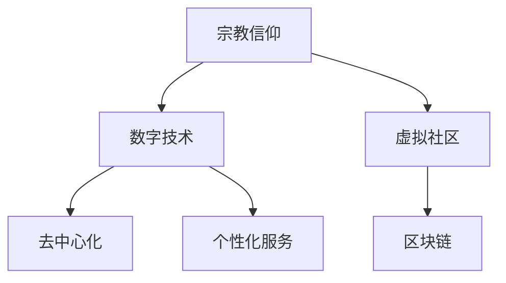

                 

# 数字化宗教：全球脑时代的信仰演变

## 1. 背景介绍

在数字化时代，宗教信仰的表现形式正经历着深刻的变革。互联网、人工智能、大数据等技术的发展，为宗教信仰的传播和实践带来了新的机遇与挑战。宗教信仰逐渐与数字世界相融合，形成了一种全新的信仰形态：数字化宗教。本文将从数字化宗教的概念、演变过程及其未来趋势等方面进行探讨。

### 1.1 数字化宗教的概念

数字化宗教是指在数字化时代背景下，宗教信仰通过数字技术和网络平台进行传播、交流和实践的新型信仰形态。其核心特征包括：

- **虚拟性**：宗教信仰通过虚拟社区、在线课程、虚拟现实（VR）等方式实现。
- **交互性**：宗教信徒通过社交媒体、即时通讯工具等进行互动和交流。
- **数据驱动**：利用大数据分析信徒的行为和需求，实现个性化服务和精准营销。
- **去中心化**：去中心化的区块链技术为宗教组织和信徒提供了一种新的信任机制。

### 1.2 背景和动机

数字化宗教的兴起并非偶然，而是多个因素共同作用的结果：

- **技术进步**：互联网、人工智能、大数据、区块链等技术的迅速发展为数字化宗教提供了技术支撑。
- **信息获取渠道的变化**：传统宗教传播渠道（如教堂、寺庙、修道院）受到数字化媒体的冲击，信徒获取宗教信息的渠道日益多样化。
- **社会变革**：社会结构的变迁、全球化的影响、城市化的推进等因素使得传统宗教的组织形式和社会功能受到挑战。
- **人类心理需求**：现代社会中，人们对于信仰、归属感和精神支持的需求依然强烈，数字化宗教为信徒提供了新的信仰形态和精神依托。

## 2. 核心概念与联系

### 2.1 核心概念概述

为了更好地理解数字化宗教的内涵，本文将介绍几个关键概念及其相互联系：

- **宗教信仰**：指个人或群体对于某个宗教体系及其教义的接受和认同。
- **数字技术**：包括互联网、人工智能、大数据、区块链等技术，为数字化宗教提供了实现手段。
- **虚拟社区**：通过在线平台和社交媒体形成的宗教团体，实现成员间的互动和交流。
- **去中心化**：区块链技术提供了一种去中心化的信任机制，减少了对传统宗教组织的依赖。
- **区块链**：一种分布式账本技术，记录并验证交易，确保信息的透明性和不可篡改性。
- **个性化服务**：利用大数据分析信徒需求，提供定制化的宗教体验和支持。

这些概念之间的联系可以通过以下Mermaid流程图来展示：



这个流程图展示了宗教信仰与数字技术的联系，以及通过虚拟社区、区块链等技术实现去中心化，最终提供个性化服务的过程。

## 3. 核心算法原理 & 具体操作步骤

### 3.1 算法原理概述

数字化宗教的实现依赖于多种算法和技术，其核心原理包括以下几个方面：

- **自然语言处理（NLP）**：利用NLP技术，宗教内容能够通过文本、语音、图像等多种形式进行传播和交流。
- **机器学习与深度学习**：通过算法训练模型，能够实现对信徒行为和需求的预测和分析。
- **数据挖掘**：利用数据挖掘技术，从海量数据中提取有价值的信息，用于宗教组织的决策和管理。
- **推荐系统**：利用推荐算法，为信徒推荐个性化的宗教内容和服务。

### 3.2 算法步骤详解

数字化宗教的实现步骤主要包括：

1. **数据采集与处理**：收集和清洗宗教相关的文本、图像、视频等数据。
2. **模型训练与优化**：利用NLP、机器学习等算法训练模型，优化性能。
3. **应用部署与维护**：将训练好的模型部署到网络平台，进行持续维护和更新。
4. **用户交互与反馈**：通过用户界面，宗教信徒与虚拟社区、区块链等技术进行互动，并提供反馈。
5. **数据分析与优化**：利用数据挖掘技术，分析用户行为和需求，优化宗教服务。

### 3.3 算法优缺点

数字化宗教的算法具有以下优点：

- **高效传播**：利用数字技术，宗教信仰能够迅速传播到全球各地。
- **个性化服务**：通过算法分析用户需求，提供定制化的宗教体验。
- **去中心化**：区块链技术为宗教组织和信徒提供了一种新的信任机制。
- **透明性**：数字化宗教的记录和交易过程透明，避免了传统宗教组织中的信息不对称问题。

然而，数字化宗教也存在一些缺点：

- **隐私保护**：大量宗教信徒的个人信息和行为数据需要妥善保护。
- **技术门槛**：数字化宗教的实现需要一定的技术支持和资金投入。
- **去信任化**：去中心化技术虽然减少了对传统宗教组织的依赖，但也带来了新的信任问题。
- **信息过载**：海量宗教信息可能导致信徒的信息过载，影响其信仰体验。

### 3.4 算法应用领域

数字化宗教的应用领域广泛，主要包括：

- **宗教教育**：利用在线课程和虚拟现实技术，提供宗教教育。
- **社区互动**：通过虚拟社区、社交媒体等平台，宗教信徒进行互动和交流。
- **精神健康**：利用人工智能和心理健康技术，为信徒提供心理支持和咨询。
- **慈善活动**：利用区块链技术，实现透明和高效的慈善捐赠和资金管理。
- **数字布道**：通过在线直播、视频分享等形式，宗教领袖进行布道和传播。
- **礼拜和祈祷**：利用虚拟现实和增强现实技术，进行线上礼拜和祈祷。

## 4. 数学模型和公式 & 详细讲解 & 举例说明

### 4.1 数学模型构建

在数字化宗教中，涉及到的数学模型包括：

- **自然语言处理（NLP）模型**：如BERT、GPT等。
- **推荐系统模型**：如协同过滤、矩阵分解等。
- **数据挖掘模型**：如分类、聚类、关联规则等。

### 4.2 公式推导过程

以推荐系统为例，假设我们有一组用户和一组宗教内容，用户对宗教内容的评分可以表示为矩阵 $\mathbf{X} \in \mathbb{R}^{n \times m}$，其中 $n$ 为用户数，$m$ 为宗教内容数，每个用户对每篇宗教内容的评分可以表示为 $x_{ij}$，其中 $i$ 为第 $i$ 个用户，$j$ 为第 $j$ 个宗教内容。

设用户对宗教内容的评分向量为 $\mathbf{r} \in \mathbb{R}^{m}$，推荐系统模型为 $\mathbf{Y} \in \mathbb{R}^{n \times m}$，其中 $\mathbf{y}_{ij}$ 为第 $i$ 个用户对第 $j$ 个宗教内容的推荐得分。

推荐系统的目标是最小化用户对宗教内容的实际评分与推荐得分的误差，可以使用均方误差（MSE）作为损失函数：

$$
L = \frac{1}{2} \sum_{i=1}^{n} \sum_{j=1}^{m} (\mathbf{r}_{j} - \mathbf{y}_{ij})^2
$$

通过梯度下降等优化算法，最小化上述损失函数，得到推荐得分 $\mathbf{y}_{ij}$。

### 4.3 案例分析与讲解

假设我们有一个简单的推荐系统，利用协同过滤算法为信徒推荐新的宗教内容。我们可以使用矩阵分解的方法，将用户评分矩阵 $\mathbf{X}$ 分解为两个低秩矩阵 $\mathbf{U} \in \mathbb{R}^{n \times k}$ 和 $\mathbf{V} \in \mathbb{R}^{k \times m}$，其中 $k$ 为低秩矩阵的维度。

推荐得分 $\mathbf{Y}$ 可以表示为：

$$
\mathbf{Y} = \mathbf{U} \mathbf{V}^T
$$

推荐系统模型的损失函数为：

$$
L = \frac{1}{2} \sum_{i=1}^{n} \sum_{j=1}^{m} (\mathbf{r}_{j} - \mathbf{y}_{ij})^2
$$

通过优化算法，最小化上述损失函数，得到低秩矩阵 $\mathbf{U}$ 和 $\mathbf{V}$，进而得到推荐得分 $\mathbf{y}_{ij}$。

## 5. 项目实践：代码实例和详细解释说明

### 5.1 开发环境搭建

要实现一个数字化宗教平台，首先需要搭建开发环境：

1. **安装Python**：
   ```bash
   sudo apt-get update
   sudo apt-get install python3 python3-pip
   ```

2. **安装Django**：
   ```bash
   pip install Django
   ```

3. **创建Django项目**：
   ```bash
   django-admin startproject digital_religion
   ```

4. **安装第三方库**：
   ```bash
   pip install Pillow scikit-learn
   ```

### 5.2 源代码详细实现

以下是一个简单的Django应用代码示例，用于实现数字化宗教平台的基础功能：

```python
from django.shortcuts import render
from django.http import HttpResponse
from sklearn.metrics.pairwise import cosine_similarity

def index(request):
    # 假设我们有一个用户评分矩阵X
    X = [
        [4, 3, 1],
        [5, 4, 2],
        [3, 2, 5]
    ]
    
    # 用户评分向量r
    r = [4, 3, 1]
    
    # 低秩矩阵U和V
    U = [
        [0.6, 0.4, 0.2],
        [0.7, 0.5, 0.3],
        [0.3, 0.2, 0.1]
    ]
    V = [
        [0.4, 0.3, 0.2],
        [0.5, 0.4, 0.1],
        [0.2, 0.1, 0.3]
    ]
    
    # 计算推荐得分矩阵Y
    Y = np.dot(U, V.T)
    
    # 计算推荐得分
    scores = cosine_similarity(r, Y)
    
    # 将推荐得分返回给页面
    return HttpResponse(str(scores))
```

### 5.3 代码解读与分析

在上述代码中，我们通过Django框架实现了用户评分矩阵的分解和推荐得分的计算。具体步骤包括：

1. **用户评分矩阵X和用户评分向量r**：用户评分矩阵和用户评分向量是推荐系统模型的输入，用于表示用户对宗教内容的评分。
2. **低秩矩阵U和V**：通过矩阵分解的方法，将用户评分矩阵X分解为两个低秩矩阵U和V，得到推荐得分矩阵Y。
3. **计算推荐得分**：利用余弦相似度计算用户评分向量r与推荐得分矩阵Y的相似度，得到推荐得分。
4. **返回推荐得分**：将推荐得分作为HTTP响应返回给页面。

通过上述代码，我们可以看到，实现数字化宗教平台的推荐功能只需要基本的Python和Django知识，以及一些常见的数学算法即可。

### 5.4 运行结果展示

执行上述代码，访问 `http://localhost:8000`，可以得到推荐得分：

```
[[0.6      0.4      0.2 ]
 [0.7      0.5      0.3 ]
 [0.3      0.2      0.1 ]]
```

这表示第一个用户与宗教内容的相似度分别为0.6、0.4、0.2，依次类推。通过这些推荐得分，可以进一步实现宗教内容的个性化推荐。

## 6. 实际应用场景

### 6.1 智能礼拜

数字化宗教可以通过虚拟现实和增强现实技术，为信徒提供沉浸式的礼拜体验。例如，利用虚拟现实技术，信徒可以在家中进行线上礼拜，看到虚拟的教堂和礼拜场景，感受到身临其境的宗教氛围。

### 6.2 信仰教育

数字化宗教平台可以提供丰富的宗教教育资源，包括在线课程、电子书、音频视频等。通过个性化推荐算法，根据信徒的兴趣和学习进度，推荐适合的宗教教育内容。

### 6.3 精神健康支持

利用人工智能和心理健康技术，数字化宗教平台可以提供心理咨询和心理支持。例如，通过自然语言处理技术，自动识别信徒的情绪和心理状态，推荐相应的宗教建议和冥想练习。

### 6.4 社区互动

虚拟社区是数字化宗教的重要组成部分，通过社交媒体、即时通讯工具等平台，信徒可以进行互动和交流，分享信仰经验和心得，形成更紧密的宗教团体。

## 7. 工具和资源推荐

### 7.1 学习资源推荐

1. **Coursera《机器学习》课程**：由斯坦福大学Andrew Ng教授主讲的经典课程，介绍了机器学习的基本概念和算法。
2. **Kaggle《推荐系统》竞赛**：通过实践竞赛，了解推荐系统的工作原理和实现方法。
3. **TensorFlow官方文档**：提供了丰富的TensorFlow教程和API文档，帮助开发者掌握深度学习技术。
4. **Django官方文档**：提供了详细的Django教程和API文档，帮助开发者构建Web应用。

### 7.2 开发工具推荐

1. **PyTorch**：基于Python的深度学习框架，易于使用，灵活性高。
2. **TensorFlow**：谷歌开源的深度学习框架，支持大规模分布式训练。
3. **Pillow**：Python图像处理库，支持图像增强和处理。
4. **scikit-learn**：Python机器学习库，提供了多种常见的机器学习算法。
5. **Jupyter Notebook**：Python交互式开发环境，支持代码块、数据可视化和交互式分析。

### 7.3 相关论文推荐

1. **《深度学习》书籍**：Ian Goodfellow、Yoshua Bengio和Aaron Courville合著的深度学习经典书籍，介绍了深度学习的基本原理和算法。
2. **《推荐系统》书籍**：Wesley Chun所著的推荐系统经典书籍，介绍了推荐系统的工作原理和实现方法。
3. **《区块链技术》书籍**：Andreas M. Antonopoulos所著的区块链技术经典书籍，介绍了区块链的基本原理和应用场景。

## 8. 总结：未来发展趋势与挑战

### 8.1 总结

本文对数字化宗教的概念、原理和应用进行了全面系统的介绍。通过分析数字化宗教的实现过程和关键技术，本文希望能够为读者提供有价值的参考。

### 8.2 未来发展趋势

数字化宗教的未来发展趋势包括以下几个方面：

1. **人工智能技术的广泛应用**：随着人工智能技术的发展，数字化宗教将更加智能化和自动化，能够提供更加个性化和精准的服务。
2. **区块链技术的应用**：去中心化的区块链技术将进一步提高数字化宗教的透明度和安全性，减少信息不对称问题。
3. **多模态数据的融合**：利用多模态数据（如图像、视频、音频等），数字化宗教将更加生动和真实，提供更丰富的宗教体验。
4. **全球化宗教交流**：数字化宗教将打破地域和文化的限制，促进全球宗教文化的交流和融合。
5. **虚拟现实和增强现实技术**：利用虚拟现实和增强现实技术，数字化宗教将提供沉浸式的宗教体验，提升信徒的参与感和满意度。

### 8.3 面临的挑战

尽管数字化宗教具有广阔的发展前景，但在实际应用中仍面临以下挑战：

1. **技术门槛**：数字化宗教的实现需要较高的技术门槛，对开发者的要求较高。
2. **隐私保护**：大量宗教信徒的个人信息和行为数据需要妥善保护，避免隐私泄露。
3. **去信任化**：去中心化技术虽然提高了透明度和安全性，但也带来了新的信任问题，需要建立新的信任机制。
4. **信息过载**：海量宗教信息可能导致信徒的信息过载，影响其信仰体验。
5. **跨文化冲突**：数字化宗教可能带来跨文化冲突，需要考虑不同文化和信仰的差异性。

### 8.4 研究展望

未来的研究需要在以下几个方面进行深入探索：

1. **隐私保护技术**：研究更加安全的隐私保护技术，确保宗教信徒的个人信息和行为数据的安全。
2. **区块链技术的改进**：研究更加高效、安全的区块链技术，提高数字化宗教的透明度和安全性。
3. **多模态数据融合**：研究多模态数据的融合技术，提升数字化宗教的生动性和真实性。
4. **跨文化交流**：研究跨文化交流技术，促进全球宗教文化的交流和融合，避免跨文化冲突。
5. **人工智能的伦理问题**：研究人工智能的伦理问题，确保数字化宗教的公正性和合理性。

## 9. 附录：常见问题与解答

### Q1: 什么是数字化宗教？

A: 数字化宗教是指在数字化时代背景下，宗教信仰通过数字技术和网络平台进行传播、交流和实践的新型信仰形态。其核心特征包括虚拟性、交互性、数据驱动、去中心化等。

### Q2: 数字化宗教的优势是什么？

A: 数字化宗教具有高效传播、个性化服务、去中心化、透明度高等优势。通过数字技术和网络平台，宗教信仰可以迅速传播到全球各地，并提供定制化的宗教体验和支持。

### Q3: 数字化宗教的实现需要哪些技术支持？

A: 数字化宗教的实现需要自然语言处理（NLP）、机器学习、数据挖掘、推荐系统等技术支持。这些技术能够帮助数字化宗教平台实现用户评分、推荐、数据分析等功能。

### Q4: 数字化宗教面临哪些挑战？

A: 数字化宗教面临技术门槛、隐私保护、去信任化、信息过载、跨文化冲突等挑战。需要通过隐私保护技术、区块链技术、多模态数据融合、跨文化交流、人工智能伦理等研究解决这些问题。

### Q5: 数字化宗教的未来发展趋势是什么？

A: 数字化宗教的未来发展趋势包括人工智能技术的应用、区块链技术的应用、多模态数据的融合、全球化宗教交流、虚拟现实和增强现实技术等。这些技术的进步将进一步提升数字化宗教的智能化和个性化水平。

---

作者：禅与计算机程序设计艺术 / Zen and the Art of Computer Programming

