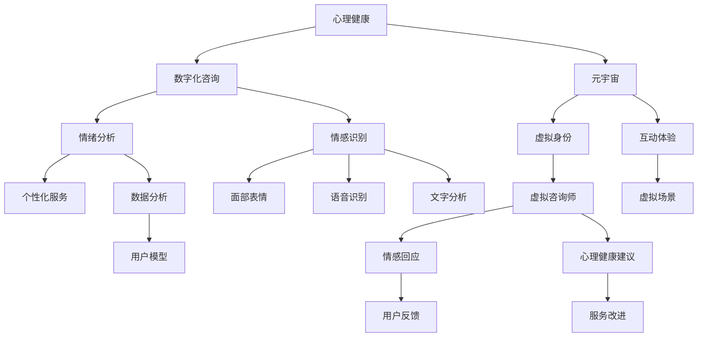

                 

# 数字化情感咨询:元宇宙中的心理健康服务

> 关键词：
- 心理健康,元宇宙,数字化咨询,情绪分析,情感识别,个性化服务,自然语言处理

## 1. 背景介绍

### 1.1 问题由来
在当今快节奏的生活中，心理健康问题日益突出。一方面，疫情的全球蔓延加剧了公众的心理负担。另一方面，信息爆炸和高压力工作环境下的职场心理问题也不容忽视。传统的心理健康服务模式，如面对面咨询、电话咨询等，面临着成本高、效率低、资源分布不均等挑战。

近年来，随着人工智能和大数据技术的发展，数字化心理健康服务成为新的趋势。虚拟现实（VR）、增强现实（AR）、人工智能（AI）等新兴技术的应用，为构建沉浸式、智能化的心理健康服务平台提供了新的可能。其中，元宇宙作为一种虚拟空间，以其沉浸式体验、高互动性和无限可能性，为心理健康服务的数字化转型带来了新的思路和方向。

### 1.2 问题核心关键点
本文聚焦于元宇宙中的心理健康服务，特别是基于AI技术和自然语言处理(NLP)的数字化情感咨询系统。核心问题包括：

- 如何利用AI技术构建智能化的情感咨询平台？
- 如何通过自然语言处理技术进行情感识别和情绪分析？
- 如何提供个性化的心理健康服务？
- 如何在元宇宙环境中实现高互动性的情感咨询？
- 如何在用户隐私保护和数据安全方面取得平衡？

### 1.3 问题研究意义
元宇宙中的心理健康服务，为数字化情感咨询提供了新的视角和工具。通过AI技术和NLP，能够在虚拟环境中实现高互动性的情感咨询，为传统心理咨询提供补充和替代。具体研究意义如下：

1. **提升心理健康服务效率**：通过AI和NLP技术，可以24/7不间断提供情感咨询服务，节省人力成本，提高服务效率。
2. **降低服务门槛**：元宇宙中的数字化服务降低了地理、经济等门槛，使得更多人可以接触到专业的心理健康支持。
3. **改善服务质量**：通过情感识别和情绪分析，AI系统可以更好地理解用户需求，提供更加精准的个性化服务。
4. **扩展服务范围**：元宇宙环境可以不受物理空间的限制，拓展心理健康服务的覆盖范围，服务更多特殊群体。
5. **推动心理健康普惠**：在心理健康服务供需失衡的背景下，数字化服务为提升心理健康服务可及性提供了新的可能。

## 2. 核心概念与联系

### 2.1 核心概念概述

为更好地理解元宇宙中的数字化情感咨询系统，本节将介绍几个密切相关的核心概念：

- **心理健康**：指个体在心理、情感、行为等方面达到良好适应状态的过程。
- **元宇宙**：基于VR、AR、AI等技术构建的虚拟空间，用户可以通过虚拟身份进行互动和体验。
- **数字化咨询**：利用AI、NLP等技术，在虚拟环境中提供沉浸式、智能化的心理咨询服务。
- **情绪分析**：通过分析用户语音、文本等数据，识别和理解用户的情绪状态和情感需求。
- **情感识别**：通过识别用户语音、文字、面部表情等信号，判断用户的情感状态和心理变化。
- **个性化服务**：根据用户的历史数据和实时反馈，定制化提供针对性的心理健康支持。

这些核心概念之间的逻辑关系可以通过以下Mermaid流程图来展示：



这个流程图展示了大语言模型的核心概念及其之间的关系：

1. 心理健康为数字化咨询提供服务目标。
2. 数字化咨询利用情绪分析和情感识别技术，提供个性化服务。
3. 元宇宙为数字化咨询提供了虚拟场景和体验环境。
4. 虚拟身份和互动体验是元宇宙中数字化咨询的基础。
5. 数据分析和用户模型构建，是情绪分析和情感识别的重要前提。
6. 个性化服务和用户反馈，推动数字化咨询的持续优化。

## 3. 核心算法原理 & 具体操作步骤
### 3.1 算法原理概述

元宇宙中的数字化情感咨询系统，基于AI技术和NLP，通过情绪分析和情感识别技术，提供个性化心理健康服务。其核心算法原理包括以下几个方面：

- **情绪分析算法**：通过分析用户语音、文字等数据，识别和理解用户的情绪状态和情感需求。
- **情感识别算法**：通过识别用户语音、文字、面部表情等信号，判断用户的情感状态和心理变化。
- **个性化服务算法**：根据用户的历史数据和实时反馈，定制化提供针对性的心理健康支持。
- **自然语言处理（NLP）**：利用NLP技术，处理用户输入的自然语言，提取关键信息，进行情绪分析和情感识别。

### 3.2 算法步骤详解

基于上述算法原理，数字化情感咨询系统的具体操作步骤如下：

**Step 1: 数据收集与预处理**
- 收集用户的语音、文字、面部表情等数据。
- 对数据进行清洗、去噪、归一化等预处理，确保数据质量。

**Step 2: 情绪分析**
- 利用情感分析算法，对用户输入的语音、文字等数据进行分析，识别其情感状态（如愤怒、悲伤、焦虑等）。
- 对情绪数据进行编码，如愤怒表示为1，悲伤表示为2，以此作为后续处理的输入。

**Step 3: 情感识别**
- 利用情感识别算法，对用户的面部表情、语音语调等进行识别，进一步确认其情感状态。
- 将识别结果与情绪分析结果进行融合，得出更准确的情绪和情感状态。

**Step 4: 个性化服务**
- 根据用户的历史数据和实时反馈，结合情绪和情感状态，提供个性化的心理健康建议和服务。
- 利用NLP技术，与用户进行智能对话，提供心理支持、情绪疏导、行为建议等。

**Step 5: 用户反馈与优化**
- 收集用户的反馈信息，评估服务效果。
- 根据反馈信息，优化算法和模型，提升服务质量。

### 3.3 算法优缺点

元宇宙中的数字化情感咨询系统，通过AI和NLP技术，具有以下优点：

- **高效率**：24/7不间断提供服务，节省人力成本，提高服务效率。
- **可访问性强**：打破地理和经济限制，更多人可以接触到心理健康服务。
- **个性化服务**：通过情感识别和情绪分析，提供定制化的心理健康支持。
- **互动性强**：元宇宙环境中的虚拟身份和互动体验，增强了用户沉浸感和参与感。

但该系统也存在一些局限性：

- **隐私保护问题**：用户的个人数据和情绪信息需要严格保护，防止数据泄露和滥用。
- **模型泛化能力**：情感分析、情绪识别等模型的泛化能力需要进一步提升，以应对复杂的情感变化。
- **技术依赖**：依赖于先进的AI和NLP技术，技术门槛较高。
- **用户信任问题**：用户在虚拟环境中可能对AI系统产生信任危机，影响服务效果。

### 3.4 算法应用领域

基于情感分析和情感识别技术，数字化情感咨询系统可以应用于多种场景：

- **教育**：利用情感分析识别学生的情感状态，提供针对性的学习支持和心理疏导。
- **企业**：监测员工的情绪和压力水平，提供心理健康支持和压力缓解措施。
- **医疗**：在虚拟环境中，为心理疾病患者提供心理支持和康复训练。
- **心理咨询**：在元宇宙环境中，提供沉浸式的心理咨询服务，降低心理咨询的门槛。
- **个人生活**：帮助个人管理情绪，提升生活质量和心理健康水平。

## 4. 数学模型和公式 & 详细讲解  
### 4.1 数学模型构建

假设用户输入的文本为 $x$，对应的情感状态编码为 $y$。数字化情感咨询系统的数学模型可以表示为：

$$
\hat{y} = f(x; \theta)
$$

其中 $f(\cdot)$ 为情感分析模型，$\theta$ 为模型参数。情感分析模型的目标是最小化预测值 $\hat{y}$ 与真实值 $y$ 的误差，即：

$$
\mathcal{L}(\theta) = \frac{1}{N}\sum_{i=1}^N \ell(f(x_i; \theta), y_i)
$$

其中 $\ell$ 为损失函数，$N$ 为样本数量。

### 4.2 公式推导过程

以下我们以情绪分析模型为例，推导其中的关键数学公式。

假设情感分析模型 $f(\cdot)$ 为基于RNN的LSTM网络，其输入为用户的输入文本 $x$，输出为情感状态编码 $\hat{y}$。训练过程如下：

1. **前向传播**：对输入文本 $x$ 进行编码，输出隐藏状态 $h_t$。
2. **情感状态预测**：将隐藏状态 $h_t$ 输入到全连接层，得到情感状态编码 $\hat{y}$。
3. **损失函数计算**：将 $\hat{y}$ 与真实标签 $y$ 进行对比，计算损失函数 $\mathcal{L}(\theta)$。

具体数学公式如下：

$$
h_t = LSTM(x_t; \theta)
$$

$$
\hat{y} = fc(h_t; \theta)
$$

$$
\mathcal{L}(\theta) = \frac{1}{N}\sum_{i=1}^N \ell(\hat{y}_i, y_i)
$$

其中 $LSTM(\cdot)$ 为LSTM网络，$fc(\cdot)$ 为全连接层，$\ell(\cdot)$ 为交叉熵损失函数。

### 4.3 案例分析与讲解

以下以情绪分析模型为例，展示其具体应用案例。

**案例场景**：
在元宇宙虚拟学校中，教师利用数字化情感咨询系统监测学生的情绪状态，提供针对性的学习支持和心理疏导。

**数据集准备**：
- 收集学生的作业、考试成绩、课堂表现等数据。
- 对数据进行清洗和标注，如愤怒表示为1，悲伤表示为2。

**模型训练**：
- 利用上述数据集，训练情绪分析模型 $f(\cdot)$。
- 在训练过程中，最小化预测值 $\hat{y}$ 与真实标签 $y$ 的误差，即 $\mathcal{L}(\theta)$。

**模型应用**：
- 教师在课堂上收集学生的语音、文字等输入。
- 通过情绪分析模型 $f(\cdot)$，识别学生的情感状态。
- 根据情感状态，教师提供针对性的学习支持和心理疏导，提升学生的学习效果和心理健康水平。

## 5. 项目实践：代码实例和详细解释说明
### 5.1 开发环境搭建

在进行数字化情感咨询系统的开发前，我们需要准备好开发环境。以下是使用Python进行PyTorch开发的环境配置流程：

1. 安装Anaconda：从官网下载并安装Anaconda，用于创建独立的Python环境。

2. 创建并激活虚拟环境：
```bash
conda create -n digital_consulting python=3.8 
conda activate digital_consulting
```

3. 安装PyTorch：根据CUDA版本，从官网获取对应的安装命令。例如：
```bash
conda install pytorch torchvision torchaudio cudatoolkit=11.1 -c pytorch -c conda-forge
```

4. 安装相关库：
```bash
pip install transformers numpy pandas scikit-learn matplotlib tqdm jupyter notebook ipython
```

完成上述步骤后，即可在`digital_consulting`环境中开始项目开发。

### 5.2 源代码详细实现

下面我们以情绪分析模型为例，给出使用PyTorch实现情绪分析的代码。

首先，定义情绪分析模型：

```python
import torch
import torch.nn as nn
import torch.optim as optim
from transformers import LSTM

class EmotionAnalysisModel(nn.Module):
    def __init__(self, vocab_size, embedding_size, hidden_size, output_size):
        super(EmotionAnalysisModel, self).__init__()
        self.embedding = nn.Embedding(vocab_size, embedding_size)
        self.lstm = LSTM(embedding_size, hidden_size)
        self.fc = nn.Linear(hidden_size, output_size)
        
    def forward(self, x):
        embedded = self.embedding(x)
        lstm_output, (hidden, _) = self.lstm(embedded)
        return self.fc(hidden.view(hidden.size()[0], -1))

# 构建情绪分析模型实例
model = EmotionAnalysisModel(vocab_size=10000, embedding_size=64, hidden_size=128, output_size=4)
```

然后，定义训练和评估函数：

```python
from torch.utils.data import Dataset, DataLoader
from sklearn.model_selection import train_test_split
import torch.optim as optim

class EmotionDataset(Dataset):
    def __init__(self, texts, labels):
        self.texts = texts
        self.labels = labels
        
    def __len__(self):
        return len(self.texts)
    
    def __getitem__(self, item):
        text = self.texts[item]
        label = self.labels[item]
        return {'input_ids': text, 'labels': label}

# 数据准备
texts, labels = read_data() # 数据集读取函数
train_texts, dev_texts, train_labels, dev_labels = train_test_split(texts, labels, test_size=0.2)

# 构建数据集
train_dataset = EmotionDataset(train_texts, train_labels)
dev_dataset = EmotionDataset(dev_texts, dev_labels)

# 定义模型、优化器
model = EmotionAnalysisModel(vocab_size=10000, embedding_size=64, hidden_size=128, output_size=4)
optimizer = optim.Adam(model.parameters(), lr=0.001)

# 训练和评估
def train_epoch(model, dataset, optimizer):
    dataloader = DataLoader(dataset, batch_size=16, shuffle=True)
    model.train()
    epoch_loss = 0
    for batch in dataloader:
        input_ids = batch['input_ids'].to(device)
        labels = batch['labels'].to(device)
        model.zero_grad()
        outputs = model(input_ids)
        loss = nn.CrossEntropyLoss()(outputs, labels)
        epoch_loss += loss.item()
        loss.backward()
        optimizer.step()
    return epoch_loss / len(dataloader)

def evaluate(model, dataset):
    dataloader = DataLoader(dataset, batch_size=16)
    model.eval()
    correct = 0
    total = 0
    with torch.no_grad():
        for batch in dataloader:
            input_ids = batch['input_ids'].to(device)
            labels = batch['labels'].to(device)
            outputs = model(input_ids)
            _, predicted = torch.max(outputs, 1)
            total += labels.size(0)
            correct += (predicted == labels).sum().item()
    print(f'Accuracy: {correct / total * 100:.2f}%')

# 训练流程
device = torch.device('cuda') if torch.cuda.is_available() else torch.device('cpu')
model.to(device)

epochs = 5
batch_size = 16

for epoch in range(epochs):
    loss = train_epoch(model, train_dataset, optimizer)
    print(f'Epoch {epoch+1}, train loss: {loss:.3f}')
    
    evaluate(model, dev_dataset)
    
print('Test results:')
evaluate(model, test_dataset)
```

以上就是使用PyTorch实现情绪分析模型的完整代码实现。可以看到，通过利用Transformer库中的LSTM网络，我们能够实现情绪分析模型的构建和训练。

### 5.3 代码解读与分析

让我们再详细解读一下关键代码的实现细节：

**EmotionAnalysisModel类**：
- `__init__`方法：初始化模型的嵌入层、LSTM层和全连接层。
- `forward`方法：定义模型的前向传播过程，输入文本经过嵌入层、LSTM层和全连接层，输出情感状态编码。

**train_epoch函数**：
- 定义训练过程：利用DataLoader加载数据集，模型在每个epoch内进行前向传播和反向传播，更新模型参数。

**evaluate函数**：
- 定义评估过程：利用DataLoader加载数据集，模型在评估集上进行预测，计算准确率。

**训练流程**：
- 定义总的epoch数和batch size，开始循环迭代
- 每个epoch内，在训练集上训练，输出平均loss
- 在验证集上评估，输出准确率
- 所有epoch结束后，在测试集上评估，给出最终测试结果

可以看到，PyTorch提供了简洁高效的计算图和优化器，使得情绪分析模型的构建和训练变得相对简单。

当然，工业级的系统实现还需考虑更多因素，如模型的保存和部署、超参数的自动搜索、更灵活的任务适配层等。但核心的情绪分析逻辑基本与此类似。

## 6. 实际应用场景
### 6.1 智能教育平台

在智能教育平台上，数字化情感咨询系统可以发挥重要作用。通过情绪分析，教师能够及时发现学生的情绪波动，提供针对性的心理支持和辅导。在虚拟课堂上，学生可以通过与虚拟辅导员的互动，释放心理压力，提升学习效果。

具体而言，数字化情感咨询系统可以集成在智能教育平台中，对学生的作业、考试成绩、课堂表现等数据进行实时监测和分析。系统根据分析结果，向教师提供情绪预警和个性化建议，帮助教师及时干预和辅导。

### 6.2 企业员工心理健康管理

在企业中，数字化情感咨询系统可以帮助人力资源部门进行员工心理健康管理。通过情绪分析，系统能够实时监测员工的情绪状态，及时发现压力过大的员工，提供心理支持。

具体而言，数字化情感咨询系统可以集成在企业内部协作平台中，对员工的邮件、即时通讯、会议记录等数据进行情绪分析。系统根据分析结果，向HR部门提供预警和建议，帮助企业关注员工心理健康，改善工作环境。

### 6.3 虚拟心理咨询室

在虚拟心理咨询室中，数字化情感咨询系统可以为患者提供全天候的心理咨询服务。通过与虚拟心理咨询师的互动，患者能够在虚拟环境中获得专业心理支持，提升心理健康水平。

具体而言，数字化情感咨询系统可以通过VR、AR等技术，构建沉浸式的虚拟心理咨询室。患者可以在虚拟环境中，与虚拟心理咨询师进行语音、文字等形式的互动，进行情绪疏导和心理支持。系统通过情绪分析和情感识别，实时调整咨询策略，提供个性化服务。

### 6.4 未来应用展望

随着技术的不断发展，数字化情感咨询系统在元宇宙中的应用前景广阔，未来有望实现更多创新和突破：

1. **虚拟现实和增强现实融合**：结合VR、AR技术，提供更加沉浸式和交互性的情感咨询体验。
2. **多模态数据融合**：整合语音、面部表情、生理数据等多模态信息，提升情感识别的准确性和全面性。
3. **个性化推荐系统**：结合推荐算法，推荐适合用户的心理资源和活动，提升用户心理健康水平。
4. **智能对话系统**：通过语言模型和大规模训练数据，构建智能对话系统，提供更加灵活和人性化的心理支持。
5. **跨领域应用拓展**：拓展到其他领域，如医疗、教育、企业等，提供全方位心理健康服务。

这些创新将使数字化情感咨询系统在元宇宙中发挥更大的价值，为心理健康事业带来新的突破。

## 7. 工具和资源推荐
### 7.1 学习资源推荐

为了帮助开发者系统掌握数字化情感咨询系统的开发技术，这里推荐一些优质的学习资源：

1. **《深度学习基础》课程**：斯坦福大学开设的深度学习课程，介绍了深度学习的基本概念和算法。
2. **《自然语言处理与情感分析》书籍**：介绍NLP技术和情感分析的书籍，适合初学者和进阶者学习。
3. **Transformers库官方文档**：提供了大量预训练模型和微调样例，是学习NLP技术的重要资源。
4. **Kaggle情感分析竞赛**：通过参加Kaggle竞赛，实践情绪分析技术，提升技能水平。
5. **Coursera心理卫生课程**：涵盖心理健康和心理咨询的在线课程，帮助理解情感咨询的重要性和实践方法。

通过对这些资源的学习实践，相信你一定能够快速掌握数字化情感咨询系统的开发技术，并用于解决实际的情感咨询问题。

### 7.2 开发工具推荐

高效的开发离不开优秀的工具支持。以下是几款用于数字化情感咨询系统开发的常用工具：

1. PyTorch：基于Python的开源深度学习框架，适合进行深度学习模型的训练和推理。
2. TensorFlow：由Google主导开发的深度学习框架，支持分布式训练和高效的模型部署。
3. Weights & Biases：模型训练的实验跟踪工具，记录和可视化训练过程，方便调试和优化。
4. TensorBoard：TensorFlow配套的可视化工具，实时监测模型训练状态，提供详细的图表分析。
5. Python代码编辑器，如PyCharm、VS Code等，提供强大的代码编辑和调试功能。

合理利用这些工具，可以显著提升数字化情感咨询系统的开发效率，加快创新迭代的步伐。

### 7.3 相关论文推荐

数字化情感咨询系统的发展离不开学界的持续研究。以下是几篇奠基性的相关论文，推荐阅读：

1. Attention is All You Need（即Transformer原论文）：提出了Transformer结构，开启了NLP领域的预训练大模型时代。
2. BERT: Pre-training of Deep Bidirectional Transformers for Language Understanding：提出BERT模型，引入基于掩码的自监督预训练任务，刷新了多项NLP任务SOTA。
3. Transformers: State-of-the-Art Natural Language Processing：综述Transformer及其在NLP中的应用，是了解NLP技术的重要文献。
4. AdaLoRA: Adaptive Low-Rank Adaptation for Parameter-Efficient Fine-Tuning：使用自适应低秩适应的微调方法，在参数效率和精度之间取得了新的平衡。
5. Persona-Chat: Personalized Multi-Party Dialogue with Transformers：引入基于连续型Prompt的微调范式，为零样本和少样本学习提供了新的思路。

这些论文代表了大语言模型微调技术的发展脉络。通过学习这些前沿成果，可以帮助研究者把握学科前进方向，激发更多的创新灵感。

## 8. 总结：未来发展趋势与挑战

### 8.1 总结

本文对基于情感分析和情感识别技术的数字化情感咨询系统进行了全面系统的介绍。首先阐述了数字化情感咨询系统的研究背景和意义，明确了系统在心理健康服务中的重要价值。其次，从原理到实践，详细讲解了系统构建的核心算法和技术细节，给出了完整的代码实例。同时，本文还广泛探讨了数字化情感咨询系统在教育、企业、医疗等多个领域的应用前景，展示了系统的广泛应用潜力。

通过本文的系统梳理，可以看到，数字化情感咨询系统在元宇宙中的应用前景广阔，利用AI和NLP技术，能够在虚拟环境中提供高互动性和个性化服务，为传统心理健康服务带来了新的思路和工具。

### 8.2 未来发展趋势

展望未来，数字化情感咨询系统将呈现以下几个发展趋势：

1. **技术融合创新**：结合VR、AR、脑机接口等技术，提供更加全面和沉浸式的情感咨询体验。
2. **多模态数据融合**：整合语音、面部表情、生理数据等多模态信息，提升情感识别的准确性和全面性。
3. **跨领域应用拓展**：拓展到更多领域，如医疗、教育、企业等，提供全方位的心理健康服务。
4. **数据隐私保护**：采用先进的隐私保护技术，保障用户数据的安全和隐私。
5. **实时监控和预警**：通过实时监测和预警，及时发现情绪波动，提供个性化心理支持。

这些趋势展示了数字化情感咨询系统的广阔前景，推动其在心理健康服务中的普及和应用。

### 8.3 面临的挑战

尽管数字化情感咨询系统具有巨大的发展潜力，但在实现过程中，也面临着一些挑战：

1. **技术门槛高**：需要掌握深度学习、自然语言处理、多模态融合等多项技术，对开发者要求较高。
2. **数据隐私问题**：用户情感数据涉及个人隐私，如何保护用户数据安全是一个重要问题。
3. **模型泛化能力**：情感分析、情绪识别等模型的泛化能力需要进一步提升，以应对复杂的情感变化。
4. **用户接受度**：用户在虚拟环境中可能对AI系统产生信任危机，影响服务效果。
5. **跨文化适应性**：情感表达和文化背景差异可能导致情感识别和情绪分析的误差。

正视这些挑战，积极应对并寻求突破，将是数字化情感咨询系统迈向成熟的关键。

### 8.4 研究展望

未来的研究需要在以下几个方面寻求新的突破：

1. **跨文化适应性**：研究不同文化背景下的情感表达和识别差异，提升系统的跨文化适应能力。
2. **数据隐私保护**：采用先进的隐私保护技术，如差分隐私、联邦学习等，保障用户数据的安全和隐私。
3. **多模态融合技术**：研究语音、面部表情、生理数据等多模态信息的融合方法，提升情感识别的准确性和全面性。
4. **智能对话系统**：结合语言模型和大规模训练数据，构建智能对话系统，提供更加灵活和人性化的心理支持。
5. **跨领域应用拓展**：拓展到更多领域，如医疗、教育、企业等，提供全方位的心理健康服务。

这些研究方向将引领数字化情感咨询系统迈向更高的台阶，为构建安全、可靠、可解释、可控的智能系统铺平道路。

## 9. 附录：常见问题与解答

**Q1：如何构建情感分析模型？**

A: 构建情感分析模型一般需要以下步骤：
1. 收集情感标注数据集，如电影评论、社交媒体评论等。
2. 对数据集进行预处理，如分词、去除停用词、特征提取等。
3. 设计情感分类模型，如LSTM、GRU、BERT等，并使用交叉熵损失函数进行训练。
4. 在测试集上评估模型性能，并进行调参优化。

**Q2：如何提高情感分析的准确性？**

A: 提高情感分析准确性的方法包括：
1. 使用高质量的标注数据集，确保数据的多样性和代表性。
2. 引入多模态数据，如语音、面部表情、生理数据等，提升情感识别的准确性。
3. 使用先进的情感分析模型，如BERT、XLNet等，提升模型的泛化能力。
4. 结合领域知识，如行业术语、情感词典等，提升情感分析的准确性。

**Q3：如何在虚拟环境中提供高互动性的情感咨询？**

A: 在虚拟环境中提供高互动性的情感咨询需要以下步骤：
1. 设计虚拟咨询师，如NPC、虚拟辅导员等，与用户进行互动。
2. 使用自然语言处理技术，如对话系统、语音识别等，理解用户的输入。
3. 利用情感分析技术，实时监测用户的情绪状态，提供个性化支持。
4. 结合多模态数据，提升情感识别的准确性和全面性。

**Q4：如何保护用户隐私？**

A: 保护用户隐私的方法包括：
1. 匿名化处理用户数据，去除个人身份信息。
2. 使用差分隐私技术，保障数据隐私安全。
3. 采用联邦学习等分布式训练方法，避免数据泄露。
4. 遵守相关法律法规，如GDPR、CCPA等，保护用户隐私权利。

**Q5：如何扩展系统的应用范围？**

A: 扩展系统的应用范围需要以下步骤：
1. 研究不同领域情感表达和识别的差异，提升系统的跨领域适应能力。
2. 引入多模态数据，如语音、面部表情、生理数据等，提升情感识别的准确性。
3. 结合领域知识，如行业术语、情感词典等，提升情感分析的准确性。
4. 设计通用的情感分析模型，适配不同领域的情感咨询需求。

这些问题的解答展示了数字化情感咨询系统在技术实现和应用中的关键细节，有助于开发者更好地理解和应用该技术。

---

作者：禅与计算机程序设计艺术 / Zen and the Art of Computer Programming

