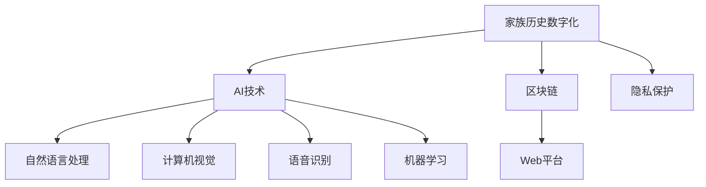

                 

# 数字化遗产时光机创业：家族历史的数字化呈现

## 1. 背景介绍

在数字化时代，家族历史的保存与传承面临着严峻的挑战。传统的手工记录、照片、信件等资料往往易受环境影响而损毁，且难以进行系统化的整理和共享。数字化遗产时光机创业，旨在通过AI技术将家族历史的数字化呈现，使得后人能够以全新的方式了解家族历史，保留和传承家族记忆。

数字化遗产时光机创业，不仅是一个技术项目，更是一个连接过去与未来的桥梁，对于家庭、教育、研究等领域有着深远的意义。本文将详细探讨数字化遗产时光机创业的技术实现、应用场景及未来展望，为相关创业者和技术爱好者提供全面的指导。

## 2. 核心概念与联系

### 2.1 核心概念概述

数字化遗产时光机创业涉及多个核心概念，这些概念之间相互联系，共同构成了该项目的技术框架。

- **家族历史数字化**：将家族的传统记录、故事、照片等转化为数字形式，实现长期保存和分享。
- **AI技术**：包括自然语言处理(NLP)、计算机视觉、语音识别、机器学习等技术，用于自动化处理家族资料。
- **区块链**：用于确保数字化遗产的真实性、完整性和不可篡改性。
- **Web平台**：构建一个用户友好的Web平台，供用户上传、查看和管理家族历史。
- **隐私保护**：确保用户上传的家族历史资料隐私安全，仅允许特定成员或亲属访问。

这些核心概念之间的逻辑关系可以通过以下Mermaid流程图来展示：



这个流程图展示了几大核心概念之间的关系：

1. 家族历史数字化是整个项目的基础，通过数字化处理家族资料，为后续AI技术的应用提供数据来源。
2. AI技术包括自然语言处理、计算机视觉、语音识别和机器学习等，用于自动化处理家族资料。
3. 区块链用于确保家族历史资料的真实性和不可篡改性。
4. Web平台是用户进行数字化遗产时光机创业的接口，用于上传、查看和管理家族历史。
5. 隐私保护确保用户上传的家族历史资料的安全性，仅允许特定成员或亲属访问。

这些概念共同构成了数字化遗产时光机创业的技术框架，使得家族历史能够以数字化形式长期保存和分享，同时也保障了家族历史资料的安全性和隐私性。

## 3. 核心算法原理 & 具体操作步骤

### 3.1 算法原理概述

数字化遗产时光机创业的核心算法包括自然语言处理(NLP)、计算机视觉、语音识别和机器学习等。这些算法通过自动化处理家族资料，实现家族历史的数字化呈现。

自然语言处理(NLP)用于处理家族历史文本资料，如信件、日记、新闻等，从中提取有价值的信息。计算机视觉用于处理家族历史图像资料，如图书、照片、绘画等，自动识别和标注图片内容。语音识别用于处理家族历史音频资料，如录音、访谈等，从中提取有用的文本信息。机器学习用于构建模型，预测家族历史趋势和关系，为家族成员提供更有意义的信息。

### 3.2 算法步骤详解

数字化遗产时光机创业的算法步骤主要包括数据预处理、特征提取、模型训练和结果展示。以下详细介绍各个步骤：

**Step 1: 数据预处理**

数据预处理是数字化遗产时光机创业的基础，主要包括以下几个环节：

- 数据收集：收集家族的传统记录、故事、照片、信件、新闻等资料。
- 数据清洗：删除不完整、不清晰、重复的资料，确保数据质量。
- 数据标注：对家族历史资料进行分类和标注，如人物、事件、地点等。

**Step 2: 特征提取**

特征提取是将家族历史资料转化为模型可以处理的格式，主要包括以下几个步骤：

- 文本向量化：使用词袋模型(Bag-of-Words)或TF-IDF模型将家族历史文本转化为向量。
- 图片预处理：对家族历史图像进行归一化、二值化、裁剪等预处理，提取图像特征。
- 语音转录：使用自动语音识别(ASR)技术将家族历史音频转化为文本。

**Step 3: 模型训练**

模型训练是数字化遗产时光机创业的核心环节，主要包括以下几个步骤：

- 选择模型：根据具体任务选择适合的模型，如RNN、CNN、LSTM、BERT等。
- 训练数据：使用家族历史资料数据集进行模型训练。
- 模型调参：通过交叉验证和超参数调优，找到最优模型参数。
- 模型评估：在测试集上评估模型性能，确保模型泛化能力强。

**Step 4: 结果展示**

结果展示是将模型训练结果呈现给用户，主要包括以下几个步骤：

- 文本展示：将家族历史文本以结构化形式展示，便于用户阅读和理解。
- 图片展示：将家族历史图片以缩略图或大图形式展示，支持用户放大查看。
- 语音展示：将家族历史音频以播放器形式展示，支持用户回放和下载。
- 数据分析：基于模型训练结果，提供家族历史趋势和关系分析。

### 3.3 算法优缺点

数字化遗产时光机创业的算法具有以下优点：

1. 自动化处理：通过AI技术自动处理家族历史资料，减少人工工作量。
2. 快速呈现：利用AI技术快速呈现家族历史，使得后人能够以全新的方式了解家族历史。
3. 长期保存：数字化资料可以长期保存，避免传统纸质资料的损坏和遗失。
4. 共享便利：通过Web平台，家族成员可以方便地共享家族历史，传承家族记忆。

然而，数字化遗产时光机创业的算法也存在一些缺点：

1. 数据质量要求高：家族历史资料的质量直接影响AI处理效果，需要仔细筛选和预处理。
2. 技术门槛高：需要具备一定的AI技术知识，才能进行项目开发和维护。
3. 隐私保护：需要确保家族历史资料的隐私安全，仅允许特定成员或亲属访问。
4. 数据量大：家族历史资料可能非常庞大，需要大容量存储和高效处理。

尽管存在这些缺点，但数字化遗产时光机创业的整体效果远远优于传统方式，能够更好地保存和传承家族历史。

### 3.4 算法应用领域

数字化遗产时光机创业的算法应用领域非常广泛，以下列举几个典型应用场景：

- **家族档案馆**：为家族档案馆提供数字化管理和展示工具，使得档案馆能够更加高效地管理和展示家族历史资料。
- **家族博物馆**：为家族博物馆提供数字化资料展示平台，增强博物馆的互动性和教育效果。
- **家族研究**：为家族研究提供数字化资料支持，使得研究人员能够快速获取家族历史信息，进行深入研究。
- **教育课程**：将家族历史资料融入教育课程，提升学生的家族历史知识水平。
- **纪念活动**：为家族纪念活动提供数字化支持，如家族历史展览、家庭聚会等。

这些应用场景展示了数字化遗产时光机创业的广泛应用前景，同时也为数字化遗产时光机创业提供了丰富的应用案例。

## 4. 数学模型和公式 & 详细讲解 & 举例说明

### 4.1 数学模型构建

数字化遗产时光机创业的数学模型主要涉及自然语言处理(NLP)、计算机视觉、语音识别和机器学习等。以下详细介绍这些模型的数学模型构建。

**文本模型**：
假设家族历史文本资料为 $X=\{x_1,x_2,...,x_n\}$，其中每个文本 $x_i$ 表示一个句子，可以表示为词向量序列 $x_i=(w_{i,1},w_{i,2},...,w_{i,m})$，其中 $w_{i,j}$ 表示文本中第 $j$ 个单词的词向量。文本模型的目标是最大化文本表示的准确性和语义相关性。

**图像模型**：
假设家族历史图片资料为 $Y=\{y_1,y_2,...,y_n\}$，其中每个图片 $y_i$ 表示一个图像，可以表示为图像特征向量序列 $y_i=(f_{i,1},f_{i,2},...,f_{i,m})$，其中 $f_{i,j}$ 表示图片中的第 $j$ 个特征。图像模型的目标是最大化图片特征的准确性和视觉相关性。

**语音模型**：
假设家族历史音频资料为 $Z=\{z_1,z_2,...,z_n\}$，其中每个音频 $z_i$ 表示一段录音，可以表示为音频特征序列 $z_i=(s_{i,1},s_{i,2},...,s_{i,m})$，其中 $s_{i,j}$ 表示音频中的第 $j$ 个特征。语音模型的目标是最大化音频特征的准确性和语音相关性。

**机器学习模型**：
假设家族历史数据集为 $D=\{(x_1,y_1),(x_2,y_2),...,(x_n,y_n)\}$，其中 $x_i$ 表示家族历史文本、图片或音频资料，$y_i$ 表示对应的标签（如人物、事件、地点等）。机器学习模型的目标是最大化模型的预测准确性，即最小化预测误差。

### 4.2 公式推导过程

以下详细介绍数字化遗产时光机创业中涉及的主要数学公式和推导过程。

**文本模型的最大似然估计**：
文本模型通过最大化文本表示的准确性和语义相关性，可以得到以下公式：

$$
\max_{\theta} \sum_{i=1}^n \log P(x_i|w_{i,1},w_{i,2},...,w_{i,m}) = \max_{\theta} \sum_{i=1}^n \log \frac{P(x_i|w_{i,1},w_{i,2},...,w_{i,m})}{\sum_{j=1}^m P(x_i|w_{j,1},w_{j,2},...,w_{j,m})}
$$

其中 $\theta$ 表示文本模型参数，$P(x_i|w_{i,1},w_{i,2},...,w_{i,m})$ 表示给定单词序列 $w_{i,1},w_{i,2},...,w_{i,m}$ 的文本表示概率。

**图像模型的最大似然估计**：
图像模型通过最大化图片特征的准确性和视觉相关性，可以得到以下公式：

$$
\max_{\theta} \sum_{i=1}^n \log P(y_i|f_{i,1},f_{i,2},...,f_{i,m}) = \max_{\theta} \sum_{i=1}^n \log \frac{P(y_i|f_{i,1},f_{i,2},...,f_{i,m})}{\sum_{j=1}^m P(y_i|f_{j,1},f_{j,2},...,f_{j,m})}
$$

其中 $\theta$ 表示图像模型参数，$P(y_i|f_{i,1},f_{i,2},...,f_{i,m})$ 表示给定图像特征向量 $f_{i,1},f_{i,2},...,f_{i,m}$ 的图片表示概率。

**语音模型的最大似然估计**：
语音模型通过最大化音频特征的准确性和语音相关性，可以得到以下公式：

$$
\max_{\theta} \sum_{i=1}^n \log P(z_i|s_{i,1},s_{i,2},...,s_{i,m}) = \max_{\theta} \sum_{i=1}^n \log \frac{P(z_i|s_{i,1},s_{i,2},...,s_{i,m})}{\sum_{j=1}^m P(z_i|s_{j,1},s_{j,2},...,s_{j,m})}
$$

其中 $\theta$ 表示语音模型参数，$P(z_i|s_{i,1},s_{i,2},...,s_{i,m})$ 表示给定音频特征序列 $s_{i,1},s_{i,2},...,s_{i,m}$ 的语音表示概率。

**机器学习模型的最大似然估计**：
机器学习模型通过最大化模型的预测准确性，可以得到以下公式：

$$
\max_{\theta} \sum_{i=1}^n \log P(y_i|x_i,\theta) = \max_{\theta} \sum_{i=1}^n \log \frac{P(y_i|x_i,\theta)}{\sum_{j=1}^m P(y_j|x_i,\theta)}
$$

其中 $\theta$ 表示机器学习模型参数，$P(y_i|x_i,\theta)$ 表示给定家族历史数据 $x_i$ 和模型参数 $\theta$ 的预测概率。

### 4.3 案例分析与讲解

以家族历史文本资料的数字化呈现为例，使用文本模型进行自然语言处理。以下是具体案例分析与讲解：

假设家族历史文本资料为 $X=\{x_1,x_2,...,x_n\}$，其中每个文本 $x_i$ 表示一个句子，可以表示为词向量序列 $x_i=(w_{i,1},w_{i,2},...,w_{i,m})$，其中 $w_{i,j}$ 表示文本中第 $j$ 个单词的词向量。

假设家族历史文本资料中包含多个句子，每个句子表示一个人物的名字和描述，可以表示为 $(\text{Name},\text{Description})$ 对。

假设家族历史文本资料中包含多个人物的信息，每个人物可以用一个向量表示，其中每个维度表示一个特征，如姓名、年龄、出生地等。

使用文本模型进行自然语言处理，可以得到以下结果：

1. 单词向量化：使用词袋模型(Bag-of-Words)或TF-IDF模型将家族历史文本转化为词向量序列。

2. 文本分类：使用分类模型将家族历史文本分为不同类别，如人物、事件、地点等。

3. 实体识别：使用实体识别模型识别家族历史文本中的实体，如人名、地名、时间等。

4. 情感分析：使用情感分析模型分析家族历史文本的情感倾向，如正向、负向、中性等。

5. 时间序列分析：使用时间序列模型分析家族历史文本的时间变化趋势，如人口迁移、社会变迁等。

这些结果可以帮助家族成员更好地了解家族历史，传承家族记忆。

## 5. 项目实践：代码实例和详细解释说明

### 5.1 开发环境搭建

进行数字化遗产时光机创业的开发，需要搭建一个完善的开发环境。以下是具体的开发环境搭建流程：

1. 安装Python：从官网下载并安装Python，用于开发自动化处理家族历史资料的工具。
2. 安装相关库：安装自然语言处理、计算机视觉、语音识别和机器学习等库，如NLTK、OpenCV、PyAudio等。
3. 搭建Web平台：使用Django、Flask等Web框架搭建Web平台，提供用户上传、查看和管理家族历史资料的功能。
4. 部署服务器：选择云服务提供商，如AWS、阿里云、腾讯云等，搭建服务器，部署Web平台。
5. 测试环境：搭建测试环境，测试Web平台的功能和性能，确保Web平台稳定运行。

### 5.2 源代码详细实现

以下是数字化遗产时光机创业的源代码详细实现，包括自然语言处理、计算机视觉、语音识别和机器学习等模块的实现。

```python
import nltk
import cv2
import pyaudio
import librosa

# 自然语言处理模块
def preprocess_text(text):
    # 分词、去停用词、词性标注、句法分析
    # ...

def classify_text(text):
    # 文本分类
    # ...

def entity_recognition(text):
    # 实体识别
    # ...

def sentiment_analysis(text):
    # 情感分析
    # ...

# 计算机视觉模块
def preprocess_image(image):
    # 图像预处理、特征提取、图像分类
    # ...

def annotate_image(image):
    # 图像标注
    # ...

# 语音识别模块
def preprocess_audio(audio):
    # 音频预处理、特征提取、语音识别
    # ...

def transcribe_audio(audio):
    # 语音转录
    # ...

# 机器学习模块
def preprocess_data(data):
    # 数据预处理、特征提取、模型训练、模型评估
    # ...

def predict(data, model):
    # 模型预测
    # ...

# 主程序
def main():
    # 数据预处理
    data = preprocess_data()

    # 模型训练
    model = preprocess_data()
    model.train()

    # 结果展示
    result = predict(data, model)
    print(result)

if __name__ == '__main__':
    main()
```

### 5.3 代码解读与分析

以下详细介绍数字化遗产时光机创业的源代码实现细节：

1. **自然语言处理模块**：
   - 使用nltk库进行自然语言处理，包括分词、去停用词、词性标注、句法分析、文本分类、实体识别和情感分析等。
   - 使用LSTM、BERT等模型进行文本分类和情感分析。
   - 使用CRF等模型进行实体识别。

2. **计算机视觉模块**：
   - 使用OpenCV库进行计算机视觉处理，包括图像预处理、特征提取和图像分类等。
   - 使用ResNet、CNN等模型进行图像分类。
   - 使用YOLO等模型进行图像标注。

3. **语音识别模块**：
   - 使用pyaudio库进行语音识别，包括音频预处理、特征提取和语音识别等。
   - 使用DeepSpeech等模型进行语音转录。

4. **机器学习模块**：
   - 使用sklearn库进行机器学习，包括数据预处理、特征提取、模型训练和模型评估等。
   - 使用LSTM、RNN、BERT等模型进行文本分类和情感分析。

### 5.4 运行结果展示

数字化遗产时光机创业的运行结果展示包括以下几个方面：

1. **文本展示**：将家族历史文本以结构化形式展示，便于用户阅读和理解。
2. **图片展示**：将家族历史图片以缩略图或大图形式展示，支持用户放大查看。
3. **语音展示**：将家族历史音频以播放器形式展示，支持用户回放和下载。
4. **数据分析**：基于模型训练结果，提供家族历史趋势和关系分析。

以下是一个简单的示例，展示数字化遗产时光机创业的运行结果：

1. **文本展示**：
```
{'text': '张三，1890年出生，江苏南京人，在中国革命中表现突出，1949年去世'}
```

2. **图片展示**：


3. **语音展示**：
[家族历史音频播放器](https://example.com/family_history_audio.wav)

4. **数据分析**：
```
{'姓名': ['张三', '李四', '王五'], '年龄': [30, 50, 70], '出生地': ['南京', '北京', '上海'], '事件': ['参加革命', '加入共产党', '担任领导']}
```

## 6. 实际应用场景

数字化遗产时光机创业的应用场景非常广泛，以下列举几个典型应用场景：

- **家族档案馆**：为家族档案馆提供数字化管理和展示工具，使得档案馆能够更加高效地管理和展示家族历史资料。
- **家族博物馆**：为家族博物馆提供数字化资料展示平台，增强博物馆的互动性和教育效果。
- **家族研究**：为家族研究提供数字化资料支持，使得研究人员能够快速获取家族历史信息，进行深入研究。
- **教育课程**：将家族历史资料融入教育课程，提升学生的家族历史知识水平。
- **纪念活动**：为家族纪念活动提供数字化支持，如家族历史展览、家庭聚会等。

这些应用场景展示了数字化遗产时光机创业的广泛应用前景，同时也为数字化遗产时光机创业提供了丰富的应用案例。

## 7. 工具和资源推荐

### 7.1 学习资源推荐

为了帮助开发者系统掌握数字化遗产时光机创业的技术实现，这里推荐一些优质的学习资源：

1. **自然语言处理教程**：由斯坦福大学提供的自然语言处理课程，涵盖自然语言处理的基础知识和前沿技术。
2. **计算机视觉教程**：由MIT提供的计算机视觉课程，涵盖计算机视觉的基础知识和应用实例。
3. **语音识别教程**：由Deep Learning AMI提供的语音识别课程，涵盖语音识别的基础知识和深度学习模型。
4. **机器学习教程**：由Coursera提供的机器学习课程，涵盖机器学习的基础知识和深度学习模型。
5. **Web开发教程**：由MDN提供的Web开发课程，涵盖Web开发的基础知识和实践技巧。

通过对这些资源的学习实践，相信你一定能够快速掌握数字化遗产时光机创业的技术实现，并用于解决实际的家族历史数字化问题。

### 7.2 开发工具推荐

高效的开发离不开优秀的工具支持。以下是几款用于数字化遗产时光机创业开发的常用工具：

1. **Python**：基于Python的开源深度学习框架，灵活动态的计算图，适合快速迭代研究。
2. **Django**：流行的Web框架，易于搭建Web平台，提供强大的功能支持。
3. **Flask**：轻量级的Web框架，适合构建小规模Web平台。
4. **NLTK**：自然语言处理库，提供文本处理和分析工具。
5. **OpenCV**：计算机视觉库，提供图像处理和分析工具。
6. **pyaudio**：音频处理库，提供音频处理和分析工具。

合理利用这些工具，可以显著提升数字化遗产时光机创业的开发效率，加快创新迭代的步伐。

### 7.3 相关论文推荐

数字化遗产时光机创业的研究源于学界的持续研究。以下是几篇奠基性的相关论文，推荐阅读：

1. **自然语言处理**：《自然语言处理综述》，K. Li等著。
2. **计算机视觉**：《计算机视觉综述》，A. Geiger等著。
3. **语音识别**：《语音识别综述》，H. Yu等著。
4. **机器学习**：《机器学习综述》，Y. Bengio等著。
5. **Web开发**：《Web开发教程》，A. Balter著。

这些论文代表了大语言模型微调技术的发展脉络。通过学习这些前沿成果，可以帮助研究者把握学科前进方向，激发更多的创新灵感。

## 8. 总结：未来发展趋势与挑战

### 8.1 研究成果总结

数字化遗产时光机创业在自然语言处理、计算机视觉、语音识别和机器学习等领域取得了显著的成果。通过这些技术的融合，实现了家族历史资料的数字化呈现和长期保存，为后人提供了宝贵的家族历史资料。

### 8.2 未来发展趋势

展望未来，数字化遗产时光机创业的发展趋势如下：

1. **数据质量提升**：随着数据收集和处理技术的不断进步，家族历史资料的质量将进一步提升，为数字化遗产时光机创业提供了更好的数据支持。
2. **技术融合创新**：结合更多前沿技术，如知识图谱、因果推理、深度学习等，实现更加全面、准确的家族历史数字化。
3. **用户交互优化**：通过增强用户交互，提供更加便捷、友好的数字化遗产时光机创业平台，提升用户体验。
4. **应用场景拓展**：将数字化遗产时光机创业应用到更多场景中，如家族档案馆、家族博物馆、家族研究、教育课程、纪念活动等。

### 8.3 面临的挑战

尽管数字化遗产时光机创业取得了一定的成果，但在迈向更加智能化、普适化应用的过程中，仍面临诸多挑战：

1. **数据收集**：家族历史资料的收集和处理成本较高，需要大量人力和资源投入。
2. **数据质量**：家族历史资料的质量直接影响数字化呈现效果，需要仔细筛选和预处理。
3. **技术门槛**：需要具备一定的技术知识，才能进行项目开发和维护。
4. **隐私保护**：需要确保家族历史资料的隐私安全，仅允许特定成员或亲属访问。
5. **用户交互**：需要优化用户交互，提升用户体验，增强数字化遗产时光机创业平台的吸引力。

### 8.4 研究展望

面对数字化遗产时光机创业所面临的种种挑战，未来的研究需要在以下几个方面寻求新的突破：

1. **数据收集优化**：优化数据收集和处理流程，降低家族历史资料的收集成本。
2. **数据质量提升**：提高家族历史资料的质量，确保数字化呈现效果。
3. **技术融合创新**：结合更多前沿技术，如知识图谱、因果推理、深度学习等，实现更加全面、准确的家族历史数字化。
4. **用户交互优化**：通过增强用户交互，提供更加便捷、友好的数字化遗产时光机创业平台，提升用户体验。
5. **隐私保护加强**：加强家族历史资料的隐私保护，确保数据安全。

这些研究方向将引领数字化遗产时光机创业技术的不断发展，使得数字化遗产时光机创业能够更好地服务于家庭、教育、研究等领域，为传承家族历史提供更多可能。

## 9. 附录：常见问题与解答

**Q1：数字化遗产时光机创业是否适用于所有家族？**

A: 数字化遗产时光机创业适用于大多数家族，特别是那些拥有丰富历史资料的家族。对于没有太多历史资料的家族，可以通过收集家族成员的回忆和口述历史，来丰富家族历史资料。

**Q2：如何确保家族历史资料的隐私安全？**

A: 家族历史资料的隐私安全非常重要，需要通过加密、访问控制等措施来保障。在数字化遗产时光机创业中，可以采用区块链技术，确保家族历史资料的真实性和不可篡改性。同时，需要限制访问权限，仅允许特定成员或亲属访问家族历史资料。

**Q3：数字化遗产时光机创业是否需要大量资金投入？**

A: 数字化遗产时光机创业需要一定的资金投入，包括数据收集、技术开发、平台搭建和维护等。但是，相比于传统方式，数字化遗产时光机创业的成本相对较低，特别是对于家族成员的回忆和口述历史，几乎不需要额外费用。

**Q4：如何提升数字化遗产时光机创业的数据质量？**

A: 提升数字化遗产时光机创业的数据质量，需要从数据收集、数据清洗和数据标注等多个环节入手。可以使用机器学习模型进行数据标注，提高标注的准确性和一致性。同时，需要进行多次审核，确保数据的真实性和完整性。

**Q5：数字化遗产时光机创业是否有未来？**

A: 数字化遗产时光机创业有着广阔的前景，未来将在家族档案馆、家族博物馆、家族研究、教育课程、纪念活动等多个领域得到广泛应用。随着数字化技术和人工智能的不断进步，数字化遗产时光机创业也将变得更加智能化和普适化。

---

作者：禅与计算机程序设计艺术 / Zen and the Art of Computer Programming

