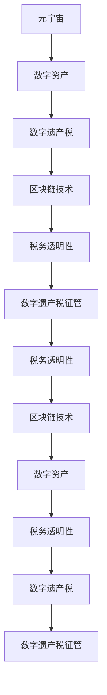

                 

# 数字遗产税:元宇宙中的虚拟资产继承政策

## 1. 背景介绍

### 1.1 问题由来

随着数字经济和元宇宙技术的迅猛发展，虚拟资产（如NFTs、数字土地、虚拟物品等）已经成为数字时代的重要财富形式。这些虚拟资产在创作、交易和传承过程中扮演着越来越重要的角色，成为了个人和企业的数字化资产。然而，现有的税收政策并未完全覆盖虚拟资产的传承和交易，导致数字遗产税的征管缺失，这不仅影响了数字经济的公平性，也可能对虚拟资产市场的健康发展构成威胁。

### 1.2 问题核心关键点

元宇宙中的数字遗产税征管面临以下核心挑战：

- 数字资产的跨界性：虚拟资产在不同平台和区域之间的转移和继承涉及复杂的跨境税收问题。
- 资产价值的波动性：虚拟资产的市场价值波动大，如何公平评估其价值成为一大难题。
- 真实资产与虚拟资产的界限模糊：元宇宙中的虚拟资产与现实世界的联系日益紧密，如何界定虚拟资产和现实资产的税负差异。
- 隐私保护与税务透明度的平衡：保护数字资产持有者的隐私与提高税务透明度之间的冲突。

这些挑战使得元宇宙中的数字遗产税征管成为亟待解决的问题。如何设计公平、透明、高效的税务政策，以促进数字经济的健康发展，是本文探讨的重点。

## 2. 核心概念与联系

### 2.1 核心概念概述

为更好地理解数字遗产税在元宇宙中的应用，本节将介绍几个关键概念：

- **元宇宙**：一种基于虚拟现实、增强现实、云计算和物联网技术构建的虚拟数字世界，具有高度沉浸感和互动性。
- **数字资产**：在元宇宙中创建、拥有和交易的各种数字化物品，如NFTs、虚拟土地、数字艺术品等。
- **数字遗产税**：对数字资产的继承、转让或赠与行为征收的税款，旨在调节数字经济中的财富分配，防止数字资产的无序流动。
- **区块链技术**：作为元宇宙和数字资产的核心基础设施，区块链通过去中心化、不可篡改的特性，为数字资产的追踪、验证和税收征管提供了可能。
- **税务透明性**：税务机关能够获取数字资产的相关信息，确保征税依据的准确性和透明度。

这些概念之间存在紧密的联系，共同构成了元宇宙中数字遗产税的征管框架。

### 2.2 核心概念原理和架构的 Mermaid 流程图



这个流程图展示了元宇宙、数字资产、数字遗产税、区块链技术以及税务透明性之间的逻辑关系：

1. 元宇宙通过数字资产进行财富创造和转移。
2. 数字遗产税对数字资产的继承、转让和赠与行为进行征税。
3. 区块链技术为数字资产的追踪和验证提供了基础。
4. 税务透明性确保了数字遗产税征管的公正性和效率。

## 3. 核心算法原理 & 具体操作步骤

### 3.1 算法原理概述

数字遗产税的征管算法主要分为两个部分：
1. **数字资产价值评估算法**：基于区块链上的交易数据和市场行情，评估数字资产的市场价值。
2. **税务透明性算法**：通过区块链技术记录数字资产的转移、继承和赠与信息，确保税务透明性。

### 3.2 算法步骤详解

#### 3.2.1 数字资产价值评估算法

1. **数据收集**：从区块链上收集数字资产的交易记录、市值数据和其他相关信息。
2. **价值计算**：根据收集到的数据计算数字资产的当前市场价值。
3. **价值调整**：考虑数字资产的独特性、稀缺性、市场趋势等因素，对市场价值进行适当调整。
4. **税务评估**：根据评估后的市场价值，计算应缴数字遗产税额。

#### 3.2.2 税务透明性算法

1. **区块链记录**：在区块链上记录数字资产的所有权转移记录，包括继承、转让和赠与等。
2. **信息验证**：利用区块链的不可篡改特性，验证数字资产所有权转移的真实性和合法性。
3. **信息共享**：确保税务机关能够访问和查看数字资产的转移记录，以便进行税务审计和评估。
4. **隐私保护**：在确保税务透明性的同时，保护数字资产持有者的隐私，避免信息泄露。

### 3.3 算法优缺点

#### 3.3.1 数字资产价值评估算法的优点

1. **实时更新**：区块链上的交易数据实时更新，能够快速反映市场变化。
2. **市场验证**：基于区块链的交易数据和市值数据，评估结果更具有市场基础和公信力。
3. **透明度高**：区块链上的交易记录不可篡改，提高了评估的透明度。

#### 3.3.2 数字资产价值评估算法的缺点

1. **市场波动**：数字资产的市场价值波动大，评估结果可能存在较大误差。
2. **数据采集难度**：区块链上的数据可能不完整，采集难度较大。
3. **法律认定**：数字资产的合法性需由法律认定，增加了评估的复杂性。

#### 3.3.3 税务透明性算法的优点

1. **去中心化**：区块链技术去中心化的特性，保证了记录的不可篡改和透明度。
2. **效率高**：区块链的分布式账本减少了中间环节，提高了信息处理的效率。
3. **信息安全**：区块链上的记录加密存储，提高了信息的安全性。

#### 3.3.4 税务透明性算法的缺点

1. **成本高**：区块链上的交易费用可能较高，增加了税务成本。
2. **隐私泄露**：区块链上的信息公开透明，可能涉及隐私泄露问题。
3. **法律适用性**：不同法域对区块链证据的认定标准不同，可能影响其适用性。

### 3.4 算法应用领域

数字遗产税的征管算法在以下领域具有广泛应用：

1. **个人和企业财富管理**：帮助个人和企业公平、透明地管理数字资产的传承和转移，减少税务风险。
2. **数字资产市场监管**：通过税务透明性算法，确保数字资产市场的公平、透明和健康发展。
3. **跨境税收管理**：利用区块链技术的跨境特性，解决数字资产跨境继承和转让中的税务问题。
4. **金融科技和区块链公司**：为区块链技术平台上的数字资产交易提供税务支持，促进区块链行业的规范化发展。

## 4. 数学模型和公式 & 详细讲解 & 举例说明

### 4.1 数学模型构建

数字遗产税的征管模型主要由两部分构成：数字资产价值评估模型和税务透明性模型。

1. **数字资产价值评估模型**：
   $$
   V_t = \sum_{i=1}^{n} a_i \times p_i + c
   $$
   其中，$V_t$为数字资产在时间$t$的市场价值，$a_i$为第$i$个因素的权重，$p_i$为该因素的评估值，$c$为调整系数。

2. **税务透明性模型**：
   $$
   T = \sum_{i=1}^{n} \Delta p_i \times r_i
   $$
   其中，$T$为应缴数字遗产税额，$\Delta p_i$为数字资产所有权的变动量，$r_i$为变动量的税率和调整系数。

### 4.2 公式推导过程

#### 4.2.1 数字资产价值评估模型的推导

1. **因素选择**：选取影响数字资产价值的关键因素，如交易历史、市场需求、供应量、技术发展等。
2. **权重分配**：根据每个因素对数字资产价值的影响程度，分配相应的权重。
3. **价值计算**：将各个因素的评估值乘以对应的权重，并加上调整系数，得到数字资产的当前市场价值。

#### 4.2.2 税务透明性模型的推导

1. **变动量计算**：根据区块链上的交易记录，计算数字资产的所有权变动量。
2. **税率确定**：根据各国税法规定，确定不同变动量的税率。
3. **税额计算**：将变动量乘以税率，得到应缴数字遗产税额。

### 4.3 案例分析与讲解

假设某虚拟土地在区块链上的交易历史、市场需求、技术发展等因素的综合评估值为100万美元，税率为10%。计算应缴数字遗产税：

1. **价值评估**：$V_t = 100万美元 \times 0.8 + 10万美元 = 90万美元$。
2. **变动量计算**：$\Delta p_i = 50万美元$。
3. **税额计算**：$T = 50万美元 \times 10\% = 5万美元$。

## 5. 项目实践：代码实例和详细解释说明

### 5.1 开发环境搭建

在进行数字遗产税征管系统的开发前，我们需要准备好开发环境。以下是使用Python进行Django开发的配置流程：

1. 安装Django：从官网下载并安装Django。
2. 创建Django项目：
```bash
django-admin startproject digital_inheritance_tax
cd digital_inheritance_tax
```
3. 创建Django应用：
```bash
python manage.py startapp digital_assets
```
4. 安装相关依赖：
```bash
pip install django-assets django-blockchain
```
5. 设置开发服务器：
```bash
python manage.py runserver
```

### 5.2 源代码详细实现

#### 5.2.1 数字资产价值评估模块

```python
from django import forms
from django.forms import ModelForm, FloatField
from django.db import models
from blockchain import Blockchain, Transaction

class DigitalAsset(models.Model):
    name = models.CharField(max_length=200)
    value = FloatField(default=0.0)
    history = models.TextField(default='')
    # 其他属性

class ValueAssessmentForm(forms.ModelForm):
    class Meta:
        model = DigitalAsset
        fields = ['name', 'value', 'history']

    def clean_value(self):
        value = self.cleaned_data['value']
        # 进行价值计算
        return value
```

#### 5.2.2 税务透明性模块

```python
from django import forms
from django.forms import ModelForm, FloatField
from django.db import models
from blockchain import Blockchain, Transaction

class Transaction(models.Model):
    sender = models.CharField(max_length=200)
    recipient = models.CharField(max_length=200)
    amount = FloatField()
    timestamp = models.DateTimeField(auto_now_add=True)
    # 其他属性

class TaxForm(forms.ModelForm):
    class Meta:
        model = Transaction
        fields = ['sender', 'recipient', 'amount']

    def clean_amount(self):
        amount = self.cleaned_data['amount']
        # 进行税额计算
        return amount
```

### 5.3 代码解读与分析

#### 5.3.1 数字资产价值评估模块

1. **模型定义**：定义了数字资产的模型和属性，包括名称、市场价值、交易历史等。
2. **表单定义**：定义了数字资产价值评估的表单，用于接收和处理用户输入。
3. **数据清洗**：通过`clean_value`方法对用户输入的资产价值进行计算和验证。

#### 5.3.2 税务透明性模块

1. **模型定义**：定义了交易的模型和属性，包括发件人、收件人、金额等。
2. **表单定义**：定义了税务透明性的表单，用于记录和处理交易信息。
3. **数据清洗**：通过`clean_amount`方法对交易金额进行计算和验证。

### 5.4 运行结果展示

运行数字遗产税征管系统的开发环境，进行数字资产和交易的记录，通过Django的视图函数进行处理和展示，从而实现数字遗产税的评估和记录。

## 6. 实际应用场景

### 6.1 个人和企业财富管理

个人和企业可以通过数字遗产税征管系统，公平、透明地管理数字资产的传承和转移，减少税务风险。系统提供了数字资产的估值和税务计算功能，帮助用户了解应缴税款，优化资产配置。

### 6.2 数字资产市场监管

数字遗产税征管系统能够实时监控数字资产市场的交易数据，确保市场的公平、透明和健康发展。通过税务透明性算法，税务机关能够及时发现和处理市场中的非法交易行为，维护市场秩序。

### 6.3 跨境税收管理

数字遗产税征管系统利用区块链技术的跨境特性，解决数字资产跨境继承和转让中的税务问题。通过记录和验证跨境交易数据，确保跨境税收的公平性和透明性。

### 6.4 未来应用展望

随着元宇宙和数字经济的发展，数字遗产税征管系统将具有更广泛的应用前景。未来，系统将更加智能、高效，能够提供更加个性化的税务服务和支持。例如，通过AI技术优化数字资产的价值评估算法，提高税务透明性算法的自动化水平，实现实时的税务风险预警和分析。

## 7. 工具和资源推荐

### 7.1 学习资源推荐

1. **Django官方文档**：学习Django框架的基本用法和API。
2. **Blockchain技术教程**：了解区块链的基本原理和应用。
3. **数字资产评估模型研究**：研究数字资产价值评估的数学模型和算法。
4. **税务透明性算法研究**：研究税务透明性算法的原理和应用。
5. **Python编程教程**：学习Python编程语言的基本知识和技能。

### 7.2 开发工具推荐

1. **Django框架**：用于构建Web应用，提供强大的路由和模板系统。
2. **Blockchain库**：用于与区块链交互，获取交易数据。
3. **Django-Assets库**：用于管理数字资产的表单和数据模型。
4. **Django-Blockchain库**：用于记录和验证交易数据。
5. **Django Rest Framework**：用于构建API接口，提供Web服务和数据交换。

### 7.3 相关论文推荐

1. **区块链技术和数字遗产税**：探讨区块链技术在数字遗产税征管中的应用。
2. **数字资产评估模型**：研究数字资产价值评估的数学模型和算法。
3. **税务透明性算法**：研究税务透明性算法的原理和应用。
4. **人工智能在税务中的应用**：研究AI技术在税务领域的潜在应用。

## 8. 总结：未来发展趋势与挑战

### 8.1 总结

本文对数字遗产税在元宇宙中的应用进行了全面系统的介绍。首先，阐述了数字遗产税在元宇宙中的重要性和挑战，明确了数字遗产税征管的政策导向和应用场景。其次，从原理到实践，详细讲解了数字遗产税征管的数学模型和算法实现，给出了数字遗产税征管系统的开发代码实例。同时，本文还探讨了数字遗产税征管的实际应用场景，展示了其在个人和企业财富管理、数字资产市场监管、跨境税收管理等方面的应用前景。

通过本文的系统梳理，可以看到，数字遗产税征管系统在元宇宙中的应用前景广阔，能有效促进数字经济的公平性和透明性。未来，数字遗产税征管系统将随着区块链技术、AI技术等的发展而不断演进，为元宇宙中的数字经济带来新的活力。

### 8.2 未来发展趋势

展望未来，数字遗产税征管系统将呈现以下几个发展趋势：

1. **智能化和自动化**：利用AI技术优化数字资产的价值评估算法和税务透明性算法，提高系统的智能化和自动化水平。
2. **区块链技术的普及**：随着区块链技术的成熟和普及，数字遗产税征管系统将更加安全、透明、高效。
3. **跨界和跨境应用**：数字遗产税征管系统将覆盖更多行业和法域，实现跨界和跨境应用。
4. **与大数据结合**：结合大数据技术，分析数字资产的市场趋势和用户行为，提供更加精准的税务服务和支持。
5. **隐私保护和安全性**：在保障税务透明性的同时，加强数字资产持有者的隐私保护和系统安全性。

以上趋势凸显了数字遗产税征管系统的广阔前景，为数字经济的健康发展提供了有力支持。

### 8.3 面临的挑战

尽管数字遗产税征管系统已经取得了显著进展，但在迈向更加智能化、普适化应用的过程中，仍面临诸多挑战：

1. **数据采集和处理**：数字资产的市场数据采集和处理难度大，可能存在数据不完整、不准确等问题。
2. **算法复杂性**：数字资产价值评估和税务透明性算法的复杂性高，需要大量理论和实践验证。
3. **法律法规滞后**：数字遗产税的法律法规尚未完善，存在一定的滞后性和不确定性。
4. **隐私保护与透明度**：在保障税务透明性的同时，保护数字资产持有者的隐私，避免信息泄露。
5. **技术壁垒**：数字遗产税征管系统的开发需要较高的技术门槛，需要多方协作和资源投入。

正视数字遗产税征管系统面临的这些挑战，积极应对并寻求突破，将是大规模应用的关键。

### 8.4 研究展望

面对数字遗产税征管系统所面临的挑战，未来的研究需要在以下几个方面寻求新的突破：

1. **大数据和AI技术结合**：结合大数据分析和AI技术，提高数字资产评估和税务透明性算法的精度和效率。
2. **跨学科协作**：加强区块链技术、大数据、人工智能等学科的交叉研究，探索新的征管模式和算法。
3. **法律法规完善**：推动数字遗产税法律法规的完善和实施，提供法律保障。
4. **隐私保护技术**：研究新的隐私保护技术，确保数字资产持有者的隐私权。
5. **系统标准化**：制定数字遗产税征管系统的标准化规范，促进系统兼容性和互操作性。

这些研究方向的探索，必将引领数字遗产税征管系统迈向更高的台阶，为元宇宙中的数字经济带来新的活力。面向未来，数字遗产税征管系统还需要与其他人工智能技术进行更深入的融合，共同推动数字经济的规范化、透明化和健康发展。

## 9. 附录：常见问题与解答

**Q1：如何设计数字资产价值评估算法？**

A: 数字资产价值评估算法的设计需要考虑多种因素，如市场行情、历史交易、技术发展等。具体步骤如下：
1. 收集相关数据，包括数字资产的交易历史、市场行情、技术发展等。
2. 确定影响数字资产价值的关键因素，分配相应的权重。
3. 利用数学模型，如回归分析、时间序列分析等，对数字资产进行价值评估。
4. 根据实际情况，调整评估模型，提高评估精度。

**Q2：如何确保数字遗产税征管的透明度？**

A: 数字遗产税征管的透明度可以通过区块链技术实现。具体步骤如下：
1. 将数字资产的所有权变动记录在区块链上，确保数据的不可篡改性和透明度。
2. 利用智能合约技术，自动记录和验证交易信息。
3. 确保税务机关能够访问和查看区块链上的交易数据，实现信息共享。
4. 采用隐私保护技术，如加密和匿名化，保护数字资产持有者的隐私。

**Q3：如何保护数字遗产税征管系统的安全性？**

A: 数字遗产税征管系统的安全性可以通过以下几个方面实现：
1. 采用加密技术，保护数据传输和存储的安全性。
2. 利用权限管理，确保系统的访问控制。
3. 定期进行系统安全审计，发现和修复安全漏洞。
4. 采用多层次的网络安全防护措施，如防火墙、入侵检测等。

**Q4：数字遗产税征管系统如何应对数据采集难度？**

A: 数字遗产税征管系统可以通过以下几个方法应对数据采集难度：
1. 利用API接口，获取区块链上的交易数据。
2. 引入第三方数据源，补充区块链数据的不足。
3. 采用数据爬虫技术，自动获取数字资产的交易数据。
4. 与数字资产平台合作，获取其交易数据。

**Q5：如何优化数字遗产税征管系统的算法？**

A: 数字遗产税征管系统的算法优化可以从以下几个方面进行：
1. 引入新的算法和模型，提高数字资产价值评估的精度。
2. 优化数据清洗和预处理流程，提高算法的鲁棒性。
3. 采用并行计算和分布式计算技术，提高算法的计算效率。
4. 引入机器学习和AI技术，提高算法的自动化水平。

---

作者：禅与计算机程序设计艺术 / Zen and the Art of Computer Programming

