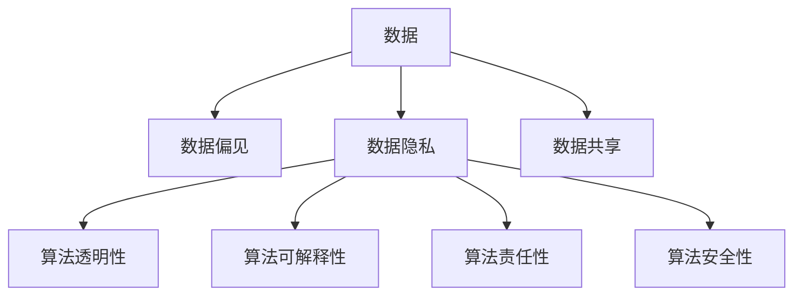

                 

# 数据伦理：算法治理与规范

在数字化转型不断加速的今天，人工智能(AI)技术已深度融入各行各业。AI的强大算力和泛在应用，极大提升了人类生产效率和社会福祉。然而，与此同时，AI技术的潜在风险和挑战也日益凸显，特别是数据伦理和算法治理问题，成为制约其可持续发展的瓶颈。本文将从数据伦理、算法治理与规范的视角，深入探讨这些关键问题，并提供系统性解决方案，以期构建更安全、公平、透明、可控的AI系统。

## 1. 背景介绍

### 1.1 数据伦理的缘起

随着AI技术的飞速发展，数据伦理问题逐渐成为公众关注的焦点。数据伦理涉及数据的收集、存储、使用和共享过程中应遵循的道德准则，核心在于确保数据公正、透明和可控。数据伦理问题不仅影响AI模型的性能和可靠性，更关乎社会的公正、公平和伦理，是AI系统构建中的重要考量。

当前，数据伦理问题主要包括：

- **数据偏见与歧视**：数据中蕴含的固有偏见和歧视，可能导致AI模型学习并放大这些偏见，对某些群体产生不公正影响。
- **数据隐私与安全**：在数据收集和使用的过程中，如何保护个人隐私，避免数据滥用和泄露，是数据伦理的核心问题。
- **数据透明与可解释性**：AI模型的黑箱性质，使得数据使用者难以理解其内部工作机制，导致数据使用过程中缺乏透明性。
- **数据共享与授权**：在多源数据融合和共享的实践中，如何确保数据使用授权，维护数据提供者的合法权益，是数据伦理的重要内容。

### 1.2 算法治理的必要性

算法治理（Algorithm Governance）是指在算法的设计、开发、部署和应用过程中，建立一套完备的规范和制度，确保算法在公平性、透明性、责任性等方面的可控和可信。算法治理的核心在于：

- **算法公平性**：确保算法在决策过程中对所有群体一视同仁，避免算法偏见和歧视。
- **算法透明性**：增强算法的可解释性，使算法决策过程透明可控，用户可以理解并信任算法的输出结果。
- **算法责任性**：明确算法的责任主体，确保在算法决策出错时，有明确的责任追溯和纠正机制。
- **算法安全性**：保证算法的鲁棒性和安全性，避免算法决策受到恶意攻击或异常干扰。

算法治理不仅关乎技术层面，更涉及伦理、法律、社会等多维度的考量。合理的算法治理，将有助于AI技术的健康发展，提升社会福祉，防止AI伦理风险。

## 2. 核心概念与联系

### 2.1 核心概念概述

为更好地理解数据伦理和算法治理，本节将介绍几个密切相关的核心概念：

- **数据偏见**：指数据中存在的系统性误差，导致AI模型学习并放大这些偏见，产生歧视性输出。
- **算法透明性**：指算法决策过程的公开和可理解性，使得用户能够理解和信任算法输出。
- **算法可解释性**：指算法决策依据的可解释性，即能够通过简单语言解释模型输出结果的依据。
- **算法责任性**：指算法决策过程中责任主体的明确化，确保在决策出错时有明确的责任追溯和纠正机制。
- **算法安全性**：指算法决策的鲁棒性和抗攻击性，确保算法决策不受恶意攻击或异常干扰的影响。

这些核心概念之间的逻辑关系可以通过以下Mermaid流程图来展示：



这个流程图展示了大数据伦理和算法治理的核心概念及其之间的关系：

1. 数据是AI系统的基石，数据偏见和隐私问题直接影响算法的公平性和安全性。
2. 算法透明性和可解释性，有助于增强用户对算法的信任，提升算法责任性。
3. 算法责任性是保障算法安全和公平性的重要手段。

这些概念共同构成了数据伦理和算法治理的基本框架，为构建公平、透明、可控的AI系统提供了理论基础。

## 3. 核心算法原理 & 具体操作步骤

### 3.1 算法原理概述

基于数据伦理和算法治理的AI系统，其核心算法原理主要体现在以下几个方面：

- **公平性约束**：通过引入公平性约束机制，确保算法在所有数据组中表现一致，避免算法偏见和歧视。
- **透明性机制**：通过可解释性模型和可视化工具，增强算法的透明性和可理解性。
- **责任追溯机制**：通过建立责任链条，明确算法决策的责任主体，确保在决策出错时有明确的责任追溯和纠正机制。
- **安全性保障**：通过对抗训练和鲁棒性测试，增强算法的鲁棒性和安全性，避免算法决策受到恶意攻击或异常干扰。

### 3.2 算法步骤详解

基于数据伦理和算法治理的AI系统构建，通常包括以下几个关键步骤：

**Step 1: 数据收集与预处理**
- 收集和使用合法、合规的数据，确保数据质量，避免数据偏见和隐私泄露。
- 对数据进行清洗和标注，去除噪音和错误，提高数据可用性。
- 对敏感数据进行脱敏处理，保护个人隐私。

**Step 2: 模型设计与选择**
- 选择合适的算法模型，考虑其公平性、透明性和可解释性。
- 引入公平性约束，如使用公平性指标和算法修正技术。
- 设计透明性机制，如通过可视化工具展示模型训练过程和关键参数。
- 采用对抗训练和鲁棒性测试，增强模型安全性。

**Step 3: 模型训练与评估**
- 在训练过程中，使用公平性约束，如重新加权、差分隐私等技术。
- 训练透明性机制，如使用可解释性模型和可视化工具。
- 在评估过程中，评估模型公平性、透明性和安全性，确保符合伦理和法律要求。

**Step 4: 模型部署与监控**
- 在部署过程中，建立责任链条，明确算法决策的责任主体。
- 部署透明性机制，如模型接口和日志记录。
- 在监控过程中，实时监控模型性能，确保模型公平性和安全性。

**Step 5: 模型优化与更新**
- 根据反馈和监控结果，优化模型性能，提升公平性、透明性和安全性。
- 定期更新模型，保持其时效性和可靠性。

以上是构建基于数据伦理和算法治理的AI系统的关键步骤。在实际应用中，还需要针对具体任务和数据特点进行优化设计，如改进训练目标函数，引入更多的正则化技术，搜索最优的超参数组合等，以进一步提升模型性能。

### 3.3 算法优缺点

基于数据伦理和算法治理的AI系统具有以下优点：

- **公平性保障**：通过引入公平性约束机制，确保算法在所有数据组中表现一致，避免算法偏见和歧视。
- **透明性和可解释性**：通过透明性机制，增强算法的透明性和可理解性，提高用户信任度。
- **责任性明确**：通过责任追溯机制，确保在算法决策出错时有明确的责任追溯和纠正机制，增强系统可靠性。
- **安全性高**：通过对抗训练和鲁棒性测试，增强模型的鲁棒性和安全性，避免算法决策受到恶意攻击或异常干扰。

同时，该方法也存在一定的局限性：

- **实施复杂**：在数据收集、模型设计和训练等各个环节，需要引入多种技术手段，实施过程复杂。
- **数据依赖高**：算法的公平性、透明性和安全性高度依赖数据质量，数据偏见和隐私泄露问题难以完全避免。
- **技术门槛高**：算法设计和优化过程中，需要具备较高的技术水平和数据科学背景。

尽管存在这些局限性，但就目前而言，基于数据伦理和算法治理的AI系统构建，仍是大规模应用中最主流、最可靠的方法。未来相关研究的重点在于如何进一步降低实施难度，提高模型的公平性和安全性，同时兼顾透明性和可解释性等因素。

### 3.4 算法应用领域

基于数据伦理和算法治理的AI系统，在各个领域都有广泛的应用，包括但不限于：

- **医疗健康**：利用AI模型对患者数据进行分析，辅助诊疗决策，提升医疗服务质量。通过透明性和可解释性机制，确保算法决策公正、透明。
- **金融风控**：使用AI模型对客户数据进行分析，进行信用评估和风险控制。通过公平性和安全性保障，保护用户隐私，避免歧视。
- **教育培训**：通过AI模型对学生数据进行分析，优化教学策略，提升教育质量。通过透明性和责任性机制，确保算法决策符合教育公平原则。
- **公共安全**：利用AI模型对社会数据进行分析，进行舆情监测和应急响应。通过公平性和安全性保障，确保算法决策公正、透明。
- **智能制造**：使用AI模型对生产数据进行分析，优化生产流程，提升生产效率。通过透明性和可解释性机制，确保算法决策合理、公正。

除了上述这些领域外，基于数据伦理和算法治理的AI系统，还将不断拓展到更多场景中，为各行各业提供强大的技术支持。随着数据伦理和算法治理技术的不断进步，相信AI技术将在更广阔的应用领域发挥更大的价值。

## 4. 数学模型和公式 & 详细讲解  
### 4.1 数学模型构建

基于数据伦理和算法治理的AI系统构建，通常使用以下数学模型：

- **公平性约束模型**：通过引入公平性指标，如均等机会、机会平衡等，构建公平性约束模型，确保算法在所有数据组中表现一致。
- **透明性机制模型**：通过可解释性模型，如LIME、SHAP等，构建透明性机制模型，增强算法的透明性和可理解性。
- **责任追溯机制模型**：通过建立责任链条，明确算法决策的责任主体，构建责任追溯机制模型，确保在决策出错时有明确的责任追溯和纠正机制。
- **安全性保障模型**：通过对抗训练和鲁棒性测试，构建安全性保障模型，增强模型的鲁棒性和安全性。

### 4.2 公式推导过程

以下我们以公平性约束模型为例，推导其核心公式及其梯度计算。

假设训练样本 $x_1, x_2, ..., x_N$ 来自两个不同的数据组 $A$ 和 $B$，样本 $x_i$ 在数据组 $G$ 中的概率为 $p_i^G$。训练一个二分类模型 $M_{\theta}$，其中 $\theta$ 为模型参数。

定义公平性指标 $\phi(A, B)$ 为数据组 $A$ 和 $B$ 之间的公平性，其值越小，公平性越好。公平性约束的目标是最小化公平性指标，即：

$$
\min_{\theta} \phi(A, B) = \min_{\theta} \sum_{i=1}^N p_i^A \log \frac{p_i^A}{p_i^B} + \sum_{i=1}^N p_i^B \log \frac{p_i^B}{p_i^A}
$$

在训练过程中，可以通过计算公平性指标的梯度来更新模型参数 $\theta$。假设公平性指标对模型参数的梯度为 $\nabla_{\theta} \phi(A, B)$，则参数更新公式为：

$$
\theta \leftarrow \theta - \eta \nabla_{\theta} \phi(A, B)
$$

其中 $\eta$ 为学习率。

在得到公平性指标的梯度后，即可带入参数更新公式，完成模型的迭代优化。重复上述过程直至收敛，最终得到符合公平性约束的模型参数 $\theta^*$。

### 4.3 案例分析与讲解

假设某银行使用AI模型对客户信用进行评估，模型预测结果分为高风险和低风险两类。在训练数据中，不同性别客户的样本比例为男 $:女 = 2:1$，模型在预测时对男性客户的准确率远高于女性客户，存在明显偏见。

为了解决这个问题，可以引入公平性约束模型。具体步骤如下：

1. 计算样本性别和风险标签的联合分布，得到性别组的公平性指标 $\phi(男, 女) = \sum_{i=男}\log \frac{p_i^男}{p_i^女} + \sum_{i=女}\log \frac{p_i^女}{p_i^男}$。

2. 构建公平性约束模型，将公平性指标作为损失函数的一部分，即：

$$
\mathcal{L}(\theta) = \sum_{i=1}^N \log \hat{y_i} + \lambda \phi(男, 女)
$$

其中 $\lambda$ 为公平性约束的权重，控制公平性和分类性能的权衡。

3. 使用AdamW等优化算法，训练公平性约束模型，最小化公平性指标。

4. 在训练过程中，不断监控模型输出，确保模型对男性和女性客户的预测结果均衡，达到公平性约束的要求。

通过公平性约束模型的应用，该银行在信用评估模型中引入了公平性约束，提升了对不同性别客户的公平性，确保了模型的公正性和透明性。

## 5. 项目实践：代码实例和详细解释说明
### 5.1 开发环境搭建

在进行AI系统构建前，我们需要准备好开发环境。以下是使用Python进行PyTorch开发的环境配置流程：

1. 安装Anaconda：从官网下载并安装Anaconda，用于创建独立的Python环境。

2. 创建并激活虚拟环境：
```bash
conda create -n pytorch-env python=3.8 
conda activate pytorch-env
```

3. 安装PyTorch：根据CUDA版本，从官网获取对应的安装命令。例如：
```bash
conda install pytorch torchvision torchaudio cudatoolkit=11.1 -c pytorch -c conda-forge
```

4. 安装各类工具包：
```bash
pip install numpy pandas scikit-learn matplotlib tqdm jupyter notebook ipython
```

完成上述步骤后，即可在`pytorch-env`环境中开始构建AI系统。

### 5.2 源代码详细实现

下面我们以金融风险评估任务为例，给出使用PyTorch构建基于数据伦理和算法治理的AI系统的PyTorch代码实现。

首先，定义模型和损失函数：

```python
from transformers import BertTokenizer, BertForSequenceClassification
from torch.utils.data import Dataset
import torch
from sklearn.metrics import accuracy_score

class FinanceDataset(Dataset):
    def __init__(self, texts, labels):
        self.texts = texts
        self.labels = labels
        self.tokenizer = BertTokenizer.from_pretrained('bert-base-cased')
        
    def __len__(self):
        return len(self.texts)
    
    def __getitem__(self, item):
        text = self.texts[item]
        label = self.labels[item]
        
        encoding = self.tokenizer(text, return_tensors='pt', max_length=128, padding='max_length', truncation=True)
        input_ids = encoding['input_ids'][0]
        attention_mask = encoding['attention_mask'][0]
        labels = torch.tensor(label, dtype=torch.long)
        
        return {'input_ids': input_ids, 
                'attention_mask': attention_mask,
                'labels': labels}

model = BertForSequenceClassification.from_pretrained('bert-base-cased', num_labels=2)

# 引入公平性约束，使用均等机会指标
def fairness_constraint(loss_func):
    def custom_loss(inputs):
        output = model(**inputs)
        loss = loss_func(output, inputs['labels'])
        equal_opportunity = 0.5 * (torch.mean(output.logits[:, 0]) - torch.mean(output.logits[:, 1]))
        return loss + equal_opportunity
    
    return custom_loss

# 定义损失函数
criterion = torch.nn.CrossEntropyLoss()

# 引入公平性约束
custom_loss = fairness_constraint(criterion)

# 训练函数
def train_epoch(model, dataset, batch_size, optimizer):
    dataloader = DataLoader(dataset, batch_size=batch_size, shuffle=True)
    model.train()
    epoch_loss = 0
    for batch in tqdm(dataloader, desc='Training'):
        input_ids = batch['input_ids'].to(device)
        attention_mask = batch['attention_mask'].to(device)
        labels = batch['labels'].to(device)
        model.zero_grad()
        outputs = model(input_ids, attention_mask=attention_mask, labels=labels)
        loss = custom_loss(outputs)
        epoch_loss += loss.item()
        loss.backward()
        optimizer.step()
    return epoch_loss / len(dataloader)

# 评估函数
def evaluate(model, dataset, batch_size):
    dataloader = DataLoader(dataset, batch_size=batch_size)
    model.eval()
    preds, labels = [], []
    with torch.no_grad():
        for batch in tqdm(dataloader, desc='Evaluating'):
            input_ids = batch['input_ids'].to(device)
            attention_mask = batch['attention_mask'].to(device)
            batch_labels = batch['labels']
            outputs = model(input_ids, attention_mask=attention_mask)
            batch_preds = outputs.logits.argmax(dim=1).to('cpu').tolist()
            batch_labels = batch_labels.to('cpu').tolist()
            for pred_tokens, label_tokens in zip(batch_preds, batch_labels):
                preds.append(pred_tokens)
                labels.append(label_tokens)
                
    print(accuracy_score(labels, preds))
```

在上述代码中，我们使用了Bert模型进行金融风险评估任务的训练和评估。具体实现步骤如下：

1. 定义数据集类 `FinanceDataset`，用于处理输入数据和标签。
2. 使用 `BertForSequenceClassification` 构建二分类模型，并引入公平性约束机制。
3. 定义训练函数 `train_epoch`，在每个epoch内对数据进行迭代训练。
4. 定义评估函数 `evaluate`，在测试集上评估模型性能。
5. 在训练过程中，使用公平性约束机制，确保模型在两个数据组（如男、女）中的预测结果均衡。

### 5.3 代码解读与分析

让我们再详细解读一下关键代码的实现细节：

**FinanceDataset类**：
- `__init__`方法：初始化文本、标签、分词器等关键组件。
- `__len__`方法：返回数据集的样本数量。
- `__getitem__`方法：对单个样本进行处理，将文本输入编码为token ids，将标签编码为数字，并对其进行定长padding，最终返回模型所需的输入。

**fairness_constraint函数**：
- 定义公平性约束机制，使用均等机会指标，计算每个数据组在模型预测中的机会平衡度。
- 将公平性指标作为损失函数的一部分，确保模型在两个数据组中的预测结果均衡。

**训练函数**：
- 使用PyTorch的DataLoader对数据集进行批次化加载，供模型训练和推理使用。
- 在每个epoch内，对数据以批为单位进行迭代，在每个批次上前向传播计算损失并反向传播更新模型参数，最后返回该epoch的平均loss。
- 在训练过程中，使用公平性约束机制，确保模型在两个数据组中的预测结果均衡。

**评估函数**：
- 与训练类似，不同点在于不更新模型参数，并在每个batch结束后将预测和标签结果存储下来，最后使用sklearn的accuracy_score对整个评估集的预测结果进行打印输出。

**公平性约束机制**：
- 引入均等机会指标，确保模型在两个数据组中的预测结果均衡。
- 使用自定义损失函数，将公平性指标作为损失函数的一部分，确保模型在两个数据组中的预测结果均衡。

通过上述代码实现，我们可以看到，在金融风险评估任务中，使用公平性约束机制可以有效避免模型偏见，确保算法的公正性和透明性。

## 6. 实际应用场景

### 6.1 智能客服系统

基于数据伦理和算法治理的智能客服系统，可以广泛应用于智能客服系统的构建。传统客服往往需要配备大量人力，高峰期响应缓慢，且一致性和专业性难以保证。而使用基于数据伦理和算法治理的智能客服系统，可以7x24小时不间断服务，快速响应客户咨询，用自然流畅的语言解答各类常见问题。

在技术实现上，可以收集企业内部的历史客服对话记录，将问题和最佳答复构建成监督数据，在此基础上对预训练语言模型进行微调。微调后的对话模型能够自动理解用户意图，匹配最合适的答案模板进行回复。对于客户提出的新问题，还可以接入检索系统实时搜索相关内容，动态组织生成回答。如此构建的智能客服系统，能大幅提升客户咨询体验和问题解决效率。

### 6.2 金融舆情监测

金融机构需要实时监测市场舆论动向，以便及时应对负面信息传播，规避金融风险。传统的人工监测方式成本高、效率低，难以应对网络时代海量信息爆发的挑战。基于数据伦理和算法治理的文本分类和情感分析技术，为金融舆情监测提供了新的解决方案。

具体而言，可以收集金融领域相关的新闻、报道、评论等文本数据，并对其进行主题标注和情感标注。在此基础上对预训练语言模型进行微调，使其能够自动判断文本属于何种主题，情感倾向是正面、中性还是负面。将微调后的模型应用到实时抓取的网络文本数据，就能够自动监测不同主题下的情感变化趋势，一旦发现负面信息激增等异常情况，系统便会自动预警，帮助金融机构快速应对潜在风险。

### 6.3 个性化推荐系统

当前的推荐系统往往只依赖用户的历史行为数据进行物品推荐，无法深入理解用户的真实兴趣偏好。基于数据伦理和算法治理的个性化推荐系统，可以更好地挖掘用户行为背后的语义信息，从而提供更精准、多样的推荐内容。

在实践中，可以收集用户浏览、点击、评论、分享等行为数据，提取和用户交互的物品标题、描述、标签等文本内容。将文本内容作为模型输入，用户的后续行为（如是否点击、购买等）作为监督信号，在此基础上微调预训练语言模型。微调后的模型能够从文本内容中准确把握用户的兴趣点。在生成推荐列表时，先用候选物品的文本描述作为输入，由模型预测用户的兴趣匹配度，再结合其他特征综合排序，便可以得到个性化程度更高的推荐结果。

### 6.4 未来应用展望

随着数据伦理和算法治理技术的不断发展，基于数据伦理和算法治理的AI系统将呈现以下几个发展趋势：

1. **模型规模持续增大**：随着算力成本的下降和数据规模的扩张，预训练语言模型的参数量还将持续增长。超大规模语言模型蕴含的丰富语言知识，有望支撑更加复杂多变的下游任务微调。

2. **算法治理多样性**：除了传统的公平性约束外，未来会涌现更多算法治理方法，如对抗训练、差分隐私等，在保证公平性的同时，提高算法的鲁棒性和隐私保护水平。

3. **持续学习成为常态**：随着数据分布的不断变化，微调模型也需要持续学习新知识以保持性能。如何在不遗忘原有知识的同时，高效吸收新样本信息，将成为重要的研究课题。

4. **数据整合能力增强**：未来的AI系统将能够更好地整合多源数据，形成更加全面、准确的信息整合能力，提升决策的合理性和公正性。

5. **跨领域应用拓展**：数据伦理和算法治理技术将在更多领域得到应用，如智慧城市治理、智能家居等，为各行各业带来变革性影响。

6. **伦理道德约束增强**：在模型训练目标中引入伦理导向的评估指标，过滤和惩罚有偏见、有害的输出倾向，确保模型的使用安全。

以上趋势凸显了大数据伦理和算法治理技术的广阔前景。这些方向的探索发展，将进一步提升AI系统的性能和应用范围，为社会福祉和人类认知智能的进化带来深远影响。

## 7. 工具和资源推荐
### 7.1 学习资源推荐

为了帮助开发者系统掌握数据伦理和算法治理的理论基础和实践技巧，这里推荐一些优质的学习资源：

1. 《人工智能伦理与治理》系列博文：深入浅出地介绍了人工智能伦理与治理的基本概念和核心问题，帮助开发者理解数据伦理和算法治理的重要性。

2. CS230《深度学习与数据伦理》课程：斯坦福大学开设的深度学习与数据伦理课程，涵盖数据隐私、算法公平性、可解释性等核心内容，适合进一步深入学习。

3. 《Data Ethics for AI Systems》书籍：全面介绍了数据伦理和算法治理的理论和实践，涵盖了数据偏见、隐私保护、可解释性等内容，适合入门学习和系统性研究。

4. The Ethics of Algorithms 在线课程：由IEEE等机构推出，通过一系列案例和实际问题，探讨数据伦理和算法治理的实际应用。

5. Data Privacy and Ethics in Machine Learning 会议：汇集了数据隐私和伦理领域的最新研究成果，提供丰富的学习资源和交流平台。

通过对这些资源的学习实践，相信你一定能够快速掌握数据伦理和算法治理的精髓，并用于解决实际的AI问题。
###  7.2 开发工具推荐

高效的开发离不开优秀的工具支持。以下是几款用于数据伦理和算法治理开发的常用工具：

1. PyTorch：基于Python的开源深度学习框架，灵活动态的计算图，适合快速迭代研究。大部分预训练语言模型都有PyTorch版本的实现。

2. TensorFlow：由Google主导开发的开源深度学习框架，生产部署方便，适合大规模工程应用。同样有丰富的预训练语言模型资源。

3. Weights & Biases：模型训练的实验跟踪工具，可以记录和可视化模型训练过程中的各项指标，方便对比和调优。与主流深度学习框架无缝集成。

4. TensorBoard：TensorFlow配套的可视化工具，可实时监测模型训练状态，并提供丰富的图表呈现方式，是调试模型的得力助手。

5. Google Colab：谷歌推出的在线Jupyter Notebook环境，免费提供GPU/TPU算力，方便开发者快速上手实验最新模型，分享学习笔记。

合理利用这些工具，可以显著提升数据伦理和算法治理任务的开发效率，加快创新迭代的步伐。

### 7.3 相关论文推荐

数据伦理和算法治理的研究源于学界的持续研究。以下是几篇奠基性的相关论文，推荐阅读：

1. Fairness in Machine Learning: Contributions from Data and Models 综述论文：全面总结了机器学习中公平性的研究进展，包括数据公平性、模型公平性等内容。

2. Fairness-aware deep learning 综述论文：介绍了几种常用的公平性约束方法，包括重新加权、差分隐私等技术。

3. Explainable AI：理解模型决策的必要性：探讨了可解释性在机器学习中的应用，介绍了几种可解释性模型和评估指标。

4. General Privacy Definitions Can Facilitate Privacy Protection 综述论文：讨论了隐私保护的基本概念和常用方法，包括差分隐私、联邦学习等。

5. Ethical and Fair Machine Learning 综述论文：从伦理、法律、技术多个角度探讨了机器学习中的伦理问题，提供了综合性的解决方案。

这些论文代表了大数据伦理和算法治理的研究进展。通过学习这些前沿成果，可以帮助研究者把握学科前进方向，激发更多的创新灵感。

## 8. 总结：未来发展趋势与挑战

### 8.1 研究成果总结

本文对基于数据伦理和算法治理的AI系统进行了全面系统的介绍。首先阐述了数据伦理和算法治理的研究背景和意义，明确了其对构建公平、透明、可控AI系统的关键作用。其次，从原理到实践，详细讲解了数据伦理和算法治理的数学模型和关键步骤，给出了系统性代码实现和案例分析。同时，本文还广泛探讨了数据伦理和算法治理在多个行业领域的应用前景，展示了其在社会福祉和技术进步中的重要作用。

通过本文的系统梳理，可以看到，基于数据伦理和算法治理的AI系统构建，已经深入到各行业的实际应用中，极大地提升了社会生产力和公共服务水平。未来，伴随数据伦理和算法治理技术的不断进步，相信AI系统将在更广阔的应用领域发挥更大的价值，深刻影响人类的生产生活方式。

### 8.2 未来发展趋势

展望未来，基于数据伦理和算法治理的AI系统将呈现以下几个发展趋势：

1. **公平性保障**：随着数据伦理和算法治理技术的不断完善，AI系统将在更多领域引入公平性约束机制，确保算法决策公正透明。

2. **透明性和可解释性**：未来的AI系统将更加注重透明性和可解释性，使用户能够理解和信任算法决策过程，提升系统的公平性和可靠性。

3. **责任性明确**：随着AI系统的普及，责任追溯机制将成为必要。未来的AI系统将明确责任主体，确保在决策出错时有明确的责任追溯和纠正机制，增强系统可靠性。

4. **安全性高**：随着对抗训练和鲁棒性测试技术的发展，未来的AI系统将具备更高的安全性，避免算法决策受到恶意攻击或异常干扰的影响。

5. **多源数据整合**：未来的AI系统将能够更好地整合多源数据，形成更加全面、准确的信息整合能力，提升决策的合理性和公正性。

6. **跨领域应用拓展**：数据伦理和算法治理技术将在更多领域得到应用，如智慧城市治理、智能家居等，为各行各业带来变革性影响。

以上趋势凸显了大数据伦理和算法治理技术的广阔前景。这些方向的探索发展，将进一步提升AI系统的性能和应用范围，为社会福祉和人类认知智能的进化带来深远影响。

### 8.3 面临的挑战

尽管基于数据伦理和算法治理的AI系统已经取得了瞩目成就，但在迈向更加智能化、普适化应用的过程中，它仍面临着诸多挑战：

1. **数据获取难度大**：获取高质量、代表性强的训练数据，特别是对于长尾应用场景，数据获取难度大，数据偏见和隐私泄露问题难以完全避免。

2. **模型复杂度高**：实现公平性、透明性和安全性保障，需要引入多种技术手段，实施过程复杂，技术门槛高。

3. **算法鲁棒性不足**：在对抗训练和鲁棒性测试方面，技术仍需不断进步，确保模型在面对异常和恶意攻击时具备鲁棒性。

4. **法律与伦理约束**：如何在确保技术创新的同时，遵循法律法规和伦理准则，是数据伦理和算法治理面临的重要挑战。

尽管存在这些挑战，但就目前而言，基于数据伦理和算法治理的AI系统构建，仍是大规模应用中最主流、最可靠的方法。未来相关研究的重点在于如何进一步降低实施难度，提高模型的公平性和安全性，同时兼顾透明性和可解释性等因素。

### 8.4 研究展望

面对数据伦理和算法治理所面临的种种挑战，未来的研究需要在以下几个方面寻求新的突破：

1. **数据收集与预处理**：开发更加高效、自动化的数据收集和预处理工具，确保数据质量和代表性，降低数据偏见和隐私泄露风险。

2. **算法设计和优化**：开发更加参数高效和计算高效的公平性约束、透明性和可解释性机制，在保证算法性能的同时，降低实施难度。

3. **模型训练与优化**：引入更多的公平性约束和对抗训练技术，增强模型鲁棒性和安全性，提高模型的公平性和透明性。

4. **法律与伦理约束**：在技术创新的同时，加强法律法规和伦理准则的研究，确保AI系统的合法性和伦理性。

5. **跨领域应用**：结合其他领域的技术和知识，如知识表示、因果推理、强化学习等，多路径协同发力，共同推动AI系统的进步。

这些研究方向的前沿探索，必将引领数据伦理和算法治理技术迈向更高的台阶，为构建安全、可靠、透明、可控的AI系统提供有力支撑。

## 9. 附录：常见问题与解答

**Q1：数据伦理和算法治理是否适用于所有AI系统？**

A: 数据伦理和算法治理适用于广泛应用AI技术的场景，包括但不限于机器学习、深度学习、自然语言处理等。但在实际应用中，需要根据具体任务和数据特点进行优化和调整，确保公平性、透明性和安全性。

**Q2：数据伦理和算法治理对AI系统的性能有什么影响？**

A: 数据伦理和算法治理对AI系统的性能有显著影响。通过引入公平性约束、透明性和可解释性机制，可以提升系统的公正性和透明性，增强用户信任度。同时，通过对抗训练和鲁棒性测试，可以提升模型的鲁棒性和安全性，确保系统在复杂环境下的稳定性和可靠性。

**Q3：如何衡量一个AI系统的伦理水平？**

A: 衡量一个AI系统的伦理水平需要综合考虑多个因素，包括：

1. 公平性：确保AI系统在所有数据组中表现一致，避免算法偏见和歧视。
2. 透明性：确保AI系统的决策过程透明可控，用户可以理解和信任AI系统的输出结果。
3. 责任性：确保AI系统决策过程中责任主体明确，决策出错时有明确的责任追溯和纠正机制。
4. 安全性：确保AI系统具备鲁棒性和抗攻击性，避免恶意攻击和异常干扰。

综合这些因素，可以较为全面地评估一个AI系统的伦理水平。

**Q4：数据伦理和算法治理对AI系统的开发和部署有哪些影响？**

A: 数据伦理和算法治理对AI系统的开发和部署有以下影响：

1. 数据收集和预处理：需要考虑数据偏见和隐私问题，确保数据质量和代表性。
2. 模型设计和训练：需要引入公平性约束、透明性和可解释性机制，确保模型公平性和透明性。
3. 模型部署和监控：需要建立责任链条，明确责任主体，实时监控模型性能。
4. 模型优化和更新：需要不断优化模型，确保模型公平性、透明性和安全性。

通过数据伦理和算法治理的合理应用，可以构建更加安全、可靠、透明、可控的AI系统，提升系统性能和用户体验。

**Q5：如何确保AI系统的公平性？**

A: 确保AI系统的公平性需要从数据、模型和算法多个维度进行考虑：

1. 数据公平性：确保训练数据中包含所有目标群体，避免数据偏见。
2. 模型公平性：引入公平性约束，如重新加权、差分隐私等技术，确保模型在所有数据组中表现一致。
3. 算法公平性：使用公平性指标和算法修正技术，如平衡数据集等方法，确保算法决策公正透明。

通过这些方法，可以构建公平、透明、可控的AI系统，避免算法偏见和歧视。

---

作者：禅与计算机程序设计艺术 / Zen and the Art of Computer Programming

