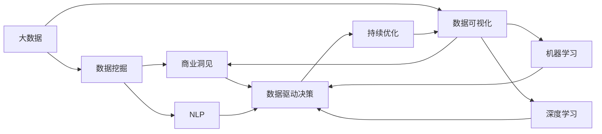

                 

# 数据分析创业：洞察商业本质的利器

## 1. 背景介绍

### 1.1 问题由来

数据分析创业的兴起，源于大数据时代的全面到来。在数字化转型的大背景下，企业海量数据的价值愈发凸显，如何从中提炼有价值的商业洞见，成为众多创业者关注的焦点。数据分析创业的核心，在于利用先进的数据分析技术和工具，帮助企业解锁数据蕴藏的商业价值，推动业务决策的科学化、精细化。

### 1.2 问题核心关键点

数据分析创业的核心在于其对商业本质的洞察，通过数据驱动的决策模式，帮助企业在竞争激烈的市场环境中占据优势。具体而言，数据分析创业关注以下几个关键点：

- **数据收集与处理**：获取高质量、实时化的数据，进行有效的清洗和预处理，确保数据的可用性和准确性。
- **数据挖掘与探索**：利用先进的数据挖掘和探索技术，揭示数据中的潜在规律和趋势。
- **商业洞察**：通过数据可视化、预测模型等手段，将数据分析结果转化为具体的商业洞见，指导决策。
- **数据驱动决策**：建立数据驱动的企业决策体系，以数据为中心优化产品和服务，提升运营效率。
- **持续优化**：建立数据反馈机制，不断迭代优化数据模型和分析方法，适应市场变化。

## 2. 核心概念与联系

### 2.1 核心概念概述

数据分析创业涉及的核心概念众多，主要包括：

- **大数据**：指体量巨大、类型多样的数据集合，具有潜在商业价值。
- **数据挖掘**：从大数据中提取有用信息、发现隐藏规律和关联的过程。
- **商业洞见**：通过数据分析得到的，能够指导企业商业决策的洞察。
- **数据可视化**：将数据以图形化的形式展现，便于理解和使用。
- **数据驱动决策**：基于数据分析结果，制定和调整企业决策的过程。
- **机器学习**：利用算法对数据进行建模和学习，预测未来趋势。
- **深度学习**：一种基于神经网络的机器学习方法，具备强大的模型表达能力。
- **自然语言处理(NLP)**：使计算机能够理解、处理和生成人类语言的技术。

这些概念之间的联系通过以下Mermaid流程图展示：



这个流程图展示了大数据分析创业的完整流程：

1. 从大数据中提取数据。
2. 进行数据清洗和挖掘，发现数据中的规律。
3. 通过数据可视化展示分析结果。
4. 获取商业洞见，指导企业决策。
5. 数据驱动决策，调整运营策略。
6. 持续优化，提升分析效果。
7. 利用机器学习增强分析能力。
8. 使用深度学习处理复杂数据。
9. 利用NLP技术进行语言理解。

## 3. 核心算法原理 & 具体操作步骤

### 3.1 算法原理概述

数据分析创业的算法原理，主要围绕数据处理、数据挖掘和商业洞见生成展开。其核心在于：

- **数据预处理**：通过ETL（Extract, Transform, Load）流程，将原始数据转换为可分析的格式。
- **特征工程**：构建和选择特征，提升模型性能。
- **建模与训练**：利用机器学习算法训练模型，预测商业洞见。
- **模型评估**：评估模型性能，确保分析结果的准确性。
- **结果解释**：将分析结果可视化，解释给业务决策者。

### 3.2 算法步骤详解

数据分析创业的算法步骤主要包括：

1. **数据收集与处理**：从多个数据源收集数据，进行清洗、筛选和预处理。

2. **特征工程**：
   - **特征提取**：从原始数据中提取有意义的特征。
   - **特征选择**：选择对商业洞见贡献最大的特征。
   - **特征转换**：对数据进行标准化、归一化、编码等操作，提升模型性能。

3. **模型训练与评估**：
   - **模型选择**：选择最适合的机器学习算法，如线性回归、决策树、随机森林、神经网络等。
   - **参数调优**：调整模型参数，优化模型性能。
   - **交叉验证**：使用交叉验证方法，评估模型泛化能力。
   - **性能评估**：计算模型在测试集上的表现指标，如准确率、召回率、F1值等。

4. **商业洞见生成**：
   - **数据可视化**：使用图表、仪表盘等形式展示分析结果。
   - **结果解释**：将分析结果转化为简洁、易懂的商业洞见。
   - **报告撰写**：撰写商业洞见报告，供决策者参考。

### 3.3 算法优缺点

数据分析创业的算法具有以下优点：

- **高效性**：利用机器学习和大数据技术，快速发现商业洞见。
- **准确性**：通过严格的模型评估和调优，确保分析结果的准确性。
- **可解释性**：数据可视化和结果解释使得商业洞见易于理解和使用。
- **灵活性**：支持多种数据源和分析方法，灵活适应不同需求。

同时，数据分析创业的算法也存在一些缺点：

- **高成本**：需要大量的数据和计算资源，初始投入较高。
- **模型复杂性**：高级算法（如深度学习）模型复杂，难以解释和调试。
- **数据隐私**：数据采集和处理过程中，需要注意数据隐私保护。
- **结果依赖**：分析结果依赖于数据质量，数据偏差可能影响结果。
- **业务融合**：将分析结果转化为具体业务决策，需要与业务团队深度融合。

### 3.4 算法应用领域

数据分析创业的算法在多个领域都有广泛应用，具体如下：

- **零售分析**：通过分析客户行为、市场趋势，指导库存管理、定价策略和促销活动。
- **金融风控**：利用机器学习模型，识别风险点和欺诈行为，提升风险控制能力。
- **市场营销**：分析用户数据，优化广告投放策略，提升广告效果。
- **医疗健康**：通过大数据分析，预测疾病风险，提升诊疗效果。
- **物流管理**：分析运输数据，优化路线和配送计划，提升运营效率。
- **制造优化**：利用工业物联网数据，优化生产流程，降低成本和提高质量。

## 4. 数学模型和公式 & 详细讲解 & 举例说明

### 4.1 数学模型构建

数据分析创业的核心数学模型包括回归模型、分类模型、聚类模型等。以线性回归模型为例：

设 $y$ 为因变量， $X$ 为自变量， $\beta$ 为回归系数，则线性回归模型的数学表达式为：

$$
y = \beta_0 + \beta_1 x_1 + \beta_2 x_2 + \cdots + \beta_n x_n + \epsilon
$$

其中，$\epsilon$ 为误差项，服从均值为0、方差为$\sigma^2$的正态分布。

### 4.2 公式推导过程

线性回归模型的参数估计，通常使用最小二乘法（OLS）：

1. **样本均值计算**：
   - $\overline{y} = \frac{1}{N} \sum_{i=1}^N y_i$
   - $\overline{x} = \frac{1}{N} \sum_{i=1}^N x_i$

2. **回归系数计算**：
   - $\hat{\beta} = (X'X)^{-1}X'y$

其中，$X$ 为自变量矩阵，$X' = [x_1, x_2, \cdots, x_n]$，$y$ 为因变量向量。

3. **模型预测**：
   - $\hat{y} = \hat{\beta}_0 + \hat{\beta}_1 x_1 + \hat{\beta}_2 x_2 + \cdots + \hat{\beta}_n x_n$

### 4.3 案例分析与讲解

假设某零售商收集了客户购买商品的记录，使用线性回归模型预测客户的平均购买金额：

- **数据准备**：收集客户ID、性别、年龄、购买金额等数据，并清洗处理。
- **模型训练**：使用训练集进行线性回归模型训练，计算回归系数。
- **模型评估**：使用测试集评估模型预测效果，计算准确率和均方误差。
- **结果解释**：将模型输出结果可视化，解释为商业洞见，如“年轻女性客户的平均购买金额为$100元”。

## 5. 项目实践：代码实例和详细解释说明

### 5.1 开发环境搭建

数据分析创业的开发环境通常包括Python、R、Jupyter Notebook等工具。以下是一个典型的Python开发环境配置示例：

1. **安装Python**：
   ```bash
   sudo apt-get update
   sudo apt-get install python3-pip
   ```

2. **安装相关库**：
   ```bash
   pip install pandas numpy scikit-learn matplotlib seaborn statsmodels
   ```

3. **安装Jupyter Notebook**：
   ```bash
   pip install jupyter notebook
   ```

4. **启动Jupyter Notebook**：
   ```bash
   jupyter notebook
   ```

### 5.2 源代码详细实现

以下是一个基于Python的线性回归模型分析示例：

```python
import pandas as pd
import numpy as np
import matplotlib.pyplot as plt
from statsmodels.regression.linear_model import OLS

# 准备数据
data = pd.read_csv('sales.csv')
X = data[['gender', 'age']]
y = data['amount']

# 数据标准化
X = (X - X.mean()) / X.std()

# 建立模型
model = OLS(y, X)
results = model.fit()

# 输出结果
print(results.summary())

# 可视化
plt.scatter(X['gender'], y)
plt.xlabel('Gender')
plt.ylabel('Amount')
plt.show()
```

### 5.3 代码解读与分析

1. **数据准备**：使用Pandas库读取数据，进行初步清洗和处理。
2. **数据标准化**：使用NumPy库对数据进行标准化，提升模型性能。
3. **模型建立**：使用Statsmodels库建立线性回归模型。
4. **模型评估**：输出模型结果，包括回归系数、截距、R方等统计量。
5. **结果可视化**：使用Matplotlib库绘制散点图，直观展示分析结果。

## 6. 实际应用场景

### 6.1 智能客服系统

智能客服系统通过数据分析，识别客户需求和情感，提供个性化服务。具体实现步骤如下：

1. **数据收集**：收集客户咨询记录、语音交互数据等。
2. **数据清洗**：清洗数据，去除噪声和无用信息。
3. **特征工程**：提取客户ID、关键词、情感倾向等特征。
4. **模型训练**：使用分类模型训练模型，识别客户需求。
5. **客户服务**：根据客户需求，提供个性化推荐和回答。
6. **系统优化**：定期更新模型，优化服务效果。

### 6.2 供应链优化

供应链优化通过数据分析，优化库存、物流、生产等环节，提升运营效率。具体实现步骤如下：

1. **数据收集**：收集供应链各环节的销售数据、库存数据、生产数据等。
2. **数据清洗**：清洗数据，去除不准确和重复信息。
3. **特征工程**：提取订单数量、库存水平、生产周期等特征。
4. **模型训练**：使用预测模型训练模型，优化库存和生产计划。
5. **运营优化**：根据模型预测结果，优化供应链各环节，降低成本和提高效率。
6. **效果评估**：评估优化效果，持续改进。

### 6.3 个性化推荐系统

个性化推荐系统通过数据分析，预测用户偏好，推荐个性化商品或服务。具体实现步骤如下：

1. **数据收集**：收集用户浏览、购买、评分等行为数据。
2. **数据清洗**：清洗数据，去除不准确和重复信息。
3. **特征工程**：提取用户ID、商品ID、评分等特征。
4. **模型训练**：使用协同过滤或深度学习模型训练模型，预测用户偏好。
5. **推荐展示**：根据用户偏好，推荐个性化商品或服务。
6. **效果评估**：评估推荐效果，优化推荐算法。

## 7. 工具和资源推荐

### 7.1 学习资源推荐

1. **《Python数据科学手册》**：深入介绍Python在数据分析中的应用，包含大量示例代码。
2. **《R语言实战》**：介绍R语言的数据分析方法，适合初学者和中级用户。
3. **Kaggle平台**：提供丰富的数据集和数据分析竞赛，帮助用户提升技能。
4. **Coursera平台**：提供多门数据分析和机器学习课程，涵盖基础和高级内容。
5. **TensorFlow官方文档**：提供深度学习框架的使用指南，适合数据分析领域的高级用户。

### 7.2 开发工具推荐

1. **Jupyter Notebook**：支持多种编程语言，便于数据分析和可视化。
2. **Tableau**：强大的数据可视化工具，帮助用户更好地理解数据。
3. **Scikit-learn**：提供多种机器学习算法和工具，方便数据分析和建模。
4. **Pandas**：提供高效的数据处理和清洗工具，支持大规模数据集操作。
5. **TensorFlow**：支持深度学习模型构建和训练，适合复杂数据分析任务。

### 7.3 相关论文推荐

1. **《大数据分析：方法与实践》**：介绍大数据分析的基本方法和技术，适合数据分析领域入门者。
2. **《深度学习：理论与实践》**：介绍深度学习的基本概念和应用，适合机器学习领域高级用户。
3. **《商业数据分析：从数据到决策》**：介绍商业数据分析的流程和应用，适合企业数据分析师。
4. **《自然语言处理基础》**：介绍自然语言处理的基本技术和方法，适合NLP领域初学者。
5. **《数据挖掘：概念与技术》**：介绍数据挖掘的基本方法和技术，适合数据分析领域中级用户。

## 8. 总结：未来发展趋势与挑战

### 8.1 总结

数据分析创业以数据为核心，通过先进的数据分析技术和工具，帮助企业洞察商业本质，提升决策效率。本文介绍了数据分析创业的核心概念和算法原理，并通过具体案例和代码示例，展示了数据分析在实际应用中的广泛应用。数据分析创业不仅提升了企业的决策科学性和效率，也为创业公司提供了新的市场机会和发展方向。

### 8.2 未来发展趋势

数据分析创业的未来发展趋势包括：

1. **数据治理与隐私保护**：随着数据量不断增加，数据治理和隐私保护成为重要议题。数据标准化和合规性将得到更多关注。
2. **智能化分析工具**：数据分析工具将更加智能化，支持自动化的数据清洗、特征选择和模型训练。
3. **跨领域融合**：数据分析将与其他技术如AI、IoT、区块链等深度融合，形成更强大的综合分析能力。
4. **实时数据分析**：实时数据流分析和大数据实时处理技术的发展，将支持企业进行实时决策。
5. **自动化决策**：通过机器学习等技术，实现自动化决策，提升决策效率和准确性。
6. **多方协作**：数据分析将与其他业务部门深度协作，形成更加全面的业务洞见。

### 8.3 面临的挑战

数据分析创业虽然前景广阔，但也面临诸多挑战：

1. **数据质量与真实性**：数据质量参差不齐，数据真实性难以验证，可能影响分析结果。
2. **技术复杂性**：数据分析涉及多种技术和算法，需要高水平的技术团队支持。
3. **人才短缺**：具备数据分析和业务双背景的人才稀缺，制约数据分析创业的发展。
4. **数据隐私**：数据隐私保护和合规性问题复杂，可能面临法律和伦理风险。
5. **模型可解释性**：高级机器学习模型复杂，难以解释和调试，影响业务应用。
6. **市场竞争**：数据分析创业市场竞争激烈，需要具备竞争优势。

### 8.4 研究展望

面对数据分析创业面临的挑战，未来的研究需要在以下几个方面寻求突破：

1. **数据质量提升**：开发自动化的数据清洗和真实性验证技术，提升数据质量。
2. **技术工具简化**：简化数据分析工具和算法，降低技术门槛，支持更广泛的用户使用。
3. **人才培养**：加强数据分析领域的人才培养，提升人才素质和技能。
4. **隐私保护技术**：开发隐私保护技术，保障数据安全。
5. **模型可解释性**：开发可解释性模型，增强模型的透明度和信任度。
6. **业务融合**：加强数据分析与其他业务的深度融合，提升业务洞见和应用效果。

总之，数据分析创业在帮助企业洞察商业本质、提升决策效率方面具有巨大的潜力和价值。未来，数据分析工具和技术的不断进步，将进一步推动数据分析创业的发展，为更多企业提供高质量的数据分析服务。

## 9. 附录：常见问题与解答

### Q1: 数据分析创业的核心价值是什么？

A: 数据分析创业的核心价值在于其能够帮助企业通过数据驱动的决策模式，深入洞察商业本质，优化运营效率，提升市场竞争力。

### Q2: 数据分析创业与传统数据分析有何不同？

A: 数据分析创业更注重技术创新和业务应用，通过机器学习和深度学习等技术，提升数据分析的准确性和效率。而传统数据分析更侧重于数据处理和业务洞察，通常使用统计分析和报表展示。

### Q3: 数据分析创业的算法原理是什么？

A: 数据分析创业的算法原理包括数据预处理、特征工程、模型训练和结果解释。通过先进的数据分析技术和工具，帮助企业从数据中提取有价值的商业洞见，指导决策。

### Q4: 数据分析创业需要哪些核心工具和资源？

A: 数据分析创业的核心工具包括Python、R、Jupyter Notebook、Tableau、Scikit-learn等。主要资源包括Kaggle平台、Coursera平台、TensorFlow官方文档等。

### Q5: 数据分析创业面临的主要挑战有哪些？

A: 数据分析创业面临的主要挑战包括数据质量与真实性、技术复杂性、人才短缺、数据隐私、模型可解释性和市场竞争等。

---

作者：禅与计算机程序设计艺术 / Zen and the Art of Computer Programming

