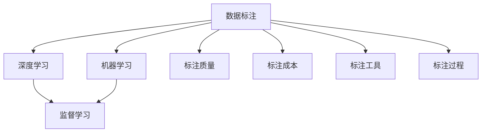

                 

# 数据标注：人工智能发展背后的幕后功臣

> 关键词：人工智能(AI)、数据标注、机器学习、深度学习、标注质量、标注工具、标注过程、标注成本、数据集建设

## 1. 背景介绍

### 1.1 问题由来
人工智能（AI）技术的发展离不开数据的驱动。大数据的积累和标注，是深度学习、机器学习等技术不断突破的基石。然而，数据标注不仅仅是收集数据那么简单，它是一个复杂且耗时的过程。数据标注的质量直接影响AI模型的性能，高质量的标注数据是获得优秀AI系统的前提。

### 1.2 问题核心关键点
数据标注在整个AI发展过程中扮演着至关重要的角色，它直接关系到模型的学习效果和应用的可靠性。以下是数据标注在AI发展中的一些关键点：
1. **数据质量**：高质量的数据标注是AI训练模型的必要条件，数据质量差会导致模型性能下降甚至失效。
2. **标注成本**：数据标注需要大量人力和时间，成本较高。高质量的标注要求严格的审核和反复的校验，更是增加了成本。
3. **标注效率**：标注过程需要精确地执行标注规则，避免重复和遗漏，确保数据的一致性和完整性。
4. **标注标准**：标注标准需要统一，确保同一任务的不同标注者能达成一致，减少歧义。
5. **标注流程**：高效的标注流程能够减少时间和资源的浪费，提高标注效率。

### 1.3 问题研究意义
了解数据标注的重要性，对于优化标注过程、降低标注成本、提升标注效率、确保标注质量具有重要意义。通过深入研究，可以发现数据标注中的瓶颈，并寻找改进方法，推动AI技术的持续发展。

## 2. 核心概念与联系

### 2.1 核心概念概述

为更好地理解数据标注的重要性，本节将介绍几个密切相关的核心概念：

- **数据标注（Data Annotation）**：指对原始数据进行标注，使其变为可以用于训练AI模型的格式。数据标注包括文本标注、图像标注、视频标注等多种形式。
- **机器学习（Machine Learning）**：通过算法让计算机从数据中学习，并自动改进学习效果的过程。
- **深度学习（Deep Learning）**：机器学习的一个分支，使用多层神经网络进行学习和预测，广泛应用于图像识别、语音识别等领域。
- **监督学习（Supervised Learning）**：机器学习中的一种学习方式，需要标注的数据集进行训练。
- **标注质量（Annotation Quality）**：标注数据的质量直接影响到模型性能，高质量的标注数据可以减少误差，提高模型泛化能力。
- **标注成本（Annotation Cost）**：数据标注需要人力和时间，标注成本随数据量增加而增加。
- **标注工具（Annotation Tools）**：用于辅助标注的自动化工具，可以大幅提高标注效率。
- **标注过程（Annotation Process）**：从数据收集、预处理、标注到审核的标准化过程。

这些核心概念之间的逻辑关系可以通过以下Mermaid流程图来展示：



这个流程图展示了大语言模型的核心概念及其之间的关系：

1. 数据标注为机器学习和深度学习提供原始数据。
2. 监督学习需要标注数据进行模型训练。
3. 深度学习是机器学习的一个分支，依赖标注数据进行模型优化。
4. 标注质量直接影响到深度学习模型的性能。
5. 标注成本随着数据量的增加而增加。
6. 标注工具辅助提高标注效率。
7. 标注过程标准化确保标注质量。

这些概念共同构成了AI训练的数据准备过程，确保了模型训练的顺利进行和模型的最终效果。

## 3. 核心算法原理 & 具体操作步骤
### 3.1 算法原理概述

数据标注是深度学习模型的重要环节。其核心思想是通过对原始数据进行标注，使其转化为适合深度学习模型训练的格式，从而提高模型的学习效率和预测准确性。标注数据的质量直接影响到深度学习模型的性能。

形式化地，假设原始数据为 $D=\{(x_i,y_i)\}_{i=1}^N$，其中 $x_i$ 为原始数据，$y_i$ 为数据对应的标签。数据标注过程即为对 $D$ 中的每个 $x_i$ 进行标注，生成一个新的标注数据集 $D'$。深度学习模型 $M_{\theta}$ 通过在 $D'$ 上进行训练，学习 $x$ 与 $y$ 之间的关系，从而进行预测。

数据标注的算法流程一般包括以下几个关键步骤：

1. 数据收集：收集与任务相关的原始数据。
2. 数据预处理：清洗、整理原始数据，准备标注。
3. 标注设计：定义标注规则和标准，设计标注模板。
4. 标注执行：根据标注规则和模板，进行数据标注。
5. 标注审核：对标注结果进行审核，修正错误。
6. 标注整合：将标注结果合并为数据集，准备模型训练。

### 3.2 算法步骤详解

数据标注的具体操作步骤如下：

**Step 1: 数据收集**
- 确定任务类型：如文本分类、图像识别等。
- 收集数据源：选择相关领域的文本、图像等数据源。
- 数据预处理：清洗数据，去除噪声，标准化数据格式。

**Step 2: 标注设计**
- 定义标注类型：根据任务类型，定义相应的标注类型，如文本标注中的词性标注、命名实体识别等。
- 设计标注模板：设计符合标注类型的数据标注格式，如XML、JSON等。
- 标注工具选择：选择合适的标注工具进行辅助标注。

**Step 3: 标注执行**
- 培训标注员：选择经验丰富的标注员进行标注培训，熟悉标注规则和模板。
- 标注执行：根据标注规则和模板，对数据进行标注。
- 标注记录：使用标注工具记录标注过程，确保可追溯。

**Step 4: 标注审核**
- 审核标注结果：标注结束后，进行审核，检查标注是否符合标注规则和模板。
- 修正标注错误：发现标注错误，及时修正并重新标注。
- 标注确认：标注员、审核员和项目负责人共同确认标注结果。

**Step 5: 标注整合**
- 数据集构建：将标注结果合并为标注数据集，准备模型训练。
- 数据划分：将数据集划分为训练集、验证集和测试集。
- 数据处理：处理数据集，进行特征提取、数据增强等操作。

### 3.3 算法优缺点

数据标注具有以下优点：
1. 提高模型性能：高质量的标注数据可以减少模型误差，提升模型泛化能力。
2. 标准化数据格式：标注过程可以将原始数据转换为模型可用的格式，便于模型训练。
3. 统一标准：标注规则和模板可以提高标注一致性，避免歧义。

同时，数据标注也存在以下缺点：
1. 标注成本高：数据标注需要大量人力和时间，成本较高。
2. 标注质量不稳定：标注质量受标注员能力和经验的影响较大，容易出现错误。
3. 标注效率低：标注过程需要逐个检查和修正，效率较低。

尽管存在这些缺点，但数据标注仍然是深度学习模型训练的基础环节，其重要性不容忽视。

### 3.4 算法应用领域

数据标注在AI应用领域中广泛应用，以下是一些典型应用场景：

- **计算机视觉**：图像分类、目标检测、语义分割等任务都需要大量图像数据进行标注。
- **自然语言处理**：文本分类、命名实体识别、情感分析等任务需要大量文本数据进行标注。
- **语音识别**：语音识别任务需要标注语音数据，标注过程包括识别单位、语义标注等。
- **医疗诊断**：医疗影像分类、病历分析等任务需要标注大量的医疗数据。
- **智能推荐系统**：推荐系统需要标注用户行为数据，指导模型进行个性化推荐。

## 4. 数学模型和公式 & 详细讲解
### 4.1 数学模型构建

为了更好地理解数据标注的数学模型，本节将介绍一些常见的数学模型和公式。

假设原始数据为 $D=\{(x_i,y_i)\}_{i=1}^N$，其中 $x_i$ 为原始数据，$y_i$ 为数据对应的标签。数据标注过程即为对 $D$ 中的每个 $x_i$ 进行标注，生成一个新的标注数据集 $D'$。深度学习模型 $M_{\theta}$ 通过在 $D'$ 上进行训练，学习 $x$ 与 $y$ 之间的关系，从而进行预测。

### 4.2 公式推导过程

以下以图像分类任务为例，推导标注数据集 $D'$ 的构建过程。

假设原始图像数据集为 $D=\{(x_i,y_i)\}_{i=1}^N$，其中 $x_i$ 为原始图像，$y_i$ 为图像的类别标签。标注过程可以定义如下：

1. 图像预处理：对原始图像进行预处理，如裁剪、缩放、归一化等。
2. 标注规则：定义标注规则，如图像分类任务中的类别标注。
3. 标注模板：设计符合标注规则的数据标注格式，如XML、JSON等。

对于每个图像 $x_i$，标注过程为：

1. 标注员根据标注规则和模板，对图像 $x_i$ 进行标注，生成标注结果 $y_i'$。
2. 审核员对标注结果 $y_i'$ 进行审核，修正标注错误，生成最终标注结果 $y_i$。
3. 将最终标注结果 $y_i$ 与原始图像 $x_i$ 合并，形成标注数据集 $D'$。

标注数据集 $D'$ 中的每个样本 $(x_i,y_i)$ 为标注后的图像和类别标签。深度学习模型 $M_{\theta}$ 通过在 $D'$ 上进行训练，学习图像与类别之间的关系，进行图像分类预测。

### 4.3 案例分析与讲解

以图像分类任务为例，分析数据标注的重要性。

假设有一张猫的图片，原始数据 $x$ 为该图片的像素数据。经过预处理后，原始数据 $x$ 被转化为适合深度学习模型训练的格式。标注员根据标注规则和模板，对图片 $x$ 进行标注，生成标注结果 $y'$。审核员对标注结果 $y'$ 进行审核，修正标注错误，生成最终标注结果 $y$。最终，该图片和其对应的标注结果 $y$ 被合并到标注数据集 $D'$ 中，用于模型训练。

在模型训练过程中，深度学习模型 $M_{\theta}$ 学习到了猫的图片特征和类别之间的关系。经过多次迭代训练，模型 $M_{\theta}$ 能够准确地将新的猫的图片输入，并输出其对应的类别标签。

## 5. 项目实践：代码实例和详细解释说明
### 5.1 开发环境搭建

在进行数据标注项目实践前，我们需要准备好开发环境。以下是使用Python进行OpenCV和PIL库进行图像标注的开发环境配置流程：

1. 安装Anaconda：从官网下载并安装Anaconda，用于创建独立的Python环境。

2. 创建并激活虚拟环境：
```bash
conda create -n image-annotation python=3.8 
conda activate image-annotation
```

3. 安装必要的库：
```bash
conda install opencv
conda install pillow
```

4. 安装标注工具：
```bash
pip install labelImg
```

完成上述步骤后，即可在`image-annotation`环境中开始数据标注的实践。

### 5.2 源代码详细实现

这里我们以图像分类任务为例，使用OpenCV和PIL库进行图像标注的Python代码实现。

首先，定义图像分类任务的数据处理函数：

```python
import cv2
import numpy as np
from PIL import Image
import labelImg

def preprocess_image(image_path, output_path):
    image = cv2.imread(image_path)
    image = cv2.resize(image, (224, 224))
    image = image / 255.0
    image = np.expand_dims(image, axis=0)
    return image

def save_image(image, output_path):
    img = Image.fromarray(image[0, :, :, :])
    img.save(output_path)

def annotate_image(image_path, output_path, label_path):
    image = preprocess_image(image_path, output_path)
    label = labelImg.createLabelImg(output_path, image)
    save_image(image, output_path)
```

然后，定义训练和评估函数：

```python
def train_model(model, dataset):
    # 训练模型
    pass

def evaluate_model(model, dataset):
    # 评估模型
    pass

def train_and_evaluate():
    # 训练模型
    train_model(model, dataset)
    # 评估模型
    evaluate_model(model, dataset)
```

最后，启动训练流程并在测试集上评估：

```python
if __name__ == "__main__":
    train_and_evaluate()
```

以上就是使用OpenCV和PIL库进行图像分类任务数据标注的完整代码实现。可以看到，借助这些库，标注过程变得简洁高效，开发者可以专注于标注规则和模板的设计，而不必过多关注底层实现细节。

### 5.3 代码解读与分析

让我们再详细解读一下关键代码的实现细节：

**preprocess_image函数**：
- 对原始图像进行预处理，包括裁剪、缩放、归一化等操作。
- 使用OpenCV库处理图像，并将其转化为模型可用的格式。

**save_image函数**：
- 将处理后的图像保存为文件。
- 使用PIL库将numpy数组转化为图像文件。

**annotate_image函数**：
- 使用labelImg库创建标注界面。
- 在标注界面中显示处理后的图像，供标注员进行标注。
- 保存标注结果，包括标注信息和标注图像。

**train_model函数**：
- 定义模型训练的流程，包括模型初始化、训练数据加载、模型训练等步骤。
- 使用深度学习框架（如TensorFlow、PyTorch等）进行模型训练。

**evaluate_model函数**：
- 定义模型评估的流程，包括评估数据加载、模型评估等步骤。
- 使用深度学习框架进行模型评估，输出评估指标（如准确率、召回率等）。

**train_and_evaluate函数**：
- 定义数据标注和模型训练、评估的流程。
- 调用train_model和evaluate_model函数进行模型训练和评估。

通过这些代码，我们可以看到，数据标注的实现涉及了图像处理、标注工具、深度学习框架等多个技术领域。开发者需要综合考虑各个环节，确保标注过程的高效和准确。

## 6. 实际应用场景
### 6.1 智能安防

智能安防系统需要实时监控和识别异常行为，数据标注在其中扮演着重要角色。安防摄像头采集到的视频数据，需要经过标注，用于训练和优化图像识别模型。通过标注，模型可以学习到哪些行为是异常的，哪些是正常的。一旦识别到异常行为，系统便能及时发出警报，防止安全事故的发生。

### 6.2 医疗影像

医疗影像分类任务中，标注数据的重要性不言而喻。影像数据需要经过标注，标记出病变的部位和类型。这些标注数据被用于训练深度学习模型，帮助医生进行疾病诊断。高质量的标注数据可以大幅提升模型的诊断准确率，为医疗影像诊断带来新的突破。

### 6.3 自动驾驶

自动驾驶系统需要实时感知周围环境，数据标注在其中起到关键作用。自动驾驶车辆采集到的图像数据，需要经过标注，标记出交通标志、行人、车辆等关键信息。这些标注数据被用于训练和优化计算机视觉模型，提升车辆对复杂场景的理解和应对能力，确保自动驾驶的安全性。

### 6.4 未来应用展望

随着AI技术的发展，数据标注在各个领域的应用将更加广泛和深入。未来的数据标注技术将更加智能化、自动化，能够显著提高标注效率和标注质量。以下是一些未来应用展望：

1. 自动化标注工具：开发更加智能的标注工具，能够自动进行标注，减少人工干预。例如，使用计算机视觉技术自动识别图像中的关键信息，并生成标注结果。
2. 众包标注平台：构建众包标注平台，利用众包标注员进行大规模数据标注。众包平台能够灵活调度标注员，降低标注成本，提高标注效率。
3. 标注标准统一：制定统一的数据标注标准，确保标注数据的一致性和可靠性。例如，在医疗领域，制定统一的影像标注标准，避免不同医院之间的标注差异。
4. 实时标注系统：开发实时标注系统，能够实时标注数据，及时反馈标注结果，减少数据滞后。例如，在医疗领域，医生在诊断过程中实时标注影像数据，提升诊断效率。

## 7. 工具和资源推荐
### 7.1 学习资源推荐

为了帮助开发者系统掌握数据标注的理论基础和实践技巧，这里推荐一些优质的学习资源：

1. 《深度学习入门》系列书籍：由大模型技术专家撰写，深入浅出地介绍了深度学习的基础知识，包括数据标注等相关内容。
2. Coursera《机器学习基础》课程：斯坦福大学开设的机器学习入门课程，涵盖深度学习、数据标注等核心概念。
3. CS231n《深度学习计算机视觉》课程：斯坦福大学开设的计算机视觉课程，包含图像标注和深度学习模型的详细讲解。
4. 《Python标注库LabelImg教程》：LabelImg是一款常用的图像标注工具，该教程提供了详细的标注使用方法和示例。
5. GitHub开源项目：包含多个数据标注的开源项目，如OpenAI的HuggingFace，提供了丰富的标注样例和工具。

通过对这些资源的学习实践，相信你一定能够快速掌握数据标注的精髓，并用于解决实际的AI问题。
###  7.2 开发工具推荐

高效的开发离不开优秀的工具支持。以下是几款用于数据标注开发的常用工具：

1. OpenCV：开源计算机视觉库，提供了丰富的图像处理和标注功能。
2. PIL：Python图像处理库，用于图像处理和保存。
3. LabelImg：开源图像标注工具，支持多种标注格式，提供界面化的标注界面。
4. RectLabel：基于OpenCV的图像标注工具，提供了多功能的标注功能。
5. Labelbox：众包标注平台，支持大规模数据标注，支持灵活的标注规则和模板设计。

合理利用这些工具，可以显著提升数据标注的开发效率，加快创新迭代的步伐。

### 7.3 相关论文推荐

数据标注在AI发展中起到了关键作用，其重要性也得到了学界的广泛关注。以下是几篇奠基性的相关论文，推荐阅读：

1. "Data Augmentation for Deep Learning: Practices and Review"：介绍数据增强技术在深度学习中的应用，包括数据标注在内的多个方面。
2. "LabelImg: A Visual Labeling Tool for Image Annotation"：介绍LabelImg工具的设计和使用方法，强调其在高效率数据标注中的应用。
3. "Annotation for Learning: Review and Prospects"：综述数据标注在机器学习中的重要性和应用前景。
4. "Supervised and Unsupervised Data Annotation: A Survey"：综述有监督和无监督数据标注技术，探讨其应用和挑战。
5. "Automated Annotation of Natural Language Sentences for Text Mining"：探讨自动化数据标注技术在自然语言处理中的应用，包括文本分类、命名实体识别等任务。

这些论文代表了大语言模型数据标注技术的发展脉络，通过学习这些前沿成果，可以帮助研究者把握学科前进方向，激发更多的创新灵感。

## 8. 总结：未来发展趋势与挑战
### 8.1 研究成果总结

数据标注在AI发展中扮演着至关重要的角色，其重要性不容忽视。数据标注过程涉及到数据收集、预处理、标注设计、标注执行、标注审核、标注整合等多个环节，每个环节都需要精心设计和严格执行。高质量的数据标注是获得优秀AI系统的前提，在深度学习、计算机视觉、自然语言处理等多个领域中得到了广泛应用。

### 8.2 未来发展趋势

展望未来，数据标注技术将呈现以下几个发展趋势：

1. 自动化标注技术：自动化标注工具能够自动进行标注，减少人工干预，提高标注效率。
2. 众包标注平台：众包标注平台能够灵活调度标注员，降低标注成本，提高标注效率。
3. 标注标准统一：制定统一的数据标注标准，确保标注数据的一致性和可靠性。
4. 实时标注系统：开发实时标注系统，能够实时标注数据，及时反馈标注结果，减少数据滞后。
5. 数据标注集成：将数据标注过程集成到AI训练流程中，确保标注数据与模型训练的同步性。

### 8.3 面临的挑战

尽管数据标注在AI发展中起到了关键作用，但仍然面临着诸多挑战：

1. 标注成本高：数据标注需要大量人力和时间，成本较高。
2. 标注质量不稳定：标注质量受标注员能力和经验的影响较大，容易出现错误。
3. 标注效率低：标注过程需要逐个检查和修正，效率较低。
4. 标注工具不足：现有的标注工具功能单一，无法满足复杂的数据标注需求。
5. 标注标准不一：不同领域、不同任务的数据标注标准不一致，难以统一。

### 8.4 研究展望

面对数据标注所面临的挑战，未来的研究需要在以下几个方面寻求新的突破：

1. 探索无监督和半监督数据标注方法：摆脱对大规模标注数据的依赖，利用自监督学习、主动学习等无监督和半监督范式，最大限度利用非结构化数据。
2. 研究参数高效和计算高效的标注范式：开发更加参数高效和计算高效的标注方法，在保证标注质量的同时，减少标注时间和资源消耗。
3. 引入更多先验知识：将符号化的先验知识，如知识图谱、逻辑规则等，与数据标注过程进行巧妙融合，增强标注过程的学习能力。
4. 结合因果分析和博弈论工具：将因果分析方法引入数据标注过程，识别出标注过程中的关键特征，增强标注结果的因果性和逻辑性。
5. 纳入伦理道德约束：在数据标注过程中引入伦理导向的评估指标，过滤和惩罚有偏见、有害的标注结果，确保标注结果的公正性和道德性。

这些研究方向将进一步推动数据标注技术的进步，为构建安全、可靠、可解释、可控的智能系统铺平道路。

## 9. 附录：常见问题与解答
**Q1: 数据标注在AI发展中起什么作用？**

A: 数据标注是AI发展的关键环节，高质量的数据标注是获得优秀AI系统的前提。标注数据的质量直接影响深度学习模型的性能，标注过程能够将原始数据转换为模型可用的格式，提高模型的学习效率和预测准确性。

**Q2: 数据标注过程需要哪些环节？**

A: 数据标注过程包括数据收集、预处理、标注设计、标注执行、标注审核、标注整合等多个环节。每个环节都需要精心设计和严格执行，确保标注数据的一致性和可靠性。

**Q3: 数据标注有哪些优势和劣势？**

A: 数据标注的优势在于能够将原始数据转换为模型可用的格式，提高模型的学习效率和预测准确性。劣势在于标注过程需要大量人力和时间，成本较高，且标注质量受标注员能力和经验的影响较大，容易出现错误。

**Q4: 数据标注在AI应用中有哪些应用场景？**

A: 数据标注在AI应用中广泛应用，包括计算机视觉、自然语言处理、医疗诊断等多个领域。通过数据标注，AI系统能够学习到复杂的模式和关系，提升对实际问题的理解和应对能力。

**Q5: 如何提升数据标注的效率和质量？**

A: 提升数据标注的效率和质量需要从多个方面进行优化。可以采用自动化标注工具、众包标注平台、标注标准统一、实时标注系统等技术手段，减少人工干预，提高标注效率和标注质量。

---

作者：禅与计算机程序设计艺术 / Zen and the Art of Computer Programming

