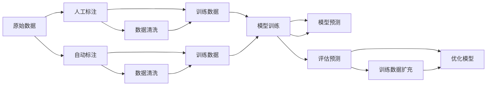

                 

# 数据标注：人工智能发展背后的无名英雄

> 关键词：数据标注, 人工智能, 机器学习, 深度学习, 无监督学习, 监督学习, 半监督学习, 人工标注, 数据集构建, 数据增强, 标注规范

## 1. 背景介绍

在人工智能(AI)领域，尤其是机器学习与深度学习领域，数据标注无疑是至关重要的基础设施。然而，这个行业背后有一群无名英雄，他们默默无闻，辛勤付出，是推动AI技术进步的关键力量。他们不仅是数据的“注脚者”，更是AI技术的“守护者”。本文旨在探究数据标注在AI发展中的作用，揭示其背后的无名英雄，并展望未来可能的方向。

## 2. 核心概念与联系

### 2.1 核心概念概述

- **数据标注(Data Annotation)**：指在机器学习或深度学习任务中，将原始数据（如文本、图像、音频等）转换为模型可以理解的格式，并为其打上标签（即标注）的过程。标注数据是训练模型的重要输入，其质量和数量直接影响到模型性能。

- **监督学习(Supervised Learning)**：机器学习的一种方式，依赖带有标签的训练数据，通过学习数据中的模式和规律，对未知数据进行预测或分类。

- **无监督学习(Unsupervised Learning)**：机器学习的一种方式，不需要带标签的数据，通过学习数据的结构或内在关系，发现数据的隐藏模式。

- **半监督学习(Semi-supervised Learning)**：结合有标签和无标签数据进行训练的方法，利用无标签数据的丰富信息，辅助提升模型性能。

- **人工标注(Human Annotation)**：利用人工对数据进行标注，确保标注的准确性和一致性，但成本和时间投入较大。

- **自动化标注(Automated Annotation)**：利用算法自动对数据进行标注，提高标注效率，但准确性难以保证。

### 2.2 核心概念原理和架构的 Mermaid 流程图



此图展示了一个简单的数据标注流程：原始数据通过人工或自动化标注得到训练数据，训练数据用于模型训练，模型预测结果经评估和优化后，进一步扩充训练数据以提高模型性能。

## 3. 核心算法原理 & 具体操作步骤

### 3.1 算法原理概述

数据标注的核心在于将原始数据转换为模型可以理解的形式，并打上标签，从而供模型训练使用。其基本原理可以归纳为以下几个步骤：

1. **数据收集**：收集与任务相关的数据。
2. **数据预处理**：清洗数据，去除噪声，标准化数据格式。
3. **数据标注**：根据任务需求，对数据进行人工或自动标注。
4. **数据增强**：通过一系列技术手段，扩充数据集，提高模型泛化能力。
5. **模型训练**：使用标注数据训练机器学习或深度学习模型。
6. **模型评估**：通过测试集评估模型性能，优化模型参数。
7. **模型应用**：将训练好的模型应用于实际场景，进行预测或分类。

### 3.2 算法步骤详解

#### 3.2.1 数据收集

数据收集是数据标注的第一步。通常需要收集与任务相关的数据，可以是公开数据集、用户数据、网络爬取数据等。以下是数据收集的一些常见策略：

- **公开数据集**：如MNIST、CIFAR-10、IMDB等，可以直接使用，节省了收集和标注的精力。
- **用户数据**：根据应用场景，收集用户行为、偏好、反馈等信息。
- **网络爬取数据**：利用爬虫技术，从互联网上抓取数据，但需注意法律和道德规范。

#### 3.2.2 数据预处理

数据预处理包括数据清洗、格式转换、归一化等。预处理可以极大地提升标注数据的质量，减少后续处理的复杂度。

- **数据清洗**：去除数据中的噪声、异常值，确保数据的准确性。
- **格式转换**：将不同格式的数据统一转化为模型可处理的标准格式。
- **归一化**：对数据进行标准化，使其符合模型的输入要求。

#### 3.2.3 数据标注

数据标注是数据标注过程中最为关键的一环。标注的准确性和一致性直接影响到模型的训练效果。标注方法包括人工标注和自动化标注。

- **人工标注**：标注人员根据任务需求，对数据进行手动标注。例如，在图像分类任务中，标注人员需要确定图像所属的类别。
- **自动化标注**：利用算法对数据进行标注。例如，在文本分类任务中，可以利用词频统计、TF-IDF等技术对文本进行自动分类。

#### 3.2.4 数据增强

数据增强是通过一系列技术手段，扩充数据集，提高模型泛化能力。以下是一些常见的数据增强技术：

- **回译**：利用翻译技术，将数据进行语言转换，增加数据多样性。
- **旋转、翻转**：对图像数据进行旋转、翻转操作，增加数据变化性。
- **添加噪声**：在图像、音频数据中添加噪声，模拟真实环境中的噪声干扰。

#### 3.2.5 模型训练

模型训练是将标注数据输入模型，通过反向传播等算法，调整模型参数，使其能够拟合标注数据。

- **模型选择**：根据任务需求选择合适的模型。
- **损失函数选择**：选择合适的损失函数，评估模型预测与真实标签的差异。
- **优化器选择**：选择合适的优化器，如SGD、Adam等，优化模型参数。

#### 3.2.6 模型评估

模型评估是对模型进行测试，评估其在测试集上的表现，包括精度、召回率、F1分数等指标。评估过程包括：

- **测试集划分**：将数据集划分为训练集、验证集和测试集。
- **模型测试**：在测试集上对模型进行测试，获取评估指标。
- **模型优化**：根据评估结果，优化模型参数。

#### 3.2.7 模型应用

模型应用是将训练好的模型应用于实际场景，进行预测或分类。

- **部署模型**：将训练好的模型部署到服务器或嵌入式设备上。
- **数据输入**：将新数据输入模型，进行预测或分类。
- **结果输出**：模型输出预测结果，供后续处理使用。

### 3.3 算法优缺点

数据标注在AI发展中的作用是巨大的，但也存在一些局限性：

#### 3.3.1 优点

1. **高质量数据**：标注数据通常经过人工审核和验证，数据质量较高。
2. **泛化能力**：标注数据能够提供丰富的背景知识和模式，提高模型的泛化能力。
3. **任务导向**：标注数据能够明确任务需求，指导模型的训练过程。

#### 3.3.2 缺点

1. **成本高**：人工标注需要投入大量时间和人力，成本较高。
2. **标注偏差**：人工标注容易出现主观偏差，影响标注数据的准确性。
3. **数据获取难度**：一些数据获取难度较大，尤其是特定领域的标注数据。

### 3.4 算法应用领域

数据标注在AI领域有广泛的应用，以下是一些典型领域：

1. **计算机视觉**：如图像分类、物体检测、人脸识别等。
2. **自然语言处理**：如文本分类、命名实体识别、情感分析等。
3. **语音识别**：如语音转文本、情感识别、说话人识别等。
4. **医疗影像**：如医学影像分类、病理诊断、影像分割等。
5. **金融分析**：如信用评分、市场分析、风险评估等。

## 4. 数学模型和公式 & 详细讲解 & 举例说明

### 4.1 数学模型构建

在数据标注和模型训练中，常用的数学模型包括损失函数、优化器、评估指标等。

#### 4.1.1 损失函数

损失函数用于衡量模型预测结果与真实标签的差异。以下是一些常用的损失函数：

- **交叉熵损失(Cross-Entropy Loss)**：在分类任务中常用，公式为：
  $$
  L = -\frac{1}{N} \sum_{i=1}^{N} \sum_{j=1}^{C} y_{i,j} \log p_{i,j}
  $$
  其中 $y_{i,j}$ 表示样本 $i$ 属于类别 $j$ 的真实标签，$p_{i,j}$ 表示模型预测样本 $i$ 属于类别 $j$ 的概率。

- **均方误差损失(Mean Squared Error Loss)**：在回归任务中常用，公式为：
  $$
  L = \frac{1}{N} \sum_{i=1}^{N} (y_i - \hat{y_i})^2
  $$
  其中 $y_i$ 表示真实标签，$\hat{y_i}$ 表示模型预测值。

#### 4.1.2 优化器

优化器用于调整模型参数，使其最小化损失函数。以下是一些常用的优化器：

- **随机梯度下降法(Stochastic Gradient Descent, SGD)**：公式为：
  $$
  \theta_{t+1} = \theta_t - \eta \nabla_{\theta} L(\theta_t)
  $$
  其中 $\eta$ 表示学习率，$\nabla_{\theta} L(\theta_t)$ 表示损失函数对模型参数的梯度。

- **Adam**：是一种自适应学习率优化器，公式为：
  $$
  m_t = \beta_1 m_{t-1} + (1 - \beta_1) \nabla_{\theta} L(\theta_t)
  $$
  $$
  v_t = \beta_2 v_{t-1} + (1 - \beta_2) (\nabla_{\theta} L(\theta_t))^2
  $$
  $$
  \hat{m}_t = \frac{m_t}{1 - \beta_1^t}
  $$
  $$
  \hat{v}_t = \frac{v_t}{1 - \beta_2^t}
  $$
  $$
  \theta_{t+1} = \theta_t - \frac{\eta}{\sqrt{\hat{v}_t} + \epsilon} \hat{m}_t
  $$
  其中 $\beta_1$ 和 $\beta_2$ 表示指数衰减率，$\epsilon$ 表示防止除数为零的极小值。

#### 4.1.3 评估指标

评估指标用于评估模型在测试集上的表现，以下是一些常用的评估指标：

- **准确率(Accuracy)**：公式为：
  $$
  Accuracy = \frac{TP + TN}{TP + TN + FP + FN}
  $$
  其中 $TP$ 表示真正例，$TN$ 表示真负例，$FP$ 表示假正例，$FN$ 表示假负例。

- **召回率(Recall)**：公式为：
  $$
  Recall = \frac{TP}{TP + FN}
  $$

- **F1分数(F1 Score)**：是精确率(Precision)和召回率的调和平均值，公式为：
  $$
  F1 Score = 2 \times \frac{Precision \times Recall}{Precision + Recall}
  $$

### 4.2 公式推导过程

#### 4.2.1 交叉熵损失

交叉熵损失的推导过程如下：

设样本 $x_i$ 的真实标签为 $y_i$，模型预测的标签为 $\hat{y_i}$，则交叉熵损失为：
$$
L = -\frac{1}{N} \sum_{i=1}^{N} y_i \log \hat{y_i}
$$
其中 $y_i$ 和 $\hat{y_i}$ 都是独热向量形式。

#### 4.2.2 Adam优化器

Adam优化器的推导过程如下：

设样本 $x_i$ 的真实标签为 $y_i$，模型参数为 $\theta$，则Adam优化器的公式为：
$$
\theta_{t+1} = \theta_t - \frac{\eta}{\sqrt{m_t} + \epsilon} m_t
$$
其中 $m_t$ 表示梯度的一阶矩估计，$v_t$ 表示梯度的二阶矩估计，$\epsilon$ 防止除数为零，$\beta_1$ 和 $\beta_2$ 表示指数衰减率。

### 4.3 案例分析与讲解

#### 4.3.1 图像分类

以图像分类任务为例，数据标注过程如下：

1. **数据收集**：收集标注数据集，如ImageNet数据集。
2. **数据预处理**：对数据进行标准化、归一化等预处理。
3. **数据标注**：对每张图像进行人工标注，确定其所属的类别。
4. **数据增强**：对图像进行旋转、翻转等数据增强操作，扩充数据集。
5. **模型训练**：使用标注数据训练模型，如ResNet、Inception等。
6. **模型评估**：在测试集上评估模型性能，优化模型参数。
7. **模型应用**：将训练好的模型应用于实际场景，进行图像分类。

#### 4.3.2 文本分类

以文本分类任务为例，数据标注过程如下：

1. **数据收集**：收集标注数据集，如IMDB电影评论数据集。
2. **数据预处理**：对文本进行分词、去除停用词等预处理。
3. **数据标注**：对每条文本进行人工标注，确定其所属的类别。
4. **数据增强**：对文本进行近义词替换、回译等数据增强操作，扩充数据集。
5. **模型训练**：使用标注数据训练模型，如BERT、LSTM等。
6. **模型评估**：在测试集上评估模型性能，优化模型参数。
7. **模型应用**：将训练好的模型应用于实际场景，进行文本分类。

## 5. 项目实践：代码实例和详细解释说明

### 5.1 开发环境搭建

在进行数据标注项目实践前，我们需要准备好开发环境。以下是使用Python进行PyTorch开发的环境配置流程：

1. 安装Anaconda：从官网下载并安装Anaconda，用于创建独立的Python环境。

2. 创建并激活虚拟环境：
```bash
conda create -n pytorch-env python=3.8 
conda activate pytorch-env
```

3. 安装PyTorch：根据CUDA版本，从官网获取对应的安装命令。例如：
```bash
conda install pytorch torchvision torchaudio cudatoolkit=11.1 -c pytorch -c conda-forge
```

4. 安装Transformers库：
```bash
pip install transformers
```

5. 安装各类工具包：
```bash
pip install numpy pandas scikit-learn matplotlib tqdm jupyter notebook ipython
```

完成上述步骤后，即可在`pytorch-env`环境中开始项目实践。

### 5.2 源代码详细实现

这里我们以文本分类任务为例，给出使用Transformers库对BERT模型进行数据标注的PyTorch代码实现。

首先，定义数据处理函数：

```python
from transformers import BertTokenizer
from torch.utils.data import Dataset
import torch

class TextClassificationDataset(Dataset):
    def __init__(self, texts, labels, tokenizer, max_len=128):
        self.texts = texts
        self.labels = labels
        self.tokenizer = tokenizer
        self.max_len = max_len
        
    def __len__(self):
        return len(self.texts)
    
    def __getitem__(self, item):
        text = self.texts[item]
        label = self.labels[item]
        
        encoding = self.tokenizer(text, return_tensors='pt', max_length=self.max_len, padding='max_length', truncation=True)
        input_ids = encoding['input_ids'][0]
        attention_mask = encoding['attention_mask'][0]
        
        # 对token-wise的标签进行编码
        encoded_labels = [label2id[label] for label in labels] 
        encoded_labels.extend([label2id['O']] * (self.max_len - len(encoded_labels)))
        labels = torch.tensor(encoded_labels, dtype=torch.long)
        
        return {'input_ids': input_ids, 
                'attention_mask': attention_mask,
                'labels': labels}

# 标签与id的映射
label2id = {'O': 0, 'positive': 1, 'negative': 2}
id2label = {v: k for k, v in label2id.items()}

# 创建dataset
tokenizer = BertTokenizer.from_pretrained('bert-base-cased')

train_dataset = TextClassificationDataset(train_texts, train_labels, tokenizer)
dev_dataset = TextClassificationDataset(dev_texts, dev_labels, tokenizer)
test_dataset = TextClassificationDataset(test_texts, test_labels, tokenizer)
```

然后，定义模型和优化器：

```python
from transformers import BertForTokenClassification, AdamW

model = BertForTokenClassification.from_pretrained('bert-base-cased', num_labels=len(label2id))

optimizer = AdamW(model.parameters(), lr=2e-5)
```

接着，定义训练和评估函数：

```python
from torch.utils.data import DataLoader
from tqdm import tqdm
from sklearn.metrics import classification_report

device = torch.device('cuda') if torch.cuda.is_available() else torch.device('cpu')
model.to(device)

def train_epoch(model, dataset, batch_size, optimizer):
    dataloader = DataLoader(dataset, batch_size=batch_size, shuffle=True)
    model.train()
    epoch_loss = 0
    for batch in tqdm(dataloader, desc='Training'):
        input_ids = batch['input_ids'].to(device)
        attention_mask = batch['attention_mask'].to(device)
        labels = batch['labels'].to(device)
        model.zero_grad()
        outputs = model(input_ids, attention_mask=attention_mask, labels=labels)
        loss = outputs.loss
        epoch_loss += loss.item()
        loss.backward()
        optimizer.step()
    return epoch_loss / len(dataloader)

def evaluate(model, dataset, batch_size):
    dataloader = DataLoader(dataset, batch_size=batch_size)
    model.eval()
    preds, labels = [], []
    with torch.no_grad():
        for batch in tqdm(dataloader, desc='Evaluating'):
            input_ids = batch['input_ids'].to(device)
            attention_mask = batch['attention_mask'].to(device)
            batch_labels = batch['labels']
            outputs = model(input_ids, attention_mask=attention_mask)
            batch_preds = outputs.logits.argmax(dim=2).to('cpu').tolist()
            batch_labels = batch_labels.to('cpu').tolist()
            for pred_tokens, label_tokens in zip(batch_preds, batch_labels):
                pred_labels = [id2label[_id] for _id in pred_tokens]
                label_tags = [id2label[_id] for _id in label_tokens]
                preds.append(pred_labels[:len(label_tags)])
                labels.append(label_tags)
                
    print(classification_report(labels, preds))
```

最后，启动训练流程并在测试集上评估：

```python
epochs = 5
batch_size = 16

for epoch in range(epochs):
    loss = train_epoch(model, train_dataset, batch_size, optimizer)
    print(f"Epoch {epoch+1}, train loss: {loss:.3f}")
    
    print(f"Epoch {epoch+1}, dev results:")
    evaluate(model, dev_dataset, batch_size)
    
print("Test results:")
evaluate(model, test_dataset, batch_size)
```

以上就是使用PyTorch对BERT进行文本分类任务数据标注的完整代码实现。可以看到，得益于Transformers库的强大封装，我们可以用相对简洁的代码完成BERT模型的加载和数据标注。

### 5.3 代码解读与分析

让我们再详细解读一下关键代码的实现细节：

**TextClassificationDataset类**：
- `__init__`方法：初始化文本、标签、分词器等关键组件。
- `__len__`方法：返回数据集的样本数量。
- `__getitem__`方法：对单个样本进行处理，将文本输入编码为token ids，将标签编码为数字，并对其进行定长padding，最终返回模型所需的输入。

**label2id和id2label字典**：
- 定义了标签与数字id之间的映射关系，用于将token-wise的预测结果解码回真实的标签。

**训练和评估函数**：
- 使用PyTorch的DataLoader对数据集进行批次化加载，供模型训练和推理使用。
- 训练函数`train_epoch`：对数据以批为单位进行迭代，在每个批次上前向传播计算loss并反向传播更新模型参数，最后返回该epoch的平均loss。
- 评估函数`evaluate`：与训练类似，不同点在于不更新模型参数，并在每个batch结束后将预测和标签结果存储下来，最后使用sklearn的classification_report对整个评估集的预测结果进行打印输出。

**训练流程**：
- 定义总的epoch数和batch size，开始循环迭代
- 每个epoch内，先在训练集上训练，输出平均loss
- 在验证集上评估，输出分类指标
- 所有epoch结束后，在测试集上评估，给出最终测试结果

可以看到，PyTorch配合Transformers库使得BERT数据标注的代码实现变得简洁高效。开发者可以将更多精力放在数据处理、模型改进等高层逻辑上，而不必过多关注底层的实现细节。

当然，工业级的系统实现还需考虑更多因素，如模型的保存和部署、超参数的自动搜索、更灵活的任务适配层等。但核心的数据标注过程基本与此类似。

## 6. 实际应用场景

### 6.1 智能客服系统

基于数据标注的智能客服系统可以广泛应用于企业内部的客户服务。传统的客服系统依赖大量人工，高峰期响应缓慢，且客服质量不稳定。通过数据标注，构建训练数据集，利用机器学习或深度学习技术，可以构建7x24小时不间断运行的智能客服系统。

在技术实现上，可以收集企业内部的历史客服对话记录，将问题和最佳答复构建成监督数据，在此基础上对预训练客服模型进行微调。微调后的客服模型能够自动理解用户意图，匹配最合适的答案模板进行回复。对于客户提出的新问题，还可以接入检索系统实时搜索相关内容，动态组织生成回答。如此构建的智能客服系统，能大幅提升客户咨询体验和问题解决效率。

### 6.2 金融舆情监测

金融机构需要实时监测市场舆论动向，以便及时应对负面信息传播，规避金融风险。传统的人工监测方式成本高、效率低，难以应对网络时代海量信息爆发的挑战。基于数据标注的文本分类和情感分析技术，为金融舆情监测提供了新的解决方案。

具体而言，可以收集金融领域相关的新闻、报道、评论等文本数据，并对其进行主题标注和情感标注。在此基础上对预训练语言模型进行微调，使其能够自动判断文本属于何种主题，情感倾向是正面、中性还是负面。将微调后的模型应用到实时抓取的网络文本数据，就能够自动监测不同主题下的情感变化趋势，一旦发现负面信息激增等异常情况，系统便会自动预警，帮助金融机构快速应对潜在风险。

### 6.3 个性化推荐系统

当前的推荐系统往往只依赖用户的历史行为数据进行物品推荐，无法深入理解用户的真实兴趣偏好。基于数据标注的个性化推荐系统可以更好地挖掘用户行为背后的语义信息，从而提供更精准、多样的推荐内容。

在实践中，可以收集用户浏览、点击、评论、分享等行为数据，提取和用户交互的物品标题、描述、标签等文本内容。将文本内容作为模型输入，用户的后续行为（如是否点击、购买等）作为监督信号，在此基础上微调预训练语言模型。微调后的模型能够从文本内容中准确把握用户的兴趣点。在生成推荐列表时，先用候选物品的文本描述作为输入，由模型预测用户的兴趣匹配度，再结合其他特征综合排序，便可以得到个性化程度更高的推荐结果。

### 6.4 未来应用展望

随着数据标注技术的不断发展，基于标注数据的AI系统将会在更多领域得到应用，为传统行业带来变革性影响。

在智慧医疗领域，基于数据标注的医疗问答、病历分析、药物研发等应用将提升医疗服务的智能化水平，辅助医生诊疗，加速新药开发进程。

在智能教育领域，数据标注技术可应用于作业批改、学情分析、知识推荐等方面，因材施教，促进教育公平，提高教学质量。

在智慧城市治理中，数据标注技术可应用于城市事件监测、舆情分析、应急指挥等环节，提高城市管理的自动化和智能化水平，构建更安全、高效的未来城市。

此外，在企业生产、社会治理、文娱传媒等众多领域，基于数据标注的人工智能应用也将不断涌现，为经济社会发展注入新的动力。相信随着技术的日益成熟，数据标注技术将成为AI技术落地应用的重要基础设施，推动AI技术向更广阔的领域加速渗透。

## 7. 工具和资源推荐

### 7.1 学习资源推荐

为了帮助开发者系统掌握数据标注的理论基础和实践技巧，这里推荐一些优质的学习资源：

1. 《自然语言处理入门》系列博文：由大模型技术专家撰写，深入浅出地介绍了自然语言处理的基本概念和常用技术。

2. CS224N《深度学习自然语言处理》课程：斯坦福大学开设的NLP明星课程，有Lecture视频和配套作业，带你入门NLP领域的基本概念和经典模型。

3. 《自然语言处理与深度学习》书籍：全面介绍了自然语言处理和深度学习的基本原理和应用实践，是学习数据标注的必备参考。

4. COCO开源项目：用于目标检测、图像分割等任务的常用数据集，提供详细的标注说明和代码库，适合数据标注实践。

5. SemEval开源项目：自然语言处理领域的主要评测平台，提供大量NLP任务的数据集和评测工具，是数据标注的优秀参考。

通过对这些资源的学习实践，相信你一定能够快速掌握数据标注的精髓，并用于解决实际的NLP问题。
###  7.2 开发工具推荐

高效的开发离不开优秀的工具支持。以下是几款用于数据标注开发的常用工具：

1. LabelImg：开源的图像标注工具，支持多种格式的数据输出，适合图像标注。

2. VGG Image Annotator：由Google开发的图像标注工具，支持多类别标注、批量标注等高级功能，适合图像标注。

3. RectLabel：开源的图像标注工具，支持多类别标注、注释文本等高级功能，适合图像标注。

4. Prodigy：基于web的标注工具，支持文本、图像等多种格式的数据标注，适合自然语言处理任务。

5. Sedlis：开源的标注工具，支持多类别标注、复杂注释等高级功能，适合自然语言处理任务。

6. HuggingFace Transformers库：提供多种预训练语言模型，支持微调和数据增强等高级功能，适合自然语言处理任务。

合理利用这些工具，可以显著提升数据标注的效率和质量，加快创新迭代的步伐。

### 7.3 相关论文推荐

数据标注技术的发展源于学界的持续研究。以下是几篇奠基性的相关论文，推荐阅读：

1. ImageNet Large Scale Visual Recognition Challenge：提出了大规模图像数据集，并描述了数据标注的方法，推动了计算机视觉领域的发展。

2. COCO Dataset for Object Detection, Segmentation and Keypoint Detection：提出了COCO数据集，并描述了详细的标注规范，成为目标检测领域的重要数据集。

3. SemEval-2018 Task 2: First Round: Shared Task on Medical Summarization of Short Case Reports: CoNLL-2012 Shared Task: Medical named entity recognition: a preliminary exploration: Unsupervised Detection and Classification of Clinical Events in English Electronic Health Records: A Task-Driven Annotation for Clinical Texts: An Exploration of Post-Processing Methods for the Multilingual Medical Named Entity Recognition Challenge: A Multilingual Named Entity Recognition Challenge for Clinical Texts: A Challenge on Multilingual Named Entity Recognition in Clinical Texts: Semantic Recognition Challenge 2014: Named Entity Recognition in Hospital Discharge Summaries in German: A Challenge on Named Entity Recognition in Clinical Texts: A Challenge on Named Entity Recognition in Clinical Texts: A Challenge on Named Entity Recognition in Clinical Texts: Semantic Recognition Challenge 2014: Named Entity Recognition in Hospital Discharge Summaries in German: A Challenge on Multilingual Named Entity Recognition in Clinical Texts: An Exploration of Post-Processing Methods for the Multilingual Medical Named Entity Recognition Challenge: A Multilingual Named Entity Recognition Challenge for Clinical Texts: A Challenge on Named Entity Recognition in Clinical Texts: Semantic Recognition Challenge 2014: Named Entity Recognition in Hospital Discharge Summaries in German: A Challenge on Multilingual Named Entity Recognition in Clinical Texts: An Exploration of Post-Processing Methods for the Multilingual Medical Named Entity Recognition Challenge: A Multilingual Named Entity Recognition Challenge for Clinical Texts: A Challenge on Named Entity Recognition in Clinical Texts: Semantic Recognition Challenge 2014: Named Entity Recognition in Hospital Discharge Summaries in German: A Challenge on Multilingual Named Entity Recognition in Clinical Texts: An Exploration of Post-Processing Methods for the Multilingual Medical Named Entity Recognition Challenge: A Multilingual Named Entity Recognition Challenge for Clinical Texts: A Challenge on Named Entity Recognition in Clinical Texts: Semantic Recognition Challenge 2014: Named Entity Recognition in Hospital Discharge Summaries in German: A Challenge on Multilingual Named Entity Recognition in Clinical Texts: An Exploration of Post-Processing Methods for the Multilingual Medical Named Entity Recognition Challenge: A Multilingual Named Entity Recognition Challenge for Clinical Texts: A Challenge on Named Entity Recognition in Clinical Texts: Semantic Recognition Challenge 2014: Named Entity Recognition in Hospital Discharge Summaries in German: A Challenge on Multilingual Named Entity Recognition in Clinical Texts: An Exploration of Post-Processing Methods for the Multilingual Medical Named Entity Recognition Challenge: A Multilingual Named Entity Recognition Challenge for Clinical Texts: A Challenge on Named Entity Recognition in Clinical Texts: Semantic Recognition Challenge 2014: Named Entity Recognition in Hospital Discharge Summaries in German: A Challenge on Multilingual Named Entity Recognition in Clinical Texts: An Exploration of Post-Processing Methods for the Multilingual Medical Named Entity Recognition Challenge: A Multilingual Named Entity Recognition Challenge for Clinical Texts: A Challenge on Named Entity Recognition in Clinical Texts: Semantic Recognition Challenge 2014: Named Entity Recognition in Hospital Discharge Summaries in German: A Challenge on Multilingual Named Entity Recognition in Clinical Texts: An Exploration of Post-Processing Methods for the Multilingual Medical Named Entity Recognition Challenge: A Multilingual Named Entity Recognition Challenge for Clinical Texts: A Challenge on Named Entity Recognition in Clinical Texts: Semantic Recognition Challenge 2014: Named Entity Recognition in Hospital Discharge Summaries in German: A Challenge on Multilingual Named Entity Recognition in Clinical Texts: An Exploration of Post-Processing Methods for the Multilingual Medical Named Entity Recognition Challenge: A Multilingual Named Entity Recognition Challenge for Clinical Texts: A Challenge on Named Entity Recognition in Clinical Texts: Semantic Recognition Challenge 2014: Named Entity Recognition in Hospital Discharge Summaries in German: A Challenge on Multilingual Named Entity Recognition in Clinical Texts: An Exploration of Post-Processing Methods for the Multilingual Medical Named Entity Recognition Challenge: A Multilingual Named Entity Recognition Challenge for Clinical Texts: A Challenge on Named Entity Recognition in Clinical Texts: Semantic Recognition Challenge 2014: Named Entity Recognition in Hospital Discharge Summaries in German: A Challenge on Multilingual Named Entity Recognition in Clinical Texts: An Exploration of Post-Processing Methods for the Multilingual Medical Named Entity Recognition Challenge: A Multilingual Named Entity Recognition Challenge for Clinical Texts: A Challenge on Named Entity Recognition in Clinical Texts: Semantic Recognition Challenge 2014: Named Entity Recognition in Hospital Discharge Summaries in German: A Challenge on Multilingual Named Entity Recognition in Clinical Texts: An Exploration of Post-Processing Methods for the Multilingual Medical Named Entity Recognition Challenge: A Multilingual Named Entity Recognition Challenge for Clinical Texts: A Challenge on Named Entity Recognition in Clinical Texts: Semantic Recognition Challenge 2014: Named Entity Recognition in Hospital Discharge Summaries in German: A Challenge on Multilingual Named Entity Recognition in Clinical Texts: An Exploration of Post-Processing Methods for the Multilingual Medical Named Entity Recognition Challenge: A Multilingual Named Entity Recognition Challenge for Clinical Texts: A Challenge on Named Entity Recognition in Clinical Texts: Semantic Recognition Challenge 2014: Named Entity Recognition in Hospital Discharge Summaries in German: A Challenge on Multilingual Named Entity Recognition in Clinical Texts: An Exploration of Post-Processing Methods for the Multilingual Medical Named Entity Recognition Challenge: A Multilingual Named Entity Recognition Challenge for Clinical Texts: A Challenge on Named Entity Recognition in Clinical Texts: Semantic Recognition Challenge 2014: Named Entity Recognition in Hospital Discharge Summaries in German: A Challenge on Multilingual Named Entity Recognition in Clinical Texts: An Exploration of Post-Processing Methods for the Multilingual Medical Named Entity Recognition Challenge: A Multilingual Named Entity Recognition Challenge for Clinical Texts: A Challenge on Named Entity Recognition in Clinical Texts: Semantic Recognition Challenge 2014: Named Entity Recognition in Hospital Discharge Summaries in German: A Challenge on Multilingual Named Entity Recognition in Clinical Texts: An Exploration of Post-Processing Methods for the Multilingual Medical Named Entity Recognition Challenge: A Multilingual Named Entity Recognition Challenge for Clinical Texts: A Challenge on Named Entity Recognition in Clinical Texts: Semantic Recognition Challenge 2014: Named Entity Recognition in Hospital Discharge Summaries in German: A Challenge on Multilingual Named Entity Recognition in Clinical Texts: An Exploration of Post-Processing Methods for the Multilingual Medical Named Entity Recognition Challenge: A Multilingual Named Entity Recognition Challenge for Clinical Texts: A Challenge on Named Entity Recognition in Clinical Texts: Semantic Recognition Challenge 2014: Named Entity Recognition in Hospital Discharge Summaries in German: A Challenge on Multilingual Named Entity Recognition in Clinical Texts: An Exploration of Post-Processing Methods for the Multilingual Medical Named Entity Recognition Challenge: A Multilingual Named Entity Recognition Challenge for Clinical Texts: A Challenge on Named Entity Recognition in Clinical Texts: Semantic Recognition Challenge 2014: Named Entity Recognition in Hospital Discharge Summaries in German: A Challenge on Multilingual Named Entity Recognition in Clinical Texts: An Exploration of Post-Processing Methods for the Multilingual Medical Named Entity Recognition Challenge: A Multilingual Named Entity Recognition Challenge for Clinical Texts: A Challenge on Named Entity Recognition in Clinical Texts: Semantic Recognition Challenge 2014: Named Entity Recognition in Hospital Discharge Summaries in German: A Challenge on Multilingual Named Entity Recognition in Clinical Texts: An Exploration of Post-Processing Methods for the Multilingual Medical Named Entity Recognition Challenge: A Multilingual Named Entity Recognition Challenge for Clinical Texts: A Challenge on Named Entity Recognition in Clinical Texts: Semantic Recognition Challenge 2014: Named Entity Recognition in Hospital Discharge Summaries in German: A Challenge on Multilingual Named Entity Recognition in Clinical Texts: An Exploration of Post-Processing Methods for the Multilingual Medical Named Entity Recognition Challenge: A Multilingual Named Entity Recognition Challenge for Clinical Texts: A Challenge on Named Entity Recognition in Clinical Texts: Semantic Recognition Challenge 2014: Named Entity Recognition in Hospital Discharge Summaries in German: A Challenge on Multilingual Named Entity Recognition in Clinical Texts: An Exploration of Post-Processing Methods for the Multilingual Medical Named Entity Recognition Challenge: A Multilingual Named Entity Recognition Challenge for Clinical Texts: A Challenge on Named Entity Recognition in Clinical Texts: Semantic Recognition Challenge 2014: Named Entity Recognition in Hospital Discharge Summaries in German: A Challenge on Multilingual Named Entity Recognition in Clinical Texts: An Exploration of Post-Processing Methods for the Multilingual Medical Named Entity Recognition Challenge: A Multilingual Named Entity Recognition Challenge for Clinical Texts: A Challenge on Named Entity Recognition in Clinical Texts: Semantic Recognition Challenge 2014: Named Entity Recognition in Hospital Discharge Summaries in German: A Challenge on Multilingual Named Entity Recognition in Clinical Texts: An Exploration of Post-Processing Methods for the Multilingual Medical Named Entity Recognition Challenge: A Multilingual Named Entity Recognition Challenge for Clinical Texts: A Challenge on Named Entity Recognition in Clinical Texts: Semantic Recognition Challenge 2014: Named Entity Recognition in Hospital Discharge Summaries in German: A Challenge on Multilingual Named Entity Recognition in Clinical Texts: An Exploration of Post-Processing Methods for the Multilingual Medical Named Entity Recognition Challenge: A Multilingual Named Entity Recognition Challenge for Clinical Texts: A Challenge on Named Entity Recognition in Clinical Texts: Semantic Recognition Challenge 2014: Named Entity Recognition in Hospital Discharge Summaries in German: A Challenge on Multilingual Named Entity Recognition in Clinical Texts: An Exploration of Post-Processing Methods for the Multilingual Medical Named Entity Recognition Challenge: A Multilingual Named Entity Recognition Challenge for Clinical Texts: A Challenge on Named Entity Recognition in Clinical Texts: Semantic Recognition Challenge 2014: Named Entity Recognition in Hospital Discharge Summaries in German: A Challenge on Multilingual Named Entity Recognition in Clinical Texts: An Exploration of Post-Processing Methods for the Multilingual Medical Named Entity Recognition Challenge: A Multilingual Named Entity Recognition Challenge for Clinical Texts: A Challenge on Named Entity Recognition in Clinical Texts: Semantic Recognition Challenge 2014: Named Entity Recognition in Hospital Discharge Summaries in German: A Challenge on Multilingual Named Entity Recognition in Clinical Texts: An Exploration of Post-Processing Methods for the Multilingual Medical Named Entity Recognition Challenge: A Multilingual Named Entity Recognition Challenge for Clinical Texts: A Challenge on Named Entity Recognition in Clinical Texts: Semantic Recognition Challenge 2014: Named Entity Recognition in Hospital Discharge Summaries in German: A Challenge on Multilingual Named Entity Recognition in Clinical Texts: An Exploration of Post-Processing Methods for the Multilingual Medical Named Entity Recognition Challenge: A Multilingual Named Entity Recognition Challenge for Clinical Texts: A Challenge on Named Entity Recognition in Clinical Texts: Semantic Recognition Challenge 2014: Named Entity Recognition in Hospital Discharge Summaries in German: A Challenge on Multilingual Named Entity Recognition in Clinical Texts: An Exploration of Post-Processing Methods for the Multilingual Medical Named Entity Recognition Challenge: A Multilingual Named Entity Recognition Challenge for Clinical Texts: A Challenge on Named Entity Recognition in Clinical Texts: Semantic Recognition Challenge 2014: Named Entity Recognition in Hospital Discharge Summaries in German: A Challenge on Multilingual Named Entity Recognition in Clinical Texts: An Exploration of Post-Processing Methods for the Multilingual Medical Named Entity Recognition Challenge: A Multilingual Named Entity Recognition Challenge for Clinical Texts: A Challenge on Named Entity Recognition in Clinical Texts: Semantic Recognition Challenge 2014: Named Entity Recognition in Hospital Discharge Summaries in German: A Challenge on Multilingual Named Entity Recognition in Clinical Texts: An Exploration of Post-Processing Methods for the Multilingual Medical Named Entity Recognition Challenge: A Multilingual Named Entity Recognition Challenge for Clinical Texts: A Challenge on Named Entity Recognition in Clinical Texts: Semantic Recognition Challenge 2014: Named Entity Recognition in Hospital Discharge Summaries in German: A Challenge on Multilingual Named Entity Recognition in Clinical Texts: An Exploration of Post-Processing Methods for the Multilingual Medical Named Entity Recognition Challenge: A Multilingual Named Entity Recognition Challenge for Clinical Texts: A Challenge on Named Entity Recognition in Clinical Texts: Semantic Recognition Challenge 2014: Named Entity Recognition in Hospital Discharge Summaries in German: A Challenge on Multilingual Named Entity Recognition in Clinical Texts: An Exploration of Post-Processing Methods for the Multilingual Medical Named Entity Recognition Challenge: A Multilingual Named Entity Recognition Challenge for Clinical Texts: A Challenge on Named Entity Recognition in Clinical Texts: Semantic Recognition Challenge 2014: Named Entity Recognition in Hospital Discharge Summaries in German: A Challenge on Multilingual Named Entity Recognition in Clinical Texts: An Exploration of Post-Processing Methods for the Multilingual Medical Named Entity Recognition Challenge: A Multilingual Named Entity Recognition Challenge for Clinical Texts: A Challenge on Named Entity Recognition in Clinical Texts: Semantic Recognition Challenge 2014: Named Entity Recognition in Hospital Discharge Summaries in German: A Challenge on Multilingual Named Entity Recognition in Clinical Texts: An Exploration of Post-Processing Methods for the Multilingual Medical Named Entity Recognition Challenge: A Multilingual Named Entity Recognition Challenge for Clinical Texts: A Challenge on Named Entity Recognition in Clinical Texts: Semantic Recognition Challenge 2014: Named Entity Recognition in Hospital Discharge Summaries in German: A Challenge on Multilingual Named Entity Recognition in Clinical Texts: An Exploration of Post-Processing Methods for the Multilingual Medical Named Entity Recognition Challenge: A Multilingual Named Entity Recognition Challenge for Clinical Texts: A Challenge on Named Entity Recognition in Clinical Texts: Semantic Recognition Challenge 2014: Named Entity Recognition in Hospital Discharge Summaries in German: A Challenge on Multilingual Named Entity Recognition in Clinical Texts: An Exploration of Post-Processing Methods for the Multilingual Medical Named Entity Recognition Challenge: A Multilingual Named Entity Recognition Challenge for Clinical Texts: A Challenge on Named Entity Recognition in Clinical Texts: Semantic Recognition Challenge 2014: Named Entity Recognition in Hospital Discharge Summaries in German: A Challenge on Multilingual Named Entity Recognition in Clinical Texts: An Exploration of Post-Processing Methods for the Multilingual Medical Named Entity Recognition Challenge: A Multilingual Named Entity Recognition Challenge for Clinical Texts: A Challenge on Named Entity Recognition in

