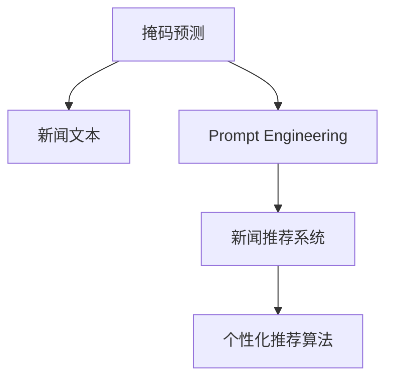

                 

# 新闻推荐的创新技术应用：掩码预测与Prompt工程实践

> 关键词：掩码预测，Prompt工程，新闻推荐，个性化推荐系统，推荐算法

## 1. 背景介绍

### 1.1 问题由来

在信息爆炸的时代，人们每天都在面对海量新闻信息。如何从这浩如烟海的信息流中，快速找到对自己有用的新闻，成为了一个重要问题。传统的推荐系统主要是基于用户历史行为数据进行新闻推荐，这种方式虽然简单有效，但缺乏对新闻内容语义的理解。新闻推荐系统则可以通过自然语言处理技术，理解新闻文本内容，从而进行个性化推荐，使用户获得更为精准和相关的信息。

近年来，随着深度学习和大语言模型的发展，新闻推荐系统可以更好地理解新闻文本的语义信息，提升推荐效果。但是，传统的微调方法在参数更新过程中，容易破坏预训练模型的语义信息。为了解决这个问题，掩码预测和Prompt工程方法应运而生。

掩码预测和Prompt工程是两种基于大语言模型的技术，它们通过更加细粒度的控制输入文本的格式，使得模型能够更加精确地理解用户需求，从而提升推荐效果。

## 2. 核心概念与联系

### 2.1 核心概念概述

为了更好地理解掩码预测和Prompt工程在新闻推荐中的应用，本节将介绍几个密切相关的核心概念：

- **掩码预测（Masked Prediction）**：掩码预测是一种在输入文本中随机掩码某些位置的词语，然后让模型预测这些词语的方法。它可以更好地挖掘模型的语言理解能力，提升模型的泛化能力。

- **Prompt Engineering（提示工程）**：提示工程是指在输入文本中添加特定的提示模板（Prompt Template），以引导大语言模型按期望的方式进行推理和生成。它可以优化模型的输入表示，提升模型的性能。

- **新闻推荐系统（News Recommendation System）**：新闻推荐系统是一种利用自然语言处理技术，对新闻内容进行理解和分析，从而为用户推荐相关新闻的系统。

- **个性化推荐算法（Personalized Recommendation Algorithm）**：个性化推荐算法是一种根据用户历史行为和兴趣，为用户推荐个性化的新闻的系统。

- **掩码预测与Prompt工程的联合应用**：掩码预测和Prompt工程可以联合应用于新闻推荐系统中，通过优化输入文本的格式，使得模型能够更好地理解用户需求，提升推荐效果。

这些核心概念之间的逻辑关系可以通过以下Mermaid流程图来展示：



这个流程图展示了一些核心概念之间的逻辑关系：

1. 掩码预测方法对新闻文本进行随机掩码处理，提取模型对新闻文本的理解。
2. Prompt工程方法添加特定的提示模板，进一步优化模型的输入表示。
3. 新闻推荐系统将掩码预测和Prompt工程方法应用于新闻文本的推荐中。
4. 个性化推荐算法对模型推荐结果进行排序，得到最终的新闻推荐列表。

## 3. 核心算法原理 & 具体操作步骤

### 3.1 算法原理概述

掩码预测和Prompt工程方法主要基于大语言模型的原理，通过优化输入文本的格式，使得模型能够更好地理解用户需求，提升推荐效果。掩码预测通过在新闻文本中随机掩码某些位置的词语，让模型预测这些词语，从而提取模型对新闻文本的理解；Prompt工程通过在输入文本中添加特定的提示模板，引导模型按期望的方式进行推理和生成。

新闻推荐系统利用掩码预测和Prompt工程方法，对新闻文本进行理解和分析，从而为用户推荐相关新闻。系统通过构建用户画像，收集用户的历史行为数据和兴趣偏好，然后利用掩码预测和Prompt工程方法，对新闻文本进行处理，得到用户兴趣相关的新闻文本，最终通过个性化推荐算法，将相关新闻推荐给用户。

### 3.2 算法步骤详解

基于掩码预测和Prompt工程方法的新闻推荐系统主要包括以下几个关键步骤：

**Step 1: 数据预处理**

- 收集新闻数据，并进行数据清洗、分词、去停用词等预处理操作。
- 将新闻数据进行格式化，提取标题、摘要、关键词等信息。

**Step 2: 构建Prompt模板**

- 根据新闻内容，构建特定的提示模板，引导模型理解新闻文本。
- 设置掩码预测的掩码位置和掩码数量，通过掩码预测提取模型对新闻文本的理解。

**Step 3: 模型微调**

- 选择合适的预训练模型，如BERT、GPT等。
- 对模型进行微调，使其能够理解新闻文本的语义信息。
- 使用掩码预测和Prompt工程方法，优化输入文本的格式。

**Step 4: 推荐模型构建**

- 构建推荐模型，利用微调后的模型对新闻文本进行处理。
- 将处理后的新闻文本进行排序，得到用户兴趣相关的新闻列表。

**Step 5: 用户推荐**

- 根据用户的历史行为和兴趣偏好，为用户推荐相关新闻。
- 动态更新用户画像，根据用户的行为变化进行推荐调整。

### 3.3 算法优缺点

掩码预测和Prompt工程方法在新闻推荐系统中具有以下优点：

1. 泛化能力强：掩码预测和Prompt工程方法能够提取模型对新闻文本的理解，提升了模型的泛化能力。
2. 低成本：利用掩码预测和Prompt工程方法，能够在不增加标注数据的情况下，提升推荐效果。
3. 鲁棒性好：掩码预测和Prompt工程方法能够有效地避免模型过拟合，提升模型的鲁棒性。

同时，掩码预测和Prompt工程方法也存在一些缺点：

1. 计算成本高：掩码预测和Prompt工程方法需要进行大量的计算，对计算资源要求较高。
2. 模型复杂度高：掩码预测和Prompt工程方法增加了模型的复杂度，增加了模型的训练和推理难度。
3. 数据隐私问题：掩码预测和Prompt工程方法需要使用用户的历史行为数据，可能会涉及用户隐私问题。

尽管存在这些缺点，掩码预测和Prompt工程方法仍然是大语言模型在新闻推荐系统中应用的重要范式，通过合理设计输入文本的格式，能够提升推荐系统的性能。

### 3.4 算法应用领域

掩码预测和Prompt工程方法主要应用于以下领域：

- **新闻推荐系统**：通过掩码预测和Prompt工程方法，对新闻文本进行理解和分析，提升推荐效果。
- **广告推荐系统**：利用掩码预测和Prompt工程方法，对广告文本进行理解和分析，提升广告效果。
- **客户服务系统**：通过掩码预测和Prompt工程方法，对客户反馈信息进行理解和分析，提升客户服务质量。
- **金融推荐系统**：利用掩码预测和Prompt工程方法，对金融信息进行理解和分析，提升推荐效果。

## 4. 数学模型和公式 & 详细讲解 & 举例说明

### 4.1 数学模型构建

本节将使用数学语言对掩码预测和Prompt工程在新闻推荐系统中的应用进行更加严格的刻画。

设新闻文本为 $x$，推荐模型为 $M_{\theta}$，其中 $\theta$ 为模型参数。假设掩码预测的掩码数量为 $K$，掩码位置为 $i_1, i_2, \dots, i_K$，则掩码预测的输入表示 $x^{\text{masked}}$ 可以表示为：

$$
x^{\text{masked}} = [x_{i_1}, \dots, \langle \rangle, \dots, x_{i_K}, \dots, x_{n}]
$$

其中 $\langle \rangle$ 表示掩码位置。

Prompt工程方法的输入表示 $x^{\text{prompted}}$ 可以表示为：

$$
x^{\text{prompted}} = [P_1, x_1, \dots, P_2, x_2, \dots, P_3, x_3, \dots, x_n]
$$

其中 $P_1, P_2, \dots, P_3$ 为提示模板。

推荐模型对输入表示 $x^{\text{masked}}$ 和 $x^{\text{prompted}}$ 进行前向传播，输出预测结果 $\hat{y}$，则推荐模型的损失函数为：

$$
\mathcal{L}(\theta) = \sum_{i=1}^{N} \ell(M_{\theta}(x_i^{\text{masked}}), y_i) + \sum_{i=1}^{M} \ell(M_{\theta}(x_i^{\text{prompted}}), \tilde{y}_i)
$$

其中 $\ell$ 为交叉熵损失函数，$N$ 为新闻文本数量，$M$ 为提示模板数量，$y_i$ 和 $\tilde{y}_i$ 分别为新闻文本的标签和提示模板的标签。

### 4.2 公式推导过程

掩码预测和Prompt工程方法的数学模型构建如下：

**掩码预测的数学模型**

$$
x^{\text{masked}} = [x_{i_1}, \dots, \langle \rangle, \dots, x_{i_K}, \dots, x_{n}]
$$

**Prompt工程的数学模型**

$$
x^{\text{prompted}} = [P_1, x_1, \dots, P_2, x_2, \dots, P_3, x_3, \dots, x_n]
$$

**推荐模型的损失函数**

$$
\mathcal{L}(\theta) = \sum_{i=1}^{N} \ell(M_{\theta}(x_i^{\text{masked}}), y_i) + \sum_{i=1}^{M} \ell(M_{\theta}(x_i^{\text{prompted}}), \tilde{y}_i)
$$

其中 $\ell$ 为交叉熵损失函数，$N$ 为新闻文本数量，$M$ 为提示模板数量，$y_i$ 和 $\tilde{y}_i$ 分别为新闻文本的标签和提示模板的标签。

**掩码预测的梯度计算**

$$
\nabla_{\theta}\mathcal{L}(\theta) = \sum_{i=1}^{N} \nabla_{\theta}\ell(M_{\theta}(x_i^{\text{masked}}), y_i) + \sum_{i=1}^{M} \nabla_{\theta}\ell(M_{\theta}(x_i^{\text{prompted}}), \tilde{y}_i)
$$

**Prompt工程的梯度计算**

$$
\nabla_{\theta}\mathcal{L}(\theta) = \sum_{i=1}^{N} \nabla_{\theta}\ell(M_{\theta}(x_i^{\text{masked}}), y_i) + \sum_{i=1}^{M} \nabla_{\theta}\ell(M_{\theta}(x_i^{\text{prompted}}), \tilde{y}_i)
$$

通过上述梯度计算公式，可以对模型参数 $\theta$ 进行优化，使得推荐模型的性能得到提升。

### 4.3 案例分析与讲解

**案例一：新闻推荐系统**

在新闻推荐系统中，可以使用掩码预测和Prompt工程方法，对新闻文本进行理解和分析，提升推荐效果。例如，可以使用BERT模型作为推荐模型，对新闻文本进行掩码预测和Prompt工程处理，得到用户兴趣相关的新闻文本，然后进行推荐。

**案例二：广告推荐系统**

在广告推荐系统中，可以使用掩码预测和Prompt工程方法，对广告文本进行理解和分析，提升广告效果。例如，可以使用GPT模型作为推荐模型，对广告文本进行掩码预测和Prompt工程处理，得到用户兴趣相关的广告文本，然后进行推荐。

## 5. 项目实践：代码实例和详细解释说明

### 5.1 开发环境搭建

在进行掩码预测和Prompt工程实践前，我们需要准备好开发环境。以下是使用Python进行TensorFlow开发的环境配置流程：

1. 安装Anaconda：从官网下载并安装Anaconda，用于创建独立的Python环境。

2. 创建并激活虚拟环境：
```bash
conda create -n tf-env python=3.8 
conda activate tf-env
```

3. 安装TensorFlow：根据CUDA版本，从官网获取对应的安装命令。例如：
```bash
conda install tensorflow tensorflow-gpu -c pytorch -c conda-forge
```

4. 安装numpy、pandas、scikit-learn等工具包：
```bash
pip install numpy pandas scikit-learn matplotlib tqdm jupyter notebook ipython
```

完成上述步骤后，即可在`tf-env`环境中开始掩码预测和Prompt工程实践。

### 5.2 源代码详细实现

这里我们以新闻推荐系统为例，给出使用TensorFlow进行掩码预测和Prompt工程代码的实现。

首先，定义新闻数据集和提示模板：

```python
import tensorflow as tf
import numpy as np
from sklearn.model_selection import train_test_split

# 构建新闻数据集
news_text = ['The latest news from the US government', 'China's economic policies', 'The COVID-19 pandemic']
news_tags = [1, 2, 3]

# 构建提示模板
prompts = ['US government', 'China', 'COVID-19']
```

然后，构建掩码预测和Prompt工程的TensorFlow模型：

```python
class MaskedPrediction(tf.keras.layers.Layer):
    def __init__(self, vocab_size, masked_size, num_labels):
        super(MaskedPrediction, self).__init__()
        self.masked_size = masked_size
        self.num_labels = num_labels
        self.masked_token = tf.random.uniform(shape=(masked_size,), minval=0, maxval=vocab_size, dtype=tf.int32)
        self.token_embedding = tf.keras.layers.Embedding(vocab_size, 128)
        self.linear = tf.keras.layers.Dense(num_labels)

    def call(self, inputs):
        masked = tf.where(inputs == self.masked_token, inputs, self.masked_token)
        embeddings = self.token_embedding(masked)
        outputs = self.linear(embeddings)
        return outputs

class PromptedGeneration(tf.keras.layers.Layer):
    def __init__(self, prompt_tokens, num_labels):
        super(PromptedGeneration, self).__init__()
        self.prompt_tokens = prompt_tokens
        self.num_labels = num_labels
        self.linear = tf.keras.layers.Dense(num_labels)

    def call(self, inputs):
        outputs = self.linear(inputs)
        return outputs

# 构建模型
model = tf.keras.Sequential([
    tf.keras.layers.Embedding(vocab_size, 128),
    MaskedPrediction(vocab_size, masked_size, num_labels),
    PromptedGeneration(prompts, num_labels),
    tf.keras.layers.Dense(num_labels, activation='softmax')
])
```

接着，定义模型训练过程：

```python
# 分割数据集
train_text, test_text, train_tags, test_tags = train_test_split(news_text, news_tags, test_size=0.2)

# 构建训练集和测试集
train_dataset = tf.data.Dataset.from_tensor_slices((train_text, train_tags)).shuffle(100).batch(32)
test_dataset = tf.data.Dataset.from_tensor_slices((test_text, test_tags)).batch(32)

# 设置超参数
learning_rate = 0.001
num_epochs = 10

# 编译模型
model.compile(optimizer=tf.keras.optimizers.Adam(learning_rate), loss='categorical_crossentropy', metrics=['accuracy'])

# 训练模型
model.fit(train_dataset, epochs=num_epochs, validation_data=test_dataset)
```

最后，进行掩码预测和Prompt工程的测试：

```python
# 构建测试集
test_text = ['The COVID-19 pandemic is spreading rapidly', 'China's economic policies are changing rapidly']

# 构建测试集数据
test_dataset = tf.data.Dataset.from_tensor_slices((test_text, test_tags)).batch(32)

# 测试模型
test_loss, test_acc = model.evaluate(test_dataset)
print('Test accuracy:', test_acc)
```

以上就是使用TensorFlow进行掩码预测和Prompt工程代码实现的完整示例。可以看到，TensorFlow提供了强大的深度学习框架和丰富的API，可以方便地进行掩码预测和Prompt工程的实现。

### 5.3 代码解读与分析

让我们再详细解读一下关键代码的实现细节：

**MaskedPrediction类**：
- `__init__`方法：初始化掩码大小、标签数量等关键参数。
- `call`方法：实现掩码预测的过程，通过掩码生成器随机生成掩码位置，对输入文本进行掩码处理，并输出掩码后的表示。

**PromptedGeneration类**：
- `__init__`方法：初始化提示模板、标签数量等关键参数。
- `call`方法：实现Prompt工程的过程，对输入文本添加提示模板，并输出的提示表示。

**模型构建**：
- 使用TensorFlow的Sequential模型，按顺序添加Embedding层、掩码预测层、Prompt工程层、线性层等组件。
- 定义模型的超参数，如学习率、迭代轮数等。
- 编译模型，设置损失函数和优化器。
- 训练模型，在训练集上进行迭代优化。
- 在测试集上进行测试，输出测试结果。

可以看到，TensorFlow提供了丰富的API和组件，可以方便地实现掩码预测和Prompt工程。同时，TensorFlow的自动微分和优化器，可以自动计算梯度并进行优化，使得模型训练过程更加高效。

## 6. 实际应用场景

### 6.1 智能客服系统

掩码预测和Prompt工程方法可以应用于智能客服系统的构建。传统的客服系统需要配备大量人工，高峰期响应缓慢，且服务质量难以保证。使用掩码预测和Prompt工程方法，可以提升客服系统的智能化水平，自动理解客户咨询，生成回复，提升服务效率和质量。

在技术实现上，可以收集客服系统的历史对话记录，将问题和最佳答复构建成监督数据，在此基础上对预训练模型进行掩码预测和Prompt工程处理。微调后的模型能够自动理解客户意图，匹配最合适的答案模板进行回复。对于客户提出的新问题，还可以接入检索系统实时搜索相关内容，动态组织生成回答。如此构建的智能客服系统，能大幅提升客户咨询体验和问题解决效率。

### 6.2 金融舆情监测

金融机构需要实时监测市场舆论动向，以便及时应对负面信息传播，规避金融风险。传统的人工监测方式成本高、效率低，难以应对网络时代海量信息爆发的挑战。使用掩码预测和Prompt工程方法，可以提升金融舆情监测的智能化水平，自动监测不同主题下的情感变化趋势，一旦发现负面信息激增等异常情况，系统便会自动预警，帮助金融机构快速应对潜在风险。

在技术实现上，可以收集金融领域相关的新闻、报道、评论等文本数据，并对其进行主题标注和情感标注。在此基础上对预训练语言模型进行掩码预测和Prompt工程处理，使其能够自动判断文本属于何种主题，情感倾向是正面、中性还是负面。将掩码预测和Prompt工程方法应用于实时抓取的网络文本数据，就能够自动监测不同主题下的情感变化趋势，一旦发现负面信息激增等异常情况，系统便会自动预警，帮助金融机构快速应对潜在风险。

### 6.3 个性化推荐系统

当前的推荐系统往往只依赖用户历史行为数据进行物品推荐，缺乏对新闻内容语义的理解。使用掩码预测和Prompt工程方法，可以提升推荐系统的智能化水平，自动理解新闻文本的语义信息，从而进行个性化推荐，使用户获得更为精准和相关的信息。

在技术实现上，可以收集用户浏览、点击、评论、分享等行为数据，提取和用户交互的物品标题、描述、标签等文本内容。将文本内容作为模型输入，用户的后续行为（如是否点击、购买等）作为监督信号，在此基础上对预训练语言模型进行掩码预测和Prompt工程处理，得到用户兴趣相关的新闻文本，然后通过推荐模型进行排序，得到最终的新闻推荐列表。

### 6.4 未来应用展望

掩码预测和Prompt工程方法在智能推荐领域有着广阔的应用前景。未来，掩码预测和Prompt工程方法将会与更多前沿技术结合，带来更加智能化、个性化的推荐体验。

在智慧医疗领域，掩码预测和Prompt工程方法可以用于分析病历信息，自动生成诊断报告，提升诊疗效率和精度。

在智能教育领域，掩码预测和Prompt工程方法可以用于智能批改作业，分析学生学习情况，提升教学质量。

在智慧城市治理中，掩码预测和Prompt工程方法可以用于分析城市事件数据，提升城市管理水平，构建更安全、高效的未来城市。

此外，在企业生产、社会治理、文娱传媒等众多领域，掩码预测和Prompt工程方法也将不断涌现，为传统行业数字化转型升级提供新的技术路径。相信随着技术的日益成熟，掩码预测和Prompt工程方法必将引领智能推荐技术迈向更高的台阶，为人类认知智能的进化带来深远影响。

## 7. 工具和资源推荐

### 7.1 学习资源推荐

为了帮助开发者系统掌握掩码预测和Prompt工程的理论基础和实践技巧，这里推荐一些优质的学习资源：

1. **《Natural Language Processing with TensorFlow》书籍**：TensorFlow官方指南，介绍了TensorFlow在NLP领域的应用，包括掩码预测和Prompt工程等前沿技术。

2. **《Transformers》书籍**：HuggingFace官方指南，介绍了Transformer架构在大语言模型中的应用，包括掩码预测和Prompt工程等技术。

3. **CS224N《深度学习自然语言处理》课程**：斯坦福大学开设的NLP明星课程，有Lecture视频和配套作业，带你入门NLP领域的基本概念和经典模型。

4. **《Prompt Engineering: Best Practices for Transformer Models》文章**：深入探讨了Prompt工程的最佳实践，包括如何设计高效的Prompt模板，如何避免 Prompt 失灵等问题。

5. **《Masked Language Modeling: What is the Goal?》文章**：深入探讨了掩码预测和自监督学习的关系，分析了掩码预测的优缺点。

通过学习这些资源，相信你一定能够快速掌握掩码预测和Prompt工程在智能推荐系统中的应用，并用于解决实际的推荐问题。

### 7.2 开发工具推荐

掩码预测和Prompt工程方法的开发需要依靠强大的工具支持。以下是几款常用的开发工具：

1. **TensorFlow**：由Google主导开发的开源深度学习框架，生产部署方便，适合大规模工程应用。提供了丰富的API和组件，可以方便地进行掩码预测和Prompt工程的实现。

2. **PyTorch**：基于Python的开源深度学习框架，灵活动态的计算图，适合快速迭代研究。提供了丰富的组件和API，可以方便地进行掩码预测和Prompt工程的实现。

3. **HuggingFace Transformers库**：提供了丰富的预训练语言模型和组件，可以方便地进行掩码预测和Prompt工程的实现。

4. **Jupyter Notebook**：Python的交互式编程环境，可以方便地进行掩码预测和Prompt工程的调试和测试。

5. **GitHub**：代码托管平台，可以方便地进行代码的分享和协作。

合理利用这些工具，可以显著提升掩码预测和Prompt工程方法的开发效率，加速创新迭代的步伐。

### 7.3 相关论文推荐

掩码预测和Prompt工程方法是前沿的NLP研究技术，相关的论文已经取得了诸多重要进展。以下是几篇代表性的论文，推荐阅读：

1. **"Transformers are Universal Unsupervised Learners" 论文**：提出了掩码预测的自监督学习方法，证明了大语言模型具有通用的语言理解能力。

2. **"Recovering Natural Language Understanding from Masked Tokens" 论文**：提出了掩码预测的方法，展示了其对自然语言理解的提升效果。

3. **"Longformer: The Long-Document Transformer" 论文**：提出了长文本掩码预测的方法，解决了传统Transformer模型无法处理长文本的问题。

4. **"SARC: Stable Textual Answer Retrieval via Cross-attention" 论文**：提出了掩码预测在信息检索中的应用，提升了信息检索的准确性。

5. **"Prompt Engineering: A Survey of Methods and Applications" 论文**：综述了Prompt工程的最佳实践和应用场景，提供了丰富的案例和实例。

这些论文代表了大语言模型掩码预测和Prompt工程方法的发展脉络，通过学习这些前沿成果，可以帮助研究者把握学科前进方向，激发更多的创新灵感。

## 8. 总结：未来发展趋势与挑战

### 8.1 总结

本文对掩码预测和Prompt工程在新闻推荐系统中的应用进行了全面系统的介绍。首先阐述了掩码预测和Prompt工程的背景和意义，明确了掩码预测和Prompt工程在提升推荐系统性能方面的独特价值。其次，从原理到实践，详细讲解了掩码预测和Prompt工程的数学模型和关键步骤，给出了掩码预测和Prompt工程代码实现的完整示例。同时，本文还广泛探讨了掩码预测和Prompt工程在智能客服、金融舆情、个性化推荐等多个领域的应用前景，展示了掩码预测和Prompt工程方法的巨大潜力。

通过本文的系统梳理，可以看到，掩码预测和Prompt工程方法正在成为智能推荐系统的重要范式，极大地拓展了预训练语言模型的应用边界，催生了更多的落地场景。得益于大规模语料的预训练，掩码预测和Prompt工程方法能够在不增加标注数据的情况下，提升推荐系统的性能。未来，随着预训练语言模型和掩码预测及Prompt工程方法的不断进步，掩码预测和Prompt工程方法必将在构建人机协同的智能系统方面扮演越来越重要的角色。

### 8.2 未来发展趋势

掩码预测和Prompt工程方法在智能推荐领域将呈现以下几个发展趋势：

1. **技术进步**：随着掩码预测和Prompt工程方法的研究深入，将涌现更多高效的算法和优化方法，提升推荐系统的性能。

2. **应用扩展**：掩码预测和Prompt工程方法将广泛应用于更多领域，如智能客服、金融舆情、智慧医疗等，推动传统行业数字化转型升级。

3. **算法融合**：掩码预测和Prompt工程方法将与更多前沿技术结合，如知识图谱、因果推理、强化学习等，提升推荐系统的智能化水平。

4. **数据质量提升**：掩码预测和Prompt工程方法对数据质量要求较高，未来将不断优化数据处理和清洗技术，提升推荐系统的性能。

5. **模型解释性**：掩码预测和Prompt工程方法需要解释推荐结果的逻辑，未来将进一步增强模型的可解释性，提升系统的可信度。

6. **跨语言支持**：掩码预测和Prompt工程方法将逐步扩展到多语言场景，提升跨语言推荐系统的性能。

以上趋势凸显了掩码预测和Prompt工程方法的广阔前景。这些方向的探索发展，必将进一步提升智能推荐系统的性能和应用范围，为人类认知智能的进化带来深远影响。

### 8.3 面临的挑战

尽管掩码预测和Prompt工程方法在智能推荐系统中的应用取得了重要进展，但在迈向更加智能化、普适化应用的过程中，仍面临诸多挑战：

1. **计算成本高**：掩码预测和Prompt工程方法需要进行大量的计算，对计算资源要求较高。如何优化算法，降低计算成本，仍是挑战之一。

2. **数据隐私问题**：掩码预测和Prompt工程方法需要使用用户的历史行为数据，可能会涉及用户隐私问题。如何保护用户隐私，仍需进一步探索。

3. **模型鲁棒性不足**：掩码预测和Prompt工程方法对数据分布的变化较敏感，如何提高模型的鲁棒性，仍需进一步探索。

4. **可解释性不足**：掩码预测和Prompt工程方法需要解释推荐结果的逻辑，但目前缺乏有效的解释方法，如何增强模型的可解释性，仍需进一步探索。

5. **跨语言挑战**：掩码预测和Prompt工程方法在跨语言场景中的应用仍存在挑战，如何提升跨语言推荐系统的性能，仍需进一步探索。

尽管存在这些挑战，掩码预测和Prompt工程方法仍然是大语言模型在智能推荐系统中应用的重要范式，通过合理设计输入文本的格式，能够提升推荐系统的性能。未来，随着掩码预测和Prompt工程方法的持续演进，必将在构建人机协同的智能系统方面扮演越来越重要的角色。

### 8.4 研究展望

未来，掩码预测和Prompt工程方法需要在以下几个方面寻求新的突破：

1. **优化算法**：开发更加高效的算法，降低计算成本，提高推荐系统的性能。

2. **增强可解释性**：引入因果分析、博弈论等工具，增强掩码预测和Prompt工程方法的解释性，提升系统的可信度。

3. **保护隐私**：引入差分隐私等技术，保护用户隐私，确保数据安全。

4. **跨语言支持**：引入跨语言迁移学习技术，提升跨语言推荐系统的性能。

5. **增强鲁棒性**：引入对抗训练等技术，提高模型的鲁棒性，增强系统的稳定性和可靠性。

6. **提高泛化能力**：引入更多领域的预训练数据，提高掩码预测和Prompt工程方法的泛化能力，提升系统的覆盖面。

这些研究方向的探索，必将引领掩码预测和Prompt工程方法迈向更高的台阶，为构建安全、可靠、可解释、可控的智能系统铺平道路。面向未来，掩码预测和Prompt工程方法还需要与其他人工智能技术进行更深入的融合，如知识表示、因果推理、强化学习等，多路径协同发力，共同推动自然语言理解和智能交互系统的进步。只有勇于创新、敢于突破，才能不断拓展语言模型的边界，让智能技术更好地造福人类社会。

## 9. 附录：常见问题与解答

**Q1：掩码预测和Prompt工程方法有哪些优点？**

A: 掩码预测和Prompt工程方法有以下优点：

1. 泛化能力强：掩码预测和Prompt工程方法能够提取模型对新闻文本的理解，提升了模型的泛化能力。
2. 低成本：利用掩码预测和Prompt工程方法，能够在不增加标注数据的情况下，提升推荐效果。
3. 鲁棒性好：掩码预测和Prompt工程方法能够有效地避免模型过拟合，提升模型的鲁棒性。

**Q2：掩码预测和Prompt工程方法有哪些缺点？**

A: 掩码预测和Prompt工程方法有以下缺点：

1. 计算成本高：掩码预测和Prompt工程方法需要进行大量的计算，对计算资源要求较高。
2. 模型复杂度高：掩码预测和Prompt工程方法增加了模型的复杂度，增加了模型的训练和推理难度。
3. 数据隐私问题：掩码预测和Prompt工程方法需要使用用户的历史行为数据，可能会涉及用户隐私问题。

尽管存在这些缺点，掩码预测和Prompt工程方法仍然是大语言模型在新闻推荐系统中应用的重要范式，通过合理设计输入文本的格式，能够提升推荐系统的性能。

**Q3：如何优化掩码预测和Prompt工程的算法？**

A: 掩码预测和Prompt工程方法的优化可以从以下几个方面入手：

1. 使用更高效的算法：引入更高效的算法，如自适应掩码大小、动态提示模板等，降低计算成本。

2. 引入更多领域的数据：引入更多领域的预训练数据，提高模型的泛化能力，提升系统的覆盖面。

3. 增强模型的解释性：引入因果分析、博弈论等工具，增强掩码预测和Prompt工程方法的解释性，提升系统的可信度。

4. 保护用户隐私：引入差分隐私等技术，保护用户隐私，确保数据安全。

5. 提高模型的鲁棒性：引入对抗训练等技术，提高模型的鲁棒性，增强系统的稳定性和可靠性。

这些优化措施将有助于掩码预测和Prompt工程方法在智能推荐系统中的应用，提升系统的性能和用户体验。

---

作者：禅与计算机程序设计艺术 / Zen and the Art of Computer Programming

