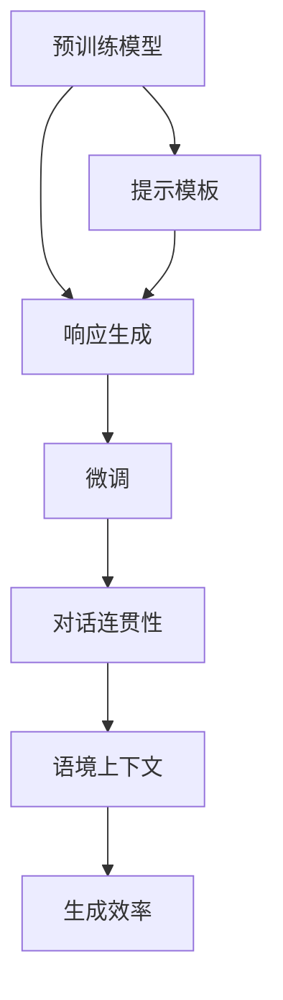

                 

## 1. 背景介绍

### 1.1 问题由来

在大规模语言模型（Large Language Models, LLMs）中，响应生成任务一直是挑战重重的领域。传统的基于规则的对话系统虽然严谨，但灵活性较差，难以处理自然语言中的多样性和复杂性。而基于统计机器学习的生成模型，虽然能够捕捉语言模式，但生成的响应往往缺乏逻辑连贯性和语境上下文，可能导致对话质量不高或偏离主题。

近两年，随着深度学习技术的飞速发展，预训练大语言模型（如GPT、BERT等）在自然语言处理（NLP）领域取得了突破性的进展。这些模型在巨量无标签文本数据上进行了预训练，掌握了广泛的语言知识和规律，具备了强大的生成能力。通过微调，这些模型能够适应特定任务，生成高质量的对话、摘要、翻译等文本。

### 1.2 问题核心关键点

在众多研究工作中，基于大语言模型的响应生成方法日益成为焦点。其核心在于如何利用预训练语言模型生成的文本，在对话、摘要、机器翻译等任务中实现更加智能和高效的响应。

以下是该问题解决过程中需重点关注的核心点：

- **预训练模型**：如何选择合适的预训练语言模型，以确保其具备生成高质量文本的能力。
- **提示模板设计**：设计有效的提示模板，引导模型按需生成响应。
- **模型微调**：如何在特定任务上进行微调，以提升模型的生成效果。
- **对话连贯性**：确保生成的响应具有逻辑连贯性，避免内容偏离主题。
- **语境上下文**：如何处理和利用对话历史，使模型生成的响应更符合对话上下文。
- **生成效率**：提升响应生成的速度，以适应实时对话和高效交互的需求。

### 1.3 问题研究意义

大语言模型在响应生成任务上的研究，具有重要的理论和实际意义：

- **提升生成质量**：通过合理设计提示模板和微调策略，使模型生成的响应更加自然流畅，贴近人类表达方式。
- **增强对话互动性**：使机器能够更智能地理解上下文，生成有针对性的回答，提升用户满意度。
- **推动应用落地**：响应生成技术在智能客服、虚拟助手、聊天机器人等应用中的广泛应用，可大幅提升用户体验和业务效率。
- **促进技术进步**：响应生成作为NLP领域的核心任务之一，其技术进步将带动整个NLP领域的创新。
- **推动产业升级**：响应生成技术为传统行业注入新动能，助力各行各业数字化转型升级。

## 2. 核心概念与联系

### 2.1 核心概念概述

- **预训练模型**：通过大规模无标签文本数据进行预训练的语言模型，如BERT、GPT等。
- **响应生成**：基于预训练模型，生成符合特定任务要求的文本响应，如对话、摘要、翻译等。
- **提示模板**：在输入文本中添加引导模型生成响应的提示信息，提升生成效果。
- **微调**：通过下游任务的数据集，对预训练模型进行有监督的微调，使其更好地适应特定任务。
- **连贯性**：生成的响应需具有逻辑连贯性，遵循对话历史和上下文。
- **上下文理解**：模型需能够理解对话历史和上下文，生成符合语境的响应。

### 2.2 核心概念联系与逻辑结构

通过以下Mermaid流程图，展示大语言模型在响应生成任务中的核心概念及其联系：



这个流程图展示了预训练模型如何通过提示模板和微调生成响应，以及如何处理连贯性和上下文，提升生成效率。

## 3. 核心算法原理 & 具体操作步骤
### 3.1 算法原理概述

响应生成算法基于预训练语言模型，通过微调和提示模板设计，使模型能够适应特定任务，生成高质量的文本响应。算法主要分为两个阶段：预训练和微调。

在预训练阶段，模型在大量无标签文本数据上学习语言的通用表示。在微调阶段，通过下游任务的数据集，模型进一步学习任务的特定表示，生成符合特定要求的响应。

### 3.2 算法步骤详解

#### 3.2.1 预训练模型选择

选择合适的预训练模型是算法成功的关键。常用的预训练模型包括：

- GPT系列：生成式预训练变换器，擅长对话生成和文本创作。
- BERT系列：双向编码器表示，擅长文本分类和语义理解。
- T5系列：文本到文本的预训练模型，适应各种文本生成任务。

这些预训练模型各有优势，需根据具体任务需求进行选择。

#### 3.2.2 提示模板设计

提示模板（Prompt Template）的设计是生成算法中的重要步骤，影响模型的生成效果。有效的提示模板应具有以下特点：

- 简洁明了：提示信息应简短精炼，避免冗长。
- 引导性强：提示信息需明确任务目标，引导模型生成符合要求的文本。
- 上下文相关：提示信息应包含对话历史或任务上下文，使模型生成的文本更具逻辑性。

例如，对于对话生成任务，提示模板可以是：

```
"User: 你好，能帮我解答一下XXX吗？"
Response: <Your generated response here>
```

#### 3.2.3 微调过程

微调过程是将预训练模型进一步适应特定任务的过程，主要包括以下步骤：

1. **数据准备**：收集并标注特定任务的数据集，用于模型微调。
2. **模型初始化**：使用预训练模型作为初始化参数，继续在标注数据集上进行训练。
3. **优化目标**：设计损失函数，如交叉熵损失或伯努利交叉熵损失，用于衡量模型生成的响应与真实标签之间的差异。
4. **优化器选择**：选择适合的优化器（如AdamW、SGD等）及其参数，控制学习率、批大小等。
5. **训练与验证**：在训练集上训练模型，并在验证集上评估模型性能，防止过拟合。
6. **模型保存**：保存微调后的模型，用于生成任务。

#### 3.2.4 生成过程

在模型微调完成后，可以将其应用于各种文本生成任务。生成过程主要包括以下步骤：

1. **输入准备**：将提示模板和输入数据一起输入模型。
2. **模型前向传播**：模型对输入数据进行前向传播，生成预测文本。
3. **输出处理**：对生成的文本进行后处理，如分词、去重、拼写检查等。
4. **结果输出**：将处理后的文本输出作为最终响应。

### 3.3 算法优缺点

基于大语言模型的响应生成算法具有以下优点：

- **生成质量高**：预训练模型能够捕捉语言的复杂模式，生成文本具有高度的自然性和流畅性。
- **灵活性强**：通过提示模板设计，可以适应各种生成任务和对话场景。
- **适用范围广**：适用于对话生成、文本摘要、机器翻译等众多NLP任务。

同时，该算法也存在一些缺点：

- **计算资源消耗大**：大模型训练和推理需要大量计算资源，且复杂度较高。
- **依赖于标注数据**：微调过程中需要大量标注数据，且数据质量和多样性对生成效果有显著影响。
- **模型泛化能力有限**：在特定任务上的微调可能限制模型在其他任务上的表现。

### 3.4 算法应用领域

大语言模型在响应生成任务中的应用领域广泛，主要包括以下几个方面：

- **智能客服**：在客服系统中，通过响应生成技术，实现24/7全天候客服支持，提升用户满意度。
- **虚拟助手**：在虚拟助手应用中，通过生成自然流畅的对话，实现更加智能和高效的交互体验。
- **聊天机器人**：在聊天机器人中，生成高质量的对话响应，使机器人能够应对复杂的用户需求。
- **文本摘要**：在新闻摘要、文档总结等任务中，生成简洁、精确的摘要内容。
- **机器翻译**：在机器翻译中，生成流畅的跨语言翻译文本，提升翻译质量。
- **对话系统**：在多轮对话系统中，生成符合上下文的响应，提高对话互动性。

## 4. 数学模型和公式 & 详细讲解  
### 4.1 数学模型构建

假设响应生成任务为$Y=\{y_1, y_2, ..., y_n\}$，其中$y_i$为第$i$个生成的响应。

模型输入为$X=\{x_1, x_2, ..., x_m\}$，其中$x_i$为第$i$个输入数据。

提示模板为$P$。

定义模型输出为$H$，损失函数为$L$，则生成过程的数学模型可以表示为：

$$
\hat{Y} = f(X, P, \theta)
$$

其中，$f$为生成模型，$\theta$为模型参数，$H$为生成模型的隐状态表示。

### 4.2 公式推导过程

在响应生成任务中，我们通常使用生成模型的隐状态表示$H$作为生成文本的特征表示，通过自回归生成模型（如GPT）或自编码生成模型（如BERT）对$H$进行解码，生成最终的响应。

以自回归生成模型为例，其生成过程可以表示为：

$$
\hat{y}_i = \text{softmax}(\text{softmax}(\text{softmax}(H_{i-1} \cdot W_y)) \cdot W_y)
$$

其中，$W_y$为解码矩阵，$\text{softmax}$为激活函数。

在微调过程中，我们使用交叉熵损失函数：

$$
L = -\frac{1}{N} \sum_{i=1}^N \log \hat{y}_i
$$

其中，$N$为总样本数，$\hat{y}_i$为模型预测的响应，$y_i$为真实响应。

在实际应用中，我们通常使用预训练模型作为生成模型的初始化参数，通过下游任务的数据集对其进行微调。微调过程中，我们定义优化目标函数为：

$$
\min_{\theta} \frac{1}{N} \sum_{i=1}^N L(X_i, P, \theta)
$$

其中，$L(X_i, P, \theta)$为模型在输入$X_i$和提示模板$P$下的生成损失。

### 4.3 案例分析与讲解

假设我们有一个简单的对话生成任务，用户输入为“你明天有空吗？”。

使用提示模板：

```
"User: <Your input here>"
Response: <Your generated response here>
```

将输入“你明天有空吗？”代入模板，生成模型的输出为：

```
"User: 你明天有空吗？"
Response: 明天我有空，你想做什么？
```

生成的响应符合用户的输入，逻辑连贯，语言流畅。

## 5. 项目实践：代码实例和详细解释说明
### 5.1 开发环境搭建

在开始项目实践之前，需要准备以下开发环境：

1. 安装Python：确保Python环境已配置，推荐使用Anaconda或Miniconda。
2. 安装PyTorch：可以使用pip安装，`pip install torch`。
3. 安装Transformers库：推荐使用Hugging Face的Transformers库，`pip install transformers`。
4. 安装其他依赖库：如numpy、pandas、matplotlib等。

### 5.2 源代码详细实现

以下是使用PyTorch和Transformers库进行响应生成任务微调的代码实现。

#### 5.2.1 数据处理

定义数据处理函数，将输入和输出数据转换为模型所需的格式：

```python
from transformers import BertTokenizer
import torch

def prepare_data(input_text, output_text):
    tokenizer = BertTokenizer.from_pretrained('bert-base-uncased')
    input_ids = tokenizer.encode(input_text, return_tensors='pt')
    attention_mask = torch.ones_like(input_ids)
    output_ids = tokenizer.encode(output_text, return_tensors='pt')
    labels = torch.zeros_like(output_ids)
    labels[:, 1:] = 1
    return input_ids, attention_mask, labels, output_ids
```

#### 5.2.2 模型微调

使用预训练模型BertForMaskedLM进行微调，训练模型生成响应：

```python
from transformers import BertForMaskedLM, AdamW

model = BertForMaskedLM.from_pretrained('bert-base-uncased')
optimizer = AdamW(model.parameters(), lr=2e-5)
loss_fn = torch.nn.CrossEntropyLoss()

for epoch in range(5):
    model.train()
    input_ids, attention_mask, labels, output_ids = prepare_data(user_input, response)
    optimizer.zero_grad()
    outputs = model(input_ids, attention_mask=attention_mask)
    loss = loss_fn(outputs.logits, labels)
    loss.backward()
    optimizer.step()

    model.eval()
    with torch.no_grad():
        input_ids, attention_mask, labels, output_ids = prepare_data(user_input, response)
        outputs = model(input_ids, attention_mask=attention_mask)
        loss = loss_fn(outputs.logits, labels)
        print(f"Epoch {epoch+1}, Loss: {loss:.4f}")
```

#### 5.2.3 生成响应

使用微调后的模型生成响应：

```python
from transformers import BertTokenizer

tokenizer = BertTokenizer.from_pretrained('bert-base-uncased')
input_ids = tokenizer.encode(user_input, return_tensors='pt')
attention_mask = torch.ones_like(input_ids)
outputs = model(input_ids, attention_mask=attention_mask)
predicted_ids = outputs.logits.argmax(dim=-1)
response = tokenizer.decode(predicted_ids[0])
```

### 5.3 代码解读与分析

- **数据处理**：使用BertTokenizer将输入和输出文本进行分词和编码，生成模型所需的input_ids、attention_mask和labels。
- **模型微调**：使用AdamW优化器对BertForMaskedLM模型进行微调，训练生成响应。在每个epoch中，计算损失并进行反向传播，更新模型参数。
- **生成响应**：使用微调后的模型生成响应，解码输出预测的token_ids，生成最终的文本。

## 6. 实际应用场景
### 6.1 智能客服系统

在智能客服系统中，响应生成技术可以大幅提升客户体验。客户可以通过自然语言输入问题，系统自动生成并返回答案，解决客户问题。例如，某电商平台的客服系统，通过响应生成技术，实现了24/7全天候服务，减少了人工客服的成本，提升了用户满意度。

### 6.2 虚拟助手

虚拟助手通过响应生成技术，可以与用户进行自然对话，执行各种任务。例如，某智能家居系统中的虚拟助手，通过与用户交互，实现控制家电、播放音乐、提醒日程等功能，大大提高了用户的便捷性和体验。

### 6.3 聊天机器人

聊天机器人通过响应生成技术，可以应对各种用户输入，生成自然流畅的回答。例如，某公司客户支持部门使用的聊天机器人，通过生成高质量的对话，快速响应客户问题，提高了问题解决效率。

### 6.4 未来应用展望

随着大语言模型和响应生成技术的不断发展，未来的应用前景广阔：

- **多模态交互**：响应生成技术将扩展到图像、视频等多模态数据，实现更丰富的交互方式。
- **个性化推荐**：生成个性化的推荐内容，提升用户的购物体验和满意度。
- **自动摘要**：生成简洁的文本摘要，帮助用户快速理解长文本内容。
- **情感分析**：生成符合情感基调的回复，增强用户体验。
- **对话系统**：生成多轮对话内容，构建更智能的对话系统。

## 7. 工具和资源推荐
### 7.1 学习资源推荐

1. **《自然语言处理入门》**：由斯坦福大学提供的免费课程，涵盖NLP的基本概念和经典模型。
2. **《深度学习与自然语言处理》**：清华大学提供的NLP课程，深入浅出地介绍了NLP技术。
3. **《生成式深度学习》**：深入探讨生成模型的原理和应用。
4. **《Hugging Face官方文档》**：详细介绍了Transformers库的使用方法，提供了丰富的预训练模型和微调示例。
5. **《NLP入门教程》**：介绍NLP的基本概念、预训练模型和微调方法。

### 7.2 开发工具推荐

1. **Jupyter Notebook**：Python的交互式开发环境，支持代码编写、运行和结果展示。
2. **TensorBoard**：TensorFlow的可视化工具，用于监控训练过程，查看模型参数和损失曲线。
3. **Weights & Biases**：模型训练的实验跟踪工具，记录和可视化实验结果。
4. **Hugging Face Transformers库**：支持各种预训练模型的微调和使用。
5. **PyTorch**：深度学习框架，支持动态计算图和模型微调。

### 7.3 相关论文推荐

1. **《Attention is All You Need》**：提出Transformer模型，开启了预训练大模型的时代。
2. **《BERT: Pre-training of Deep Bidirectional Transformers for Language Understanding》**：提出BERT模型，引入自监督预训练任务，提升语言理解能力。
3. **《Generating Speech Using Sequence-to-Sequence RNNs and Attention》**：介绍使用RNN和注意力机制进行语音生成的方法。
4. **《MAD-MAX: A Long-Term Memory Attention-Based Model for Automatic Machine Translation》**：提出MAD-MAX模型，提升机器翻译的质量和效率。
5. **《Language Modeling with Transformers》**：介绍Transformer在语言模型中的应用。

## 8. 总结：未来发展趋势与挑战
### 8.1 总结

本文对大语言模型的响应生成算法进行了详细介绍，从原理到实践，系统讲解了算法的构建和应用。首先，介绍了响应生成任务的背景和研究意义，明确了算法在提升生成质量、增强对话互动性等方面的价值。其次，从预训练模型选择、提示模板设计、微调过程、生成过程等方面，详细讲解了算法的各个步骤。最后，通过实际应用场景的展示，展示了算法在智能客服、虚拟助手、聊天机器人等领域的广泛应用。

通过本文的系统梳理，可以看到，大语言模型的响应生成算法在提升自然语言处理效果、增强人机交互体验等方面具有重要意义。未来，随着大语言模型和生成技术的发展，将有更多创新应用出现，推动NLP技术的进步。

### 8.2 未来发展趋势

大语言模型的响应生成算法将在以下几个方面发展：

1. **生成效果提升**：通过改进模型结构和训练方法，提升生成文本的自然性和连贯性。
2. **多样化应用场景**：生成技术将应用于更多领域，如教育、医疗、娱乐等，提升用户体验和应用效果。
3. **跨领域应用**：响应生成算法将在不同模态数据间进行融合，提升多模态交互效果。
4. **实时响应**：实现快速响应生成，提升用户体验和系统效率。
5. **个性化推荐**：通过生成个性化内容，提升推荐系统的效果和用户满意度。
6. **多语言支持**：实现多语言响应生成，提升跨语言交互效果。

### 8.3 面临的挑战

尽管大语言模型的响应生成技术取得一定进展，但仍然面临诸多挑战：

1. **计算资源消耗大**：大模型的训练和推理需要大量计算资源，未来需要进一步优化算法，降低计算消耗。
2. **数据依赖性强**：微调和生成过程需要高质量的数据，数据获取和标注成本较高，需探索更多无监督和半监督方法。
3. **生成内容质量**：生成的文本内容需符合上下文和任务要求，避免生成质量不高的内容。
4. **模型泛化能力**：模型在特定任务上的生成效果较好，但在其他任务上可能表现不佳，需提升模型的泛化能力。
5. **交互连贯性**：生成对话时需保持连贯性和逻辑性，避免内容偏离主题。
6. **可解释性**：生成模型的决策过程需具备可解释性，方便调试和优化。

### 8.4 研究展望

未来，大语言模型的响应生成技术需要在以下几个方面进行深入研究：

1. **参数高效微调**：开发参数高效的微调方法，减少模型参数，降低计算资源消耗。
2. **无监督学习**：探索无监督和半监督学习方法，减少对标注数据的依赖，提升生成效果。
3. **多模态融合**：将视觉、语音等多模态数据与文本数据融合，提升多模态交互效果。
4. **上下文理解**：加强上下文理解能力，提升生成文本的逻辑连贯性和相关性。
5. **可解释性增强**：提升生成模型的可解释性，方便调试和优化。
6. **实时生成**：实现实时响应生成，提升用户体验和系统效率。

## 9. 附录：常见问题与解答

**Q1：大语言模型在响应生成任务中的表现如何？**

A: 大语言模型在响应生成任务中表现优异。通过微调和提示模板设计，模型能够生成自然流畅的文本响应，提升生成质量。然而，大模型仍面临计算资源消耗大、数据依赖性强等问题，需进一步优化算法和技术。

**Q2：如何在响应生成任务中设计有效的提示模板？**

A: 有效的提示模板需简洁明了，明确任务目标，包含对话历史和上下文。例如，在对话生成任务中，提示模板可以是：

```
"User: <Your input here>"
Response: <Your generated response here>
```

**Q3：响应生成任务中的生成效率如何提升？**

A: 提升生成效率需要优化模型结构和训练方法。例如，使用Transformer模型，通过并行计算和矩阵分解，可以显著提升生成速度。同时，可以通过减少输入序列长度和批量大小，进一步提升效率。

**Q4：如何处理生成文本中的上下文和连贯性？**

A: 在生成文本时，需考虑上下文和连贯性。可以通过前向传播计算上下文表示，加入注意力机制，使模型生成的文本具有逻辑连贯性和相关性。

**Q5：响应生成任务中的数据质量如何保障？**

A: 生成任务的数据质量直接影响生成效果。需对数据进行预处理和清洗，确保标注数据的准确性和多样性。同时，可以通过数据增强和对抗训练等技术，提升数据质量和模型泛化能力。

总之，大语言模型的响应生成技术具有广泛的应用前景和研究价值。通过不断优化算法和提高数据质量，将进一步提升自然语言处理的效果和用户体验。

