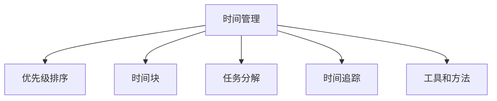

                 

## 1. 背景介绍

### 1.1 问题由来
在当今快速变化、高度竞争的工作环境中，时间管理变得比以往任何时候都更加重要。个人和团队面临的任务越来越复杂，多任务处理的场景也越来越多，时间成为最宝贵的资源。如何高效利用时间，提升个人和团队的总体生产力，成为现代管理和生产中的关键问题。时间管理不仅能优化个人工作效率，还能有效提升团队协作效果，在企业中具有广泛的应用价值。

### 1.2 问题核心关键点
时间管理的关键在于有效地规划和执行各项任务，将有限的资源（时间）合理分配到各个环节，从而最大化产出。具体来说，以下几个核心问题需要考虑：

1. **时间规划**：如何根据优先级和时间约束，合理分配工作任务和时间段。
2. **任务分解**：如何将复杂任务分解成更小、更易于管理的子任务。
3. **时间追踪**：如何记录和管理时间的使用情况，以便及时调整和优化。
4. **资源协调**：如何协调团队成员的时间，确保项目按时完成。
5. **效率提升**：如何通过工具和策略提升个人和团队的工作效率。

## 2. 核心概念与联系

### 2.1 核心概念概述

为了更好地理解时间管理的本质，本节将介绍几个关键概念：

- **时间管理**：指的是计划和控制时间的使用，以提高工作效率和个人满意度。时间管理的目标是使个人和团队能够高效地完成任务，同时保持健康的工作-生活平衡。

- **优先级排序**：通过确定任务的紧急性和重要性，对任务进行排序，确保重要且紧急的任务优先完成。

- **时间块**：将一天分割成多个时间块，每个时间块专注于特定任务或类型的工作。

- **任务分解**：将复杂的任务分解成更小、更具体的步骤，便于管理和执行。

- **时间追踪**：记录和分析时间的实际使用情况，以便优化和改进时间管理策略。

- **工具和方法**：如GTD(Getting Things Done)、OKR(Objectives and Key Results)、番茄工作法等，是帮助实现高效时间管理的有效工具和方法。

### 2.2 核心概念原理和架构的 Mermaid 流程图



这个流程图展示了时间管理的核心概念及其关系：

1. 时间管理从整体上规划和控制时间的使用。
2. 优先级排序帮助确定任务的执行顺序。
3. 时间块和任务分解使任务更加可控和易于执行。
4. 时间追踪提供对时间使用情况的记录和分析。
5. 工具和方法提供具体的时间管理技巧和策略。

## 3. 核心算法原理 & 具体操作步骤

### 3.1 算法原理概述

时间管理的核心算法通常基于以下几个关键步骤：

1. **任务定义**：将工作任务具体化，明确任务的目标和要求。
2. **时间估算**：评估完成任务所需的时间，进行时间规划。
3. **优先级排序**：基于任务的紧急性和重要性，对任务进行排序。
4. **时间块划分**：将工作时间划分为多个时间块，每个时间块专注于特定任务。
5. **任务执行**：按照时间块安排，执行任务。
6. **时间追踪与反馈**：记录任务执行情况，并根据反馈调整计划。

### 3.2 算法步骤详解

下面详细讲解时间管理的算法步骤：

#### 步骤1：任务定义

首先需要明确任务的具体目标和要求。将任务定义得越明确，就越容易评估其所需的时间和资源。

#### 步骤2：时间估算

评估每个任务所需的时间，包括完成时间、复习时间等。时间估算需要结合个人和团队的工作效率、复杂度等因素进行。

#### 步骤3：优先级排序

基于任务的紧急性和重要性，对任务进行排序。常用的优先级排序方法包括：

- **四象限法则**：将任务分为四类，紧急且重要、紧急但不重要、重要但不紧急、不重要且不紧急。优先完成紧急且重要的任务。
- **Eisenhower矩阵**：基于任务的紧急性和重要性，将任务分为四类，并根据优先级安排任务执行。

#### 步骤4：时间块划分

将一天的时间划分为多个时间块，每个时间块专注于特定任务或类型的工作。例如：

- **上午9-12点**：处理优先级高的任务。
- **下午1-4点**：进行深入研究和开发。
- **下午5点后**：处理邮件、会议等低优先级任务。

#### 步骤5：任务执行

按照时间块的安排，执行任务。可以使用番茄工作法（25分钟专注工作，5分钟休息）来提升专注度和效率。

#### 步骤6：时间追踪与反馈

记录任务执行情况，并根据反馈调整计划。可以使用时间追踪工具（如Toggl、RescueTime等）来记录和分析时间的使用情况。

### 3.3 算法优缺点

时间管理的算法具有以下优点：

1. **提升效率**：通过合理规划和执行任务，提升整体工作效率。
2. **减少压力**：明确的任务和优先级排序，减少不确定性和压力。
3. **提高生活质量**：合理的时间安排有助于保持工作-生活平衡。

同时，该算法也存在一定的局限性：

1. **难以应对突发情况**：时间块划分和任务执行可能会被突发事件打乱。
2. **过度依赖计划**：如果计划不合理或无法完全预测，可能会导致时间浪费。
3. **灵活性不足**：某些任务可能需要更灵活的处理方式，时间块划分可能不适用。

### 3.4 算法应用领域

时间管理不仅适用于个人时间规划，也广泛应用于团队协作和管理。在企业中，时间管理可以：

1. **项目管理**：通过时间管理提升项目交付效率，确保项目按时完成。
2. **人力资源管理**：合理分配团队成员的时间，优化人力资源利用。
3. **业务流程优化**：通过时间管理优化业务流程，提升企业运营效率。

## 4. 数学模型和公式 & 详细讲解 & 举例说明

### 4.1 数学模型构建

时间管理可以抽象为线性规划问题，目标是最大化总任务完成量。假设任务集合为 $T=\{t_1, t_2, ..., t_n\}$，每个任务 $t_i$ 的时间需求为 $d_i$，优先级为 $p_i$，则时间管理的数学模型为：

$$
\max \sum_{i=1}^{n} p_i
$$

$$
\text{Subject to} \quad \sum_{i=1}^{n} t_i \leq T \quad (T: 总可用时间)
$$

$$
t_i \geq 0 \quad (\forall i \in \{1, 2, ..., n\})
$$

其中 $t_i$ 为分配给任务 $t_i$ 的时间，$T$ 为总可用时间。

### 4.2 公式推导过程

该线性规划问题可以使用单纯形法(Simplex Algorithm)或匈牙利算法(Hungarian Algorithm)等求解。以匈牙利算法为例，步骤如下：

1. **初始化**：构建初始可行解，将任务按优先级排序，按优先级分配时间。
2. **迭代优化**：求解增广矩阵，迭代计算最优解。
3. **终止条件**：当增广矩阵的系数矩阵为单位矩阵时，迭代停止。

### 4.3 案例分析与讲解

假设某项目经理每天工作8小时，需要完成3个任务 $T=\{t_1, t_2, t_3\}$，每个任务的时间需求为 $d_i=3, 4, 2$ 小时，优先级为 $p_i=4, 3, 2$。使用匈牙利算法进行时间分配，步骤如下：

1. **初始化**：将任务按优先级排序，优先级越高的任务优先分配时间。
2. **求解增广矩阵**：使用匈牙利算法求解增广矩阵，找到最优解。
3. **分配时间**：根据求解结果，分配时间给各个任务。

## 5. 项目实践：代码实例和详细解释说明

### 5.1 开发环境搭建

在开始时间管理项目实践前，需要准备开发环境。以下是Python环境搭建的步骤：

1. 安装Python 3.x：从官网下载并安装最新版本的Python。
2. 安装Pip：在Python环境中执行 `pip install pip`。
3. 安装相关库：使用Pip安装Python库，如pandas、numpy、matplotlib等。

### 5.2 源代码详细实现

以下是使用Python进行时间管理项目开发的代码实现。使用pandas库构建任务表和时间表，使用线性规划算法进行任务分配。

```python
import pandas as pd
from pulp import LpProblem, LpVariable, lpSum, LpBinary

# 构建任务表
tasks = pd.DataFrame({
    'task': ['Task1', 'Task2', 'Task3'],
    'duration': [3, 4, 2],
    'priority': [4, 3, 2]
})

# 构建时间表
time = pd.Series([8, 8, 8])

# 构建线性规划问题
problem = LpProblem("Time Management", "max")
t = LpVariable.dicts('tasks', tasks.index, lowBound=0, cat='Continuous')

# 定义目标函数
problem.setObjective(lpSum([t[i] * tasks['priority'][i] for i in tasks.index]))

# 定义约束条件
problem.addConstraint(t[0] + t[1] + t[2] <= 8)

# 求解问题
problem.solve()

# 输出结果
print("任务分配结果：")
for i, value in t.items():
    print(f"{tasks.iloc[i]['task']}: {value.value()}")
```

### 5.3 代码解读与分析

让我们详细解读一下关键代码的实现细节：

**构建任务表和时间表**：
- 使用pandas构建任务表，包括任务名称、持续时间、优先级等关键信息。
- 使用pandas构建时间表，表示总可用时间。

**构建线性规划问题**：
- 使用pulp库构建线性规划问题，设置目标函数和约束条件。
- 定义变量 `t` 表示任务分配时间，为连续变量。

**求解问题**：
- 调用 `solve()` 函数求解线性规划问题，得到最优解。
- 打印任务分配结果。

## 6. 实际应用场景

### 6.1 项目管理

时间管理在项目管理中具有广泛应用。项目经理通过时间管理，可以合理分配资源，确保项目按时完成。例如，在软件开发项目中，可以使用时间管理工具（如Jira、Asana等）进行任务分配和进度跟踪，确保开发进度和质量。

### 6.2 人力资源管理

人力资源管理中，时间管理用于优化员工的时间利用，提升整体工作效率。例如，通过时间块划分，合理安排员工的工作时间，确保每个人都有足够的时间进行任务处理和休息。

### 6.3 业务流程优化

时间管理还可以用于优化企业的业务流程，提升运营效率。例如，在制造业中，通过时间管理优化生产流程，减少等待时间，提升生产效率。

### 6.4 未来应用展望

未来，时间管理将更多地与AI和大数据技术结合，实现智能化时间规划和优化。例如：

1. **智能时间规划**：使用AI算法预测任务执行时间，优化时间分配。
2. **数据驱动决策**：通过大数据分析任务执行情况，优化时间管理策略。
3. **自然语言处理**：使用自然语言处理技术，自动识别任务和优先级，自动规划时间。

## 7. 工具和资源推荐

### 7.1 学习资源推荐

为了帮助开发者系统掌握时间管理的方法和工具，这里推荐一些优质的学习资源：

1. **《高效能人士的七个习惯》**：史蒂芬·柯维的经典著作，介绍了时间管理的基本原则和技巧。
2. **《Getting Things Done》**：大卫·艾伦的著作，介绍了GTD方法，帮助用户整理思路，提升时间管理能力。
3. **Coursera《时间管理》课程**：由知名大学和专家开设的时间管理课程，涵盖时间管理的基本理论和实践。

### 7.2 开发工具推荐

以下是几款用于时间管理开发的常用工具：

1. **Toggl**：时间追踪工具，帮助记录和分析时间的使用情况。
2. **RescueTime**：自动追踪和记录时间使用情况的工具，提供详细的统计分析和报告。
3. **Focus@Will**：专注力提升工具，通过音乐帮助提升专注力和工作效率。
4. **Jira**：项目管理工具，支持任务分配、进度跟踪和时间管理。

### 7.3 相关论文推荐

时间管理作为一项重要技能，在学术界也有广泛研究。以下是几篇经典论文，推荐阅读：

1. **《Time Management: A Practical Guide》**：详细介绍了时间管理的基本原则和方法。
2. **《Effective Time Management Techniques》**：探讨了多种时间管理技术，如GTD、OKR等。
3. **《A Survey on Time Management Systems》**：对时间管理系统的研究进行了全面综述。

## 8. 总结：未来发展趋势与挑战

### 8.1 总结

本文对时间管理进行了全面系统的介绍，涵盖了时间管理的核心概念、算法原理和具体操作步骤。通过本文的系统梳理，可以看到时间管理不仅是一项技能，更是一种系统化的思维方式，能够显著提升个人和团队的总体生产力。时间管理的应用范围广泛，从项目管理、人力资源管理到业务流程优化，都有其重要价值。

### 8.2 未来发展趋势

展望未来，时间管理将呈现以下几个发展趋势：

1. **智能化时间规划**：利用AI和大数据技术，实现更加智能化的时间规划和优化。
2. **跨部门协作**：时间管理工具将更多地支持跨部门协作，提高企业运营效率。
3. **动态调整**：时间管理工具将能够根据实时数据和反馈，动态调整时间分配和任务执行。
4. **个性化定制**：根据个人和团队的特点，定制化的时间管理方案，提升效率和满意度。

### 8.3 面临的挑战

尽管时间管理具有广泛的应用前景，但在实现过程中仍面临诸多挑战：

1. **数据质量**：时间管理的准确性依赖于数据的准确性，数据质量的不足可能导致时间管理效果不佳。
2. **人员素质**：时间管理的实施依赖于个人的自律性和执行力，对人员素质要求较高。
3. **工具依赖**：时间管理工具的选用和应用需要一定的技术基础，可能会增加实施难度。
4. **管理复杂性**：时间管理涉及多个环节和维度，管理复杂性较高。

### 8.4 研究展望

未来，时间管理的研究将在以下几个方向取得新的突破：

1. **智能时间管理算法**：利用AI和大数据技术，开发更加智能和高效的时间管理算法。
2. **跨学科应用**：时间管理的应用范围将进一步扩展到更多学科和领域，如医疗、教育等。
3. **人机协同**：时间管理工具将更多地与机器人、自动化系统等技术结合，提升时间管理效率。
4. **动态优化**：研究时间管理模型的动态优化方法，提高时间管理的适应性和鲁棒性。

## 9. 附录：常见问题与解答

**Q1：时间管理工具如何帮助提升时间利用率？**

A: 时间管理工具通过记录和分析时间的使用情况，帮助用户发现时间浪费的环节，并进行优化。例如，使用时间追踪工具记录每天的时间使用情况，分析最耗时的活动，优化时间分配，提高整体效率。

**Q2：如何选择合适的任务优先级？**

A: 任务优先级的确定需要考虑多个因素，如任务的重要性、紧急性、复杂度和依赖关系。通常使用四象限法则或Eisenhower矩阵进行任务排序。紧急且重要的任务优先完成，同时考虑任务之间的依赖关系。

**Q3：时间管理中如何进行任务分解？**

A: 任务分解是将复杂任务拆分为更小、更具体、更易于管理的子任务。例如，一个大的项目可以分解为多个小任务，每个小任务有明确的目标和截止日期。任务分解有助于更好地规划和执行任务。

**Q4：时间管理对个人和团队有什么具体好处？**

A: 时间管理对个人和团队有以下具体好处：

- **提升效率**：合理规划任务和时间，提高整体工作效率。
- **减少压力**：明确的任务优先级和计划，减少不确定性和压力。
- **提高质量**：有计划地分配时间，确保任务按时完成，提高工作质量。
- **增强自律性**：通过时间管理，培养自律性和执行力，提升个人素质。
- **促进协作**：时间管理工具支持团队协作，提高团队沟通和协作效率。

通过本文的系统梳理，可以看到时间管理不仅是一项技能，更是一种系统化的思维方式，能够显著提升个人和团队的总体生产力。时间管理的应用范围广泛，从项目管理、人力资源管理到业务流程优化，都有其重要价值。未来，时间管理将更多地与AI和大数据技术结合，实现智能化时间规划和优化。只有勇于创新、敢于突破，才能不断拓展时间管理的边界，让时间管理技术更好地造福人类社会。

---

作者：禅与计算机程序设计艺术 / Zen and the Art of Computer Programming

