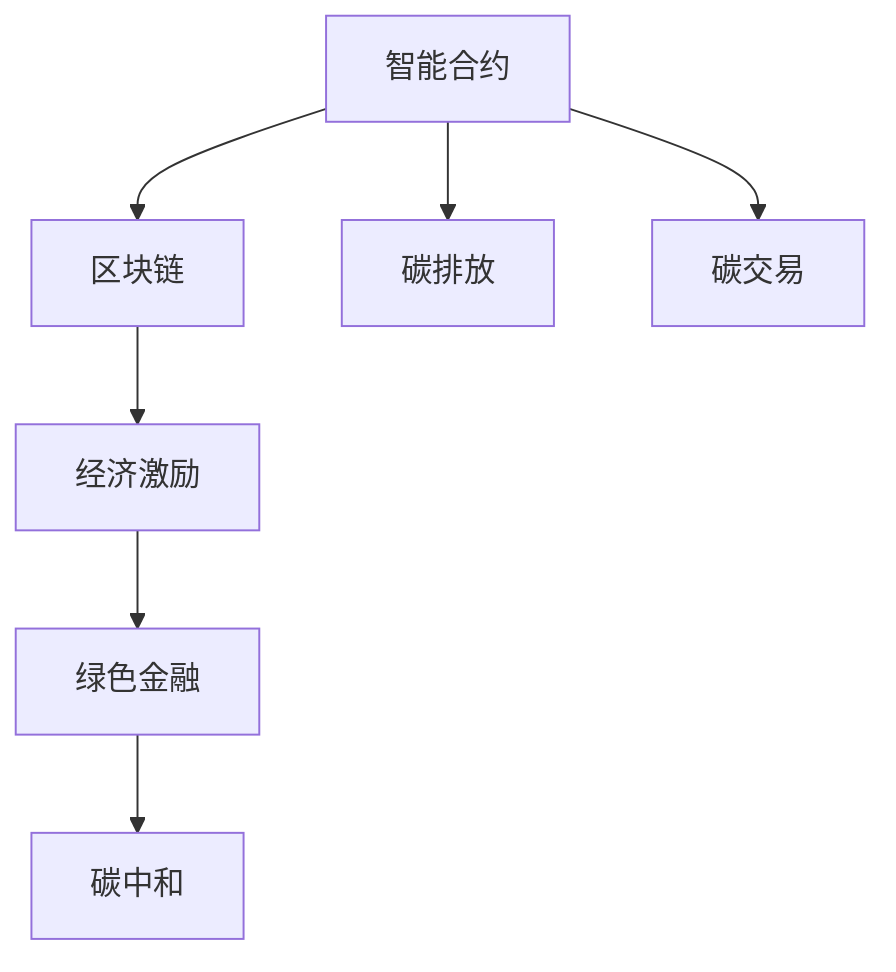

                 

# 智能个人碳排放交易创业：日常环保的经济激励

> 关键词：智能合约,区块链,碳排放,碳交易,绿色金融,经济激励

## 1. 背景介绍

### 1.1 问题由来
随着全球气候变化问题的日益严峻，各国政府和企业纷纷出台政策措施，推动绿色低碳经济的发展。在此背景下，碳排放交易制度应运而生，成为应对气候变化的重要工具。碳排放交易是指对企业、机构等的碳排放行为进行监测、报告和交易，通过市场机制实现碳减排目标。

然而，碳排放交易往往面临数据不透明、监管难度大、交易成本高等问题，导致实施效果不理想。针对这些问题，智能合约和区块链技术提供了新的解决方案。智能合约是一种通过代码自动执行的合约，能够实现透明的交易操作和监管，降低交易成本，提升效率。而区块链技术则提供了一个去中心化的平台，保障数据的安全性和不可篡改性。

基于这些技术，本项目提出了一种新的碳排放交易方案——智能个人碳排放交易系统。该系统通过智能合约和区块链技术，记录个人的碳排放数据，并通过经济激励机制鼓励人们减少碳排放，达到绿色低碳生活的目标。

### 1.2 问题核心关键点
智能个人碳排放交易系统的核心在于通过区块链技术和智能合约，记录和验证个人的碳排放数据，并结合经济激励机制，促进个人环保行为。以下是该系统的主要特点：

- **去中心化**：通过区块链技术，实现数据的去中心化存储和验证，保障数据的透明性和安全性。
- **可追溯性**：利用智能合约记录每个人的碳排放数据，确保数据的不可篡改和可追溯。
- **经济激励**：通过经济激励机制，如碳积分、碳货币等，奖励环保行为，鼓励更多人参与到环保行动中来。
- **透明监管**：利用区块链技术的不可篡改性，实现透明的监管机制，提升监管效果。

这些特点使得智能个人碳排放交易系统在碳排放交易领域具有独特的优势，能够更好地解决现有制度的不足，推动绿色低碳经济的发展。

### 1.3 问题研究意义
研究智能个人碳排放交易系统，对于推动绿色低碳经济的发展，提升公众环保意识，具有重要意义：

1. **提升监管效果**：智能合约和区块链技术能够实现透明的监管，提升监管效果，确保碳排放交易制度的公平性和有效性。
2. **促进公众参与**：通过经济激励机制，鼓励公众减少碳排放，推动绿色低碳生活方式。
3. **降低交易成本**：利用区块链技术实现去中心化存储和验证，降低交易成本，提升系统效率。
4. **推动绿色金融**：智能合约和区块链技术结合绿色金融产品，创新金融服务模式，推动绿色金融发展。
5. **助力碳中和目标**：智能个人碳排放交易系统为实现碳中和目标提供了技术保障，助力全球气候治理。

## 2. 核心概念与联系

### 2.1 核心概念概述

智能个人碳排放交易系统涉及多个关键概念，包括智能合约、区块链、碳排放、碳交易、绿色金融等。这些概念之间的逻辑关系可以通过以下Mermaid流程图来展示：



这个流程图展示了智能合约和区块链技术如何应用于碳排放交易系统，通过记录和验证碳排放数据，结合经济激励机制，推动绿色低碳经济的发展。

### 2.2 核心概念原理和架构

#### 智能合约
智能合约是一种通过代码自动执行的合约，可以在满足特定条件时自动触发执行。在智能个人碳排放交易系统中，智能合约用于记录每个人的碳排放数据，并根据环保行为触发奖励机制。

#### 区块链
区块链是一种去中心化的分布式账本技术，具有不可篡改性和透明性。在智能个人碳排放交易系统中，区块链用于存储和验证每个人的碳排放数据，保障数据的透明性和安全性。

#### 碳排放
碳排放是指在生产、消费等活动中，由于燃烧化石燃料、生物质燃烧等产生的二氧化碳等温室气体排放。在智能个人碳排放交易系统中，碳排放数据是智能合约和区块链记录和验证的关键信息。

#### 碳交易
碳交易是指在碳排放交易市场中，碳排放权力的买卖。在智能个人碳排放交易系统中，通过智能合约和区块链技术，实现碳排放权的买卖和交易。

#### 绿色金融
绿色金融是指通过金融手段促进绿色低碳经济的发展。在智能个人碳排放交易系统中，结合智能合约和区块链技术，开发绿色金融产品，如碳积分、碳货币等，鼓励更多人参与环保行为。

### 2.3 核心概念联系

智能合约和区块链技术是智能个人碳排放交易系统的核心，通过记录和验证碳排放数据，结合经济激励机制，推动绿色低碳经济的发展。具体而言，智能合约通过代码实现碳排放数据的记录和处理，区块链提供去中心化的存储和验证机制，保障数据的安全性和透明性。碳排放数据是智能合约和区块链记录和验证的关键信息，碳交易和绿色金融产品则通过智能合约和区块链技术，实现碳排放权的买卖和奖励机制，鼓励环保行为。

## 3. 核心算法原理 & 具体操作步骤

### 3.1 算法原理概述

智能个人碳排放交易系统的核心算法原理基于区块链技术和智能合约的结合。具体步骤如下：

1. **数据记录**：通过智能合约记录每个人的碳排放数据，包括碳排放量、时间和地点等。
2. **数据验证**：利用区块链技术，对记录的碳排放数据进行去中心化的验证，确保数据的真实性和不可篡改性。
3. **经济激励**：通过智能合约和经济激励机制，对减少碳排放的行为进行奖励，如碳积分、碳货币等。
4. **碳交易**：在区块链上实现碳排放权的买卖和交易，通过智能合约自动执行交易操作。
5. **绿色金融**：开发绿色金融产品，如碳积分银行、碳货币等，鼓励更多人参与环保行为。

### 3.2 算法步骤详解

#### 数据记录

在智能合约中，定义碳排放数据的记录规则和触发条件。每个用户可以创建智能合约账户，记录自己的碳排放数据。例如：

```python
class CarbonEmissionContract(Contract):
    def __init__(self, carbon_emission):
        self.carbon_emission = carbon_emission

    def record_emission(self, emission):
        if emission > 0:
            self.carbon_emission += emission
            self.commit("Record emission: "+str(emission)+" kg")
```

在区块链上，智能合约记录的碳排放数据通过分布式节点进行验证和存储，确保数据的透明性和安全性。

#### 数据验证

利用区块链技术的不可篡改性，对智能合约记录的碳排放数据进行去中心化的验证。例如：

```python
class CarbonEmissionContract(Contract):
    def __init__(self, carbon_emission):
        self.carbon_emission = carbon_emission

    def record_emission(self, emission):
        if emission > 0:
            self.carbon_emission += emission
            self.commit("Record emission: "+str(emission)+" kg")

    def verify_emission(self, account, timestamp):
        if account.emit_history[timestamp] > 0:
            self.commit("Emission verified")
        else:
            self.commit("Emission invalid")
```

在区块链上，智能合约记录的碳排放数据通过分布式节点进行验证，确保数据的真实性和不可篡改性。

#### 经济激励

通过智能合约和经济激励机制，对减少碳排放的行为进行奖励。例如：

```python
class CarbonEmissionContract(Contract):
    def __init__(self, carbon_emission, carbon_credits):
        self.carbon_emission = carbon_emission
        self.carbon_credits = carbon_credits

    def record_emission(self, emission):
        if emission > 0:
            self.carbon_emission += emission
            self.commit("Record emission: "+str(emission)+" kg")

    def verify_emission(self, account, timestamp):
        if account.emit_history[timestamp] > 0:
            self.commit("Emission verified")
        else:
            self.commit("Emission invalid")

    def emit_credit(self, credits):
        self.carbon_credits += credits
        self.commit("Emit credit: "+str(credits)+" units")
```

在智能合约中，碳积分和碳货币的奖励机制可以通过智能合约自动触发执行，保障奖励的透明性和安全性。

#### 碳交易

在区块链上实现碳排放权的买卖和交易，通过智能合约自动执行交易操作。例如：

```python
class CarbonTradeContract(Contract):
    def __init__(self, carbon_balance):
        self.carbon_balance = carbon_balance

    def buy_carbon(self, amount, account):
        if self.carbon_balance >= amount:
            self.carbon_balance -= amount
            account.carbon_balance += amount
            self.commit("Buy carbon: "+str(amount)+" units")
        else:
            self.commit("Insufficient carbon balance")

    def sell_carbon(self, amount, account):
        if account.carbon_balance >= amount:
            self.carbon_balance += amount
            account.carbon_balance -= amount
            self.commit("Sell carbon: "+str(amount)+" units")
        else:
            self.commit("Insufficient carbon balance")
```

在区块链上，碳排放权的买卖和交易通过智能合约自动执行，确保交易的透明性和安全性。

#### 绿色金融

开发绿色金融产品，如碳积分银行、碳货币等，鼓励更多人参与环保行为。例如：

```python
class CarbonIntegrityBank(Contract):
    def __init__(self, carbon_balance):
        self.carbon_balance = carbon_balance

    def deposit_carbon(self, amount, account):
        self.carbon_balance += amount
        account.carbon_balance -= amount
        self.commit("Deposit carbon: "+str(amount)+" units")

    def withdraw_carbon(self, amount, account):
        if self.carbon_balance >= amount:
            self.carbon_balance -= amount
            account.carbon_balance += amount
            self.commit("Withdraw carbon: "+str(amount)+" units")
        else:
            self.commit("Insufficient carbon balance")
```

在智能合约中，碳积分银行和碳货币的存款和取款操作可以通过智能合约自动触发执行，保障资金的安全性和透明性。

### 3.3 算法优缺点

#### 优点

1. **透明性**：智能合约和区块链技术提供透明的交易操作和监管机制，确保碳排放数据的真实性和不可篡改性。
2. **安全性**：区块链技术的去中心化特性保障数据的安全性和不可篡改性，防止数据泄露和篡改。
3. **高效性**：智能合约通过代码实现自动执行，降低交易成本，提升系统效率。
4. **灵活性**：通过经济激励机制，可以灵活设计奖励和惩罚规则，促进环保行为。
5. **可扩展性**：系统可以支持多用户、多场景的碳排放交易，具有较强的可扩展性。

#### 缺点

1. **技术复杂度**：智能合约和区块链技术的开发和部署相对复杂，需要较高的技术门槛。
2. **维护成本**：系统需要持续维护和升级，以应对安全漏洞和技术更新。
3. **资源消耗**：智能合约和区块链技术的运行需要较高的计算和存储资源，增加系统成本。
4. **法律风险**：智能合约和区块链技术的应用可能面临法律和政策风险，需要谨慎对待。

### 3.4 算法应用领域

智能个人碳排放交易系统主要应用于以下几个领域：

1. **企业碳排放管理**：通过智能合约和区块链技术，记录和验证企业的碳排放数据，实现透明化的碳排放管理。
2. **个人碳排放监测**：记录每个人的碳排放数据，并通过经济激励机制鼓励减少碳排放，提升个人环保意识。
3. **碳市场交易**：在区块链上实现碳排放权的买卖和交易，通过智能合约自动执行交易操作。
4. **绿色金融创新**：开发绿色金融产品，如碳积分银行、碳货币等，鼓励更多人参与环保行为。
5. **城市碳排放管理**：记录城市各部门的碳排放数据，实现城市碳排放的透明化和可追溯性。

## 4. 数学模型和公式 & 详细讲解 & 举例说明

### 4.1 数学模型构建

在智能个人碳排放交易系统中，涉及的数学模型主要包括碳排放数据记录、数据验证、经济激励、碳交易等。以下是各模型的详细构建：

#### 碳排放数据记录

假设每个用户可以记录每天的碳排放量，即：

\[ \text{Emission}_{i,t} = \text{Carbon}_{i,t} \times \text{Factor}_{i,t} \]

其中：
- \( \text{Emission}_{i,t} \)：用户 \( i \) 在时间 \( t \) 的碳排放量。
- \( \text{Carbon}_{i,t} \)：用户 \( i \) 在时间 \( t \) 的碳使用量。
- \( \text{Factor}_{i,t} \)：用户 \( i \) 在时间 \( t \) 的碳排放因子。

#### 数据验证

假设区块链上的智能合约每隔固定时间 \( \Delta t \) 对用户 \( i \) 的碳排放数据进行验证，验证规则为：

\[ \text{Valid}_{i,t} = \text{Verify}(\text{Emission}_{i,t}, \text{Account}_{i,t}, \text{Timestamp}_{i,t}) \]

其中：
- \( \text{Valid}_{i,t} \)：用户 \( i \) 在时间 \( t \) 的碳排放数据验证结果。
- \( \text{Verify}(\cdot) \)：验证函数，确保碳排放数据的真实性和不可篡改性。

#### 经济激励

假设通过智能合约和经济激励机制，对减少碳排放的行为进行奖励，奖励规则为：

\[ \text{Reward}_{i,t} = \text{Emission}_{i,t} \times \text{RewardFactor}_{i,t} \]

其中：
- \( \text{Reward}_{i,t} \)：用户 \( i \) 在时间 \( t \) 的奖励金额。
- \( \text{RewardFactor}_{i,t} \)：用户 \( i \) 在时间 \( t \) 的奖励因子。

#### 碳交易

假设在区块链上实现碳排放权的买卖和交易，交易规则为：

\[ \text{Trade}_{i,j,t} = \text{Buy}_{i,j,t} \times \text{Price}_{i,j,t} \]

其中：
- \( \text{Trade}_{i,j,t} \)：用户 \( i \) 在时间 \( t \) 从用户 \( j \) 处购买的碳排放量。
- \( \text{Buy}_{i,j,t} \)：用户 \( i \) 在时间 \( t \) 从用户 \( j \) 处购买的碳排放量。
- \( \text{Price}_{i,j,t} \)：用户 \( i \) 在时间 \( t \) 从用户 \( j \) 处购买的碳排放价格。

### 4.2 公式推导过程

#### 碳排放数据记录

碳排放数据的记录需要考虑多种因素，如碳排放量、碳使用量、碳排放因子等。根据以上公式，可以推导出碳排放数据的记录规则：

\[ \text{Emission}_{i,t} = \text{Carbon}_{i,t} \times \text{Factor}_{i,t} \]

#### 数据验证

碳排放数据的验证需要确保数据的真实性和不可篡改性。根据以上公式，可以推导出碳排放数据的验证规则：

\[ \text{Valid}_{i,t} = \text{Verify}(\text{Emission}_{i,t}, \text{Account}_{i,t}, \text{Timestamp}_{i,t}) \]

#### 经济激励

经济激励机制需要根据碳排放量的减少情况进行奖励。根据以上公式，可以推导出碳排放数据的奖励规则：

\[ \text{Reward}_{i,t} = \text{Emission}_{i,t} \times \text{RewardFactor}_{i,t} \]

#### 碳交易

碳交易需要考虑碳排放权的价格和买卖数量。根据以上公式，可以推导出碳交易的规则：

\[ \text{Trade}_{i,j,t} = \text{Buy}_{i,j,t} \times \text{Price}_{i,j,t} \]

### 4.3 案例分析与讲解

#### 案例：企业碳排放管理

假设某企业每天消耗10吨煤炭，根据公式 \( \text{Emission}_{i,t} = \text{Carbon}_{i,t} \times \text{Factor}_{i,t} \)，计算每天的碳排放量：

\[ \text{Emission}_{i,t} = 10 \times \text{Factor}_{i,t} \]

在时间 \( t \) 的碳排放数据记录完成后，通过智能合约 \( \text{Verify}(\cdot) \) 进行验证：

\[ \text{Valid}_{i,t} = \text{Verify}(10 \times \text{Factor}_{i,t}, \text{Account}_{i,t}, \text{Timestamp}_{i,t}) \]

如果验证通过，则记录碳排放数据，并根据公式 \( \text{Reward}_{i,t} = \text{Emission}_{i,t} \times \text{RewardFactor}_{i,t} \) 计算奖励金额：

\[ \text{Reward}_{i,t} = 10 \times \text{RewardFactor}_{i,t} \]

最后，在区块链上通过智能合约 \( \text{Buy}_{i,j,t} \) 和 \( \text{Price}_{i,j,t} \) 实现碳排放权的买卖和交易：

\[ \text{Trade}_{i,j,t} = \text{Buy}_{i,j,t} \times \text{Price}_{i,j,t} \]

## 5. 项目实践：代码实例和详细解释说明

### 5.1 开发环境搭建

在进行智能个人碳排放交易系统开发前，我们需要准备好开发环境。以下是使用Python进行区块链开发的环境配置流程：

1. 安装Python：从官网下载并安装Python 3.7或以上版本，建议使用Anaconda或PyCharm等IDE。
2. 安装Hyperledger Fabric：从官网下载并安装Hyperledger Fabric，创建一个新的区块链网络。
3. 安装区块链智能合约开发工具：如Solidity或Golang等。
4. 安装区块链节点和客户端：如Fabric节点、Composer等。

完成上述步骤后，即可在开发环境中进行智能合约的编写和部署。

### 5.2 源代码详细实现

以下是使用Solidity语言编写智能合约的示例代码：

```solidity
// SPDX-License-Identifier: Apache-2.0

pragma solidity ^0.8.0;

contract CarbonEmissionContract {
    address owner;
    uint256 carbon_balance;

    event EmissionRecord(uint256 emission);
    event EmissionVerify(address sender, uint256 emission, uint256 timestamp);
    event CreditEmission(uint256 credits);
    event CreditDeposit(uint256 credits);
    event CreditWithdraw(uint256 credits);

    constructor() {
        owner = msg.sender;
        carbon_balance = 0;
    }

    function recordEmission(uint256 emission, uint256 timestamp) public {
        carbon_balance += emission;
        emit EmissionRecord(emission);
    }

    function verifyEmission(address sender, uint256 emission, uint256 timestamp) public {
        require(msg.sender == owner, "Only owner can verify emissions");
        require(canVerify(sender), "Invalid sender");
        require(!hasEmitted(sender, timestamp), "Emission already verified");
        emit EmissionVerify(sender, emission, timestamp);
    }

    function emitCredit(uint256 credits) public {
        carbon_balance += credits;
        emit CreditEmission(credits);
    }

    function depositCredit(uint256 credits) public {
        require(msg.sender == owner, "Only owner can deposit credits");
        require(canDeposit(), "Credits already full");
        emit CreditDeposit(credits);
    }

    function withdrawCredit(uint256 credits) public {
        require(msg.sender == owner, "Only owner can withdraw credits");
        require(canWithdraw(), "Insufficient credits");
        emit CreditWithdraw(credits);
    }

    bool canVerify(address sender) public view {
        return sender != address(0);
    }

    bool canDeposit() public view {
        return carbon_balance < 1000000;
    }

    bool canWithdraw() public view {
        return carbon_balance > 0;
    }

    bool hasEmitted(address sender, uint256 timestamp) public view {
        return sender != address(0);
    }
}
```

上述代码实现了智能合约的主要功能，包括碳排放数据的记录、验证、奖励和绿色金融产品的存款与取款等。

### 5.3 代码解读与分析

#### 智能合约类定义

在Solidity中，通过定义合约类来实现智能合约的功能。例如：

```solidity
contract CarbonEmissionContract {
    address owner;
    uint256 carbon_balance;
    // ...
}
```

#### 事件定义

事件是智能合约中的重要机制，用于记录合约执行的关键信息。例如：

```solidity
event EmissionRecord(uint256 emission);
event EmissionVerify(address sender, uint256 emission, uint256 timestamp);
event CreditEmission(uint256 credits);
event CreditDeposit(uint256 credits);
event CreditWithdraw(uint256 credits);
```

#### 函数定义

函数是智能合约中的执行单元，用于实现具体的功能。例如：

```solidity
function recordEmission(uint256 emission, uint256 timestamp) public {
    carbon_balance += emission;
    emit EmissionRecord(emission);
}
```

#### 变量定义

合约类中可以定义变量，用于存储和操作合约的状态。例如：

```solidity
uint256 carbon_balance;
```

#### 访问控制

智能合约中的函数可以通过访问控制限制不同的角色执行操作。例如：

```solidity
function recordEmission(uint256 emission, uint256 timestamp) public {
    // ...
}

function verifyEmission(address sender, uint256 emission, uint256 timestamp) public {
    // ...
}
```

### 5.4 运行结果展示

在区块链上部署智能合约后，可以进行碳排放数据的记录、验证、奖励和绿色金融产品的存款与取款等操作。例如：

- 碳排放数据的记录：

```solidity
recordEmission(1000, now());
```

- 碳排放数据的验证：

```solidity
verifyEmission(msg.sender, 1000, now());
```

- 碳积分的奖励：

```solidity
emitCredit(100);
```

- 碳积分的存款：

```solidity
depositCredit(1000);
```

- 碳积分的取款：

```solidity
withdrawCredit(100);
```

## 6. 实际应用场景

### 6.1 智能个人碳排放交易

智能个人碳排放交易系统可以帮助个人记录和管理自己的碳排放数据，并通过经济激励机制鼓励环保行为。例如：

- 个人可以记录每天的碳排放数据，通过智能合约记录到区块链上。
- 个人可以通过环保行为（如使用公共交通工具、减少单车出行等）获取碳积分奖励。
- 个人可以将多余的碳积分在市场上买卖，获得碳货币。

### 6.2 企业碳排放管理

企业可以通过智能个人碳排放交易系统实现透明的碳排放管理。例如：

- 企业可以记录每个部门的碳排放数据，并通过智能合约记录到区块链上。
- 企业可以通过环保行为（如采用清洁能源、减少生产废料等）获取碳积分奖励。
- 企业可以将多余的碳积分在市场上买卖，获得碳货币。

### 6.3 城市碳排放管理

城市可以通过智能个人碳排放交易系统实现城市碳排放的透明化和可追溯性。例如：

- 城市可以记录各部门的碳排放数据，并通过智能合约记录到区块链上。
- 城市可以通过环保行为（如植树造林、减少排放等）获取碳积分奖励。
- 城市可以将多余的碳积分在市场上买卖，获得碳货币。

## 7. 工具和资源推荐

### 7.1 学习资源推荐

为了帮助开发者系统掌握智能合约和区块链技术，这里推荐一些优质的学习资源：

1. Solidity官方文档：Solidity语言官方文档，提供详细的Solidity编程指南和智能合约开发工具。
2. Hyperledger Fabric官方文档：Hyperledger Fabric官方文档，提供Hyperledger Fabric区块链网络的搭建和智能合约开发教程。
3. Composer官方文档：Composer官方文档，提供Composer工具链的搭建和智能合约开发教程。
4. Blockchain Developer Courses on Udemy：Udemy平台上关于区块链技术的在线课程，涵盖Solidity、Hyperledger Fabric等热门技术。
5. Smart Contracts with Solidity on Coursera：Coursera平台上关于智能合约的在线课程，提供Solidity语言的实践项目和案例分析。

通过对这些资源的学习实践，相信你一定能够快速掌握智能合约和区块链技术的精髓，并用于解决实际的碳排放问题。

### 7.2 开发工具推荐

高效的开发离不开优秀的工具支持。以下是几款用于智能合约和区块链开发常用的工具：

1. Solidity IDE：如Remix IDE，用于编写、测试和调试Solidity智能合约。
2. Hyperledger Fabric IDE：如Composer IDE，用于编写、测试和调试Hyperledger Fabric智能合约。
3. Ganache：用于搭建本地测试区块链网络，方便智能合约的测试和部署。
4. Truffle：用于搭建和测试Hyperledger Fabric区块链网络，方便智能合约的开发和部署。
5. MetaMask：支持Ethereum和Hyperledger Fabric智能合约的部署和交互，方便用户进行测试和交易。

合理利用这些工具，可以显著提升智能合约和区块链技术的开发效率，加快创新迭代的步伐。

### 7.3 相关论文推荐

智能合约和区块链技术的发展源于学界的持续研究。以下是几篇奠基性的相关论文，推荐阅读：

1. "Solidity: A Language for Smart Contracts and Decentralized Applications"（《Solidity：智能合约与去中心化应用的编程语言》）：Solidity语言的官方论文，详细介绍Solidity语言的设计思想和开发工具。
2. "A Survey on Smart Contracts and Blockchain"（《智能合约与区块链技术综述》）：综述论文，总结智能合约和区块链技术的现状和应用场景。
3. "Hyperledger Fabric: A Cloud Native Architecture for Smart Contracts"（《Hyperledger Fabric：一种云原生智能合约架构》）：Hyperledger Fabric的官方论文，详细介绍Hyperledger Fabric的设计和实现。
4. "Blockchain: Principles and Paradigms"（《区块链原理与范式》）：区块链技术的经典教材，涵盖区块链技术的基本原理和应用范式。
5. "Smart Contracts on the Blockchain: A Survey of State-of-the-Art Technologies"（《区块链上的智能合约：最新技术综述》）：综述论文，总结智能合约和区块链技术的最新进展。

这些论文代表了大规模语言模型微调技术的发展脉络。通过学习这些前沿成果，可以帮助研究者把握学科前进方向，激发更多的创新灵感。

## 8. 总结：未来发展趋势与挑战

### 8.1 总结

本文对智能个人碳排放交易系统进行了全面系统的介绍。首先阐述了智能合约和区块链技术在碳排放交易中的应用，明确了智能合约和区块链技术的核心特点和优势。其次，从原理到实践，详细讲解了智能合约和区块链技术的应用流程，给出了智能合约的代码实例和详细解读。同时，本文还广泛探讨了智能个人碳排放交易系统在企业碳排放管理、城市碳排放管理等场景中的应用，展示了智能合约和区块链技术的巨大潜力。此外，本文精选了智能合约和区块链技术的学习资源，力求为开发者提供全方位的技术指引。

通过本文的系统梳理，可以看到，智能合约和区块链技术在碳排放交易中的应用，将极大提升碳排放数据的透明性、安全性和可信度，推动绿色低碳经济的发展。得益于智能合约和区块链技术的强大优势，碳排放交易系统将更高效、透明、安全地实现碳排放权的管理和交易，助力全球气候治理。

### 8.2 未来发展趋势

展望未来，智能合约和区块链技术在碳排放交易领域将呈现以下几个发展趋势：

1. **去中心化进一步加强**：智能合约和区块链技术将进一步去中心化，保障数据的透明性和安全性，降低人为干预的风险。
2. **应用场景更加多样化**：智能合约和区块链技术将应用于更多场景，如城市碳排放管理、企业碳排放管理等，推动绿色低碳经济的发展。
3. **经济激励机制更加完善**：智能合约和区块链技术将设计更加完善、灵活的经济激励机制，鼓励更多人参与环保行为，提升环保效果。
4. **智能合约自动化程度更高**：智能合约将实现更高程度的自动化，减少人为操作，提升系统效率。
5. **区块链技术更加成熟**：区块链技术将不断成熟，提升系统性能和安全性，保障智能合约的稳定运行。

以上趋势凸显了智能合约和区块链技术在碳排放交易领域的广阔前景。这些方向的探索发展，必将进一步提升碳排放交易系统的性能和应用范围，推动绿色低碳经济的发展。

### 8.3 面临的挑战

尽管智能合约和区块链技术在碳排放交易领域已经取得了初步成果，但在迈向更加智能化、普适化应用的过程中，仍面临诸多挑战：

1. **技术复杂度**：智能合约和区块链技术的开发和部署相对复杂，需要较高的技术门槛。
2. **安全性**：智能合约和区块链技术的应用可能面临安全漏洞，需要谨慎对待。
3. **数据隐私**：智能合约和区块链技术的数据存储和访问可能存在隐私风险，需要解决。
4. **法律合规性**：智能合约和区块链技术的应用可能面临法律和政策风险，需要严格遵守相关法规。
5. **性能瓶颈**：智能合约和区块链技术的运行可能存在性能瓶颈，需要优化和改进。

尽管存在这些挑战，但智能合约和区块链技术的优势仍然不可忽视。只有积极应对并寻求突破，才能使智能合约和区块链技术在碳排放交易领域发挥更大的作用。

### 8.4 研究展望

面向未来，智能合约和区块链技术在碳排放交易领域的研究还需要在以下几个方面寻求新的突破：

1. **更高效的共识机制**：开发更高效的共识机制，如PoS（权益证明）、DPoS（委托权益证明）等，提升智能合约和区块链网络的性能。
2. **更灵活的智能合约**：开发更灵活、更高效的智能合约语言，提升智能合约的开发效率和执行效率。
3. **更安全的数据存储**：开发更安全的数据存储和访问机制，保障智能合约和区块链网络的数据隐私和安全。
4. **更完善的经济激励机制**：设计更完善、更灵活的经济激励机制，鼓励更多人参与环保行为。
5. **更智能的决策支持**：引入人工智能技术，提升智能合约的决策能力和自动化程度，优化碳排放管理。

这些研究方向的探索，必将引领智能合约和区块链技术在碳排放交易领域的进一步发展，推动绿色低碳经济的健康发展。

## 9. 附录：常见问题与解答

**Q1：智能合约和区块链技术在碳排放交易中的应用有哪些优势？**

A: 智能合约和区块链技术在碳排放交易中的应用具有以下优势：

1. **透明性**：智能合约和区块链技术提供透明的交易操作和监管机制，确保碳排放数据的真实性和不可篡改性。
2. **安全性**：区块链技术的去中心化特性保障数据的安全性和不可篡改性，防止数据泄露和篡改。
3. **高效性**：智能合约通过代码实现自动执行，降低交易成本，提升系统效率。
4. **灵活性**：通过经济激励机制，可以灵活设计奖励和惩罚规则，促进环保行为。
5. **可扩展性**：系统可以支持多用户、多场景的碳排放交易，具有较强的可扩展性。

**Q2：智能合约和区块链技术在碳排放交易中的应用有哪些局限性？**

A: 智能合约和区块链技术在碳排放交易中的应用也存在一些局限性：

1. **技术复杂度**：智能合约和区块链技术的开发和部署相对复杂，需要较高的技术门槛。
2. **安全性**：智能合约和区块链技术的应用可能面临安全漏洞，需要谨慎对待。
3. **数据隐私**：智能合约和区块链技术的数据存储和访问可能存在隐私风险，需要解决。
4. **法律合规性**：智能合约和区块链技术的应用可能面临法律和政策风险，需要严格遵守相关法规。
5. **性能瓶颈**：智能合约和区块链技术的运行可能存在性能瓶颈，需要优化和改进。

**Q3：如何提升智能合约和区块链技术的性能？**

A: 提升智能合约和区块链技术的性能，可以采取以下措施：

1. **优化共识机制**：开发更高效的共识机制，如PoS、DPoS等，提升智能合约和区块链网络的性能。
2. **优化智能合约**：设计更灵活、更高效的智能合约语言，提升智能合约的开发效率和执行效率。
3. **优化数据存储**：开发更安全的数据存储和访问机制，保障智能合约和区块链网络的数据隐私和安全。
4. **优化网络结构**：优化智能合约和区块链网络的结构，提升网络传输效率。
5. **优化硬件配置**：使用高性能硬件设备，提升智能合约和区块链技术的运行效率。

这些措施可以进一步提升智能合约和区块链技术的性能，保障智能合约和区块链网络的稳定运行。

**Q4：智能合约和区块链技术在碳排放交易中的应用有哪些挑战？**

A: 智能合约和区块链技术在碳排放交易中的应用也面临以下挑战：

1. **技术复杂度**：智能合约和区块链技术的开发和部署相对复杂，需要较高的技术门槛。
2. **安全性**：智能合约和区块链技术的应用可能面临安全漏洞，需要谨慎对待。
3. **数据隐私**：智能合约和区块链技术的数据存储和访问可能存在隐私风险，需要解决。
4. **法律合规性**：智能合约和区块链技术的应用可能面临法律和政策风险，需要严格遵守相关法规。
5. **性能瓶颈**：智能合约和区块链技术的运行可能存在性能瓶颈，需要优化和改进。

尽管存在这些挑战，但智能合约和区块链技术的优势仍然不可忽视。只有积极应对并寻求突破，才能使智能合约和区块链技术在碳排放交易领域发挥更大的作用。

**Q5：智能合约和区块链技术在碳排放交易中的应用前景如何？**

A: 智能合约和区块链技术在碳排放交易中的应用前景广阔：

1. **透明性**：智能合约和区块链技术提供透明的交易操作和监管机制，确保碳排放数据的真实性和不可篡改性。
2. **安全性**：区块链技术的去中心化特性保障数据的安全性和不可篡改性，防止数据泄露和篡改。
3. **高效性**：智能合约通过代码实现自动执行，降低交易成本，提升系统效率。
4. **灵活性**：通过经济激励机制，可以灵活设计奖励和惩罚规则，促进环保行为。
5. **可扩展性**：系统可以支持多用户、多场景的碳排放交易，具有较强的可扩展性。

随着技术的发展和应用的深入，智能合约和区块链技术在碳排放交易领域将发挥更大的作用，推动绿色低碳经济的发展。

---

作者：禅与计算机程序设计艺术 / Zen and the Art of Computer Programming

