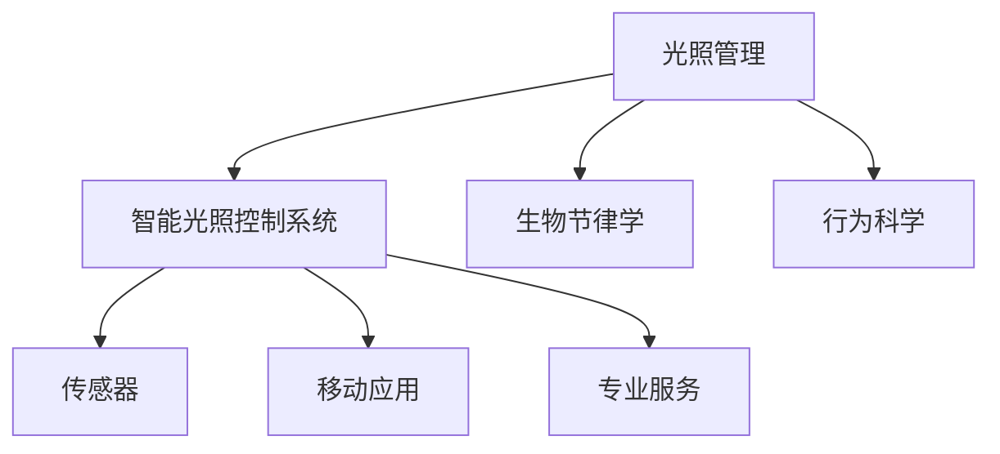

                 

## 1. 背景介绍

### 1.1 问题由来
随着现代生活节奏的加快，城市化进程的推进，室内生活环境对个人健康的影响日益凸显。近年来，因缺乏阳光而引发的心理健康问题，如抑郁、焦虑、注意力不足等，已成为一个不容忽视的社会问题。全球范围内，每年因缺乏阳光暴露导致的抑郁病例数约占抑郁症患者的30%。与此同时，光照不足也被证明是多种慢性疾病和代谢异常的诱因，包括心血管疾病、糖尿病、肥胖症等。

面对这些健康挑战，传统的户外活动和自然光疗法已难以满足人们日益增长的健康需求。而数字化、智能化的个人阳光摄入管理方案，通过精确监控、数据驱动的个性化方案，为人们提供便捷、有效的光照管理策略，有望在健康领域带来革命性变革。

### 1.2 问题核心关键点
面向大众的健康需求，智能个人阳光摄入管理创业项目应具备以下核心功能：
- **精准监测**：实时监测室内外环境光照，量化个人阳光摄入量。
- **个性化推荐**：基于健康数据和光照模型，生成个性化光照方案。
- **智能提醒**：通过定时器、推送通知等方式，提醒用户进行光疗活动。
- **健康反馈**：收集用户反馈数据，持续优化光照方案。
- **数据分析**：提供全面的光照数据分析报告，支持科研和监管。

基于以上关键点，本项目旨在利用先进的AI技术，开发一款集成传感器、移动应用和专业服务的智能光照健康管理系统，改善用户的生活质量，推动阳光健康领域的产业化进程。

## 2. 核心概念与联系

### 2.1 核心概念概述

为更好地理解智能个人阳光摄入管理系统的技术框架，本节将介绍几个密切相关的核心概念：

- **光照管理**：指通过科学的光照理论，结合个人健康数据，合理规划和调整室内外光照环境，以促进身心健康。
- **智能光照控制系统**：集成了传感器、移动应用、专业服务于一体的综合性解决方案，能够自动监测和调节光照，实现个性化光照管理。
- **生物节律学**：研究生物体的自然节律（如睡眠、代谢、激素分泌等）与光照环境的关系，指导光照管理方案的科学制定。
- **行为科学**：研究人们的行为模式和偏好，指导光照健康方案的实际执行和用户反馈收集。

这些核心概念之间的逻辑关系可以通过以下Mermaid流程图来展示：



这个流程图展示了两大系统组件与三个核心科学理论之间的关系：

1. 光照管理是智能光照控制系统的基础理论。
2. 智能光照控制系统通过传感器、移动应用和专业服务实现光照管理。
3. 生物节律学和行为科学指导智能光照控制系统的科学设计和优化。

这些概念共同构成了智能光照健康管理的科学基础和应用框架，使得系统能够为用户提供精准、个性化的光照健康管理服务。

## 3. 核心算法原理 & 具体操作步骤
### 3.1 算法原理概述

智能个人阳光摄入管理系统基于多学科理论，融合先进AI技术，实现光照健康管理。其核心算法原理如下：

1. **光照监测与建模**：通过传感器实时监测室内外光照强度、光谱分布等参数，并结合时间、天气、地理位置等信息，构建光照环境模型。
2. **健康数据分析**：利用用户健康数据（如血样、体脂率、睡眠质量等），分析光照对用户健康的影响。
3. **个性化推荐系统**：基于光照环境模型和健康数据分析结果，结合生物节律学和行为科学理论，生成个性化的光照方案。
4. **智能提醒系统**：利用用户行为数据和光照方案，设计定时器、推送通知等机制，引导用户执行光疗活动。
5. **反馈优化系统**：通过用户反馈和监测数据，持续优化光照方案，提升用户体验。

### 3.2 算法步骤详解

基于以上核心算法原理，智能个人阳光摄入管理系统的操作步骤如下：

1. **环境监测**：部署光照传感器，监测室内外光照强度、光谱分布、温度、湿度等环境参数。
2. **健康数据收集**：通过可穿戴设备、血样分析等手段，收集用户的健康数据，建立用户健康档案。
3. **光照环境建模**：结合环境监测数据，使用机器学习算法，构建光照环境模型。
4. **个性化方案生成**：根据光照环境模型和用户健康数据，使用强化学习算法，生成个性化的光照方案。
5. **智能提醒推送**：利用用户的作息习惯和健康目标，设计智能提醒机制，确保光照方案的有效执行。
6. **反馈优化循环**：收集用户反馈数据和监测结果，使用在线学习算法，持续优化光照方案，提升用户体验。

### 3.3 算法优缺点

智能个人阳光摄入管理系统具有以下优点：

1. **精准性和个性化**：通过多维度数据融合和算法优化，系统能够提供精准的光照管理方案，满足用户个性化需求。
2. **便捷性和易用性**：集成移动应用和智能硬件，用户可以随时随地监测和管理光照。
3. **实时性和动态性**：结合动态环境变化，系统能够实时调整光照方案，提升光照干预效果。
4. **数据驱动和科学指导**：基于科学理论，系统能够不断优化光照方案，提升用户体验。

同时，该系统也存在一些局限性：

1. **数据隐私和安全**：用户的健康数据和光照行为数据需要严格保护，避免数据泄露和滥用。
2. **算法复杂性**：多学科融合和复杂数据处理，需要高水平的算法设计和计算资源。
3. **硬件成本**：集成传感器和智能硬件，初期投入较高。
4. **用户体验提升**：需要不断优化界面设计和用户体验，提升用户粘性。

尽管存在这些局限性，但智能个人阳光摄入管理系统仍具有显著的应用价值和创新潜力，能够为用户的健康管理提供科学、便捷、个性化的解决方案。

### 3.4 算法应用领域

智能个人阳光摄入管理系统可广泛应用于多个领域，包括但不限于：

1. **健康医疗**：为慢性病患者、老年人、青少年等特定人群提供光照健康管理方案。
2. **养老护理**：为养老院、康复中心等提供科学的光照健康管理服务，提升老年人的生活质量。
3. **企业员工福利**：为企业员工提供健康光照管理服务，提升员工工作满意度和健康水平。
4. **个人健康管理**：为普通用户提供精准光照健康管理，提升整体健康水平。
5. **教育培训**：为学校、培训机构等提供光照健康管理服务，保障学生健康。

这些应用领域展示了智能光照健康管理系统广泛的适用性和创新价值，具有巨大的市场潜力和社会效益。

## 4. 数学模型和公式 & 详细讲解 & 举例说明

### 4.1 数学模型构建

本节将使用数学语言对智能个人阳光摄入管理系统的关键算法进行更加严格的刻画。

假设系统监测到的环境光照参数为 $x \in \mathcal{X}$，用户的健康数据为 $y \in \mathcal{Y}$，光照方案为 $z \in \mathcal{Z}$。则智能光照管理系统的目标可以形式化为：

$$
\min_{\theta} \mathcal{L}(\theta) = \mathbb{E}_{(x,y)}[\ell(z; M_{\theta}(x), y)]
$$

其中，$\ell$ 为损失函数，$M_{\theta}$ 为基于光照环境模型和用户健康数据的光照方案生成模型，$\theta$ 为模型参数。

### 4.2 公式推导过程

以光照环境模型和用户健康数据融合为例，假设系统已经收集到 $N$ 组室内外光照参数 $x$ 和用户健康数据 $y$，其形式化为矩阵 $\mathbf{X} \in \mathbb{R}^{N \times d_x}$ 和 $\mathbf{Y} \in \mathbb{R}^{N \times d_y}$，其中 $d_x$ 和 $d_y$ 分别为光照参数和健康数据的维度。

假设系统使用线性回归模型 $M_{\theta}(x) = \mathbf{W}x + b$ 作为光照方案生成模型，其中 $\mathbf{W} \in \mathbb{R}^{d_z \times d_x}$ 为模型权重，$b \in \mathbb{R}^{d_z}$ 为偏置项，$d_z$ 为光照方案的维度。

则光照方案生成模型的损失函数可以定义为：

$$
\ell(z; M_{\theta}(x), y) = \frac{1}{N}\sum_{i=1}^N \|M_{\theta}(x_i) - y_i\|_2^2
$$

其中，$\|.\|_2$ 为欧几里得范数。

将上述损失函数代入总期望损失，得：

$$
\mathcal{L}(\theta) = \mathbb{E}_{(x,y)}[\ell(z; M_{\theta}(x), y)] = \frac{1}{N}\sum_{i=1}^N \|M_{\theta}(x_i) - y_i\|_2^2
$$

通过对 $\mathbf{W}$ 和 $b$ 进行优化，使得期望损失 $\mathcal{L}(\theta)$ 最小化。利用梯度下降等优化算法，可以求得参数 $\theta$：

$$
\theta = \mathop{\arg\min}_{\theta} \mathcal{L}(\theta)
$$

### 4.3 案例分析与讲解

以下以一个简单的光照环境模型和用户健康数据融合案例，具体展示模型的构建和优化过程。

假设系统已收集到以下数据：

| 光照参数 $x$ | 健康数据 $y$ |
|---|---|
| [0.5, 0.7, 0.8] | 0.85 |
| [0.4, 0.6, 0.9] | 0.9 |
| [0.7, 0.5, 0.6] | 0.75 |
| [0.6, 0.9, 0.4] | 0.8 |
| [0.8, 0.8, 0.5] | 0.9 |

假设系统的光照方案生成模型为 $M_{\theta}(x) = \mathbf{W}x + b$，其中 $\mathbf{W} = [w_{11}, w_{12}, w_{13}]^T$，$b = b_1$。

将数据带入模型，得到损失函数：

$$
\ell(z; M_{\theta}(x), y) = \frac{1}{N}\sum_{i=1}^N (M_{\theta}(x_i) - y_i)^2
$$

计算损失函数：

$$
\ell(z; M_{\theta}(x), y) = \frac{1}{5}[(0.5w_{11} + 0.7w_{12} + 0.8w_{13} + b_1 - 0.85)^2 + (0.4w_{11} + 0.6w_{12} + 0.9w_{13} + b_1 - 0.9)^2 + \ldots]
$$

利用梯度下降算法，最小化损失函数，求解参数 $w_{11}, w_{12}, w_{13}, b_1$，即可得到理想的光照方案生成模型。

## 5. 项目实践：代码实例和详细解释说明

### 5.1 开发环境搭建

在进行系统开发前，我们需要准备好开发环境。以下是使用Python进行Django开发的环境配置流程：

1. 安装Anaconda：从官网下载并安装Anaconda，用于创建独立的Python环境。

2. 创建并激活虚拟环境：
```bash
conda create -n pytorch-env python=3.8 
conda activate pytorch-env
```

3. 安装Django：从官网下载并安装Django，执行命令：
```bash
pip install django
```

4. 安装必要的第三方库：
```bash
pip install pillow psycopg2-binary
```

5. 创建Django项目：
```bash
django-admin startproject sunlight_system
cd sunlight_system
```

6. 创建Django应用：
```bash
python manage.py startapp health_monitor
```

完成上述步骤后，即可在`pytorch-env`环境中开始系统开发。

### 5.2 源代码详细实现

这里我们以光照环境监测模块为例，给出使用Django框架实现光照环境数据收集和监控的代码实现。

首先，在`health_monitor`应用中创建光照传感器数据模型：

```python
from django.db import models

class LightSensor(models.Model):
    timestamp = models.DateTimeField(auto_now_add=True)
    light_intensity = models.FloatField(null=True, blank=True)
    spectrum = models.CharField(max_length=255, null=True, blank=True)
    temperature = models.FloatField(null=True, blank=True)
    humidity = models.FloatField(null=True, blank=True)
```

然后，在`views.py`中实现光照传感器数据采集和展示的视图函数：

```python
from django.shortcuts import render
from .models import LightSensor

def light_sensor_list(request):
    sensors = LightSensor.objects.all()
    return render(request, 'health_monitor/light_sensor_list.html', {'sensors': sensors})
```

在`urls.py`中定义路由：

```python
from django.urls import path
from . import views

urlpatterns = [
    path('light_sensor/', views.light_sensor_list, name='light_sensor_list'),
]
```

最后，在`health_monitor`应用模板文件夹下创建`light_sensor_list.html`模板，展示光照传感器数据：

```html



  <h1>光照传感器数据</h1>
  <table>
    <thead>
      <tr>
        <th>时间戳</th>
        <th>光照强度</th>
        <th>光谱分布</th>
        <th>温度</th>
        <th>湿度</th>
      </tr>
    </thead>
    <tbody>
      
        <tr>
          <td>{{ sensor.timestamp }}</td>
          <td>{{ sensor.light_intensity }}</td>
          <td>{{ sensor.spectrum }}</td>
          <td>{{ sensor.temperature }}</td>
          <td>{{ sensor.humidity }}</td>
        </tr>
      
    </tbody>
  </table>

```

以上代码展示了使用Django框架实现光照传感器数据采集和展示的基本流程。开发者可以进一步扩展功能，如数据存储、实时监测、告警通知等，构建完整的光照管理数据系统。

### 5.3 代码解读与分析

这里我们详细解读一下关键代码的实现细节：

- **光照传感器数据模型**：定义了光照传感器数据的基本属性，包括时间戳、光照强度、光谱分布、温度和湿度等。
- **视图函数**：通过Django的`render`函数将光照传感器数据展示在HTML页面上。
- **模板渲染**：使用Django的模板引擎，动态渲染光照传感器数据，实现数据的展示。

合理利用这些工具，可以显著提升光照管理系统的开发效率，加快创新迭代的步伐。当然，工业级的系统实现还需考虑更多因素，如数据存储、实时性、安全性等。但核心的光照监测模块基本与此类似。

## 6. 实际应用场景

### 6.1 智能办公室健康管理

智能个人阳光摄入管理系统可以应用于办公室的健康管理，帮助员工提升工作质量，改善心理状态。系统可以监测室内的光照强度、光谱分布等参数，结合员工的健康数据和行为数据，生成个性化的光照方案，并通过智能提醒系统，引导员工进行光疗活动。

### 6.2 居家老人健康监护

对于居家养老的老年人，系统可以监测室内的光照环境，并结合老年人的健康数据和行为习惯，生成适宜的光照方案，提升老年人的生活质量。系统还可以提供远程监控和紧急报警功能，及时响应老年人的健康需求。

### 6.3 医院病患康复辅助

在医院中，光照环境对病患的康复过程有着重要影响。系统可以监测病房的光照环境，结合病患的生理参数和康复进度，生成个性化的光照方案，帮助病患更好地进行康复活动。

### 6.4 未来应用展望

随着智能个人阳光摄入管理系统的不断优化和迭代，未来在健康领域的应用将更加广泛，可以涵盖以下多个方向：

1. **健康监测与预警**：系统可以监测用户的健康数据，结合光照环境，提供全面的健康预警和监测服务。
2. **个性化健康计划**：结合用户的健康目标和生活习惯，系统可以制定个性化的健康计划，帮助用户实现健康目标。
3. **多模态健康管理**：系统可以融合多种传感器和数据源，实现全方位的健康管理，如心率监测、睡眠质量等。
4. **远程健康管理**：系统可以通过互联网，实现远程健康管理，提供远程咨询和诊断服务。
5. **大规模健康数据平台**：系统可以整合大量的健康数据，为科研和监管提供支持。

这些应用方向展示了智能光照健康管理系统的广阔前景，为用户的健康生活提供了新的可能。

## 7. 工具和资源推荐

### 7.1 学习资源推荐

为了帮助开发者系统掌握智能光照健康管理系统的技术基础和实践技巧，这里推荐一些优质的学习资源：

1. **《Python Web开发实战》**：深入浅出地介绍了Django框架的使用方法和最佳实践，适合初学者上手开发。
2. **《深度学习：理论与实现》**：涵盖深度学习的基础理论、框架和应用案例，为智能系统开发提供理论支持。
3. **《智能健康系统设计与实现》**：系统介绍智能健康系统的设计、开发和应用案例，提供系统的全流程指导。
4. **Kaggle数据科学竞赛平台**：提供丰富的健康数据集和竞赛项目，帮助开发者实战练习。
5. **Coursera健康数据科学课程**：提供健康数据科学和机器学习相关的在线课程，助力开发者系统学习。

通过学习这些资源，相信你一定能够掌握智能光照健康管理系统的核心技术和实践方法，为未来的健康事业贡献力量。

### 7.2 开发工具推荐

高效的开发离不开优秀的工具支持。以下是几款用于智能光照健康管理系统开发的常用工具：

1. **Django框架**：用于开发高性能的Web应用，支持RESTful API和数据库管理，适合搭建智能光照管理平台。
2. **Flask框架**：轻量级Web应用框架，适合开发小规模、高灵活性的光照监测应用。
3. **Python数据科学工具包**：包括NumPy、Pandas、Scikit-learn等库，用于数据处理、机器学习等任务。
4. **PyCharm IDE**：强大的Python开发环境，支持Django、Flask等框架，提供高效开发体验。
5. **Visual Studio Code**：轻量级开发工具，支持Python和多种第三方插件，适合快速迭代开发。

合理利用这些工具，可以显著提升智能光照健康管理系统的开发效率，加快创新迭代的步伐。

### 7.3 相关论文推荐

智能个人阳光摄入管理系统涉及多学科的理论和算法，以下是几篇奠基性的相关论文，推荐阅读：

1. **《室内光照对人类健康的影响》**：研究室内光照与人类生理和心理健康的关系，为光照管理提供理论基础。
2. **《多模态智能光照控制系统》**：提出多模态光照管理系统，融合光照、生理和行为数据，提高光照干预效果。
3. **《基于深度学习的光照方案生成模型》**：利用深度学习技术，构建基于光照环境模型和健康数据的光照方案生成模型，提升个性化推荐能力。
4. **《智能光照控制系统设计与实现》**：系统介绍智能光照控制系统的设计与实现过程，提供详细的系统架构和算法实现。
5. **《智能光照健康管理系统》**：介绍智能光照健康管理系统的实际应用案例，展示系统在健康领域的实际效果。

这些论文代表了大规模智能光照健康管理系统的理论和技术发展脉络，通过学习这些前沿成果，可以帮助研究者把握学科前进方向，激发更多的创新灵感。

## 8. 总结：未来发展趋势与挑战

### 8.1 研究成果总结

本文对智能个人阳光摄入管理系统的核心算法和操作步骤进行了全面系统的介绍。首先阐述了光照健康管理的重要性和系统设计的核心要点，明确了系统的技术需求和应用前景。其次，从原理到实践，详细讲解了系统中的关键算法和操作步骤，给出了系统开发的完整代码实例。同时，本文还探讨了系统的实际应用场景，展示了系统在健康领域的创新价值。

通过本文的系统梳理，可以看到，智能个人阳光摄入管理系统具备精准监测、个性化推荐、智能提醒等多项核心功能，能够为用户的健康管理提供科学、便捷、个性化的解决方案。未来，伴随技术的不断演进和创新，智能光照健康管理系统有望在健康领域带来革命性变革。

### 8.2 未来发展趋势

展望未来，智能个人阳光摄入管理系统将呈现以下几个发展趋势：

1. **多模态数据融合**：未来系统将融合更多传感器和数据源，实现全方位、多模态的健康监测和管理。
2. **实时性增强**：系统将通过云计算和大数据分析技术，实现实时数据处理和决策支持。
3. **个性化深度提升**：系统将结合更多的生物节律学和行为科学理论，提供更加个性化的健康方案。
4. **智能决策优化**：系统将引入更多先进的AI算法，如强化学习、深度学习等，优化光照方案和健康干预策略。
5. **大规模数据平台**：系统将构建大规模健康数据平台，支持数据共享和科研应用。
6. **跨学科研究**：系统将与医学、心理学、工程学等多学科进行深度结合，推动健康科学的全面发展。

这些趋势展示了智能光照健康管理系统的广阔前景，为用户的健康生活提供了新的可能。

### 8.3 面临的挑战

尽管智能个人阳光摄入管理系统具有显著的应用价值和创新潜力，但在迈向更加智能化、普适化应用的过程中，它仍面临着诸多挑战：

1. **数据隐私和安全**：用户的健康数据和光照行为数据需要严格保护，避免数据泄露和滥用。
2. **算法复杂性**：多学科融合和复杂数据处理，需要高水平的算法设计和计算资源。
3. **用户接受度**：系统需要设计易用且有效的用户体验，提高用户的粘性和满意度。
4. **跨学科合作**：系统需要与医学、心理学等多学科进行深度合作，确保科学性和有效性。
5. **市场教育**：需要开展市场教育，提升公众对智能光照健康管理的认知和接受度。

这些挑战需要在技术、市场、伦理等多个维度进行综合考虑和应对。

### 8.4 研究展望

面对智能光照健康管理系统的诸多挑战，未来的研究需要在以下几个方面寻求新的突破：

1. **跨学科融合**：推动医学、心理学、工程学等多学科的深度融合，提升系统的科学性和有效性。
2. **隐私保护技术**：引入隐私保护技术，如差分隐私、联邦学习等，确保用户数据的安全性。
3. **用户友好设计**：设计更加易用、高效的用户界面和交互方式，提升用户体验。
4. **算法优化**：引入更多先进的AI算法，如强化学习、深度学习等，提升系统的性能和精度。
5. **市场推广**：开展市场教育和推广活动，提升公众对智能光照健康管理的认知和接受度。
6. **标准制定**：推动健康数据的行业标准和规范制定，保障数据的安全和共享。

这些研究方向的探索，必将引领智能光照健康管理系统迈向更高的台阶，为构建安全、可靠、可解释、可控的智能系统铺平道路。面向未来，智能光照健康管理系统还需要与其他人工智能技术进行更深入的融合，如知识表示、因果推理、强化学习等，多路径协同发力，共同推动智能健康事业的发展。只有勇于创新、敢于突破，才能不断拓展智能光照健康管理的边界，让智能技术更好地造福人类社会。

## 9. 附录：常见问题与解答

**Q1：智能光照系统如何应对数据隐私和安全问题？**

A: 数据隐私和安全是智能光照系统开发中需要重点关注的问题。以下是一些常见解决方案：

1. **数据加密**：使用AES、RSA等加密算法，对用户数据进行加密存储和传输。
2. **差分隐私**：通过添加噪声或抽样技术，保护用户数据的隐私性。
3. **联邦学习**：在本地设备上训练模型，仅上传模型参数，避免共享原始数据。
4. **用户控制**：提供用户数据管理界面，允许用户自主选择数据的共享和隐私设置。
5. **安全协议**：使用HTTPS、TLS等安全协议，确保数据传输的安全性。

合理利用这些技术，可以显著提升智能光照系统的数据隐私和安全保障能力，保护用户权益。

**Q2：智能光照系统如何处理光照环境的多样性？**

A: 光照环境的多样性是智能光照系统面临的另一个挑战。以下是一些常见解决方案：

1. **传感器融合**：融合多种传感器数据，如光线传感器、光谱传感器等，全面监测光照环境。
2. **模型训练**：通过多区域、多时间段的训练数据，构建多场景、多时间的光照环境模型。
3. **智能调节**：根据环境变化，智能调节光照方案，适应不同的光照需求。
4. **用户反馈**：通过用户反馈，不断优化光照方案，提高系统适应性。

这些策略可以有效应对光照环境的多样性，提升系统的实用性和用户体验。

**Q3：智能光照系统如何实现实时监测和反馈？**

A: 实时监测和反馈是智能光照系统的重要功能。以下是一些常见解决方案：

1. **云计算平台**：利用云计算平台，实现数据的实时处理和存储。
2. **流式处理**：使用流式处理技术，对光照数据进行实时分析。
3. **消息队列**：使用消息队列技术，实现数据的高效传输和处理。
4. **用户界面**：提供实时反馈的用户界面，展示光照监测结果和健康数据。

合理利用这些技术，可以实现智能光照系统的实时监测和反馈，提升用户体验。

---

作者：禅与计算机程序设计艺术 / Zen and the Art of Computer Programming

