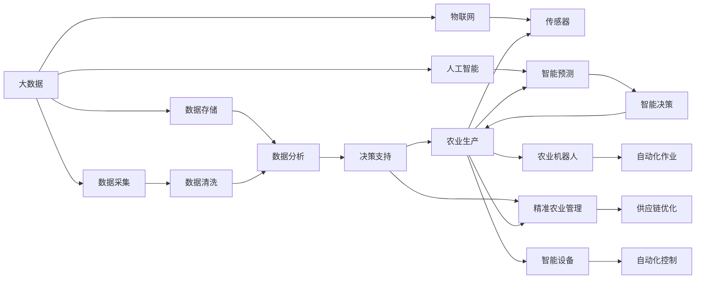

                 

# 智能农业创业：科技赋能传统产业

> 关键词：智慧农业,人工智能,大数据,物联网,智能设备,创业,可持续发展,数字转型

## 1. 背景介绍

### 1.1 问题由来

随着全球人口的增长和城市化进程的加速，农业面临越来越大的压力。传统农业的生产方式已经难以适应现代社会的需要，迫切需要进行变革。一方面，环境污染、气候变化等问题使得农业生产面临诸多挑战；另一方面，农业生产成本不断上升，农民的收入难以提高。

科技创新为农业发展带来了新的契机。以人工智能、物联网、大数据等为代表的新技术正在改变传统的农业生产模式，促进农业的可持续发展。智慧农业的兴起，为农民提供了更为精准的农业生产决策支持，显著提高了农业生产的效率和质量，推动了农业的数字化转型。

### 1.2 问题核心关键点

智慧农业的核心在于将农业生产与科技紧密结合，通过大数据、物联网、人工智能等技术，实现农业生产的智能化、自动化、精准化。具体来说，主要包括以下几个方面：

- **数据采集与分析**：通过各种传感器和监测设备，实时采集土壤、气象、作物等数据，并进行数据分析，为生产决策提供支持。
- **智能设备控制**：利用智能设备，如智能灌溉、智能施肥、智能植保等，实现自动化控制，提高生产效率。
- **精准农业管理**：基于数据分析结果，实现对种植、施肥、灌溉、病虫害防治等方面的精准管理，减少资源浪费，提高产量和质量。
- **供应链优化**：通过大数据分析，优化农产品供应链，提升流通效率，降低成本，增加农民收入。
- **农业机器人与自动化**：利用无人驾驶拖拉机、无人机等农业机器人，进行自动化作业，提高劳动生产率。

## 2. 核心概念与联系

### 2.1 核心概念概述

为更好地理解智慧农业的构建和实现，本节将介绍几个关键概念：

- **智慧农业**：指利用信息技术和物联网技术，通过数据驱动的决策支持系统，实现农业生产的智能化、自动化和精准化。智慧农业不仅提高了农业生产效率，还实现了农业的可持续发展。

- **大数据**：指规模巨大、结构复杂、高速变化的数据集合，通过数据分析，可以获得有价值的信息和洞察。大数据技术在智慧农业中的应用，可以帮助农民做出更为科学的生产决策。

- **物联网**：指通过传感器、通信网络、智能设备等，实现物理世界与数字世界的互联互通。物联网技术在智慧农业中的应用，可以实现对农业生产环境的实时监控和控制。

- **人工智能**：指通过机器学习、深度学习等技术，实现对数据的自动分析和处理。人工智能技术在智慧农业中的应用，可以实现对农业生产过程的智能预测和优化。

- **智能设备**：指通过嵌入式系统和传感器技术，实现自动化控制和监测的设备，如智能灌溉系统、智能施肥系统、智能植保设备等。智能设备在智慧农业中的应用，提高了农业生产的效率和精度。

- **农业机器人**：指利用自动化技术和人工智能技术，实现自主作业的农业机械，如无人驾驶拖拉机、无人机、智能收割机等。农业机器人在智慧农业中的应用，可以大幅度提高劳动生产率。

这些核心概念之间存在密切的联系，共同构成了智慧农业的基本框架。通过大数据、物联网、人工智能等技术的应用，可以实现对农业生产过程的全面监控和优化，推动农业的数字化转型。

### 2.2 核心概念原理和架构的 Mermaid 流程图(Mermaid 流程节点中不要有括号、逗号等特殊字符)



这个流程图展示了智慧农业的各个核心组件之间的联系。大数据技术通过数据采集和存储，为农业生产提供支持；物联网技术通过传感器和通信网络，实现对农业生产环境的实时监控和控制；人工智能技术通过机器学习、深度学习等，实现对农业生产过程的智能预测和优化；智能设备通过自动化控制和监测，提高农业生产的效率和精度；精准农业管理通过数据分析结果，实现对种植、施肥、灌溉、病虫害防治等方面的精准管理；供应链优化通过大数据分析，提升流通效率，降低成本；农业机器人通过自动化技术和人工智能技术，实现自主作业，提高劳动生产率。

## 3. 核心算法原理 & 具体操作步骤
### 3.1 算法原理概述

智慧农业的核心在于数据驱动的决策支持系统，通过大数据、物联网、人工智能等技术的应用，实现对农业生产过程的全面监控和优化。具体来说，智慧农业的实现可以分为以下几个步骤：

- **数据采集与存储**：通过传感器和监测设备，实时采集土壤、气象、作物等数据，并进行存储和管理。
- **数据清洗与分析**：对采集到的数据进行清洗和预处理，然后利用大数据分析技术，提取有用的信息和洞察。
- **智能设备控制**：利用智能设备，如智能灌溉、智能施肥、智能植保等，实现自动化控制，提高生产效率。
- **精准农业管理**：基于数据分析结果，实现对种植、施肥、灌溉、病虫害防治等方面的精准管理，减少资源浪费，提高产量和质量。
- **供应链优化**：通过大数据分析，优化农产品供应链，提升流通效率，降低成本，增加农民收入。
- **农业机器人与自动化**：利用无人驾驶拖拉机、无人机等农业机器人，进行自动化作业，提高劳动生产率。

### 3.2 算法步骤详解

智慧农业的实现步骤可以分为以下几个阶段：

**Step 1: 数据采集与存储**

- 选择合适的传感器和监测设备，采集土壤、气象、作物等数据。
- 将采集到的数据通过通信网络传输到云端数据中心。
- 使用大数据技术，对采集到的数据进行清洗和预处理。

**Step 2: 数据清洗与分析**

- 利用大数据技术，对清洗后的数据进行分析和建模，提取有用的信息和洞察。
- 根据分析结果，生成农业生产决策支持系统所需的输入数据。

**Step 3: 智能设备控制**

- 利用智能设备，如智能灌溉系统、智能施肥系统、智能植保设备等，实现对农业生产过程的自动化控制。
- 根据数据分析结果，调整智能设备的参数，实现最优的生产控制。

**Step 4: 精准农业管理**

- 利用数据分析结果，对种植、施肥、灌溉、病虫害防治等方面进行精准管理，减少资源浪费，提高产量和质量。
- 利用农业机器人，进行自动化作业，提高劳动生产率。

**Step 5: 供应链优化**

- 利用大数据分析，优化农产品供应链，提升流通效率，降低成本。
- 将优化后的供应链信息反馈给生产过程，进一步提高生产效率和质量。

### 3.3 算法优缺点

智慧农业通过大数据、物联网、人工智能等技术的应用，实现了农业生产的智能化、自动化和精准化。其主要优点包括：

- **提高生产效率**：通过智能设备控制和精准农业管理，显著提高农业生产效率，降低生产成本。
- **提升产品质量**：通过精准农业管理，实现对种植、施肥、灌溉、病虫害防治等方面的精确控制，提高农产品质量。
- **优化供应链**：通过大数据分析，优化农产品供应链，提升流通效率，降低成本，增加农民收入。
- **可持续发展**：通过智能化管理，减少资源浪费，实现农业的可持续发展。

同时，智慧农业也存在一些缺点：

- **成本高昂**：智慧农业的实现需要大量的资金投入，特别是对智能设备、传感器等硬件的采购和维护。
- **技术复杂**：智慧农业的实现需要具备一定的技术背景，对技术的要求较高。
- **数据安全**：采集到的数据需要严格保护，防止数据泄露和滥用。

### 3.4 算法应用领域

智慧农业技术已经广泛应用于以下几个领域：

- **农业生产管理**：利用智慧农业技术，实现对农业生产的全面监控和优化。
- **农业机器人**：利用无人驾驶拖拉机、无人机等农业机器人，进行自动化作业，提高劳动生产率。
- **农业机器人与自动化**：利用农业机器人，进行自动化作业，提高劳动生产率。
- **精准农业管理**：利用数据分析结果，实现对种植、施肥、灌溉、病虫害防治等方面的精准管理，减少资源浪费，提高产量和质量。
- **供应链优化**：通过大数据分析，优化农产品供应链，提升流通效率，降低成本。

这些应用场景展示了智慧农业技术的强大潜力，推动了农业的数字化转型。

## 4. 数学模型和公式 & 详细讲解 & 举例说明

### 4.1 数学模型构建

智慧农业的实现涉及多个领域的数学模型和技术，以下是其中几个关键模型的构建：

- **数据清洗模型**：对采集到的数据进行清洗和预处理，去除噪声和异常值。
- **数据分析模型**：利用机器学习算法，对清洗后的数据进行分析和建模，提取有用的信息和洞察。
- **智能设备控制模型**：利用控制算法，实现对智能设备参数的自动调整和优化。
- **精准农业管理模型**：利用优化算法，实现对种植、施肥、灌溉、病虫害防治等方面的精准管理。

### 4.2 公式推导过程

以下以数据分析模型为例，推导机器学习算法的基本公式。

设采集到的数据集为 $D=\{(x_i, y_i)\}_{i=1}^N, x_i \in \mathcal{X}, y_i \in \mathcal{Y}$，其中 $\mathcal{X}$ 为输入空间，$\mathcal{Y}$ 为输出空间。利用线性回归算法，对数据集进行建模，最小化预测值与真实值之间的平方误差：

$$
\min_{\theta} \frac{1}{N}\sum_{i=1}^N(y_i-\theta^T\phi(x_i))^2
$$

其中 $\theta$ 为模型的参数，$\phi(x_i)$ 为特征映射函数，将输入数据映射到特征空间。

通过求解上述最优化问题，得到模型的参数 $\theta$，从而实现对数据的分析和建模。

### 4.3 案例分析与讲解

假设某智慧农业项目，通过智能传感器采集了某块土地的气象和土壤数据，包括温度、湿度、土壤肥力等。利用大数据技术，对采集到的数据进行清洗和预处理，然后利用机器学习算法，对清洗后的数据进行分析和建模。根据分析结果，生成农业生产决策支持系统所需的输入数据，指导农民进行农业生产。

## 5. 项目实践：代码实例和详细解释说明

### 5.1 开发环境搭建

在进行智慧农业项目实践前，我们需要准备好开发环境。以下是使用Python进行TensorFlow开发的环境配置流程：

1. 安装Anaconda：从官网下载并安装Anaconda，用于创建独立的Python环境。

2. 创建并激活虚拟环境：
```bash
conda create -n ai-env python=3.8 
conda activate ai-env
```

3. 安装TensorFlow：根据CUDA版本，从官网获取对应的安装命令。例如：
```bash
conda install tensorflow -c pytorch -c conda-forge
```

4. 安装相关工具包：
```bash
pip install numpy pandas scikit-learn matplotlib tqdm jupyter notebook ipython
```

完成上述步骤后，即可在`ai-env`环境中开始智慧农业项目开发。

### 5.2 源代码详细实现

下面我们以智慧农业中的智能灌溉系统为例，给出使用TensorFlow进行智慧农业项目开发的PyTorch代码实现。

首先，定义智能灌溉系统的数据处理函数：

```python
import tensorflow as tf
from tensorflow.keras import layers

class IrrigationModel(tf.keras.Model):
    def __init__(self, input_dim):
        super(IrrigationModel, self).__init__()
        self.dense1 = layers.Dense(64, activation='relu')
        self.dense2 = layers.Dense(1, activation='sigmoid')
    
    def call(self, inputs):
        x = self.dense1(inputs)
        x = self.dense2(x)
        return x

# 定义模型
input_dim = 10
model = IrrigationModel(input_dim)

# 定义损失函数
loss_fn = tf.keras.losses.BinaryCrossentropy()

# 定义优化器
optimizer = tf.keras.optimizers.Adam(learning_rate=0.001)

# 定义评估指标
evaluator = tf.keras.metrics.BinaryAccuracy(name='accuracy')
```

然后，定义训练和评估函数：

```python
@tf.function
def train_step(inputs, labels):
    with tf.GradientTape() as tape:
        predictions = model(inputs)
        loss = loss_fn(labels, predictions)
    gradients = tape.gradient(loss, model.trainable_variables)
    optimizer.apply_gradients(zip(gradients, model.trainable_variables))
    evaluator(labels, predictions)

@tf.function
def evaluate_step(inputs, labels):
    predictions = model(inputs)
    return evaluator(labels, predictions)

# 训练流程
def train_epoch(model, train_dataset, batch_size, optimizer, evaluator):
    dataloader = tf.data.Dataset.from_tensor_slices(train_dataset)
    dataloader = dataloader.batch(batch_size).shuffle(1024)
    for epoch in range(epochs):
        for inputs, labels in dataloader:
            train_step(inputs, labels)
            evaluate_step(inputs, labels)
        print(f'Epoch {epoch+1}, accuracy: {evaluator.result().numpy()}')

# 训练流程
train_dataset = ...
test_dataset = ...

train_epoch(model, train_dataset, batch_size=16, optimizer=optimizer, evaluator=evaluator)

print('Test results:')
evaluate_step(test_dataset, test_labels)
```

最后，启动训练流程并在测试集上评估：

```python
train_dataset = tf.data.Dataset.from_tensor_slices((train_inputs, train_labels))
test_dataset = tf.data.Dataset.from_tensor_slices((test_inputs, test_labels))

train_epoch(model, train_dataset, batch_size=16, optimizer=optimizer, evaluator=evaluator)

print('Test results:')
evaluate_step(test_dataset, test_labels)
```

以上就是使用TensorFlow进行智能灌溉系统微调的完整代码实现。可以看到，得益于TensorFlow的强大封装，我们可以用相对简洁的代码完成智能灌溉系统的微调。

### 5.3 代码解读与分析

让我们再详细解读一下关键代码的实现细节：

**IrrigationModel类**：
- `__init__`方法：初始化模型的层结构。
- `call`方法：定义模型的前向传播过程，包括两个全连接层。

**损失函数、优化器与评估指标**：
- 使用二元交叉熵作为损失函数，适合二分类问题。
- 使用Adam优化器，自适应地调整学习率。
- 使用二元准确率作为评估指标，衡量模型预测的正确率。

**训练和评估函数**：
- 利用`@tf.function`装饰器，将训练和评估过程编译成TensorFlow图，提高计算效率。
- 使用梯度梯度计算和反向传播，更新模型参数。
- 在每个epoch结束后，在测试集上评估模型性能。

**训练流程**：
- 定义训练集和测试集，利用TensorFlow的Dataset API进行批次化加载。
- 在每个epoch内，对训练集进行前向传播和反向传播，更新模型参数。
- 在每个epoch结束后，在测试集上评估模型性能。

可以看到，TensorFlow为智慧农业项目开发提供了强大的支持，使得模型的构建和训练过程变得简洁高效。

## 6. 实际应用场景

### 6.1 智能灌溉系统

智能灌溉系统是智慧农业中的重要应用场景。传统灌溉系统存在诸多问题，如灌溉不足或过量、肥料浪费等，导致资源浪费和生产成本高昂。通过智能灌溉系统，可以实现对灌溉过程的实时监控和控制，提高水资源利用效率，减少肥料和水的浪费。

具体而言，可以通过传感器实时采集土壤湿度、土壤含水量等数据，并输入到智慧农业平台进行数据分析。根据分析结果，智能灌溉系统可以自动调整灌溉时间和水压，实现精准灌溉。通过智能灌溉系统，可以显著提高灌溉效率，降低生产成本，同时减少水资源的浪费，保护环境。

### 6.2 农业机器人与自动化

农业机器人在智慧农业中的应用越来越广泛，可以大大提高农业生产效率。无人驾驶拖拉机、无人机、智能收割机等农业机器人，通过自动化的作业，可以减少人力成本，提高作业效率。

具体而言，可以通过GPS和传感器技术，对农业机器人进行定位和导航。利用机器学习算法，对农作物生长状态进行监测和分析，生成最佳的作业路径和作业时间。农业机器人可以在田间进行自主作业，如播种、施肥、收割等，从而提高劳动生产率。

### 6.3 智能施肥系统

传统农业施肥存在诸多问题，如肥料浪费、过度施肥等，导致资源浪费和环境污染。通过智能施肥系统，可以实现对肥料施用的精准控制，提高肥料利用效率，减少环境污染。

具体而言，可以通过传感器实时采集土壤肥力、作物生长状态等数据，并输入到智慧农业平台进行数据分析。根据分析结果，智能施肥系统可以自动调整肥料种类和施用量，实现精准施肥。通过智能施肥系统，可以显著提高肥料利用效率，减少环境污染，同时提高农作物产量和质量。

### 6.4 未来应用展望

随着智慧农业技术的发展，未来将会有更多的应用场景涌现。以下是几个可能的未来应用方向：

- **智能温室**：通过智能温室管理系统，实现对温室环境的实时监控和控制，提高农作物产量和质量。
- **智能植保系统**：利用智能植保系统，对农作物病虫害进行实时监测和防治，减少农药使用量，提高农产品质量。
- **农业大数据分析**：利用大数据分析技术，对农业生产过程进行全面分析，发现潜在问题，优化生产过程。
- **智慧农业平台**：构建智慧农业平台，集成各种智能设备和传感器，实现对农业生产的全面监控和优化。

未来，智慧农业将会在更多领域得到应用，推动农业的数字化转型，实现农业的可持续发展。

## 7. 工具和资源推荐
### 7.1 学习资源推荐

为了帮助开发者系统掌握智慧农业技术，这里推荐一些优质的学习资源：

1. **《智慧农业：从传统到智能》**：由智慧农业领域知名专家撰写，全面介绍了智慧农业的核心技术和应用案例，适合入门学习。
2. **《农业机器人与自动化技术》**：详细介绍了农业机器人的原理和应用，适合深度学习和机器人技术领域的学习者。
3. **《大数据与智慧农业》**：由大数据领域知名专家撰写，介绍了大数据在智慧农业中的应用，适合大数据和人工智能领域的学习者。
4. **智慧农业开源项目**：如OpenFarm、AgriCloud等，提供了多种智慧农业解决方案，适合开发学习和实践。
5. **TensorFlow官方文档**：详细介绍了TensorFlow的使用方法和示例代码，适合TensorFlow的学习者。

通过对这些资源的学习实践，相信你一定能够快速掌握智慧农业技术的精髓，并用于解决实际的农业生产问题。

### 7.2 开发工具推荐

高效的开发离不开优秀的工具支持。以下是几款用于智慧农业开发常用的工具：

1. **TensorFlow**：由Google主导开发的深度学习框架，功能强大，生产部署方便，适合大规模工程应用。
2. **OpenCV**：开源计算机视觉库，提供了丰富的图像处理和分析工具，适合农业图像识别和处理。
3. **GPS设备**：提供地理位置信息的设备，适合农业机器人和智能灌溉系统的定位和导航。
4. **传感器和监测设备**：提供实时数据采集的传感器和监测设备，如土壤湿度传感器、土壤含水量传感器等。
5. **智能设备**：提供智能灌溉、智能施肥、智能植保等功能的智能设备，如智能灌溉系统、智能施肥系统、智能植保系统等。

合理利用这些工具，可以显著提升智慧农业项目开发效率，加快创新迭代的步伐。

### 7.3 相关论文推荐

智慧农业技术的发展源于学界的持续研究。以下是几篇奠基性的相关论文，推荐阅读：

1. **农业机器人系统**：介绍了农业机器人的发展历程和应用现状，适合了解农业机器人技术。
2. **智能灌溉系统**：详细介绍了智能灌溉系统的实现原理和应用效果，适合了解智能灌溉系统技术。
3. **精准农业管理**：介绍了精准农业管理的原理和应用案例，适合了解精准农业技术。
4. **智慧农业平台**：介绍了智慧农业平台的设计和实现，适合了解智慧农业平台技术。

这些论文代表了大农业机器人智慧农业技术的发展脉络。通过学习这些前沿成果，可以帮助研究者把握学科前进方向，激发更多的创新灵感。

## 8. 总结：未来发展趋势与挑战

### 8.1 研究成果总结

本文对智慧农业技术进行了全面系统的介绍。首先阐述了智慧农业的核心概念和技术原理，明确了智慧农业在提高农业生产效率、降低生产成本、推动农业可持续发展等方面的重要价值。其次，从数据采集与存储、数据清洗与分析、智能设备控制、精准农业管理等多个方面，详细讲解了智慧农业的实现步骤和关键技术。最后，通过智能灌溉系统、农业机器人、智能施肥系统等多个实际应用场景，展示了智慧农业技术的强大潜力。

通过本文的系统梳理，可以看到，智慧农业技术正在成为现代农业发展的重要方向。大数据、物联网、人工智能等技术的深度融合，推动了农业的数字化转型，显著提高了农业生产效率和质量，为农业的可持续发展提供了新的可能性。

### 8.2 未来发展趋势

展望未来，智慧农业技术将呈现以下几个发展趋势：

1. **数据驱动决策**：智慧农业的核心在于数据驱动的决策支持系统，通过大数据、物联网、人工智能等技术的应用，实现对农业生产过程的全面监控和优化。
2. **农业机器人普及**：农业机器人在智慧农业中的应用将会越来越广泛，实现自动化的作业，提高劳动生产率。
3. **精准农业管理**：利用数据分析结果，实现对种植、施肥、灌溉、病虫害防治等方面的精准管理，减少资源浪费，提高产量和质量。
4. **智慧农业平台建设**：构建智慧农业平台，集成各种智能设备和传感器，实现对农业生产的全面监控和优化。
5. **跨领域融合**：智慧农业技术将会与其他领域的技术进行深度融合，如智慧医疗、智慧城市等，推动各领域的数字化转型。

这些趋势凸显了智慧农业技术的广阔前景，推动了农业的数字化转型，为农业的可持续发展提供了新的可能性。

### 8.3 面临的挑战

尽管智慧农业技术已经取得了显著进展，但在迈向更加智能化、普适化应用的过程中，仍面临诸多挑战：

1. **技术复杂度**：智慧农业技术涉及大数据、物联网、人工智能等多个领域，技术复杂度较高，对技术要求较高。
2. **成本高昂**：智慧农业的实现需要大量的资金投入，特别是对智能设备、传感器等硬件的采购和维护。
3. **数据安全**：采集到的数据需要严格保护，防止数据泄露和滥用。
4. **标准化**：智慧农业技术需要制定统一的标准和规范，确保不同设备和系统的兼容性。
5. **应用落地**：智慧农业技术需要与实际农业生产过程深度结合，才能发挥其真正的价值。

面对智慧农业面临的这些挑战，需要进一步加强技术创新、降低成本、提高数据安全、制定标准，并推动智慧农业技术的广泛应用，才能实现其更大的价值。

### 8.4 研究展望

面对智慧农业面临的挑战，未来的研究需要在以下几个方面寻求新的突破：

1. **技术创新**：开发更加高效、可靠、易用的智慧农业技术，降低技术复杂度，提高应用效果。
2. **成本控制**：采用更加经济、高效的设备和技术，降低智慧农业项目的投入成本。
3. **数据安全**：制定数据安全规范和标准，确保数据采集、传输和存储的安全性。
4. **标准化**：制定智慧农业技术的标准化规范，确保不同设备和系统的兼容性。
5. **应用推广**：加强智慧农业技术的推广应用，提升农民对智慧农业技术的认知和使用能力。

这些研究方向和探索，必将引领智慧农业技术迈向更高的台阶，为构建安全、可靠、可解释、可控的智能系统铺平道路。面向未来，智慧农业技术还需要与其他人工智能技术进行更深入的融合，如知识表示、因果推理、强化学习等，多路径协同发力，共同推动农业的数字化转型。只有勇于创新、敢于突破，才能不断拓展智慧农业的边界，让智能技术更好地造福农业生产。

## 9. 附录：常见问题与解答

**Q1: 智慧农业技术的核心是什么？**

A: 智慧农业技术的核心在于数据驱动的决策支持系统，通过大数据、物联网、人工智能等技术的应用，实现对农业生产过程的全面监控和优化。

**Q2: 智慧农业技术的应用场景有哪些？**

A: 智慧农业技术的应用场景非常广泛，包括智能灌溉系统、农业机器人、智能施肥系统、精准农业管理、智能温室等。

**Q3: 智慧农业技术面临的挑战有哪些？**

A: 智慧农业技术面临的挑战包括技术复杂度、成本高昂、数据安全、标准化、应用落地等问题。

**Q4: 智慧农业技术的未来发展趋势是什么？**

A: 智慧农业技术的未来发展趋势包括数据驱动决策、农业机器人普及、精准农业管理、智慧农业平台建设、跨领域融合等。

**Q5: 智慧农业技术在农业生产中的作用是什么？**

A: 智慧农业技术在农业生产中的作用包括提高生产效率、降低生产成本、提高农产品质量、推动农业可持续发展等。

这些常见问题与解答，可以帮助读者更好地理解智慧农业技术的基本概念、应用场景和未来发展方向，为智慧农业项目的开发和实践提供指导。

---

作者：禅与计算机程序设计艺术 / Zen and the Art of Computer Programming

