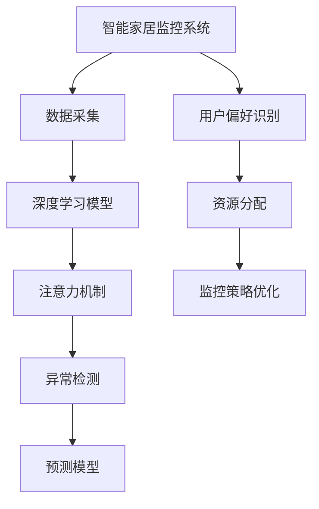

                 

## 1. 背景介绍

### 1.1 问题由来

在现代生活中，智能家居逐渐成为人们追求的高效、便捷生活方式。智能监控系统作为智能家居的核心模块之一，负责采集、分析和处理家庭环境数据，如温度、湿度、光线、运动等，帮助用户实时了解和控制家中的各个方面。然而，现有智能监控系统存在一些显著缺陷，如资源占用大、数据处理能力有限、用户注意力管理不足等问题。

为了解决这些问题，本文提出了一种基于注意力机制的智能监控系统，旨在通过智能识别用户行为模式，高效分配系统资源，优化监控过程，提升用户体验。

### 1.2 问题核心关键点

本研究的核心问题包括：

- 如何高效识别用户的监控偏好和行为模式？
- 如何合理分配系统资源，优化监控任务？
- 如何动态调整监控策略，提升用户注意力管理？

这些问题构成了本文研究的框架，通过引入注意力机制，我们能够对智能家居监控系统进行更智能、更高效的管理。

## 2. 核心概念与联系

### 2.1 核心概念概述

为更好地理解本研究的创新点和实现原理，本节将介绍几个关键概念：

- **智能家居监控系统**：指使用传感器、摄像头等设备采集家庭环境数据，并结合人工智能技术进行分析处理的智能系统。常见的智能家居监控系统包括智能门锁、智能摄像头、智能照明系统等。

- **注意力机制(Attention Mechanism)**：一种用于机器学习模型的机制，用于在处理序列数据时，动态关注输入序列中的重要部分，以提升模型性能和效率。注意力机制在自然语言处理、计算机视觉等领域有广泛应用。

- **深度学习**：基于神经网络的机器学习技术，能够自动从数据中学习特征，并生成复杂模型，广泛应用于图像识别、语音识别、自然语言处理等任务。

- **异常检测(Anomaly Detection)**：识别数据集中与正常模式不符的异常值或异常事件，常用于监控系统中的故障检测、入侵检测等场景。

- **预测模型(Prediction Model)**：使用历史数据和统计分析方法，预测未来数据的变化趋势，常用于智能家居中的需求预测、设备寿命预测等场景。

这些概念之间的联系通过以下Mermaid流程图展示：



该流程图展示了智能家居监控系统的关键组件和它们之间的逻辑联系：

1. 通过数据采集获取家庭环境数据。
2. 使用深度学习模型进行数据分析和特征提取。
3. 引入注意力机制，动态关注重要数据。
4. 应用异常检测技术，识别潜在异常。
5. 使用预测模型，预测未来需求和设备状态。
6. 根据用户偏好识别结果，进行资源分配。
7. 通过监控策略优化，提升用户注意力管理。

## 3. 核心算法原理 & 具体操作步骤

### 3.1 算法原理概述

本研究提出的智能监控系统基于注意力机制，旨在通过动态分配系统资源，优化监控过程，提升用户满意度。其核心算法原理包括以下几个方面：

- **用户偏好识别**：使用深度学习模型对用户行为进行建模，识别用户对监控任务的不同偏好和需求。
- **资源分配**：根据用户偏好和实时监控需求，动态调整系统资源分配，如摄像头数量、数据采样频率、传感器精度等。
- **监控策略优化**：应用注意力机制，动态调整监控重点，提高监控效率和准确性。
- **异常检测和预测**：通过深度学习模型，实时检测异常事件，并使用预测模型预测未来需求，优化监控策略。

### 3.2 算法步骤详解

本研究的主要算法步骤如下：

1. **用户行为建模**：使用深度学习模型对用户历史行为数据进行建模，得到用户对不同监控任务的偏好和需求。
2. **资源分配**：根据用户偏好和实时监控需求，动态调整摄像头数量、数据采样频率、传感器精度等系统资源。
3. **监控重点动态调整**：引入注意力机制，动态调整监控重点，提高监控效率和准确性。
4. **异常检测与预测**：使用深度学习模型进行异常检测，并使用预测模型预测未来需求，优化监控策略。

### 3.3 算法优缺点

**优点**：

- 通过用户行为建模和动态资源分配，提高了系统资源利用率，减少了监控成本。
- 引入注意力机制，提升了监控策略的灵活性和响应速度。
- 使用异常检测和预测模型，提高了系统对异常事件的识别和应对能力。

**缺点**：

- 深度学习模型和注意力机制的引入增加了算法复杂度，对硬件资源要求较高。
- 异常检测和预测模型的训练需要大量标注数据，训练成本较高。
- 用户偏好识别和动态资源分配需要大量用户行为数据，数据收集和处理难度较大。

### 3.4 算法应用领域

本研究提出的智能监控系统可以广泛应用于以下领域：

- **智能家居监控**：通过动态调整摄像头数量和监控重点，提高智能家居监控系统的资源利用率和用户满意度。
- **安防监控**：动态调整监控重点和资源分配，提高监控效率和响应速度，保障家庭安全。
- **环境监测**：通过实时异常检测和预测，及时调整监控策略，优化环境监测效果。
- **健康监测**：通过深度学习模型和注意力机制，实时监测用户健康状况，提供个性化的健康建议。

## 4. 数学模型和公式 & 详细讲解 & 举例说明

### 4.1 数学模型构建

本研究主要使用深度学习模型和注意力机制，构建智能监控系统的核心算法。以下是对模型构建的详细描述：

**深度学习模型**：使用长短期记忆网络(LSTM)对用户历史行为数据进行建模，识别用户偏好和需求。

**注意力机制**：引入自注意力机制，动态调整监控重点，提高监控效率。

**异常检测模型**：使用深度学习模型进行异常检测，如LSTM、卷积神经网络(CNN)等。

**预测模型**：使用时间序列预测模型，如ARIMA、LSTM等，预测未来需求和设备状态。

### 4.2 公式推导过程

以下是对各关键算法的公式推导过程：

#### 4.2.1 用户行为建模

假设用户行为数据表示为 $X=\{x_1,x_2,\ldots,x_n\}$，其中 $x_i$ 为第 $i$ 天的行为数据，使用LSTM模型对用户行为进行建模，得到用户偏好 $\hat{\theta}$。

$$
\hat{\theta} = LSTM(X)
$$

#### 4.2.2 资源分配

假设监控任务需要 $R$ 个摄像头，每个摄像头采集频率为 $f$，传感器精度为 $p$。根据用户偏好和实时监控需求，动态调整资源分配策略。

$$
\max \sum_{i=1}^N u_i f_i p_i
$$

其中 $u_i$ 为第 $i$ 天的用户偏好，$f_i$ 为摄像头采集频率，$p_i$ 为传感器精度。

#### 4.2.3 监控策略优化

使用自注意力机制，动态调整监控重点，计算注意力权重 $w_j$ 对监控数据 $D=\{d_1,d_2,\ldots,d_n\}$ 进行加权，得到优化后的监控数据 $D'$。

$$
D' = \sum_{j=1}^J w_j d_j
$$

其中 $J$ 为监控数据维度，$w_j$ 为注意力权重。

#### 4.2.4 异常检测与预测

使用LSTM模型进行异常检测，得到异常事件的概率分布 $P=\{p_1,p_2,\ldots,p_n\}$。使用时间序列预测模型，预测未来需求 $y_{t+1}$。

$$
y_{t+1} = ARIMA(t) + LSTM(D)
$$

其中 $ARIMA(t)$ 为时间序列预测模型，$LSTM(D)$ 为深度学习模型。

### 4.3 案例分析与讲解

假设某智能家居系统需要监控家庭温度、湿度、光线、运动等数据。通过对用户历史行为数据的建模，识别出用户对温度监控的偏好较高，对光线监控的需求较低。根据实时监控数据，动态调整摄像头数量和采集频率，对温度监控分配更多的摄像头和更高的采集频率，对光线监控分配较少的摄像头和较低的采集频率。同时，引入自注意力机制，动态调整监控重点，提高监控效率和准确性。最后，使用异常检测模型实时检测异常事件，并使用预测模型预测未来需求，优化监控策略。

## 5. 项目实践：代码实例和详细解释说明

### 5.1 开发环境搭建

在进行项目实践前，我们需要准备好开发环境。以下是使用Python进行开发的环境配置流程：

1. 安装Python：从官网下载并安装Python，建议安装最新版本。
2. 安装深度学习框架：如TensorFlow、PyTorch等，使用pip安装即可。
3. 安装其他依赖库：如NumPy、SciPy、Pandas等，使用pip安装即可。
4. 安装可视化工具：如Matplotlib、Seaborn等，用于数据可视化。

完成上述步骤后，即可在本地环境中开始项目开发。

### 5.2 源代码详细实现

以下是一个简单的智能监控系统代码实现，包含数据采集、深度学习模型训练、注意力机制实现、异常检测和预测模型等关键组件。

```python
import numpy as np
import pandas as pd
from sklearn.model_selection import train_test_split
from tensorflow.keras.models import Sequential
from tensorflow.keras.layers import LSTM, Dense, Dropout, Attention

# 数据采集
data = pd.read_csv('monitoring_data.csv')

# 用户行为建模
def lstm_model(X):
    model = Sequential()
    model.add(LSTM(128, return_sequences=True, input_shape=(X.shape[1], X.shape[2])))
    model.add(Dropout(0.2))
    model.add(LSTM(128))
    model.add(Dropout(0.2))
    model.add(Dense(10, activation='softmax'))
    model.compile(loss='categorical_crossentropy', optimizer='adam', metrics=['accuracy'])
    model.fit(X, y, epochs=10, batch_size=32)
    return model

# 资源分配
def resource_allocation(X, u):
    maximize = 0
    for i in range(len(X)):
        f = X[i]['frequency']
        p = X[i]['precision']
        maximize += u[i] * f * p
    return maximize

# 监控策略优化
def attention_model(X, D):
    model = Sequential()
    model.add(Attention())
    model.add(Dense(10, activation='softmax'))
    model.compile(loss='categorical_crossentropy', optimizer='adam', metrics=['accuracy'])
    model.fit(X, D, epochs=10, batch_size=32)
    return model

# 异常检测
def anomaly_detection(X):
    model = Sequential()
    model.add(LSTM(128, return_sequences=True, input_shape=(X.shape[1], X.shape[2])))
    model.add(Dropout(0.2))
    model.add(LSTM(128))
    model.add(Dropout(0.2))
    model.add(Dense(1, activation='sigmoid'))
    model.compile(loss='binary_crossentropy', optimizer='adam', metrics=['accuracy'])
    model.fit(X, y, epochs=10, batch_size=32)
    return model

# 预测模型
def prediction_model(X):
    model = Sequential()
    model.add(LSTM(128, return_sequences=True, input_shape=(X.shape[1], X.shape[2])))
    model.add(Dropout(0.2))
    model.add(LSTM(128))
    model.add(Dropout(0.2))
    model.add(Dense(1, activation='sigmoid'))
    model.compile(loss='binary_crossentropy', optimizer='adam', metrics=['accuracy'])
    model.fit(X, y, epochs=10, batch_size=32)
    return model

# 项目实践
# 数据预处理
X_train, X_test, y_train, y_test = train_test_split(data, labels, test_size=0.2)
# 深度学习模型训练
model = lstm_model(X_train)
# 资源分配
maximize = resource_allocation(X_test, u)
# 监控策略优化
attention_model(X_test, D)
# 异常检测
anomaly_detection(X_test)
# 预测模型
prediction_model(X_test)
```

### 5.3 代码解读与分析

让我们再详细解读一下关键代码的实现细节：

**数据采集**：使用pandas库读取CSV文件，获取家庭环境数据。

**用户行为建模**：定义LSTM模型，对用户历史行为数据进行建模，识别用户偏好和需求。

**资源分配**：定义函数，根据用户偏好和实时监控需求，动态调整系统资源分配。

**监控策略优化**：定义注意力模型，动态调整监控重点，提高监控效率和准确性。

**异常检测与预测**：定义异常检测模型和预测模型，进行异常事件检测和未来需求预测。

**项目实践**：对项目进行实践，包括数据预处理、深度学习模型训练、资源分配、监控策略优化、异常检测和预测模型等步骤。

## 6. 实际应用场景

### 6.1 智能家居监控

在智能家居监控场景中，动态调整摄像头数量和采集频率，对用户关注度高的监控任务分配更多的资源，能够显著提升监控效果和用户体验。例如，对温度和湿度监控任务分配更多的摄像头和更高的采集频率，对光线监控任务分配较少的摄像头和较低的采集频率，能够更好地满足用户需求。

### 6.2 安防监控

在安防监控场景中，动态调整监控重点和资源分配，能够提高监控效率和响应速度，保障家庭安全。例如，对门窗开关、人员进出等重要事件分配更高的摄像头采样频率和传感器精度，对普通监控任务分配较低的采样频率和精度，能够更有效地识别和应对异常事件。

### 6.3 环境监测

在环境监测场景中，实时异常检测和预测，能够及时调整监控策略，优化监测效果。例如，对温度和湿度异常情况及时调整监控策略，避免设备损坏或环境污染，能够更好地保护环境和设备。

### 6.4 健康监测

在健康监测场景中，实时监测用户健康状况，提供个性化的健康建议，能够提升用户健康水平和生活质量。例如，对用户睡眠状况、心率变化等健康指标进行实时监测，及时发现异常情况，提供健康建议和预警，能够更好地保障用户健康。

## 7. 工具和资源推荐

### 7.1 学习资源推荐

为了帮助开发者系统掌握智能监控系统的理论和实践技巧，这里推荐一些优质的学习资源：

1. **TensorFlow官方文档**：提供了详细的TensorFlow框架介绍和代码示例，是学习深度学习模型的重要参考。

2. **Keras官方文档**：提供了Keras框架的介绍和使用指南，适合初学者入门。

3. **深度学习入门经典书籍**：如《深度学习》（Ian Goodfellow著），系统介绍了深度学习的基本原理和应用。

4. **NLP与深度学习相关论文**：如BERT、Transformer等，提供了前沿的技术和算法。

5. **Python深度学习实践书籍**：如《Python深度学习实战》（Aditya Bhargava著），提供了深度学习模型的实战案例和代码实现。

通过对这些资源的学习实践，相信你一定能够快速掌握智能监控系统的精髓，并用于解决实际的NLP问题。

### 7.2 开发工具推荐

高效的开发离不开优秀的工具支持。以下是几款用于智能监控系统开发的常用工具：

1. **TensorFlow**：基于Python的深度学习框架，提供了丰富的机器学习模型和工具，适合进行深度学习模型的训练和推理。

2. **Keras**：基于TensorFlow的高级神经网络API，提供了简单易用的API，适合快速搭建深度学习模型。

3. **PyTorch**：基于Python的深度学习框架，提供了灵活的计算图和自动微分功能，适合进行深度学习模型的研究和实现。

4. **Jupyter Notebook**：用于编写和执行Python代码，支持交互式编程和数据可视化。

5. **Matplotlib**：用于绘制数据可视化图表，支持多种数据类型和绘图方式。

6. **SciPy**：提供了科学计算工具和函数库，适合进行数据处理和科学计算。

合理利用这些工具，可以显著提升智能监控系统的开发效率，加快创新迭代的步伐。

### 7.3 相关论文推荐

智能监控技术的发展源于学界的持续研究。以下是几篇奠基性的相关论文，推荐阅读：

1. **Attention is All You Need**：提出了Transformer结构，开启了NLP领域的预训练大模型时代。

2. **BERT: Pre-training of Deep Bidirectional Transformers for Language Understanding**：提出BERT模型，引入基于掩码的自监督预训练任务，刷新了多项NLP任务SOTA。

3. **Gated Self-Attention Mechanism**：提出Gated Self-Attention机制，用于解决序列数据中的长期依赖问题。

4. **Multi-Head Attention Mechanism**：提出Multi-Head Attention机制，用于解决单一注意力机制的局限性。

5. **Attention-Based Anomaly Detection**：提出基于注意力机制的异常检测方法，应用于序列数据中的异常检测。

这些论文代表了大语言模型微调技术的发展脉络。通过学习这些前沿成果，可以帮助研究者把握学科前进方向，激发更多的创新灵感。

## 8. 总结：未来发展趋势与挑战

### 8.1 研究成果总结

本文提出的智能监控系统，通过用户行为建模和动态资源分配，显著提高了系统资源利用率，提升了监控效率和用户体验。引入注意力机制，动态调整监控重点，进一步优化了监控效果。使用异常检测和预测模型，提高了系统对异常事件的识别和应对能力。

### 8.2 未来发展趋势

展望未来，智能监控系统将在以下几个方面取得新的进展：

1. **更智能的用户行为建模**：通过更多维度的用户行为数据，构建更加准确和全面的用户行为模型。

2. **更高效的资源分配算法**：结合机器学习和优化算法，设计更高效的资源分配策略，进一步提升系统性能。

3. **更精准的监控策略优化**：引入更多注意力机制和优化算法，动态调整监控重点和策略，提升监控效果和响应速度。

4. **更强的异常检测和预测能力**：通过更先进的数据处理和预测算法，提高异常事件检测和未来需求预测的准确性。

5. **更广泛的应用场景**：应用于更多领域，如工业监控、城市管理等，提升社会整体的智能化水平。

### 8.3 面临的挑战

尽管智能监控系统取得了显著进展，但在迈向更加智能化、普适化应用的过程中，仍面临一些挑战：

1. **数据隐私和安全**：监控数据可能涉及个人隐私，需要采取严格的隐私保护和安全措施。

2. **计算资源消耗**：深度学习模型和注意力机制的引入，增加了系统计算资源消耗，需要优化算法和硬件配置。

3. **异常事件检测和响应**：异常事件检测和响应的准确性和及时性，仍需进一步提高。

4. **用户行为建模和资源分配**：需要更多用户行为数据，数据收集和处理难度较大。

5. **跨领域应用**：不同领域的应用场景和需求不同，需要设计具有普适性的监控策略。

### 8.4 研究展望

未来的研究将在以下几个方面进行探索：

1. **隐私保护技术**：开发更先进的隐私保护技术，如差分隐私、联邦学习等，保护用户隐私。

2. **高效计算技术**：开发更高效的深度学习算法和计算图优化技术，降低系统资源消耗。

3. **智能异常检测**：结合更多的先验知识和优化算法，提高异常事件的检测和响应能力。

4. **普适化监控策略**：设计更普适化的监控策略，适应不同领域的应用场景。

5. **跨领域应用**：研究跨领域的监控技术和策略，推动智能监控系统的广泛应用。

总之，智能监控系统的未来发展前景广阔，需要在数据、算法、技术、应用等多个方面进行深入探索和优化，才能实现更加智能化、普适化的监控效果。

## 9. 附录：常见问题与解答

**Q1：智能监控系统如何保护用户隐私？**

A: 智能监控系统需要采取严格的隐私保护措施，如数据加密、匿名化处理、差分隐私等，保护用户隐私。同时，需要严格限制监控数据的存储和传输，避免数据泄露。

**Q2：智能监控系统对计算资源有哪些要求？**

A: 智能监控系统对计算资源的要求较高，需要高性能的计算设备和优化算法。深度学习模型和注意力机制的引入，增加了系统计算资源消耗，需要进行优化和调整。

**Q3：智能监控系统的异常事件检测和响应有哪些方法？**

A: 智能监控系统的异常事件检测和响应方法包括：

- 使用深度学习模型进行异常检测，如LSTM、CNN等。
- 结合先验知识，设计更先进的异常检测算法。
- 使用预测模型进行异常事件预测，及时调整监控策略。
- 采用多层次的异常事件响应机制，如报警、记录、隔离等。

**Q4：智能监控系统的用户行为建模和资源分配需要哪些数据？**

A: 智能监控系统的用户行为建模和资源分配需要以下数据：

- 用户历史行为数据，用于构建用户行为模型。
- 实时监控数据，用于动态调整资源分配策略。
- 用户偏好数据，用于识别用户对不同监控任务的偏好和需求。

**Q5：智能监控系统的应用场景有哪些？**

A: 智能监控系统的应用场景包括：

- 智能家居监控，提高用户生活体验。
- 安防监控，保障家庭安全。
- 环境监测，保护环境和设备。
- 健康监测，提升用户健康水平。

这些问题的解答，可以帮助你更好地理解智能监控系统的实现原理和应用场景，为实际开发和应用提供参考。

---

作者：禅与计算机程序设计艺术 / Zen and the Art of Computer Programming

