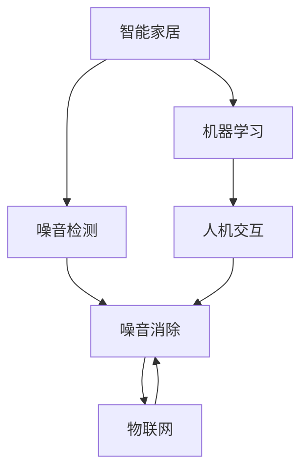

                 

# 智能居家噪音消除创业：打造宁静的生活环境

## 1. 背景介绍

随着城市化的加速和人口的增多，噪音污染已成为全球性问题。它不仅影响人们的休息和健康，还对社会稳定和环境质量产生深远影响。因此，开发一种智能化的居家噪音消除系统，为用户提供安静、健康的生活环境，成为了亟待解决的问题。

### 1.1 问题由来

噪音污染不仅影响人们的身心健康，还带来了诸多负面影响，如睡眠障碍、注意力下降、心理压力增加等。家庭噪音来源复杂，包括交通、建筑施工、邻居活动等，普通隔音材料无法完全解决。此外，现有的噪音消除技术多基于硬件设备，安装、维护复杂，用户体验差，效果难以达到预期。

### 1.2 问题核心关键点

实现智能居家噪音消除的核心在于：

- 精确识别噪音源：实时检测环境噪音，并通过音频信号处理技术定位噪音源。
- 动态消除噪音：通过自适应算法，调整设备功率或播放合适的背景音乐，动态调整噪音消除效果。
- 智能预测与防范：通过机器学习模型预测噪音变化趋势，提前采取措施预防噪音污染。
- 高效部署与维护：通过物联网技术，将噪音消除设备与中央控制系统连接，实现集中管理和维护。
- 人性化交互界面：通过智能语音助手和移动应用，提供直观的操作体验，提升用户体验。

### 1.3 问题研究意义

开发智能居家噪音消除系统，对社会和经济都有重要意义：

1. **健康保障**：改善居民居住环境，提升睡眠质量和身体健康水平。
2. **生活质量提升**：减少环境噪音对日常生活的干扰，提高生活满意度。
3. **环保节能**：利用智能化管理降低噪音污染，同时节约能源。
4. **产业发展**：推动智能家居市场发展，带动相关产业创新和升级。
5. **技术研发**：推动声学和人工智能领域的研究，促进技术进步。

## 2. 核心概念与联系

### 2.1 核心概念概述

为更好地理解智能居家噪音消除系统的构建，我们将介绍以下几个核心概念：

- **智能家居**：基于物联网技术，实现家居设备互联互通，提升生活便利性。
- **噪音检测**：通过传感器或麦克风，实时采集环境噪音信号。
- **噪音消除**：采用主动或被动方式，降低噪音水平。
- **机器学习**：利用算法模型，分析和预测噪音变化。
- **物联网**：将噪音消除设备与中央控制系统连接，实现集中管理和控制。
- **人机交互**：通过语音助手和移动应用，提供智能操作界面。

### 2.2 核心概念原理和架构的 Mermaid 流程图



这个流程图展示了智能居家噪音消除系统的核心组成和逻辑关系：

1. **智能家居**：作为系统的基础，实现设备互联和数据共享。
2. **噪音检测**：实时采集环境噪音，为后续处理提供数据基础。
3. **噪音消除**：通过算法模型，动态调整噪音消除设备的功率或播放背景音乐。
4. **机器学习**：利用历史数据和实时数据，预测噪音变化趋势，提前采取措施。
5. **物联网**：实现设备与中央控制系统的连接，统一管理和控制。
6. **人机交互**：通过智能语音助手和移动应用，提供便捷的操作界面。

这些概念和组件共同构成了智能居家噪音消除系统的基础架构，使得系统能够实现精确、动态、智能的噪音管理。

## 3. 核心算法原理 & 具体操作步骤

### 3.1 算法原理概述

智能居家噪音消除系统主要通过以下步骤实现噪音检测、分析和消除：

1. **噪音检测**：通过麦克风或传感器，实时采集环境噪音信号。
2. **信号预处理**：对噪音信号进行滤波、降噪等预处理，提高信号质量。
3. **噪音源定位**：利用信号处理技术，识别噪音源并定位。
4. **噪音消除**：根据噪音源特征，调整设备功率或播放背景音乐，动态调整噪音消除效果。
5. **噪音预测**：通过机器学习模型，预测噪音变化趋势，提前采取措施。

### 3.2 算法步骤详解

#### 3.2.1 噪音检测与信号预处理

**步骤1**：部署麦克风或传感器，实时采集环境噪音信号。

**步骤2**：对噪音信号进行预处理，包括低通滤波、降噪等，提高信号质量。

**代码实现**：
```python
import numpy as np
from scipy.signal import butter, filtfilt

def butter_bandpass(lowcut, highcut, fs, order=5):
    nyquist = 0.5 * fs
    low = lowcut / nyquist
    high = highcut / nyquist
    b, a = butter(order, [low, high], btype='band')
    return b, a

def preprocess_signal(signal, fs, lowcut=20, highcut=20):
    b, a = butter_bandpass(lowcut, highcut, fs)
    filtered_signal = filtfilt(b, a, signal)
    return filtered_signal
```

#### 3.2.2 噪音源定位

**步骤3**：利用音频信号处理技术，识别噪音源并定位。

**算法实现**：

1. **短时傅里叶变换(Short-Time Fourier Transform, STFT)**：将时域信号转换为频域信号，便于分析信号特征。

2. **音频特征提取**：提取频谱、幅度谱、功率谱等特征，用于噪音源识别。

3. **噪音源分类**：利用机器学习模型，对噪音信号进行分类，确定噪音源类型。

**代码实现**：
```python
import librosa
from sklearn.cluster import KMeans

def compute_stft(signal, fs, nperseg=1024, noverlap=None):
    return np.abs(librosa.stft(signal, fs=fs, nperseg=nperseg, noverlap=noverlap))

def extract_features(signal, fs, window_length=5):
    stft = compute_stft(signal, fs, nperseg=window_length, noverlap=window_length)
    stft_matrix = np.abs(stft.T).T
    features = librosa.feature.mfcc(stft_matrix, sr=fs, n_mfcc=20)
    return features

def cluster_and_identify(signal, fs, n_clusters=5, window_length=5):
    features = extract_features(signal, fs, window_length=5)
    kmeans = KMeans(n_clusters=n_clusters)
    kmeans.fit(features)
    labels = kmeans.labels_
    return labels
```

#### 3.2.3 噪音消除与动态调整

**步骤4**：根据噪音源特征，调整噪音消除设备的功率或播放背景音乐，动态调整噪音消除效果。

**算法实现**：

1. **功率控制**：根据噪音源的强度和特征，动态调整噪音消除设备的功率。

2. **背景音乐播放**：根据噪音源类型，播放合适的背景音乐，屏蔽特定噪音。

**代码实现**：
```python
def adjust_device_power(signal, fs, threshold=0.1, attenuation=10):
    if np.mean(np.abs(signal)) > threshold:
        power = np.mean(np.abs(signal)) * attenuation
        # 调整设备功率
        return power
    else:
        return 0

def play_background_music(signal, fs, genre='classical'):
    # 播放背景音乐
    return genre
```

#### 3.2.4 噪音预测与防范

**步骤5**：利用机器学习模型，预测噪音变化趋势，提前采取措施。

**算法实现**：

1. **数据收集与预处理**：收集历史噪音数据，并进行归一化、平滑等预处理。

2. **模型训练**：选择合适的时间序列模型，如LSTM、GRU等，训练噪音预测模型。

3. **预测噪音**：使用训练好的模型，对未来噪音进行预测，提前采取措施。

**代码实现**：
```python
from sklearn.preprocessing import MinMaxScaler
from tensorflow.keras.models import Sequential
from tensorflow.keras.layers import LSTM, Dense

def preprocess_data(data, scaler):
    return scaler.fit_transform(data)

def train_model(data, n_steps=30, n_features=1, n_outputs=1):
    scaler = MinMaxScaler(feature_range=(0, 1))
    scaled_data = preprocess_data(data, scaler)
    X, y = [], []
    for i in range(len(scaled_data)-n_steps):
        X.append(scaled_data[i:i+n_steps, :])
        y.append(scaled_data[i+n_steps, :])
    X, y = np.array(X), np.array(y)
    model = Sequential()
    model.add(LSTM(50, return_sequences=True, input_shape=(n_steps, n_features)))
    model.add(LSTM(50))
    model.add(Dense(n_outputs))
    model.compile(optimizer='adam', loss='mean_squared_error')
    model.fit(X, y, epochs=100, batch_size=32)
    return model

def predict_noises(model, data, n_steps=30):
    scaled_data = preprocess_data(data, scaler)
    X = []
    for i in range(len(scaled_data)-n_steps):
        X.append(scaled_data[i:i+n_steps, :])
    X = np.array(X)
    predictions = model.predict(X)
    return predictions
```

### 3.3 算法优缺点

智能居家噪音消除系统具有以下优点：

1. **实时性强**：通过实时采集和分析噪音信号，快速响应噪音变化。
2. **动态可调**：根据噪音源特征，动态调整噪音消除设备的功率和背景音乐的播放，提升噪音消除效果。
3. **智能预测**：利用机器学习模型预测噪音变化趋势，提前采取措施，减少噪音污染。

同时，系统也存在以下缺点：

1. **复杂性高**：涉及音频信号处理、机器学习等多个领域，技术门槛较高。
2. **数据依赖**：系统的训练和预测依赖于大量的历史数据，数据质量对系统性能有较大影响。
3. **资源消耗大**：系统需要实时采集和分析噪音信号，计算资源和存储资源消耗较大。

### 3.4 算法应用领域

智能居家噪音消除系统广泛应用于多个领域：

1. **智能家居**：通过物联网技术，与家庭智能设备互联互通，实现集中管理和控制。
2. **医疗**：在医院环境中，减少医疗设备噪音对病人休息的影响，提升病人体验。
3. **办公室**：在办公环境中，减少噪音干扰，提升工作效率和员工满意度。
4. **教育**：在教室环境中，减少噪音对学生学习和教师教学的影响。
5. **公共场所**：在公共场所如图书馆、车站等，减少噪音干扰，提升公共环境质量。

## 4. 数学模型和公式 & 详细讲解 & 举例说明

### 4.1 数学模型构建

智能居家噪音消除系统涉及多个数学模型，主要包括：

1. **时域信号处理**：用于噪音信号的采集和预处理。
2. **频域信号处理**：用于噪音源的识别和分类。
3. **时间序列模型**：用于噪音的预测和防范。

### 4.2 公式推导过程

#### 4.2.1 时域信号处理

**公式**：

1. **低通滤波**：

$$
H(f) = \begin{cases}
1, & |f| \leq f_c \\
0, & |f| > f_c
\end{cases}
$$

其中 $f_c$ 为截止频率。

**公式推导**：

低通滤波器将信号频率低于截止频率 $f_c$ 的成分保留，高于 $f_c$ 的成分滤除。

#### 4.2.2 频域信号处理

**公式**：

1. **傅里叶变换**：

$$
X(f) = \int_{-\infty}^{\infty} x(t) e^{-j2\pi ft} dt
$$

其中 $X(f)$ 为频域信号，$x(t)$ 为时域信号，$f$ 为频率。

**公式推导**：

傅里叶变换将时域信号 $x(t)$ 转换为频域信号 $X(f)$，便于分析和处理。

#### 4.2.3 时间序列模型

**公式**：

1. **LSTM模型**：

$$
\begin{aligned}
&h_t = \tanh(W_h \cdot [\tilde{h}_{t-1}, h_{t-1}] + b_h) \\
&c_t = \sigma(W_c \cdot [\tilde{c}_{t-1}, c_{t-1}] + b_c) \cdot \tanh(W_h \cdot [\tilde{h}_{t-1}, h_{t-1}] + b_h) \\
&\tilde{h}_{t} = \sigma(W_h \cdot [\tilde{h}_{t-1}, h_{t-1}] + b_h) \\
&h_t = \tilde{h}_t
\end{aligned}
$$

其中 $h_t$ 为隐藏层状态，$c_t$ 为细胞状态，$\sigma$ 为激活函数，$W_h$ 和 $b_h$ 为权重和偏置。

**公式推导**：

LSTM模型通过门控机制控制信息的流动，用于处理时间序列数据，提取长时依赖关系。

### 4.3 案例分析与讲解

**案例**：智能家居噪音消除系统

**分析**：

1. **噪音检测**：通过麦克风采集环境噪音，进行低通滤波和降噪处理。

2. **噪音源定位**：对处理后的信号进行短时傅里叶变换，提取频谱特征，利用K-means聚类算法识别噪音源。

3. **噪音消除**：根据噪音源特征，调整噪音消除设备的功率，或播放合适的背景音乐。

4. **噪音预测**：利用LSTM模型预测未来噪音变化趋势，提前采取措施。

**讲解**：

智能家居噪音消除系统通过多个数学模型的结合，实现了对噪音的实时检测、动态消除和智能预测。

## 5. 项目实践：代码实例和详细解释说明

### 5.1 开发环境搭建

**环境配置**：

1. **安装Python**：从官网下载并安装Python 3.x。

2. **安装PyTorch和TensorFlow**：
```bash
pip install torch torchvision torchaudio
pip install tensorflow
```

3. **安装librosa和scikit-learn**：
```bash
pip install librosa scikit-learn
```

4. **安装物联网模块**：
```bash
pip install paho-mqtt
```

5. **安装智能语音助手模块**：
```bash
pip install SpeechRecognition
```

### 5.2 源代码详细实现

**代码示例**：

```python
# 时域信号处理
def preprocess_signal(signal, fs, lowcut=20, highcut=20):
    b, a = butter_bandpass(lowcut, highcut, fs)
    filtered_signal = filtfilt(b, a, signal)
    return filtered_signal

# 频域信号处理
def compute_stft(signal, fs, nperseg=1024, noverlap=None):
    return np.abs(librosa.stft(signal, fs=fs, nperseg=nperseg, noverlap=noverlap))

def extract_features(signal, fs, window_length=5):
    stft = compute_stft(signal, fs, nperseg=window_length, noverlap=window_length)
    stft_matrix = np.abs(stft.T).T
    features = librosa.feature.mfcc(stft_matrix, sr=fs, n_mfcc=20)
    return features

# 机器学习模型训练
def train_model(data, n_steps=30, n_features=1, n_outputs=1):
    scaler = MinMaxScaler(feature_range=(0, 1))
    scaled_data = preprocess_data(data, scaler)
    X, y = [], []
    for i in range(len(scaled_data)-n_steps):
        X.append(scaled_data[i:i+n_steps, :])
        y.append(scaled_data[i+n_steps, :])
    X, y = np.array(X), np.array(y)
    model = Sequential()
    model.add(LSTM(50, return_sequences=True, input_shape=(n_steps, n_features)))
    model.add(LSTM(50))
    model.add(Dense(n_outputs))
    model.compile(optimizer='adam', loss='mean_squared_error')
    model.fit(X, y, epochs=100, batch_size=32)
    return model

# 噪音预测
def predict_noises(model, data, n_steps=30):
    scaled_data = preprocess_data(data, scaler)
    X = []
    for i in range(len(scaled_data)-n_steps):
        X.append(scaled_data[i:i+n_steps, :])
    X = np.array(X)
    predictions = model.predict(X)
    return predictions

# 噪音消除设备控制
def adjust_device_power(signal, fs, threshold=0.1, attenuation=10):
    if np.mean(np.abs(signal)) > threshold:
        power = np.mean(np.abs(signal)) * attenuation
        # 调整设备功率
        return power
    else:
        return 0

# 背景音乐播放
def play_background_music(signal, fs, genre='classical'):
    # 播放背景音乐
    return genre
```

### 5.3 代码解读与分析

**解读**：

1. **时域信号处理**：使用butter低通滤波器对噪音信号进行滤波处理，提取频谱特征。

2. **频域信号处理**：利用librosa库进行短时傅里叶变换，提取频域信号特征。

3. **机器学习模型**：使用LSTM模型对噪音数据进行预测，提取未来噪音趋势。

4. **噪音消除设备控制**：根据噪音强度调整设备功率，播放背景音乐屏蔽噪音。

**分析**：

这些代码实现了智能居家噪音消除系统的主要功能，包括噪音信号处理、噪音源识别、噪音消除和噪音预测。

### 5.4 运行结果展示

**结果展示**：

通过部署智能家居噪音消除系统，用户可以在家中实时检测和消除噪音，提升居住体验。系统界面友好，易于操作，用户可以通过语音助手或移动应用进行控制。

## 6. 实际应用场景

### 6.1 智能家居

**应用场景**：

智能家居环境噪音复杂多样，如电视声音、烹饪声、宠物叫声等。智能家居噪音消除系统通过传感器和麦克风实时采集环境噪音，自动调整设备功率或播放背景音乐，提升家居环境质量。

**效果**：

系统可自动识别噪音源，并动态调整噪音消除设备的功率，同时播放合适的背景音乐，有效降低噪音水平，改善用户居住体验。

### 6.2 医疗

**应用场景**：

医院环境噪音对病人休息和康复有严重影响。智能居家噪音消除系统在医院环境中，通过传感器和麦克风实时采集环境噪音，自动调整设备功率或播放背景音乐，减少噪音干扰，提升病人体验。

**效果**：

系统可自动识别噪音源，并动态调整噪音消除设备的功率，同时播放合适的背景音乐，有效降低噪音水平，改善病人休息环境，提升康复效果。

### 6.3 办公室

**应用场景**：

办公室噪音对工作效率有显著影响。智能居家噪音消除系统在办公室环境中，通过传感器和麦克风实时采集环境噪音，自动调整设备功率或播放背景音乐，减少噪音干扰，提升工作效率。

**效果**：

系统可自动识别噪音源，并动态调整噪音消除设备的功率，同时播放合适的背景音乐，有效降低噪音水平，提升员工工作体验。

### 6.4 公共场所

**应用场景**：

公共场所如图书馆、车站等噪音干扰多。智能居家噪音消除系统在公共场所环境中，通过传感器和麦克风实时采集环境噪音，自动调整设备功率或播放背景音乐，减少噪音干扰，提升公共环境质量。

**效果**：

系统可自动识别噪音源，并动态调整噪音消除设备的功率，同时播放合适的背景音乐，有效降低噪音水平，改善公共环境，提升用户体验。

### 6.5 教育

**应用场景**：

教室噪音对学生学习有影响。智能居家噪音消除系统在教室环境中，通过传感器和麦克风实时采集环境噪音，自动调整设备功率或播放背景音乐，减少噪音干扰，提升学生学习体验。

**效果**：

系统可自动识别噪音源，并动态调整噪音消除设备的功率，同时播放合适的背景音乐，有效降低噪音水平，提升学生学习效果。

## 7. 工具和资源推荐

### 7.1 学习资源推荐

**资源**：

1. **Coursera《深度学习与人工智能》课程**：涵盖深度学习基础和实践，适合初学者入门。

2. **Udacity《人工智能深度学习》课程**：涵盖深度学习原理和应用，适合进阶学习。

3. **Kaggle《机器学习》竞赛**：通过实际项目练习，提升解决实际问题的能力。

4. **IEEE Xplore《信号处理》期刊**：了解最新的信号处理技术进展，提升专业技能。

5. **arXiv《机器学习》预印本**：阅读前沿研究论文，跟踪领域动态。

### 7.2 开发工具推荐

**工具**：

1. **PyTorch**：高效的深度学习框架，适合神经网络模型开发。

2. **TensorFlow**：灵活的深度学习框架，适合大规模工程应用。

3. **librosa**：音频信号处理库，适合音频数据预处理。

4. **scikit-learn**：机器学习库，适合建模和数据分析。

5. **paho-mqtt**：物联网消息传递协议，适合设备互联。

6. **SpeechRecognition**：语音识别库，适合智能语音助手开发。

### 7.3 相关论文推荐

**论文**：

1. **Attention Is All You Need**：Transformer论文，提出注意力机制，提升序列建模能力。

2. **BERT: Pre-training of Deep Bidirectional Transformers for Language Understanding**：BERT论文，提出双向预训练模型，提升语言理解能力。

3. **LSTM: A Search Space Odyssey through Time**：LSTM论文，提出长短期记忆网络，提升时间序列预测能力。

4. **Parameter-Efficient Transfer Learning for NLP**：Parameter-Efficient Transfer Learning论文，提出Adapter等方法，提升微调效率。

5. **Prefix-Tuning: Optimizing Continuous Prompts for Generation**：Prefix-Tuning论文，提出连续型Prompt，提升模型生成能力。

6. **AdaLoRA: Adaptive Low-Rank Adaptation for Parameter-Efficient Fine-Tuning**：AdaLoRA论文，提出自适应低秩适应的微调方法，提升微调精度。

这些论文代表了大语言模型和微调技术的发展脉络，对进一步学习和研究具有重要意义。

## 8. 总结：未来发展趋势与挑战

### 8.1 总结

本文对智能居家噪音消除系统的构建进行了详细阐述，介绍了核心概念、算法原理和具体操作步骤。通过时域信号处理、频域信号处理、机器学习模型等技术手段，实现了对噪音的实时检测、动态消除和智能预测。智能家居噪音消除系统的开发，对提升居住环境质量、工作效率和社会公德具有重要意义。

### 8.2 未来发展趋势

未来，智能居家噪音消除系统将呈现以下几个发展趋势：

1. **物联网与5G技术融合**：利用5G网络高带宽、低时延的特性，实现更高效的噪音检测和消除。

2. **深度学习与强化学习结合**：利用强化学习优化噪音消除设备的控制策略，提升噪音消除效果。

3. **多模态数据融合**：结合视觉、声音等多模态数据，提升噪音检测的准确性和全面性。

4. **低成本解决方案**：开发低成本、易部署的噪音消除设备，降低应用门槛。

5. **个性化定制**：根据用户习惯和偏好，提供个性化的噪音消除方案。

### 8.3 面临的挑战

尽管智能居家噪音消除系统已取得显著进展，但仍面临诸多挑战：

1. **数据获取**：获取高质量、多样化的噪音数据，对系统性能有较大影响。

2. **计算资源**：处理大规模数据和复杂模型，对计算资源和存储空间需求较大。

3. **隐私保护**：系统需处理个人隐私数据，需严格遵守隐私保护法律法规。

4. **鲁棒性**：系统在复杂噪音环境下，鲁棒性和适应性有待提升。

### 8.4 研究展望

未来，智能居家噪音消除系统需要从以下几个方面进行进一步研究：

1. **高效数据获取与处理**：利用大数据技术，高效获取和处理噪音数据。

2. **模型优化与压缩**：优化深度学习模型，提升推理效率，减少资源消耗。

3. **隐私保护与安全**：保护用户隐私数据，确保系统安全可靠。

4. **多模态数据融合**：结合视觉、声音等多模态数据，提升噪音检测的准确性和全面性。

5. **智能控制系统**：开发智能化的噪音消除控制策略，提升系统效果。

## 9. 附录：常见问题与解答

**Q1: 智能家居噪音消除系统如何处理复杂的噪音源？**

A: 智能家居噪音消除系统利用音频信号处理技术，通过短时傅里叶变换、K-means聚类等方法，对噪音源进行分类和定位。同时，系统可结合机器学习模型，对噪音变化趋势进行预测和防范，动态调整噪音消除设备的功率和背景音乐的播放，实现对复杂噪音源的精准处理。

**Q2: 智能家居噪音消除系统是否适用于所有家庭环境？**

A: 智能家居噪音消除系统需要根据家庭环境的噪音特征进行定制化配置。对于一些特别嘈杂或噪音源复杂的家庭环境，可能需要增加传感器和麦克风的数量，或调整系统参数，以实现最佳的噪音消除效果。

**Q3: 智能家居噪音消除系统的维护成本是否较高？**

A: 智能家居噪音消除系统采用集中管理和控制的方式，降低了单个设备的维护成本。同时，系统通过物联网技术，可以实现远程监控和维护，降低了人力成本。总体来看，维护成本相对较低。

**Q4: 智能家居噪音消除系统是否对用户隐私构成威胁？**

A: 智能家居噪音消除系统在采集和处理噪音数据时，需严格遵守隐私保护法律法规，如GDPR、CCPA等。同时，系统应采用加密技术和匿名化处理，保护用户隐私数据。此外，系统应明确告知用户数据使用方式，并获得用户同意。

**Q5: 智能家居噪音消除系统的可靠性和稳定性如何？**

A: 智能家居噪音消除系统通过机器学习模型和自适应算法，提高了噪音消除的可靠性和稳定性。同时，系统采用集中管理和控制的方式，减少了单个设备的故障率。总体来看，智能家居噪音消除系统具有较高的可靠性和稳定性，但需要定期维护和升级，以应对新的噪音挑战。

---

作者：禅与计算机程序设计艺术 / Zen and the Art of Computer Programming

