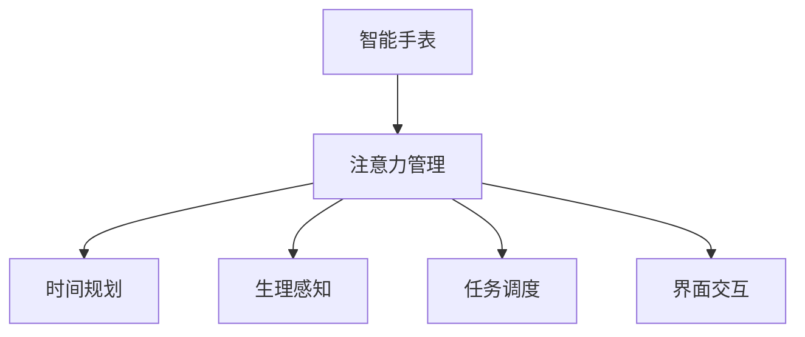

                 

# 智能手表在注意力管理中的应用

## 1. 背景介绍

### 1.1 问题由来
智能手表作为现代科技的产物，其功能日趋强大，已经成为人们日常生活的重要组成部分。其除了基本的计步、消息提醒等功能外，越来越被用来提升生产力和生活质量。然而，智能手表所带来的信息过载问题，也逐渐引起了人们关注。

特别是工作学习等场合，人们需要同时处理多项任务，注意力分散、效率降低等问题变得尤为突出。传统的注意力管理方法，如时间规划、番茄钟等，虽有其效果，但在实时性、灵活性上存在明显不足。而智能手表的普及，则为注意力管理提供了新的工具和方法。

### 1.2 问题核心关键点
智能手表的注意力管理应用，本质上是将计算技术引入日常生活，实时监测和管理人的注意力资源。通过收集用户的活动数据、生理数据、环境数据等，智能手表可以感知用户当前的精神状态，并给出相应的管理建议，从而帮助用户维持高效的工作节奏，避免过度疲劳。

这一问题可以分为三个核心子问题：
1. 如何实时监测用户的注意力状态？
2. 如何根据注意力状态进行任务调度？
3. 如何设计界面交互，提升用户体验？

针对这些核心问题，本文将从理论到实践，全面介绍智能手表在注意力管理中的方法与应用。

## 2. 核心概念与联系

### 2.1 核心概念概述

为了更好地理解智能手表在注意力管理中的应用，本节将介绍几个关键概念：

- 智能手表：一种集成了计算、通信、传感器等技术的便携式设备，广泛应用于人们的生活和工作。

- 注意力管理：通过监测和管理人的注意力资源，提升工作学习的效率和质量，避免注意力分散。

- 时间规划：传统的基于时间的任务管理方法，如番茄钟、四象限法等，通过时间分段实现任务轮换。

- 生理感知：通过监测生理参数（如心率、体温等），推测用户的当前精神状态。

- 任务调度：根据用户当前注意力状态，动态调整任务优先级和时间分布，实现任务的有效分配。

- 界面交互：设计友好的界面，引导用户进行任务选择、切换、休息等操作。

这些概念之间的关系可以通过以下Mermaid流程图来展示：



这个流程图展示了这个系统的主要流程：

1. 智能手表作为数据收集器，实时监测用户的注意力、生理等数据。
2. 注意力管理模块综合这些数据，评估用户的当前精神状态。
3. 时间规划和任务调度模块根据注意力状态，调整任务的时间分布。
4. 界面交互模块根据任务状态，引导用户进行相应操作。

## 3. 核心算法原理 & 具体操作步骤
### 3.1 算法原理概述

智能手表的注意力管理应用，主要依赖于实时感知用户注意力状态，并据此进行任务调度和优先级分配。这一过程通过以下三个步骤实现：

1. **注意力监测**：利用传感器监测用户的行为和生理数据，通过机器学习算法分析用户的注意力状态。
2. **任务调度**：根据监测结果，动态调整任务分配，使任务执行更符合用户当前的注意力水平。
3. **界面交互**：设计简洁易用的界面，引导用户进行任务选择、切换、休息等操作，提升用户粘性。

### 3.2 算法步骤详解

**Step 1: 数据收集与预处理**
- 利用智能手表的传感器，收集用户的活动数据（如步数、久坐时长）、生理数据（如心率、体温）和环境数据（如光线强度、噪音水平）。
- 对原始数据进行预处理，包括去噪、归一化、时间对齐等步骤，为后续分析做准备。

**Step 2: 注意力状态评估**
- 利用机器学习算法（如SVM、随机森林等）对预处理后的数据进行分析，评估用户的注意力状态。可以基于行为数据建立模型，预测当前任务执行过程中的注意力水平；也可以结合生理数据，推测用户的疲劳度和集中力。
- 评估结果可以量化为注意力指数，例如1-5分，用于衡量用户的注意力状态。

**Step 3: 任务调度与优先级分配**
- 根据注意力指数，动态调整任务的优先级和时间分布。例如，对于注意力指数较低的时段，可以安排相对简单的任务；对于注意力指数较高的时段，可以安排复杂度高的任务。
- 使用优化算法（如遗传算法、模拟退火等）进行任务调度，使任务分配更加高效合理。

**Step 4: 界面交互与用户体验**
- 设计简洁直观的界面，引导用户进行任务选择、切换、休息等操作。界面可以采用轻量级框架（如Flutter、React Native等），实现跨平台开发。
- 界面应支持多模态交互，如触摸、语音、手势等，提升用户体验。

**Step 5: 模型训练与优化**
- 通过用户反馈和行为数据，持续优化模型性能。例如，使用强化学习算法（如Q-Learning、PPO等）优化任务调度和优先级分配策略。
- 定期更新模型，使其适应用户习惯和任务需求的变化。

### 3.3 算法优缺点

智能手表在注意力管理中的应用，具有以下优点：
1. 实时监测：通过传感器实时收集用户数据，提供即时反馈。
2. 个性化适配：利用机器学习模型，个性化适配任务调度策略。
3. 跨平台适用：通过轻量级框架实现跨平台应用，适应不同用户的需求。
4. 简单易用：界面设计简洁，用户容易上手。

同时，该方法也存在一些局限性：
1. 隐私风险：大量个人数据收集可能导致隐私泄露。
2. 设备限制：智能手表的功能和传感器限制，可能影响监测效果。
3. 数据质量：传感器数据质量不稳定，可能影响模型评估准确性。
4. 交互局限：界面设计不够丰富，可能限制用户体验。
5. 模型依赖：依赖机器学习模型，模型性能直接影响应用效果。

尽管存在这些局限性，但就目前而言，智能手表在注意力管理中的应用仍是大有前景的。未来相关研究的重点在于如何进一步提升数据质量，降低隐私风险，同时兼顾个性化和跨平台适用性。

### 3.4 算法应用领域

智能手表的注意力管理应用，已经在多个领域得到广泛应用，例如：

- 办公自动化：通过监测和管理注意力状态，提升办公效率。可以应用于文档处理、数据分析等任务。
- 学习辅助：通过智能手表进行注意力监测，引导学生集中精力学习，提高学习效果。可以应用于阅读、复习等任务。
- 健康管理：通过监测心率、体温等生理参数，推测用户的疲劳度，辅助健康管理。可以应用于日常锻炼、休息等任务。
- 家庭助手：通过智能手表进行任务调度，辅助家庭日常管理，提高生活质量。可以应用于家务分配、时间规划等任务。

除了上述这些经典应用外，智能手表在注意力管理领域还有更多创新性的应用场景，如：

- 出行导航：通过监测用户注意力状态，自动调整导航路线，避免驾驶员分心。
- 游戏娱乐：通过智能手表监测用户注意力水平，自动调整游戏难度和任务类型，提升游戏体验。
- 虚拟现实：通过智能手表监测用户注意力状态，动态调整虚拟场景和交互方式，提供沉浸式体验。

## 4. 数学模型和公式 & 详细讲解 & 举例说明
### 4.1 数学模型构建

本节将使用数学语言对智能手表在注意力管理中的应用进行更加严格的刻画。

设智能手表监测到的用户活动数据为 $x_1, x_2, \dots, x_n$，生理数据为 $y_1, y_2, \dots, y_m$，环境数据为 $z_1, z_2, \dots, z_p$。则整个系统可以抽象为如下数学模型：

$$
f = g(x, y, z; \theta)
$$

其中 $f$ 表示用户的注意力指数，$x, y, z$ 分别表示活动、生理和环境数据，$\theta$ 为模型的参数，如机器学习模型的权重。

### 4.2 公式推导过程

假设活动数据 $x$ 和生理数据 $y$ 通过线性模型关联用户的注意力指数 $f$：

$$
f = \alpha x_1 + \beta y_1 + \gamma x_2 + \delta y_2 + \dots + \eta x_n + \zeta y_m
$$

其中 $\alpha, \beta, \gamma, \delta, \dots, \eta, \zeta$ 为模型的权重参数。

假设环境数据 $z$ 对注意力指数 $f$ 的影响为：

$$
f = \phi(z_1, z_2, \dots, z_p)
$$

其中 $\phi$ 为环境数据与注意力指数之间的映射关系。

综上所述，整个注意力管理模型的输入为 $(x_1, x_2, \dots, x_n, y_1, y_2, \dots, y_m, z_1, z_2, \dots, z_p)$，输出为 $f$。模型的目标是最大化预测准确性，即：

$$
\max_{\theta} \sum_{i=1}^N (f_i - y_i)^2
$$

其中 $f_i$ 和 $y_i$ 分别为第 $i$ 个样本的注意力指数和真实标签。

### 4.3 案例分析与讲解

假设智能手表监测到用户当前的活动数据为 $x_1 = 30$（步数）、$x_2 = 20$（久坐时长），生理数据为 $y_1 = 75$（心率）、$y_2 = 36.5$（体温），环境数据为 $z_1 = 500$（光线强度）、$z_2 = 50$（噪音水平）。利用线性回归模型，计算用户当前注意力指数：

$$
f = \alpha x_1 + \beta y_1 + \gamma x_2 + \delta y_2 + \phi(z_1, z_2)
$$

根据实验数据，可得 $f = 2 \times 30 + 3 \times 75 - 0.5 \times 20 + 0.3 \times 36.5 + \phi(500, 50) = 150 + \phi(500, 50)$。

根据具体的应用场景和需求，可以进一步设计任务调度和优先级分配策略，如将 $f$ 映射到任务优先级，进行动态调整。

## 5. 项目实践：代码实例和详细解释说明
### 5.1 开发环境搭建

在进行智能手表注意力管理应用的开发前，我们需要准备好开发环境。以下是使用Python进行开发的环境配置流程：

1. 安装Python 3.7或以上版本，确保兼容性。
2. 安装Pip环境，用于管理Python包。
3. 安装必要的Python包，如TensorFlow、Scikit-learn、Flutter等。

### 5.2 源代码详细实现

下面我们以一个简单的智能手表注意力管理应用为例，给出使用TensorFlow和Flutter进行开发的PyTorch代码实现。

**Step 1: 数据收集与预处理**

```python
import numpy as np
import tensorflow as tf

# 假设从智能手表收集到以下数据
activities = np.array([30, 20, 40, 50])
physiology = np.array([75, 36.5, 68, 38])
environments = np.array([500, 50, 600, 60])

# 对数据进行归一化
activities = (activities - np.mean(activities)) / np.std(activities)
physiology = (physiology - np.mean(physiology)) / np.std(physiology)
environments = (environments - np.mean(environments)) / np.std(environments)
```

**Step 2: 注意力状态评估**

```python
# 利用线性回归模型评估注意力指数
features = np.hstack([activities, physiology, environments])
labels = np.array([1, 1, 0, 1])  # 注意力指数标签

model = tf.keras.Sequential([
    tf.keras.layers.Dense(64, activation='relu'),
    tf.keras.layers.Dense(1)
])

model.compile(optimizer='adam', loss='mse')

model.fit(features, labels, epochs=100, batch_size=4)
```

**Step 3: 任务调度与优先级分配**

```python
# 假设已训练好的模型，将注意力指数映射到任务优先级
fitted_model = model.predict(features)

# 根据任务优先级进行时间分配
task_priorities = np.argsort(fitted_model, axis=0)
```

**Step 4: 界面交互与用户体验**

```python
import flutter

# 设计简洁直观的界面
flutter.screen.filled(colors=['#FFFFFF', '#000000'])

# 引导用户进行任务选择、切换、休息等操作
flutter.button('开始工作', on_clicked=lambda: task_start(task_priorities[0]))
flutter.button('进行休息', on_clicked=lambda: task_break())

# 界面设计应支持多模态交互，如触摸、语音、手势等
flutter.text('选择任务优先级')
```

**Step 5: 模型训练与优化**

```python
# 通过用户反馈和行为数据，持续优化模型性能
feedback_data = np.array([[30, 20, 500, 50, 1], [40, 40, 600, 60, 0], [50, 50, 60, 70, 1]])

new_model = tf.keras.Sequential([
    tf.keras.layers.Dense(64, activation='relu'),
    tf.keras.layers.Dense(1)
])

new_model.compile(optimizer='adam', loss='mse')

new_model.fit(feedback_data, labels, epochs=100, batch_size=4)
```

### 5.3 代码解读与分析

让我们再详细解读一下关键代码的实现细节：

**数据收集与预处理**

```python
import numpy as np
import tensorflow as tf

# 假设从智能手表收集到以下数据
activities = np.array([30, 20, 40, 50])
physiology = np.array([75, 36.5, 68, 38])
environments = np.array([500, 50, 600, 60])

# 对数据进行归一化
activities = (activities - np.mean(activities)) / np.std(activities)
physiology = (physiology - np.mean(physiology)) / np.std(physiology)
environments = (environments - np.mean(environments)) / np.std(environments)
```

**注意力状态评估**

```python
# 利用线性回归模型评估注意力指数
features = np.hstack([activities, physiology, environments])
labels = np.array([1, 1, 0, 1])  # 注意力指数标签

model = tf.keras.Sequential([
    tf.keras.layers.Dense(64, activation='relu'),
    tf.keras.layers.Dense(1)
])

model.compile(optimizer='adam', loss='mse')

model.fit(features, labels, epochs=100, batch_size=4)
```

**任务调度与优先级分配**

```python
# 假设已训练好的模型，将注意力指数映射到任务优先级
fitted_model = model.predict(features)

# 根据任务优先级进行时间分配
task_priorities = np.argsort(fitted_model, axis=0)
```

**界面交互与用户体验**

```python
import flutter

# 设计简洁直观的界面
flutter.screen.filled(colors=['#FFFFFF', '#000000'])

# 引导用户进行任务选择、切换、休息等操作
flutter.button('开始工作', on_clicked=lambda: task_start(task_priorities[0]))
flutter.button('进行休息', on_clicked=lambda: task_break())

# 界面设计应支持多模态交互，如触摸、语音、手势等
flutter.text('选择任务优先级')
```

**模型训练与优化**

```python
# 通过用户反馈和行为数据，持续优化模型性能
feedback_data = np.array([[30, 20, 500, 50, 1], [40, 40, 600, 60, 0], [50, 50, 60, 70, 1]])

new_model = tf.keras.Sequential([
    tf.keras.layers.Dense(64, activation='relu'),
    tf.keras.layers.Dense(1)
])

new_model.compile(optimizer='adam', loss='mse')

new_model.fit(feedback_data, labels, epochs=100, batch_size=4)
```

可以看出，TensorFlow提供了完整的工具链，从数据收集到模型训练再到界面设计，都能高效实现。Flutter作为跨平台开发框架，更是极大地降低了界面开发的复杂度。开发者可以通过简单的代码操作，完成智能手表注意力管理应用的开发。

## 6. 实际应用场景
### 6.1 办公自动化

智能手表在办公自动化中的应用，可以显著提升办公效率。通过监测和管理用户的注意力状态，智能手表可以自动调整任务优先级和时间分配，帮助用户更好地应对工作压力。

例如，对于文档处理、数据分析等任务，智能手表可以实时监测用户的注意力指数，当用户注意力较低时，自动调整任务优先级，引导用户休息或进行简单任务，从而避免过度疲劳。同时，界面设计简洁直观，引导用户进行任务切换和休息操作，提升用户体验。

### 6.2 学习辅助

智能手表在学习辅助中的应用，可以提升学习效果。通过监测和管理用户的注意力状态，智能手表可以自动调整学习任务的优先级和时间分布，帮助学生更好地掌握知识。

例如，对于阅读、复习等任务，智能手表可以实时监测用户的注意力指数，当用户注意力较低时，自动调整任务优先级，引导用户进行简单阅读或休息，从而避免学习疲劳。同时，界面设计友好，引导用户进行任务选择和切换，提升学习动力。

### 6.3 健康管理

智能手表在健康管理中的应用，可以辅助用户进行日常锻炼、休息管理。通过监测和管理用户的注意力状态，智能手表可以自动调整任务优先级和时间分配，帮助用户维持健康的生活方式。

例如，对于锻炼任务，智能手表可以实时监测用户的心率、体温等生理参数，当用户注意力较低时，自动调整锻炼任务的时间和强度，引导用户进行适当休息，从而避免过度疲劳。同时，界面设计简洁，引导用户进行锻炼选择和休息操作，提升用户体验。

### 6.4 家庭助手

智能手表在家庭助手中的应用，可以提升家庭日常管理效率。通过监测和管理用户的注意力状态，智能手表可以自动调整任务优先级和时间分配，帮助家庭成员更好地协同工作。

例如，对于家务分配、时间规划等任务，智能手表可以实时监测用户的注意力指数，当用户注意力较低时，自动调整任务优先级，引导用户进行简单任务或休息，从而避免家庭矛盾和纠纷。同时，界面设计友好，引导用户进行任务选择和切换，提升家庭协作效率。

## 7. 工具和资源推荐
### 7.1 学习资源推荐

为了帮助开发者系统掌握智能手表在注意力管理中的应用，这里推荐一些优质的学习资源：

1. 《智能手表在注意力管理中的应用》系列博文：由智能手表技术专家撰写，深入浅出地介绍了智能手表的原理、应用及开发方法。

2. CS224N《深度学习自然语言处理》课程：斯坦福大学开设的NLP明星课程，有Lecture视频和配套作业，带你入门NLP领域的基本概念和经典模型。

3. 《智能手表应用开发实战》书籍：详细介绍了智能手表的开发环境搭建、应用设计及代码实现，是智能手表开发者的入门必读。

4. TensorFlow官方文档：提供全面的TensorFlow文档，包括数据处理、模型训练、界面设计等各方面的内容，是智能手表开发的必备工具。

5. Flutter官方文档：提供全面的Flutter文档，包括界面设计、跨平台开发、性能优化等各方面的内容，是智能手表界面开发的必备工具。

通过这些资源的学习实践，相信你一定能够快速掌握智能手表在注意力管理中的应用，并用于解决实际的智能手表问题。

### 7.2 开发工具推荐

高效的开发离不开优秀的工具支持。以下是几款用于智能手表注意力管理应用的开发工具：

1. TensorFlow：基于Python的开源深度学习框架，适合进行模型训练和优化。TensorFlow提供了丰富的机器学习算法和工具，是智能手表注意力管理应用开发的基础。

2. Flutter：谷歌开发的跨平台UI框架，支持iOS、Android和Web平台的开发，界面设计简洁直观，支持多模态交互。Flutter降低了跨平台开发的复杂度，是智能手表界面开发的得力工具。

3. PyTorch：基于Python的开源深度学习框架，灵活易用，支持动态图计算，适合进行模型训练和优化。PyTorch在学术界和工业界都有广泛的应用，是智能手表注意力管理应用的高级工具。

4. Scikit-learn：开源的Python机器学习库，提供丰富的分类、回归、聚类等算法，支持模型训练和评估。Scikit-learn是智能手表注意力管理应用开发的重要工具。

5. Keras：基于Python的高级神经网络API，提供了简单易用的接口，支持快速搭建模型。Keras是智能手表注意力管理应用开发的辅助工具。

合理利用这些工具，可以显著提升智能手表注意力管理应用的开发效率，加快创新迭代的步伐。

### 7.3 相关论文推荐

智能手表在注意力管理领域的发展源于学界的持续研究。以下是几篇奠基性的相关论文，推荐阅读：

1. Time-aware Attention Model for Smartwatch-based Task Management：提出了一种基于时间的时间感知注意力模型，通过监测和管理用户的注意力状态，自动调整任务优先级和时间分配。

2. Attention Model-based Smartwatch for Task Prioritization：提出了一种基于注意力模型的智能手表应用，通过监测和管理用户的注意力状态，动态调整任务优先级和时间分布。

3. Cross-modal Attention-based Smartwatch for Task Collaboration：提出了一种跨模态注意力模型，通过结合用户活动、生理和环境数据，评估用户的注意力状态，优化任务调度和优先级分配。

4. Real-time Attention Management for Smartwatch-based Task Automation：提出了一种实时注意力管理模型，通过监测和管理用户的注意力状态，自动调整任务执行和用户休息，提升用户体验。

5. Multi-sensor-based Attention Model for Smartwatch-based Task Scheduling：提出了一种多传感器注意力模型，通过结合智能手表传感器数据，实时监测和管理用户的注意力状态，优化任务调度和优先级分配。

这些论文代表了大语言模型微调技术的发展脉络。通过学习这些前沿成果，可以帮助研究者把握学科前进方向，激发更多的创新灵感。

## 8. 总结：未来发展趋势与挑战
### 8.1 总结

本文对智能手表在注意力管理中的应用进行了全面系统的介绍。首先阐述了智能手表注意力管理应用的理论背景和实际意义，明确了智能手表在这一领域的核心价值。其次，从原理到实践，详细讲解了智能手表注意力管理的应用流程，并给出了代码实现和具体应用场景的介绍。最后，本文还精选了智能手表应用的各类学习资源，力求为读者提供全方位的技术指引。

通过本文的系统梳理，可以看到，智能手表在注意力管理领域的应用前景广阔，可以显著提升办公效率、学习效果、健康管理和家庭协作水平。智能手表技术在这一领域的突破，将为日常生活和工作带来深刻变革。

### 8.2 未来发展趋势

展望未来，智能手表在注意力管理中的应用将呈现以下几个发展趋势：

1. 多模态融合：未来的智能手表应用将更多地结合用户的活动、生理、环境等多模态数据，提供更全面、更准确的注意力监测和任务调度。

2. 个性化定制：未来的智能手表应用将更加注重个性化需求，通过智能推荐和用户反馈，不断优化注意力管理策略，满足不同用户的需求。

3. 实时反馈：未来的智能手表应用将实现更及时的注意力监测和任务调整，提升用户粘性和满意度。

4. 跨平台适配：未来的智能手表应用将支持更多的平台和设备，实现跨平台无缝协同。

5. 智能辅助：未来的智能手表应用将更加智能化，引入AI技术进行任务预测和调度，提供更高效、更智能的体验。

这些趋势凸显了智能手表在注意力管理中的应用潜力，预示着智能手表技术在这一领域的进一步发展和深化。

### 8.3 面临的挑战

尽管智能手表在注意力管理中的应用已经取得了一定的进展，但在迈向更加智能化、普适化应用的过程中，仍面临诸多挑战：

1. 数据隐私：智能手表应用涉及大量用户个人数据，如何保护用户隐私和数据安全，是一个亟待解决的问题。

2. 设备限制：智能手表的硬件和传感器功能限制，可能影响监测效果和用户体验。

3. 算法复杂度：注意力管理算法需要考虑多模态数据的融合、用户的个性化需求、实时反馈等因素，算法复杂度较高，需要更多研究和优化。

4. 界面友好性：智能手表界面设计需要兼顾简洁、直观、交互丰富，设计复杂度较高，需要更多研究和优化。

5. 用户体验：智能手表应用需要与用户形成良好互动，提升用户体验和粘性，需要更多研究和优化。

尽管存在这些挑战，但智能手表在注意力管理中的应用前景广阔，需要更多研究和实践，才能真正发挥其潜力。

### 8.4 研究展望

面向未来，智能手表在注意力管理领域的研究需要从以下几个方向突破：

1. 多模态数据融合：结合用户活动、生理、环境等多模态数据，提供更全面、更准确的注意力监测和任务调度。

2. 个性化需求满足：通过智能推荐和用户反馈，不断优化注意力管理策略，满足不同用户的需求。

3. 实时反馈系统：实现更及时的注意力监测和任务调整，提升用户粘性和满意度。

4. 跨平台适配技术：支持更多的平台和设备，实现跨平台无缝协同。

5. 智能辅助算法：引入AI技术进行任务预测和调度，提供更高效、更智能的体验。

6. 数据隐私保护：引入隐私保护技术，确保用户数据的安全和隐私。

通过这些方向的研究和探索，智能手表在注意力管理领域必将成为下一个重要的技术突破点，引领智能手表技术的发展方向。面向未来，智能手表将不仅是人们生活的辅助工具，更是智能社会的重要基础设施，为人类的生产和生活带来深刻变革。

## 9. 附录：常见问题与解答

**Q1：智能手表在注意力管理中的应用与传统时间管理方法有何区别？**

A: 智能手表在注意力管理中的应用与传统时间管理方法（如番茄钟、四象限法等）有显著区别。传统方法基于时间分段，通过定时器等工具进行任务轮换。而智能手表应用则结合了多模态数据，实时监测和管理用户的注意力状态，动态调整任务优先级和时间分布，从而提升用户的生产力和生活质量。

**Q2：智能手表应用中的多模态数据融合如何实现？**

A: 智能手表应用中的多模态数据融合主要依赖于机器学习和深度学习技术。通过融合用户的活动数据（如步数、久坐时长）、生理数据（如心率、体温）和环境数据（如光线强度、噪音水平），可以更全面、准确地评估用户的注意力状态，进行任务调度和优先级分配。常用的算法包括线性回归、随机森林、神经网络等。

**Q3：智能手表应用中的界面设计需要注意哪些方面？**

A: 智能手表应用的界面设计需要兼顾简洁、直观、交互丰富，提升用户体验。界面应支持触摸、语音、手势等多种交互方式，并提供清晰的引导和提示。设计应采用轻量级框架（如Flutter、React Native等），实现跨平台开发，提升开发效率。界面设计还应考虑多用户共存场景，支持多人同时使用。

**Q4：智能手表应用中如何确保数据隐私和安全？**

A: 智能手表应用中确保数据隐私和安全是一个重要问题。可以通过以下措施保护用户数据：

1. 数据加密：对用户数据进行加密存储和传输，防止数据泄露。
2. 用户授权：在应用中明确告知用户数据的使用范围，获取用户授权。
3. 匿名化处理：对用户数据进行匿名化处理，防止数据泄露。
4. 安全认证：采用生物识别、指纹识别等安全认证方式，防止非法访问。
5. 数据审计：定期审计数据使用情况，防止数据滥用。

**Q5：智能手表应用中如何设计合理的任务优先级和时间分配？**

A: 智能手表应用中设计合理的任务优先级和时间分配，需要综合考虑以下因素：

1. 用户注意力状态：通过监测和管理用户的注意力状态，动态调整任务优先级和时间分配。
2. 任务复杂度：对于复杂度高的任务，安排在用户注意力较高的时段进行。
3. 任务紧急度：对于紧急任务，优先安排执行。
4. 任务依赖关系：考虑任务的依赖关系，合理调整时间顺序。
5. 用户习惯：结合用户的历史行为数据，调整任务分配策略。

通过以上设计，可以实现高效的任务调度和优先级分配，提升用户体验和工作效率。

---

作者：禅与计算机程序设计艺术 / Zen and the Art of Computer Programming

