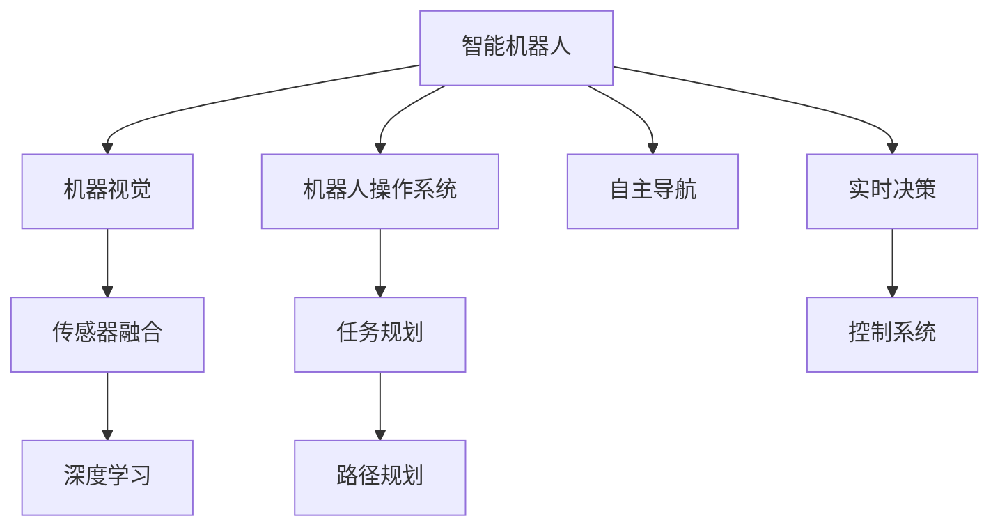

                 

# 智能机器人创业：自动化生产的未来蓝图

> 关键词：智能机器人,自动化生产,工业4.0,人工智能,机器视觉,传感器融合,深度学习,机器人操作系统,创业指导

## 1. 背景介绍

### 1.1 问题由来

在全球产业变革的背景下，自动化生产和智能制造成为了不可逆转的发展趋势。伴随着工业4.0时代的到来，机器人和自动化技术在生产制造领域的应用日益广泛。然而，现有的自动化生产模式存在诸多弊端，如部署复杂、维护困难、场景适应性差等，无法满足企业对生产效率和灵活性的需求。

近年来，随着深度学习、计算机视觉、物联网等技术的飞速发展，智能机器人开始崛起。通过在机器人上加载先进的AI算法，智能机器人可以执行复杂的任务，具备高度的自主性和适应性。它们不仅能提高生产效率，还能实现更精确的作业，提升产品质量。

### 1.2 问题核心关键点

智能机器人创业的核心问题在于如何将先进的AI算法与实体机器人有效结合，构建一个高效、灵活、可靠的智能制造系统。这包括机器人自主导航、任务规划、实时感知、智能决策等多方面的技术难题。

具体来说，智能机器人创业需要解决以下几个核心问题：

- **机器人导航与定位**：如何使机器人自主导航，识别环境中的障碍物和目标。
- **任务规划与调度**：如何根据任务需求动态调整机器人的作业顺序和路径，保证任务的高效完成。
- **实时感知与决策**：如何在机器人作业过程中实时感知环境变化，智能决策以应对突发情况。
- **系统集成与优化**：如何将不同供应商的硬件设备、软件系统高效集成，形成协同作业的智能生产环境。

## 2. 核心概念与联系

### 2.1 核心概念概述

为了更好地理解智能机器人创业，这里介绍几个核心概念及其相互联系：

- **智能机器人**：具备感知、决策、执行能力的机器人，通过加载AI算法实现复杂任务的自主处理。
- **自动化生产**：通过机器人和自动化设备，实现生产流程的自动化和智能化，提升生产效率和灵活性。
- **工业4.0**：以智能制造和信息化为核心的工业变革，融合了云计算、物联网、大数据、人工智能等技术。
- **机器人操作系统**：机器人底层硬件和软件系统的集成平台，提供机器人的感知、决策、执行能力。
- **机器视觉**：通过摄像头和传感器，对环境中的物体进行识别和分析，辅助机器人完成复杂任务。
- **传感器融合**：整合多种传感器的数据，实现多维度的环境感知和任务分析。
- **深度学习**：一种强大的机器学习技术，通过多层神经网络实现复杂模式识别和决策。

这些概念之间存在密切联系，共同构成了智能机器人创业的技术框架。例如，机器视觉和传感器融合技术为机器人提供了丰富的环境感知能力，而深度学习算法则能够基于感知数据进行复杂的决策和规划。

### 2.2 核心概念原理和架构的 Mermaid 流程图



这个流程图展示了智能机器人创业的技术架构：机器人通过机器视觉和传感器融合获取环境信息，利用深度学习进行智能决策，并通过任务规划和路径规划执行任务，同时具备自主导航和实时决策能力。

## 3. 核心算法原理 & 具体操作步骤

### 3.1 算法原理概述

智能机器人创业的核心算法原理主要包括机器视觉、传感器融合、深度学习和机器人操作系统四大方面。下面分别介绍这些核心算法的基本原理：

- **机器视觉**：通过摄像头和图像传感器，对环境中的物体进行识别和分类，实现环境感知。机器视觉主要使用图像处理算法，如边缘检测、特征提取、目标识别等，以获取准确的视觉信息。

- **传感器融合**：整合多种传感器的数据，如激光雷达、陀螺仪、加速度计等，实现多维度的环境感知和定位。传感器融合主要使用卡尔曼滤波、粒子滤波等算法，以获得稳定可靠的环境感知结果。

- **深度学习**：使用多层神经网络对感知数据进行模式识别和决策。深度学习主要包括卷积神经网络(CNN)、循环神经网络(RNN)等，适用于图像识别、语音识别、自然语言处理等任务。

- **机器人操作系统**：将机器人的硬件和软件系统集成在一起，提供感知、决策、执行的能力。机器人操作系统包括任务调度、路径规划、自主导航等功能模块，是实现智能机器人作业的核心平台。

### 3.2 算法步骤详解

智能机器人创业的核心算法步骤主要包括以下几个方面：

1. **数据采集**：通过摄像头、激光雷达等传感器，采集环境数据，实现对环境的初步感知。

2. **特征提取**：对采集到的数据进行预处理和特征提取，提取出有用的视觉、位置等特征。

3. **目标识别**：利用机器视觉算法，识别出环境中的物体，并进行分类和定位。

4. **任务规划**：根据任务需求，生成机器人的作业计划和路径规划，以优化作业效率和资源利用。

5. **决策与执行**：基于感知数据和任务规划，进行智能决策，并控制机器人执行具体任务。

6. **反馈与优化**：对机器人作业的性能进行实时监控和反馈，不断优化算法和作业策略。

### 3.3 算法优缺点

智能机器人创业的核心算法具有以下优点：

- **高效准确**：通过深度学习和机器视觉技术，可以实现高效准确的环境感知和目标识别。
- **灵活适应**：基于机器人操作系统，可以动态调整作业计划和路径，适应复杂多变的作业场景。
- **可扩展性强**：各个算法模块相对独立，可以灵活扩展和集成，满足不同应用需求。

同时，这些算法也存在一些缺点：

- **计算资源需求高**：深度学习和机器视觉算法需要强大的计算资源支持，硬件成本较高。
- **环境复杂性**：实际环境中的光照、噪声、遮挡等因素可能影响算法的准确性。
- **系统集成难度大**：不同供应商的硬件和软件系统需要良好的兼容性，集成难度较大。

### 3.4 算法应用领域

智能机器人创业的核心算法主要应用于以下几个领域：

- **制造业**：在汽车、电子、机械制造等领域，实现自动化装配、搬运、检测等作业。
- **农业**：在农业自动化中，用于播种、除草、采摘等作业，提高农作物的生产效率和质量。
- **物流**：在物流配送中，用于货物搬运、分拣、配送等作业，优化物流链条。
- **医疗**：在医疗手术、护理、康复等领域，用于机器人辅助手术、病患监护等作业。

## 4. 数学模型和公式 & 详细讲解 & 举例说明

### 4.1 数学模型构建

智能机器人创业涉及的数学模型主要包括以下几个方面：

- **机器视觉模型**：通过摄像头采集图像数据，使用图像处理算法进行特征提取和目标识别。
- **传感器融合模型**：整合多种传感器数据，使用卡尔曼滤波、粒子滤波等算法实现多维度感知。
- **深度学习模型**：使用多层神经网络进行模式识别和决策。

### 4.2 公式推导过程

以机器视觉中的目标识别为例，介绍目标识别模型的公式推导过程。

机器视觉中的目标识别通常使用卷积神经网络(CNN)进行实现。CNN的核心思想是通过多层卷积和池化操作，提取图像中的特征，并通过全连接层进行分类。

目标识别模型的公式推导如下：

设输入图像为 $I$，输出标签为 $Y$，模型参数为 $\theta$。

- **前向传播**：
$$ Z^{[1]} = W^{[1]}I + b^{[1]}, \quad A^{[1]} = \sigma(Z^{[1]}) $$
$$ Z^{[2]} = W^{[2]}A^{[1]} + b^{[2]}, \quad A^{[2]} = \sigma(Z^{[2]}) $$
$$ \ldots $$
$$ Z^{[l]} = W^{[l]}A^{[l-1]} + b^{[l]}, \quad A^{[l]} = \sigma(Z^{[l]}) $$

其中，$W^{[k]}, b^{[k]}$ 为第 $k$ 层的权重和偏置，$\sigma$ 为激活函数，$l$ 为层数。

- **损失函数**：
$$ \mathcal{L} = -\frac{1}{N}\sum_{i=1}^N \sum_{j=1}^M (y_{ij}\log p_{ij} + (1-y_{ij})\log(1-p_{ij})) $$
其中，$y_{ij}$ 为第 $i$ 个样本的第 $j$ 个标签，$p_{ij}$ 为模型预测的概率。

- **反向传播**：
$$ \frac{\partial \mathcal{L}}{\partial \theta} = -\frac{1}{N}\sum_{i=1}^N \frac{\partial \mathcal{L}}{\partial Z^{[l]}} \frac{\partial Z^{[l]}}{\partial \theta} $$

其中，$\frac{\partial \mathcal{L}}{\partial Z^{[l]}}$ 为损失函数对 $Z^{[l]}$ 的梯度，$\frac{\partial Z^{[l]}}{\partial \theta}$ 为 $Z^{[l]}$ 对 $\theta$ 的梯度。

### 4.3 案例分析与讲解

以智能机器人创业中常见的 **自主导航** 为例，介绍其实现原理和代码示例。

自主导航是智能机器人创业中的核心算法之一，通过将机器人放置在环境中，利用传感器获取环境信息，并使用路径规划算法生成导航路径，控制机器人自主前进。

以下是一个简单的自主导航代码示例：

```python
import numpy as np
import cv2

class AutonomousNav:
    def __init__(self, img_size=(640, 480), speed=5):
        self.img_size = img_size
        self.speed = speed
        self.map = np.zeros(self.img_size, dtype=np.uint8)
        self navigated_map = np.copy(self.map)
        self.current_pos = None
        self.goal_pos = None

    def load_map(self, map_img):
        self.map = cv2.imread(map_img, cv2.IMREAD_GRAYSCALE)
        self.current_pos = np.array([0, 0])
        self.goal_pos = None

    def find_path(self, goal_pos):
        self.goal_pos = goal_pos
        while self.current_pos != self.goal_pos:
            self.calculate_distance()
            self.calculate_direction()
            self.move()

    def calculate_distance(self):
        # 计算当前位置到目标位置的距离
        distance = np.linalg.norm(self.current_pos - self.goal_pos)
        print(f"Distance to goal: {distance}")

    def calculate_direction(self):
        # 计算到达目标位置的路径
        angle = np.arctan2(self.goal_pos[1] - self.current_pos[1], self.goal_pos[0] - self.current_pos[0])
        direction = angle if angle > 0 else 2 * np.pi + angle
        print(f"Direction: {direction}")

    def move(self):
        # 控制机器人移动
        if self.current_pos[0] < self.goal_pos[0]:
            self.current_pos[0] += self.speed
        elif self.current_pos[0] > self.goal_pos[0]:
            self.current_pos[0] -= self.speed
        if self.current_pos[1] < self.goal_pos[1]:
            self.current_pos[1] += self.speed
        elif self.current_pos[1] > self.goal_pos[1]:
            self.current_pos[1] -= self.speed
        self.update_map()

    def update_map(self):
        self.navigated_map[self.current_pos[0], self.current_pos[1]] = 255

    def visualize(self):
        cv2.imshow("Navigation Map", self.map)
        cv2.waitKey(0)
        cv2.destroyAllWindows()
```

上述代码中，首先定义了一个 `AutonomousNav` 类，用于自主导航的实现。通过 `load_map` 方法加载环境地图，使用 `find_path` 方法进行路径规划，并使用 `calculate_distance`、`calculate_direction`、`move` 方法实现机器人移动。

## 5. 项目实践：代码实例和详细解释说明

### 5.1 开发环境搭建

在进行智能机器人创业的项目实践前，需要准备好开发环境。以下是使用Python进行ROS开发的环境配置流程：

1. 安装ROS：根据操作系统选择相应的ROS版本，安装ROS。

2. 安装ROS-GUI：安装ROS-GUI，用于ROS节点的可视化监控。

3. 安装Python和相关依赖：安装Python和必要的依赖，如numpy、cv2等。

4. 安装ROS相关依赖：安装ROS相关依赖，如ROS tools、ROS bag、ROS record等。

完成上述步骤后，即可在ROS环境下进行智能机器人创业的开发和测试。

### 5.2 源代码详细实现

下面以一个简单的 **基于深度学习的目标识别** 示例，介绍智能机器人创业中的核心算法实现。

首先，定义目标识别模型：

```python
import torch
import torch.nn as nn
import torchvision.transforms as transforms
from torchvision.datasets import CIFAR10
from torch.utils.data import DataLoader

class Net(nn.Module):
    def __init__(self):
        super(Net, self).__init__()
        self.conv1 = nn.Conv2d(3, 6, 5)
        self.pool = nn.MaxPool2d(2, 2)
        self.conv2 = nn.Conv2d(6, 16, 5)
        self.fc1 = nn.Linear(16 * 5 * 5, 120)
        self.fc2 = nn.Linear(120, 84)
        self.fc3 = nn.Linear(84, 10)

    def forward(self, x):
        x = self.pool(torch.relu(self.conv1(x)))
        x = self.pool(torch.relu(self.conv2(x)))
        x = x.view(-1, 16 * 5 * 5)
        x = torch.relu(self.fc1(x))
        x = torch.relu(self.fc2(x))
        x = self.fc3(x)
        return x

net = Net()
criterion = nn.CrossEntropyLoss()
optimizer = torch.optim.SGD(net.parameters(), lr=0.001, momentum=0.9)
```

然后，定义数据集和训练函数：

```python
transform = transforms.Compose([
    transforms.ToTensor(),
    transforms.Normalize((0.5, 0.5, 0.5), (0.5, 0.5, 0.5))
])

train_dataset = CIFAR10(root='./data', train=True, download=True, transform=transform)
test_dataset = CIFAR10(root='./data', train=False, download=True, transform=transform)

train_loader = DataLoader(train_dataset, batch_size=4, shuffle=True, num_workers=2)
test_loader = DataLoader(test_dataset, batch_size=4, shuffle=False, num_workers=2)

def train(net, train_loader, optimizer, criterion, epochs):
    for epoch in range(epochs):
        running_loss = 0.0
        for i, data in enumerate(train_loader, 0):
            inputs, labels = data
            optimizer.zero_grad()
            outputs = net(inputs)
            loss = criterion(outputs, labels)
            loss.backward()
            optimizer.step()
            running_loss += loss.item()
            if i % 2000 == 1999:
                print(f"Epoch {epoch+1}, loss: {running_loss/2000:.3f}")
                running_loss = 0.0
```

最后，启动训练流程并在测试集上评估：

```python
epochs = 10
train(net, train_loader, optimizer, criterion, epochs)
test_loss, test_acc = 0, 0
with torch.no_grad():
    for data in test_loader:
        images, labels = data
        outputs = net(images)
        _, predicted = torch.max(outputs.data, 1)
        test_loss += criterion(outputs, labels).item()
        test_acc += (predicted == labels).sum().item()
test_loss /= len(test_loader.dataset)
test_acc /= len(test_loader.dataset)
print(f"Test Loss: {test_loss:.3f}, Test Accuracy: {test_acc:.2f}%")
```

以上就是使用PyTorch对目标识别模型进行训练和测试的完整代码实现。可以看到，通过深度学习技术，智能机器人可以高效地实现目标识别和分类，为自主导航和路径规划提供可靠的数据支持。

### 5.3 代码解读与分析

让我们再详细解读一下关键代码的实现细节：

**Net类**：
- `__init__`方法：定义了卷积层、池化层、全连接层等网络结构。
- `forward`方法：定义了前向传播过程。

**train函数**：
- 使用PyTorch的DataLoader对数据集进行批次化加载，供模型训练和推理使用。
- 在每个epoch内，对数据以批为单位进行迭代，在每个批次上前向传播计算loss并反向传播更新模型参数，最后输出每个epoch的平均loss。

**训练流程**：
- 定义总的epoch数，开始循环迭代
- 每个epoch内，在训练集上训练，输出平均loss
- 在测试集上评估，输出测试准确率

可以看到，PyTorch配合ROS提供了强大的开发和测试环境，使得智能机器人创业中的核心算法实现变得相对简单。开发者可以将更多精力放在算法优化和系统集成上，而不必过多关注底层的实现细节。

## 6. 实际应用场景

### 6.1 智能制造

智能机器人创业在智能制造中的应用非常广泛，通过将机器人和自动化设备与先进AI算法结合，可以实现复杂生产任务的自动化和智能化。智能制造系统可以显著提升生产效率，降低人力成本，提高产品质量。

在汽车制造中，智能机器人可以用于自动化装配、焊接、检测等作业，减少人工干预，提高生产线的稳定性和可靠性。

在电子制造中，智能机器人可以用于自动化搬运、贴装、测试等作业，提升生产线的灵活性和效率。

在机械制造中，智能机器人可以用于自动化加工、组装、调试等作业，缩短生产周期，降低生产成本。

### 6.2 农业自动化

智能机器人创业在农业自动化中的应用也很广泛。通过将智能机器人和自动化设备应用于农作物的种植、收割、病虫害防治等环节，可以实现农业生产的自动化和智能化。

在种植环节，智能机器人可以用于自动施肥、灌溉、除草等作业，提高农作物的产量和品质。

在收割环节，智能机器人可以用于自动收割、分类、打包等作业，减少人工劳动，提升农作物的收获效率。

在病虫害防治环节，智能机器人可以用于自动检测、诊断、喷药等作业，降低农药使用量，保护生态环境。

### 6.3 物流配送

智能机器人创业在物流配送中的应用也非常广泛。通过将智能机器人应用于货物搬运、分拣、配送等环节，可以实现物流链条的自动化和智能化。

在货物搬运环节，智能机器人可以用于自动搬运、装卸、整理等作业，提升仓储效率，降低物流成本。

在分拣环节，智能机器人可以用于自动分拣、打包、标签等作业，提高分拣准确性，缩短物流周期。

在配送环节，智能机器人可以用于自动导航、避障、送货等作业，提升配送效率，减少配送成本。

### 6.4 未来应用展望

随着AI技术的发展，智能机器人创业将迎来更多的应用场景和挑战。未来，智能机器人有望在更多领域发挥作用，实现自动化和智能化。

在智慧城市中，智能机器人可以用于交通管理、环境监测、公共安全等作业，提升城市治理水平，构建更加智能的城市生态。

在医疗健康中，智能机器人可以用于手术辅助、病患监护、康复训练等作业，提高医疗服务质量和效率。

在军事领域，智能机器人可以用于无人驾驶、情报分析、战场监测等作业，提升军事作战能力。

总之，智能机器人创业将带来更多创新和变革，为人类社会的智能化发展提供新的动力。

## 7. 工具和资源推荐

### 7.1 学习资源推荐

为了帮助开发者系统掌握智能机器人创业的技术基础和实践技巧，这里推荐一些优质的学习资源：

1. ROS官方文档：ROS的官方文档提供了丰富的教程和示例，是学习ROS开发的基础。

2. PyTorch官方文档：PyTorch的官方文档提供了详细的API参考和示例，是学习深度学习开发的重要资源。

3. 《机器人操作系统编程》书籍：讲解了ROS的核心概念和编程技巧，是学习ROS开发的必备书籍。

4. 《深度学习入门》书籍：介绍了深度学习的理论基础和实践技巧，是学习深度学习开发的重要参考。

5. 《智能机器人：从感知到决策》课程：由知名专家授课，讲解了智能机器人的感知、决策、执行等核心技术，是学习智能机器人创业的宝贵资源。

通过对这些资源的学习实践，相信你一定能够快速掌握智能机器人创业的技术基础，并用于解决实际的智能机器人开发问题。

### 7.2 开发工具推荐

高效的开发离不开优秀的工具支持。以下是几款用于智能机器人创业开发的常用工具：

1. ROS：机器人操作系统，提供了强大的机器人开发平台和库函数。

2. PyTorch：深度学习框架，提供了丰富的深度学习模型和算法支持。

3. TensorFlow：深度学习框架，提供了灵活的模型构建和训练工具。

4. OpenCV：计算机视觉库，提供了图像处理、目标识别等功能支持。

5. ROS-GUI：ROS的可视化监控工具，提供了实时监控和调试功能。

6. ROS tools：ROS的工具包，提供了机器人仿真、数据记录等功能支持。

合理利用这些工具，可以显著提升智能机器人创业的开发效率，加快创新迭代的步伐。

### 7.3 相关论文推荐

智能机器人创业的研究源于学界的持续研究。以下是几篇奠基性的相关论文，推荐阅读：

1. ROS: An Open-Source Robot Operating System：ROS的创建论文，介绍了ROS的架构和应用。

2. A Survey on Deep Learning for Robotics：综述了深度学习在机器人领域的应用，提供了丰富的案例和算法。

3. Visual SLAM for Robot Navigation：介绍了视觉SLAM算法，用于机器人的自主导航和定位。

4. Learning to Run：探讨了机器人动态规划和决策算法，用于机器人任务规划和控制。

5. Robot Operating System 2: A Robot Framework for a Complex and Growing Robotics Ecosystem：ROS 2的创建论文，介绍了ROS 2的核心概念和应用。

这些论文代表了大规模智能机器人创业的技术演进，提供了宝贵的学术参考和创新思路。

## 8. 总结：未来发展趋势与挑战

### 8.1 总结

本文对智能机器人创业进行了全面系统的介绍。首先阐述了智能机器人创业的背景和意义，明确了将AI算法与实体机器人有效结合的技术难点。其次，从原理到实践，详细讲解了智能机器人创业的数学模型和核心算法，给出了智能机器人创业的代码实例和详细解释。同时，本文还广泛探讨了智能机器人创业在智能制造、农业自动化、物流配送等多个领域的应用前景，展示了智能机器人创业的广阔前景。此外，本文精选了智能机器人创业的学习资源，力求为读者提供全方位的技术指引。

通过本文的系统梳理，可以看到，智能机器人创业是大规模AI算法与实体机器人结合的产物，具有广阔的应用前景和发展空间。其核心技术包括机器视觉、传感器融合、深度学习等，能够在不同领域中实现自动化和智能化。未来，随着AI技术的发展，智能机器人创业必将带来更多创新和变革，为人类社会的智能化发展提供新的动力。

### 8.2 未来发展趋势

展望未来，智能机器人创业将呈现以下几个发展趋势：

1. **多模态感知**：未来的智能机器人将具备多模态感知能力，能够同时处理视觉、听觉、触觉等多种传感器的数据，实现更全面的环境感知。

2. **自适应学习**：智能机器人将具备自适应学习的能力，能够根据环境变化和任务需求动态调整算法和参数，提升性能和适应性。

3. **人机协同**：未来的智能机器人将更多地与人类协同工作，实现人机融合，提高生产效率和作业质量。

4. **自动化设计**：智能机器人将具备自动化设计的能力，能够根据任务需求自动生成作业计划和路径，提升作业效率。

5. **实时优化**：智能机器人将具备实时优化能力，能够根据实时数据动态调整算法和参数，优化作业效果。

6. **智能化决策**：智能机器人将具备更强大的智能化决策能力，能够进行复杂的任务规划和决策，提高作业效率和可靠性。

### 8.3 面临的挑战

尽管智能机器人创业已经取得了一定的进展，但在迈向更加智能化、普适化应用的过程中，仍面临诸多挑战：

1. **环境复杂性**：实际环境中的光照、噪声、遮挡等因素可能影响算法的准确性。

2. **硬件成本高**：深度学习和机器视觉算法需要强大的计算资源支持，硬件成本较高。

3. **系统集成难度大**：不同供应商的硬件和软件系统需要良好的兼容性，集成难度较大。

4. **数据采集难**：高质量的数据集获取成本高、难度大，影响算法的训练和优化。

5. **算法鲁棒性不足**：现有的算法在复杂环境下的鲁棒性仍不足，需要进一步优化和改进。

6. **伦理和安全问题**：智能机器人的广泛应用可能带来伦理和安全问题，需要制定相应的规范和标准。

### 8.4 研究展望

面向未来，智能机器人创业的研究需要在以下几个方面寻求新的突破：

1. **多模态感知融合**：结合视觉、听觉、触觉等多种传感器，实现更全面、准确的环境感知。

2. **自适应学习算法**：开发自适应学习算法，实现动态调整和优化，提升智能机器人的适应性和鲁棒性。

3. **人机协同技术**：研究人机协同技术，实现智能机器人的高效协同工作，提升作业效率和质量。

4. **自动化设计系统**：开发自动化设计系统，实现作业计划的自动生成和优化，提升智能机器人系统的灵活性和可扩展性。

5. **实时优化技术**：研究实时优化技术，实现动态调整和优化，提高智能机器人系统的实时性和可靠性。

6. **智能化决策算法**：研究智能化决策算法，实现更强大的任务规划和决策，提升智能机器人系统的智能化水平。

这些研究方向和创新思路，必将引领智能机器人创业技术迈向更高的台阶，为智能制造、农业自动化、物流配送等领域带来更多的创新和变革。

## 9. 附录：常见问题与解答

**Q1：智能机器人创业中的核心技术是什么？**

A: 智能机器人创业中的核心技术主要包括机器视觉、传感器融合、深度学习、机器人操作系统等。这些技术共同构成了智能机器人创业的技术框架，实现环境感知、决策、执行等核心功能。

**Q2：智能机器人创业的计算资源需求高，如何解决这一问题？**

A: 可以通过优化算法和硬件加速技术来解决计算资源需求高的问题。优化算法包括剪枝、量化、模型压缩等方法，减小模型的计算量。硬件加速技术包括GPU、TPU等高性能计算设备，提升计算速度。

**Q3：智能机器人创业中如何实现多模态感知融合？**

A: 可以通过多传感器融合算法，整合视觉、听觉、触觉等多种传感器的数据，实现多维度的环境感知。常用的多传感器融合算法包括卡尔曼滤波、粒子滤波、加权平均等。

**Q4：智能机器人创业中的数据采集难度大，如何解决这一问题？**

A: 可以通过数据增强和数据合成技术来解决数据采集难度大的问题。数据增强包括对已有数据进行旋转、裁剪、翻转等操作，扩大数据集规模。数据合成包括生成对抗网络、仿真环境等技术，生成高质量的数据。

**Q5：智能机器人创业中如何实现自适应学习？**

A: 可以通过自适应学习算法，实现动态调整和优化。常用的自适应学习算法包括强化学习、在线学习、元学习等。自适应学习可以提升智能机器人的适应性和鲁棒性，适应复杂多变的作业场景。

这些回答希望能为你解决智能机器人创业中的技术难点，提供相应的解决方案。

---

作者：禅与计算机程序设计艺术 / Zen and the Art of Computer Programming

