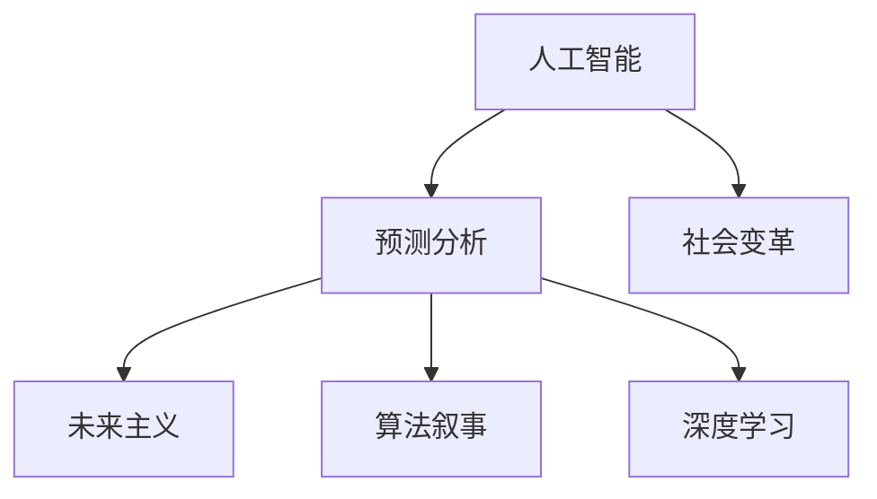

                 

# 未来主义写作：AI预测社会变革的叙事

> 关键词：人工智能,预测分析,社会变革,未来主义,算法叙事,深度学习

## 1. 背景介绍

### 1.1 问题由来

当今世界正经历着前所未有的变革，数字化、自动化、人工智能（AI）等技术的迅猛发展，深刻改变了我们的生产方式、生活方式和思维方式。在此背景下，如何预测并理解这些变革对社会的长期影响，成为学者、工程师和政策制定者关注的焦点。

AI预测社会变革的核心在于数据驱动的模型构建和深度学习算法的应用。借助大数据分析和机器学习，AI不仅能够模拟历史发展趋势，还能预测未来可能发生的事件和变化。然而，这种预测并非凭空臆想，而是基于大量的实证数据和科学的理论模型。

### 1.2 问题核心关键点

AI预测社会变革的关键点在于以下几个方面：

- **数据获取与处理**：收集、清洗和处理大规模、高质量的数据是预测的基础。数据的质量和多样性直接影响模型的准确性和泛化能力。
- **模型选择与构建**：选择适合的模型（如时间序列模型、神经网络模型等）和构建科学的训练过程，是确保预测准确性的关键。
- **算法优化与迭代**：通过不断的算法优化和模型迭代，提升预测精度和效率。
- **结果解释与验证**：对预测结果进行科学的解释和验证，确保其可靠性和实用性。

这些关键点共同构成了AI预测社会变革的技术框架，为理解和预测社会变革提供了强有力的工具和方法。

## 2. 核心概念与联系

### 2.1 核心概念概述

为更好地理解AI预测社会变革的原理和应用，本节将介绍几个关键概念：

- **人工智能**：以数据、算法和计算能力为基础，能够自主执行复杂任务的智能系统。AI的核心在于模拟人类认知、决策和行动的能力。
- **预测分析**：基于历史数据和模型，对未来事件或变化进行分析和预测。预测分析广泛应用于金融、医疗、气象等领域。
- **社会变革**：社会结构和形态的根本变化，包括技术、经济、文化等方面的深层次转型。社会变革是复杂且多维的现象，需要跨学科的综合分析。
- **未来主义**：关注未来、预测未来的思维方式和研究方法。未来主义不仅关注技术发展，还关注人类社会和文化演进。
- **算法叙事**：使用算法和数据对历史和社会现象进行分析和解释，形成对未来的预测和推断。
- **深度学习**：一种特殊的机器学习技术，通过多层神经网络结构模拟人脑处理信息的方式，解决复杂问题。

这些核心概念之间的逻辑关系可以通过以下Mermaid流程图来展示：



这个流程图展示了大语言模型微调的各个核心概念及其之间的逻辑联系：

1. 人工智能通过深度学习等技术，为预测分析提供了强有力的工具。
2. 预测分析是AI技术在社会变革预测中的应用。
3. 社会变革是AI预测的最终目标，需要通过数据和模型进行解释和验证。
4. 未来主义关注预测和解释的科学性和人文性，是连接预测和变革的桥梁。
5. 算法叙事通过数据和模型，为社会变革提供科学的分析和解释。
6. 深度学习作为AI的核心算法，是实现预测分析和算法叙事的基础。

## 3. 核心算法原理 & 具体操作步骤

### 3.1 算法原理概述

AI预测社会变革的算法原理主要基于以下三个步骤：

1. **数据获取与预处理**：从各种数据源（如政府数据、企业数据、社交媒体数据等）获取数据，并进行清洗和预处理，确保数据的质量和可用性。
2. **模型训练与预测**：选择适合的机器学习模型（如时间序列模型、神经网络模型等），使用历史数据进行训练，并对未来事件进行预测。
3. **结果验证与解释**：对预测结果进行验证和解释，确保其科学性和实用性，并进一步探讨其对社会变革的影响。

### 3.2 算法步骤详解

以下是AI预测社会变革的详细步骤：

**Step 1: 数据获取与预处理**

- **数据源选择**：确定所需的数据类型和来源，如经济数据、人口数据、网络舆情数据等。
- **数据清洗**：去除异常值、填补缺失值、标准化数据格式，确保数据的可用性。
- **特征工程**：提取和构造有意义的数据特征，如时间、季节、地理位置、用户行为等。
- **数据划分**：将数据划分为训练集、验证集和测试集，确保模型在不同数据集上的泛化能力。

**Step 2: 模型选择与训练**

- **模型选择**：根据预测任务的特点，选择合适的机器学习模型，如时间序列模型、随机森林、神经网络等。
- **参数调整**：通过网格搜索、交叉验证等方法，调整模型参数，优化模型性能。
- **训练过程**：使用训练集数据进行模型训练，并通过验证集评估模型性能。
- **模型迭代**：根据验证集结果，不断调整模型结构和参数，提升预测准确性。

**Step 3: 结果验证与解释**

- **预测结果**：使用测试集数据对模型进行最终验证，评估其预测准确性和泛化能力。
- **结果解释**：通过可视化、统计分析等方法，对预测结果进行解释和验证。
- **影响分析**：探讨预测结果对社会变革的具体影响，如经济增长、人口流动、文化变迁等。

### 3.3 算法优缺点

AI预测社会变革的算法具有以下优点：

- **数据驱动**：依赖于大规模数据，能够发现潜在的趋势和规律，避免主观臆断。
- **技术先进**：利用深度学习和机器学习算法，提升预测的准确性和效率。
- **跨领域应用**：适用于多个领域的预测，如金融、医疗、交通等。
- **动态更新**：能够随着数据的变化进行模型更新，保持预测的实时性。

同时，该算法也存在一些局限性：

- **数据依赖性**：模型性能高度依赖于数据的质量和数量，获取高质量数据成本较高。
- **模型复杂性**：深度学习模型复杂度高，训练和推理速度较慢。
- **结果解释性**：黑盒模型的预测结果缺乏解释，难以进行有效的验证和修正。
- **伦理与偏见**：模型可能继承数据中的偏见和伦理问题，导致预测结果的不公正性。

尽管存在这些局限性，AI预测社会变革的算法仍是大数据分析和模型预测的重要工具。通过不断优化和改进，这些算法将为理解社会变革提供更科学、更准确的工具。

### 3.4 算法应用领域

AI预测社会变革的算法已在多个领域得到了广泛应用，包括：

- **经济预测**：预测GDP增长、股票市场波动等经济指标。
- **医疗健康**：预测疾病流行趋势、患者病程等健康指标。
- **交通规划**：预测交通流量、车辆拥堵等交通指标。
- **能源管理**：预测能源需求、能源价格等能源指标。
- **环境监测**：预测气候变化、环境污染等环境指标。
- **社会动态**：预测人口迁移、文化变迁等社会指标。

这些领域的应用展示了AI预测社会变革的巨大潜力和广泛前景。未来，随着技术的发展和数据的积累，AI预测将涵盖更多领域，为社会变革提供更有力的支持。

## 4. 数学模型和公式 & 详细讲解 & 举例说明

### 4.1 数学模型构建

AI预测社会变革的数学模型构建主要基于以下几种基础模型：

- **时间序列模型**：如ARIMA、VAR、SARIMA等，用于预测时间序列数据的变化趋势。
- **神经网络模型**：如RNN、LSTM、GRU等，用于处理非线性和复杂的数据关系。
- **随机森林模型**：用于处理多变量和分类问题。
- **集成模型**：如随机森林、AdaBoost等，通过组合多个模型提升预测性能。

以时间序列模型ARIMA为例，其数学模型构建如下：

$$
y_t = c + \sum_{i=1}^{p} \alpha_i y_{t-i} + \sum_{j=1}^{d} \beta_j \Delta^j y_t + \sum_{k=1}^{q} \gamma_k u_{t-k}
$$

其中，$y_t$ 为时间序列数据，$\alpha_i$、$\beta_j$ 和 $\gamma_k$ 为模型参数，$d$ 为差分阶数，$p$ 和 $q$ 为自回归和移动平均阶数，$u_t$ 为随机误差项。

### 4.2 公式推导过程

以ARIMA模型为例，其推导过程如下：

1. **差分变换**：对原时间序列数据进行差分，消除非平稳性，得到平稳序列。
2. **自回归模型**：基于平稳序列，建立自回归模型，即：
   $$
   y_t = c + \sum_{i=1}^{p} \alpha_i y_{t-i}
   $$
   其中 $c$ 为常数项，$\alpha_i$ 为自回归系数。
3. **移动平均模型**：基于平稳序列，建立移动平均模型，即：
   $$
   y_t = \sum_{j=1}^{d} \beta_j \Delta^j y_t
   $$
   其中 $\beta_j$ 为移动平均系数。
4. **组合模型**：将自回归模型和移动平均模型组合，得到ARIMA模型，即：
   $$
   y_t = c + \sum_{i=1}^{p} \alpha_i y_{t-i} + \sum_{j=1}^{d} \beta_j \Delta^j y_t + \sum_{k=1}^{q} \gamma_k u_{t-k}
   $$

### 4.3 案例分析与讲解

以金融市场预测为例，对ARIMA模型进行应用和解释：

**数据准备**：收集某金融市场的历史股价数据，并进行差分变换。

**模型训练**：使用前N个数据进行模型训练，确定自回归和移动平均阶数。

**预测验证**：使用后M个数据进行模型验证，评估预测效果。

**结果解释**：通过可视化图表，展示预测结果和真实数据的变化趋势，分析预测的准确性和可靠性。

## 5. 项目实践：代码实例和详细解释说明

### 5.1 开发环境搭建

在进行AI预测社会变革的实践前，我们需要准备好开发环境。以下是使用Python进行Scikit-learn开发的环环境配置流程：

1. 安装Anaconda：从官网下载并安装Anaconda，用于创建独立的Python环境。

2. 创建并激活虚拟环境：
```bash
conda create -n prediction-env python=3.8 
conda activate prediction-env
```

3. 安装Scikit-learn：使用pip安装Scikit-learn库，安装命令为：
```bash
pip install scikit-learn
```

4. 安装各类工具包：
```bash
pip install numpy pandas matplotlib seaborn
```

完成上述步骤后，即可在`prediction-env`环境中开始预测实践。

### 5.2 源代码详细实现

下面我们以金融市场预测为例，给出使用Scikit-learn进行ARIMA模型预测的Python代码实现。

首先，定义数据处理函数：

```python
import pandas as pd
from statsmodels.tsa.arima.model import ARIMA

def load_data(path):
    data = pd.read_csv(path)
    data.index = pd.DatetimeIndex(data['Date'])
    data.drop(columns=['Date'], inplace=True)
    return data

def arima_model(data, order):
    model = ARIMA(data, order=order)
    model_fit = model.fit()
    return model_fit
```

然后，定义预测函数：

```python
def forecast_arima(model_fit, forecast_period):
    forecast = model_fit.forecast(steps=forecast_period)
    return forecast
```

最后，启动预测流程并在测试集上评估：

```python
data = load_data('financial_data.csv')

# 分解时间序列数据，得到趋势、季节和残差
decomposition = decompose(data)
trend = decomposition.trend
seasonal = decomposition.seasonal
residual = decomposition.resid

# 差分变换，消除非平稳性
diffed = residual.diff()

# 建立ARIMA模型
order = (1, 1, 1)
model_fit = arima_model(diffed, order)

# 预测未来数据
forecast_period = 30
forecast = forecast_arima(model_fit, forecast_period)

# 可视化预测结果
plot_forecast(forecast)
```

以上就是使用Scikit-learn进行金融市场预测的完整代码实现。可以看到，Scikit-learn提供了丰富的统计和机器学习工具，使得模型构建和预测过程变得简洁高效。

### 5.3 代码解读与分析

让我们再详细解读一下关键代码的实现细节：

**load_data函数**：
- 读取数据文件，将其转化为pandas DataFrame对象。
- 将时间戳转换为DatetimeIndex，便于时间序列操作。
- 去除无关的时间戳列，只保留时间序列数据。

**arima_model函数**：
- 使用statsmodels库中的ARIMA模型，指定自回归和移动平均阶数。
- 拟合模型，并返回拟合结果。

**forecast_arima函数**：
- 使用ARIMA模型的`forecast`方法进行未来数据预测。
- 返回预测结果。

**预测流程**：
- 加载金融市场数据，并进行时间序列分解。
- 对残差进行差分变换，消除非平稳性。
- 建立ARIMA模型，并使用前N个数据进行拟合。
- 使用模型进行未来数据预测。
- 可视化预测结果，展示预测的准确性和可靠性。

可以看到，Scikit-learn提供了方便的工具和函数，使得ARIMA模型的构建和预测过程变得简单易懂。通过这一简单的示例，展示了Scikit-learn的强大功能和灵活性。

## 6. 实际应用场景

### 6.1 智能城市规划

智能城市规划是AI预测社会变革的重要应用场景之一。通过分析历史交通数据、人口数据、环境数据等，预测未来的城市发展趋势，指导城市规划和建设。

具体而言，可以建立智能交通模型，预测未来交通流量和拥堵情况，优化交通信号灯控制策略。通过分析人口迁移数据，预测未来人口分布和住房需求，指导城市土地利用和基础设施建设。利用环境监测数据，预测气候变化和污染趋势，制定环境保护和治理方案。

### 6.2 医疗健康预测

AI预测在医疗健康领域也有广泛应用。通过分析历史病历数据、流行病学数据、患者行为数据等，预测疾病流行趋势、患者病程等健康指标。

具体而言，可以建立疾病预测模型，预测传染病、慢性病等疾病的发病率和传播趋势。利用患者行为数据，预测患者病程和康复速度，优化医疗资源配置。通过基因数据和健康数据，预测个体患病风险，进行个性化医疗和健康管理。

### 6.3 金融市场预测

金融市场预测是AI预测的重要应用领域之一。通过分析历史股票价格、宏观经济数据、公司财报等数据，预测股市波动、经济增长等金融指标。

具体而言，可以建立股票价格预测模型，预测股票价格的走势和波动幅度。利用宏观经济数据，预测经济增长和通胀趋势，制定货币政策和财政政策。通过公司财报和市场情绪数据，预测公司业绩和市场情绪，指导投资决策。

### 6.4 未来应用展望

随着AI技术的不断发展，基于AI预测的社会变革应用将涵盖更多领域，带来更大的社会价值。

在智慧农业领域，AI预测可以优化种植计划、预测气候变化、指导农业生产，提高农业生产效率和可持续性。在教育领域，AI预测可以预测学生成绩、分析教育资源分配，制定个性化教育方案，提升教育质量和公平性。在旅游领域，AI预测可以预测旅游热点、分析旅游需求，优化旅游资源配置，提升旅游体验。

## 7. 工具和资源推荐

### 7.1 学习资源推荐

为了帮助开发者系统掌握AI预测社会变革的理论基础和实践技巧，这里推荐一些优质的学习资源：

1. **《Python机器学习》**：由Scikit-learn作者撰写，全面介绍了机器学习的基本概念和实现方法，是入门AI预测的重要书籍。

2. **Coursera《机器学习》**：由斯坦福大学开设的机器学习课程，涵盖机器学习的理论基础和实践应用，适合深入学习。

3. **Kaggle竞赛**：Kaggle平台上众多数据科学竞赛，通过实际问题驱动学习，提升数据处理和模型构建能力。

4. **arXiv预印本**：arXiv上众多AI预测相关的论文，涵盖最新研究进展和前沿技术，是学习研究动态的重要资源。

通过对这些资源的学习实践，相信你一定能够快速掌握AI预测社会变革的精髓，并用于解决实际的预测问题。

### 7.2 开发工具推荐

高效的开发离不开优秀的工具支持。以下是几款用于AI预测社会变革开发的常用工具：

1. **Python**：作为AI领域的主流编程语言，Python具有丰富的库和框架，适合数据分析和模型构建。

2. **Scikit-learn**：基于NumPy的Python库，提供了丰富的统计和机器学习算法，适合构建和训练预测模型。

3. **TensorFlow**：由Google主导开发的深度学习框架，支持分布式计算和模型优化，适合处理大规模数据和复杂模型。

4. **Jupyter Notebook**：开源的交互式笔记本环境，适合记录和分享代码和结果，便于协作和交流。

5. **PyTorch**：基于Python的深度学习框架，支持动态计算图和模型优化，适合构建和训练复杂的深度学习模型。

合理利用这些工具，可以显著提升AI预测的开发效率，加快创新迭代的步伐。

### 7.3 相关论文推荐

AI预测社会变革的研究源于学界的持续研究。以下是几篇奠基性的相关论文，推荐阅读：

1. **《The Econometric Analysis of Time Series》**：由经济学家C. W. J. Granger撰写，介绍了时间序列分析和预测的原理和方法。

2. **《Neural Networks and Deep Learning》**：由深度学习专家Michael Nielsen撰写，介绍了深度学习的理论和实践，适合全面学习深度学习基础。

3. **《Machine Learning Yearning》**：由深度学习专家Andrew Ng撰写，介绍了机器学习的实践经验和成功案例，适合实际操作和学习。

4. **《Predictive Analytics》**：由数据科学家Peter Cerdeira撰写，介绍了预测分析的原理和方法，适合学习和应用预测技术。

这些论文代表了大语言模型微调技术的发展脉络。通过学习这些前沿成果，可以帮助研究者把握学科前进方向，激发更多的创新灵感。

## 8. 总结：未来发展趋势与挑战

### 8.1 总结

本文对基于AI预测社会变革的方法进行了全面系统的介绍。首先阐述了AI预测社会变革的研究背景和意义，明确了预测在理解社会变革中的重要作用。其次，从原理到实践，详细讲解了AI预测的核心算法和具体操作步骤，给出了预测任务开发的完整代码实例。同时，本文还广泛探讨了AI预测在智能城市、医疗健康、金融市场等多个领域的应用前景，展示了预测范式的巨大潜力。此外，本文精选了预测技术的各类学习资源，力求为读者提供全方位的技术指引。

通过本文的系统梳理，可以看到，基于AI的预测技术正在成为社会变革预测的重要工具，极大地拓展了社会变革的理解和预测能力。AI预测技术在数据驱动和模型构建方面，为理解和预测社会变革提供了强有力的支持。未来，伴随技术的发展和数据的积累，AI预测将涵盖更多领域，为社会变革提供更有力的支持。

### 8.2 未来发展趋势

展望未来，AI预测社会变革技术将呈现以下几个发展趋势：

1. **数据驱动**：随着数据获取和处理技术的进步，数据质量将进一步提升，AI预测将更加依赖数据驱动的模型构建。

2. **模型复杂化**：深度学习模型和复杂算法将不断优化和改进，提升预测的准确性和泛化能力。

3. **跨领域应用**：AI预测将在更多领域得到应用，如农业、教育、旅游等，为社会变革提供更加全面和深入的理解。

4. **动态更新**：随着数据的变化，AI预测模型将实时更新，保持预测的实时性和准确性。

5. **可解释性**：AI预测模型将更加注重可解释性，提供科学、可验证的预测结果和解释。

6. **多模态融合**：AI预测将融合多种数据模态，如文本、图像、语音等，提升预测的全面性和准确性。

以上趋势凸显了AI预测社会变革技术的广阔前景。这些方向的探索发展，必将进一步提升社会变革的预测能力和理解深度。

### 8.3 面临的挑战

尽管AI预测社会变革技术已经取得了瞩目成就，但在迈向更加智能化、普适化应用的过程中，仍面临诸多挑战：

1. **数据质量**：数据获取和处理成本高，数据质量难以保证，影响模型的准确性和可靠性。

2. **模型复杂性**：深度学习模型复杂度高，训练和推理速度较慢，难以处理大规模数据。

3. **结果解释**：AI预测模型缺乏解释性，难以进行有效的验证和修正。

4. **伦理与偏见**：模型可能继承数据中的偏见和伦理问题，导致预测结果的不公正性。

5. **资源需求**：大规模模型的训练和推理需要高性能计算资源，成本较高。

尽管存在这些挑战，AI预测社会变革技术仍然具有广阔的应用前景和发展空间。通过不断优化和改进，这些技术将为理解社会变革提供更科学、更准确的工具。

### 8.4 研究展望

面对AI预测社会变革所面临的挑战，未来的研究需要在以下几个方面寻求新的突破：

1. **数据获取与处理**：研究高效的数据获取和处理技术，提升数据质量和可用性。

2. **模型优化**：开发更高效、更精确的模型算法，提升预测的准确性和实时性。

3. **可解释性**：引入可解释性工具和技术，提升模型的透明度和可验证性。

4. **伦理与偏见**：研究伦理与偏见问题，建立公平、公正的预测模型。

5. **资源优化**：研究高效的模型压缩和优化技术，降低资源消耗和成本。

6. **多模态融合**：研究多种数据模态的融合技术，提升预测的全面性和准确性。

这些研究方向的探索，必将推动AI预测社会变革技术迈向更高的台阶，为理解和预测社会变革提供更科学、更可靠的工具。面向未来，AI预测技术需要与其他技术进行更深入的融合，如知识表示、因果推理、强化学习等，多路径协同发力，共同推动社会变革的进步。只有勇于创新、敢于突破，才能不断拓展社会变革的理解和预测能力，为构建智能社会提供更有力的支持。

## 9. 附录：常见问题与解答

**Q1：AI预测社会变革的方法有哪些？**

A: AI预测社会变革的方法主要包括以下几种：

- **时间序列模型**：如ARIMA、VAR、SARIMA等，用于预测时间序列数据的变化趋势。
- **神经网络模型**：如RNN、LSTM、GRU等，用于处理非线性和复杂的数据关系。
- **随机森林模型**：用于处理多变量和分类问题。
- **集成模型**：如随机森林、AdaBoost等，通过组合多个模型提升预测性能。

不同的方法适用于不同的数据类型和预测任务，需要根据具体情况选择合适的方法。

**Q2：AI预测模型如何进行验证？**

A: AI预测模型的验证一般包括以下步骤：

- **数据划分**：将数据划分为训练集、验证集和测试集，确保模型在不同数据集上的泛化能力。
- **交叉验证**：使用交叉验证方法评估模型的泛化能力，避免过拟合。
- **指标评估**：使用MAE、RMSE、MAPE等指标评估模型的预测精度。
- **可视化分析**：通过可视化图表展示模型的预测结果和真实数据的对比，分析预测的准确性和可靠性。

通过以上步骤，可以全面验证AI预测模型的效果，确保其科学性和实用性。

**Q3：AI预测模型如何进行参数调整？**

A: AI预测模型的参数调整主要包括以下步骤：

- **网格搜索**：使用网格搜索方法，对模型的超参数进行全面搜索，确定最优参数组合。
- **交叉验证**：使用交叉验证方法，评估不同参数组合的效果，避免过拟合。
- **动态调整**：根据验证集结果，动态调整模型参数，提升预测精度。

通过以上步骤，可以优化AI预测模型的性能，确保其科学性和实用性。

**Q4：AI预测模型如何避免过拟合？**

A: AI预测模型避免过拟合的方法主要包括以下几种：

- **数据增强**：通过对数据进行扩充和变换，增加数据多样性，避免过拟合。
- **正则化**：使用L2正则、Dropout等技术，减少模型复杂度，避免过拟合。
- **模型简化**：通过减少模型层数和神经元个数，降低模型复杂度，避免过拟合。
- **集成学习**：使用集成方法，如随机森林、AdaBoost等，提升模型的泛化能力，避免过拟合。

通过以上方法，可以有效地避免AI预测模型的过拟合问题，提升其预测效果。

**Q5：AI预测模型如何进行优化？**

A: AI预测模型的优化主要包括以下几个方面：

- **模型选择**：选择适合的预测模型，如时间序列模型、神经网络模型等。
- **数据处理**：对数据进行预处理，去除异常值和噪声，增加数据质量。
- **特征工程**：提取和构造有意义的特征，提升模型的预测能力。
- **参数调整**：通过网格搜索、交叉验证等方法，调整模型参数，优化模型性能。
- **模型融合**：使用集成方法，如随机森林、AdaBoost等，提升模型的泛化能力，避免过拟合。

通过以上步骤，可以优化AI预测模型的性能，确保其科学性和实用性。

**Q6：AI预测模型的应用前景如何？**

A: AI预测模型在多个领域都有广泛的应用前景，包括：

- **金融预测**：预测股票价格、经济增长等金融指标，优化投资策略。
- **医疗预测**：预测疾病流行趋势、患者病程等健康指标，优化医疗资源配置。
- **交通预测**：预测交通流量、车辆拥堵等交通指标，优化交通管理。
- **环境预测**：预测气候变化、污染趋势等环境指标，制定环境保护和治理方案。
- **社会预测**：预测人口迁移、文化变迁等社会指标，优化城市规划和建设。

这些应用展示了AI预测模型的广泛前景和巨大潜力。随着技术的发展和数据的积累，AI预测将在更多领域得到应用，为社会变革提供更有力的支持。

---

作者：禅与计算机程序设计艺术 / Zen and the Art of Computer Programming

