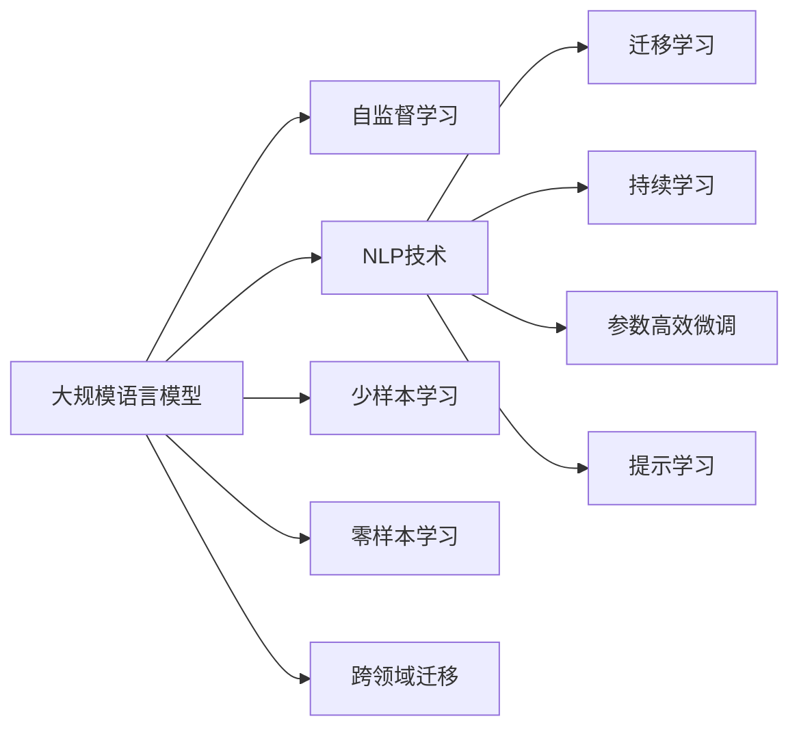

                 

# 未来工作技能：适应 LLM 驱动的经济

## 1. 背景介绍

### 1.1 问题由来
随着人工智能(AI)技术的飞速发展，特别是大规模语言模型(Large Language Models, LLMs)的出现，传统的工作方式和工作技能正在经历深刻的变革。LLMs具备强大的自然语言理解与生成能力，可以在内容创作、客户服务、数据分析等多个领域提供卓越的性能，极大地提升了工作效率和质量。

与此同时，全球经济结构正在向以知识和技术为驱动力的新形态转变。传统劳动密集型的生产方式逐步被机器人和自动化所替代，而知识工作者凭借其在数据处理、问题解决、创新思维等方面的优势，成为了推动经济发展的关键力量。这种趋势下，掌握LLM相关技能，将成为未来工作者的核心竞争力。

### 1.2 问题核心关键点
为了适应LLM驱动的经济环境，未来工作者需要掌握以下核心技能：

- **数据处理与分析**：LLM需要大量高质量的数据进行训练，工作者需具备数据清洗、预处理、可视化等基本能力。
- **自然语言处理(NLP)**：掌握NLP相关技术，包括文本生成、情感分析、命名实体识别等，能够有效使用LLMs进行内容创作与理解。
- **模型部署与维护**：学会如何在不同的平台和环境中部署和维护LLM，保证模型的实时可用性和安全性。
- **算法优化与调参**：了解基本的模型训练和调参技术，能够针对特定任务进行超参数调整和模型优化。
- **跨领域应用**：具备将LLM应用于不同行业和领域的跨学科知识，如医疗、金融、教育等，提升创新能力。

## 2. 核心概念与联系

### 2.1 核心概念概述

为了更好地理解LLM驱动经济的环境，本节将介绍几个关键概念及其相互联系：

- **大规模语言模型(LLMs)**：以Transformer为基础的深度学习模型，通过自监督学习在海量数据上预训练，具备强大的语言理解和生成能力。
- **自然语言处理(NLP)**：研究如何使计算机理解、解释和生成人类语言的技术，是大规模语言模型的基础。
- **迁移学习(Transfer Learning)**：将一个任务学到的知识迁移到另一个任务上，提升新任务的性能。
- **持续学习(Continual Learning)**：模型在不断获得新知识的同时，保持对已有知识的记忆，避免遗忘。
- **参数高效微调(Parameter-Efficient Fine-Tuning, PEFT)**：仅微调少量模型参数，减少资源消耗，提高微调效率。
- **提示学习(Prompt Learning)**：通过设计输入模板，引导模型输出特定结果，适用于零样本或少样本学习。
- **少样本学习(Few-shot Learning)**：模型在少量标注样本下仍能进行有效的微调和学习。
- **零样本学习(Zero-shot Learning)**：模型不依赖任何训练样本，仅通过任务描述即可执行新任务。
- **跨领域迁移(Cross-Domain Transfer)**：模型在多个领域之间迁移应用，提升泛化能力。

这些概念共同构成了LLM驱动经济的基本框架，展示了LLM在实际应用中的广泛潜力。

### 2.2 核心概念原理和架构的 Mermaid 流程图



## 3. 核心算法原理 & 具体操作步骤
### 3.1 算法原理概述

LLM驱动的经济环境中，未来的工作者需掌握基于监督学习的大规模语言模型微调方法，其核心原理如下：

- **数据准备**：收集并准备训练集和测试集，确保数据质量与分布。
- **模型初始化**：使用预训练的LLM作为初始模型，一般选择已经在特定领域进行过预训练的模型。
- **任务适配**：根据具体任务需求，添加或修改模型的输出层和损失函数。
- **模型微调**：通过小批量训练，逐步调整模型参数，最小化损失函数，提升模型性能。
- **模型评估**：在测试集上评估模型性能，确保微调效果。
- **模型部署**：将微调后的模型部署到实际应用中，进行实时推理和反馈优化。

### 3.2 算法步骤详解

具体而言，基于监督学习的大规模语言模型微调步骤如下：

**Step 1: 准备数据集**
- 收集特定任务的数据集，如文本、图像、语音等，确保数据分布与实际应用场景一致。
- 对数据进行预处理，包括清洗、归一化、分词等，提升数据质量。

**Step 2: 初始化模型**
- 选择预训练模型（如BERT、GPT等），加载到计算设备中。
- 初始化模型的参数，一般为预训练模型权重。

**Step 3: 任务适配**
- 根据任务类型，调整模型的输出层和损失函数。
- 对于分类任务，通常添加线性分类器，使用交叉熵损失。
- 对于生成任务，使用语言模型的解码器，以负对数似然为损失。

**Step 4: 微调训练**
- 设定超参数，如学习率、批大小、迭代轮数等。
- 使用梯度下降等优化算法，更新模型参数，最小化损失函数。
- 定期在验证集上评估模型性能，调整超参数。

**Step 5: 模型评估**
- 在测试集上评估微调后的模型，计算各项指标（如准确率、召回率、F1分数等）。
- 对比微调前后的性能，评估微调效果。

**Step 6: 模型部署**
- 将微调后的模型导出为可部署的格式，如TensorFlow SavedModel、PyTorch模型文件等。
- 在实际应用中，集成模型到系统中，进行实时推理。

### 3.3 算法优缺点

基于监督学习的大规模语言模型微调具有以下优点：
1. **高效快速**：仅需少量标注数据，即可显著提升模型性能，适合快速迭代。
2. **泛化能力强**：预训练模型在大规模数据上学习到的通用知识，有助于模型在不同任务上泛化。
3. **易于部署**：微调后的模型可以很容易地部署到实际应用中，进行实时推理。

同时，该方法也存在以下缺点：
1. **依赖数据**：微调效果高度依赖于标注数据的质量和数量，获取高质量标注数据成本较高。
2. **模型复杂性**：预训练模型通常参数量巨大，微调过程需要较高的计算资源。
3. **过拟合风险**：微调过程中容易过拟合训练集，尤其是数据量较小的情况下。
4. **模型偏差**：预训练模型的训练数据可能包含偏见，微调过程可能难以完全消除这些偏差。

## 4. 数学模型和公式 & 详细讲解 & 举例说明

### 4.1 数学模型构建

假设微调任务为文本分类，输入为文本$x$，输出为标签$y$。设微调后的模型为$M_{\theta}$，损失函数为$\ell$，则目标是最小化损失函数：

$$
\min_{\theta} \mathcal{L}(M_{\theta}, D) = \frac{1}{N} \sum_{i=1}^N \ell(M_{\theta}(x_i), y_i)
$$

其中$D=\{(x_i, y_i)\}_{i=1}^N$为训练集。

### 4.2 公式推导过程

以二分类任务为例，假设模型的输出为$\hat{y}=M_{\theta}(x)$，真实标签$y\in\{0,1\}$。交叉熵损失函数为：

$$
\ell(M_{\theta}(x), y) = -y\log \hat{y} - (1-y)\log (1-\hat{y})
$$

将损失函数代入目标函数：

$$
\mathcal{L}(\theta) = -\frac{1}{N}\sum_{i=1}^N [y_i\log \hat{y}_i + (1-y_i)\log (1-\hat{y}_i)]
$$

损失函数对参数$\theta$的梯度为：

$$
\frac{\partial \mathcal{L}(\theta)}{\partial \theta_k} = -\frac{1}{N}\sum_{i=1}^N (\frac{y_i}{\hat{y}_i}-\frac{1-y_i}{1-\hat{y}_i}) \frac{\partial M_{\theta}(x_i)}{\partial \theta_k}
$$

其中$\frac{\partial M_{\theta}(x_i)}{\partial \theta_k}$可以通过反向传播算法高效计算。

### 4.3 案例分析与讲解

以文本分类任务为例，使用BERT模型进行微调。首先，准备数据集，对文本进行预处理和分词，然后使用BERT模型进行微调。具体步骤如下：

1. **数据准备**：收集并预处理数据集，确保数据质量。
2. **模型初始化**：加载预训练的BERT模型，设置需要的输出层和损失函数。
3. **任务适配**：根据分类任务，调整输出层和损失函数，设置类别数。
4. **微调训练**：设定超参数，使用梯度下降算法进行微调，优化模型参数。
5. **模型评估**：在测试集上评估模型性能，计算各项指标。

下面使用Python代码实现上述过程：

```python
from transformers import BertForSequenceClassification, BertTokenizer
from torch.utils.data import DataLoader
from torch import nn, optim

# 加载预训练的BERT模型
model = BertForSequenceClassification.from_pretrained('bert-base-uncased', num_labels=2)

# 加载分词器
tokenizer = BertTokenizer.from_pretrained('bert-base-uncased')

# 加载数据集
train_dataset = ...
val_dataset = ...
test_dataset = ...

# 设置训练参数
device = torch.device('cuda' if torch.cuda.is_available() else 'cpu')
epochs = 3
batch_size = 16
learning_rate = 2e-5

# 定义优化器和损失函数
optimizer = optim.AdamW(model.parameters(), lr=learning_rate)
criterion = nn.CrossEntropyLoss()

# 训练循环
for epoch in range(epochs):
    model.train()
    for batch in DataLoader(train_dataset, batch_size=batch_size, shuffle=True):
        inputs = tokenizer(batch['text'], padding='max_length', truncation=True, max_length=512, return_tensors='pt').to(device)
        labels = batch['label'].to(device)
        outputs = model(**inputs)
        loss = criterion(outputs.logits, labels)
        optimizer.zero_grad()
        loss.backward()
        optimizer.step()

# 评估模型性能
model.eval()
with torch.no_grad():
    preds = []
    labels = []
    for batch in DataLoader(test_dataset, batch_size=batch_size, shuffle=False):
        inputs = tokenizer(batch['text'], padding='max_length', truncation=True, max_length=512, return_tensors='pt').to(device)
        labels = batch['label'].to(device)
        outputs = model(**inputs)
        preds.append(outputs.logits.argmax(dim=1).tolist())
        labels.append(labels.tolist())
    print(classification_report(np.array(labels), np.array(preds)))

```

此代码展示了如何使用PyTorch和Transformers库对BERT模型进行文本分类任务的微调。通过指定数据集、超参数、损失函数和优化器，可以高效地完成模型微调。

## 5. 项目实践：代码实例和详细解释说明

### 5.1 开发环境搭建

为了进行大规模语言模型的微调，需要安装PyTorch、Transformers等库。以下是环境搭建步骤：

1. 安装Anaconda，创建Python虚拟环境。
2. 安装PyTorch和Transformers库。
3. 安装其他必要工具包，如NumPy、Pandas等。

### 5.2 源代码详细实现

以对话系统为例，使用GPT-3模型进行微调。具体步骤如下：

1. **准备数据集**：收集并预处理对话数据集。
2. **模型初始化**：加载预训练的GPT-3模型。
3. **任务适配**：添加对话生成器，使用语言模型的解码器。
4. **微调训练**：设定超参数，使用梯度下降算法进行微调。
5. **模型评估**：在测试集上评估模型性能，计算BLEU、ROUGE等指标。

以下是Python代码实现：

```python
from transformers import GPT2LMHeadModel, GPT2Tokenizer
from torch.utils.data import DataLoader
from torch import nn, optim
from transformers import PreTrainedTokenizerFast

# 加载预训练的GPT-2模型
model = GPT2LMHeadModel.from_pretrained('gpt2')

# 加载分词器
tokenizer = PreTrainedTokenizerFast.from_pretrained('gpt2')

# 加载数据集
train_dataset = ...
val_dataset = ...
test_dataset = ...

# 设置训练参数
device = torch.device('cuda' if torch.cuda.is_available() else 'cpu')
epochs = 3
batch_size = 16
learning_rate = 2e-5

# 定义优化器和损失函数
optimizer = optim.AdamW(model.parameters(), lr=learning_rate)
criterion = nn.NLLLoss()

# 训练循环
for epoch in range(epochs):
    model.train()
    for batch in DataLoader(train_dataset, batch_size=batch_size, shuffle=True):
        inputs = tokenizer(batch['input'], padding='max_length', truncation=True, max_length=512, return_tensors='pt').to(device)
        targets = batch['label'].to(device)
        outputs = model(inputs)
        loss = criterion(outputs.logits, targets)
        optimizer.zero_grad()
        loss.backward()
        optimizer.step()

# 评估模型性能
model.eval()
with torch.no_grad():
    preds = []
    labels = []
    for batch in DataLoader(test_dataset, batch_size=batch_size, shuffle=False):
        inputs = tokenizer(batch['input'], padding='max_length', truncation=True, max_length=512, return_tensors='pt').to(device)
        targets = batch['label'].to(device)
        outputs = model(inputs)
        preds.append(outputs.logits.argmax(dim=1).tolist())
        labels.append(labels.tolist())
    print(bleu(preds, labels))
```

这段代码展示了如何使用PyTorch和Transformers库对GPT-2模型进行对话生成任务的微调。通过指定数据集、超参数、损失函数和优化器，可以高效地完成模型微调。

### 5.3 代码解读与分析

此代码展示了如何使用PyTorch和Transformers库对GPT-2模型进行对话生成任务的微调。通过指定数据集、超参数、损失函数和优化器，可以高效地完成模型微调。

## 6. 实际应用场景

### 6.1 智能客服系统

智能客服系统可以高效处理大量客户咨询，提升服务质量和效率。使用微调后的对话模型，系统能够快速理解客户意图，提供准确的回答，解决复杂问题，提升客户满意度。

具体实现步骤如下：
1. **数据准备**：收集历史客服对话数据，标注客户问题和客服回答。
2. **模型初始化**：加载预训练的对话生成模型。
3. **任务适配**：添加对话生成器，使用语言模型的解码器。
4. **微调训练**：在标注数据上进行微调，优化模型性能。
5. **模型评估**：在测试集上评估模型性能，优化对话质量。

### 6.2 金融舆情监测

金融舆情监测系统可以实时分析市场动态，预警风险。使用微调后的情感分析模型，系统能够快速识别负面信息，及时应对市场波动，保障金融稳定。

具体实现步骤如下：
1. **数据准备**：收集金融新闻、评论等文本数据，标注情感标签。
2. **模型初始化**：加载预训练的情感分析模型。
3. **任务适配**：调整输出层和损失函数，适合情感分类任务。
4. **微调训练**：在标注数据上进行微调，优化情感分类能力。
5. **模型评估**：在测试集上评估模型性能，调整模型参数。

### 6.3 个性化推荐系统

个性化推荐系统可以根据用户行为和偏好，提供定制化的内容推荐。使用微调后的推荐模型，系统能够学习用户兴趣，推荐相关内容，提升用户体验。

具体实现步骤如下：
1. **数据准备**：收集用户行为数据，标注用户偏好标签。
2. **模型初始化**：加载预训练的推荐模型。
3. **任务适配**：调整输出层和损失函数，适合推荐任务。
4. **微调训练**：在标注数据上进行微调，优化推荐效果。
5. **模型评估**：在测试集上评估模型性能，优化推荐策略。

### 6.4 未来应用展望

未来，大规模语言模型在各行各业将发挥越来越重要的作用。以下是几个可能的应用方向：

1. **智慧医疗**：使用微调后的医学问答模型，帮助医生解答病人疑问，提升诊疗效率。
2. **教育培训**：使用微调后的自然语言生成模型，生成个性化学习材料，辅助学生学习。
3. **城市治理**：使用微调后的舆情监测模型，实时分析城市动态，提升应急响应能力。
4. **企业服务**：使用微调后的智能客服系统，提供全天候客户服务，降低人力成本。
5. **农业智能**：使用微调后的自然语言处理模型，解析农业技术文档，提供精准指导。

## 7. 工具和资源推荐

### 7.1 学习资源推荐

为了掌握大规模语言模型微调技术，以下是一些推荐的学习资源：

1. **《Transformers: State-of-the-Art Natural Language Processing》**：深度介绍Transformer及其变体的书籍，包括预训练和微调技术。
2. **CS224N《深度学习自然语言处理》课程**：斯坦福大学开设的NLP课程，涵盖各种经典模型和微调方法。
3. **HuggingFace官方文档**：提供丰富的预训练模型和微调样例，帮助开发者快速上手。
4. **arXiv论文**：阅读最新的研究论文，了解最新的技术和算法。

### 7.2 开发工具推荐

为了提高大规模语言模型微调的效率，以下是一些推荐的开发工具：

1. **PyTorch**：灵活的深度学习框架，支持动态计算图，适合快速迭代。
2. **TensorFlow**：强大的深度学习框架，适合大规模工程应用。
3. **Transformers库**：提供丰富的预训练模型和微调工具，支持多种模型和任务。
4. **Weights & Biases**：模型训练和实验跟踪工具，帮助记录和分析实验结果。
5. **TensorBoard**：可视化工具，实时监测模型训练状态。

### 7.3 相关论文推荐

以下是一些相关的经典论文，推荐阅读：

1. **Attention is All You Need**：介绍Transformer模型的经典论文，奠定预训练大模型的基础。
2. **BERT: Pre-training of Deep Bidirectional Transformers for Language Understanding**：提出BERT模型的论文，开创了大规模预训练语言模型的先河。
3. **GPT-3: Language Models are Unsupervised Multitask Learners**：展示GPT-3模型的论文，引发对通用人工智能的思考。
4. **Parameter-Efficient Transfer Learning for NLP**：提出参数高效微调方法的论文，适合资源受限的微调场景。
5. **Prompt-based Learning**：介绍提示学习方法的论文，利用预训练知识进行零样本或少样本学习。

## 8. 总结：未来发展趋势与挑战

### 8.1 研究成果总结

本文系统介绍了基于监督学习的大规模语言模型微调方法，详细讲解了其原理、步骤和应用场景。通过多个实际案例，展示了微调在智能客服、金融舆情、个性化推荐等多个领域的应用潜力。同时，介绍了未来可能的发展趋势和面临的挑战。

### 8.2 未来发展趋势

未来，大规模语言模型微调技术将呈现以下发展趋势：

1. **模型规模继续扩大**：随着算力提升和数据增加，模型规模将不断扩大，语言模型的通用性和泛化能力将进一步增强。
2. **跨领域迁移能力提升**：模型将能够更好地适应不同领域，提升跨领域迁移能力。
3. **参数高效微调普及**：更多参数高效微调方法将涌现，进一步降低微调对标注数据和计算资源的依赖。
4. **多模态融合**：引入视觉、音频等多模态信息，提升模型的综合处理能力。
5. **持续学习机制**：模型将具备持续学习能力，不断适应新的数据分布和任务需求。

### 8.3 面临的挑战

尽管大规模语言模型微调技术取得了一些进展，但仍然面临以下挑战：

1. **标注数据不足**：标注数据成本高，难以获取高质量标注数据。
2. **过拟合问题**：模型在少量标注数据上容易过拟合。
3. **模型鲁棒性不足**：模型对数据扰动的鲁棒性有待提升。
4. **计算资源消耗大**：模型参数量大，计算资源消耗高。
5. **可解释性不足**：模型的决策过程难以解释，缺乏透明性。

### 8.4 研究展望

未来，需要从以下几个方向进行深入研究：

1. **无监督和半监督学习**：探索更多无监督和半监督学习范式，减少对标注数据的依赖。
2. **跨模态融合**：将视觉、音频等多模态信息与文本信息结合，提升模型的处理能力。
3. **可解释性研究**：提升模型的可解释性，增强透明度和可信度。
4. **跨领域迁移学习**：研究更高效的跨领域迁移方法，提升模型的泛化能力。
5. **对抗训练**：通过对抗训练提高模型的鲁棒性和泛化能力。

## 9. 附录：常见问题与解答

**Q1：大规模语言模型微调是否适用于所有NLP任务？**

A: 大规模语言模型微调在大多数NLP任务上都能取得不错的效果，特别是对于数据量较小的任务。但对于一些特定领域的任务，如医学、法律等，仅依靠通用语料预训练的模型可能难以很好地适应。此时需要在特定领域语料上进一步预训练，再进行微调，才能获得理想效果。

**Q2：微调过程中如何选择合适的学习率？**

A: 微调的学习率一般要比预训练时小1-2个数量级，如果使用过大的学习率，容易破坏预训练权重，导致过拟合。一般建议从1e-5开始调参，逐步减小学习率。

**Q3：采用大模型微调时会面临哪些资源瓶颈？**

A: 大规模语言模型通常参数量巨大，微调过程需要较高的计算资源。GPU/TPU等高性能设备是必不可少的，但即便如此，超大批次的训练和推理也可能遇到显存不足的问题。需要采用梯度积累、混合精度训练等技术进行优化。

**Q4：如何缓解微调过程中的过拟合问题？**

A: 缓解过拟合的方法包括数据增强、正则化、对抗训练等。数据增强可以通过回译、近义替换等方式扩充训练集。正则化可以使用L2正则、Dropout等技术。对抗训练可以引入对抗样本，提高模型鲁棒性。

**Q5：微调模型在落地部署时需要注意哪些问题？**

A: 模型部署需要注意资源优化、模型裁剪、量化加速等技术。在实际应用中，需要将模型封装为标准化服务接口，便于集成调用。同时，需要进行弹性伸缩、监控告警等优化，确保系统稳定性和可用性。

---

作者：禅与计算机程序设计艺术 / Zen and the Art of Computer Programming

