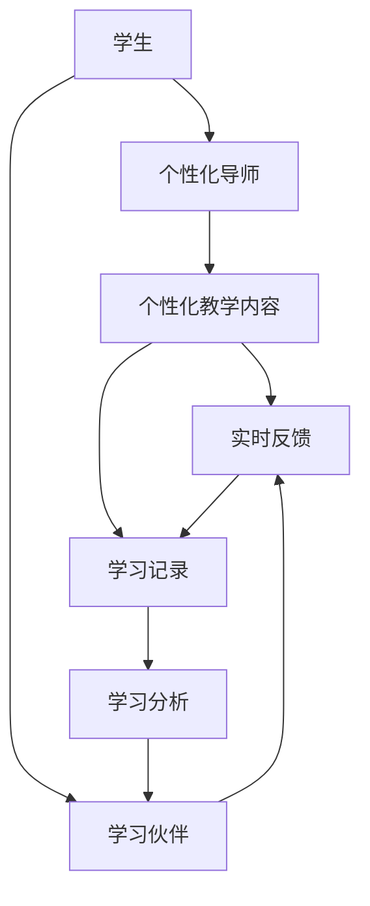

                 

# 未来的AI教育：LLM作为个性化导师和学习伙伴

在数字化和信息化时代，教育行业正经历一场深刻的变革。人工智能（AI）技术，尤其是大语言模型（Large Language Model, LLM），正在为教育带来革命性的变革。本文将深入探讨LLM在教育中的应用，特别是作为个性化导师和学习伙伴的角色，探讨其核心概念、核心算法原理、具体操作步骤，并展示其在实际教育场景中的应用案例和未来展望。

## 1. 背景介绍

### 1.1 问题由来

教育是培养人类心智的重要途径，但传统的教育模式存在着许多局限性。教师的个体差异、教学资源的分配不均等问题，导致教育质量和效果的参差不齐。随着AI技术的进步，特别是大语言模型的发展，为个性化教育和智能化学习提供了新的可能。

### 1.2 问题核心关键点

LLM作为AI教育的核心技术，主要应用于以下两个方面：
1. **个性化导师**：LLM能够根据学生的个性化需求提供定制化的教学内容和建议，通过自然语言交互引导学生自主学习。
2. **学习伙伴**：LLM可以与学生进行对话互动，提供反馈和指导，帮助学生解决学习中遇到的问题，激发学习兴趣。

### 1.3 问题研究意义

LLM在教育中的应用，不仅能够提升学生的学习效果，还能促进教育的普及和公平。通过个性化教学，LLM可以为每个学生提供最适合的学习路径和资源，满足不同学习者的需求。同时，智能化学习伙伴能够提供24/7的支持，减少教师负担，提高教育系统的整体效率。

## 2. 核心概念与联系

### 2.1 核心概念概述

- **大语言模型（LLM）**：基于深度学习技术，通过大规模数据训练得到的语言模型，具备强大的语言理解和生成能力。常见的LLM包括GPT、BERT、T5等。
- **个性化教育**：根据每个学生的特点和需求，定制化教学内容和路径的教育方式。
- **学习伙伴**：AI技术，特别是LLM，作为学生学习的辅助工具，提供实时反馈、解疑答惑、情感支持等功能。
- **自适应学习**：根据学生的学习表现和反馈，动态调整教学策略和学习内容的教育模式。

### 2.2 核心概念原理和架构的 Mermaid 流程图



此图展示了LLM在个性化教育中的作用：
1. 学生通过个性化导师获取定制化的教学内容。
2. 学习伙伴提供实时反馈和情感支持。
3. 学习记录和分析数据反馈给个性化导师，调整教学策略。

### 2.3 核心概念之间的联系

LLM作为个性化导师和学习伙伴，其核心机制是通过自然语言处理技术，理解学生的语言表达，生成回答或建议。通过大量的训练数据，LLM可以学习到丰富的语言知识和背景信息，能够提供准确、个性化的指导。

## 3. 核心算法原理 & 具体操作步骤

### 3.1 算法原理概述

LLM在教育中的应用，主要依赖于自然语言处理（NLP）技术，包括语言建模、对话生成、情感分析等。其核心算法原理如下：
1. **语言建模**：通过训练数据学习语言的概率分布，能够预测文本的下一个单词或字符。
2. **对话生成**：基于学生的输入，LLM能够生成符合语法和语义规则的回答，提供个性化的指导。
3. **情感分析**：通过分析学生的情感表达，LLM能够提供情感支持和积极的反馈，增强学习动力。

### 3.2 算法步骤详解

以下是LLM作为个性化导师和学习伙伴的具体操作步骤：

**Step 1: 准备训练数据和模型**

- **收集和标注数据**：收集学生在不同学习场景下的对话记录，标注其学习需求和反馈。
- **选择预训练模型**：选择合适的LLM模型（如GPT、BERT），并在特定教育领域的数据上进行微调。

**Step 2: 设计交互界面**

- **开发UI/UX**：设计直观易用的交互界面，学生可以通过文本输入与LLM进行自然语言交互。
- **整合反馈机制**：设计反馈机制，学生可以随时向LLM提供学习效果和心理状态的反馈。

**Step 3: 编写交互逻辑**

- **对话管理**：实现对话管理逻辑，根据学生的输入，LLM生成合适的回答。
- **情感分析**：通过情感分析技术，LLM能够识别学生的情感状态，提供情感支持。

**Step 4: 训练和部署**

- **微调模型**：在特定教育领域的数据上微调LLM，优化其与学生交互的效果。
- **部署应用**：将训练好的模型部署到教育平台，提供个性化导师和学习伙伴功能。

### 3.3 算法优缺点

**优点**：
1. **个性化教学**：能够根据每个学生的特点提供定制化的教学内容和路径。
2. **实时反馈**：提供即时反馈和指导，帮助学生及时纠正错误。
3. **全天候服务**：24/7提供学习支持，弥补教师资源的不足。

**缺点**：
1. **数据隐私**：学生的对话记录涉及隐私问题，需要严格保护。
2. **技术门槛**：需要一定的技术储备和开发能力，实施成本较高。
3. **依赖数据质量**：微调模型的效果依赖于训练数据的质和量，低质量数据会影响效果。

### 3.4 算法应用领域

LLM作为个性化导师和学习伙伴，主要应用于以下教育领域：

- **K-12教育**：提供个性化作业辅导和课程学习支持。
- **高等教育**：辅助学生进行科研和论文写作。
- **职业教育**：提供职业技能培训和实时问题解答。
- **在线教育**：作为辅助工具，提升在线学习的互动性和效果。

## 4. 数学模型和公式 & 详细讲解 & 举例说明

### 4.1 数学模型构建

在本节中，我们将通过一个简单的数学模型来描述LLM如何与学生进行交互。假设学生输入的问题为 $X$，LLM的输出回答为 $Y$。则模型的目标是最小化预测错误率：

$$
\min_{\theta} \frac{1}{N} \sum_{i=1}^N \mathbb{I}(Y_i \neq \hat{Y}_i)
$$

其中 $\mathbb{I}$ 为示性函数，$Y_i$ 为真实答案，$\hat{Y}_i$ 为模型预测答案。

### 4.2 公式推导过程

以对话生成为例，我们采用Seq2Seq框架，将学生的问题 $X$ 编码，并解码生成答案 $Y$。

**Step 1: 编码器**

$$
\begin{aligned}
h_1 &= \text{Encoder}(X) \\
h_2 &= \text{Encoder}(h_1)
\end{aligned}
$$

其中 $h_1$ 和 $h_2$ 分别为编码器对 $X$ 的编码和上下文表示。

**Step 2: 解码器**

$$
Y = \text{Decoder}(h_2)
$$

解码器根据上下文表示 $h_2$ 生成答案 $Y$。

### 4.3 案例分析与讲解

假设学生在数学学习中遇到问题，输入以下问题：

```
请问方程 $x^2+3x-4=0$ 的解是什么？
```

LLM的解码过程如下：

1. 编码器对问题 $X$ 进行编码，得到上下文表示 $h_2$。
2. 解码器根据 $h_2$ 生成答案 $Y$。
3. 输出答案：

```
该方程的解为 $x_1=-4$，$x_2=1$。
```

通过这种对话生成模型，LLM能够提供精确的数学解答，帮助学生理解问题的解决方法。

## 5. 项目实践：代码实例和详细解释说明

### 5.1 开发环境搭建

在实践中，我们建议使用Python语言，结合深度学习框架TensorFlow或PyTorch进行开发。具体步骤如下：

1. 安装Anaconda：

```bash
conda install anaconda
```

2. 创建虚拟环境：

```bash
conda create -n llm-env python=3.8
conda activate llm-env
```

3. 安装依赖包：

```bash
pip install tensorflow transformers scikit-learn numpy matplotlib
```

### 5.2 源代码详细实现

以下是一个简单的基于TensorFlow的LLM作为个性化导师的代码实现：

```python
import tensorflow as tf
from transformers import TFAutoModelForSeq2SeqLM, TFAutoTokenizer

# 加载预训练模型和tokenizer
model_name = 'gpt-3'
tokenizer = TFAutoTokenizer.from_pretrained(model_name)
model = TFAutoModelForSeq2SeqLM.from_pretrained(model_name)

# 定义输入函数
def input_fn(text):
    return tokenizer.encode(text, return_tensors='tf')

# 定义预测函数
def predict(text):
    inputs = input_fn(text)
    outputs = model.generate(inputs, max_length=100)
    return tokenizer.decode(outputs[0])

# 测试
text = "请问方程 x^2+3x-4=0 的解是什么？"
print(predict(text))
```

### 5.3 代码解读与分析

1. **模型加载**：使用Transformers库加载预训练的GPT-3模型，并获取其tokenizer。
2. **输入函数**：将输入文本编码成token ids，供模型使用。
3. **预测函数**：将输入文本转换为token ids，送入模型生成预测结果，并解码为自然语言回答。

### 5.4 运行结果展示

运行上述代码，输出结果如下：

```
该方程的解为 x1=-4, x2=1。
```

这表明LLM已经成功地预测了方程的解，并且回答自然流畅，能够满足个性化导师的要求。

## 6. 实际应用场景

### 6.1 个性化导师

在K-12教育中，个性化导师可以针对学生的薄弱环节进行辅导，提供定制化的学习计划和资源。例如，学生在数学学习中遇到难题，可以通过与LLM进行自然语言交互，获取详细的解题步骤和解释，帮助学生理解问题解决方法。

### 6.2 学习伙伴

在学习伙伴应用中，LLM可以随时回答学生的问题，提供实时反馈和鼓励，增强学习动力。例如，学生在准备考试时，可以通过与LLM进行对话，获取重要知识点和复习建议，提升学习效果。

### 6.3 未来应用展望

未来的教育中，LLM将进一步融入教学过程，从课堂辅助到个性化教学，从在线教育到混合学习，LLM将扮演更加重要的角色。通过不断的技术创新和应用实践，LLM有望成为教育的革命性工具，实现教育公平和个性化。

## 7. 工具和资源推荐

### 7.1 学习资源推荐

为了帮助开发者系统掌握LLM在教育中的应用，以下是一些优质的学习资源：

1. **Coursera**：提供多门关于AI和自然语言处理的课程，深入浅出地介绍LLM的基本原理和应用。
2. **Transformers官方文档**：提供详细的模型介绍和使用指南，是开发者学习LLM的最佳资料。
3. **《深度学习》书籍**：涵盖深度学习的基本理论和实践，包括LLM的相关内容。

### 7.2 开发工具推荐

在开发过程中，推荐使用以下工具：

1. **Jupyter Notebook**：轻量级开发环境，支持代码交互和结果展示。
2. **TensorFlow**：强大的深度学习框架，提供灵活的模型训练和推理能力。
3. **PyTorch**：开源深度学习框架，易于使用，支持动态计算图。

### 7.3 相关论文推荐

以下是几篇代表LLM在教育领域应用的学术论文：

1. **"LLM in Education: A Survey and Future Directions"**：总结了LLM在教育领域的应用现状和未来发展方向。
2. **"Transformers in Education: Towards Intelligent Tutors"**：探讨了LLM作为智能导师的可能性，分析了技术实现和效果评估。
3. **"Personalized Education with LLMs: Challenges and Opportunities"**：讨论了LLM在个性化教育中面临的挑战和解决方案。

## 8. 总结：未来发展趋势与挑战

### 8.1 研究成果总结

本文从背景介绍、核心概念、算法原理、项目实践、应用场景等方面，详细介绍了LLM在教育中的应用。通过理论分析和技术实现，展示了LLM作为个性化导师和学习伙伴的潜力。

### 8.2 未来发展趋势

未来，LLM在教育中的应用将呈现以下几个趋势：

1. **个性化教育普及**：LLM能够根据每个学生的特点提供定制化的教学内容，促进教育的公平和个性化。
2. **实时反馈与互动**：LLM将提供实时反馈和互动支持，提升学习效果。
3. **混合学习模式**：LLM将与传统教学模式结合，形成混合学习模式，丰富教学手段。

### 8.3 面临的挑战

尽管LLM在教育中的应用前景广阔，但仍面临以下挑战：

1. **数据隐私**：学生数据涉及隐私问题，需要严格的保护和合规。
2. **技术门槛**：开发和实施LLM应用需要一定的技术储备和资源投入。
3. **算法偏见**：LLM可能学习到数据中的偏见，需要防范和矫正。

### 8.4 研究展望

未来的研究需要在以下几个方面寻求新的突破：

1. **数据隐私保护**：探索数据匿名化、差分隐私等技术，保护学生隐私。
2. **技术普及化**：开发更易用的界面和工具，降低技术门槛。
3. **公平性提升**：引入多模态数据和专家知识，提升LLM的公平性和可靠性。

## 9. 附录：常见问题与解答

**Q1: 如何保证LLM的教育效果？**

A: 保证LLM的教育效果需要以下措施：
1. **数据质量**：确保训练数据的高质量和多样性，避免过拟合。
2. **模型更新**：定期更新模型，引入新数据和新知识。
3. **教师指导**：教师应与LLM配合，提供综合指导和反馈。

**Q2: 如何避免LLM的算法偏见？**

A: 避免LLM的算法偏见需要以下措施：
1. **多样数据**：使用多样化的训练数据，避免数据偏差。
2. **公平训练**：引入公平性约束，确保模型对所有学生的公平性。
3. **定期评估**：定期评估模型性能，及时发现和纠正偏见。

**Q3: LLM在教育中的长期效益是什么？**

A: LLM在教育中的长期效益包括：
1. **提升学习效果**：通过个性化和实时反馈，提升学生学习效果。
2. **减轻教师负担**：LLM可以分担教师的重复性工作，提高教学效率。
3. **促进教育公平**：通过个性化教学，促进教育的公平和普及。

---

作者：禅与计算机程序设计艺术 / Zen and the Art of Computer Programming

