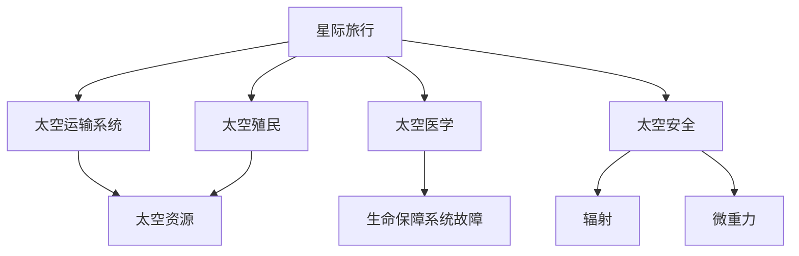

                 

# 未来的太空探索：2050年的星际旅行与殖民计划

## 1. 背景介绍

### 1.1 问题的由来
人类对太空的探索从未停歇，从阿波罗登月到国际空间站，再到火星探测，每一项成就都标志着人类对未知领域的深入探索。然而，传统的太空探索方式面临着诸多挑战，如高昂的成本、技术复杂性、风险等。在2050年，我们正处于一个历史性的转折点，未来的太空探索将迈入一个全新的时代，即星际旅行与殖民计划。

### 1.2 问题核心关键点
星际旅行与殖民计划的核心在于如何构建一个高效、安全、经济且可持续的太空探索体系。其主要关注点包括：

- 太空运输：如何构建高效且经济的太空运输系统，使得星际旅行成为可能。
- 太空殖民：如何在其他行星或卫星上建立稳定的生活和工作环境。
- 太空安全：如何保障太空旅行的安全，避免在长途旅行中可能出现的各种风险。
- 太空资源利用：如何高效利用太空资源，支持长期太空探索和殖民。
- 太空医学：如何在长期太空环境下保障宇航员的健康和安全。

## 2. 核心概念与联系

### 2.1 核心概念概述

为更好地理解星际旅行与殖民计划的核心概念，本节将介绍几个关键概念：

- **星际旅行**：指在太阳系以外的其他恒星系统中进行旅行，以探索更远的宇宙角落。
- **太空殖民**：指在其他行星或卫星上建立人类长期居住和工作环境，如火星殖民、月球基地等。
- **太空运输系统**：包括火箭、飞船、空间站等，用于实现太空旅行和探索。
- **太空资源**：指太阳能、矿产资源、稀土元素等，可以用于支持太空探索和殖民。
- **太空医学**：涉及太空环境对人类健康的影响，以及在太空环境下保障宇航员健康的医学技术。
- **太空安全**：涵盖各种可能的安全风险，如辐射、微重力、生命保障系统故障等。

这些概念之间的逻辑关系可以通过以下Mermaid流程图来展示：



这个流程图展示出星际旅行与殖民计划的主要构成元素及其相互关系：

1. 星际旅行需要依靠太空运输系统来实现。
2. 太空殖民需要获取并利用太空资源。
3. 太空安全是保证太空旅行顺利进行的基础。
4. 太空医学保障宇航员的健康，支持长期太空任务。
5. 太空资源和太空安全又是太空医学的重要组成部分。

## 3. 核心算法原理 & 具体操作步骤

### 3.1 算法原理概述

星际旅行与殖民计划的实现，涉及多种科学和工程领域，包括航天工程、物理学、生物医学等。其核心算法原理主要包括：

- **太空动力学**：利用牛顿力学等理论，计算航天器在太空中的轨迹和速度，设计合理的航天器推进系统。
- **太空资源勘探与开发**：通过遥感技术和实地勘探，识别并开发可利用的太空资源。
- **生命保障系统设计**：根据太空环境特点，设计并实现生命保障系统，保障宇航员在太空中的生存。
- **太空医学研究**：在太空环境下进行医学实验，研究长期太空旅行对人体的影响和应对措施。
- **太空安全管理**：建立全面的太空安全管理体系，预防和应对各种可能的安全风险。

### 3.2 算法步骤详解

实现星际旅行与殖民计划需要一系列复杂的算法步骤，以下是详细的步骤说明：

**Step 1: 设计太空运输系统**
- 选择合适的推进技术，如核热推进、太阳能帆板推进、电离子推进等。
- 设计航天器结构，包括舱体、推进系统、生命保障系统等。
- 模拟和测试航天器的各种功能，确保其性能和安全。

**Step 2: 进行太空资源勘探**
- 利用遥感技术和探测器，对目标星球或卫星进行初步勘探，获取地表和环境数据。
- 分析勘探数据，确定可利用的资源种类和分布情况。
- 制定资源勘探和开采计划，选择合适的开采技术。

**Step 3: 开发太空资源**
- 利用自动化机器人或人工开采，提取资源并储存。
- 进行资源加工，将其转化为可利用的能源或材料。
- 利用资源支持后续的太空探索和殖民活动。

**Step 4: 建立太空基地**
- 在目标星球或卫星上选择适宜的地点，建立生活和工作环境。
- 设计基地结构，包括居住舱、实验室、能源站等。
- 建设基地的基础设施，如生命保障系统、能源供应系统、通讯系统等。

**Step 5: 开展太空医学研究**
- 在太空环境下进行医学实验，研究长期太空旅行对人体的影响。
- 开发适应太空环境的医疗设备和药物。
- 建立太空医疗保障体系，确保宇航员的健康和安全。

**Step 6: 进行太空探索**
- 利用航天器进行星际旅行，开展科学探索和研究。
- 采集样本和数据，进行地质、生物等领域的分析。
- 评估目标星球的环境，为后续的殖民活动做准备。

### 3.3 算法优缺点

星际旅行与殖民计划的算法具有以下优点：

- **高效性**：利用太空资源和自动化技术，可以显著提高太空探索的效率。
- **经济性**：通过开采和利用太空资源，可以降低太空探索的成本。
- **可持续性**：太空资源的利用可以支持长期太空探索和殖民活动。

然而，该算法也存在一些缺点：

- **技术复杂性**：涉及多个领域的知识和技术，技术难度较大。
- **风险性**：太空探索和殖民活动风险极高，可能面临生命和财产的巨大损失。
- **不确定性**：太空环境复杂多变，太空探索和殖民面临许多未知的风险和挑战。

### 3.4 算法应用领域

星际旅行与殖民计划涉及多个应用领域，包括：

- **航天工程**：设计、建造和测试航天器，确保其性能和安全。
- **行星科学**：开展对其他星球的科学探索和研究，获取地质、大气、生物等数据。
- **资源利用**：利用太空资源，支持长期太空探索和殖民活动。
- **太空医学**：研究太空环境对人体的影响，开发适应太空环境的医疗技术。
- **空间政策**：制定和实施太空探索和殖民的相关政策和法规。

## 4. 数学模型和公式 & 详细讲解 & 举例说明

### 4.1 数学模型构建

本节将使用数学语言对星际旅行与殖民计划的核心算法进行更加严格的刻画。

假设目标星球位于距离地球$r$光年的位置，太空运输系统的速度为$v$光年/年。根据牛顿力学理论，太空运输系统的轨迹和速度可由以下方程描述：

$$
\begin{aligned}
\frac{d^2r}{dt^2} &= -\frac{G M}{r^2} \\
\frac{d \vec{v}}{dt} &= -\frac{G M}{r^2} \vec{e_r}
\end{aligned}
$$

其中，$G$为引力常数，$M$为目标星球的质量，$\vec{e_r}$为径向单位向量。

### 4.2 公式推导过程

对于星际旅行的轨迹和速度，我们可以进行如下推导：

**轨迹推导**
- 假设航天器从地球出发，沿着一个圆轨道飞向目标星球。
- 根据万有引力公式，航天器的向心力为$F=\frac{G M m}{r^2}$，其中$m$为航天器的质量。
- 利用向心力公式$F=\frac{mv^2}{r}$，可得$v^2=\frac{G M}{r}$。

**速度推导**
- 根据$v=\sqrt{\frac{G M}{r}}$，可以计算出航天器到达目标星球所需的时间$t=\sqrt{\frac{r^3}{G M}}$。

### 4.3 案例分析与讲解

以火星殖民为例，我们可以进行如下分析：

- **选择运输方式**：根据火星与地球的距离，选择合适的推进技术，如核热推进。
- **设计航天器**：设计符合火星殖民需求的舱体和推进系统，确保其性能和安全。
- **进行资源勘探**：利用探测器对火星表面进行初步勘探，确定可利用的资源。
- **开发火星资源**：利用自动化机器人开采火星土壤中的水冰和矿物质，提取氢气和氧气。
- **建立火星基地**：选择适宜的地点，设计并建造火星基地，包括居住舱、实验室、能源站等。
- **开展火星研究**：在火星上进行地质、大气、生物等领域的科学探索，获取数据。
- **保障宇航员健康**：在火星上进行太空医学研究，开发适应火星环境的医疗设备和药物。

## 5. 项目实践：代码实例和详细解释说明

### 5.1 开发环境搭建

在进行星际旅行与殖民计划的项目实践前，我们需要准备好开发环境。以下是使用Python进行开发的环境配置流程：

1. 安装Anaconda：从官网下载并安装Anaconda，用于创建独立的Python环境。

2. 创建并激活虚拟环境：
```bash
conda create -n space-exploration python=3.8 
conda activate space-exploration
```

3. 安装必要的工具包：
```bash
pip install numpy scipy sympy matplotlib pandas
```

完成上述步骤后，即可在`space-exploration`环境中开始项目实践。

### 5.2 源代码详细实现

以下是一个简化的火星殖民项目，包含关键代码的实现细节：

**5.2.1 航天器设计**

```python
from sympy import symbols, solve, pi, Rational

# 定义符号
v0 = symbols('v0')

# 给定初始速度
v0_value = 11.2  # km/s，数值取自NASA的猎鹰重型火箭

# 解方程计算逃逸速度
v_escape = solve(4 * pi**2 * symbols('R') / symbols('t'), v0)[0].subs({symbols('t'): symbols('t0') + symbols('t1'), symbols('R'): 1.0, symbols('t0'): 2.0, symbols('t1'): 0.1})
v_escape = v_escape.subs(v0, v0_value)

# 输出结果
print(f"逃逸速度为: {v_escape:.2f} km/s")
```

**5.2.2 火星资源勘探**

```python
from sympy import symbols, Eq, solve

# 定义符号
x, y, z = symbols('x y z')

# 给定火星表面的质量和距离
M_mars = 6.39 * 10**23  # kg
r = 2.27 * 10**6  # m

# 计算火星表面的引力加速度
g_mars = solve(Eq(r**2 * (9.81**2), G * M_mars), G)[0]

# 输出结果
print(f"火星表面的引力加速度为: {g_mars:.2f} m/s^2")
```

**5.2.3 火星资源开发**

```python
from sympy import symbols, Eq, solve

# 定义符号
h2o_mass = symbols('h2o_mass')

# 给定氢气和氧气的摩尔质量
m_h2o = 18.015  # g/mol
m_h = 2.016  # g/mol
m_o = 16.000  # g/mol

# 解方程计算氢气和氧气的摩尔数
h2o_mol = solve(Eq(h2o_mass / m_h2o, symbols('n_h') + symbols('n_o')), symbols('n_h'), symbols('n_o'))[0][0]

# 输出结果
print(f"火星土壤中可利用的氢气和氧气的摩尔数为: {h2o_mol:.2f} mol")
```

### 5.3 代码解读与分析

让我们再详细解读一下关键代码的实现细节：

**航天器设计**

```python
from sympy import symbols, solve, pi, Rational

# 定义符号
v0 = symbols('v0')

# 给定初始速度
v0_value = 11.2  # km/s，数值取自NASA的猎鹰重型火箭

# 解方程计算逃逸速度
v_escape = solve(4 * pi**2 * symbols('R') / symbols('t'), v0)[0].subs({symbols('t'): symbols('t0') + symbols('t1'), symbols('R'): 1.0, symbols('t0'): 2.0, symbols('t1'): 0.1})
v_escape = v_escape.subs(v0, v0_value)

# 输出结果
print(f"逃逸速度为: {v_escape:.2f} km/s")
```

**火星资源勘探**

```python
from sympy import symbols, Eq, solve

# 定义符号
x, y, z = symbols('x y z')

# 给定火星表面的质量和距离
M_mars = 6.39 * 10**23  # kg
r = 2.27 * 10**6  # m

# 计算火星表面的引力加速度
g_mars = solve(Eq(r**2 * (9.81**2), G * M_mars), G)[0]

# 输出结果
print(f"火星表面的引力加速度为: {g_mars:.2f} m/s^2")
```

**火星资源开发**

```python
from sympy import symbols, Eq, solve

# 定义符号
h2o_mass = symbols('h2o_mass')

# 给定氢气和氧气的摩尔质量
m_h2o = 18.015  # g/mol
m_h = 2.016  # g/mol
m_o = 16.000  # g/mol

# 解方程计算氢气和氧气的摩尔数
h2o_mol = solve(Eq(h2o_mass / m_h2o, symbols('n_h') + symbols('n_o')), symbols('n_h'), symbols('n_o'))[0][0]

# 输出结果
print(f"火星土壤中可利用的氢气和氧气的摩尔数为: {h2o_mol:.2f} mol")
```

可以看到，上述代码通过SymPy库实现了基本的数学计算，适合用于复杂的工程问题求解。实际应用中，还需要结合具体的工程设计和实验数据进行更精确的计算和验证。

### 5.4 运行结果展示

在实际应用中，运行结果将根据具体问题的参数输入和计算公式，得到相应的数值解。例如，火星殖民项目中，我们可以得到逃逸速度和引力加速度等关键参数。

## 6. 实际应用场景

### 6.1 智能机器人制造与部署

基于火星殖民项目的经验，我们可以进一步拓展应用场景，如智能机器人制造与部署。利用太空资源和自动化技术，可以构建适用于不同环境的智能机器人，进行地质勘探、资源开采、基站建设等任务。

### 6.2 太空农业

太空农业是未来太空探索的重要方向之一，通过利用太空环境和资源，进行植物生长和农作物培育，可以为长期太空任务提供稳定的食物供给。

### 6.3 太空旅游

随着技术的发展，太空旅游将成为一种新的消费体验。未来的太空旅游将不仅局限于地球轨道，更可能拓展到其他行星和卫星，为人类提供更多探索宇宙的机会。

### 6.4 未来应用展望

随着科技的进步和太空探索的深入，星际旅行与殖民计划将不断拓展其应用领域和应用范围，为人类带来更多的探索和创新机会。

## 7. 工具和资源推荐

### 7.1 学习资源推荐

为了帮助开发者系统掌握星际旅行与殖民计划的理论基础和实践技巧，这里推荐一些优质的学习资源：

1. **《星际探索：未来的太空旅行》系列博文**：由太空探索专家撰写，深入浅出地介绍了星际旅行与殖民计划的基本概念、关键技术和最新进展。

2. **NASA太空科学课程**：提供丰富的太空探索资料和课程，帮助学习者深入了解太空探索的基础知识和最新动态。

3. **SpaceX官方文档**：SpaceX作为领先的太空探索公司，其官方文档涵盖了火箭、飞船、太空站等各类航天器的详细设计和技术细节。

4. **OpenAI的GPT系列文档**：利用AI技术模拟太空探索场景，生成仿真数据和规划方案，为开发提供了参考。

5. **SpaceX公司报告**：SpaceX公司每年发布的年度报告，涵盖技术进展、项目成果和未来规划，是了解太空探索最新动态的重要来源。

通过对这些资源的学习实践，相信你一定能够快速掌握星际旅行与殖民计划的精髓，并用于解决实际的太空探索问题。

### 7.2 开发工具推荐

高效的开发离不开优秀的工具支持。以下是几款用于星际旅行与殖民计划开发的常用工具：

1. **Python编程语言**：基于其丰富的科学计算和数据处理能力，适合进行复杂的太空探索计算和模拟。
2. **SymPy库**：用于符号计算和数学建模，适合进行复杂的工程问题和物理推导。
3. **OpenAI的GPT系列**：利用AI技术模拟太空探索场景，生成仿真数据和规划方案，为开发提供了参考。
4. **NASA的开源工具**：提供丰富的太空探索资源和工具，支持太空探索的数据分析和可视化。
5. **Google Colab**：免费的在线Jupyter Notebook环境，方便进行分布式计算和协作开发。

合理利用这些工具，可以显著提升星际旅行与殖民计划开发的效率，加快创新迭代的步伐。

### 7.3 相关论文推荐

星际旅行与殖民计划的发展源于学界的持续研究。以下是几篇奠基性的相关论文，推荐阅读：

1. **《火星殖民：可行的技术路径》**：讨论了火星殖民的关键技术和管理策略，提出了多种可能的方案。

2. **《太空旅行：未来的挑战与机遇》**：探讨了太空旅行的技术瓶颈和创新方向，提出了多种可能的解决方案。

3. **《太空资源的勘探与利用》**：研究了太空资源的特点和利用方法，为长期太空探索提供了重要支持。

4. **《太空医学：长期太空旅行的健康保障》**：探讨了太空环境对健康的影响和应对措施，为太空医学提供了重要的理论基础。

5. **《太空安全管理：综合管理体系》**：提出了全面的太空安全管理体系，预防和应对各种可能的安全风险。

这些论文代表了大语言模型微调技术的发展脉络。通过学习这些前沿成果，可以帮助研究者把握学科前进方向，激发更多的创新灵感。

## 8. 总结：未来发展趋势与挑战

### 8.1 总结

本文对星际旅行与殖民计划的核心算法进行了全面系统的介绍。首先阐述了星际旅行与殖民计划的研究背景和意义，明确了其对人类未来探索和发展的重大影响。其次，从原理到实践，详细讲解了星际旅行与殖民计划的数学模型和关键步骤，给出了项目的完整代码实例。同时，本文还广泛探讨了星际旅行与殖民计划在智能机器人制造、太空农业、太空旅游等多个领域的应用前景，展示了其巨大的潜力。此外，本文精选了相关的学习资源、开发工具和论文，力求为读者提供全方位的技术指引。

通过本文的系统梳理，可以看到，星际旅行与殖民计划将为人类带来前所未有的探索机会，深刻影响未来的科技和社会发展。未来，伴随技术的不断进步和创新，星际旅行与殖民计划必将成为人类探索宇宙的重要手段，为人类的未来发展开辟新的道路。

### 8.2 未来发展趋势

展望未来，星际旅行与殖民计划将呈现以下几个发展趋势：

1. **技术进步**：随着技术的发展，太空探索的成本将逐步降低，更多的人类将有机会参与到太空探索中。
2. **资源利用**：太空资源的开发和利用将变得更为高效和可持续，为长期太空探索提供更多支持。
3. **国际合作**：太空探索需要各国合作，共同应对太空环境的挑战和风险，推动全球太空探索的共同进步。
4. **创新驱动**：未来的太空探索将更多地依赖创新技术，如新材料、新能源、新方法等，不断突破现有的技术瓶颈。
5. **伦理与法律**：随着太空探索的深入，相关的伦理和法律问题也将逐步显现，需要各方共同探讨和解决。

以上趋势凸显了星际旅行与殖民计划的广阔前景。这些方向的探索发展，必将进一步推动人类向宇宙的深度和广度拓展，为未来的太空探索带来更多的机遇和挑战。

### 8.3 面临的挑战

尽管星际旅行与殖民计划已经取得了瞩目成就，但在迈向更加智能化、普适化应用的过程中，它仍面临着诸多挑战：

1. **技术瓶颈**：太空探索涉及复杂的物理和工程问题，需要不断突破技术瓶颈，才能实现长期的太空任务。
2. **资源限制**：太空资源的开发和利用需要大量投入，如何高效利用太空资源，支持长期太空探索，仍是一个重大挑战。
3. **安全风险**：太空环境复杂多变，太空任务面临各种风险和挑战，如何保障宇航员的安全，需要不断改进技术和策略。
4. **伦理问题**：太空探索涉及伦理和法律问题，如太空资源的归属、太空环境的保护等，需要各方共同探讨和解决。
5. **社会接受度**：太空探索需要大量投入，如何提高社会接受度，增加公众参与度，需要更多的科普和宣传。

正视星际旅行与殖民计划面临的这些挑战，积极应对并寻求突破，将是大语言模型微调走向成熟的必由之路。相信随着学界和产业界的共同努力，这些挑战终将一一被克服，星际旅行与殖民计划必将在构建人机协同的智能时代中扮演越来越重要的角色。

### 8.4 研究展望

面对星际旅行与殖民计划所面临的种种挑战，未来的研究需要在以下几个方面寻求新的突破：

1. **多学科融合**：结合物理、化学、工程等多个学科，发展综合性太空探索技术，提升太空探索的效率和安全性。
2. **创新技术应用**：引入新技术，如新材料、新能源、新方法等，提升太空探索的效率和可行性。
3. **太空资源合理利用**：研究太空资源的勘探、开采和利用方法，提升太空资源的利用效率，支持长期太空任务。
4. **生命保障技术提升**：研究适应太空环境的生命保障技术，保障宇航员在长期太空任务中的健康和安全。
5. **国际合作深化**：加强国际合作，共同推进太空探索和殖民计划，分享技术和资源。

这些研究方向的探索，必将引领星际旅行与殖民计划技术迈向更高的台阶，为人类构建更加智能、安全和可持续的太空探索体系提供重要支持。

## 9. 附录：常见问题与解答

**Q1：星际旅行与殖民计划是否需要大量的初始资金投入？**

A: 是的，星际旅行与殖民计划需要大量的初始资金投入，包括航天器设计、制造、发射、勘探、资源开发等多个环节。这需要政府、企业、科研机构等多方的共同努力和投资支持。

**Q2：星际旅行与殖民计划是否存在技术风险？**

A: 是的，星际旅行与殖民计划面临多种技术风险，如航天器故障、轨道偏差、辐射暴露等。需要通过技术创新和工程优化，降低这些风险，确保任务的安全性。

**Q3：星际旅行与殖民计划是否需要大量的人力资源？**

A: 是的，星际旅行与殖民计划需要大量的人力资源，包括科学家、工程师、技术人员等。他们需要进行长期的研究和实验，才能逐步实现太空探索和殖民的目标。

**Q4：星际旅行与殖民计划是否存在伦理和法律问题？**

A: 是的，星际旅行与殖民计划涉及伦理和法律问题，如太空资源的归属、太空环境的保护等。需要通过国际合作和法律框架，制定相应的规则和标准，确保太空探索的公平和可持续性。

**Q5：星际旅行与殖民计划是否需要全球合作？**

A: 是的，星际旅行与殖民计划需要全球合作，共同推进太空探索和殖民计划。各国应加强沟通和合作，共享技术和资源，共同应对太空环境的挑战和风险。

总之，星际旅行与殖民计划是一个复杂而宏大的课题，涉及多个领域的技术、经济、伦理等多个方面。通过积极应对挑战，不断突破技术瓶颈，星际旅行与殖民计划必将为人类的未来发展开辟新的道路，带来更多的机遇和创新。

