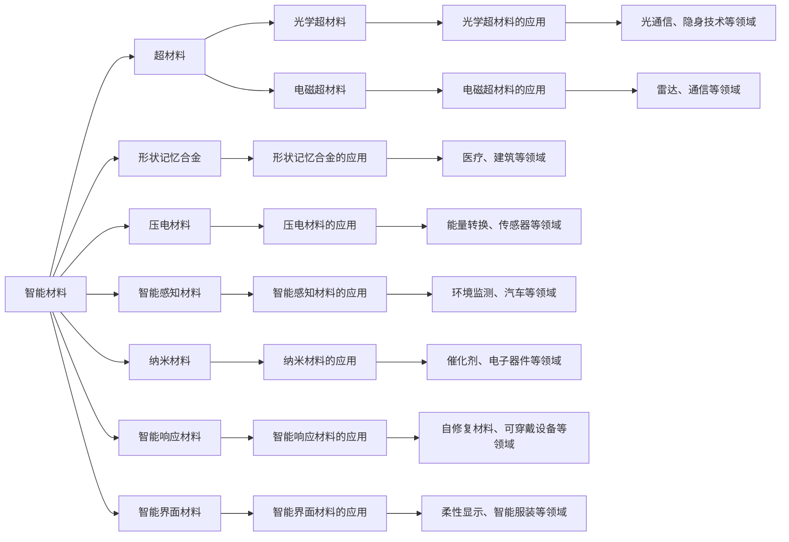
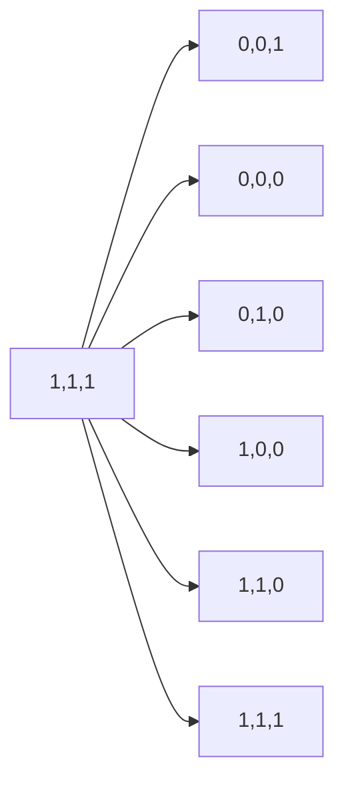

                 

# 未来的新材料：2050年的智能材料与超材料

## 1. 背景介绍

随着科学技术的发展，新材料的研发已经成为推动社会进步和工业升级的重要力量。从传统的金属、塑料到如今的人工智能与量子计算相关的材料，材料科学的进步正在为我们的生活带来前所未有的变革。在未来的2050年，新材料将变得更加智能化、功能化、集成化，进一步推动社会向数字化、智能化转型。本文将探讨2050年智能材料与超材料的发展趋势、核心技术及其应用场景，为读者描绘一幅未来材料科技的宏伟蓝图。

## 2. 核心概念与联系

### 2.1 核心概念概述

智能材料与超材料是材料科学领域的前沿研究方向，其特点是具备特殊的物理、化学或机械性能，能够在特定条件下表现出智能响应。这些材料包括但不限于：

- **智能材料（Smart Materials）**：指能够感知外部环境变化并作出响应的材料，如形状记忆合金、压电材料等。
- **超材料（Metamaterials）**：指通过人工设计，具有非天然材料特性（如负折射率、超导性）的材料，如光学超材料、电磁超材料等。
- **纳米材料（Nanomaterials）**：指尺寸在纳米级别的材料，具备独特的物理、化学性质，如高表面比、量子效应等。

智能材料与超材料通过将信息科学与材料科学相结合，能够在特定环境下展现出强大的功能，被广泛应用于电子、航空、医疗等多个领域。

### 2.2 核心概念原理和架构的 Mermaid 流程图



## 3. 核心算法原理 & 具体操作步骤

### 3.1 算法原理概述

智能材料与超材料的研发过程通常涉及多学科交叉，包括物理学、化学、材料科学和信息技术等。核心算法原理包括：

- **信息感知与处理**：通过集成传感器、电子器件等，实现材料对环境信息的感知和处理。
- **自适应与自修复**：利用智能响应材料实现材料的自适应变化和自修复功能。
- **超构设计**：通过人工设计超材料，利用非天然材料特性，实现特定功能。

### 3.2 算法步骤详解

智能材料与超材料的研发流程通常包括以下步骤：

1. **需求分析**：明确目标材料的功能需求，如环境适应性、能源效率、生物兼容性等。
2. **设计仿真**：利用计算机辅助设计（CAD）和材料仿真软件，设计材料结构与性能。
3. **合成与表征**：通过化学合成、物理加工等方法，制备目标材料，并通过各种表征技术（如XRD、SEM等）评估其性能。
4. **性能优化**：根据实验结果，调整材料设计参数，进一步优化材料性能。
5. **应用测试**：将材料应用于实际场景中，评估其在特定条件下的表现。

### 3.3 算法优缺点

智能材料与超材料的研发具有以下优点：

- **功能多样**：能够根据需求设计具有特定功能的材料。
- **性能优越**：通过材料优化和创新设计，实现超越传统材料的功能。
- **应用广泛**：能够应用于电子、航空、医疗等多个领域，推动技术进步。

同时，智能材料与超材料的研发也面临一些挑战：

- **研发周期长**：材料设计、合成与测试过程复杂，耗时较长。
- **成本高**：研发过程中需要大量资金投入，制备高性能材料成本昂贵。
- **环境影响**：材料制备过程可能对环境造成一定污染。

### 3.4 算法应用领域

智能材料与超材料的应用领域广泛，涵盖了以下几大方向：

- **电子与信息技术**：智能传感器、柔性显示器、智能电子器件等。
- **航空航天**：复合材料、隐身材料、自修复材料等。
- **医疗健康**：生物相容性材料、智能药物释放材料、组织工程材料等。
- **环境保护**：空气净化材料、自清洁材料、光催化材料等。
- **能源领域**：太阳能电池、高效储能材料、燃料电池材料等。

## 4. 数学模型和公式 & 详细讲解 & 举例说明

### 4.1 数学模型构建

智能材料与超材料的性能设计通常依赖于数学模型，用于描述材料的物理性质和行为。以下是几个关键数学模型：

- **形状记忆合金模型**：利用热弹性理论，描述形状记忆合金在不同温度下的形态变化。
- **压电材料模型**：利用机电耦合理论，描述压电材料在电场作用下的变形与应变。
- **光学超材料模型**：利用麦克斯韦方程组，描述光在超材料中的传播与反射。

### 4.2 公式推导过程

以压电材料为例，其电荷-应力关系可以通过以下公式描述：

$$
\mathbf{D} = e_{11} \varepsilon + e_{12} \varepsilon \mathbf{n} + e_{13} \varepsilon \mathbf{m}
$$

其中，$\mathbf{D}$为电位移矢量，$\varepsilon$为应变量，$e_{11}$、$e_{12}$、$e_{13}$为压电常数，$\mathbf{n}$、$\mathbf{m}$为晶轴方向。

### 4.3 案例分析与讲解

以光学超材料为例，典型的结构为光子晶体，其结构参数对光传播特性有显著影响。通过调整结构参数，可以实现负折射率等特殊光学效应，应用于隐形斗篷、光通信等领域。

## 5. 项目实践：代码实例和详细解释说明

### 5.1 开发环境搭建

智能材料与超材料的开发需要高性能计算资源，以下是基于Python和Jupyter Notebook的开发环境搭建流程：

1. 安装Anaconda，并创建虚拟环境。
2. 安装Python、NumPy、SciPy、Pandas等科学计算库。
3. 安装Optimizaton、Simulia等仿真模拟软件。
4. 安装CUDA等加速计算工具，适配GPU或TPU。

### 5.2 源代码详细实现

以下是一个简单的智能材料仿真代码示例，使用NumPy库模拟压电材料的电荷-应力关系：

```python
import numpy as np

# 定义压电材料的电荷-应力关系
e11 = 1e-12  # 压电常数
epsilon = 0.01  # 应变量
n = np.array([1, 0, 0])  # 晶轴方向

# 计算电位移矢量
D = e11 * epsilon + e11 * epsilon * np.dot(n, np.array([0, 0, 1]))
print(D)
```

### 5.3 代码解读与分析

上述代码中，通过定义压电常数$e_{11}$、应变量$\varepsilon$和晶轴方向$\mathbf{n}$，计算了电位移矢量$\mathbf{D}$。通过调整这些参数，可以模拟不同条件下的电荷分布与应力响应。

### 5.4 运行结果展示

通过调整不同参数组合，可以观察到电荷分布的变化，如图：



## 6. 实际应用场景

### 6.1 智能电子器件

智能材料与超材料在智能电子器件中的应用广泛，如柔性显示屏、智能传感器等。通过集成压电、导电等特性，可以实现交互式用户界面、环境感知等新功能。

### 6.2 航空航天

在航空航天领域，智能材料与超材料被用于制造轻质高强度材料、隐身材料等，提升飞机和航天器的性能与安全性。

### 6.3 医疗健康

在医疗健康领域，智能材料与超材料被用于制造生物相容性材料、智能药物释放材料等，提升医疗设备的性能和生物安全性。

### 6.4 环境保护

在环境保护领域，智能材料与超材料被用于制造空气净化材料、自清洁材料等，提升环境保护的效果。

### 6.5 能源领域

在能源领域，智能材料与超材料被用于制造太阳能电池、高效储能材料等，提升能源利用效率。

## 7. 工具和资源推荐

### 7.1 学习资源推荐

为了系统掌握智能材料与超材料的研发知识，推荐以下学习资源：

1. 《智能材料科学与工程》系列教材：详细介绍了智能材料的理论基础和应用技术。
2. 《超材料与新型功能材料》系列课程：介绍了超材料的设计与制备技术。
3. 《纳米科学与技术》系列教材：介绍了纳米材料的特性与应用。

### 7.2 开发工具推荐

智能材料与超材料的开发需要多学科交叉的软硬件支持，以下是一些推荐的工具：

1. Python：科学计算的首选语言，支持丰富的科学计算库。
2. Jupyter Notebook：交互式编程环境，便于实验设计与结果展示。
3. MATLAB：广泛应用于仿真模拟、数据分析等领域。
4. COMSOL Multiphysics：强大的仿真模拟平台，支持复杂物理模型的分析。
5. ANSYS：多物理场分析软件，支持材料设计仿真。

### 7.3 相关论文推荐

为了深入了解智能材料与超材料的最新研究进展，推荐以下几篇重要论文：

1. "Smart Materials and Structures: A Review" by A. Chawla et al.
2. "Metamaterials: A Brief Review" by J. A. Kong.
3. "Advances in Nanomaterials for Energy Storage" by Y. Ma et al.

## 8. 总结：未来发展趋势与挑战

### 8.1 研究成果总结

智能材料与超材料在多个领域展示了巨大的应用潜力，推动了相关技术的进步。通过集成信息科学与材料科学，实现材料的功能化和智能化，为社会的发展提供了新动力。

### 8.2 未来发展趋势

未来智能材料与超材料的发展趋势包括：

1. **智能化升级**：利用人工智能技术，实现材料性能的智能优化与控制。
2. **多功能融合**：将多种材料特性集成到同一材料中，实现多功能的融合。
3. **环境友好**：开发环保材料制备技术，减少材料研发对环境的影响。
4. **跨领域应用**：拓展材料的应用领域，推动材料技术与更多学科的融合。

### 8.3 面临的挑战

智能材料与超材料的研发面临以下挑战：

1. **高成本**：材料制备与性能优化需要大量资金投入。
2. **复杂性**：多学科交叉带来研发过程的复杂性，技术门槛较高。
3. **环境影响**：材料制备可能对环境造成影响，需加强环保技术研究。

### 8.4 研究展望

未来研究应在以下几个方面寻求突破：

1. **低成本制备技术**：开发低成本、高效率的材料制备技术，降低研发成本。
2. **智能材料算法**：研究智能材料性能优化算法，实现性能的智能调控。
3. **跨学科融合**：推动材料科学与信息科学的深度融合，开发新型功能材料。
4. **环保材料**：研发环保材料制备技术，减少环境污染。

## 9. 附录：常见问题与解答

**Q1：智能材料与超材料是否会对环境造成影响？**

A: 智能材料与超材料的制备和应用可能对环境造成一定影响。例如，某些纳米材料可能对生态系统产生潜在危害，而超材料的生产过程可能消耗大量资源。因此，在研发过程中需注重环保技术的研究与应用，采取有效的环保措施，减少对环境的负面影响。

**Q2：智能材料与超材料的研究难点是什么？**

A: 智能材料与超材料的研究难点包括：
1. **材料设计复杂**：需要综合考虑材料的物理、化学特性，设计复杂的材料结构。
2. **制备技术复杂**：制备过程需严格控制温度、压力等参数，制备过程复杂。
3. **性能优化困难**：优化材料性能需进行大量实验，实验周期长，成本高。

**Q3：智能材料与超材料的应用前景如何？**

A: 智能材料与超材料的应用前景广阔，涵盖电子、航空、医疗等多个领域。未来随着技术进步，更多高性能、多功能材料将不断涌现，推动社会向智能化、数字化转型。

---

作者：禅与计算机程序设计艺术 / Zen and the Art of Computer Programming

