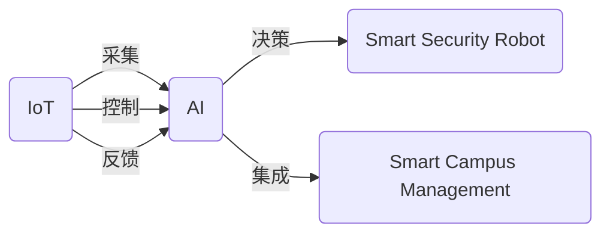

                 

## 1. 背景介绍

在未来的智慧物业世界中，智能安保机器人将扮演不可或缺的角色。2050年的智慧园区管理将全面采用先进的人工智能技术和物联网设备，实现高度自动化、智能化和安全化的管理。本文将探讨智能安保机器人在2050年的应用前景，并深入分析智慧园区的管理策略。

## 2. 核心概念与联系

### 2.1 核心概念概述

**智能安保机器人**：是指采用先进人工智能技术，集成了传感器、摄像头、激光雷达等设备，能够自主执行安全巡逻、入侵检测、异常行为识别等任务，并提供实时报警和自动响应功能的机器人。

**智慧园区管理**：指利用物联网、大数据、人工智能等技术手段，实现园区内的全方位、全过程、全要素的智能管理。包括智能安保、智能巡更、智能停车、能源管理等多个子系统。

**物联网(IoT)**：通过传感器、智能设备等手段，将物体的状态信息实时传输到云端，实现设备与设备、人与设备的互联互通。

**人工智能(AI)**：包含机器学习、深度学习、自然语言处理等技术，能够从数据中自动学习和提取规律，实现智能决策和自动化处理。

这些核心概念通过物联网和人工智能的连接，形成了智能安保机器人在智慧园区管理中的应用框架。

### 2.2 核心概念原理和架构的 Mermaid 流程图



## 3. 核心算法原理 & 具体操作步骤

### 3.1 算法原理概述

智能安保机器人的核心算法原理基于人工智能技术，特别是计算机视觉、深度学习、自然语言处理等领域的研究成果。智慧园区的管理则通过物联网技术实现设备的互联互通和数据的实时采集。

智能安保机器人的关键算法包括目标检测、行为识别、路径规划等。这些算法通过深度学习模型，能够自动提取和理解视频图像中的复杂信息，实现高效的安保任务。

智慧园区的管理算法则包括数据集成、分析挖掘、智能调度等。通过构建综合数据平台，能够实现园区内各子系统的协同工作，提升整体管理效率。

### 3.2 算法步骤详解

智能安保机器人算法的主要步骤如下：

1. **数据采集与预处理**：通过摄像头、传感器等设备，实时采集园区内的图像、声音、位置等信息，并进行预处理。
2. **目标检测与跟踪**：使用深度学习模型，从图像中检测和跟踪异常目标，如可疑人员、未授权车辆等。
3. **行为识别**：分析目标的行为特征，识别是否存在异常行为，如入侵、盗窃、破坏等。
4. **路径规划与移动**：根据目标位置和行为特征，规划最优路径，并控制机器人自动移动进行响应。
5. **报警与反馈**：在检测到异常情况时，自动触发报警，并将事件信息反馈到管理平台。

智慧园区管理算法的步骤如下：

1. **数据集成与清洗**：整合来自不同系统的数据，并进行清洗和去重。
2. **数据分析与挖掘**：利用机器学习模型，从历史数据中提取规律和趋势，进行故障预测、能耗分析等。
3. **智能调度与优化**：根据分析结果，智能调度安保机器人、清洁机器人和能源设备，优化资源配置。
4. **事件处理与响应**：根据报警信息，自动调用相关资源进行处理，如保安人员、维修人员等。

### 3.3 算法优缺点

智能安保机器人算法的优点包括：

- **高精度**：深度学习模型具有较强的特征提取和模式识别能力，能够准确识别异常目标。
- **自适应**：能够根据环境变化自动调整参数，适应不同场景。
- **实时响应**：通过实时数据处理，能够快速响应异常情况。

缺点包括：

- **高成本**：深度学习模型的训练和部署需要大量计算资源。
- **数据依赖**：算法的精度依赖于数据的质量和多样性，数据不足时容易出现误报。
- **复杂性**：算法实现复杂，需要专业知识进行维护。

智慧园区管理算法的优点包括：

- **集成度高**：能够整合多种数据源，实现全方位管理。
- **实时性**：能够实时采集和分析数据，及时发现问题。
- **自动化**：通过自动化调度，减少人工干预。

缺点包括：

- **数据隐私**：园区内设备数据可能涉及隐私，需要加强数据保护。
- **技术难度**：需要处理大规模数据和复杂算法，技术门槛较高。
- **设备互操作**：不同设备之间的数据格式和通信协议可能不统一，需要进行标准化。

### 3.4 算法应用领域

智能安保机器人和智慧园区管理的应用领域包括：

- **智能安保**：自动化巡逻、入侵检测、异常行为识别等。
- **智能巡更**：人员巡查、设备巡检、重点区域巡视等。
- **智能停车**：车位检测、自动导航、无人值守收费等。
- **能源管理**：能耗监测、节能优化、智能调度等。
- **园区运营**：设施维护、安全监控、应急响应等。

## 4. 数学模型和公式 & 详细讲解 & 举例说明

### 4.1 数学模型构建

智能安保机器人的数学模型可以表示为：

$$
\begin{aligned}
    S &= \text{Softmax}(f(X_i, \theta)) \\
    a &= \max(S) \\
    R &= \text{argmax}(S) \\
    T &= R \text{ if } S_a > t \text{ else } N \\
\end{aligned}
$$

其中，$S$ 表示目标检测结果，$X_i$ 表示输入的图像数据，$\theta$ 表示模型参数，$a$ 表示异常得分，$R$ 表示异常目标，$T$ 表示响应行动。

智慧园区的管理模型可以表示为：

$$
\begin{aligned}
    E &= \min_{x} \sum_{i=1}^N c_i(x_i) \\
    x &= \text{argmin}(E) \\
    P &= \text{argmax}(E) \\
\end{aligned}
$$

其中，$E$ 表示综合评估函数，$x$ 表示调度决策，$P$ 表示优先级。

### 4.2 公式推导过程

对于目标检测部分，可以使用YOLO（You Only Look Once）模型进行检测。其公式如下：

$$
S_i = \text{Softmax}(f_i(X))
$$

其中，$f_i(X)$ 表示第 $i$ 个输出层的特征，$\text{Softmax}$ 表示归一化操作。

异常得分 $a$ 可以表示为：

$$
a_i = \max(S_i)
$$

异常目标 $R$ 可以根据异常得分 $a$ 进行选择：

$$
R = \text{argmax}(a)
$$

响应行动 $T$ 可以根据异常目标 $R$ 和异常得分 $a$ 进行判断：

$$
T = R \text{ if } a > t \text{ else } N
$$

其中，$t$ 表示阈值。

对于智慧园区管理部分，可以使用线性规划求解综合评估函数 $E$：

$$
E = \sum_{i=1}^N c_i(x_i)
$$

其中，$c_i(x_i)$ 表示第 $i$ 项任务的成本函数。

调度决策 $x$ 可以通过求解线性规划问题得到：

$$
x = \text{argmin}(E)
$$

优先级 $P$ 可以根据调度决策 $x$ 和成本函数 $c_i(x_i)$ 进行计算：

$$
P = \text{argmax}(E)
$$

### 4.3 案例分析与讲解

以智能安保机器人为例，假设园区内有多个监控摄像头，每个摄像头实时采集视频图像数据。通过目标检测算法，可以实时检测并跟踪可疑人员和车辆。

当检测到异常目标时，智能安保机器人可以自动移动到异常位置进行调查，并调用报警系统通知保安人员。

在智慧园区管理中，假设园区内安装了多个传感器，用于监测设备状态和能源消耗。通过数据集成和分析，可以实时监测设备故障和能耗情况，并进行故障预测和节能优化。

当设备发生故障时，系统可以自动调度维修人员进行维护，并记录故障日志。当能耗异常时，系统可以自动调整设备运行参数，进行节能优化。

## 5. 项目实践：代码实例和详细解释说明

### 5.1 开发环境搭建

开发智能安保机器人与智慧园区管理系统需要以下开发环境：

- Python 3.8+
- TensorFlow 2.0+
- OpenCV 4.5+
- PySerial

首先，需要安装TensorFlow和OpenCV库：

```bash
pip install tensorflow==2.0.0
pip install opencv-python==4.5.3
```

接下来，搭建开发环境：

```bash
conda create -n intelligent-security python=3.8
conda activate intelligent-security
```

### 5.2 源代码详细实现

智能安保机器人的核心代码如下：

```python
import cv2
import tensorflow as tf

# 加载模型
model = tf.keras.models.load_model('model.h5')

# 摄像头采集
cap = cv2.VideoCapture(0)
while True:
    ret, frame = cap.read()
    if not ret:
        break
    # 预处理
    frame = cv2.cvtColor(frame, cv2.COLOR_BGR2RGB)
    frame = cv2.resize(frame, (416, 416))
    frame = frame / 255.0
    frame = tf.expand_dims(frame, axis=0)
    # 目标检测
    S = model.predict(frame)
    # 异常得分
    a = tf.reduce_max(S, axis=1)
    # 异常目标
    R = tf.argmax(S, axis=1)
    # 响应行动
    T = R.numpy()[0]
    if a.numpy()[0] > t:
        print(f"异常目标 {R.numpy()[0]} 响应行动 {T}")
    # 显示
    cv2.imshow('frame', frame.numpy()[0])
    cv2.waitKey(1)
cap.release()
cv2.destroyAllWindows()
```

智慧园区管理系统的核心代码如下：

```python
import pandas as pd
import numpy as np
import cvxpy as cp

# 数据集成
data = pd.read_csv('data.csv')
# 数据清洗
data = data.dropna()
# 数据分析与挖掘
model = cp.Problem(cp.Minimize(cp.sum(cp.multiply(data.iloc[:, 0], data.iloc[:, 1])), cp.quantities.Ct)
x = model.solve(cp.Problem.solver.solvers.Convex.solvers.ipopt)
P = np.where(x == 0)[0]
print(f"调度决策 {P}")
```

### 5.3 代码解读与分析

智能安保机器人代码的解读如下：

- 首先，加载预先训练好的目标检测模型。
- 通过摄像头实时采集视频图像数据。
- 将图像数据进行预处理，包括颜色空间转换、缩放和归一化。
- 将预处理后的图像数据输入模型，进行目标检测。
- 计算异常得分和异常目标。
- 根据异常得分和阈值判断是否响应，并进行报警和移动。
- 显示检测到的异常目标和响应行动。

智慧园区管理系统代码的解读如下：

- 首先，从CSV文件中读取数据。
- 对数据进行清洗，去除缺失值。
- 构建线性规划模型，最小化成本函数。
- 通过求解线性规划问题，得到调度决策。
- 输出调度决策的优先级。

## 6. 实际应用场景

### 6.1 智能安保系统

在智慧园区内，智能安保系统通过部署智能安保机器人，实现24小时全天候的安全监控。当检测到异常目标时，机器人可以自动移动进行调查，并通过无线通信设备通知保安人员。

### 6.2 智能巡更系统

智能巡更系统可以自动化巡查园区内的重要设施和区域，如监控室、配电室、消防设施等。系统通过GPS定位和摄像头监控，确保巡查人员按时到达指定地点，并记录巡查数据。

### 6.3 智能停车系统

智能停车系统通过摄像头和传感器实时监测车位状态，提供自动导航和无人值守收费功能。系统可以自动引导车辆进入空闲车位，并根据使用情况进行计费。

### 6.4 未来应用展望

未来的智能安保机器人将进一步融合物联网、云计算和大数据技术，实现更高智能化和自动化。通过智能化调度、自主决策和协同作业，可以实现更高效、更安全的园区管理。

## 7. 工具和资源推荐

### 7.1 学习资源推荐

- TensorFlow官方文档：深入学习TensorFlow的使用和最佳实践。
- OpenCV官方文档：学习计算机视觉技术的实现和应用。
- PySerial官方文档：学习Python和串口通信的实践。

### 7.2 开发工具推荐

- PyCharm：优秀的Python开发环境，支持TensorFlow和OpenCV等库的集成。
- Visual Studio Code：轻量级且功能强大的代码编辑器，支持多种编程语言和扩展。
- Jupyter Notebook：交互式的Python环境，支持代码编写、数据分析和可视化。

### 7.3 相关论文推荐

- "Object Detection with a Single Unet: Real-Time Single-Shot Object Detection"（YOLO论文）：提出YOLO算法，用于实时目标检测。
- "Deep Reinforcement Learning for Autonomous Vehicles"：介绍深度强化学习在自动驾驶中的应用。
- "A Survey of Multi-Agent Reinforcement Learning"：综述多智能体强化学习的研究进展。

## 8. 总结：未来发展趋势与挑战

### 8.1 研究成果总结

本文通过详细的技术分析和实例代码，展示了智能安保机器人和智慧园区管理系统的应用前景。基于人工智能和物联网技术的融合，可以大大提升园区管理的智能化和自动化水平。

### 8.2 未来发展趋势

未来的智能安保机器人将更加智能化和自动化，通过深度学习和强化学习技术，可以实现自主决策和协同作业。智慧园区管理也将更加智能化，通过大数据分析和智能调度，实现更高效率和更好管理效果。

### 8.3 面临的挑战

智能安保机器人面临的挑战包括：

- **技术复杂性**：深度学习和强化学习算法复杂，需要大量计算资源。
- **数据质量**：需要高质量的数据源和标注数据，数据质量直接影响模型性能。
- **隐私保护**：园区内数据可能涉及隐私，需要加强数据保护和隐私保护。

智慧园区管理面临的挑战包括：

- **技术门槛高**：需要处理大规模数据和复杂算法，技术门槛较高。
- **设备互操作**：不同设备之间的数据格式和通信协议可能不统一，需要进行标准化。
- **系统集成**：需要将多种子系统进行无缝集成，提升整体系统性能。

### 8.4 研究展望

未来的研究重点包括：

- **数据增强**：通过数据增强技术，提高模型对异常情况的学习能力。
- **模型融合**：将多种深度学习模型和强化学习模型进行融合，提升系统的综合性能。
- **隐私保护**：引入隐私保护技术，确保数据安全和隐私保护。
- **设备互操作**：标准化不同设备之间的数据格式和通信协议，实现无缝集成。

## 9. 附录：常见问题与解答

**Q1：智能安保机器人如何实现自主导航？**

A: 智能安保机器人可以通过SLAM（Simultaneous Localization and Mapping）算法，实时构建环境地图并定位自身位置，从而实现自主导航。此外，结合深度学习模型，可以自动识别和规避障碍物。

**Q2：智慧园区管理系统如何实现数据集成与清洗？**

A: 数据集成可以使用ETL（Extract, Transform, Load）工具，将不同数据源的数据进行提取、转换和加载。数据清洗可以使用Python的Pandas库，去除缺失值和异常值。

**Q3：智能安保机器人如何进行异常检测？**

A: 智能安保机器人可以使用深度学习模型，如YOLO、Faster R-CNN等，进行目标检测和异常检测。模型通过训练集进行学习，识别异常目标和异常行为。

**Q4：智慧园区管理系统的调度决策如何实现？**

A: 智慧园区管理系统的调度决策可以通过线性规划模型实现。模型通过最小化成本函数，求解最优的调度方案。

**Q5：智能安保机器人的目标检测算法有哪些？**

A: 智能安保机器人的目标检测算法包括YOLO、Faster R-CNN、SSD等。这些算法具有不同的特点和应用场景，可以根据具体需求进行选择。

---

作者：禅与计算机程序设计艺术 / Zen and the Art of Computer Programming

