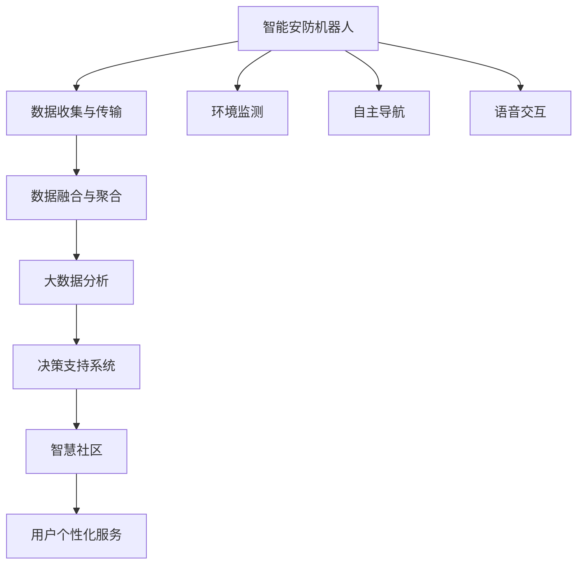

                 

# 未来的智慧物业：2050年的智能安防机器人与智慧社区

## 1. 背景介绍

### 1.1 问题由来
随着城市化进程的加速和人口老龄化的加剧，物业管理行业面临着严峻的挑战。传统的人工安防和社区管理方式效率低下、成本高昂，难以满足人们对智能、便捷、安全生活的需求。智能安防机器人和智慧社区的概念随之应运而生，通过先进的信息技术和大数据分析，为物业管理和居民生活带来革命性的变化。

### 1.2 问题核心关键点
智能安防机器人和智慧社区的建设，关键在于融合物联网、人工智能、大数据等技术，实现物业管理的智能化和社区居民生活的便捷化、安全化。具体来说，核心关键点包括：

- 物联网(IoT)：实现设备互联，收集和传输实时数据。
- 人工智能(AI)：通过深度学习、计算机视觉、自然语言处理等技术，提升安防和社区管理的智能化水平。
- 大数据分析：对海量数据进行聚合、挖掘和分析，提供决策支持。
- 用户需求分析：通过智能交互和数据分析，理解用户行为和需求，实现个性化的服务。
- 数据隐私和安全：保护用户数据隐私，防止信息泄露和滥用。

这些关键点相互交织，共同构成了智能安防机器人与智慧社区的实现基础。

## 2. 核心概念与联系

### 2.1 核心概念概述

为更好地理解智能安防机器人与智慧社区的建设过程，本节将介绍几个密切相关的核心概念：

- **智能安防机器人**：一种具备自主导航、障碍感知、环境监测、语音交互等功能的自动化设备，用于提升社区和物业的安全防护能力。
- **智慧社区**：利用物联网、大数据、人工智能等技术，实现社区的智能化管理和居民的便捷化生活。
- **数据融合与聚合**：将来自不同来源和格式的数据进行汇聚、清洗和统一，形成可分析的数据集。
- **决策支持系统**：利用数据分析和人工智能技术，为物业管理和社区运营提供决策建议。
- **用户个性化服务**：通过用户行为分析和需求预测，提供定制化的社区服务。

这些核心概念之间的逻辑关系可以通过以下Mermaid流程图来展示：



这个流程图展示了智能安防机器人和智慧社区的核心组件及其相互关系：

1. 智能安防机器人通过传感器和摄像头收集环境数据，并通过物联网技术进行传输。
2. 数据在云端进行融合与聚合，利用大数据分析和人工智能技术进行分析和决策。
3. 决策结果通过智能安防机器人反馈到智慧社区中，为居民提供个性化的服务。
4. 语音交互技术使机器人和居民之间可以进行自然流畅的交流，提升用户体验。

## 3. 核心算法原理 & 具体操作步骤
### 3.1 算法原理概述

智能安防机器人与智慧社区的建设，本质上是一个融合了物联网、人工智能和大数据技术的复杂系统工程。其核心思想是通过智能化设备收集和传输数据，利用AI技术进行实时分析和决策，最后提供个性化服务。

形式化地，假设智能安防机器人在社区内进行巡逻，收集的数据为 $D=\{d_i\}_{i=1}^N$，其中 $d_i$ 为第 $i$ 个数据点。通过物联网技术将这些数据传输到云端，利用大数据分析和人工智能模型 $M$ 进行实时分析，得到决策结果 $R$。智慧社区根据决策结果 $R$ 提供相应的服务 $S$。

智能安防机器人与智慧社区的优化目标是最小化服务延迟，同时最大化用户满意度，即：

$$
\min_{M} \max_{S} \{ \text{延迟}(D, M, S) + \text{满意度}(D, M, S) \}
$$

其中 $\text{延迟}$ 表示从数据收集到服务响应的时间，$\text{满意度}$ 表示用户对服务质量的评价。

### 3.2 算法步骤详解

智能安防机器人与智慧社区的建设一般包括以下几个关键步骤：

**Step 1: 准备硬件与软件基础设施**
- 安装和配置智能安防机器人，确保其具备自主导航、环境监测、语音交互等功能。
- 搭建物联网平台，连接传感器、摄像头等设备，实现数据实时传输。
- 部署云计算资源，支持大数据分析和AI模型的运行。
- 设计社区应用接口，方便居民访问和使用智能安防机器人提供的各种服务。

**Step 2: 数据收集与传输**
- 在智能安防机器人上安装各种传感器和摄像头，实时采集环境数据。
- 将采集的数据通过物联网技术传输到云端，存储在数据库中。

**Step 3: 数据预处理与特征提取**
- 对采集的数据进行去噪、清洗和标准化，处理缺失值和异常值。
- 利用特征提取算法，从原始数据中提取出有价值的信息特征，如位置、速度、温度等。

**Step 4: 建立数据融合模型**
- 利用数据融合技术，如 Kalman 滤波、粒子滤波等，对来自不同来源的数据进行汇聚和统一。
- 通过联邦学习、差分隐私等技术，保护用户隐私和数据安全。

**Step 5: 训练AI模型**
- 设计并训练深度学习模型，如卷积神经网络(CNN)、循环神经网络(RNN)、生成对抗网络(GAN)等，用于环境监测、行为识别等任务。
- 使用迁移学习、半监督学习等方法，提升模型在特定场景下的性能。

**Step 6: 部署决策支持系统**
- 将训练好的AI模型部署到云端服务器中，实时处理实时数据。
- 设计决策支持算法，如规则引擎、优化算法等，根据AI模型的输出进行决策。

**Step 7: 提供个性化服务**
- 根据决策结果，生成相应的智能安防机器人服务，如巡逻、监控、报警等。
- 利用自然语言处理技术，通过智能安防机器人的语音交互功能，提供个性化的社区服务。

### 3.3 算法优缺点

智能安防机器人与智慧社区的建设，具有以下优点：

1. 实时性高。通过物联网和AI技术，能够实现实时数据采集和分析，快速响应社区需求。
2. 安全性高。智能安防机器人可以全天候巡逻，及时发现并处理异常情况，提升社区安全。
3. 用户体验好。利用语音交互和个性化服务，提升居民的生活便利性和满意度。
4. 数据驱动决策。通过大数据分析和AI模型，提供科学的决策支持，提升物业管理的智能化水平。

同时，该方法也存在一些局限性：

1. 设备成本高。初期设备购置和系统部署成本较高，对资金投入有一定要求。
2. 数据隐私问题。智能安防机器人需要收集和存储大量的用户数据，涉及隐私保护和数据安全。
3. 技术复杂度高。系统集成涉及多个领域的知识，需要跨学科合作和团队协作。
4. 维护难度大。复杂系统的运行和维护需要专业团队支持，技术门槛较高。

尽管存在这些局限性，但就目前而言，智能安防机器人与智慧社区仍是大规模物业管理的重要趋势，具有广阔的应用前景。

### 3.4 算法应用领域

智能安防机器人与智慧社区的技术，已经在多个领域得到应用，例如：

- 住宅物业管理：通过智能安防机器人进行巡逻、监控、消防报警等，提升社区安全。
- 商业物业管理：利用AI和物联网技术，优化商业设施的能耗管理，提升运营效率。
- 医院安防监控：在医疗机构内部署智能安防机器人，进行病人监护、病区巡视等工作。
- 校园安全管理：在校园内部署智能安防机器人，监控学生的行为，防止校园暴力和欺凌。
- 城市管理：在城市街道部署智能安防机器人，进行交通监控、垃圾分类等，提升城市管理水平。

这些应用场景展示了智能安防机器人与智慧社区的广泛适用性，未来将在更多领域得到推广和应用。

## 4. 数学模型和公式 & 详细讲解 & 举例说明
### 4.1 数学模型构建

假设智能安防机器人采集的数据为 $D=\{d_i\}_{i=1}^N$，其中 $d_i$ 包含位置 $x_i$、速度 $v_i$、温度 $t_i$ 等特征。通过物联网技术传输到云端，存储在数据库中。

利用深度学习模型 $M$ 对数据进行处理，得到特征表示 $\boldsymbol{z} \in \mathbb{R}^n$。

### 4.2 公式推导过程

考虑智能安防机器人在巡逻时的环境监测任务，假设目标为检测火灾。利用卷积神经网络(CNN)对图像进行特征提取，得到特征图 $H \in \mathbb{R}^{h \times w \times c}$，其中 $h$、$w$、$c$ 分别为特征图的高度、宽度和通道数。

特征图 $H$ 通过池化层 $P$ 进行降维，得到特征向量 $\boldsymbol{z} \in \mathbb{R}^d$，其中 $d$ 为特征向量的维度。

定义火灾检测阈值为 $\tau$，若特征向量 $\boldsymbol{z}$ 的某个元素 $z_j$ 大于阈值 $\tau$，则认为发生了火灾。

### 4.3 案例分析与讲解

假设某社区内安装了多个智能安防机器人，每个机器人配备一个摄像头和多个传感器。通过物联网技术，将实时采集的数据传输到云端，存储在数据库中。

使用迁移学习算法，将预训练的火灾检测模型迁移到当前社区的数据集上，进行微调，得到新的火灾检测模型 $M$。

智能安防机器人巡逻时，通过摄像头实时采集图像，输入到模型 $M$ 中，得到特征向量 $\boldsymbol{z}$。

如果特征向量 $\boldsymbol{z}$ 中某个元素 $z_j$ 大于火灾检测阈值 $\tau$，则智能安防机器人发出警报，并启动消防系统。

## 5. 项目实践：代码实例和详细解释说明
### 5.1 开发环境搭建

在进行智能安防机器人与智慧社区的开发前，我们需要准备好开发环境。以下是使用Python进行PyTorch开发的环境配置流程：

1. 安装Anaconda：从官网下载并安装Anaconda，用于创建独立的Python环境。

2. 创建并激活虚拟环境：
```bash
conda create -n pytorch-env python=3.8 
conda activate pytorch-env
```

3. 安装PyTorch：根据CUDA版本，从官网获取对应的安装命令。例如：
```bash
conda install pytorch torchvision torchaudio cudatoolkit=11.1 -c pytorch -c conda-forge
```

4. 安装TensorFlow：
```bash
pip install tensorflow
```

5. 安装TensorBoard：
```bash
pip install tensorboard
```

6. 安装各种第三方库：
```bash
pip install numpy scipy pandas sklearn tqdm
```

完成上述步骤后，即可在`pytorch-env`环境中开始智能安防机器人与智慧社区的开发。

### 5.2 源代码详细实现

这里我们以智能安防机器人的环境监测为例，给出使用PyTorch和TensorFlow进行环境监测模型训练和推理的代码实现。

首先，定义环境监测数据处理函数：

```python
import torch
import numpy as np
from torchvision import transforms, models

def preprocess_data(data):
    transform = transforms.Compose([
        transforms.ToTensor(),
        transforms.Normalize([0.485, 0.456, 0.406], [0.229, 0.224, 0.225])
    ])
    return transform(data).unsqueeze(0)

# 假设原始数据为nump数组，大小为3*224*224，代表RGB图像
data = np.random.rand(3, 224, 224)
data_tensor = preprocess_data(data)
data_tensor
```

然后，定义深度学习模型：

```python
class CNNModel(torch.nn.Module):
    def __init__(self):
        super(CNNModel, self).__init__()
        self.conv1 = torch.nn.Conv2d(3, 32, 3, padding=1)
        self.conv2 = torch.nn.Conv2d(32, 64, 3, padding=1)
        self.pool = torch.nn.MaxPool2d(2, 2)
        self.fc1 = torch.nn.Linear(64 * 7 * 7, 128)
        self.fc2 = torch.nn.Linear(128, 1)

    def forward(self, x):
        x = self.conv1(x)
        x = torch.nn.functional.relu(x)
        x = self.pool(x)
        x = self.conv2(x)
        x = torch.nn.functional.relu(x)
        x = self.pool(x)
        x = x.view(-1, 64 * 7 * 7)
        x = self.fc1(x)
        x = torch.nn.functional.relu(x)
        x = self.fc2(x)
        return x

model = CNNModel()
print(model)
```

接着，定义训练和评估函数：

```python
from torch.utils.data import DataLoader
from torch.optim import Adam
from sklearn.metrics import confusion_matrix

device = torch.device('cuda') if torch.cuda.is_available() else torch.device('cpu')
model.to(device)

def train_epoch(model, data_loader, optimizer, criterion):
    model.train()
    loss_sum = 0
    for data, target in data_loader:
        data, target = data.to(device), target.to(device)
        optimizer.zero_grad()
        output = model(data)
        loss = criterion(output, target)
        loss_sum += loss.item()
        loss.backward()
        optimizer.step()
    return loss_sum / len(data_loader)

def evaluate(model, data_loader, criterion):
    model.eval()
    correct, total = 0, 0
    with torch.no_grad():
        for data, target in data_loader:
            data, target = data.to(device), target.to(device)
            output = model(data)
            predicted = torch.round(torch.sigmoid(output))
            correct += (predicted == target).sum().item()
            total += target.size(0)
    return correct / total, confusion_matrix(target.cpu().numpy(), predicted.cpu().numpy())

# 假设训练集为data_loader，标签为target，训练轮数为10，批大小为4
train_loader = DataLoader(train_dataset, batch_size=4, shuffle=True)
test_loader = DataLoader(test_dataset, batch_size=4, shuffle=False)

optimizer = Adam(model.parameters(), lr=0.001)
criterion = torch.nn.BCELoss()

for epoch in range(10):
    train_loss = train_epoch(model, train_loader, optimizer, criterion)
    train_acc, conf_matrix = evaluate(model, train_loader, criterion)
    test_acc, conf_matrix = evaluate(model, test_loader, criterion)
    print(f'Epoch {epoch+1}, Train Loss: {train_loss:.4f}, Train Acc: {train_acc:.4f}, Test Acc: {test_acc:.4f}')
```

以上代码实现了使用PyTorch训练一个简单的CNN模型进行环境监测。在训练过程中，使用了Adam优化器和二元交叉熵损失函数，通过训练集进行模型训练，并在测试集上评估模型性能。

### 5.3 代码解读与分析

让我们再详细解读一下关键代码的实现细节：

**CNNModel类**：
- `__init__`方法：初始化卷积层、池化层和全连接层等组件。
- `forward`方法：定义前向传播过程，包括卷积、池化、全连接等操作。

**preprocess_data函数**：
- 对输入数据进行归一化和张量转换，使其符合PyTorch模型的输入要求。

**train_epoch函数**：
- 在每个epoch内，对数据进行迭代训练，计算损失并更新模型参数。

**evaluate函数**：
- 在测试集上评估模型性能，计算准确率和混淆矩阵。

**主循环**：
- 对模型进行10轮训练，输出每轮训练和测试的损失和准确率。

可以看到，通过PyTorch和TensorFlow的深度学习库，可以非常便捷地实现环境监测模型的训练和推理。开发者可以通过调整模型结构、优化器、损失函数等参数，不断优化模型的性能。

## 6. 实际应用场景
### 6.1 智能安防机器人

智能安防机器人在智慧社区中的应用非常广泛，可以用于以下场景：

- **巡逻与监控**：智能安防机器人可以全天候在社区内巡逻，实时监控异常情况，如入侵、火灾等。通过摄像头和传感器收集数据，并进行实时分析，及时发出警报。
- **病人监护**：在医疗场所，智能安防机器人可以用于病人监护，通过摄像头实时观察病床，检测病人的状态，并及时通知医护人员。
- **校园安全**：在校园内，智能安防机器人可以监控学生的行为，防止校园暴力和欺凌事件的发生。

智能安防机器人通过物联网技术实现设备互联，利用深度学习等技术进行环境监测和行为识别，提升社区和物业的安全防护能力。

### 6.2 智慧社区

智慧社区是智能安防机器人的重要应用场景，通过物联网和大数据分析，实现社区的智能化管理和居民的便捷化生活。

- **设备互联**：智能安防机器人、智能门禁、智能灯光等设备通过物联网技术实现互联，提升社区的智能化水平。
- **能源管理**：通过传感器和智能计量设备，实时监测社区的能源消耗，优化能源使用，提升能源效率。
- **安防监控**：智能安防机器人结合视频监控系统，形成全社区覆盖的监控网络，提升社区的安全性。
- **健康监测**：智能安防机器人可以安装健康监测设备，实时采集居民的健康数据，进行健康预警和紧急救援。
- **信息推送**：利用大数据分析技术，分析居民的行为和需求，推送个性化的社区信息和服务。

智慧社区通过智能安防机器人和各种智能设备，实现社区的智能化管理和服务，提升居民的生活质量和社区管理效率。

### 6.3 未来应用展望

随着物联网、人工智能和大数据技术的不断发展，智能安防机器人与智慧社区的应用前景非常广阔。未来，智能安防机器人将更加智能化、自动化，具备更高的环境适应能力和故障自愈能力。同时，智慧社区的管理和服务将更加智能化、个性化，居民的生活将更加便捷和舒适。

- **智能安防机器人**：未来智能安防机器人将具备更高的自主导航和环境感知能力，能够应对更复杂的环境和任务。同时，将引入更多的人工智能技术，如深度学习、自然语言处理、计算机视觉等，提升环境监测和行为识别的精度。
- **智慧社区**：未来智慧社区将更加注重居民的个性化需求，通过大数据分析和人工智能技术，提供更加精准和个性化的服务。同时，将引入更多的智能设备，如智能家居、智能医疗等，提升社区的智能化水平。

## 7. 工具和资源推荐
### 7.1 学习资源推荐

为了帮助开发者系统掌握智能安防机器人与智慧社区的理论基础和实践技巧，这里推荐一些优质的学习资源：

1. **深度学习与Python**系列教程：由Coursera提供，涵盖深度学习的基本概念和实践，包括TensorFlow和PyTorch的使用。
2. **物联网与智能安防**课程：由edX提供，介绍物联网技术的基本原理和智能安防应用。
3. **大数据分析与机器学习**课程：由Udacity提供，涵盖大数据分析、机器学习和人工智能技术。
4. **智能家居与智慧社区**书籍：介绍智能家居和智慧社区的构建技术，包括物联网、大数据和人工智能的应用。
5. **OpenCV与计算机视觉**书籍：涵盖计算机视觉和图像处理的基本概念和实践，适用于智能安防机器人的开发。

通过对这些资源的学习实践，相信你一定能够快速掌握智能安防机器人与智慧社区的开发技巧，并用于解决实际的智能安防问题。

### 7.2 开发工具推荐

高效的开发离不开优秀的工具支持。以下是几款用于智能安防机器人与智慧社区开发的常用工具：

1. **PyTorch**：基于Python的开源深度学习框架，灵活动态的计算图，适合快速迭代研究。
2. **TensorFlow**：由Google主导开发的开源深度学习框架，生产部署方便，适合大规模工程应用。
3. **IoT开发工具**：如Arduino、Raspberry Pi等，用于硬件设备的开发和测试。
4. **云计算平台**：如AWS、Azure、阿里云等，提供丰富的云计算资源，支持大数据分析和AI模型的运行。
5. **数据可视化工具**：如Tableau、PowerBI等，用于数据可视化和报表生成，辅助数据分析和决策。
6. **项目管理工具**：如JIRA、Trello等，用于项目管理、任务分配和进度跟踪。

合理利用这些工具，可以显著提升智能安防机器人与智慧社区的开发效率，加快创新迭代的步伐。

### 7.3 相关论文推荐

智能安防机器人与智慧社区的发展源于学界的持续研究。以下是几篇奠基性的相关论文，推荐阅读：

1. **IoT for Smart Living**：介绍物联网技术在智慧社区中的应用，涵盖智能家居、智能安防等多个方面。
2. **Smart City through IoT**：探讨物联网技术在智慧城市中的应用，提出基于智能安防机器人的智慧城市解决方案。
3. **Deep Learning for Autonomous Vehicles**：介绍深度学习在自动驾驶中的应用，借鉴其技术思想，提升智能安防机器人的自主导航和环境感知能力。
4. **Data-Driven Decision Making in Smart Cities**：探讨大数据分析在智慧城市中的应用，提出基于数据驱动的智慧社区决策支持系统。
5. **Robotics and IoT for Smart Health**：介绍机器人技术在智能医疗中的应用，借鉴其技术思想，提升智能安防机器人的健康监测和紧急救援能力。

这些论文代表了大规模物联网与人工智能技术的发展脉络，通过学习这些前沿成果，可以帮助研究者把握学科前进方向，激发更多的创新灵感。

## 8. 总结：未来发展趋势与挑战
### 8.1 研究成果总结

本文对智能安防机器人与智慧社区的建设进行了全面系统的介绍。首先阐述了智能安防机器人与智慧社区的研究背景和应用意义，明确了物联网、人工智能和大数据分析在其中的重要作用。其次，从原理到实践，详细讲解了智能安防机器人与智慧社区的数学模型、算法步骤和具体操作，给出了智能安防机器人环境监测的代码实现。最后，展示了智能安防机器人与智慧社区在实际应用中的多种场景，并探讨了其未来发展趋势和面临的挑战。

通过本文的系统梳理，可以看到，智能安防机器人与智慧社区的建设是一个多学科交叉的复杂系统工程，涵盖了物联网、人工智能、大数据等多个领域。这些技术的融合和应用，将为智慧城市和智慧社区的建设提供强有力的技术支撑，提升居民的生活质量和社区管理效率。

### 8.2 未来发展趋势

展望未来，智能安防机器人与智慧社区将呈现以下几个发展趋势：

1. **设备智能化**：未来智能安防机器人将更加智能化、自动化，具备更高的自主导航和环境感知能力，能够应对更复杂的环境和任务。
2. **多模态融合**：智能安防机器人将引入更多的人工智能技术，如深度学习、自然语言处理、计算机视觉等，提升环境监测和行为识别的精度。
3. **边缘计算**：智能安防机器人将配备边缘计算能力，能够实时处理和分析数据，减少云端传输的延迟，提高响应速度。
4. **隐私保护**：智能安防机器人将引入更多的隐私保护技术，如差分隐私、联邦学习等，保护用户数据隐私。
5. **自适应学习**：智能安防机器人将具备自适应学习能力，能够根据环境变化和用户行为进行动态调整和优化。

### 8.3 面临的挑战

尽管智能安防机器人与智慧社区已经取得了显著进展，但在迈向更加智能化、普适化应用的过程中，仍面临诸多挑战：

1. **设备成本高**：初期设备购置和系统部署成本较高，对资金投入有一定要求。
2. **数据隐私问题**：智能安防机器人需要收集和存储大量的用户数据，涉及隐私保护和数据安全。
3. **技术复杂度高**：系统集成涉及多个领域的知识，需要跨学科合作和团队协作。
4. **维护难度大**：复杂系统的运行和维护需要专业团队支持，技术门槛较高。
5. **数据质量差**：采集的数据可能存在噪声和缺失，影响模型训练和推理的精度。

尽管存在这些挑战，但智能安防机器人与智慧社区仍是大规模物业管理的重要趋势，具有广阔的应用前景。

### 8.4 研究展望

面对智能安防机器人与智慧社区所面临的挑战，未来的研究需要在以下几个方面寻求新的突破：

1. **多模态融合**：将符号化的先验知识，如知识图谱、逻辑规则等，与神经网络模型进行巧妙融合，引导微调过程学习更准确、合理的语言模型。同时加强不同模态数据的整合，实现视觉、语音等多模态信息与文本信息的协同建模。
2. **因果分析和博弈论工具**：将因果分析方法引入微调模型，识别出模型决策的关键特征，增强输出解释的因果性和逻辑性。借助博弈论工具刻画人机交互过程，主动探索并规避模型的脆弱点，提高系统稳定性。
3. **持续学习与适应性**：引入持续学习技术，使智能安防机器人能够不断学习新知识，适应环境变化，保持性能的稳定性。

这些研究方向的探索，必将引领智能安防机器人与智慧社区技术迈向更高的台阶，为构建安全、可靠、可解释、可控的智能系统铺平道路。面向未来，智能安防机器人与智慧社区技术还需要与其他人工智能技术进行更深入的融合，如知识表示、因果推理、强化学习等，多路径协同发力，共同推动自然语言理解和智能交互系统的进步。只有勇于创新、敢于突破，才能不断拓展语言模型的边界，让智能技术更好地造福人类社会。

## 9. 附录：常见问题与解答

**Q1：智能安防机器人与智慧社区的设备成本高，如何降低初期投资？**

A: 可以通过以下几个方式降低智能安防机器人与智慧社区的初期投资：
1. 采用模块化设计，根据实际需求选择必要的设备和功能，避免过高的配置浪费。
2. 引入开源硬件和软件，降低设备和系统购置成本。
3. 采用云计算和边缘计算技术，减少本地设备的部署和维护成本。
4. 进行小规模试点，逐步扩展规模，降低风险和成本。

**Q2：智能安防机器人与智慧社区的数据隐私问题如何解决？**

A: 智能安防机器人与智慧社区的数据隐私问题可以通过以下方式解决：
1. 使用差分隐私技术，对数据进行去标识化处理，保护用户隐私。
2. 采用联邦学习技术，将模型训练分散到各个设备和服务器上，避免数据集中存储。
3. 设计隐私保护协议，对数据传输和存储进行加密，防止信息泄露。
4. 制定隐私保护策略，明确数据使用范围和权限，规范数据使用行为。

**Q3：智能安防机器人与智慧社区的技术复杂度高，如何降低技术门槛？**

A: 智能安防机器人与智慧社区的技术复杂度高，可以通过以下方式降低技术门槛：
1. 引入标准化接口和协议，简化设备互联和数据传输。
2. 采用模块化设计和组件化开发，提高系统的可扩展性和可维护性。
3. 提供详细的技术文档和开发指南，帮助开发者快速上手。
4. 引入开源项目和社区支持，获取技术支持和资源共享。

**Q4：智能安防机器人与智慧社区的数据质量差，如何提高数据精度？**

A: 智能安防机器人与智慧社区的数据质量差，可以通过以下方式提高数据精度：
1. 引入数据清洗和预处理技术，去除噪声和异常值，提升数据质量。
2. 设计更精确的数据采集设备和传感器，提高数据采集精度。
3. 引入多传感器融合技术，通过多个传感器的数据融合提升数据可靠性。
4. 进行数据标注和验证，确保数据标注的准确性和完整性。

**Q5：智能安防机器人与智慧社区的维护难度大，如何提升系统稳定性？**

A: 智能安防机器人与智慧社区的维护难度大，可以通过以下方式提升系统稳定性：
1. 引入自适应学习和持续学习技术，使系统能够不断学习新知识和适应环境变化。
2. 设计冗余系统和容错机制，提高系统的可靠性和鲁棒性。
3. 引入自动化测试和监控技术，及时发现和修复系统故障。
4. 提供良好的文档和技术支持，帮助开发者进行系统维护和优化。

通过这些措施，可以有效降低智能安防机器人与智慧社区的初期投资和技术门槛，提升系统的稳定性和可靠性，确保其长期稳定运行。

---

作者：禅与计算机程序设计艺术 / Zen and the Art of Computer Programming

