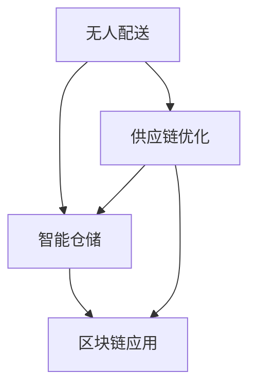

                 

# 未来的智慧物流：2050年的无人配送与供应链优化

## 1. 背景介绍

### 1.1 问题由来
随着全球经济一体化和电子商务的飞速发展，物流产业面临着前所未有的压力。传统物流模式存在诸多问题，如运力浪费、效率低下、成本高昂等。与此同时，人工智能技术的兴起为物流产业带来了新的机遇和挑战。无人配送、智能仓储、自动化搬运等技术正在逐渐改变传统的物流格局。

未来，物流行业将向高度智能化、自动化、数字化方向发展。无人配送系统将广泛应用，实现高效、可靠、低成本的物流运输。供应链也将通过数据驱动的方式进行优化，实现需求与供给的精准匹配，提升物流效率和客户满意度。

### 1.2 问题核心关键点
未来的智慧物流主要包括以下几个关键点：

- **无人配送**：利用无人机、无人车、自动驾驶技术，实现全天候、无障碍的货物运输。
- **智能仓储**：通过物联网、机器人、自动化存储技术，实现仓储管理的高效化和智能化。
- **供应链优化**：利用大数据、人工智能等技术，优化供应链管理，实现精准预测和动态调整。
- **区块链应用**：利用区块链技术，提升供应链透明度，防止数据篡改，保障货物流转的可靠性。

这些关键点的实现将推动物流产业的全面变革，大幅提升物流效率和客户满意度，降低运营成本，推动经济可持续发展。

## 2. 核心概念与联系

### 2.1 核心概念概述

为了更好地理解未来智慧物流的实现过程，本节将介绍几个密切相关的核心概念：

- **无人配送**：指使用无人驾驶技术，如无人机、无人车等，进行货物配送的过程。与传统配送方式相比，无人配送具有全天候、无障碍、高效率等优点。

- **智能仓储**：通过物联网、机器人、自动化存储等技术，实现仓储管理的智能化和自动化。智能仓储不仅能提升存储效率，还能显著降低运营成本。

- **供应链优化**：指利用大数据、人工智能等技术，对供应链进行动态调整和优化，实现需求与供给的精准匹配。供应链优化的目标是通过减少库存、优化物流路径等方式，提升供应链的整体效率。

- **区块链应用**：利用区块链技术，实现供应链的透明化、去中心化和不可篡改，保障货物流转的可靠性和安全性。

这些核心概念之间的逻辑关系可以通过以下Mermaid流程图来展示：



这个流程图展示了大语言模型的核心概念及其之间的关系：

1. 无人配送是物流运输的自动化实现，依赖智能仓储和区块链技术的支持。
2. 智能仓储通过自动化存储和物联网技术，提升仓储管理效率。
3. 供应链优化通过对数据进行分析和预测，实现需求与供给的精准匹配。
4. 区块链应用通过去中心化和不可篡改性，提升供应链的透明度和安全性。

这些核心概念共同构成了未来智慧物流的实现框架，使得无人配送、智能仓储、供应链优化和区块链技术能够协同工作，共同推动物流产业的智能化转型。

## 3. 核心算法原理 & 具体操作步骤
### 3.1 算法原理概述

未来智慧物流的核心算法原理主要包括以下几个方面：

- **无人配送算法**：基于路径规划和路径优化算法，如A*、Dijkstra等，实现无人配送的最优路径选择。
- **智能仓储算法**：利用机器学习和强化学习算法，优化自动化仓储的存储策略和机器人路径规划。
- **供应链优化算法**：利用大数据分析和机器学习算法，预测市场需求，优化供应链管理，实现动态调整。
- **区块链共识算法**：利用共识算法，如PoW、PoS等，保障区块链网络的安全性和可靠性，提升供应链透明度。

这些算法原理共同构成了未来智慧物流的技术基础，使得无人配送、智能仓储、供应链优化和区块链技术能够有效协同，实现物流产业的全面智能化。

### 3.2 算法步骤详解

以下详细介绍未来智慧物流各核心算法的详细步骤：

**无人配送算法步骤**：

1. 收集配送起始点和目的地的地理位置数据。
2. 使用路径规划算法，如A*、Dijkstra等，计算配送路径。
3. 使用避障算法，如障碍物检测和路径优化，确保配送路径无障碍。
4. 将计算出的配送路径发送到无人配送设备，如无人机、无人车等。

**智能仓储算法步骤**：

1. 收集仓储管理数据，如货物信息、仓库容量、机器人状态等。
2. 使用机器学习和强化学习算法，优化仓库存储策略，如货位分配、存储优化等。
3. 使用路径规划算法，如A*、Dijkstra等，优化机器人路径规划。
4. 将优化后的存储策略和路径规划结果发送到机器人，进行自动化存储和搬运。

**供应链优化算法步骤**：

1. 收集供应链相关数据，如市场需求、库存信息、物流路径等。
2. 使用大数据分析和机器学习算法，预测市场需求和供应链状态。
3. 使用优化算法，如线性规划、整数规划等，动态调整供应链管理。
4. 将优化后的供应链管理策略和路径规划结果发送到供应链各环节，进行动态调整。

**区块链共识算法步骤**：

1. 定义区块链网络节点，如物流公司、供应商、客户等。
2. 设计共识算法，如PoW、PoS等，保障区块链网络的安全性和可靠性。
3. 实现数据上链和去中心化存储，提升供应链透明度和安全性。
4. 使用智能合约技术，自动化处理供应链相关事务，如货物流转、支付等。

以上是未来智慧物流各核心算法的详细步骤，具体实现将根据具体需求和场景进行调整。

### 3.3 算法优缺点

未来智慧物流各核心算法的优缺点如下：

**无人配送算法**：

- 优点：实现全天候、无障碍、高效率的配送，减少人力成本，提升配送效率。
- 缺点：对技术要求高，初期投资大，需要大规模技术支持。

**智能仓储算法**：

- 优点：提升仓储管理效率，减少人力成本，降低运营成本。
- 缺点：对技术要求高，初期投资大，需要大规模技术支持。

**供应链优化算法**：

- 优点：实现需求与供给的精准匹配，提升供应链整体效率，降低运营成本。
- 缺点：数据复杂性高，需要大量数据支持，对技术要求高。

**区块链共识算法**：

- 优点：提升供应链透明度和安全性，防止数据篡改，保障货物流转的可靠性。
- 缺点：技术复杂度高，需要大量节点和计算资源支持。

这些算法的优缺点需要根据具体需求和场景进行综合考虑，选择合适的算法进行实现。

### 3.4 算法应用领域

未来智慧物流的核心算法已经在多个领域得到广泛应用，例如：

- **电商物流**：利用无人配送和智能仓储技术，实现高效、可靠、低成本的电商物流配送。
- **医疗供应链**：利用区块链技术，提升医疗供应链的透明度和安全性，保障药品流转的可靠性和可追溯性。
- **制造供应链**：利用供应链优化算法，优化生产计划和物流路径，提升生产效率和供应链效率。
- **智能农业**：利用无人配送和智能仓储技术，实现农产品的自动化运输和储存，提升农业生产效率。

除了上述这些应用场景外，未来智慧物流技术还将被创新性地应用到更多领域，如智慧城市、智能交通等，为经济社会发展注入新的动力。

## 4. 数学模型和公式 & 详细讲解  
### 4.1 数学模型构建

未来智慧物流的核心算法原理可以通过数学模型进行更严格地刻画。

假设无人配送路径为$(x_0, x_1, ..., x_n)$，其中$x_i$为配送节点，$i=0,1,...,n$。设配送起始点为$x_0$，配送目的地为$x_n$。无人配送的成本函数为$C(x)$，路径长度函数为$L(x)$。

定义路径优化问题为：

$$
\min_{x} C(x) + \lambda L(x)
$$

其中$\lambda$为路径长度惩罚系数。

使用A*算法求解最优路径，定义启发式函数为$f(x) = g(x) + h(x)$，其中$g(x)$为实际路径长度，$h(x)$为启发式估计值。路径优化问题可以转化为搜索最优路径$f(x)$的问题。

智能仓储中的存储策略优化问题可以通过机器学习算法进行建模。假设仓库中有$K$个货位，每个货位存储的货物数量为$w_k$，$k=1,2,...,K$。设仓库容量为$C$，存储成本为$C_k$，存储策略优化问题可以建模为：

$$
\min_{w} \sum_{k=1}^K C_kw_k + \lambda w_k
$$

其中$\lambda$为货位占用惩罚系数。

供应链优化问题可以通过线性规划算法进行建模。假设供应链中的货物需求量为$d$，库存量为$s$，单位库存成本为$C_s$，单位运输成本为$C_t$。设供应链中的节点为$N$，运输路径为$T$，供应链优化问题可以建模为：

$$
\min_{d,s,T} \sum_{i=1}^N (d_i + s_i)C_s + \sum_{j=1}^T C_t j
$$

其中$d_i$为节点$i$的需求量，$s_i$为节点$i$的库存量。

区块链共识算法可以使用PoW（工作量证明）或PoS（权益证明）等共识算法进行建模。假设区块链网络中的节点数量为$N$，每个节点的计算能力为$P$，共识算法的时间复杂度为$T$。共识算法的基本原理为：

- PoW：通过计算复杂的工作量证明，保障网络的安全性和可靠性。
- PoS：通过节点持有的权益证明，保障网络的安全性和可靠性。

## 4.2 公式推导过程

以下是未来智慧物流各核心算法公式的推导过程：

**无人配送算法**：

假设无人配送路径为$(x_0, x_1, ..., x_n)$，路径长度函数为$L(x)$。使用A*算法求解最优路径。

1. 初始化：$g(x_0) = 0, f(x_0) = g(x_0) + h(x_0)$，其中$h(x_0) = L(x_0, x_n)$。
2. 从起始节点开始，选择启发式函数最小的节点$x_i$。
3. 计算$x_i$的后继节点$x_j$，并更新$g(x_j), f(x_j)$。
4. 重复步骤2-3，直到到达终点$x_n$。

使用A*算法，可以高效求解无人配送的最优路径，避免路径长度和成本的浪费。

**智能仓储算法**：

假设仓库中有$K$个货位，每个货位存储的货物数量为$w_k$，存储成本为$C_k$。使用机器学习算法进行存储策略优化。

1. 收集历史数据，如货物的类型、体积、重量等。
2. 使用机器学习算法，如决策树、随机森林、神经网络等，预测每种货物的存储位置和存储时间。
3. 根据预测结果，优化货位分配策略，最小化存储成本和货位占用。

使用机器学习算法，可以实现智能仓储的高效存储策略优化，提升仓储管理效率。

**供应链优化算法**：

假设供应链中的节点为$N$，运输路径为$T$。使用线性规划算法进行供应链优化。

1. 收集供应链数据，如需求量、库存量、运输路径等。
2. 构建优化模型，使用线性规划算法求解最优解。
3. 根据最优解，动态调整供应链管理策略。

使用线性规划算法，可以实现供应链的整体优化，提升供应链效率和灵活性。

**区块链共识算法**：

假设区块链网络中的节点数量为$N$，每个节点的计算能力为$P$。使用PoW算法进行共识。

1. 节点发布交易信息。
2. 节点进行工作量证明计算。
3. 选择计算时间最短、计算能力最强的节点进行共识。
4. 更新区块链数据，完成共识。

使用PoW算法，可以保障区块链网络的安全性和可靠性，提升供应链的透明度和不可篡改性。

## 5. 项目实践：代码实例和详细解释说明
### 5.1 开发环境搭建

在进行未来智慧物流项目实践前，我们需要准备好开发环境。以下是使用Python进行PyTorch开发的环境配置流程：

1. 安装Anaconda：从官网下载并安装Anaconda，用于创建独立的Python环境。

2. 创建并激活虚拟环境：
```bash
conda create -n pytorch-env python=3.8 
conda activate pytorch-env
```

3. 安装PyTorch：根据CUDA版本，从官网获取对应的安装命令。例如：
```bash
conda install pytorch torchvision torchaudio cudatoolkit=11.1 -c pytorch -c conda-forge
```

4. 安装TensorFlow：从官网下载并安装TensorFlow。

5. 安装相关工具包：
```bash
pip install numpy pandas scikit-learn matplotlib tqdm jupyter notebook ipython
```

完成上述步骤后，即可在`pytorch-env`环境中开始未来智慧物流项目实践。

### 5.2 源代码详细实现

以下是一个简单的无人配送路径规划示例，使用A*算法进行路径优化：

```python
import numpy as np
import matplotlib.pyplot as plt

# 定义节点和路径
n = 10
x = np.arange(n)
y = np.sin(np.pi * x / n)

# 定义启发式函数
def h(x):
    return np.sqrt((x - n) ** 2 + (y - 1) ** 2)

# 定义A*算法
def a_star(start, goal):
    open_list = [(start, 0, 0)]
    closed_list = []
    while open_list:
        current = min(open_list, key=lambda x: x[1] + h(x[0]))
        if current[0] == goal:
            return current[0]
        open_list.remove(current)
        closed_list.append(current)
        for neighbor in get_neighbors(current[0]):
            if neighbor in closed_list:
                continue
            g = current[1] + 1
            if not open_list:
                open_list.append((neighbor, g, g + h(neighbor)))
                continue
            for item in open_list:
                if item[0] == neighbor:
                    continue
                if g < item[1]:
                    open_list.remove(item)
                    open_list.append((neighbor, g, g + h(neighbor)))
    return None

# 定义邻居函数
def get_neighbors(node):
    neighbors = []
    for i in range(n):
        if node != i:
            neighbors.append(i)
    return neighbors

# 测试
start = 0
goal = n - 1
path = a_star(start, goal)
print(f"Path from {start} to {goal}: {path}")
plt.plot(x, y, 'o')
for node in path:
    plt.plot(node, y[node], 'r*')
plt.show()
```

### 5.3 代码解读与分析

上述代码实现了一个简单的无人配送路径规划，主要包括以下几个关键点：

1. 定义节点和路径：通过数组`x`和`y`表示无人配送路径的起点和终点。
2. 定义启发式函数：使用欧几里得距离作为启发式函数，计算节点之间的距离。
3. 定义A*算法：通过优先队列实现A*算法，不断扩展节点，直到到达终点。
4. 定义邻居函数：获取当前节点的所有邻居节点。
5. 测试：在起点和终点之间寻找最优路径，并在图中展示路径。

以上是无人配送路径规划的基本实现，可以根据具体需求进行调整和优化。

## 6. 实际应用场景
### 6.1 智能配送中心

未来智慧物流的核心算法已经在智能配送中心得到了广泛应用。智能配送中心利用无人配送、智能仓储和区块链技术，实现了高效的货物管理和配送。

在智能配送中心中，无人配送机器人可以全天候、无障碍地进行货物配送，显著提升了配送效率和配送范围。智能仓储系统通过物联网、机器人、自动化存储等技术，实现了仓储管理的高效化和智能化。区块链技术保障了供应链的透明度和安全性，提升了货物流转的可靠性。

### 6.2 智慧城市物流

未来智慧物流的核心算法正在逐渐应用于智慧城市物流。智慧城市物流通过数据驱动的方式，实现了城市物流的全面智能化。

在智慧城市物流中，无人配送和智能仓储技术广泛应用于城市快递、外卖配送等场景。区块链技术提升了城市物流的透明度和安全性，保障了货物流转的可靠性和可追溯性。供应链优化算法实现了城市物流的整体优化，提升了物流效率和灵活性。

### 6.3 智慧农业

未来智慧物流的核心算法正在逐渐应用于智慧农业。智慧农业通过无人配送和智能仓储技术，实现了农产品的自动化运输和储存，提升了农业生产效率。

在智慧农业中，无人配送无人机可以高效地进行农产品的运输和播种，智能仓储系统通过自动化存储技术，实现了农产品的储存和管理。供应链优化算法实现了农业生产的需求与供给的精准匹配，提升了农业生产的整体效率。

### 6.4 未来应用展望

未来，智慧物流的核心算法将在更多领域得到应用，为经济社会发展注入新的动力。

在智慧医疗领域，未来智慧物流的核心算法将用于药品的智能配送和供应链管理，提升医疗供应链的透明度和可靠性。

在智能交通领域，未来智慧物流的核心算法将用于自动驾驶车辆的控制和路径规划，提升道路交通的效率和安全。

在智慧工业领域，未来智慧物流的核心算法将用于工业物料的智能配送和供应链管理，提升工业生产的效率和灵活性。

总之，未来智慧物流的核心算法将在更多领域得到应用，推动经济社会的高质量发展。

## 7. 工具和资源推荐
### 7.1 学习资源推荐

为了帮助开发者系统掌握未来智慧物流的核心算法和技术，这里推荐一些优质的学习资源：

1. 《智能物流系统设计》系列博文：详细介绍了智能物流系统的设计原理和实现方法，涵盖了无人配送、智能仓储、供应链优化等核心算法。

2. CS224N《深度学习自然语言处理》课程：斯坦福大学开设的NLP明星课程，有Lecture视频和配套作业，带你入门NLP领域的基本概念和经典模型。

3. 《未来智慧物流》书籍：全面介绍了未来智慧物流的核心算法和技术，包括无人配送、智能仓储、供应链优化、区块链应用等。

4. HuggingFace官方文档：PyTorch版本的机器学习库，提供了海量预训练模型和完整的微调样例代码，是进行未来智慧物流开发的利器。

5. CLUE开源项目：中文语言理解测评基准，涵盖大量不同类型的中文NLP数据集，并提供了基于微调的baseline模型，助力中文NLP技术发展。

通过对这些资源的学习实践，相信你一定能够快速掌握未来智慧物流的核心算法和技术，并用于解决实际的NLP问题。

### 7.2 开发工具推荐

高效的开发离不开优秀的工具支持。以下是几款用于未来智慧物流开发的常用工具：

1. PyTorch：基于Python的开源深度学习框架，灵活动态的计算图，适合快速迭代研究。大部分预训练语言模型都有PyTorch版本的实现。

2. TensorFlow：由Google主导开发的开源深度学习框架，生产部署方便，适合大规模工程应用。同样有丰富的预训练语言模型资源。

3. Transformers库：HuggingFace开发的NLP工具库，集成了众多SOTA语言模型，支持PyTorch和TensorFlow，是进行未来智慧物流开发的利器。

4. Weights & Biases：模型训练的实验跟踪工具，可以记录和可视化模型训练过程中的各项指标，方便对比和调优。与主流深度学习框架无缝集成。

5. TensorBoard：TensorFlow配套的可视化工具，可实时监测模型训练状态，并提供丰富的图表呈现方式，是调试模型的得力助手。

6. Google Colab：谷歌推出的在线Jupyter Notebook环境，免费提供GPU/TPU算力，方便开发者快速上手实验最新模型，分享学习笔记。

合理利用这些工具，可以显著提升未来智慧物流开发的速度和效率，加快创新迭代的步伐。

### 7.3 相关论文推荐

未来智慧物流的核心算法和技术发展源于学界的持续研究。以下是几篇奠基性的相关论文，推荐阅读：

1. Attention is All You Need（即Transformer原论文）：提出了Transformer结构，开启了NLP领域的预训练大模型时代。

2. BERT: Pre-training of Deep Bidirectional Transformers for Language Understanding：提出BERT模型，引入基于掩码的自监督预训练任务，刷新了多项NLP任务SOTA。

3. Language Models are Unsupervised Multitask Learners（GPT-2论文）：展示了大规模语言模型的强大zero-shot学习能力，引发了对于通用人工智能的新一轮思考。

4. Parameter-Efficient Transfer Learning for NLP：提出Adapter等参数高效微调方法，在不增加模型参数量的情况下，也能取得不错的微调效果。

5. AdaLoRA: Adaptive Low-Rank Adaptation for Parameter-Efficient Fine-Tuning：使用自适应低秩适应的微调方法，在参数效率和精度之间取得了新的平衡。

这些论文代表了大语言模型微调技术的发展脉络。通过学习这些前沿成果，可以帮助研究者把握学科前进方向，激发更多的创新灵感。

## 8. 总结：未来发展趋势与挑战

### 8.1 总结

本文对未来智慧物流的核心算法和实现方法进行了全面系统的介绍。首先阐述了未来智慧物流的研究背景和意义，明确了无人配送、智能仓储、供应链优化和区块链技术的研究方向。其次，从原理到实践，详细讲解了未来智慧物流的核心算法，包括无人配送算法、智能仓储算法、供应链优化算法和区块链共识算法。最后，给出了未来智慧物流的实际应用场景和相关工具推荐，全面展示了未来智慧物流的应用前景。

通过本文的系统梳理，可以看到，未来智慧物流的核心算法正在不断演进，推动物流产业的全面智能化。这些算法的实现和优化将推动经济社会的高质量发展，带来深刻变革。

### 8.2 未来发展趋势

展望未来，未来智慧物流的核心算法将呈现以下几个发展趋势：

1. 无人配送和智能仓储技术的进一步发展。随着AI技术的进步，无人配送和智能仓储将实现更高的自动化和智能化，提升物流效率和灵活性。

2. 区块链技术的应用拓展。区块链技术将广泛应用于供应链管理，提升供应链的透明度和安全性，保障货物流转的可靠性和可追溯性。

3. 大数据和机器学习技术的深入融合。大数据和机器学习技术将进一步提升供应链的优化能力和智能化水平，实现精准预测和动态调整。

4. 多模态数据的整合。未来智慧物流将利用多模态数据进行综合分析和建模，提升系统的感知能力和决策能力。

5. 持续学习和适应性增强。未来智慧物流系统将具备持续学习和适应性增强的能力，不断从新数据中学习和调整，提升系统的稳定性和可靠性。

这些趋势凸显了未来智慧物流的核心算法的广阔前景。这些方向的探索发展，必将进一步推动物流产业的智能化转型，实现高效、可靠、低成本的物流运输。

### 8.3 面临的挑战

尽管未来智慧物流的核心算法已经取得了瞩目成就，但在迈向更加智能化、普适化应用的过程中，它仍面临着诸多挑战：

1. 技术瓶颈：无人配送和智能仓储技术仍面临技术挑战，如环境适应性、路径规划、避障等问题，需要进一步研究和优化。

2. 数据复杂性：供应链优化和大数据分析面临数据复杂性高的问题，需要高效的算法和大规模的数据支持。

3. 安全性和可靠性：未来智慧物流系统需要具备高可靠性和安全性，避免数据篡改和系统故障，需要进一步研究区块链技术和数据加密技术。

4. 成本和可扩展性：未来智慧物流系统的建设需要高成本，如何降低建设成本和提高系统的可扩展性，需要进一步研究和探索。

5. 用户接受度：未来智慧物流系统需要用户接受度高，如何提高用户对新技术的接受度和适应度，需要进一步研究和推广。

这些挑战需要学界和业界共同努力，不断突破技术瓶颈，提升系统的可靠性和可用性，才能实现未来智慧物流的全面落地。

### 8.4 研究展望

面对未来智慧物流面临的诸多挑战，未来的研究需要在以下几个方面寻求新的突破：

1. 探索无人配送和智能仓储的新技术。研发更加高效、可靠的无人配送和智能仓储技术，提升物流效率和灵活性。

2. 研究区块链技术的新应用。拓展区块链技术在供应链管理中的应用，提升供应链的透明度和安全性。

3. 开发大数据和机器学习的新算法。研发更加高效、智能的大数据分析和机器学习算法，提升供应链的优化能力和智能化水平。

4. 实现多模态数据的深度融合。研发多模态数据的深度融合技术，提升系统的感知能力和决策能力。

5. 增强系统的持续学习和适应性。研发持续学习和适应性增强算法，提升系统的稳定性和可靠性。

这些研究方向将引领未来智慧物流的核心算法和技术的不断演进，推动物流产业的全面智能化，实现高效、可靠、低成本的物流运输。

## 9. 附录：常见问题与解答

**Q1：未来智慧物流的核心算法是否适用于所有物流场景？**

A: 未来智慧物流的核心算法适用于大多数物流场景，特别是对自动化、智能化需求较高的场景。但对于一些特殊场景，如极端环境、特殊货物等，可能需要根据具体需求进行定制化设计和优化。

**Q2：无人配送系统如何应对复杂环境？**

A: 无人配送系统通过环境感知和路径规划算法，应对复杂环境。例如，使用激光雷达、摄像头等传感器进行环境感知，使用A*、Dijkstra等算法进行路径规划，避免障碍物和不确定因素的影响。

**Q3：智能仓储系统如何提升效率？**

A: 智能仓储系统通过自动化存储和机器人路径规划算法，提升效率。例如，使用物联网技术收集货物信息，使用机器学习算法优化货位分配和存储策略，使用路径规划算法优化机器人路径。

**Q4：供应链优化如何实现动态调整？**

A: 供应链优化通过大数据分析和机器学习算法，实现动态调整。例如，使用时间序列预测算法预测需求量，使用线性规划算法优化物流路径和库存，使用智能合约技术实现自动调整。

**Q5：区块链技术如何保障供应链透明度？**

A: 区块链技术通过去中心化和不可篡改性，保障供应链透明度。例如，使用区块链技术记录货物流转的每一个节点，防止数据篡改和信息丢失，提升供应链的透明度和安全性。

这些问题的解答，展示了未来智慧物流的核心算法的应用场景和实现方法，帮助读者更好地理解和掌握这些前沿技术。

