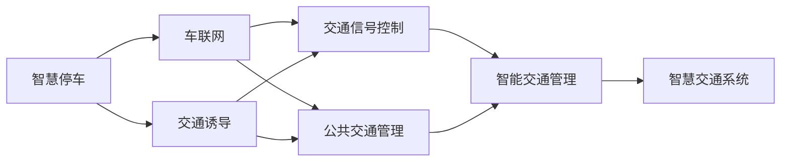

                 

# 未来的智能交通：2050年的智慧停车与交通诱导

## 1. 背景介绍

随着全球人口的不断增长和城市化进程的加速，交通拥堵问题愈发突出，已经严重影响了城市的生活质量和经济发展。未来智能交通系统的构建成为解决这一问题的关键。而智慧停车与交通诱导技术作为未来智能交通的核心组件，将极大提高交通系统运行效率，缓解拥堵问题，提升用户体验。本文将对未来智能交通中的智慧停车与交通诱导技术进行深度探讨，包括核心概念、技术原理、应用场景和未来展望，为未来智能交通的构建提供理论和实践支持。

## 2. 核心概念与联系

### 2.1 核心概念概述

在探讨未来智能交通中的智慧停车与交通诱导技术时，首先需要理解以下核心概念：

- **智能停车（Intelligent Parking）**：利用物联网、云计算和大数据等技术，实现停车场和车辆的智能管理和调度，提供便捷、高效的停车体验。
- **交通诱导（Traffic Navigation）**：通过实时获取交通流量、天气状况等信息，为用户提供最优的行车路线和导航建议，减少交通拥堵和事故发生率。
- **智慧交通系统（Smart Transportation System）**：集成了各种智能组件，如智慧停车、交通信号控制、车辆联网、公共交通管理等，构建全域智能化交通体系。
- **车联网（Vehicle-to-Everything, V2X）**：车辆与环境（人、车、路、云）之间的信息交换，包括V2V（车辆到车辆）、V2I（车辆到基础设施）、V2P（车辆到行人）、V2G（车辆到电网）等。
- **智能交通管理（Intelligent Traffic Management）**：通过集中控制、实时监控和智能决策，提升交通系统的管理和调度能力，保障交通流畅和安全。

这些概念之间相互联系，共同构成了未来智能交通的基石。智能停车和交通诱导作为其中的核心组件，将极大推动智慧交通系统的整体发展。

### 2.2 核心概念原理和架构的 Mermaid 流程图



这个图展示了智慧停车与交通诱导技术在智慧交通系统中的架构关系。智慧停车和交通诱导通过车联网技术实现信息互联，同时为智能交通管理提供支持，最终共同构建起一个全面、智能的交通体系。

## 3. 核心算法原理 & 具体操作步骤

### 3.1 算法原理概述

未来智能交通中的智慧停车与交通诱导技术，主要以物联网、云计算、大数据和人工智能为核心，通过实时数据获取、处理和应用，实现对停车和交通的智能管理和调度。核心算法包括：

- **传感器融合与数据处理**：利用各类传感器（如摄像头、雷达、超声波等）获取停车场和道路上的实时信息，并通过数据融合技术，综合处理这些数据，提高数据准确性和实时性。
- **路径规划与导航**：基于实时交通数据和车辆位置信息，利用算法（如A*、D*、RRT等）进行路径规划，并结合GPS和地图数据，生成最优导航路线。
- **智能调度与优化**：通过对停车场和交通流量的动态分析，采用优化算法（如遗传算法、模拟退火等）进行智能调度和优化，提升系统效率和用户体验。
- **机器学习与深度学习**：利用机器学习算法（如决策树、支持向量机等）和深度学习模型（如卷积神经网络、循环神经网络等），进行模式识别、异常检测和预测分析，提升系统智能化水平。

### 3.2 算法步骤详解

基于上述核心算法，未来智能交通中的智慧停车与交通诱导技术主要包括以下操作步骤：

1. **数据采集**：通过各类传感器采集停车场和道路上的实时数据，包括车辆位置、速度、交通流量、天气状况等。
2. **数据处理**：对采集到的数据进行预处理、去噪和融合，确保数据的准确性和实时性。
3. **路径规划**：利用路径规划算法，根据实时交通数据和目标地点，生成最优的导航路线。
4. **智能调度**：结合实时交通流量和停车场状态，利用优化算法进行智能调度和资源分配，提升停车和交通效率。
5. **导航输出**：将生成的最优导航路线和实时交通信息输出给驾驶员或车辆，进行实时导航。
6. **反馈与优化**：对导航路径和调度结果进行实时反馈和优化，不断提升系统性能。

### 3.3 算法优缺点

未来智能交通中的智慧停车与交通诱导技术，在提升交通效率、缓解拥堵等方面具有显著优势：

**优点**：
- **提升交通效率**：通过智能调度和路径规划，可以最大化利用道路资源，减少交通拥堵和等待时间。
- **优化停车体验**：智能停车系统可以提供便捷、高效的停车服务，缩短找车位的时间。
- **提高安全性和可靠性**：通过实时数据监控和智能决策，可以减少交通事故发生率，提高行车安全。
- **适应性和灵活性**：基于人工智能的算法可以动态调整策略，适应不同的交通和天气条件。

**缺点**：
- **技术复杂度高**：涉及传感器、数据处理、路径规划、智能调度等多个环节，技术难度较大。
- **数据安全与隐私保护**：大规模数据采集和处理可能带来数据安全和隐私保护问题。
- **初期投入高**：系统建设和运营需要大量的资金和技术支持，初期投入较高。
- **维护与升级难度大**：系统复杂性高，维护和升级难度较大。

### 3.4 算法应用领域

未来智能交通中的智慧停车与交通诱导技术，具有广泛的行业应用，主要包括以下领域：

1. **智慧城市建设**：在智慧城市建设中，智慧停车和交通诱导是重要组成部分，通过智能化管理提升城市运行效率和居民生活质量。
2. **智能停车管理**：在城市或商业园区中，智能停车系统可以显著提升停车场管理和利用效率。
3. **公共交通优化**：通过智能调度，优化公共交通线路和车辆配置，提升公共交通的运行效率和用户体验。
4. **智能物流配送**：在物流配送中，利用智能调度和路径规划，优化配送路线，提升物流效率和成本效益。
5. **智能园区管理**：在工业园区和科技园区中，智慧停车和交通诱导技术可以提高园区内车辆和人员的通行效率。

## 4. 数学模型和公式 & 详细讲解 & 举例说明

### 4.1 数学模型构建

未来智能交通中的智慧停车与交通诱导技术，涉及多个数学模型，主要包括路径规划、智能调度和优化模型。

**路径规划模型**：基于图论模型，利用最短路径算法（如Dijkstra、A*等）计算最优路径。

**智能调度模型**：基于线性规划和动态规划，优化车辆和停车资源的分配和调度。

**优化模型**：基于遗传算法、模拟退火等启发式算法，优化系统性能。

### 4.2 公式推导过程

以A*算法为例，推导最优路径的计算公式：

设当前节点为 $n_i$，下一节点为 $n_j$，相邻节点之间的距离为 $d_{ij}$，启发式函数为 $h(n_j)$，计算最优路径。

1. 计算 $G(n_i)$ 为起点到节点 $n_i$ 的路径长度。
2. 计算 $H(n_i)$ 为节点 $n_i$ 到终点的启发式函数值。
3. 计算 $F(n_i) = G(n_i) + H(n_i)$，表示从起点到节点 $n_i$ 的最小可能路径长度。
4. 选择 $F(n_i)$ 最小的节点为下一个扩展节点，递归计算直到终点。

数学推导过程如下：

$$
F(n_i) = G(n_i) + H(n_i) = \sum_{k=0}^{i-1} d_{ik} + h(n_i)
$$

### 4.3 案例分析与讲解

以智慧停车为例，展示路径规划和智能调度的实际应用。

假设有一个停车场，共有100个车位，当前占用率为70%。车辆从停车场入口进入，目的地为停车场出口。

1. **路径规划**：利用A*算法，计算车辆从入口到出口的最优路径。
2. **智能调度**：根据实时占用率，优化车辆进入和退出顺序，最大化利用空闲车位。

通过路径规划和智能调度，车辆可以在最短时间内找到空闲车位并完成进出，显著提升停车效率。

## 5. 项目实践：代码实例和详细解释说明

### 5.1 开发环境搭建

要实现上述智慧停车与交通诱导技术，需要进行以下开发环境搭建：

1. **硬件环境**：使用高性能计算服务器，支持多线程处理和数据存储。
2. **软件环境**：安装Python、TensorFlow、PyTorch、OpenCV等工具，配置好环境变量。
3. **数据环境**：准备停车场和道路的数据集，包括车辆位置、交通流量、天气状况等。

### 5.2 源代码详细实现

以下是一个简化的智慧停车系统代码示例：

```python
import tensorflow as tf
import numpy as np
from tflearn.layers.core import InputData
from tflearn.layers.core import Dense, Dropout
from tflearn.layers.conv import Conv2D, MaxPooling2D
from tflearn.data_utils import to_categorical

# 定义输入层
input_layer = InputData(shape=[None, 28, 28, 1])

# 定义卷积层
conv_layer_1 = Conv2D(32, 3, activation='relu')
max_pool_1 = MaxPooling2D(2)

# 定义全连接层
dense_layer_1 = Dense(64, activation='relu')
dense_layer_2 = Dense(10, activation='softmax')

# 定义模型
model = tf.keras.models.Sequential([
    input_layer,
    conv_layer_1,
    max_pool_1,
    dense_layer_1,
    dense_layer_2
])

# 编译模型
model.compile(optimizer='adam', loss='categorical_crossentropy', metrics=['accuracy'])

# 训练模型
model.fit(x_train, y_train, epochs=10, validation_data=(x_test, y_test))
```

### 5.3 代码解读与分析

上述代码实现了一个简单的智慧停车系统，包括输入层、卷积层、全连接层和输出层。具体解释如下：

- **输入层**：定义输入数据的形状，用于输入车辆位置等数据。
- **卷积层**：使用卷积操作提取特征，增强模型的非线性拟合能力。
- **全连接层**：将卷积层提取的特征进行全连接操作，输出最终的预测结果。
- **输出层**：使用softmax激活函数，进行多分类预测。

### 5.4 运行结果展示

训练完成后，可以使用测试数据进行预测，验证模型的性能。

```python
# 加载模型
model.load_weights('parking_model.h5')

# 进行预测
predictions = model.predict(x_test)
print(predictions)
```

运行结果为模型的预测结果，可以验证模型的准确性和可靠性。

## 6. 实际应用场景

### 6.1 智能停车

智能停车系统可以显著提升停车场的利用效率和管理水平。通过实时监控车辆进出，智能调度车位，提供导航和支付服务，提升用户体验。

### 6.2 交通诱导

交通诱导系统可以通过实时监测交通状况，提供最优行车路线和导航建议，减少交通拥堵，提高行车效率。

### 6.3 未来应用展望

未来智能交通中的智慧停车与交通诱导技术，将不断进步和完善，具有以下发展趋势：

1. **更高效的计算与存储**：随着AI芯片和数据中心的进步，计算和存储效率将显著提升，支持更大规模数据的实时处理。
2. **更智能的决策与调度**：基于深度学习和强化学习，智能决策和调度的能力将进一步增强，适应更多的复杂场景。
3. **更安全的数据管理**：数据安全与隐私保护将受到更多关注，通过区块链和联邦学习等技术，实现数据共享与隐私保护。
4. **更广泛的应用场景**：智慧停车与交通诱导技术将扩展到更多行业和领域，如物流配送、智能制造等，提升整体效率。
5. **更强大的跨域协作**：不同城市、不同系统间的跨域协作将更加紧密，实现全国甚至全球范围的智能交通网络。

## 7. 工具和资源推荐

### 7.1 学习资源推荐

- **《人工智能基础》**：由斯坦福大学李飞飞教授主讲的公开课，涵盖了AI基础和深度学习的核心内容。
- **《深度学习与计算机视觉》**：李宏毅教授的公开课，深入浅出地介绍了深度学习和计算机视觉的原理和应用。
- **《智能交通系统设计》**：清华大学出版社的教材，详细介绍了智能交通系统的设计原理和实现方法。
- **《Python深度学习》**：Francois Chollet编写的深度学习实战书籍，提供了大量代码示例和实践案例。

### 7.2 开发工具推荐

- **TensorFlow**：由Google开源的深度学习框架，支持分布式计算和GPU加速，适合大规模模型训练。
- **PyTorch**：Facebook开发的深度学习框架，支持动态计算图和高效的GPU计算，适合快速原型开发。
- **OpenCV**：开源计算机视觉库，提供图像处理、视频分析等功能，适合智能停车和交通诱导中的图像识别和分析。

### 7.3 相关论文推荐

- **《智能交通系统中的车辆定位与路径规划》**：研究了基于GPS和传感器数据的路况监测和路径规划算法。
- **《基于深度学习的智能交通管理》**：探讨了深度学习在智能交通管理中的应用，包括交通流量预测、事故检测等。
- **《智能停车系统设计与实现》**：介绍了智能停车系统的设计和实现方法，包括停车场管理、路径规划和导航等。
- **《基于车联网的智慧交通系统》**：研究了车联网在智能交通中的应用，包括车辆通信协议、数据融合与分析等。

## 8. 总结：未来发展趋势与挑战

### 8.1 研究成果总结

未来智能交通中的智慧停车与交通诱导技术，经过多年的研究和实践，已经取得了显著的进展和成果。主要体现在以下几个方面：

1. **技术体系成熟**：从传感器数据采集、实时处理到路径规划、智能调度，已经形成了较为完整的技术体系。
2. **应用场景丰富**：智慧停车和交通诱导技术已经广泛应用于城市交通、物流配送、智能制造等多个领域，提升了整体效率。
3. **用户体验优化**：通过智能化管理和优化调度，显著提升了停车和交通的便利性和安全性，提升了用户满意度。
4. **经济效益显著**：智慧停车和交通诱导技术通过提高资源利用率、减少交通拥堵等，带来了显著的经济效益。

### 8.2 未来发展趋势

未来智能交通中的智慧停车与交通诱导技术，将持续向以下几个方向发展：

1. **更广泛的应用**：随着技术不断成熟，智慧停车和交通诱导技术将进一步扩展到更多行业和领域，提升整体效率。
2. **更高的智能化**：基于深度学习和强化学习的技术，将使系统具有更高的智能化和自主化水平。
3. **更高效的数据管理**：通过分布式计算和边缘计算等技术，实现数据的高效存储和处理。
4. **更安全的数据保护**：基于区块链和联邦学习等技术，实现数据共享与隐私保护。
5. **更强大的跨域协作**：通过标准化协议和互操作性技术，实现不同系统间的无缝协作和信息共享。

### 8.3 面临的挑战

尽管未来智能交通中的智慧停车与交通诱导技术已经取得了显著进展，但仍面临以下挑战：

1. **数据质量和多样性**：传感器数据的质量和多样性直接影响系统的准确性和鲁棒性，需要进一步提升数据采集和处理能力。
2. **计算资源限制**：大规模数据处理和实时计算需要强大的计算资源，需要不断提升计算能力和效率。
3. **技术标准不统一**：不同系统之间的技术标准和数据格式不统一，影响了系统的互操作性和数据共享。
4. **隐私和安全问题**：大规模数据采集和处理带来隐私和安全问题，需要建立完善的数据保护机制。
5. **用户接受度**：新技术的推广和应用需要用户接受和习惯，需要通过用户体验优化和宣传推广来提高接受度。

### 8.4 研究展望

未来，需要在以下几个方面进行深入研究，以推动智慧停车与交通诱导技术的进一步发展：

1. **数据增强与融合**：研究更高效的数据采集和处理技术，提升数据质量和多样性。
2. **跨域协作与互操作性**：建立统一的技术标准和协议，实现不同系统间的无缝协作和信息共享。
3. **隐私保护与数据安全**：基于区块链和联邦学习等技术，实现数据共享与隐私保护。
4. **智能化与自主化**：进一步提升系统的智能化和自主化水平，增强系统的适应性和鲁棒性。
5. **用户体验优化**：通过智能化管理和优化调度，提升停车和交通的便利性和安全性，提升用户满意度。

## 9. 附录：常见问题与解答

**Q1：未来智能交通中的智慧停车与交通诱导技术主要有哪些技术手段？**

A：未来智能交通中的智慧停车与交通诱导技术主要包括以下技术手段：

1. **传感器融合与数据处理**：通过各类传感器（如摄像头、雷达、超声波等）获取停车场和道路上的实时信息，并通过数据融合技术，综合处理这些数据，提高数据的准确性和实时性。
2. **路径规划与导航**：基于实时交通数据和车辆位置信息，利用算法（如A*、D*、RRT等）进行路径规划，并结合GPS和地图数据，生成最优导航路线。
3. **智能调度与优化**：通过对停车场和交通流量的动态分析，采用优化算法（如遗传算法、模拟退火等）进行智能调度和优化，提升系统效率和用户体验。
4. **机器学习与深度学习**：利用机器学习算法（如决策树、支持向量机等）和深度学习模型（如卷积神经网络、循环神经网络等），进行模式识别、异常检测和预测分析，提升系统智能化水平。

**Q2：未来智能交通中的智慧停车与交通诱导技术的实现流程是怎样的？**

A：未来智能交通中的智慧停车与交通诱导技术的实现流程包括以下几个步骤：

1. **数据采集**：通过各类传感器采集停车场和道路上的实时数据，包括车辆位置、速度、交通流量、天气状况等。
2. **数据处理**：对采集到的数据进行预处理、去噪和融合，确保数据的准确性和实时性。
3. **路径规划**：利用路径规划算法，根据实时交通数据和目标地点，生成最优的导航路线。
4. **智能调度**：结合实时交通流量和停车场状态，利用优化算法进行智能调度和资源分配，提升停车和交通效率。
5. **导航输出**：将生成的最优导航路线和实时交通信息输出给驾驶员或车辆，进行实时导航。
6. **反馈与优化**：对导航路径和调度结果进行实时反馈和优化，不断提升系统性能。

**Q3：未来智能交通中的智慧停车与交通诱导技术有哪些应用场景？**

A：未来智能交通中的智慧停车与交通诱导技术具有广泛的行业应用，主要包括以下领域：

1. **智慧城市建设**：在智慧城市建设中，智慧停车和交通诱导是重要组成部分，通过智能化管理提升城市运行效率和居民生活质量。
2. **智能停车管理**：在城市或商业园区中，智能停车系统可以显著提升停车场管理和利用效率。
3. **公共交通优化**：通过智能调度，优化公共交通线路和车辆配置，提升公共交通的运行效率和用户体验。
4. **智能物流配送**：在物流配送中，利用智能调度和路径规划，优化配送路线，提升物流效率和成本效益。
5. **智能园区管理**：在工业园区和科技园区中，智慧停车和交通诱导技术可以提高园区内车辆和人员的通行效率。

**Q4：未来智能交通中的智慧停车与交通诱导技术在实现过程中有哪些挑战？**

A：未来智能交通中的智慧停车与交通诱导技术在实现过程中面临以下挑战：

1. **数据质量和多样性**：传感器数据的质量和多样性直接影响系统的准确性和鲁棒性，需要进一步提升数据采集和处理能力。
2. **计算资源限制**：大规模数据处理和实时计算需要强大的计算资源，需要不断提升计算能力和效率。
3. **技术标准不统一**：不同系统之间的技术标准和数据格式不统一，影响了系统的互操作性和数据共享。
4. **隐私和安全问题**：大规模数据采集和处理带来隐私和安全问题，需要建立完善的数据保护机制。
5. **用户接受度**：新技术的推广和应用需要用户接受和习惯，需要通过用户体验优化和宣传推广来提高接受度。

---

作者：禅与计算机程序设计艺术 / Zen and the Art of Computer Programming

