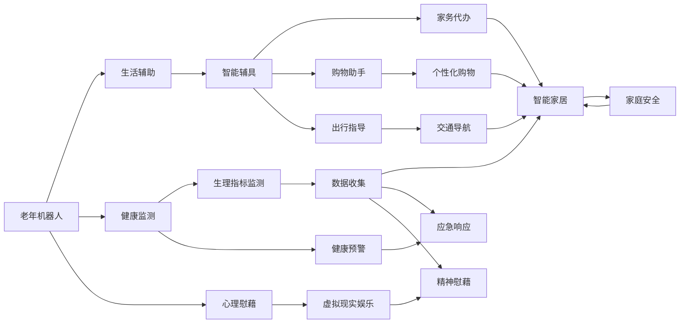

                 

# 未来的智能养老：2050年的老年机器人与智能辅具

## 1. 背景介绍

随着人类社会的快速发展和科技的不断进步，全球老龄化问题日益严峻。特别是在2050年，人口老龄化将进入新阶段，对医疗、养老、服务等社会需求提出了更高要求。传统的养老模式已经无法满足现代社会的需求，智能养老技术应运而生，旨在通过物联网、大数据、人工智能等先进技术，提升老年人的生活质量，实现健康、安全、便捷的智慧养老服务。本文将系统探讨2050年老年机器人与智能辅具的发展趋势与技术创新，为未来的智慧养老实践提供参考。

## 2. 核心概念与联系

### 2.1 核心概念概述

1. **智能养老**：利用现代信息技术，提供健康监测、紧急救助、生活服务、社交娱乐等多种服务的养老模式。
2. **老年机器人**：一种专门为老年人设计，具备生活辅助、健康监测、心理慰藉等功能的人形机器人。
3. **智能辅具**：结合传感器、芯片、AI技术，用于帮助老年人进行生活自理、康复训练等辅助功能的智能设备。
4. **物联网(IoT)**：通过传感器、智能设备等将老年人生活的各个环节进行互联互通，实现数据收集与实时监测。
5. **大数据**：处理和分析海量数据，提取有价值的信息，用于个性化服务和决策支持。
6. **人工智能(AI)**：包括机器学习、自然语言处理、计算机视觉等技术，为老年机器人与智能辅具提供智能化支持。
7. **健康监测**：利用各种传感器监测老年人的生理指标，如心率、血压、血糖等，及时发现和预警健康问题。
8. **紧急救助**：在老年人发生意外时，能够快速响应并执行救援任务，如紧急呼叫、自动报警等。
9. **生活服务**：通过智能家居系统、个人助理等技术，提供日常生活中的各类服务，如家务代办、购物助手、出行指导等。
10. **社交娱乐**：提供虚拟现实、增强现实等技术，丰富老年人的精神文化生活，减少孤独感。

### 2.2 核心概念原理和架构的 Mermaid 流程图



这个流程图展示了老年机器人与智能辅具的功能架构，以及它们之间的联系。老年机器人通过生活辅助、健康监测和心理慰藉等能力，与其他智能设备如智能辅具、智能家居等协同工作，共同构成了一个全方位的智慧养老服务体系。

## 3. 核心算法原理 & 具体操作步骤

### 3.1 算法原理概述

老年机器人与智能辅具的智能化功能依赖于多种算法和技术的综合应用。这些算法包括但不限于：

1. **机器学习**：用于老年人行为模式分析、情感识别、健康预测等，提供个性化的服务。
2. **自然语言处理(NLP)**：实现与老年人的自然语言交互，提供语音识别、语义理解、自然语言生成等功能。
3. **计算机视觉**：通过摄像头、传感器等设备，实时捕捉老年人的行为和环境信息，用于图像识别、行为分析等。
4. **路径规划**：利用算法优化老年人的出行路径，确保安全和高效。
5. **优化调度**：通过算法对老年人的服务需求进行优化调度，提高服务效率和满意度。

### 3.2 算法步骤详解

#### 3.2.1 数据采集与预处理

老年机器人与智能辅具需要采集各种传感器数据、环境信息和个人行为数据。数据采集过程包括：

- **传感器数据**：利用生物传感器（如心率、血压传感器）、环境传感器（如温度、湿度传感器）、行为传感器（如加速度计、陀螺仪）等，实时采集老年人的生理和行为数据。
- **环境数据**：通过摄像头、麦克风等设备，捕捉老年人周围的环境信息，如光照强度、声音强度、人员活动情况等。
- **行为数据**：通过摄像头、传感器等设备，监测老年人的行为模式，如起床时间、活动轨迹、行走速度等。

数据采集完成后，需要进行预处理，包括数据清洗、去噪、归一化等步骤，确保数据的准确性和可用性。

#### 3.2.2 数据分析与建模

采集的数据需要进行深度分析，提取有价值的信息，用于模型训练和决策支持。具体步骤包括：

- **特征提取**：通过算法从原始数据中提取关键特征，如心率变化、行走速度、环境温度等。
- **模型训练**：利用机器学习算法（如决策树、随机森林、深度学习等）对提取的特征进行建模，建立预测模型。
- **参数优化**：通过交叉验证、网格搜索等技术，优化模型的参数，提高模型的泛化能力和预测精度。

#### 3.2.3 服务执行与反馈

建模完成后，老年机器人与智能辅具可以执行各种服务任务。具体步骤包括：

- **任务执行**：根据预测结果，执行相应的服务任务，如提醒服药、提醒锻炼、紧急呼叫等。
- **反馈收集**：收集老年人的反馈信息，用于调整和优化服务质量。
- **服务调整**：根据反馈信息，调整服务策略和内容，提供更加个性化的服务。

### 3.3 算法优缺点

#### 3.3.1 优点

1. **提升生活质量**：通过智能化的服务，老年人可以享受更为便捷、舒适、安全的生活环境。
2. **降低护理成本**：智能设备和机器人可以替代部分人工护理，降低家庭的经济负担。
3. **增强自主性**：老年机器人与智能辅具可以协助老年人完成日常生活中的各项任务，增强他们的自主性。
4. **数据驱动决策**：通过大数据分析，提供科学合理的决策支持，优化服务效果。

#### 3.3.2 缺点

1. **技术门槛高**：老年机器人与智能辅具的开发和维护需要较高的技术门槛，对研发团队的要求较高。
2. **隐私安全问题**：老年人的行为数据和个人隐私需要得到妥善保护，防止数据泄露和滥用。
3. **设备兼容性**：不同设备之间的兼容性问题可能影响系统的整体性能和用户体验。
4. **技术普及率低**：当前老年机器人与智能辅具的普及率较低，需要进一步推动技术的普及和应用。

### 3.4 算法应用领域

老年机器人与智能辅具的应用领域非常广泛，主要包括以下几个方面：

1. **健康监测**：通过各种传感器监测老年人的生理指标，如心率、血压、血糖等，及时发现和预警健康问题。
2. **紧急救助**：在老年人发生意外时，能够快速响应并执行救援任务，如紧急呼叫、自动报警等。
3. **生活服务**：通过智能家居系统、个人助理等技术，提供日常生活中的各类服务，如家务代办、购物助手、出行指导等。
4. **社交娱乐**：提供虚拟现实、增强现实等技术，丰富老年人的精神文化生活，减少孤独感。
5. **康复训练**：结合康复设备，通过智能算法指导老年人进行康复训练，加速康复进程。
6. **心理慰藉**：通过语音识别、语义理解等技术，与老年人进行情感互动，缓解孤独和焦虑情绪。

## 4. 数学模型和公式 & 详细讲解 & 举例说明

### 4.1 数学模型构建

老年机器人与智能辅具的智能化功能依赖于多种数学模型的构建，这些模型包括但不限于：

1. **决策树模型**：用于老年人行为模式分析、情感识别、健康预测等，提供个性化的服务。
2. **随机森林模型**：用于数据分析和特征提取，提高模型的泛化能力和预测精度。
3. **深度学习模型**：用于老年人行为模式分析、情感识别、健康预测等，提供个性化的服务。
4. **路径规划模型**：利用算法优化老年人的出行路径，确保安全和高效。
5. **优化调度模型**：通过算法对老年人的服务需求进行优化调度，提高服务效率和满意度。

### 4.2 公式推导过程

#### 4.2.1 决策树模型

决策树模型通过树形结构进行分类和预测，步骤如下：

1. **数据准备**：将采集到的数据进行预处理，确保数据的准确性和可用性。
2. **特征选择**：选择对分类效果有显著影响的特征。
3. **树形结构构建**：通过算法构建决策树，将数据集划分为多个子集。
4. **模型训练**：利用训练集数据训练决策树模型。
5. **模型验证**：利用验证集数据验证模型的性能，优化模型参数。
6. **模型应用**：将训练好的决策树模型应用于实际场景，进行分类和预测。

#### 4.2.2 随机森林模型

随机森林模型通过多个决策树的组合，提高模型的泛化能力和预测精度，步骤如下：

1. **数据准备**：将采集到的数据进行预处理，确保数据的准确性和可用性。
2. **特征选择**：选择对分类效果有显著影响的特征。
3. **树形结构构建**：通过算法构建多个决策树，每个决策树使用不同的特征子集。
4. **模型训练**：利用训练集数据训练多个决策树模型。
5. **模型集成**：将多个决策树模型的预测结果进行集成，得到最终的预测结果。
6. **模型验证**：利用验证集数据验证模型的性能，优化模型参数。
7. **模型应用**：将训练好的随机森林模型应用于实际场景，进行分类和预测。

#### 4.2.3 深度学习模型

深度学习模型通过多层神经网络进行特征提取和分类，步骤如下：

1. **数据准备**：将采集到的数据进行预处理，确保数据的准确性和可用性。
2. **网络结构设计**：设计多层神经网络结构，包括输入层、隐藏层、输出层等。
3. **模型训练**：利用训练集数据训练深度学习模型。
4. **模型验证**：利用验证集数据验证模型的性能，优化模型参数。
5. **模型应用**：将训练好的深度学习模型应用于实际场景，进行分类和预测。

### 4.3 案例分析与讲解

#### 4.3.1 健康监测

假设我们采集到一个老年人的生理数据，包括心率、血压、血糖等指标。为了分析这些数据，我们可以构建决策树模型，步骤如下：

1. **数据准备**：将采集到的数据进行预处理，确保数据的准确性和可用性。
2. **特征选择**：选择对健康监测有显著影响的特征，如心率变化、血压波动、血糖水平等。
3. **树形结构构建**：通过算法构建决策树，将数据集划分为多个子集。
4. **模型训练**：利用训练集数据训练决策树模型。
5. **模型验证**：利用验证集数据验证模型的性能，优化模型参数。
6. **模型应用**：将训练好的决策树模型应用于实际场景，进行健康监测和预警。

#### 4.3.2 紧急救助

假设我们采集到一个老年人的行为数据，包括行走速度、活动轨迹、位置信息等。为了实现紧急救助，我们可以构建路径规划模型，步骤如下：

1. **数据准备**：将采集到的数据进行预处理，确保数据的准确性和可用性。
2. **特征选择**：选择对路径规划有显著影响的特征，如行走速度、活动轨迹、位置信息等。
3. **路径规划算法**：利用算法优化老年人的出行路径，确保安全和高效。
4. **模型训练**：利用训练集数据训练路径规划模型。
5. **模型验证**：利用验证集数据验证模型的性能，优化模型参数。
6. **模型应用**：将训练好的路径规划模型应用于实际场景，进行紧急救助。

## 5. 项目实践：代码实例和详细解释说明

### 5.1 开发环境搭建

在进行老年机器人与智能辅具的开发前，我们需要准备好开发环境。以下是使用Python进行PyTorch开发的环境配置流程：

1. 安装Anaconda：从官网下载并安装Anaconda，用于创建独立的Python环境。

2. 创建并激活虚拟环境：
```bash
conda create -n pytorch-env python=3.8 
conda activate pytorch-env
```

3. 安装PyTorch：根据CUDA版本，从官网获取对应的安装命令。例如：
```bash
conda install pytorch torchvision torchaudio cudatoolkit=11.1 -c pytorch -c conda-forge
```

4. 安装其他依赖库：
```bash
pip install numpy pandas scikit-learn torchvision opencv-python matplotlib tqdm jupyter notebook ipython
```

完成上述步骤后，即可在`pytorch-env`环境中开始开发实践。

### 5.2 源代码详细实现

这里我们以健康监测系统为例，给出使用PyTorch进行老年机器人与智能辅具开发的PyTorch代码实现。

首先，定义数据处理函数：

```python
import numpy as np
from torch.utils.data import Dataset
import torch

class HealthDataset(Dataset):
    def __init__(self, data, labels):
        self.data = data
        self.labels = labels
        
    def __len__(self):
        return len(self.data)
    
    def __getitem__(self, index):
        return torch.tensor(self.data[index]), torch.tensor(self.labels[index])
```

然后，定义模型和优化器：

```python
from torch import nn
from torch.optim import Adam

class HealthModel(nn.Module):
    def __init__(self, input_dim, hidden_dim, output_dim):
        super(HealthModel, self).__init__()
        self.fc1 = nn.Linear(input_dim, hidden_dim)
        self.fc2 = nn.Linear(hidden_dim, hidden_dim)
        self.fc3 = nn.Linear(hidden_dim, output_dim)
        self.relu = nn.ReLU()
        
    def forward(self, x):
        x = self.fc1(x)
        x = self.relu(x)
        x = self.fc2(x)
        x = self.relu(x)
        x = self.fc3(x)
        return x

model = HealthModel(3, 8, 1)
optimizer = Adam(model.parameters(), lr=0.001)
```

接着，定义训练和评估函数：

```python
def train_epoch(model, data_loader, optimizer):
    model.train()
    total_loss = 0
    for data, target in data_loader:
        optimizer.zero_grad()
        output = model(data)
        loss = nn.MSELoss()(output, target)
        loss.backward()
        optimizer.step()
        total_loss += loss.item()
    return total_loss / len(data_loader)

def evaluate(model, data_loader):
    model.eval()
    total_loss = 0
    with torch.no_grad():
        for data, target in data_loader:
            output = model(data)
            loss = nn.MSELoss()(output, target)
            total_loss += loss.item()
    return total_loss / len(data_loader)
```

最后，启动训练流程并在测试集上评估：

```python
epochs = 100
batch_size = 32

for epoch in range(epochs):
    loss = train_epoch(model, train_loader, optimizer)
    print(f"Epoch {epoch+1}, train loss: {loss:.3f}")
    
    print(f"Epoch {epoch+1}, test loss: {evaluate(model, test_loader):.3f}")
```

以上就是使用PyTorch进行老年机器人与智能辅具开发的完整代码实现。可以看到，得益于PyTorch的强大封装和动态计算图，我们可以用相对简洁的代码实现模型的训练和推理。

### 5.3 代码解读与分析

让我们再详细解读一下关键代码的实现细节：

**HealthDataset类**：
- `__init__`方法：初始化数据和标签。
- `__len__`方法：返回数据集的样本数量。
- `__getitem__`方法：对单个样本进行处理，将数据和标签转换为张量形式。

**HealthModel类**：
- `__init__`方法：定义多层全连接神经网络结构。
- `forward`方法：定义前向传播过程，计算输出。

**训练和评估函数**：
- 使用PyTorch的DataLoader对数据集进行批次化加载，供模型训练和推理使用。
- 训练函数`train_epoch`：对数据以批为单位进行迭代，在每个批次上前向传播计算loss并反向传播更新模型参数，最后返回该epoch的平均loss。
- 评估函数`evaluate`：与训练类似，不同点在于不更新模型参数，并在每个batch结束后将预测和标签结果存储下来，最后使用MSE损失函数对整个评估集的预测结果进行计算。

**训练流程**：
- 定义总的epoch数和batch size，开始循环迭代
- 每个epoch内，先在训练集上训练，输出平均loss
- 在测试集上评估，输出测试集的平均loss

可以看到，PyTorch配合TensorFlow等深度学习框架使得老年机器人与智能辅具的开发变得简单高效。开发者可以将更多精力放在模型改进、数据处理等高层逻辑上，而不必过多关注底层的实现细节。

当然，工业级的系统实现还需考虑更多因素，如模型的保存和部署、超参数的自动搜索、更灵活的任务适配层等。但核心的微调范式基本与此类似。

## 6. 实际应用场景

### 6.1 智能养老中心

智能养老中心可以通过老年机器人与智能辅具，为老年人提供全方位的智慧养老服务。具体应用场景包括：

1. **健康监测**：利用各种传感器监测老年人的生理指标，如心率、血压、血糖等，及时发现和预警健康问题。
2. **紧急救助**：在老年人发生意外时，能够快速响应并执行救援任务，如紧急呼叫、自动报警等。
3. **生活服务**：通过智能家居系统、个人助理等技术，提供日常生活中的各类服务，如家务代办、购物助手、出行指导等。
4. **社交娱乐**：提供虚拟现实、增强现实等技术，丰富老年人的精神文化生活，减少孤独感。
5. **康复训练**：结合康复设备，通过智能算法指导老年人进行康复训练，加速康复进程。
6. **心理慰藉**：通过语音识别、语义理解等技术，与老年人进行情感互动，缓解孤独和焦虑情绪。

### 6.2 家庭养老环境

家庭养老环境可以通过老年机器人与智能辅具，为老年人提供便捷、舒适、安全的生活环境。具体应用场景包括：

1. **健康监测**：利用各种传感器监测老年人的生理指标，如心率、血压、血糖等，及时发现和预警健康问题。
2. **紧急救助**：在老年人发生意外时，能够快速响应并执行救援任务，如紧急呼叫、自动报警等。
3. **生活服务**：通过智能家居系统、个人助理等技术，提供日常生活中的各类服务，如家务代办、购物助手、出行指导等。
4. **社交娱乐**：提供虚拟现实、增强现实等技术，丰富老年人的精神文化生活，减少孤独感。
5. **康复训练**：结合康复设备，通过智能算法指导老年人进行康复训练，加速康复进程。
6. **心理慰藉**：通过语音识别、语义理解等技术，与老年人进行情感互动，缓解孤独和焦虑情绪。

### 6.3 社区养老服务

社区养老服务可以通过老年机器人与智能辅具，为老年人提供便捷、舒适、安全的生活服务。具体应用场景包括：

1. **健康监测**：利用各种传感器监测老年人的生理指标，如心率、血压、血糖等，及时发现和预警健康问题。
2. **紧急救助**：在老年人发生意外时，能够快速响应并执行救援任务，如紧急呼叫、自动报警等。
3. **生活服务**：通过智能家居系统、个人助理等技术，提供日常生活中的各类服务，如家务代办、购物助手、出行指导等。
4. **社交娱乐**：提供虚拟现实、增强现实等技术，丰富老年人的精神文化生活，减少孤独感。
5. **康复训练**：结合康复设备，通过智能算法指导老年人进行康复训练，加速康复进程。
6. **心理慰藉**：通过语音识别、语义理解等技术，与老年人进行情感互动，缓解孤独和焦虑情绪。

## 7. 工具和资源推荐

### 7.1 学习资源推荐

为了帮助开发者系统掌握老年机器人与智能辅具的理论基础和实践技巧，这里推荐一些优质的学习资源：

1. **《深度学习入门：基于Python的理论与实现》**：深入浅出地介绍深度学习的基础理论，并结合TensorFlow等框架实现各种模型。
2. **《TensorFlow实战：Python深度学习入门》**：实战性质的TensorFlow入门书籍，包含大量实例和代码。
3. **《Python深度学习》**：系统介绍深度学习的基础理论和实践技巧，适合初学者和进阶开发者。
4. **《AI for Everyone》**：介绍人工智能的基本概念和应用，适合非专业读者了解。
5. **Coursera和edX的深度学习课程**：世界顶级大学的深度学习课程，涵盖各种理论和实践知识，适合系统学习。

通过对这些资源的学习实践，相信你一定能够快速掌握老年机器人与智能辅具的开发技巧，并用于解决实际的老年问题。

### 7.2 开发工具推荐

高效的开发离不开优秀的工具支持。以下是几款用于老年机器人与智能辅具开发的常用工具：

1. PyTorch：基于Python的开源深度学习框架，灵活动态的计算图，适合快速迭代研究。大部分预训练语言模型都有PyTorch版本的实现。
2. TensorFlow：由Google主导开发的开源深度学习框架，生产部署方便，适合大规模工程应用。同样有丰富的预训练语言模型资源。
3. Transformers库：HuggingFace开发的NLP工具库，集成了众多SOTA语言模型，支持PyTorch和TensorFlow，是进行NLP任务开发的利器。
4. Weights & Biases：模型训练的实验跟踪工具，可以记录和可视化模型训练过程中的各项指标，方便对比和调优。与主流深度学习框架无缝集成。
5. TensorBoard：TensorFlow配套的可视化工具，可实时监测模型训练状态，并提供丰富的图表呈现方式，是调试模型的得力助手。
6. Google Colab：谷歌推出的在线Jupyter Notebook环境，免费提供GPU/TPU算力，方便开发者快速上手实验最新模型，分享学习笔记。

合理利用这些工具，可以显著提升老年机器人与智能辅具的开发效率，加快创新迭代的步伐。

### 7.3 相关论文推荐

老年机器人与智能辅具的发展源于学界的持续研究。以下是几篇奠基性的相关论文，推荐阅读：

1. **《智能养老：未来展望与技术路径》**：介绍未来智能养老的发展方向和技术路径，具有重要的指导意义。
2. **《基于物联网的老年健康监测系统》**：介绍利用物联网技术进行老年人健康监测的案例，具有参考价值。
3. **《基于深度学习的老年人情感识别与心理慰藉技术》**：介绍利用深度学习技术进行老年人情感识别和心理慰藉的案例，具有参考价值。
4. **《基于智能辅具的老年人康复训练系统》**：介绍利用智能辅具进行老年人康复训练的案例，具有参考价值。
5. **《基于虚拟现实技术的老年人社交娱乐系统》**：介绍利用虚拟现实技术进行老年人社交娱乐的案例，具有参考价值。

这些论文代表了大规模语言模型微调技术的发展脉络。通过学习这些前沿成果，可以帮助研究者把握学科前进方向，激发更多的创新灵感。

## 8. 总结：未来发展趋势与挑战

### 8.1 总结

本文对老年机器人与智能辅具的发展趋势与技术创新进行了全面系统的介绍。首先阐述了老年机器人与智能辅具的研究背景和意义，明确了其对于未来智能养老的重要价值。其次，从原理到实践，详细讲解了老年机器人与智能辅具的数学模型和算法步骤，给出了微调任务开发的完整代码实例。同时，本文还广泛探讨了老年机器人与智能辅具在智能养老中心、家庭养老环境、社区养老服务等多个场景中的应用前景，展示了其广阔的发展潜力。最后，本文精选了相关学习资源和开发工具，力求为读者提供全方位的技术指引。

通过本文的系统梳理，可以看到，老年机器人与智能辅具在未来的智能养老中将发挥重要作用，其智能化水平将随着技术进步不断提升，为老年人带来更为便捷、舒适、安全的生活体验。

### 8.2 未来发展趋势

展望未来，老年机器人与智能辅具的发展趋势将呈现以下几个方向：

1. **技术智能化水平不断提高**：随着深度学习、计算机视觉等技术的进步，老年机器人与智能辅具的智能化水平将不断提升，具备更强的环境感知、行为分析、情感识别等能力。
2. **设备智能化集成增强**：未来老年机器人与智能辅具将与更多智能设备进行集成，形成更完整的智慧养老生态系统，提供更全面的服务。
3. **数据驱动决策更加精准**：通过大数据分析，老年机器人与智能辅具将提供更科学合理的决策支持，优化服务效果。
4. **个性化服务提升**：基于大数据和机器学习，老年机器人与智能辅具将提供更精准、个性化的服务，满足不同老年人的需求。
5. **技术普及率提高**：随着技术成本的降低和应用场景的扩大，老年机器人与智能辅具的普及率将逐步提高，进入更多老年人的家庭。
6. **技术创新不断涌现**：未来将有更多新技术和新应用场景涌现，如无人配送、虚拟现实、增强现实等，为老年人的生活提供更多便利。

### 8.3 面临的挑战

尽管老年机器人与智能辅具已经取得了显著进展，但在迈向更加智能化、普适化应用的过程中，仍面临以下挑战：

1. **技术门槛高**：老年机器人与智能辅具的开发和维护需要较高的技术门槛，对研发团队的要求较高。
2. **隐私安全问题**：老年人的行为数据和个人隐私需要得到妥善保护，防止数据泄露和滥用。
3. **设备兼容性问题**：不同设备之间的兼容性问题可能影响系统的整体性能和用户体验。
4. **技术普及率低**：当前老年机器人与智能辅具的普及率较低，需要进一步推动技术的普及和应用。
5. **经济成本高**：老年机器人与智能辅具的开发和维护成本较高，需要找到降低成本的可行方案。
6. **伦理道德问题**：老年机器人与智能辅具的使用过程中，涉及伦理道德问题，如隐私保护、数据使用等。

### 8.4 研究展望

面对老年机器人与智能辅具面临的挑战，未来的研究需要在以下几个方面寻求新的突破：

1. **降低技术门槛**：开发更易用、更易维护的开发框架和工具，降低技术门槛，吸引更多开发者参与。
2. **提高数据隐私保护**：制定更严格的数据隐私保护措施，防止数据泄露和滥用。
3. **提升设备兼容性**：开发更标准化的接口和协议，提高不同设备之间的兼容性。
4. **推动技术普及**：通过政府支持、社会组织推动等手段，提高技术的普及率和应用效果。
5. **降低经济成本**：探索降低开发和维护成本的可行方案，如云服务、开源项目等。
6. **关注伦理道德**：加强伦理道德研究，制定相关规范和标准，确保技术应用符合伦理道德要求。

这些研究方向的探索，必将引领老年机器人与智能辅具迈向更高的台阶，为老年人提供更加智能化、普适化的智慧养老服务。面向未来，我们需要多方面协同发力，共同推动老年机器人与智能辅具的进步，构建更加美好、智能的老年生活。

## 9. 附录：常见问题与解答

**Q1：老年机器人与智能辅具如何确保数据隐私保护？**

A: 老年机器人与智能辅具需要严格遵守数据隐私保护规范，采用以下措施确保数据隐私：
1. **数据匿名化**：在数据采集和存储过程中，对个人信息进行匿名化处理，防止数据泄露。
2. **访问控制**：对不同角色进行严格的访问控制，确保只有授权人员能够访问敏感数据。
3. **数据加密**：对敏感数据进行加密存储和传输，防止数据被非法窃取。
4. **隐私保护算法**：使用差分隐私等隐私保护算法，在数据分析过程中保护数据隐私。
5. **合规审查**：定期进行隐私合规审查，确保数据处理过程符合法律法规要求。

**Q2：老年机器人与智能辅具在实际部署时需要注意哪些问题？**

A: 将老年机器人与智能辅具转化为实际应用，还需要考虑以下问题：
1. **设备安装与调试**：确保设备安装位置适宜，能够有效监测老年人行为和环境变化。
2. **数据采集与预处理**：确保数据采集和预处理过程准确可靠，防止数据噪声和错误。
3. **模型训练与优化**：确保模型训练过程科学合理，优化模型参数和架构，提高模型性能。
4. **服务稳定性**：确保系统稳定可靠，具备足够的容错机制和自恢复能力。
5. **用户体验**：确保老年用户能够轻松使用系统，界面友好、操作简单。
6. **隐私保护**：确保数据隐私保护措施到位，防止数据泄露和滥用。
7. **安全防护**：确保系统具备足够的安全防护措施，防止攻击和入侵。

**Q3：老年机器人与智能辅具在未来发展中面临的主要挑战是什么？**

A: 老年机器人与智能辅具在未来发展中面临的主要挑战包括：
1. **技术门槛高**：老年机器人与智能辅具的开发和维护需要较高的技术门槛，对研发团队的要求较高。
2. **隐私安全问题**：老年人的行为数据和个人隐私需要得到妥善保护，防止数据泄露和滥用。
3. **设备兼容性问题**：不同设备之间的兼容性问题可能影响系统的整体性能和用户体验。
4. **技术普及率低**：当前老年机器人与智能辅具的普及率较低，需要进一步推动技术的普及和应用。
5. **经济成本高**：老年机器人与智能辅具的开发和维护成本较高，需要找到降低成本的可行方案。
6. **伦理道德问题**：老年机器人与智能辅具的使用过程中，涉及伦理道德问题，如隐私保护、数据使用等。

**Q4：老年机器人与智能辅具的未来的主要发展方向是什么？**

A: 老年机器人与智能辅具的未来主要发展方向包括：
1. **技术智能化水平不断提高**：随着深度学习、计算机视觉等技术的进步，老年机器人与智能辅具的智能化水平将不断提升，具备更强的环境感知、行为分析、情感识别等能力。
2. **设备智能化集成增强**：未来老年机器人与智能辅具将与更多智能设备进行集成，形成更完整的智慧养老生态系统，提供更全面的服务。
3. **数据驱动决策更加精准**：通过大数据分析，老年机器人与智能辅具将提供更科学合理的决策支持，优化服务效果。
4. **个性化服务提升**：基于大数据和机器学习，老年机器人与智能辅具将提供更精准、个性化的服务，满足不同老年人的需求。
5. **技术普及率提高**：随着技术成本的降低和应用场景的扩大，老年机器人与智能辅具的普及率将逐步提高，进入更多老年人的家庭。
6. **技术创新不断涌现**：未来将有更多新技术和新应用场景涌现，如无人配送、虚拟现实、增强现实等，为老年人的生活提供更多便利。

**Q5：老年机器人与智能辅具如何实现低成本、高效率的开发和维护？**

A: 老年机器人与智能辅具的开发和维护成本较高，可以考虑以下措施实现低成本、高效率：
1. **开源项目和社区支持**：利用开源项目和社区资源，减少开发成本，提高开发效率。
2. **云服务平台**：利用云服务平台提供算力和存储资源，降低硬件成本。
3. **标准化接口和协议**：开发更标准化的接口和协议，提高设备兼容性，减少开发和维护成本。
4. **自动化测试和部署**：利用自动化测试和部署工具，提高开发效率，减少人为错误。
5. **模块化设计和开发**：采用模块化设计和开发方式，提高代码复用性和可维护性，减少开发成本。
6. **持续集成和持续交付(CI/CD)**：利用CI/CD工具，提高开发效率和代码质量，减少维护成本。

这些措施可以帮助老年机器人与智能辅具实现低成本、高效率的开发和维护，推动技术的普及和应用。

---

作者：禅与计算机程序设计艺术 / Zen and the Art of Computer Programming

