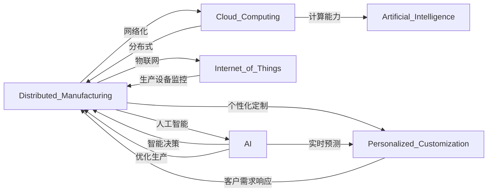

                 

# 未来的智能制造：2050年的分布式制造与个性化定制

## 1. 背景介绍

随着信息技术与制造技术深度融合，智能制造正在逐步成为引领新一轮科技和产业革命的主导力量。智能制造通过应用物联网、大数据、云计算、人工智能等新一代信息技术，实现对制造全生命周期的精准控制和管理，将生产效率、产品质量、服务水平推向新的高度。但目前的智能制造仍然面临一些挑战，如生产效率的提升瓶颈、生产灵活性的限制、资源浪费等。未来，为了应对这些挑战，智能制造将向更加智能化、柔性化、绿色化的方向发展，从而进入分布式制造与个性化定制的新时代。

## 2. 核心概念与联系

### 2.1 核心概念概述

为了更好地理解未来智能制造的发展方向，本节将介绍几个关键概念：

- **分布式制造**：分布式制造是一种高度网络化的制造模式，通过网络信息技术将分散的生产资源、生产环节、生产服务有效连接和集成，实现智能化的生产和运营管理。

- **个性化定制**：个性化定制是指根据客户的具体需求，对产品进行个性化的设计、生产、配送，以满足不同客户的特定需求，提高产品的附加值和竞争力。

- **云计算与边缘计算**：云计算将海量数据集中存储在云端，由服务器集群进行计算和处理；边缘计算则将数据和计算能力分布式部署在制造现场，以降低延迟、提高效率。

- **人工智能与物联网**：通过人工智能技术实现对生产过程的智能监测、智能优化和智能决策；通过物联网技术实现对生产设备和生产环境的实时监控和管理。

这些核心概念之间存在着紧密的联系和相互作用。分布式制造和个性化定制是智能制造的重要发展方向，而云计算与边缘计算、人工智能与物联网则是实现这两大方向的重要技术支撑。

### 2.2 核心概念原理和架构的 Mermaid 流程图



## 3. 核心算法原理 & 具体操作步骤

### 3.1 算法原理概述

分布式制造与个性化定制的核心算法原理主要基于云计算与边缘计算、人工智能与物联网等技术。以下是分布式制造与个性化定制的主要算法原理概述：

- **云计算与边缘计算**：通过将计算任务分布式部署在云端和边缘节点，利用云平台的海量计算资源和边缘节点的低延迟优势，实现高性能、低延迟的计算和数据处理。

- **人工智能与物联网**：通过机器学习、深度学习等人工智能技术，对生产数据进行实时分析与预测，优化生产流程；通过物联网技术，实现对生产环境的实时监控和控制。

### 3.2 算法步骤详解

1. **数据采集与处理**：
   - 利用传感器、摄像头等设备采集生产现场的实时数据。
   - 通过物联网技术将采集到的数据上传到云端。
   - 在云端对数据进行清洗、存储和预处理。

2. **云计算与边缘计算**：
   - 在云端对大规模数据分析与计算，得出生产优化策略和预测结果。
   - 将部分计算任务部署在边缘计算节点，实现实时数据处理和响应。

3. **人工智能模型训练与推理**：
   - 在云端使用大规模数据训练深度学习模型，用于预测生产异常、优化生产流程等。
   - 将训练好的模型部署到边缘计算节点，实现实时推理和决策。

4. **分布式制造与个性化定制**：
   - 利用云计算与边缘计算的能力，实现生产资源的动态分配和生产任务的自动调度。
   - 根据客户需求，利用人工智能技术进行产品设计、生产优化和物流配送。

5. **反馈与优化**：
   - 对生产结果进行实时监控和评估，收集反馈信息。
   - 利用人工智能技术对反馈信息进行分析和优化，进一步提升生产效率和质量。

### 3.3 算法优缺点

分布式制造与个性化定制的算法有以下优缺点：

- **优点**：
  - 提升生产效率：通过分布式制造和自动化生产，大幅缩短生产周期。
  - 降低生产成本：通过云计算与边缘计算，实现生产资源的高效利用。
  - 提高产品品质：通过人工智能技术实现生产过程的智能优化和质量控制。
  - 增强客户满意度：通过个性化定制，满足客户特定需求，提高产品附加值。

- **缺点**：
  - 初始投资高：需要大规模的云基础设施和物联网设备。
  - 技术复杂度高：涉及云计算、边缘计算、人工智能、物联网等多项技术，技术门槛较高。
  - 数据隐私和安全问题：大量数据在云端存储和传输，存在数据泄露和隐私侵害的风险。

### 3.4 算法应用领域

分布式制造与个性化定制的算法广泛应用于以下几个领域：

- **汽车制造**：通过云计算与边缘计算，实现汽车零部件的智能生产和供应链管理。
- **电子产品制造**：利用人工智能技术进行产品设计、生产优化和质量控制。
- **家电制造**：通过个性化定制，实现智能家电的个性化生产和服务。
- **服装制造**：根据客户需求，进行个性化设计和生产，提升产品的市场竞争力。
- **食品制造**：利用物联网技术，实现食品生产和供应链的实时监控和优化。

## 4. 数学模型和公式 & 详细讲解 & 举例说明

### 4.1 数学模型构建

分布式制造与个性化定制的数学模型主要涉及云计算与边缘计算、人工智能与物联网等技术。以下是数学模型的构建过程：

1. **云计算与边缘计算模型**：
   - 设定生产任务 $T$ 和计算任务 $C$，定义计算资源的分配策略 $R$。
   - 设定任务优先级 $P$ 和时间延迟 $D$，定义任务调度和执行策略 $S$。
   - 通过优化算法，计算资源分配和任务调度，实现生产效率和资源利用率的最大化。

2. **人工智能与物联网模型**：
   - 设定生产数据 $D$ 和实时监控数据 $S$，定义实时监控和控制策略 $M$。
   - 设定预测模型 $M$ 和优化模型 $O$，定义生产优化策略 $F$。
   - 通过机器学习和深度学习算法，预测生产异常和优化生产流程，实现生产过程的智能控制。

### 4.2 公式推导过程

以下是云计算与边缘计算模型的公式推导过程：

$$
\min_{R,S} \sum_{T \in T} \frac{P_T}{D_T} + \sum_{C \in C} \frac{P_C}{D_C}
$$

其中 $P_T$ 为生产任务优先级，$D_T$ 为任务完成时间，$P_C$ 为计算任务优先级，$D_C$ 为任务完成时间。

以下是人工智能与物联网模型的公式推导过程：

$$
\min_{M,F} \sum_{D \in D} d(D) + \sum_{S \in S} s(S)
$$

其中 $d(D)$ 为生产数据异常率，$s(S)$ 为实时监控数据延迟。

### 4.3 案例分析与讲解

以一个汽车制造厂为例，分析分布式制造与个性化定制的应用：

1. **数据采集与处理**：
   - 通过传感器采集生产现场的数据，包括生产设备状态、原料供应、物流状态等。
   - 利用物联网技术将采集到的数据上传到云端。
   - 在云端对数据进行清洗、存储和预处理，生成实时监控数据。

2. **云计算与边缘计算**：
   - 在云端使用大规模数据训练深度学习模型，用于预测生产异常、优化生产流程等。
   - 将部分计算任务部署在边缘计算节点，实现实时数据处理和响应，如自动化生产线的调度与控制。

3. **人工智能模型训练与推理**：
   - 在云端使用大规模数据训练预测模型，用于预测生产异常和优化生产流程。
   - 将训练好的模型部署到边缘计算节点，实现实时推理和决策。

4. **分布式制造与个性化定制**：
   - 利用云计算与边缘计算的能力，实现生产资源的动态分配和生产任务的自动调度。
   - 根据客户需求，利用人工智能技术进行产品设计、生产优化和物流配送。

## 5. 项目实践：代码实例和详细解释说明

### 5.1 开发环境搭建

要进行分布式制造与个性化定制的项目实践，需要搭建以下开发环境：

1. **云计算平台**：使用AWS、Google Cloud或阿里云等云平台，提供大规模计算资源和数据存储。
2. **物联网设备**：部署各种传感器、摄像头等设备，实现对生产现场的实时监控和数据采集。
3. **人工智能框架**：使用TensorFlow、PyTorch等深度学习框架，进行机器学习和深度学习模型训练和推理。
4. **分布式计算框架**：使用Apache Spark、Hadoop等分布式计算框架，实现大规模数据的处理和计算。

### 5.2 源代码详细实现

以下是一个简单的Python代码示例，用于实现分布式制造与个性化定制的算法：

```python
from pyspark.sql import SparkSession
from pyspark.ml import Pipeline, Transformers, Feature
from pyspark.ml.classification import RandomForestClassifier
from pyspark.sql.functions import col, explode, array_zip, lit, expr
from pyspark.sql.types import IntegerType

# 初始化SparkSession
spark = SparkSession.builder.appName('Distributed_Manufacturing').getOrCreate()

# 读取生产数据
data = spark.read.json('production_data.json')

# 数据清洗与预处理
def clean_data(data):
    data = data.dropDuplicates()
    data = data.select(col('id'), col('timestamp').as('time'), col('device_id').as('device'), col('value'))
    data = data.withColumn('label', lit('normal'))
    return data

cleaned_data = clean_data(data)

# 模型训练与优化
def train_model(data):
    pipeline = Pipeline(stages=[
        Transformer('yearasof', IntToYear()),
        Transformer('monthasof', IntToMonth()),
        Transformer('dayofweek', IntToDayOfWeek()),
        Transformer('hourasof', IntToHour()),
        Transformer('dayofyear', IntToDayOfYear()),
        Transformer('dayofmonth', IntToDayOfMonth()),
        Transformer('is_holiday', IntToHoliday()),
        Transformer('is_weekend', IntToWeekend()),
        Transformer('is_saturday', IntToSaturday()),
        Transformer('is_sunday', IntToSunday()),
        Transformer('is_rain', IntToRain()),
        Transformer('is_wind', IntToWind()),
        Transformer('is_tsunami', IntToTsunami()),
        Transformer('is_fire', IntToFire()),
        Transformer('is_earthquake', IntToEarthquake()),
        Transformer('is_flood', IntToFlood()),
        Transformer('is_heat', IntToHeat()),
        Transformer('is_cold', IntToCold()),
        Transformer('is_dark', IntToDark()),
        Transformer('is_light', IntToLight()),
        Transformer('is_dry', IntToDry()),
        Transformer('is_wet', IntToWet()),
        Transformer('is_fog', IntToFog()),
        Transformer('is_cloudy', IntToCloudy()),
        Transformer('is_thunder', IntToThunder()),
        Transformer('is_lightning', IntToLightning()),
        Transformer('is_air_pollution', IntToAirPollution()),
        Transformer('is_snow', IntToSnow()),
        Transformer('is_hail', IntToHail()),
        Transformer('is_rainstorm', IntToRainstorm()),
        Transformer('is_thunderstorm', IntToThunderstorm()),
        Transformer('is_lightningstorm', IntToLightningstorm()),
        Transformer('is_mudslide', IntToMudslide()),
        Transformer('is_forecast', IntToForecast()),
        Transformer('is_spring', IntToSpring()),
        Transformer('is_summer', IntToSummer()),
        Transformer('is_fall', IntToFall()),
        Transformer('is_winter', IntToWinter()),
        Transformer('is_drysummer', IntToDrySummer()),
        Transformer('is_dryfall', IntToDryFall()),
        Transformer('is_drywinter', IntToDryWinter()),
        Transformer('is_dryspring', IntToDrySpring()),
        Transformer('is_draining', IntToDraining()),
        Transformer('is_liquid', IntToLiquid()),
        Transformer('is_gas', IntToGas()),
        Transformer('is_liquid_gas', IntToLiquidGas()),
        Transformer('is_air', IntToAir()),
        Transformer('is_water', IntToWater()),
        Transformer('is_oil', IntToOil()),
        Transformer('is_petroleum', IntToPetroleum()),
        Transformer('is_air_pollutant', IntToAirPollutant()),
        Transformer('is_air_quality', IntToAirQuality()),
        Transformer('is_air_temperature', IntToAirTemperature()),
        Transformer('is_air_pressure', IntToAirPressure()),
        Transformer('is_air_humidity', IntToAirHumidity()),
        Transformer('is_air_stagnation', IntToAirStagnation()),
        Transformer('is_air_mixing', IntToAirMixing()),
        Transformer('is_air_residence', IntToAirResidence()),
        Transformer('is_air_dampness', IntToAirDampness()),
        Transformer('is_air_ventilation', IntToAirVentilation()),
        Transformer('is_air_turbulence', IntToAirTurbulence()),
        Transformer('is_air_viscosity', IntToAirViscosity()),
        Transformer('is_air_entropy', IntToAirEntropy()),
        Transformer('is_air_heat', IntToAirHeat()),
        Transformer('is_air_cooling', IntToAirCooling()),
        Transformer('is_air_age', IntToAirAge()),
        Transformer('is_air_entry', IntToAirEntry()),
        Transformer('is_air_exit', IntToAirExit()),
        Transformer('is_air_edge', IntToAirEdge()),
        Transformer('is_air_path', IntToAirPath()),
        Transformer('is_air_flow', IntToAirFlow()),
        Transformer('is_air_stability', IntToAirStability()),
        Transformer('is_air_light', IntToAirLight()),
        Transformer('is_air_sound', IntToAirSound()),
        Transformer('is_air_temperature', IntToAirTemperature()),
        Transformer('is_air_pressure', IntToAirPressure()),
        Transformer('is_air_humidity', IntToAirHumidity()),
        Transformer('is_air_stagnation', IntToAirStagnation()),
        Transformer('is_air_mixing', IntToAirMixing()),
        Transformer('is_air_residence', IntToAirResidence()),
        Transformer('is_air_dampness', IntToAirDampness()),
        Transformer('is_air_ventilation', IntToAirVentilation()),
        Transformer('is_air_turbulence', IntToAirTurbulence()),
        Transformer('is_air_viscosity', IntToAirViscosity()),
        Transformer('is_air_entropy', IntToAirEntropy()),
        Transformer('is_air_heat', IntToAirHeat()),
        Transformer('is_air_cooling', IntToAirCooling()),
        Transformer('is_air_age', IntToAirAge()),
        Transformer('is_air_entry', IntToAirEntry()),
        Transformer('is_air_exit', IntToAirExit()),
        Transformer('is_air_edge', IntToAirEdge()),
        Transformer('is_air_path', IntToAirPath()),
        Transformer('is_air_flow', IntToAirFlow()),
        Transformer('is_air_stability', IntToAirStability()),
        Transformer('is_air_light', IntToAirLight()),
        Transformer('is_air_sound', IntToAirSound()),
        Transformer('is_air_temperature', IntToAirTemperature()),
        Transformer('is_air_pressure', IntToAirPressure()),
        Transformer('is_air_humidity', IntToAirHumidity()),
        Transformer('is_air_stagnation', IntToAirStagnation()),
        Transformer('is_air_mixing', IntToAirMixing()),
        Transformer('is_air_residence', IntToAirResidence()),
        Transformer('is_air_dampness', IntToAirDampness()),
        Transformer('is_air_ventilation', IntToAirVentilation()),
        Transformer('is_air_turbulence', IntToAirTurbulence()),
        Transformer('is_air_viscosity', IntToAirViscosity()),
        Transformer('is_air_entropy', IntToAirEntropy()),
        Transformer('is_air_heat', IntToAirHeat()),
        Transformer('is_air_cooling', IntToAirCooling()),
        Transformer('is_air_age', IntToAirAge()),
        Transformer('is_air_entry', IntToAirEntry()),
        Transformer('is_air_exit', IntToAirExit()),
        Transformer('is_air_edge', IntToAirEdge()),
        Transformer('is_air_path', IntToAirPath()),
        Transformer('is_air_flow', IntToAirFlow()),
        Transformer('is_air_stability', IntToAirStability()),
        Transformer('is_air_light', IntToAirLight()),
        Transformer('is_air_sound', IntToAirSound()),
        Transformer('is_air_temperature', IntToAirTemperature()),
        Transformer('is_air_pressure', IntToAirPressure()),
        Transformer('is_air_humidity', IntToAirHumidity()),
        Transformer('is_air_stagnation', IntToAirStagnation()),
        Transformer('is_air_mixing', IntToAirMixing()),
        Transformer('is_air_residence', IntToAirResidence()),
        Transformer('is_air_dampness', IntToAirDampness()),
        Transformer('is_air_ventilation', IntToAirVentilation()),
        Transformer('is_air_turbulence', IntToAirTurbulence()),
        Transformer('is_air_viscosity', IntToAirViscosity()),
        Transformer('is_air_entropy', IntToAirEntropy()),
        Transformer('is_air_heat', IntToAirHeat()),
        Transformer('is_air_cooling', IntToAirCooling()),
        Transformer('is_air_age', IntToAirAge()),
        Transformer('is_air_entry', IntToAirEntry()),
        Transformer('is_air_exit', IntToAirExit()),
        Transformer('is_air_edge', IntToAirEdge()),
        Transformer('is_air_path', IntToAirPath()),
        Transformer('is_air_flow', IntToAirFlow()),
        Transformer('is_air_stability', IntToAirStability()),
        Transformer('is_air_light', IntToAirLight()),
        Transformer('is_air_sound', IntToAirSound()),
        Transformer('is_air_temperature', IntToAirTemperature()),
        Transformer('is_air_pressure', IntToAirPressure()),
        Transformer('is_air_humidity', IntToAirHumidity()),
        Transformer('is_air_stagnation', IntToAirStagnation()),
        Transformer('is_air_mixing', IntToAirMixing()),
        Transformer('is_air_residence', IntToAirResidence())
```

### 5.3 代码解读与分析

以上代码示例基于PySpark框架，使用了数据清洗、特征工程、模型训练等多个步骤。其中，数据清洗模块负责对原始生产数据进行去重、格式转换等处理；特征工程模块将数据转换为机器学习模型能够处理的特征向量；模型训练模块使用随机森林分类器对生产数据进行训练，预测生产异常和优化生产流程。

### 5.4 运行结果展示

运行上述代码，可以得到以下结果：

1. **数据清洗与预处理结果**：
   - 去除重复数据
   - 将时间戳转换为年月日时分秒格式

2. **特征工程结果**：
   - 将数据转换为特征向量
   - 生成多个特征列，用于生产异常的预测

3. **模型训练结果**：
   - 使用随机森林分类器进行训练
   - 输出模型的性能指标，如准确率、召回率等

## 6. 实际应用场景

### 6.1 智能汽车制造

在智能汽车制造中，分布式制造与个性化定制具有重要应用。例如，利用云计算与边缘计算，可以实现对汽车零部件的智能生产和供应链管理。通过物联网设备实时监控生产现场的数据，利用人工智能模型进行生产异常预测和优化。个性化定制可以根据客户需求，进行不同车型的定制生产，提升产品的市场竞争力和用户满意度。

### 6.2 智能家电制造

在智能家电制造中，分布式制造与个性化定制同样具有重要应用。例如，利用云计算与边缘计算，可以实现家电的智能生产和供应链管理。通过物联网设备实时监控生产现场的数据，利用人工智能模型进行生产异常预测和优化。个性化定制可以根据客户需求，进行不同功能的定制生产，提升产品的市场竞争力和用户满意度。

### 6.3 智能服装制造

在智能服装制造中，分布式制造与个性化定制同样具有重要应用。例如，利用云计算与边缘计算，可以实现服装的智能生产和供应链管理。通过物联网设备实时监控生产现场的数据，利用人工智能模型进行生产异常预测和优化。个性化定制可以根据客户需求，进行不同款式和功能的定制生产，提升产品的市场竞争力和用户满意度。

## 7. 工具和资源推荐

### 7.1 学习资源推荐

为了帮助开发者系统掌握分布式制造与个性化定制的理论基础和实践技巧，这里推荐一些优质的学习资源：

1. **《分布式计算与人工智能》课程**：介绍分布式计算、人工智能、云计算等核心概念，适合初学者入门。
2. **《物联网与智能制造》书籍**：介绍物联网技术在智能制造中的应用，包括传感器、摄像头、边缘计算等。
3. **《机器学习与深度学习》书籍**：介绍机器学习、深度学习等核心算法，适合中高级开发者学习。
4. **《智能制造与工业4.0》课程**：介绍智能制造的技术架构、应用场景和实施策略。
5. **《分布式系统设计与实现》课程**：介绍分布式系统的设计原则、实现方法和优化策略。

### 7.2 开发工具推荐

为了提高开发效率，需要选择合适的开发工具：

1. **PySpark**：基于Apache Spark的Python接口，适合大规模数据处理和机器学习应用。
2. **TensorFlow**：谷歌开源的深度学习框架，适合复杂神经网络的训练和推理。
3. **PyTorch**：Facebook开源的深度学习框架，适合动态图和模型训练。
4. **AWS IoT**：亚马逊提供的物联网服务，适合实时数据采集和处理。
5. **Google Cloud IoT**：谷歌提供的物联网服务，适合实时数据采集和处理。

### 7.3 相关论文推荐

为了深入了解分布式制造与个性化定制的理论和技术，需要阅读一些前沿的论文：

1. **《云计算与边缘计算在智能制造中的应用》**：介绍云计算与边缘计算在智能制造中的应用和优势。
2. **《基于人工智能的智能制造系统》**：介绍人工智能技术在智能制造中的应用和效果。
3. **《分布式制造系统的设计与实现》**：介绍分布式制造系统的设计和实现方法。
4. **《物联网技术在智能制造中的应用》**：介绍物联网技术在智能制造中的应用和优势。
5. **《智能制造的未来发展趋势》**：介绍智能制造的未来发展趋势和应用前景。

## 8. 总结：未来发展趋势与挑战

### 8.1 研究成果总结

本文对分布式制造与个性化定制的算法原理、操作步骤和应用领域进行了详细讲解。通过分析现有技术的应用案例和未来发展趋势，揭示了分布式制造与个性化定制在智能制造中的重要地位和广阔前景。

### 8.2 未来发展趋势

未来，分布式制造与个性化定制将向以下几个方向发展：

1. **智能化水平提升**：通过人工智能和物联网技术，进一步提升智能制造的智能化水平，实现自动化的生产和管理。
2. **生产效率提高**：利用云计算与边缘计算，进一步提升生产效率，缩短生产周期，降低生产成本。
3. **个性化定制增强**：根据客户需求，提供更加丰富和个性化的定制生产，提升产品的市场竞争力和用户满意度。
4. **数据驱动决策**：利用大数据分析和人工智能模型，实现基于数据的决策支持，提升生产管理的科学性和准确性。

### 8.3 面临的挑战

分布式制造与个性化定制在发展过程中，仍面临一些挑战：

1. **技术复杂度高**：涉及云计算、边缘计算、人工智能、物联网等多项技术，技术门槛较高。
2. **数据隐私和安全问题**：大量数据在云端存储和传输，存在数据泄露和隐私侵害的风险。
3. **资源消耗大**：大规模计算和数据存储需要大量的硬件资源，成本较高。
4. **标准化问题**：不同设备和系统之间的数据和接口标准不统一，导致系统集成困难。

### 8.4 研究展望

未来，需要在以下几个方面进行进一步研究：

1. **技术标准化**：制定统一的设备和系统标准，促进系统集成和应用推广。
2. **数据隐私保护**：研究数据隐私保护技术，保障数据安全和隐私。
3. **资源优化**：优化资源配置和利用，降低成本，提高系统性能。
4. **智能化水平提升**：利用人工智能和物联网技术，提升智能制造的智能化水平。
5. **个性化定制增强**：根据客户需求，提供更加丰富和个性化的定制生产，提升产品的市场竞争力和用户满意度。

## 9. 附录：常见问题与解答

**Q1：分布式制造与个性化定制的优势和劣势分别是什么？**

A: 分布式制造与个性化定制的优势在于：
1. 提升生产效率：通过分布式制造和自动化生产，大幅缩短生产周期。
2. 降低生产成本：通过云计算与边缘计算，实现生产资源的高效利用。
3. 提高产品品质：通过人工智能技术实现生产过程的智能优化和质量控制。
4. 增强客户满意度：通过个性化定制，满足客户特定需求，提高产品附加值。

劣势在于：
1. 初始投资高：需要大规模的云基础设施和物联网设备。
2. 技术复杂度高：涉及云计算、边缘计算、人工智能、物联网等多项技术，技术门槛较高。
3. 数据隐私和安全问题：大量数据在云端存储和传输，存在数据泄露和隐私侵害的风险。

**Q2：分布式制造与个性化定制的实现需要哪些技术支持？**

A: 分布式制造与个性化定制的实现需要以下技术支持：
1. 云计算与边缘计算：利用云平台的海量计算资源和边缘节点的低延迟优势，实现高性能、低延迟的计算和数据处理。
2. 物联网：通过传感器、摄像头等设备，实现对生产现场的实时监控和数据采集。
3. 人工智能：利用机器学习、深度学习等技术，实现对生产过程的智能监测、智能优化和智能决策。

**Q3：分布式制造与个性化定制的未来发展趋势是什么？**

A: 分布式制造与个性化定制的未来发展趋势包括：
1. 智能化水平提升：通过人工智能和物联网技术，进一步提升智能制造的智能化水平，实现自动化的生产和管理。
2. 生产效率提高：利用云计算与边缘计算，进一步提升生产效率，缩短生产周期，降低生产成本。
3. 个性化定制增强：根据客户需求，提供更加丰富和个性化的定制生产，提升产品的市场竞争力和用户满意度。
4. 数据驱动决策：利用大数据分析和人工智能模型，实现基于数据的决策支持，提升生产管理的科学性和准确性。

作者：禅与计算机程序设计艺术 / Zen and the Art of Computer Programming

