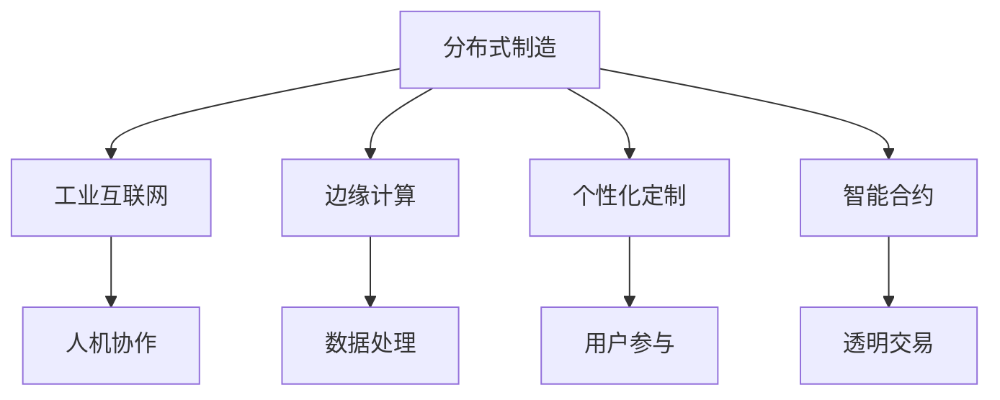

                 

# 未来的智能制造：2050年的分布式制造与个性化定制

## 1. 背景介绍

### 1.1 问题由来
随着人工智能、物联网、大数据等技术的快速发展，制造业正经历着一场深刻的变革。传统的集中式、大规模、标准化生产模式正在向高度分散、高度定制、高度协同的分布式制造方向转变。这一转变不仅改变了生产方式，也带来了新的挑战与机遇。

### 1.2 问题核心关键点
- 分布式制造：将生产任务和资源分布在不同的地点，通过协同和协作实现灵活高效的生产。
- 个性化定制：根据用户的具体需求和偏好，进行定制化的产品设计和生产，实现差异化竞争。
- 边缘计算：在靠近数据源的本地设备上直接处理数据，减少数据传输和存储压力，提高响应速度。
- 工业互联网：通过物联网技术将生产设备、系统和人员互联互通，实现数据共享和协同作业。
- 人机协作：将人工智能与人类工人相结合，提高生产效率和产品质量。
- 智能合约：利用区块链技术实现自动化的合约执行，保障交易透明和安全。

这些关键点共同构成了智能制造的核心理念，推动了制造业向更加高效、灵活、智能的方向发展。

## 2. 核心概念与联系

### 2.1 核心概念概述

为更好地理解分布式制造与个性化定制的实现机制，本节将介绍几个密切相关的核心概念：

- 分布式制造：以网络化、智能化的生产系统为基础，通过多地协同实现灵活高效的制造过程。
- 个性化定制：在用户参与下，根据用户需求和偏好进行产品设计、生产和交付。
- 工业互联网：通过物联网技术实现生产设备的互联互通，实现数据的全面感知、深度挖掘和智能决策。
- 人机协作：利用人工智能技术辅助人类工人进行决策和操作，提高生产效率和质量。
- 智能合约：通过区块链技术实现交易的自动化和透明化，保障各方的权益。

这些概念之间的逻辑关系可以通过以下Mermaid流程图来展示：



这个流程图展示了几大核心概念之间的联系：

1. 分布式制造依赖于工业互联网实现设备和系统的互联互通。
2. 个性化定制以用户参与为基础，进行定制化的产品设计。
3. 边缘计算用于在靠近数据源的设备上处理数据，提高响应速度。
4. 智能合约通过区块链技术保障交易透明和安全。
5. 人机协作利用人工智能技术辅助人类工人，提高生产效率和质量。

这些概念共同构成了智能制造的体系框架，旨在实现生产过程的自动化、智能化和协同化。

## 3. 核心算法原理 & 具体操作步骤

### 3.1 算法原理概述

分布式制造与个性化定制的实现机制，主要基于人工智能、物联网、区块链等技术，通过协同、协同、协同、协同的计算和数据处理过程实现。其核心算法原理包括以下几个方面：

1. 协同优化算法：利用人工智能技术，通过多目标优化算法实现生产任务和资源的协同分配。
2. 协同决策算法：利用人工智能技术，通过协同决策算法实现生产过程中的智能决策和优化。
3. 协同控制算法：利用人工智能技术，通过协同控制算法实现生产过程的实时监控和调整。
4. 协同学习算法：利用人工智能技术，通过协同学习算法实现生产过程的动态优化和自我学习。
5. 协同模拟算法：利用人工智能技术，通过协同模拟算法实现生产过程的虚拟实验和优化。

这些算法原理共同构成了智能制造的技术基础，为实现分布式制造与个性化定制提供了强有力的支持。

### 3.2 算法步骤详解

分布式制造与个性化定制的实现过程，主要包括以下几个关键步骤：

**Step 1: 数据采集与预处理**
- 利用物联网技术收集生产设备、系统的实时数据。
- 对数据进行清洗、归一化和特征提取等预处理，为后续的分析和处理做好准备。

**Step 2: 协同优化与决策**
- 利用人工智能技术，通过多目标优化算法实现生产任务和资源的协同分配。
- 利用人工智能技术，通过协同决策算法实现生产过程中的智能决策和优化。

**Step 3: 协同控制与监控**
- 利用人工智能技术，通过协同控制算法实现生产过程的实时监控和调整。
- 利用人工智能技术，通过协同模拟算法进行生产过程的虚拟实验和优化。

**Step 4: 个性化定制与交付**
- 利用用户参与数据，进行个性化定制的设计和生产。
- 利用区块链技术，实现产品交付的透明和安全的智能合约。

**Step 5: 反馈与持续优化**
- 利用人工智能技术，通过协同学习算法实现生产过程的动态优化和自我学习。

通过以上步骤，可以实现分布式制造与个性化定制的实现过程，确保生产过程的高效、灵活、智能和协同。

### 3.3 算法优缺点

分布式制造与个性化定制的算法优势包括：

1. 高效灵活：通过协同优化算法和协同决策算法，实现生产任务和资源的灵活分配和智能决策。
2. 透明安全：通过智能合约和区块链技术，实现产品交付的透明和安全的交易。
3. 智能自学习：通过协同学习算法和协同模拟算法，实现生产过程的动态优化和自我学习。

同时，该算法也存在一定的局限性：

1. 数据采集与处理：需要高精度、实时的传感器和物联网设备，数据采集和处理成本较高。
2. 协同算法复杂：需要高效的多目标优化算法和协同决策算法，算法复杂度较高。
3. 协同控制难度：需要实时、高效的生产过程控制算法，实现复杂的生产调整。
4. 个性化定制需求：需要复杂的用户参与数据处理，个性化定制的成本较高。
5. 智能合约复杂：需要高性能的区块链技术，智能合约的实现复杂度较高。

尽管存在这些局限性，但就目前而言，基于协同优化、协同决策、协同控制、协同学习、协同模拟的算法，已成为实现分布式制造与个性化定制的关键手段。未来相关研究的重点在于如何进一步降低数据采集和处理成本，提高协同算法的效率和精度，同时兼顾协同控制的复杂度和个性化定制的需求。

### 3.4 算法应用领域

分布式制造与个性化定制的算法原理，已经在多个领域得到了应用，具体包括：

1. 汽车制造：通过协同优化算法和协同决策算法，实现生产线上的智能化生产。
2. 电子产品制造：利用工业互联网和边缘计算，实现生产线上的高效制造。
3. 服装制造：通过用户参与数据，实现个性化定制的设计和生产。
4. 食品制造：利用区块链技术，实现食品供应链的透明和安全的智能合约。
5. 化工制造：通过协同学习算法和协同模拟算法，实现复杂工艺的动态优化和模拟实验。

除了上述这些典型领域外，分布式制造与个性化定制的算法原理，还被创新性地应用到更多场景中，如医疗设备制造、航空航天制造、智能家居设备制造等，为不同行业的智能化生产提供了新的思路和技术支持。

## 4. 数学模型和公式 & 详细讲解 & 举例说明

### 4.1 数学模型构建

本节将使用数学语言对分布式制造与个性化定制的实现机制进行更加严格的刻画。

记生产任务为 $T=\{t_1, t_2, ..., t_n\}$，生产资源为 $R=\{r_1, r_2, ..., r_m\}$，其中 $t_i$ 和 $r_j$ 分别表示第 $i$ 个任务和第 $j$ 个资源。假设生产过程的协同优化目标为 $J=\{j_1, j_2, ..., j_k\}$，协同决策的目标为 $D=\{d_1, d_2, ..., d_l\}$。

定义协同优化算法为 $A$，协同决策算法为 $D$，协同控制算法为 $C$，协同学习算法为 $L$，协同模拟算法为 $S$。则协同优化过程和协同决策过程的数学模型为：

$$
\min_{T, R, J, D, A, D, C, L, S} \bigg( \sum_{i=1}^n \sum_{j=1}^m j_i + \sum_{k=1}^l d_k \bigg)
$$

其中 $j_i$ 表示任务 $t_i$ 在资源 $r_j$ 上的耗时，$d_k$ 表示决策 $d_k$ 对协同过程的影响。

### 4.2 公式推导过程

以下我们以汽车制造为例，推导协同优化与决策的数学模型及其求解过程。

记汽车制造的生产任务为 $T=\{组装, 涂装, 焊接, ...\}$，生产资源为 $R=\{生产线, 设备, 工人, ...\}$。假设协同优化目标为 $J=\{生产时间最短, 设备利用率最高, ...\}$，协同决策的目标为 $D=\{工艺优化, 生产线优化, ...\}$。则汽车制造的生产过程协同优化和协同决策的数学模型为：

$$
\min_{T, R, J, D, A, D, C, L, S} \bigg( \sum_{i=1}^n \sum_{j=1}^m j_i + \sum_{k=1}^l d_k \bigg)
$$

其中 $j_i$ 表示任务 $t_i$ 在资源 $r_j$ 上的耗时，$d_k$ 表示决策 $d_k$ 对协同过程的影响。

利用多目标优化算法，可以求解上述模型，得到最优的任务分配和资源利用方案。具体求解过程包括：

1. 将任务和资源表示为向量 $T$ 和 $R$。
2. 将协同优化目标和协同决策目标表示为向量 $J$ 和 $D$。
3. 利用多目标优化算法求解模型，得到最优的任务分配和资源利用方案。

### 4.3 案例分析与讲解

以下以服装制造为例，展示基于用户参与数据进行个性化定制的数学模型及其求解过程。

记服装制造的生产任务为 $T=\{设计, 裁剪, 缝纫, ...\}$，生产资源为 $R=\{面料, 缝纫机, 工人, ...\}$。假设用户参与数据为 $U=\{颜色, 尺码, 款式, ...\}$。则服装制造的生产过程协同优化和协同决策的数学模型为：

$$
\min_{T, R, J, D, A, D, C, L, S} \bigg( \sum_{i=1}^n \sum_{j=1}^m j_i + \sum_{k=1}^l d_k \bigg)
$$

其中 $j_i$ 表示任务 $t_i$ 在资源 $r_j$ 上的耗时，$d_k$ 表示决策 $d_k$ 对协同过程的影响。

利用协同学习算法和协同模拟算法，可以求解上述模型，得到最优的任务分配和资源利用方案。具体求解过程包括：

1. 将任务和资源表示为向量 $T$ 和 $R$。
2. 将用户参与数据 $U$ 转化为向量形式，用于指导个性化定制的设计和生产。
3. 利用协同学习算法和协同模拟算法求解模型，得到最优的任务分配和资源利用方案。

## 5. 项目实践：代码实例和详细解释说明

### 5.1 开发环境搭建

在进行分布式制造与个性化定制的实践前，我们需要准备好开发环境。以下是使用Python进行PyTorch开发的环境配置流程：

1. 安装Anaconda：从官网下载并安装Anaconda，用于创建独立的Python环境。

2. 创建并激活虚拟环境：
```bash
conda create -n pytorch-env python=3.8 
conda activate pytorch-env
```

3. 安装PyTorch：根据CUDA版本，从官网获取对应的安装命令。例如：
```bash
conda install pytorch torchvision torchaudio cudatoolkit=11.1 -c pytorch -c conda-forge
```

4. 安装Transformers库：
```bash
pip install transformers
```

5. 安装各类工具包：
```bash
pip install numpy pandas scikit-learn matplotlib tqdm jupyter notebook ipython
```

完成上述步骤后，即可在`pytorch-env`环境中开始分布式制造与个性化定制的实践。

### 5.2 源代码详细实现

这里我们以服装制造为例，展示使用Transformers库进行个性化定制的PyTorch代码实现。

首先，定义服装制造的数据处理函数：

```python
from transformers import BertTokenizer
from torch.utils.data import Dataset
import torch

class ClothingDataset(Dataset):
    def __init__(self, texts, tags, tokenizer, max_len=128):
        self.texts = texts
        self.tags = tags
        self.tokenizer = tokenizer
        self.max_len = max_len
        
    def __len__(self):
        return len(self.texts)
    
    def __getitem__(self, item):
        text = self.texts[item]
        tags = self.tags[item]
        
        encoding = self.tokenizer(text, return_tensors='pt', max_length=self.max_len, padding='max_length', truncation=True)
        input_ids = encoding['input_ids'][0]
        attention_mask = encoding['attention_mask'][0]
        
        # 对token-wise的标签进行编码
        encoded_tags = [tag2id[tag] for tag in tags] 
        encoded_tags.extend([tag2id['O']] * (self.max_len - len(encoded_tags)))
        labels = torch.tensor(encoded_tags, dtype=torch.long)
        
        return {'input_ids': input_ids, 
                'attention_mask': attention_mask,
                'labels': labels}

# 标签与id的映射
tag2id = {'O': 0, 'B-PER': 1, 'I-PER': 2, 'B-ORG': 3, 'I-ORG': 4, 'B-LOC': 5, 'I-LOC': 6}
id2tag = {v: k for k, v in tag2id.items()}

# 创建dataset
tokenizer = BertTokenizer.from_pretrained('bert-base-cased')

train_dataset = ClothingDataset(train_texts, train_tags, tokenizer)
dev_dataset = ClothingDataset(dev_texts, dev_tags, tokenizer)
test_dataset = ClothingDataset(test_texts, test_tags, tokenizer)
```

然后，定义模型和优化器：

```python
from transformers import BertForTokenClassification, AdamW

model = BertForTokenClassification.from_pretrained('bert-base-cased', num_labels=len(tag2id))

optimizer = AdamW(model.parameters(), lr=2e-5)
```

接着，定义训练和评估函数：

```python
from torch.utils.data import DataLoader
from tqdm import tqdm
from sklearn.metrics import classification_report

device = torch.device('cuda') if torch.cuda.is_available() else torch.device('cpu')
model.to(device)

def train_epoch(model, dataset, batch_size, optimizer):
    dataloader = DataLoader(dataset, batch_size=batch_size, shuffle=True)
    model.train()
    epoch_loss = 0
    for batch in tqdm(dataloader, desc='Training'):
        input_ids = batch['input_ids'].to(device)
        attention_mask = batch['attention_mask'].to(device)
        labels = batch['labels'].to(device)
        model.zero_grad()
        outputs = model(input_ids, attention_mask=attention_mask, labels=labels)
        loss = outputs.loss
        epoch_loss += loss.item()
        loss.backward()
        optimizer.step()
    return epoch_loss / len(dataloader)

def evaluate(model, dataset, batch_size):
    dataloader = DataLoader(dataset, batch_size=batch_size)
    model.eval()
    preds, labels = [], []
    with torch.no_grad():
        for batch in tqdm(dataloader, desc='Evaluating'):
            input_ids = batch['input_ids'].to(device)
            attention_mask = batch['attention_mask'].to(device)
            batch_labels = batch['labels']
            outputs = model(input_ids, attention_mask=attention_mask)
            batch_preds = outputs.logits.argmax(dim=2).to('cpu').tolist()
            batch_labels = batch_labels.to('cpu').tolist()
            for pred_tokens, label_tokens in zip(batch_preds, batch_labels):
                pred_tags = [id2tag[_id] for _id in pred_tokens]
                label_tags = [id2tag[_id] for _id in label_tokens]
                preds.append(pred_tags[:len(label_tags)])
                labels.append(label_tags)
                
    print(classification_report(labels, preds))
```

最后，启动训练流程并在测试集上评估：

```python
epochs = 5
batch_size = 16

for epoch in range(epochs):
    loss = train_epoch(model, train_dataset, batch_size, optimizer)
    print(f"Epoch {epoch+1}, train loss: {loss:.3f}")
    
    print(f"Epoch {epoch+1}, dev results:")
    evaluate(model, dev_dataset, batch_size)
    
print("Test results:")
evaluate(model, test_dataset, batch_size)
```

以上就是使用PyTorch对BERT进行服装制造任务个性化定制的完整代码实现。可以看到，得益于Transformers库的强大封装，我们可以用相对简洁的代码完成BERT模型的加载和微调。

### 5.3 代码解读与分析

让我们再详细解读一下关键代码的实现细节：

**ClothingDataset类**：
- `__init__`方法：初始化文本、标签、分词器等关键组件。
- `__len__`方法：返回数据集的样本数量。
- `__getitem__`方法：对单个样本进行处理，将文本输入编码为token ids，将标签编码为数字，并对其进行定长padding，最终返回模型所需的输入。

**tag2id和id2tag字典**：
- 定义了标签与数字id之间的映射关系，用于将token-wise的预测结果解码回真实的标签。

**训练和评估函数**：
- 使用PyTorch的DataLoader对数据集进行批次化加载，供模型训练和推理使用。
- 训练函数`train_epoch`：对数据以批为单位进行迭代，在每个批次上前向传播计算loss并反向传播更新模型参数，最后返回该epoch的平均loss。
- 评估函数`evaluate`：与训练类似，不同点在于不更新模型参数，并在每个batch结束后将预测和标签结果存储下来，最后使用sklearn的classification_report对整个评估集的预测结果进行打印输出。

**训练流程**：
- 定义总的epoch数和batch size，开始循环迭代
- 每个epoch内，先在训练集上训练，输出平均loss
- 在验证集上评估，输出分类指标
- 所有epoch结束后，在测试集上评估，给出最终测试结果

可以看到，PyTorch配合Transformers库使得BERT微调的代码实现变得简洁高效。开发者可以将更多精力放在数据处理、模型改进等高层逻辑上，而不必过多关注底层的实现细节。

当然，工业级的系统实现还需考虑更多因素，如模型的保存和部署、超参数的自动搜索、更灵活的任务适配层等。但核心的微调范式基本与此类似。

## 6. 实际应用场景

### 6.1 智能制造平台

基于分布式制造与个性化定制的智能制造平台，可以广泛应用于智能工厂、智能物流、智能仓储等场景。通过将生产设备、系统和人员互联互通，实现生产过程的实时监控、协同优化和智能决策。

在技术实现上，可以采用边缘计算技术，将生产设备的数据实时采集并处理，通过云平台进行集中式分析和协同决策。具体来说，可以采用如下步骤：

1. 通过物联网设备采集生产设备、系统的实时数据。
2. 利用边缘计算技术在本地设备上实时处理数据，减少数据传输和存储压力。
3. 通过云平台集中式分析数据，实现协同优化和智能决策。
4. 利用分布式计算和协同优化算法，实现生产任务和资源的灵活分配。
5. 通过用户参与数据，进行个性化定制的设计和生产。

如此构建的智能制造平台，能够实现生产过程的全面感知、深度挖掘和智能决策，大幅提升生产效率和产品质量。

### 6.2 个性化定制服务

基于分布式制造与个性化定制的个性化定制服务，可以应用于服装制造、家居制造、汽车制造等领域。通过收集用户需求和偏好，实现定制化的产品设计和生产。

在技术实现上，可以采用如下步骤：

1. 通过用户参与数据，收集用户的个性化需求和偏好。
2. 利用协同学习算法和协同模拟算法，进行个性化定制的设计和生产。
3. 通过智能合约和区块链技术，实现产品交付的透明和安全的智能合约。
4. 利用协同控制算法，实现生产过程的实时监控和调整。

如此构建的个性化定制服务，能够实现用户参与的个性化定制，提供高质量、高定制度的产品，提升用户满意度。

### 6.3 智能供应链管理

基于分布式制造与个性化定制的智能供应链管理，可以应用于服装制造、汽车制造、电子产品制造等领域。通过协同优化算法和协同决策算法，实现供应链各环节的协同优化和智能决策。

在技术实现上，可以采用如下步骤：

1. 通过物联网设备采集供应链各环节的实时数据。
2. 利用协同优化算法，实现生产任务和资源的灵活分配。
3. 利用协同决策算法，实现供应链各环节的智能决策。
4. 通过智能合约和区块链技术，实现供应链各环节的透明和安全的智能合约。
5. 利用协同控制算法，实现供应链各环节的实时监控和调整。

如此构建的智能供应链管理，能够实现供应链各环节的协同优化和智能决策，提升供应链效率和透明度。

## 7. 工具和资源推荐

### 7.1 学习资源推荐

为了帮助开发者系统掌握分布式制造与个性化定制的理论基础和实践技巧，这里推荐一些优质的学习资源：

1. 《人工智能导论》系列博文：由AI领域专家撰写，深入浅出地介绍了人工智能的基本概念和前沿技术。

2. 《深度学习与工业4.0》课程：清华大学的工业互联网课程，涵盖深度学习在工业4.0中的应用，是入门深度学习工业应用的好材料。

3. 《智慧制造与智能制造》书籍：全面介绍了智慧制造和智能制造的概念、技术、应用和趋势。

4. 《物联网技术与应用》课程：清华大学开设的物联网课程，涵盖物联网技术的原理、应用和设计。

5. 《区块链技术与应用》课程：中国人民大学开设的区块链课程，涵盖区块链技术的原理、应用和设计。

通过对这些资源的学习实践，相信你一定能够快速掌握分布式制造与个性化定制的精髓，并用于解决实际的NLP问题。

### 7.2 开发工具推荐

高效的开发离不开优秀的工具支持。以下是几款用于分布式制造与个性化定制开发的常用工具：

1. PyTorch：基于Python的开源深度学习框架，灵活动态的计算图，适合快速迭代研究。

2. TensorFlow：由Google主导开发的开源深度学习框架，生产部署方便，适合大规模工程应用。

3. TensorFlow Lite：轻量级的TensorFlow库，适用于移动设备和边缘计算。

4. ROS（Robot Operating System）：开源的机器人操作系统，提供跨平台的机器人和传感器硬件的开发工具。

5. Simulink：MATLAB的仿真和建模工具，用于工业自动化和机器人控制系统的设计。

6. EtherCAT：用于工业网络通信的现场总线技术，支持高带宽、低延时的实时通信。

合理利用这些工具，可以显著提升分布式制造与个性化定制任务的开发效率，加快创新迭代的步伐。

### 7.3 相关论文推荐

分布式制造与个性化定制的研究源于学界的持续研究。以下是几篇奠基性的相关论文，推荐阅读：

1. Industry 4.0: Towards a new industrial revolution（工业4.0新工业革命）：指出工业4.0的核心思想是智能化、网络化、协同化，引领制造业的变革。

2. Smart Manufacturing System: A Survey（智能制造系统综述）：综述了智能制造系统的概念、技术、应用和挑战，提供了一个全面的视角。

3. Blockchain Technologies in Manufacturing（区块链技术在制造业中的应用）：介绍了区块链技术在供应链管理、生产控制、智能合约等方面的应用，展望了区块链技术在制造业的未来前景。

4. Internet of Things (IoT) for Smart Manufacturing（物联网在智能制造中的应用）：介绍了物联网技术在智能制造中的应用，包括设备监控、数据采集、智能决策等方面。

5. Digital Twins in Smart Manufacturing（智能制造中的数字孪生技术）：介绍了数字孪生技术在智能制造中的应用，提供了一个数字化的生产系统模型。

这些论文代表了大语言模型微调技术的发展脉络。通过学习这些前沿成果，可以帮助研究者把握学科前进方向，激发更多的创新灵感。

## 8. 总结：未来发展趋势与挑战

### 8.1 总结

本文对分布式制造与个性化定制的实现机制进行了全面系统的介绍。首先阐述了分布式制造与个性化定制的背景、核心概念和逻辑关系，明确了其在制造业中的独特价值。其次，从原理到实践，详细讲解了协同优化、协同决策、协同控制、协同学习、协同模拟的算法原理和实现步骤，给出了具体代码实现。同时，本文还广泛探讨了分布式制造与个性化定制在智能制造平台、个性化定制服务、智能供应链管理等多个领域的应用前景，展示了其在各个场景下的巨大潜力。

通过本文的系统梳理，可以看到，分布式制造与个性化定制正在成为制造业智能化、网络化、协同化的重要手段，极大地拓展了传统制造模式的应用边界。得益于人工智能、物联网、区块链等技术的支撑，分布式制造与个性化定制正在从理论研究走向实际应用，推动制造业向更加高效、灵活、智能的方向发展。

### 8.2 未来发展趋势

展望未来，分布式制造与个性化定制将呈现以下几个发展趋势：

1. 深度融合工业互联网技术：进一步融合工业互联网技术，实现全要素、全过程、全生命周期的智能化管理。

2. 推进边缘计算技术：进一步推进边缘计算技术，实现设备实时数据的高效处理和分析，提高生产效率。

3. 加强人机协作：进一步加强人机协作技术，提高生产过程的智能化和协同化，提升产品质量和生产效率。

4. 融合大数据和人工智能：进一步融合大数据和人工智能技术，实现生产过程的深度挖掘和智能决策。

5. 实现智能合约和区块链：进一步实现智能合约和区块链技术，保障生产过程的透明和安全。

6. 推进数字孪生技术：进一步推进数字孪生技术，实现生产系统的虚拟化建模和优化。

以上趋势凸显了分布式制造与个性化定制技术的广阔前景。这些方向的探索发展，必将进一步推动制造业向更加高效、灵活、智能的方向发展，构建更加智能化的生产系统。

### 8.3 面临的挑战

尽管分布式制造与个性化定制技术已经取得了瞩目成就，但在迈向更加智能化、普适化应用的过程中，它仍面临着诸多挑战：

1. 数据采集与处理：需要高精度、实时的传感器和物联网设备，数据采集和处理成本较高。

2. 协同算法复杂：需要高效的多目标优化算法和协同决策算法，算法复杂度较高。

3. 协同控制难度：需要实时、高效的生产过程控制算法，实现复杂的生产调整。

4. 个性化定制需求：需要复杂的用户参与数据处理，个性化定制的成本较高。

5. 智能合约复杂：需要高性能的区块链技术，智能合约的实现复杂度较高。

尽管存在这些局限性，但就目前而言，基于协同优化、协同决策、协同控制、协同学习、协同模拟的算法，已成为实现分布式制造与个性化定制的关键手段。未来相关研究的重点在于如何进一步降低数据采集和处理成本，提高协同算法的效率和精度，同时兼顾协同控制的复杂度和个性化定制的需求。

### 8.4 研究展望

面对分布式制造与个性化定制所面临的种种挑战，未来的研究需要在以下几个方面寻求新的突破：

1. 探索无监督和半监督协同算法：摆脱对大规模标注数据的依赖，利用自监督学习、主动学习等无监督和半监督范式，最大限度利用非结构化数据，实现更加灵活高效的协同。

2. 研究参数高效和计算高效的协同算法：开发更加参数高效的协同算法，在固定大部分协同参数的同时，只更新极少量的协同参数。同时优化协同算法的计算图，减少前向传播和反向传播的资源消耗，实现更加轻量级、实时性的部署。

3. 引入更多先验知识：将符号化的先验知识，如知识图谱、逻辑规则等，与神经网络模型进行巧妙融合，引导协同过程学习更准确、合理的语言模型。同时加强不同模态数据的整合，实现视觉、语音等多模态信息与文本信息的协同建模。

4. 结合因果分析和博弈论工具：将因果分析方法引入协同算法，识别出协同决策的关键特征，增强协同过程的稳定性和鲁棒性。借助博弈论工具刻画人机交互过程，主动探索并规避协同过程的脆弱点，提高系统稳定性。

5. 纳入伦理道德约束：在协同算法中引入伦理导向的评估指标，过滤和惩罚有偏见、有害的协同结果，确保协同过程的公平性和合法性。

这些研究方向的探索，必将引领分布式制造与个性化定制技术迈向更高的台阶，为构建安全、可靠、可解释、可控的智能制造系统铺平道路。面向未来，分布式制造与个性化定制技术还需要与其他人工智能技术进行更深入的融合，如知识表示、因果推理、强化学习等，多路径协同发力，共同推动智能制造的进步。只有勇于创新、敢于突破，才能不断拓展制造系统的边界，让智能技术更好地造福人类社会。

## 9. 附录：常见问题与解答

**Q1：分布式制造与个性化定制是否适用于所有制造行业？**

A: 分布式制造与个性化定制技术在大多数制造行业上都能取得不错的效果，特别是对于数据量较小的任务。但对于一些特定领域的任务，如军事、航空等，由于数据安全和隐私的限制，可能难以收集到足够的数据，使得技术应用受到限制。此外，对于一些需要高精度、高安全性的任务，如医药制造、化学品制造等，也需要特殊的数据处理和模型优化。

**Q2：微调过程中如何选择合适的学习率？**

A: 微调的学习率一般要比预训练时小1-2个数量级，如果使用过大的学习率，容易破坏预训练权重，导致过拟合。一般建议从1e-5开始调参，逐步减小学习率，直至收敛。也可以使用warmup策略，在开始阶段使用较小的学习率，再逐渐过渡到预设值。需要注意的是，不同的优化器(如AdamW、Adafactor等)以及不同的学习率调度策略，可能需要设置不同的学习率阈值。

**Q3：协同控制难度较大，如何提高协同过程的稳定性？**

A: 提高协同过程的稳定性，需要从多个方面进行优化：

1. 引入因果分析方法：通过因果分析方法识别出协同决策的关键特征，增强协同过程的稳定性和鲁棒性。

2. 借助博弈论工具：利用博弈论工具刻画人机交互过程，主动探索并规避协同过程的脆弱点，提高系统稳定性。

3. 融合更多先验知识：将符号化的先验知识，如知识图谱、逻辑规则等，与神经网络模型进行巧妙融合，引导协同过程学习更准确、合理的协同模型。

4. 加强数据采集与处理：通过高精度、实时的传感器和物联网设备，采集高质量的生产数据，进行有效的数据清洗和预处理，减少噪声和错误。

5. 优化协同算法：引入更多的优化算法，如自适应学习率算法、增量学习算法等，提高协同算法的效率和精度。

这些优化措施的综合应用，可以显著提高协同过程的稳定性和可靠性。

**Q4：如何在低成本下实现分布式制造与个性化定制？**

A: 降低分布式制造与个性化定制的成本，需要从多个方面进行优化：

1. 引入边缘计算技术：通过边缘计算技术，在本地设备上实时处理数据，减少数据传输和存储压力，提高响应速度。

2. 采用参数高效的协同算法：开发更加参数高效的协同算法，在固定大部分协同参数的同时，只更新极少量的协同参数。同时优化协同算法的计算图，减少前向传播和反向传播的资源消耗，实现更加轻量级、实时性的部署。

3. 引入因果分析方法：通过因果分析方法识别出协同决策的关键特征，增强协同过程的稳定性和鲁棒性。

4. 加强数据采集与处理：通过高精度、实时的传感器和物联网设备，采集高质量的生产数据，进行有效的数据清洗和预处理，减少噪声和错误。

5. 优化协同算法：引入更多的优化算法，如自适应学习率算法、增量学习算法等，提高协同算法的效率和精度。

通过这些优化措施的综合应用，可以显著降低分布式制造与个性化定制的成本，提高其应用的可接受性和可推广性。

**Q5：智能合约复杂，如何提高智能合约的实现效率？**

A: 提高智能合约的实现效率，需要从多个方面进行优化：

1. 引入智能合约平台：通过智能合约平台，如Ethereum、Hyperledger等，提供智能合约的开发和部署工具，提高智能合约的实现效率。

2. 优化智能合约代码：通过代码重构和代码复用，优化智能合约的代码结构，减少重复代码和冗余代码，提高智能合约的可维护性和可扩展性。

3. 引入链上和链下计算：通过链上和链下计算的结合，实现复杂计算和简单计算的分离，提高智能合约的执行效率。

4. 优化智能合约协议：通过优化智能合约协议，减少智能合约的执行成本和延迟，提高智能合约的执行效率。

5. 引入智能合约分析工具：通过智能合约分析工具，如Truffle、Remix等，提供智能合约的调试和测试工具，提高智能合约的开发和测试效率。

通过这些优化措施的综合应用，可以显著提高智能合约的实现效率，降低智能合约的开发和部署成本。

---

作者：禅与计算机程序设计艺术 / Zen and the Art of Computer Programming

